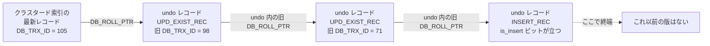

## 何を学んだか

undo ログは 2 つの役割を兼ねている。

- **ロールバック**: `ROLLBACK` されたら、書いた変更を逆順に打ち消す
- **MVCC**: 他のトランザクションが「自分には見えない新しい版」に出会ったとき、そこから古い版を復元する ([read view のページ](./read-view-and-visibility/))

この兼務が InnoDB の性格をほぼ決めている。PostgreSQL のようにテーブル本体に新旧を並べるのではなく、**テーブル本体は常に最新版だけを持ち、古い版は undo から逆算する**。だから最新版の読み書きが速く、代わりに**古い版を読む側は版鎖を歩く**。そして**誰も見なくなるまで undo を消せない**。

もう 1 つ、読むまで気づかなかったこと。**INSERT の undo と UPDATE の undo はまったく別物として扱われる。**

- INSERT の undo レコードには**主キーしか入っていない**。ロールバックは「その行を消す」だけで足りるし、MVCC 的にも「挿入前」は行が存在しないので復元する内容がない
- UPDATE の undo レコードには**変更された列の before image**が入る。ここから古い版を組み立てられる

その帰結として、**コミット時に insert undo は即座に捨てられ、update undo だけが history list に積まれる**。「INSERT ばかりのワークロードでは `History list length` が伸びない」のはこのためだ。

## ソースコードのどこか

### 入口は 1 つ

すべての undo 書き込みは [`trx_undo_report_row_operation` (`trx0rec.cc#L2117`)](https://github.com/mysql/mysql-server/blob/mysql-8.4.11/storage/innobase/trx/trx0rec.cc#L2117) を通る。`op_type` が `TRX_UNDO_INSERT_OP` か `TRX_UNDO_MODIFY_OP` かで、書く関数が分かれる。頭に短絡がある。

```cpp title="storage/innobase/trx/trx0rec.cc"
  if (flags & BTR_NO_UNDO_LOG_FLAG) {
    *roll_ptr = 0;

    return (DB_SUCCESS);
  }
```

DDL 中のインデックス構築などで undo を残さない経路があり、そのときは `roll_ptr = 0` になる。

### INSERT — 主キーだけ

```cpp title="storage/innobase/trx/trx0rec.cc"
  /* Store first some general parameters to the undo log */
  *ptr++ = TRX_UNDO_INSERT_REC;
  ptr += mach_u64_write_much_compressed(ptr, trx->undo_no);
  ptr += mach_u64_write_much_compressed(ptr, index->table->id);
  /*----------------------------------------*/
  /* Store then the fields required to uniquely determine the record
  to be inserted in the clustered index */

  for (i = 0; i < dict_index_get_n_unique(index); i++) {
```

[`trx_undo_page_report_insert` (L483)](https://github.com/mysql/mysql-server/blob/mysql-8.4.11/storage/innobase/trx/trx0rec.cc#L483)。書くのはレコード種別 + `undo_no` + テーブル ID + **PK 列だけ**。仮想列があれば追加されるが、それ以外の列は 1 バイトも書かれない。

### UPDATE / DELETE — before image

[`trx_undo_page_report_modify` (L1154)](https://github.com/mysql/mysql-server/blob/mysql-8.4.11/storage/innobase/trx/trx0rec.cc#L1154) はもっと大きい。レコード種別が 3 つに分かれる。

```cpp title="storage/innobase/trx/trx0rec.cc"
  if (!update) {
    ut_ad(!rec_get_deleted_flag(rec, dict_table_is_comp(table)));
    type_cmpl = TRX_UNDO_DEL_MARK_REC;
  } else if (rec_get_deleted_flag(rec, dict_table_is_comp(table))) {
    type_cmpl = TRX_UNDO_UPD_DEL_REC;
    ...
  } else {
    type_cmpl = TRX_UNDO_UPD_EXIST_REC;
  }
```

`update == nullptr` は DELETE、つまり**削除は「削除フラグを立てる更新」として記録される**。定数は [`include/trx0rec.h#L299-L306`](https://github.com/mysql/mysql-server/blob/mysql-8.4.11/storage/innobase/include/trx0rec.h#L299) にある (`TRX_UNDO_INSERT_REC = 11` / `UPD_EXIST_REC = 12` / `UPD_DEL_REC = 13` / `DEL_MARK_REC = 14`)。

この後に書かれるのは、レコードの info ビット、システム列 (`DB_TRX_ID` と `DB_ROLL_PTR` の**旧値**)、PK、そして**更新された列の旧値だけ**である。100 列のテーブルで 1 列だけ更新すれば、undo に載るのは 1 列分だ。

### `DB_ROLL_PTR` — 7 バイトの住所

undo レコードの位置は 7 バイトに詰められて、行の隠し列 `DB_ROLL_PTR` に入る ([行フォーマット変換](./row-format-conversion/))。

```cpp title="storage/innobase/include/trx0undo.ic"
inline roll_ptr_t trx_undo_build_roll_ptr(bool is_insert, space_id_t space_id,
                                          page_no_t page_no, ulint offset) {
  ...
  roll_ptr = (roll_ptr_t)is_insert << 55 | (roll_ptr_t)id << 48 |
             (roll_ptr_t)page_no << 16 | offset;
  return (roll_ptr);
}
```

[`trx0undo.ic#L45`](https://github.com/mysql/mysql-server/blob/mysql-8.4.11/storage/innobase/include/trx0undo.ic#L45)。内訳は次のとおり。

```
 bit 55        bits 48-54     bits 16-47        bits 0-15
+------------+--------------+-----------------+-----------+
| is_insert  | rollback seg |  page number    |  offset   |
|   1 bit    |    7 bit     |    32 bit       |  16 bit   |
+------------+--------------+-----------------+-----------+
```

最上位ビットが **insert かどうか**を持っているのが効いてくる。`trx_undo_prev_version_build` の最初の判定がこれだ。

```cpp title="storage/innobase/trx/trx0rec.cc"
  if (trx_undo_roll_ptr_is_insert(roll_ptr)) {
    /* The record rec is the first inserted version */
    return true;
  }
```

[L2480](https://github.com/mysql/mysql-server/blob/mysql-8.4.11/storage/innobase/trx/trx0rec.cc#L2480)。**この行はこのトランザクションが挿入した最初の版だ、つまりそれ以前の版は存在しない**と 1 ビットで分かる。

### 版鎖を 1 段遡る

[`trx_undo_prev_version_build` (L2447)](https://github.com/mysql/mysql-server/blob/mysql-8.4.11/storage/innobase/trx/trx0rec.cc#L2447) が、レコードと `DB_ROLL_PTR` から 1 つ前の版を組み立てる。手順は次のとおり。

1. `DB_ROLL_PTR` を分解して undo ページを取り、undo レコードを読む
2. `trx_undo_rec_get_pars` で種別・テーブル ID を取る。テーブル ID が違えば「テーブルが作り直されて、古いテーブルの undo が残っているだけ」なので打ち切る
3. `trx_undo_update_rec_get_sys_cols` で**その版の `DB_TRX_ID` と `DB_ROLL_PTR`** を取り出す。**これが次の 1 段を指すポインタになる**
4. 更新ベクタを組み立て、現在のレコードに逆適用したコピーを作る

undo レコードが purge 済みで取れなければ `false` を返す。呼び出し側はこれを `DB_MISSING_HISTORY` に変換する。



一貫読み取りはこの鎖を [`row_vers_build_for_consistent_read` (`row0vers.cc#L1249`)](https://github.com/mysql/mysql-server/blob/mysql-8.4.11/storage/innobase/row/row0vers.cc#L1249) の中で `changes_visible` が true になるまで歩く。**鎖が長いほど読みが遅くなる。**

### コミット時 — insert は捨て、update は積む

`trx_commit_in_memory` の中にこうある。

```cpp title="storage/innobase/trx/trx0trx.cc"
  if (mtr != nullptr) {
    if (trx->rsegs.m_redo.insert_undo != nullptr) {
      trx_undo_insert_cleanup(&trx->rsegs.m_redo, false);
    }

    if (trx->rsegs.m_noredo.insert_undo != nullptr) {
      trx_undo_insert_cleanup(&trx->rsegs.m_noredo, true);
    }
```

[`trx0trx.cc#L2037`](https://github.com/mysql/mysql-server/blob/mysql-8.4.11/storage/innobase/trx/trx0trx.cc#L2037)。**insert undo はコミットの瞬間に解放される。**

update undo は 1 段前の `trx_write_serialisation_history` の中で [`trx_undo_update_cleanup` (`trx0undo.cc#L1922`)](https://github.com/mysql/mysql-server/blob/mysql-8.4.11/storage/innobase/trx/trx0undo.cc#L1922) → [`trx_purge_add_update_undo_to_history` (`trx0purge.cc#L315`)](https://github.com/mysql/mysql-server/blob/mysql-8.4.11/storage/innobase/trx/trx0purge.cc#L315) に渡される。

```cpp title="storage/innobase/trx/trx0purge.cc"
  /* Add the log as the first in the history list */
  flst_add_first(rseg_header + TRX_RSEG_HISTORY,
                 undo_header + TRX_UNDO_HISTORY_NODE, mtr);

  if (update_rseg_history_len) {
    trx_sys->rseg_history_len.fetch_add(n_added_logs);
    if (trx_sys->rseg_history_len.load() >
        srv_n_purge_threads * srv_purge_batch_size) {
      srv_wake_purge_thread_if_not_active();
    }
  }
```

[L364-L374](https://github.com/mysql/mysql-server/blob/mysql-8.4.11/storage/innobase/trx/trx0purge.cc#L364)。この `trx_sys->rseg_history_len` が `SHOW ENGINE INNODB STATUS` の **`History list length`** として印字される値そのもので、出力しているのは [`lock0lock.cc#L4525`](https://github.com/mysql/mysql-server/blob/mysql-8.4.11/storage/innobase/lock/lock0lock.cc#L4525) だ。

同時に `TRX_RSEG_MAX_TRX_NO` と undo ヘッダの `TRX_UNDO_TRX_NO` に `trx->no` が書かれる。purge はこの番号でどこまで消してよいかを判断する ([purge のページ](./purge/))。

### undo セグメントの状態

[`include/trx0undo.h#L318`](https://github.com/mysql/mysql-server/blob/mysql-8.4.11/storage/innobase/include/trx0undo.h#L318) 以降に状態定数がある。

| 定数                                           | 意味                                         |
| ---------------------------------------------- | -------------------------------------------- |
| `TRX_UNDO_ACTIVE` (1)                          | 実行中のトランザクションが書いている         |
| `TRX_UNDO_CACHED` (2)                          | コミット済み。小さいので同じ rseg で使い回す |
| `TRX_UNDO_TO_PURGE` (4)                        | コミット済み。purge が消す                   |
| `TRX_UNDO_PREPARED` (6) / `PREPARED_IN_TC` (7) | XA PREPARE 済み                              |

`TRX_UNDO_PREPARED_80028` (5) が別に残っているのは、8.0.28 以前が書いた undo を読むためだ。

ページの種別は `TRX_UNDO_INSERT` (1) / `TRX_UNDO_UPDATE` (2) の 2 つ ([L311](https://github.com/mysql/mysql-server/blob/mysql-8.4.11/storage/innobase/include/trx0undo.h#L311))。**insert 用と update 用は物理的に別のページ**に書かれ、`trx_undo_page_report_insert` / `_modify` の頭にそれぞれ `ut_ad` でページ種別のアサートがある。

### ロールバック — undo を逆順に食べる

[`trx_rollback_to_savepoint_low` (`trx0roll.cc#L79`)](https://github.com/mysql/mysql-server/blob/mysql-8.4.11/storage/innobase/trx/trx0roll.cc#L79) がロールバック用のクエリグラフを組んで走らせる。実際に undo レコードを取り出すのが [`trx_roll_pop_top_rec_of_trx` (L1019)](https://github.com/mysql/mysql-server/blob/mysql-8.4.11/storage/innobase/trx/trx0roll.cc#L1019) で、`undo_no` の大きいほうから順に取る。ある程度進むと [`trx_roll_try_truncate` (L860)](https://github.com/mysql/mysql-server/blob/mysql-8.4.11/storage/innobase/trx/trx0roll.cc#L860) が undo ログの末尾を切り詰めて、ページを返す。

**ロールバックは 1 レコードずつ逆適用する。** コミットが「確定したと宣言してロックを外す」だけなのと非対称で、この差が[コミットとロールバックのページ](./commit-and-rollback-internals/)の主題になる。

## なぜそうなっているか

**undo をロールバックと MVCC で兼務させたのは、両者が必要とする情報が同じだからだ。** ロールバックには「変更前の値」が要り、MVCC にも「変更前の値」が要る。別々に持てば書き込み量が倍になる。実際、`trx_undo_page_report_modify` が書いた 1 本のレコードを、ロールバックは `row0umod.cc` が読み、MVCC は `row0vers.cc` が読む。

**INSERT の undo を PK だけにできるのは、undo の役割が「前の状態に戻すこと」だからだ。** 挿入前の状態は「行が存在しない」で、それを表すのに列の値は要らない。ロールバックには「どの行を消すか」が分かればよく、それが PK だ。MVCC 側も、挿入前の版を見たいトランザクションには「行が見えない」を返せばよい。**だから insert undo はコミット時に捨てられる**——誰も参照しないと確定するからだ。

**変更列だけを書くのは書き込み量を抑えるためだが、代償として版の復元がコストになる。** 最新版に更新ベクタを逆適用しないと古い版が得られないので、版鎖が n 段なら n 回の適用が要る。これが「長いトランザクションが同居していると読みが遅い」の直接の原因だ。

**`DB_ROLL_PTR` の最上位ビットに `is_insert` を置いたのは、版鎖の終端判定を 1 ビットで済ませるためだ。** 終端を `NULL` ポインタで表すこともできたはずだが、undo は purge で消えるので「ポインタは残っているが指す先がない」状態が普通に起きる。`is_insert` なら**指す先を読まずに**終端と判断できる。

**update undo を history list という連結リストにして rseg ヘッダに繋いだのは、purge が `trx->no` 順に処理する必要があるからだ。** `flst_add_first` で先頭に積むので、リストは新しい順に並ぶ。purge は末尾 (古いほう) から消していく。

## どう活かすか

**`History list length` が伸び続けるなら、犯人は書き手ではなく読み手である可能性が高い。** history list に積まれた undo を消せるのは purge だが、purge は「一番古い read view から見えなくなった」ものしか消せない ([purge のページ](./purge/))。RR で `BEGIN; SELECT ...;` のまま放置しているセッションが 1 本あるだけで、その間の全 UPDATE / DELETE の undo が残り続ける。`information_schema.innodb_trx` を `trx_started` 昇順で見て、最古のトランザクションを探すのが最初の一手だ。

**大量 UPDATE の直後にその範囲を読むと遅い。** 更新した行の版鎖が伸びていて、古い read view を持つセッションはそれを歩くことになる。特に**同じ行を何度も更新するワークロード** (カウンタ更新など) は、1 行あたりの版鎖が長くなる。バッチ更新は分割してコミットするほうが、版鎖も短く保てる。

**undo テーブルスペースが肥大したら `innodb_undo_log_truncate` を確認する。** 8.4 では既定 `ON` ([`ha_innodb.cc#L23125`](https://github.com/mysql/mysql-server/blob/mysql-8.4.11/storage/innobase/handler/ha_innodb.cc#L23125))、`innodb_max_undo_log_size` の既定は 1GiB ([L23113](https://github.com/mysql/mysql-server/blob/mysql-8.4.11/storage/innobase/handler/ha_innodb.cc#L23113))。これを超えた undo テーブルスペースは purge が追いついた段階で切り詰められる。**逆に言えば purge が止まっていれば truncate も起きない**ので、ディスクが減らないときはまず `History list length` を見る。

**INSERT だけのワークロードでは undo はほとんど溜まらない。** ログ収集やイベントストアのような追記専用テーブルは、insert undo がコミット時に消えるので purge の負荷にならない。逆に**論理削除 (`UPDATE ... SET deleted_at = NOW()`) は全部 update undo になる**。物理 DELETE も delete-mark の undo を残すが、こちらは purge がレコードごと消せる。

**`INSERT ... SELECT` のような長い 1 文は、途中でロールバックすると undo を全部逆適用する。** `undo_no` の本数がそのままロールバックの仕事量だ。`Lock wait timeout` でロールバックが走るケース ([デッドロック検出のページ](./deadlock-detection/)) では、この時間が読めないコストになる。巨大な DML は分割するのが安全側の設計になる。
