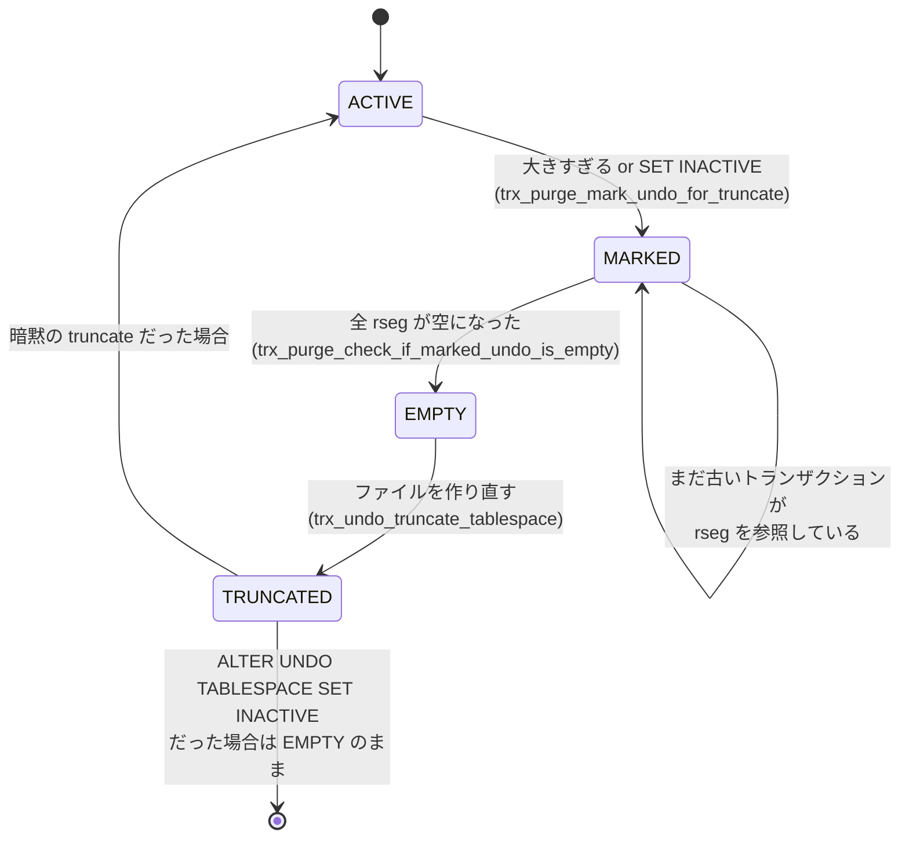

> **前提**: [undo ログ](./undo-log/) / [purge](./purge/) / [セグメントとエクステント](./fsp-segments-and-extents/)

## 何を学んだか

undo ログは 1 つのファイルに集まっているわけではない。**undo テーブルスペースが複数あり、それぞれが 128 本のロールバックセグメント (rseg) を持つ。**

```cpp title="storage/innobase/include/fsp0types.h (L402-L405)"
constexpr size_t FSP_MIN_UNDO_TABLESPACES = 2;
constexpr size_t FSP_MAX_UNDO_TABLESPACES = TRX_SYS_N_RSEGS - 1;
constexpr size_t FSP_IMPLICIT_UNDO_TABLESPACES = 2;
constexpr size_t FSP_MAX_ROLLBACK_SEGMENTS = TRX_SYS_N_RSEGS;
```

**最小が 2 で、既定も 2。** 1 つではいけない理由がはっきりしている。undo テーブルスペースを truncate する間、そこは使えなくなる。**使えない間の書き込み先が要るので、常に 2 つ以上が要る。**

```cpp title="storage/innobase/trx/trx0purge.cc (L1237-L1240)"
  /* In order to implicitly select an undo space to truncate, we need
  at least 2 active UNDO tablespaces.  As long as there is one undo
  tablespace active the server will continue to operate. */
```

そして truncate は、ファイルを縮めるのではなく**作り直す**。しかも空間 ID が変わる。

```cpp title="storage/innobase/trx/trx0purge.cc (L1451-L1452)"
  /* Do the truncate.  This will change the space_id of the marked_space. */
  bool success = trx_undo_truncate_tablespace(marked_space);
```

## なぜそうなっているか

### なぜ縮めずに作り直すのか

InnoDB のテーブルスペースは、**ファイルの途中を返す仕組みを持っていない** ([セグメントとエクステント](./fsp-segments-and-extents/))。エクステントはフリーリストに戻るが、ファイルサイズは減らない。undo も例外ではない。

undo が特別なのは、**全部空になる瞬間を作れる**ことだ。通常のテーブルは行が残っている限り縮められないが、undo は purge がすべて回収すれば中身がゼロになる。そこまで持っていければ、ファイルを捨てて新しく作れる。

代わりに、その間その undo テーブルスペースは使えない。だから最小 2 つ。

### 3 段の手続き

truncate は 1 回のバッチでは終わらない。purge が回るたびに少しずつ進む状態機械になっている。



**マークした瞬間から新しいトランザクションはそこに rseg を割り当てられなくなる。** 既にそこを使っているトランザクションが終わり、その undo が purge されるのを待つ。

空になったかの判定は、rseg ごとに 2 つの条件を見る。

```cpp title="storage/innobase/trx/trx0purge.cc (L1358-L1367)"
  for (auto rseg : *marked_rsegs) {
    rseg->latch();

    if (rseg->trx_ref_count > 0) {
      /* This rseg is still being held by an active transaction. */
      all_free = false;
    } else if (rseg->last_page_no != FIL_NULL) {
      /* This rseg still has data to be purged. */
      all_free = false;
    }
```

- **`trx_ref_count > 0`** — まだ生きているトランザクションがこの rseg を掴んでいる
- **`last_page_no != FIL_NULL`** — purge されていない undo が残っている

**どちらも「長いトランザクションが 1 本ある」だけで真になる。** truncate が進まない原因の大半はこれで、`innodb_undo_log_truncate` を触っても変わらない ([purge](./purge/))。

### マークの条件

```cpp title="storage/innobase/trx/trx0purge.cc (L1242-L1276)"
  /* Look for any undo space that is inactive explicitly. */
  auto undo_ts = undo::spaces->find_first_inactive_explicit(&num_active);
  if (undo_ts != nullptr) {
    undo_trunc->mark(undo_ts);
...
  /* There may be some reasons not to truncate implicitly.
  If truncate is disabled, do not truncate. */
  if (!srv_undo_log_truncate) {
    return (false);
  }

  if (normal_operation) {
    /* Skip truncate if there is only one active undo tablespace to check. */
    if (num_active == 1) {
      return (false);
    }
...
    /* Wait at least one second between searches. */
    if (undo_trunc->check_timer() < PURGE_CHECK_UNDO_TRUNCATE_DELAY_IN_MS) {
```

優先順位が読み取れる。

1. **`ALTER UNDO TABLESPACE ... SET INACTIVE` で明示的に止められたもの**が最優先。これは `innodb_undo_log_truncate` の設定に関係なく処理される
2. 次に**大きすぎるもの** (`innodb_max_undo_log_size` 超え)。こちらは `innodb_undo_log_truncate=ON` のときだけ
3. アクティブが 1 つしかないなら何もしない
4. 探索は 1 秒に 1 回まで

**「`innodb_undo_log_truncate` を OFF にしても、明示的な `SET INACTIVE` は効く」**というのが運用上の逃げ道になる。

### 対象は round-robin で選ぶ

```cpp title="storage/innobase/include/trx0purge.h (L939-L946)"
    /** Increment the scanning position in a round-robin fashion.
    @return undo space_num at incremented scanning position. */
    space_id_t increment_scan() const {
      /** Round-robin way of selecting an undo tablespace for the truncate
      operation. Once we reach the end of the list of known undo tablespace
      IDs, move back to the first undo tablespace ID. This will scan active
      as well as inactive undo tablespaces. */
      s_scan_pos = (s_scan_pos + 1) % undo::spaces->size();
```

**いちばん大きいものを選ぶのではなく、順番に見ていく。** 特定の 1 つに truncate が集中して、他が伸び続けるのを避けるためだ。

### 高速シャットダウンでは truncate しない

```cpp title="storage/innobase/trx/trx0purge.cc (L1222-L1227)"
  /* Save time during a fast shutdown by skipping undo truncation.
  This does not affect correctness since undo tablespaces that need
  truncation can be truncated during or after startup.*/
  if (in_fast_shutdown) {
    return (false);
  }
```

`innodb_fast_shutdown` が 0 でなければ飛ばす。**「シャットダウンが速い代わりに、次の起動で undo の後始末が走る」**というトレードオフがここにある。

## ソースコードのどこか

### purge の中の位置づけ

`trx_purge_truncate_history` ([`trx0purge.cc#L1594`](https://github.com/mysql/mysql-server/blob/mysql-8.4.11/storage/innobase/trx/trx0purge.cc#L1594)) は、rseg の履歴リストから古い undo を切り離す処理で、**undo テーブルスペースだけでなくシステムテーブルスペースと一時テーブルスペースの rseg も回る**。

```cpp title="storage/innobase/trx/trx0purge.cc (L1638-L1652)"
  /* Purge rollback segments in the system tablespace, if any.
  Use an s-lock for the whole list since it can have gaps and
  may be sorted when added to. */
  trx_sys->rsegs.s_lock();
  for (auto rseg : trx_sys->rsegs) {
    trx_purge_truncate_rseg_history(rseg, limit);
  }
  trx_sys->rsegs.s_unlock();

  /* Purge rollback segments in the temporary tablespace. */
  trx_sys->tmp_rsegs.s_lock();
  for (auto rseg : trx_sys->tmp_rsegs) {
    trx_purge_truncate_rseg_history(rseg, limit);
  }
```

古いバージョンから移行したインスタンスでは、システムテーブルスペース (`ibdata1`) の中に rseg が残っていることがある。**`ibdata1` が伸びたまま縮まないのは、そこに undo が居るからかもしれない**、という手掛かりになる。

一時テーブルスペースの rseg は[一時テーブルのページ](./temporary-tables-in-innodb/)にある `trx->rsegs.m_noredo` の側だ。

### 設定値

| 変数                                   | 既定       | 意味                                     |
| -------------------------------------- | ---------- | ---------------------------------------- |
| `innodb_undo_tablespaces`              | 2 (非推奨) | 暗黙に作る undo テーブルスペースの数     |
| `innodb_rollback_segments`             | 128        | **1 テーブルスペースあたり**の rseg 数   |
| `innodb_max_undo_log_size`             | 1GB        | これを超えると暗黙の truncate 対象になる |
| `innodb_undo_log_truncate`             | ON         | 暗黙の truncate を行うか                 |
| `innodb_purge_rseg_truncate_frequency` | 128        | purge 何回に 1 回 rseg の履歴を切るか    |

`innodb_undo_tablespaces` は**非推奨**になっていて ([`ha_innodb.cc#L23104-L23106`](https://github.com/mysql/mysql-server/blob/mysql-8.4.11/storage/innobase/handler/ha_innodb.cc#L23104))、増やしたいときは `CREATE UNDO TABLESPACE` を使う。

`innodb_rollback_segments` が「テーブルスペースあたり」であることは見落としやすい。**2 つの undo テーブルスペースがあれば rseg は 256 本**で、さらに一時テーブルスペースにも同数作られる。

### 状態を見る

```sql
SELECT NAME, SPACE, FILE_SIZE, ALLOCATED_SIZE, STATE
  FROM information_schema.INNODB_TABLESPACES
 WHERE SPACE_TYPE = 'Undo';
```

`STATE` が `active` / `inactive` / `empty` のどれかを取る。**`inactive` のまま止まっているなら、rseg を掴んでいるトランザクションが居る。**

## どう活かすか

### undo が膨らんだときの順序

1. **原因は purge の停止であることがほとんど** — `INNODB_TRX` を `trx_started` 順に見て、古いトランザクションを探す ([purge](./purge/))
2. **truncate が有効かを確認** — `innodb_undo_log_truncate` と、アクティブな undo テーブルスペースが 2 つ以上あるか
3. **明示的に空にする** — 特定のファイルを縮めたいなら次の手順が確実

```sql
ALTER UNDO TABLESPACE tablespace_name SET INACTIVE;
-- STATE が empty になるまで待つ
SELECT NAME, STATE FROM information_schema.INNODB_TABLESPACES
 WHERE SPACE_TYPE = 'Undo';
ALTER UNDO TABLESPACE tablespace_name SET ACTIVE;
```

**`SET INACTIVE` は `innodb_undo_log_truncate=OFF` でも効く。** ただし空になるかどうかは長いトランザクションの有無に依存するので、これも万能ではない。

### 追加するのは truncate を回すため

`CREATE UNDO TABLESPACE` で 3 つ目、4 つ目を作る動機は、性能よりも**truncate の余裕を作ること**にある。2 つしかないと、1 つを truncate している間は残り 1 つに全書き込みが集中する。書き込みが多いシステムでは 4 つ程度にしておくと、truncate 中の偏りが緩む。

rseg の本数はテーブルスペースあたり 128 で固定的に十分なので、**「rseg が足りない」を理由に増やす場面はほぼない**。

### `ibdata1` が縮まないとき

undo をシステムテーブルスペースに置いていた古い構成から移行した場合、`ibdata1` の中に rseg が残る。**システムテーブルスペースは truncate できない**ので、これを取り除くにはダンプ + 再構築しかない。

5.7 以前から引き継いだインスタンスで `ibdata1` が数十 GB ある場合、中身の内訳 (undo、change buffer、データ辞書の残骸) を確認したうえで、作り直しを検討する価値がある。

### 監視するなら 2 つ

```sql
SELECT NAME, STATE FROM information_schema.INNODB_TABLESPACES
 WHERE SPACE_TYPE = 'Undo';

SELECT count FROM information_schema.INNODB_METRICS
 WHERE name = 'trx_rseg_history_len';
```

**`inactive` のまま数分以上動かない undo テーブルスペース**と、**伸び続ける history list length** の 2 つを見ておけば、undo が膨らむ前に気付ける。ファイルサイズそのものを監視すると、正常な増減と区別できず誤検知が増える。
