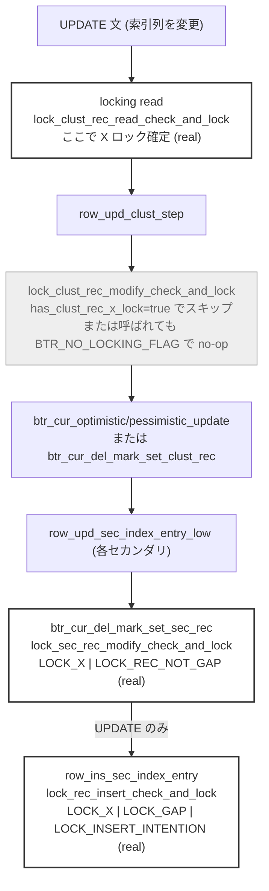

> **前提**: [ロックの種類 (InnoDB)](./lock-modes-and-types/) / [1 行に X ロックが付くまで](./lock-acquisition-walkthrough/) / [INSERT / UPDATE / DELETE の実装](./row-dml-implementation/)

## 何を学んだか

`*_modify_check_and_lock` という名前から、「UPDATE/DELETE が行を書き換える直前にロックを取る関数」だと想像していた。実際に呼び出し元まで遡ると、想像とは違う実態が見えた。

**1. モードは常に `LOCK_X | LOCK_REC_NOT_GAP` 固定。** 読み取り系 (`lock_clust_rec_read_check_and_lock` など、[1 行に X ロックが付くまで](./lock-acquisition-walkthrough/) が扱う) は呼び出し元が渡す `mode | gap_mode` を素通しするが、更新系の 2 関数は引数にモードを取らず、関数内部で `LOCK_X | LOCK_REC_NOT_GAP` を書いている。**ギャップは一切取らない。**

**2. クラスタード側だけが暗黙ロック変換 (`lock_rec_convert_impl_to_expl`) を呼ぶ。** これは [暗黙ロック](./implicit-locks/) が既に扱っている区別なので、ここでは繰り返さない。

**3. DELETE は本当に `lock_clust_rec_modify_check_and_lock` を経由する。** ただし `btr_cur_del_mark_set_clust_rec` からの呼び出しは、渡す `flags` を呼び出し元の値ではなく**常に `BTR_NO_LOCKING_FLAG` に固定**している。この関数の中で `lock_clust_rec_modify_check_and_lock` が実際にロックを評価することは**ない**。

**4. 通常の SQL UPDATE (主キー以外の更新) では、クラスタード側の呼び出しは 1 回も発生しない。** `row_upd_clust_step` は `node->has_clust_rec_x_lock` が真なら呼び出し自体をスキップし、`row_upd_clust_rec` は `btr_cur_optimistic_update` / `btr_cur_update_in_place` / `btr_cur_pessimistic_update` に**常に `flags | BTR_NO_LOCKING_FLAG` を渡す**。そして MySQL インターフェース用の update ノード (`row_create_update_node_for_mysql`) は `has_clust_rec_x_lock = true` を無条件に立てる。**通常の SQL 経由の UPDATE/DELETE では、クラスタード側の `lock_clust_rec_modify_check_and_lock` は呼ばれないか、呼ばれても即座に `DB_SUCCESS` を返す no-op でしかない。**

**5. 一方セカンダリ側 (`lock_sec_rec_modify_check_and_lock`) は正真正銘のロック評価を行う。** 呼び出し元 `row_upd_sec_index_entry_low` は `flags = 0` をローカルで宣言しており、クラスタード側のような no-op 化の仕掛けが一切ない。**セカンダリインデックスを持つ UPDATE/DELETE で実際にロック競合が評価されるのは、ほぼこの経路だけだ。**

## なぜそうなっているか

**クラスタード側が素通りするのは、MySQL の UPDATE/DELETE 実行モデルが「read してから write する」構造だからだ。** ハンドラ API は行を 1 行ずつ locking read (`select_lock_type = LOCK_X` での `rnd_next`/`index_read`) で取得し、WHERE 条件に合えば `ha_update_row`/`delete_row` を呼ぶ。locking read の内部は `sel_set_rec_lock` → `lock_clust_rec_read_check_and_lock` ([1 行に X ロックが付くまで](./lock-acquisition-walkthrough/)) で、この時点で既に暗黙ロックの変換も含めて X ロックが確定している。書き込み時点でもう一度同じチェックをすれば、ロックの評価コスト (`lock_rec_has_expl` / `lock_rec_other_has_conflicting` の走査) と暗黙ロック変換のコストを二重に払うことになる。**`has_clust_rec_x_lock` と `BTR_NO_LOCKING_FLAG` は、read 側で払った代金を write 側で請求し直さないためのフラグ**だ。

`row_upd_clust_step` のコード自身がこの前提を明言している。

```cpp title="storage/innobase/row/row0upd.cc (L3080-3094)"
  rec = pcur->get_rec();
  offsets = rec_get_offsets(rec, index, offsets_, ULINT_UNDEFINED,
                            UT_LOCATION_HERE, &heap);

  if (!node->has_clust_rec_x_lock) {
    err = lock_clust_rec_modify_check_and_lock(flags, pcur->get_block(), rec,
                                               index, offsets, thr);
    if (err != DB_SUCCESS) {
      mtr_commit(&mtr);
      goto exit_func;
    }
  }

  ut_ad(lock_trx_has_rec_x_lock(thr, index->table, pcur->get_block(),
                                page_rec_get_heap_no(rec)));
```

**チェックをスキップしてもしなくても、直後の `ut_ad` は「もう X ロックを持っている」ことをアサートする。** これが分岐の意味を要約している——`lock_clust_rec_modify_check_and_lock` は「ロックを取る」関数ではなく「ロックを持っていることを保証する (持っていなければここで取る)」関数であり、通常の SQL 経路では保証がすでに read 側で満たされているので何もしない。

`row_upd_clust_rec` のコメントはさらに直接的だ。

```cpp title="storage/innobase/row/row0upd.cc (L2840-2852)"
  /* Try optimistic updating of the record, keeping changes within
  the page; we do not check locks because we assume the x-lock on the
  record to update */

  if (node->cmpl_info & UPD_NODE_NO_SIZE_CHANGE) {
    err = btr_cur_update_in_place(flags | BTR_NO_LOCKING_FLAG, btr_cur, offsets,
                                  node->update, node->cmpl_info, thr,
                                  thr_get_trx(thr)->id, mtr);
  } else {
    err = btr_cur_optimistic_update(
        flags | BTR_NO_LOCKING_FLAG, btr_cur, &offsets, offsets_heap,
        node->update, node->cmpl_info, thr, thr_get_trx(thr)->id, mtr);
  }
```

**「ロックはチェックしない、なぜなら X ロックを持っていると仮定しているから」とコメントに書いてある。** 仮定ではなく、`has_clust_rec_x_lock` が事実そうなるように保証している側だ。

**セカンダリ側が素通りしない (`flags = 0` 固定) のは、read 側の locking read がそのセカンダリレコードを触っているとは限らないからだ。** WHERE 句に使われたインデックスと、UPDATE で値が変わるインデックスは別のことが多い。read が PK やインデックス A 経由で行を見つけても、インデックス B の該当エントリに対する明示ロックは (暗黙ロックも) まだ存在しない可能性がある。だから書き込み側で改めて `lock_rec_lock` を通す必要があり、`lock_sec_rec_modify_check_and_lock` にはクラスタード側のような「スキップしてよい」根拠がない。ここで [セカンダリインデックスと MVCC](./secondary-index-visibility/) が扱う `PAGE_MAX_TRX_ID` の更新 (`page_update_max_trx_id`) も同時に行われる——ロック評価と可視性メタデータの更新が同じ関数に同居している。

**gap を取らないのは、更新系がすでに位置の決まった 1 行を保護するだけで、範囲の存在を確定させる仕事は負っていないからだ。** ファントム防止のための gap lock は読み取り側の next-key lock ([ロックの種類](./lock-modes-and-types/)) と、INSERT 側の `LOCK_GAP | LOCK_INSERT_INTENTION` ([INSERT のロック](./insert-and-duplicate-check/)) がすでに担っている。UPDATE/DELETE の書き込み自体は「このレコードを他人に触らせない」以上のことをする必要がなく、`LOCK_REC_NOT_GAP` はその守備範囲をそのまま表している。

## ソースコードのどこか

### 関数定義そのもの — 対称に見えて非対称

```cpp title="storage/innobase/lock/lock0lock.cc (L5350-5395)"
dberr_t lock_clust_rec_modify_check_and_lock(
    ulint flags, const buf_block_t *block, const rec_t *rec,
    dict_index_t *index, const ulint *offsets, que_thr_t *thr) {
  ...
  if (flags & BTR_NO_LOCKING_FLAG) {
    return (DB_SUCCESS);
  }
  ...
  lock_rec_convert_impl_to_expl(block, rec, index, offsets);
  {
    locksys::Shard_latch_guard guard{UT_LOCATION_HERE, block->get_page_id()};
    err = lock_rec_lock(true, SELECT_ORDINARY, LOCK_X | LOCK_REC_NOT_GAP, block,
                        heap_no, index, thr);
  }
  ...
}
```

[`lock0lock.cc#L5350`](https://github.com/mysql/mysql-server/blob/mysql-8.4.11/storage/innobase/lock/lock0lock.cc#L5350)。`BTR_NO_LOCKING_FLAG` の判定 ([L5367-5369](https://github.com/mysql/mysql-server/blob/mysql-8.4.11/storage/innobase/lock/lock0lock.cc#L5367)) が `lock_rec_convert_impl_to_expl` の呼び出し ([L5378](https://github.com/mysql/mysql-server/blob/mysql-8.4.11/storage/innobase/lock/lock0lock.cc#L5378)) より前にある。**フラグが立っていれば、暗黙ロック変換すら実行されずに関数を抜ける。**

```cpp title="storage/innobase/lock/lock0lock.cc (L5402-5457)"
dberr_t lock_sec_rec_modify_check_and_lock(
    ulint flags, buf_block_t *block, const rec_t *rec, dict_index_t *index,
    que_thr_t *thr, mtr_t *mtr) {
  ...
  if (flags & BTR_NO_LOCKING_FLAG) {
    return (DB_SUCCESS);
  }
  ...
  {
    locksys::Shard_latch_guard guard{UT_LOCATION_HERE, block->get_page_id()};
    err = lock_rec_lock(true, SELECT_ORDINARY, LOCK_X | LOCK_REC_NOT_GAP, block,
                        heap_no, index, thr);
  }
  ...
  if (err == DB_SUCCESS || err == DB_SUCCESS_LOCKED_REC) {
    page_update_max_trx_id(block, buf_block_get_page_zip(block),
                           thr_get_trx(thr)->id, mtr);
    err = DB_SUCCESS;
  }
  ...
}
```

[`lock0lock.cc#L5402`](https://github.com/mysql/mysql-server/blob/mysql-8.4.11/storage/innobase/lock/lock0lock.cc#L5402)。`page_update_max_trx_id` の呼び出し ([L5452-5453](https://github.com/mysql/mysql-server/blob/mysql-8.4.11/storage/innobase/lock/lock0lock.cc#L5452)) は成功時に必ず走る。**この関数自身は `flags` の中身をどこからも制御していない**——制御するのは常に呼び出し元だ、という点が次の節で効いてくる。

### クラスタード側の呼び出し元 — すべて no-op に落ちる

`git grep -n "lock_clust_rec_modify_check_and_lock" -- storage/innobase` で見つかる呼び出し元は 3 箇所ある。

| 呼び出し元                                                                                                                                             | 渡す `flags`                                                                                                                                                                                                                                                                                            | 結果                                                                                                                                                                    |
| ------------------------------------------------------------------------------------------------------------------------------------------------------ | ------------------------------------------------------------------------------------------------------------------------------------------------------------------------------------------------------------------------------------------------------------------------------------------------------- | ----------------------------------------------------------------------------------------------------------------------------------------------------------------------- |
| `row_upd_clust_step` ([`row0upd.cc#L3085`](https://github.com/mysql/mysql-server/blob/mysql-8.4.11/storage/innobase/row/row0upd.cc#L3085))             | `node->has_clust_rec_x_lock` が真なら**呼び出し自体をスキップ**                                                                                                                                                                                                                                         | MySQL 経由の DML では常にスキップ                                                                                                                                       |
| `btr_cur_upd_lock_and_undo` ([`btr0cur.cc#L3113`](https://github.com/mysql/mysql-server/blob/mysql-8.4.11/storage/innobase/btr/btr0cur.cc#L3113))      | 呼び出し元 (`row_upd_clust_rec`) が `flags \| BTR_NO_LOCKING_FLAG` を渡す ([`row0upd.cc#L2845`](https://github.com/mysql/mysql-server/blob/mysql-8.4.11/storage/innobase/row/row0upd.cc#L2845), [L2850](https://github.com/mysql/mysql-server/blob/mysql-8.4.11/storage/innobase/row/row0upd.cc#L2850)) | `if (!(flags & BTR_NO_LOCKING_FLAG))` ([L3112](https://github.com/mysql/mysql-server/blob/mysql-8.4.11/storage/innobase/btr/btr0cur.cc#L3112)) で呼び出し自体がスキップ |
| `btr_cur_del_mark_set_clust_rec` ([`btr0cur.cc#L4317`](https://github.com/mysql/mysql-server/blob/mysql-8.4.11/storage/innobase/btr/btr0cur.cc#L4317)) | **呼び出し元の値を無視して `BTR_NO_LOCKING_FLAG` を直書き**                                                                                                                                                                                                                                             | 呼ばれるが即座に `DB_SUCCESS` (no-op)                                                                                                                                   |

```cpp title="storage/innobase/btr/btr0cur.cc (L4317-4318)"
  err = lock_clust_rec_modify_check_and_lock(BTR_NO_LOCKING_FLAG, block, rec,
                                             index, offsets, thr);
```

`btr_cur_del_mark_set_clust_rec` は DELETE (`row_upd_del_mark_clust_rec` 経由、[`row0upd.cc#L2990`](https://github.com/mysql/mysql-server/blob/mysql-8.4.11/storage/innobase/row/row0upd.cc#L2990)) と、主キーを変える UPDATE の delete-mark 段階 (`row_upd_clust_rec_by_insert` 経由、[`row0upd.cc#L2626`](https://github.com/mysql/mysql-server/blob/mysql-8.4.11/storage/innobase/row/row0upd.cc#L2626)) の両方から呼ばれる。**呼び出し元がどちらであっても、渡す `flags` はこの関数自身が上書きするので結果は変わらない。** DELETE も PK 更新も、`lock_clust_rec_modify_check_and_lock` は必ず通過するが、必ず no-op で通過する。

`row_upd_clust_step` のスキップ条件を握っているのは `node->has_clust_rec_x_lock` で、これは MySQL インターフェース用の update ノードでは無条件に真だ。

```cpp title="storage/innobase/row/row0mysql.cc (L1768)"
  node->has_clust_rec_x_lock = true;
```

[`row_create_update_node_for_mysql`](https://github.com/mysql/mysql-server/blob/mysql-8.4.11/storage/innobase/row/row0mysql.cc#L1739) が作るこの update ノードは、`row_get_prebuilt_update_vector` ([`row0mysql.cc#L1793-1799`](https://github.com/mysql/mysql-server/blob/mysql-8.4.11/storage/innobase/row/row0mysql.cc#L1793)) を通じて `prebuilt->upd_node` にキャッシュされ、**`ha_innobase::update_row` / `delete_row` が発行するすべての SQL UPDATE/DELETE がこのノードを使う。** つまり、通常の SQL 経由では `has_clust_rec_x_lock` は常に真で、`row_upd_clust_step` は `lock_clust_rec_modify_check_and_lock` を一度も呼ばない。

**結論: 通常の SQL UPDATE/DELETE がクラスタードインデックスに対して新たに X ロックを取る瞬間は、書き込み経路のどこにも存在しない。** 実際に X ロックが確定するのは、その行を見つけた locking read ([`lock_clust_rec_read_check_and_lock`](https://github.com/mysql/mysql-server/blob/mysql-8.4.11/storage/innobase/lock/lock0lock.cc#L5509)、[1 行に X ロックが付くまで](./lock-acquisition-walkthrough/) が経路を追っている) の時点だ。

### セカンダリ側の呼び出し元 — 1 回の UPDATE で 2 種類の実ロック取得点を通る

セカンダリ側は `row_upd_sec_index_entry_low` の中に閉じている。

```cpp title="storage/innobase/row/row0upd.cc (L2150-2163)"
[[nodiscard]] static dberr_t row_upd_sec_index_entry_low(upd_node_t *node,
                                                         dtuple_t *old_entry,
                                                         que_thr_t *thr) {
  ...
  ulint flags = 0;
```

[`row0upd.cc#L2150`](https://github.com/mysql/mysql-server/blob/mysql-8.4.11/storage/innobase/row/row0upd.cc#L2150)。`flags` はここでローカルに `0` として宣言されており、クラスタード側のような `has_clust_rec_x_lock` 相当の迂回路がない。**この関数を通る限り、`lock_sec_rec_modify_check_and_lock` は必ず実際にロックを評価する。**

同じ関数の中に、性質の異なる 2 つの呼び出しがある。

```cpp title="storage/innobase/row/row0upd.cc (L2055-2063)"
      /* Delete mark the old index record; it can already be
      delete marked if we return after a lock wait in
      row_ins_sec_index_entry() afterwards */
      if (!rec_get_deleted_flag(rec, dict_table_is_comp(index->table))) {
        err = btr_cur_del_mark_set_sec_rec(flags, btr_cur, true, thr, &mtr);
        if (err != DB_SUCCESS) {
          break;
        }
      }
```

```cpp title="storage/innobase/row/row0upd.cc (L2369-2380)"
  if (node->is_delete || err != DB_SUCCESS) {
    goto func_exit;
  }
  ...
  /* Build a new index entry */
  entry = row_build_index_entry(node->upd_row, node->upd_ext, index, heap);
  ut_a(entry);

  /* Insert new index entry */
  err = row_ins_sec_index_entry(index, entry, thr, false);
```

- **前半 ([L2059](https://github.com/mysql/mysql-server/blob/mysql-8.4.11/storage/innobase/row/row0upd.cc#L2059))**: 古いエントリを delete-mark。`btr_cur_del_mark_set_sec_rec` ([`btr0cur.cc#L4434`](https://github.com/mysql/mysql-server/blob/mysql-8.4.11/storage/innobase/btr/btr0cur.cc#L4434)) が `lock_sec_rec_modify_check_and_lock` を呼び、`LOCK_X | LOCK_REC_NOT_GAP` で**自分がこれから消すエントリを保護する**
- **後半 ([L2380](https://github.com/mysql/mysql-server/blob/mysql-8.4.11/storage/innobase/row/row0upd.cc#L2380))**: `node->is_delete` なら実行されない (DELETE はここで終わり)。UPDATE で索引列が変わったときだけ、新しいエントリを `row_ins_sec_index_entry` で挿入する。ここで動くのは `lock_rec_insert_check_and_lock` (`LOCK_X | LOCK_GAP | LOCK_INSERT_INTENTION`) で、こちらは [INSERT のロック](./insert-and-duplicate-check/) の管轄——**重複検査のためにギャップを取る、性質の違うロック取得点**だ

**同じ 1 本の UPDATE 文が、同じセカンダリインデックスに対して「ギャップを取らない delete-mark 用ロック」と「ギャップを取る insert 用ロック」という 2 種類のロックを、連続する 2 つの関数呼び出しで取得する。**

### 経路の全体像



DELETE の場合は `WRITE` が `btr_cur_del_mark_set_clust_rec` になり、`SECINS` を通らずに `SECDM` で止まる (`row_upd_sec_index_entry_low` の `is_delete` 分岐、[L2369](https://github.com/mysql/mysql-server/blob/mysql-8.4.11/storage/innobase/row/row0upd.cc#L2369))。**クラスタード側の枠が常に灰色 (no-op) なのがこの経路の要点**で、実線で塗った 3 箇所 (locking read / セカンダリ delete-mark / セカンダリ insert) だけが実際にロック競合を評価する。

### semi-consistent read との位置関係

`READ` の枠 (`lock_clust_rec_read_check_and_lock` を `SELECT_SKIP_LOCKED` で呼ぶ経路) の直後、RC で条件に合わなかった行に対しては、取得したロックをその場で外す処理が入りうる。詳細と実装 (`row_vers_build_for_semi_consistent_read` / `unlock_row`) は [RR と RC の違い](./locking-in-rr-vs-rc/) の管轄なので立ち入らないが、**この解放は上の図の `CLUST` (no-op) より前、`READ` の直後に起きる**という順序だけ押さえておく。

## どう活かすか

**「UPDATE 文がスキャンした行を、条件に合わなくてもロックする」の正体は read 側にある。** 更新系は `LOCK_X | LOCK_REC_NOT_GAP` を書き込み時に取る、という理解のままだと「WHERE に合わない行はロックされないはず」と考えがちだが、実際には書き込み側 (`lock_clust_rec_modify_check_and_lock`) はほぼ何もしていない。**スキャン中に行を X ロックしているのは locking read そのもの**で、これは行が条件に合うかどうかを判定する**前**に走る。RR ではこのロックはそのまま残り、RC では semi-consistent read が条件に合わない行だけその場で外す ([RR と RC の違い](./locking-in-rr-vs-rc/))。「UPDATE が原因不明にロックを広く持つ」という調査では、`*_modify_check_and_lock` ではなく locking read 側を疑うべきだと分かる。

**インデックス本数が効くのは「B+tree への書き込み回数」だけでなく「実ロック評価の回数」でもある。** [INSERT / UPDATE / DELETE の実装](./row-dml-implementation/) が示した「セカンダリ N 本に関係する UPDATE は 1 + 2N 回の B+tree 操作」という数え方に、ロックの視点を重ねると次のようになる。

| 操作                       | クラスタードのロック評価                          | セカンダリのロック評価 (1 本あたり)       |
| -------------------------- | ------------------------------------------------- | ----------------------------------------- |
| UPDATE (非索引列のみ)      | 0 (read 側で既に完了、write 側は no-op)           | 0                                         |
| UPDATE (索引列 n 本に関係) | 0                                                 | delete-mark 1 回 + insert 1 回 = 2 回 × n |
| DELETE                     | 0 (`btr_cur_del_mark_set_clust_rec` は必ず no-op) | delete-mark 1 回 × (全セカンダリ本数)     |

**更新される列を含むセカンダリインデックスが、この章で唯一「実際に競合を評価するコード」を通る場所**であり、クラスタードインデックスはどれだけ本数が多くても書き込み時のロック評価には関与しない。ロック競合のプロファイリングで的を絞るなら、まずセカンダリインデックス側を疑う。

**DELETE がプロファイルに `update` 系の関数を残す理由と、その中身。** DELETE は `row_upd_del_mark_clust_rec` → `btr_cur_del_mark_set_clust_rec` という UPDATE 系の関数を通る ([INSERT / UPDATE / DELETE の実装](./row-dml-implementation/) の既存の結論)。この章で追加できるのは、**その `btr_cur_del_mark_set_clust_rec` 内部の `lock_clust_rec_modify_check_and_lock` 呼び出しは、DELETE であっても常に `BTR_NO_LOCKING_FLAG` で即終了する**という事実だ。DELETE 1 行あたりの実ロック評価コストは、クラスタードではなくセカンダリインデックスの本数分だけ発生する。

## 最終確認用の一覧

本文で引用した関数名・行番号 (すべて `mysql-8.4.11` タグでの `git show` 済み)。

| ファイル                             | シンボル/内容                                                                                                                                    | 行                          |
| ------------------------------------ | ------------------------------------------------------------------------------------------------------------------------------------------------ | --------------------------- |
| `storage/innobase/lock/lock0lock.cc` | `dberr_t lock_clust_rec_modify_check_and_lock` (`BTR_NO_LOCKING_FLAG` 判定 L5367-5369、convert 呼び出し L5378、`LOCK_X\|LOCK_REC_NOT_GAP` L5384) | L5350-5395                  |
| `storage/innobase/lock/lock0lock.cc` | `dberr_t lock_sec_rec_modify_check_and_lock` (`LOCK_X\|LOCK_REC_NOT_GAP` L5439、`page_update_max_trx_id` L5452-5453)                             | L5402-5457                  |
| `storage/innobase/btr/btr0cur.cc`    | `static inline dberr_t btr_cur_upd_lock_and_undo` (セカンダリ分岐 L3105、クラスタード分岐のガード L3112、呼び出し L3113)                         | L3077-3117                  |
| `storage/innobase/btr/btr0cur.cc`    | `dberr_t btr_cur_del_mark_set_clust_rec` (`BTR_NO_LOCKING_FLAG` 直書き呼び出し)                                                                  | L4289 (呼び出し L4317-4318) |
| `storage/innobase/btr/btr0cur.cc`    | `dberr_t btr_cur_del_mark_set_sec_rec`                                                                                                           | L4434 (呼び出し L4448-4449) |
| `storage/innobase/row/row0upd.cc`    | `static dberr_t row_upd_clust_rec` (no-op 化コメント L2840-2842、`flags\|BTR_NO_LOCKING_FLAG` L2845/L2850)                                       | L2796                       |
| `storage/innobase/row/row0upd.cc`    | `static dberr_t row_upd_clust_rec_by_insert` (`btr_cur_del_mark_set_clust_rec` 呼び出し)                                                         | L2561 (呼び出し L2626)      |
| `storage/innobase/row/row0upd.cc`    | `static dberr_t row_upd_del_mark_clust_rec` (`btr_cur_del_mark_set_clust_rec` 呼び出し)                                                          | L2958 (呼び出し L2990)      |
| `storage/innobase/row/row0upd.cc`    | `static dberr_t row_upd_sec_index_entry_low` (`flags = 0` L2163、delete-mark 呼び出し L2059、insert 呼び出し L2380)                              | L2150-2385                  |
| `storage/innobase/row/row0upd.cc`    | `static dberr_t row_upd_clust_step` (ガード L3084、呼び出し L3085-3086、直後の `ut_ad` L3093-3094)                                               | L3008                       |
| `storage/innobase/row/row0mysql.cc`  | `upd_node_t *row_create_update_node_for_mysql` (`has_clust_rec_x_lock = true`)                                                                   | L1739 (該当行 L1768)        |
| `storage/innobase/row/row0mysql.cc`  | `row_get_prebuilt_update_vector` (`prebuilt->upd_node` へのキャッシュ)                                                                           | L1793-1799                  |
| `storage/innobase/pars/pars0pars.cc` | `pars_update_statement` (`has_clust_rec_x_lock` の非 MySQL 経路、InnoDB 内部パーサ限定)                                                          | L1120-1129                  |
