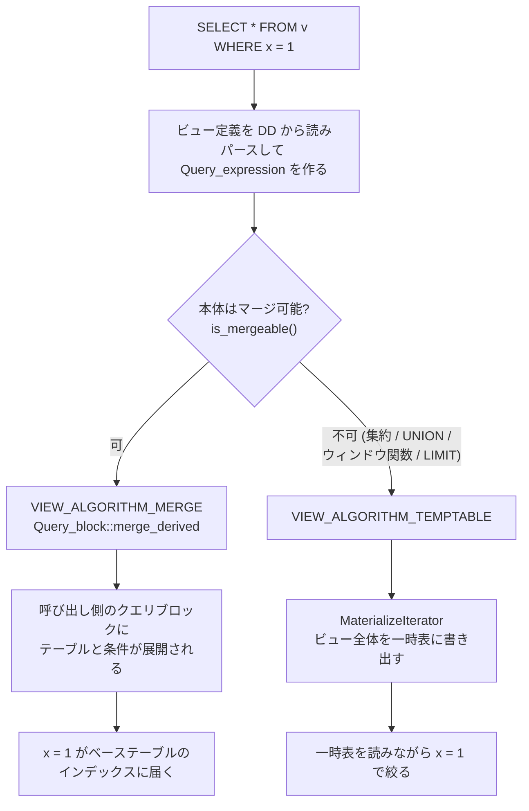

> **前提**: [サブクエリ](./subquery-transformations/) / [内部一時表](./materialization-and-temptable/)

## 何を学んだか

ビューはデータを持たない。持っているのは SQL テキストで、参照されるたびにパースされてクエリツリーに埋め込まれる。埋め込み方が 2 通りある。

```cpp title="sql/table.h"
  2) view (Table_ref::view != NULL)
     - merge    (Table_ref::effective_algorithm == VIEW_ALGORITHM_MERGE)
           also (Table_ref::field_translation != NULL)
     - temptable(Table_ref::effective_algorithm == VIEW_ALGORITHM_TEMPTABLE)
           also (Table_ref::field_translation == NULL)
```

[`sql/table.h#L2847`](https://github.com/mysql/mysql-server/blob/mysql-8.4.11/sql/table.h#L2847)。`effective_algorithm` という名前が示すとおり、**`CREATE VIEW ... ALGORITHM = MERGE` と書いても、そのとおりになるとは限らない**。

- **MERGE ならビューは消える。** 本体のテーブルと条件が呼び出し側のクエリブロックに展開され、インデックスもそのまま効く
- **TEMPTABLE なら内部一時表になる。** 外側の `WHERE` は押し込まれず、ビュー全体が materialize されてからフィルタされる
- **判断は宣言ではなく本体の形が決める。** 集約・`DISTINCT`・`UNION`・ウィンドウ関数があれば MERGE にできない
- **ビューは既定で作成者の権限で走る。** `SQL SECURITY DEFINER` が既定で、利用者は参照先テーブルへの権限を持たなくていい
- **`WITH CHECK OPTION` は書き込みのたびに条件式を評価する。** `IGNORE` を付けると違反行が黙ってスキップされる



## なぜそうなっているか

**MERGE を既定にしたいのは、述語をベーステーブルまで届けたいからだ。** ビューが一時表になると、外側の `WHERE x = 1` はその一時表に対する条件になり、ベーステーブルのインデックスには届かない。100 万行のビューから 1 行取り出すのに 100 万行を実体化することになる。

**それでも TEMPTABLE が要るのは、意味が変わってしまう本体があるからだ。** 集約を含むビューに外側から `WHERE` を足すと、`HAVING` なのか `WHERE` なのかで結果が変わる。`LIMIT` があるビューに条件を押し込むと、どの行が残るかが変わる。**意味を保てないときは実体化するしかない**。この判定は `Query_expression::is_mergeable` にあり、派生テーブルと共通のコードになる ([サブクエリ](./subquery-transformations/))。

**ビューを作成者の権限で走らせるのは、ビューを権限の境界として使えるようにするためだ。** 「`users` テーブルの一部の列だけ見せたい」というとき、`users` への権限を与えずにビューへの `SELECT` 権限だけを与えれば済む。ビューが呼び出し側の権限で走ると、この用途が成立しない。

**`WITH CHECK OPTION` が書き込みのたびに評価されるのは、ビューの定義を通り抜ける行を防ぐためだ。** `CREATE VIEW v AS SELECT * FROM t WHERE status = 'active'` に `status = 'deleted'` の行を `INSERT` できてしまうと、入れた直後にビューから消える。

## ソースコードのどこか

### アルゴリズムの実効値

```cpp title="sql/table.h"
  VIEW_ALGORITHM_TEMPTABLE = 1,
  VIEW_ALGORITHM_MERGE = 2
```

[`sql/table.h#L2547`](https://github.com/mysql/mysql-server/blob/mysql-8.4.11/sql/table.h#L2547)。`Table_ref` 側には宣言値 (`algorithm`) と実効値 (`effective_algorithm`) の 2 つがあり、判定関数はこう書かれている。

```cpp title="sql/table.h"
  bool is_merged() const { return effective_algorithm == VIEW_ALGORITHM_MERGE; }
```

[`sql/table.h#L3200`](https://github.com/mysql/mysql-server/blob/mysql-8.4.11/sql/table.h#L3200)。`set_merged` の隣にある `set_uses_materialization` には `assert(effective_algorithm != VIEW_ALGORITHM_MERGE)` が置かれていて、**一度 MERGE と決めたら実体化には落とせない**ことが表明されている。

実際の判定は派生テーブルと同じ経路を通る。`Query_block::merge_derived` と `Query_expression::is_mergeable` が本体で、これは[サブクエリのページ](./subquery-transformations/)で扱った。ビュー固有の要素はほとんどなく、**「ビューか派生テーブルか」は解決後にはほぼ区別されない**。

### 権限 — 誰の権限で走るか

```cpp title="sql/table.h"
  ulonglong view_suid{0};   ///< view is suid (true by default)
  ulonglong with_check{0};  ///< WITH CHECK OPTION
```

[`sql/table.h#L3804`](https://github.com/mysql/mysql-server/blob/mysql-8.4.11/sql/table.h#L3804)。**コメントが `true by default` と書いているとおり、`SQL SECURITY DEFINER` が既定**になる。`SQL SECURITY INVOKER` を明示したときだけ 0 になる。

入れ子のビューでは、どの権限を使うかを遡って決める。

```cpp title="sql/table.cc"
Security_context *Table_ref::find_view_security_context(THD *thd) {
  Security_context *sctx;
  Table_ref *upper_view = this;
  ...
  while (upper_view && !upper_view->view_suid) {
    assert(!upper_view->prelocking_placeholder);
    upper_view = upper_view->referencing_view;
  }
  if (upper_view) {
    ...
    sctx = upper_view->view_sctx;
```

[`sql/table.cc#L4992`](https://github.com/mysql/mysql-server/blob/mysql-8.4.11/sql/table.cc#L4992)。**`view_suid` が false のビュー (INVOKER) を外側にたどり続け、最初に見つかった DEFINER ビューの権限を使う。** どれも INVOKER なら現在のセッションの権限になる。

権限は解決時に一度だけ計算されて `Table_ref::grant` に載る。

```cpp title="sql/table.cc"
bool Table_ref::prepare_security(THD *thd) {
  ...
  thd->set_security_context(find_view_security_context(thd));
  opt_trace_disable_if_no_security_context_access(thd);
  for (Table_ref *tbl : *view_tables) {
    ...
    fill_effective_table_privileges(thd, &tbl->grant, tbl->db,
                                    tbl->get_table_name());
  }
  thd->set_security_context(save_security_ctx);
```

[`sql/table.cc#L5023`](https://github.com/mysql/mysql-server/blob/mysql-8.4.11/sql/table.cc#L5023)。**セキュリティコンテキストを一時的に差し替えて、参照先テーブルの権限を計算してから戻している。** `opt_trace_disable_if_no_security_context_access` があるのは、権限を持たないユーザが optimizer trace 経由でビューの中身を覗くのを防ぐためだ。

### `WITH CHECK OPTION`

```cpp title="sql/table.cc"
int Table_ref::view_check_option(THD *thd) const {
  if (check_option && check_option->val_int() == 0) {
    const Table_ref *main_view = top_table();
    my_error(ER_VIEW_CHECK_FAILED, MYF(0), main_view->db,
             main_view->table_name);
    if (thd->lex->is_ignore()) return (VIEW_CHECK_SKIP);
    return (VIEW_CHECK_ERROR);
  }
  return (VIEW_CHECK_OK);
}
```

[`sql/table.cc#L4812`](https://github.com/mysql/mysql-server/blob/mysql-8.4.11/sql/table.cc#L4812)。**行 1 件ごとに `check_option` を式として評価する。** 呼ばれるのは `sql_insert.cc` と `sql_update.cc` の 6 か所で、行を書く直前になる。

`IGNORE` があると `VIEW_CHECK_SKIP` が返り、その行だけ飛ばして続行する。`ER_VIEW_CHECK_FAILED` は `Ignore_error_handler` の対象にも入っているので、エラーは警告に落ちる ([sql_mode と厳格モード](./sql-mode-and-strict/))。

`LOCAL` と `CASCADED` の区別もここにある。

```cpp title="sql/table.h"
#define VIEW_CHECK_LOCAL 1
#define VIEW_CHECK_CASCADED 2
```

[`sql/table.h#L2557`](https://github.com/mysql/mysql-server/blob/mysql-8.4.11/sql/table.h#L2557)。`CASCADED` (SQL 標準の既定) は下位のビューの条件も含めて 1 本の式に合成される。

## どう活かすか

### ビューが遅いなら、まず MERGE されているかを見る

`EXPLAIN` の結果に `<derived2>` のような一時表が出ていれば実体化されている。`EXPLAIN FORMAT=TREE` なら `Materialize` が出る ([EXPLAIN ANALYZE](./explain-analyze-and-tree/))。

実体化される主な理由は次のとおり。

- 集約 (`GROUP BY` / 集約関数)
- `DISTINCT`
- `UNION`
- ウィンドウ関数
- `LIMIT`
- `ALGORITHM = TEMPTABLE` の明示

**「便利だから」とビューに `ORDER BY ... LIMIT` を書くと、そのビューは永久に実体化される。** 並び順と件数の制御は呼び出し側に置く。

### ビューを重ねると、権限の出どころが分かりにくくなる

`find_view_security_context` が INVOKER のビューを遡る仕様なので、3 段のビューのうち真ん中だけが `SQL SECURITY INVOKER` だと、実行時の権限は一番外側の DEFINER のものになる。**ビューの権限は「そのビューの定義」だけを見ても決まらない**。

権限の境界としてビューを使うなら、境界にするビューを DEFINER にして、その内側にビューを重ねない構成が読みやすい。

### `DEFINER` のユーザが消えるとビューが壊れる

`SQL SECURITY DEFINER` のビューは、実行時に定義者の権限を引く。定義者のアカウントを `DROP USER` すると、`SELECT` した時点でエラーになる。**ビューの定義者を個人のアカウントにしない**のが運用上の定石で、専用のロールやアカウントを使う。

`SELECT definer, security_type FROM information_schema.views` で棚卸しできる。

### `WITH CHECK OPTION` は行ごとの式評価

大量の `INSERT ... SELECT` をビュー経由で流すと、行ごとに条件式が評価される。**ビューを経由して一括投入する経路は、ベーステーブルに直接投入するより必ず遅い**。整合性のための正しいコストだが、バッチ処理の経路をビュー越しにする理由がないなら直接書く。

### 一般化して持ち帰るもの

**「宣言された設定」と「実効値」を分けて持つ**というのが `algorithm` と `effective_algorithm` の設計だ。ユーザの指定は希望であって、意味を保てるかどうかは実装が判断する。指定をそのまま採用しないなら、両方を保持して「なぜ違うのか」を答えられるようにしておく必要がある — MySQL の場合は `SHOW WARNINGS` に `View merge algorithm can't be used here` が出る。

もう 1 つは、**権限をデータではなくコードの属性として持たせる**という判断だ。ビューが自分の実行権限を持つおかげで、テーブルへの権限を配らずに列や行の一部を見せられる。同じ発想はストアドプログラムの `DEFINER` にも続く ([トリガとストアドプログラム](./triggers-and-stored-programs/))。
