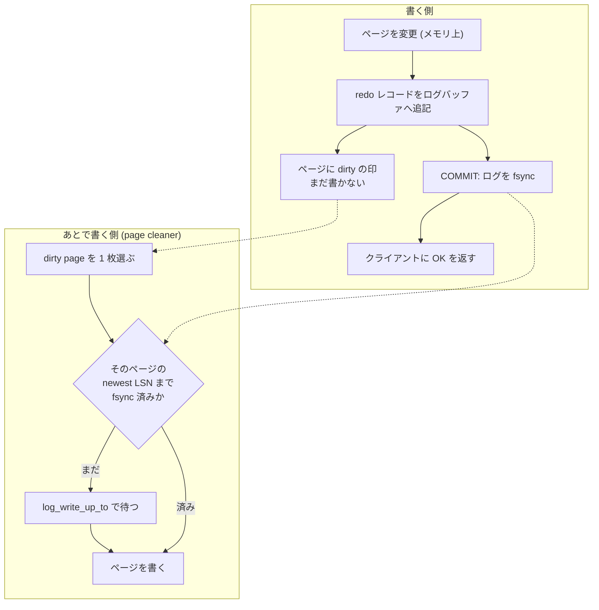

> **前提**: [ページとバッファ](./page-and-buffer/)

## 何を学んだか

コミットが返ってきたなら、その変更は電源が落ちても残っていなければならない。素直にやるなら、変更したページをディスクに書いて `fsync` してからコミットを返すことになる。だがそれは無理がある。

- 変更したページは**テーブルの中に散らばっている**。1 トランザクションが 10 枚のページを触れば、10 か所のランダム書き込みになる
- 1 バイト直しても書くのは **16KB** ([ページとバッファ](./page-and-buffer/))
- しかも他のトランザクションが同じページをまだ触っているかもしれない

WAL (write-ahead logging) はこれを別の取引に置き換える。**「ページに何をしたか」だけを 1 本のファイルに追記して、それを `fsync` したらコミットを返してよいことにする。** ページ本体はメモリ上で dirty のまま置いておき、都合のよいときに書く。

追記なら書き込みはシーケンシャルで、しかもレコードは数十バイトしかない。複数のトランザクションのぶんを 1 回の `fsync` にまとめることもできる。

この取引が成立する条件はただ 1 つだ。

> **ページをディスクに書く前に、そのページの変更を記録したログが `fsync` されていること。**

順序が逆になると壊れる。まだログが届いていないページの中身がディスクに出ると、そのページには未コミットの変更が入っているかもしれない。クラッシュ後、それを巻き戻すための情報がどこにもない。



そして 2 つのログがある。役割はまったく違う。

|                  | redo                                                           | undo                                                                      |
| ---------------- | -------------------------------------------------------------- | ------------------------------------------------------------------------- |
| 何を記録するか   | 「ページ P にこの変更を加えた」                                | 「この行は変更前こうだった」                                              |
| 誰のために       | **クラッシュ後の再適用**。書き損ねたページを最新に追いつかせる | **ロールバック**と、**他人が古い版を読むため** ([MVCC](./mvcc-basics/))   |
| 粒度             | ページ (物理寄り)                                              | 行 (論理)                                                                 |
| どこにあるか     | `#innodb_redo/#ib_redo<N>` という専用ファイル                  | 普通のテーブルスペース上のページ。**undo ページ自体も redo で保護される** |
| いつ捨てられるか | チェックポイントが追い越したら                                 | 誰からも見えなくなったら (purge)                                          |

最後の行が効いてくる。**undo は「ログ」と呼ばれているが実体はただのページ**で、undo を書き換えたことも redo に載る。だからリカバリは「redo を全部当てる → それでできあがった undo を使って巻き戻す」という順序になる。

もう 1 つ、ログは無限には伸ばせない。ファイルを使い回すには「ここより前はもう要らない」という線が要る。それが**チェックポイント**で、意味は「この LSN より前の変更が入ったページは、すべてディスクに書き終わっている」だ。

## なぜそうなっているか

### なぜ「ログを先に」でなければならないのか

順序を逆にした世界を考えると分かる。ページ P に未コミットの `UPDATE` が入った状態でディスクに書かれ、その直後にクラッシュしたとする。再起動すると、ディスク上の P には「起きなかったはずの変更」が入っている。これを消すには変更前の値が要るが、それを記録した undo レコードは redo に載っておらず、undo ページの更新も飛んでいる。**巻き戻す材料がどこにもない。**

逆向きの守り (ログが先) にしておけば、どんなタイミングで落ちても「ディスク上のページの状態」は必ずログで説明が付く。ログにあるのにページにない変更は当て直せばよく、ページにあるのにコミットされていない変更は undo で戻せる。**ログがページより先んじている限り、両者のずれは必ず埋められる。**

### なぜ追記が速いのか

同じ「1 回の `fsync`」でも、書く場所が違う。

- ページを書く場合 — 触ったページ数だけランダム位置に 16KB ずつ。デバイス側でも書き込みが分散する
- ログを書く場合 — ファイル末尾に連続して数十バイト〜数 KB。しかも 512 バイトのブロック単位に切り上げるだけ

さらに、**待っているトランザクションが複数いれば 1 回の `fsync` でまとめて片付く**。ログが 1 本の数直線になっているので、「LSN X まで `fsync` した」と言えば X 以下を待っている全員が起きられる。これがグループコミットの原理で、実装は[log writer / flusher](./log-writer-threads/) と [2PC とグループコミット](./two-phase-commit-and-group-commit/)にある。

### なぜチェックポイントが要るのか

ログを永久に取っておけばリカバリはいつでもできるが、ディスクが尽きる。使い回すには「ここより前は捨ててよい」の線が要る。

線を引ける条件は「その LSN より前の変更が入ったページは、全部ディスクにある」ことだ。だから**チェックポイントを進めるには dirty page を書かなければならない**。逆に言えば、page cleaner が追いつかないとチェックポイントが進まず、ログの空きがなくなり、最後は書き込みが完全に止まる。

ここで**すべての dirty page を書いてからチェックポイントを打つ (sharp checkpoint)** ことはしない。それをやるとそのたびにサーバが止まる。代わりに page cleaner が常時少しずつ書き、チェックポイントは「今どこまでが安全か」を観測して記録するだけにしてある (fuzzy checkpoint)。**チェックポイントを打つコストが O(1) になっている**のはこの設計の帰結だ ([チェックポイント](./checkpoint/))。

### なぜ undo が「ただのページ」なのか

undo を redo と同じような専用ログにする設計もありうる。InnoDB がそうしなかったのは、**undo が長生きするから**だ。redo はチェックポイントが追い越せば捨てられるが、undo は「そのトランザクションが終わる」だけでなく「そのトランザクションより古い読み手がいなくなる」まで残す必要がある ([MVCC](./mvcc-basics/))。

寿命が長く、しかもランダムに読まれる (版鎖を辿る) データは、追記ログよりページ構造のほうが向いている。バッファプールにも載せられるし、purge が回収したページを再利用する仕組みも既にある。**その代わり、undo ページの変更も redo で守らなければならなくなった。**

## ソースコードのどこか

### WAL 規則そのもの

page cleaner がページを書き出す直前の 20 行が、この規則の実装のすべてだ。

```cpp title="storage/innobase/buf/buf0flu.cc"
  /* Force the log to the disk before writing the modified block */
  if (!srv_read_only_mode) {
    const lsn_t flush_to_lsn = bpage->get_newest_lsn();

    /* Do the check before calling log_write_up_to() because in most
    cases it would allow to avoid call, and because of that we don't
    want those calls because they would have bad impact on the counter
    of calls, which is monitored to save CPU on spinning in log threads. */

    if (log_sys->flushed_to_disk_lsn.load() < flush_to_lsn) {
      Wait_stats wait_stats;

      wait_stats = log_write_up_to(*log_sys, flush_to_lsn, true);
```

[`buf_flush_write_block_low` (`buf0flu.cc#L1199`)](https://github.com/mysql/mysql-server/blob/mysql-8.4.11/storage/innobase/buf/buf0flu.cc#L1199)。`get_newest_lsn()` は「このページを最後に変更したときの LSN」で、そこまで `fsync` が済んでいなければ **page cleaner が待つ**。書き込みスレッドがログの `fsync` を待つという、一見ちぐはぐな依存関係がここに現れる。

[`log_write_up_to` (`log0write.h#L63`)](https://github.com/mysql/mysql-server/blob/mysql-8.4.11/storage/innobase/include/log0write.h#L63) が「LSN X まで書く / flush するまで待つ」の唯一の入口で、呼ばれるのはこことコミット時の 2 か所だけだ。

### ページ側に LSN が書いてある

```cpp title="storage/innobase/include/fil0types.h"
/** lsn of the end of the newest modification log record to the page */
constexpr uint32_t FIL_PAGE_LSN = 16;
```

[`fil0types.h#L66`](https://github.com/mysql/mysql-server/blob/mysql-8.4.11/storage/innobase/include/fil0types.h#L66)。**全ページのオフセット 16 に、そのページを最後に変更した LSN が入っている。** リカバリはこれを見て「このレコードは既に反映済みか」を判定する ([クラッシュリカバリ](./crash-recovery/))。

進捗を別に記録しなくても、ページ自身が「自分はどこまで進んでいるか」を持っているので、**redo の再適用は何度繰り返しても同じ結果になる**。リカバリの途中でもう一度クラッシュしても、次の起動で最初からやり直すだけでよい。

### コミットが待つ場所

```cpp title="storage/innobase/trx/trx0trx.cc"
  switch (srv_flush_log_at_trx_commit) {
    case 2:
      /* Write the log but do not flush it to disk */
      flush = false;
      [[fallthrough]];
    case 1:
      /* Write the log and optionally flush it to disk */
      wait_stats = log_write_up_to(*log_sys, lsn, flush);

      MONITOR_INC_WAIT_STATS(MONITOR_TRX_ON_LOG_, wait_stats);

      return;
    case 0:
      /* Do nothing */
      return;
  }
```

[`trx_flush_log_if_needed_low` (`trx0trx.cc#L1756`)](https://github.com/mysql/mysql-server/blob/mysql-8.4.11/storage/innobase/trx/trx0trx.cc#L1756)。**3 つの値が「どこまで待つか」の 3 段階にそのまま対応している。**

```cpp title="storage/innobase/handler/ha_innodb.cc"
static MYSQL_SYSVAR_ULONG(flush_log_at_trx_commit, srv_flush_log_at_trx_commit,
                          PLUGIN_VAR_OPCMDARG,
                          "Set to 0 (write and flush once per second),"
                          " 1 (write and flush at each commit),"
                          " or 2 (write at commit, flush once per second).",
                          nullptr, nullptr, 1, 0, 2, 0);
```

[`ha_innodb.cc#L22352`](https://github.com/mysql/mysql-server/blob/mysql-8.4.11/storage/innobase/handler/ha_innodb.cc#L22352)。既定は 1、つまり**コミットのたびに `fsync` する**。

## どう活かすか

### `innodb_flush_log_at_trx_commit` の 3 値は「何を失う覚悟か」

| 値       | コミット時にすること                      | クラッシュで失うもの                                             |
| -------- | ----------------------------------------- | ---------------------------------------------------------------- |
| 1 (既定) | ログバッファ → ファイル → `fsync`         | 何も失わない                                                     |
| 2        | ログバッファ → ファイル (`write(2)` まで) | **OS ごと落ちたら**最大 1 秒ぶん。プロセスだけ落ちたなら失わない |
| 0        | 何もしない                                | プロセスが落ちただけでも最大 1 秒ぶん                            |

2 と 0 の差は「プロセスクラッシュで失うかどうか」で、OS が生きていれば `write(2)` 済みのデータはページキャッシュに残る。**レプリカや、失っても作り直せる集計用インスタンスでは 2 が合理的**だが、レプリケーションのソース側では 1 以外を選ぶ理由がほとんどない。

### コミットが遅いなら疑うのはディスクの `fsync` レイテンシ

`SHOW GLOBAL STATUS` の `Innodb_os_log_fsyncs` の増分と、`performance_schema.file_summary_by_event_name` の `wait/io/file/innodb/innodb_log_file` を見る。**1 コミット 1 `fsync` になっているなら、スループットの上限はデバイスの `fsync` レイテンシで決まる。** 短いトランザクションを大量に投げる構成では、まとめてコミットする (グループコミットに載せる) ほうが桁で効く。

逆に `Innodb_os_log_written` が跳ねているなら、書いている量そのものが多い。1 トランザクションで触るページを減らす話になる。

### redo を大きくすればリカバリが遅くなる、は正確ではない

リカバリで読む量を決めるのは redo の容量ではなく、**クラッシュ時点の checkpoint age (現在の LSN − チェックポイント LSN)** だ。page cleaner が追いついていれば、容量が大きくても age は小さいままで、リカバリは短い。

容量に余裕を持たせる意味は「スパイク時にチェックポイントが追いつかなくても止まらない」ことにある ([チェックポイント](./checkpoint/))。

### エラーログの文言は 8.4 で変わっている

redo が逼迫したときのメッセージは `Redo log is running out of free space, pausing user threads...` などで、8.0.30 より前の `InnoDB: ERROR: the age of the last checkpoint is ...` は 8.4 には存在しない。`innodb_log_file_size` と `innodb_log_files_in_group` も 8.0.30 で役目を終え、`innodb_redo_log_capacity` 1 つになった ([redo ログの walkthrough](./redo-log-walkthrough/))。

### この続き

- mtr がログバッファからファイルまでどう流れるかは[redo ログ — mtr から #ib_redo ファイルまで](./redo-log-walkthrough/)
- 「複数ページの変更をまとめて 1 単位にする」仕組みは[mini-transaction](./mini-transaction/)
- チェックポイント LSN の計算と、redo が尽きたときに何が起きるかは[チェックポイント](./checkpoint/)
- 起動時に redo と undo がどの順で使われるかは[クラッシュリカバリ — redo を当てて undo で巻き戻す](./crash-recovery/)
- ページの書き込み自体が途中で切れる問題は[doublewrite — torn page への保険](./doublewrite/)
- undo の中身とロールバックは[undo ログ — 巻き戻しと古い版の両方に使う](./undo-log/)
