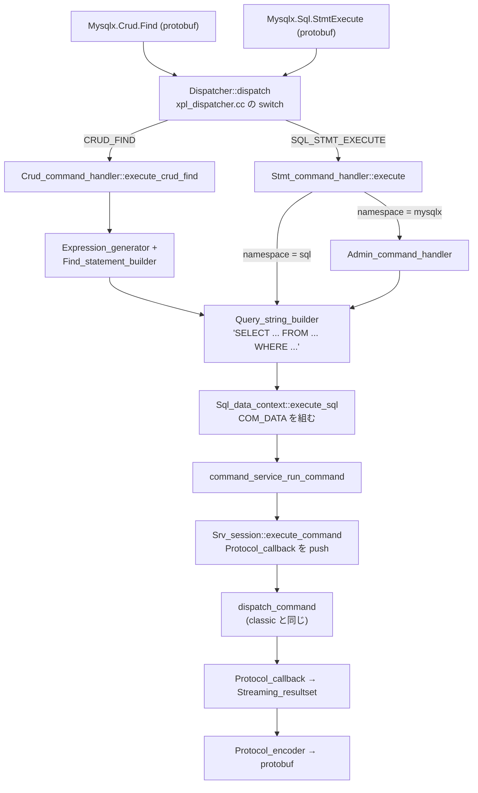

> **前提**: [X Protocol](./x-protocol-messages/) / [接続層](./connection-layer/)

## この層の責務

X Plugin がやることは、実は 3 つしかない。

1. **protobuf のメッセージを SQL 文字列にする** — CRUD メッセージ (`Find` / `Insert` / `Update` / `Delete`) を `SELECT` / `INSERT` / `UPDATE` / `DELETE` の文字列に組み立てる。`Mysqlx.Sql.StmtExecute` なら文字列がそのまま来る
2. **内部セッション (`Srv_session`) を 1 個持ち、そこに `COM_QUERY` を投げる** — `srv_session_open` で `THD` を作り、`command_service_run_command` で `dispatch_command` に入る
3. **結果を protobuf に詰め直して返す** — `Protocol_callback` という `Protocol` の実装を `THD` に push して、行やメタデータを X のエンコーダに横流しする

**SQL のパース・最適化・実行は 1 行も持っていない。** この層は「protobuf ⇄ SQL 文字列」の翻訳器と、内部セッションのライフサイクル管理だけだ。

だから、X 経由で実行したクエリは `SHOW PROCESSLIST` にも `performance_schema.events_statements_*` にも slow log にも、classic のクエリと同じように現れる。InnoDB のロックの取り方も、[分離レベル](./isolation-levels-and-anomalies/)の振る舞いも変わらない。



## 主要な型とその関係

### `Client` / `Session` / `Sql_data_context` の 3 層

| 型                      | 対応するもの                                        | 個数                                      |
| ----------------------- | --------------------------------------------------- | ----------------------------------------- |
| `xpl::Client`           | 1 本の TCP 接続                                     | 接続ごと                                  |
| `xpl::Session`          | X Protocol のセッション                             | 接続ごとに 1 つ (`SESS_RESET` で作り直す) |
| `xpl::Sql_data_context` | サーバ内部の SQL セッション (`Srv_session` = `THD`) | `Session` ごとに 1 つ                     |

**`THD` は `Sql_data_context` の中にしかない。** X 側のコードは `Session` と `Sql_data_context` を通してしか `THD` に触れない。

`Session::handle_message` が状態で分岐する。

```cpp title="plugin/x/src/session.cc"
bool Session::handle_message(const ngs::Message_request &command) {
  if (m_state == State::k_authenticating) {
    return handle_auth_message(command);
  } else if (m_state == State::k_ready) {
    // handle session commands
    return handle_ready_message(command);
  }
  // msg not handled
  return false;
}
```

[`session.cc#L123`](https://github.com/mysql/mysql-server/blob/mysql-8.4.11/plugin/x/src/session.cc#L123)。**認証中と認証後で受け付けるメッセージが完全に分かれている。** 認証中に CRUD を送っても `handle_auth_message` の `else` に落ちて `ER_X_BAD_MESSAGE` になり、接続が切られる。

### `Dispatcher` — 139 行の switch

[`plugin/x/src/xpl_dispatcher.cc`](https://github.com/mysql/mysql-server/blob/mysql-8.4.11/plugin/x/src/xpl_dispatcher.cc) はファイル全体で 139 行、実質 `switch` 1 個だ。

```cpp title="plugin/x/src/xpl_dispatcher.cc"
ngs::Error_code Dispatcher::dispatch(const ngs::Message_request &command) {
  switch (command.get_message_type()) {
    case Mysqlx::ClientMessages::SQL_STMT_EXECUTE:
      return m_stmt_handler.execute(
          static_cast<const Mysqlx::Sql::StmtExecute &>(
              *command.get_message()));

    case Mysqlx::ClientMessages::CRUD_FIND:
      return m_crud_handler.execute_crud_find(
          static_cast<const Mysqlx::Crud::Find &>(*command.get_message()));
    ...
  }

  m_session->proto().get_protocol_monitor().on_error_unknown_msg_type();
  return ngs::Error(ER_UNKNOWN_COM_ERROR, "Unexpected message received");
}
```

[L46](https://github.com/mysql/mysql-server/blob/mysql-8.4.11/plugin/x/src/xpl_dispatcher.cc#L46)。ハンドラは 3 つしかない。

- `m_stmt_handler` (`Stmt_command_handler`) — `SQL_STMT_EXECUTE`
- `m_crud_handler` (`Crud_command_handler`) — CRUD 4 種 + View 3 種
- `m_prepare_handler` (`Prepare_command_handler`) — Prepare 3 種 + Cursor 3 種

`EXPECT_OPEN` / `EXPECT_CLOSE` だけは `Dispatcher` 自身が処理する。

そして `dispatch` を包む `execute` に、X 独自の機構が現れる。

```cpp title="plugin/x/src/xpl_dispatcher.cc"
ngs::Error_code Dispatcher::execute(const ngs::Message_request &command) {
  ngs::Error_code error =
      m_expect_stack.pre_client_stmt(command.get_message_type());
  if (!error) {
    error = dispatch(command);
    if (error) m_session->proto().send_result(error);
    m_expect_stack.post_client_stmt(command.get_message_type(), error);
  } else {
    m_session->proto().send_result(error);
  }
  return error;
}
```

[L33](https://github.com/mysql/mysql-server/blob/mysql-8.4.11/plugin/x/src/xpl_dispatcher.cc#L33)。`m_expect_stack` が Expect ブロックで、**すべてのメッセージがこの前後フックを通る** ([スレッドとパイプラインのページ](./x-plugin-threading-and-pipelining/))。

### `Expression_generator` — protobuf の式を SQL 文字列に

```cpp title="plugin/x/src/expr_generator.cc"
void Expression_generator::generate(const Mysqlx::Expr::Expr &arg) const {
  switch (arg.type()) {
    case Mysqlx::Expr::Expr::IDENT:
      generate(arg.identifier());
      break;

    case Mysqlx::Expr::Expr::LITERAL:
      generate(arg.literal());
      break;

    case Mysqlx::Expr::Expr::VARIABLE:
      // m_qb->put("@").quote_identifier(arg.variable());
      // break;
      throw Error(ER_X_EXPR_BAD_TYPE_VALUE,
                  "Mysqlx::Expr::Expr::VARIABLE is not supported yet");
```

[`expr_generator.cc#L46`](https://github.com/mysql/mysql-server/blob/mysql-8.4.11/plugin/x/src/expr_generator.cc#L46)。**`VARIABLE` (ユーザ変数) はコメントアウトされたまま「未対応」になっている。** X Protocol の式で `@var` は使えない。

識別子はスキーマ名を自動で前置する。

```cpp title="plugin/x/src/expr_generator.cc"
void Expression_generator::generate(const Mysqlx::Expr::Identifier &arg,
                                    bool is_function) const {
  if (!m_default_schema.empty() &&
      (!arg.has_schema_name() || arg.schema_name().empty())) {
    // automatically prefix with the schema name
    if (!is_function || !is_native_mysql_function(arg.name()))
      m_qb->quote_identifier_if_needed(m_default_schema).dot();
  }
```

[L89](https://github.com/mysql/mysql-server/blob/mysql-8.4.11/plugin/x/src/expr_generator.cc#L89)。**`is_native_mysql_function` でないものは全部スキーマ修飾される。** ネイティブ関数の一覧に載っていない関数を呼ぶと `schema.func()` になる、という挙動がここから来る。

プレースホルダの扱いも面白い。

```cpp title="plugin/x/src/expr_generator.cc"
void Expression_generator::generate(const Placeholder &arg) const {
  if (arg < static_cast<Placeholder>(m_args.size())) {
    generate(m_args.Get(arg));
    return;
  }
  if (!is_prep_stmt_mode())
    throw Error(ER_X_EXPR_BAD_VALUE, "Invalid value of placeholder");
  m_placeholders->emplace_back(arg - static_cast<Placeholder>(m_args.size()),
                               Placeholder_type::k_raw);
  m_qb->put("?");
}
```

[L297](https://github.com/mysql/mysql-server/blob/mysql-8.4.11/plugin/x/src/expr_generator.cc#L297)。**通常のモードでは、プレースホルダは値をその場で SQL 文字列に埋め込む。** `?` として残るのは prepared statement モード (`PREPARE_PREPARE` 経由) のときだけだ。エスケープは `Query_string_builder` が担当する。

JSON 系はそのまま SQL 関数に落ちる。

```cpp title="plugin/x/src/expr_generator.cc"
void Expression_generator::generate(const Mysqlx::Expr::Object &arg) const {
  m_qb->put("JSON_OBJECT(");
  generate_for_each(arg.fld(), &Expression_generator::generate);
  m_qb->put(")");
```

### `*_statement_builder` — SQL の骨格

```cpp title="plugin/x/src/find_statement_builder.cc"
void Find_statement_builder::add_statement_common(const Find &msg) const {
  m_builder.put("SELECT ");
  if (is_table_data_model(msg))
    add_table_projection(msg.projection());
  else
    add_document_projection(msg.projection());
  m_builder.put(" FROM ");
  add_collection(msg.collection());
  add_filter(msg.criteria());
  add_grouping(msg.grouping());
  add_grouping_criteria(msg.grouping_criteria());
  add_order(msg.order());
  add_limit(msg, false);
  add_row_locking(msg);
}
```

[`find_statement_builder.cc#L42`](https://github.com/mysql/mysql-server/blob/mysql-8.4.11/plugin/x/src/find_statement_builder.cc#L42)。**`SELECT ... FROM ... WHERE ... GROUP BY ... HAVING ... ORDER BY ... LIMIT ... FOR UPDATE` の並びがそのまま関数呼び出しの並びになっている。** これ以上でもこれ以下でもない。

ドキュメントモデル (コレクション) では、投影が省略されたときに `doc` 列が選ばれる。

```cpp title="plugin/x/src/find_statement_builder.cc"
void Find_statement_builder::add_document_projection(
    const Projection_list &projection) const {
  if (projection.size() == 0) {
    m_builder.put("doc");
    return;
  }
```

**「コレクション」は `doc` という JSON 列と `_id` という生成列を持つ普通の InnoDB テーブルだ。** ドキュメントストアの正体はここに出ている。

`GROUP BY` を使うドキュメントクエリだけ、派生表で 2 段にする。

```cpp title="plugin/x/src/find_statement_builder.cc"
namespace {
const char *const DERIVED_TABLE_NAME = "`_DERIVED_TABLE_`";
}  // namespace

void Find_statement_builder::add_document_statement_with_grouping(
    const Find &msg) const {
  ...
  m_builder.put(") AS ").put(DERIVED_TABLE_NAME);
```

[L58](https://github.com/mysql/mysql-server/blob/mysql-8.4.11/plugin/x/src/find_statement_builder.cc#L58)。**`EXPLAIN` に `_DERIVED_TABLE_` という名前が出てきたら、X の CRUD が生成したクエリだと分かる。**

### `Sql_data_context` — 内部セッションの持ち主

```cpp title="plugin/x/src/sql_data_context.cc"
ngs::Error_code Sql_data_context::init(const bool is_admin) {
  if (is_admin) {
    details::Admin_session_factory factory;
    m_mysql_session =
        factory.create(&Sql_data_context::default_completion_handler, this);

  } else {
    m_mysql_session =
        srv_session_open(&Sql_data_context::default_completion_handler, this);
  }
```

[`sql_data_context.cc#L96`](https://github.com/mysql/mysql-server/blob/mysql-8.4.11/plugin/x/src/sql_data_context.cc#L96)。`srv_session_open` がサーバ側の `THD` を作る。**この時点で `max_connections` の判定にも当たりうる。**

```cpp title="plugin/x/src/sql_data_context.cc"
    if (ER_CON_COUNT_ERROR == m_last_sql_errno)
      return ngs::Error_code(m_last_sql_errno, m_last_sql_error);
```

**`Too many connections` は X 経由でも起きる。** `mysqlx_max_connections` (X の接続数) を通っても、内部セッションを開く段で classic 側の上限に当たる可能性がある ([接続層のページ](./connection-layer/))。

SQL の実行は単純だ。

```cpp title="plugin/x/src/sql_data_context.cc"
ngs::Error_code Sql_data_context::execute_sql(const char *sql,
                                              std::size_t sql_len,
                                              iface::Resultset *rset) {
  COM_DATA data;
  memset(&data, 0, sizeof(data));
  data.com_query.query = sql;
  data.com_query.length = static_cast<unsigned int>(sql_len);
  return execute_server_command(COM_QUERY, data, rset);
}
```

[L562](https://github.com/mysql/mysql-server/blob/mysql-8.4.11/plugin/x/src/sql_data_context.cc#L562)。**`COM_DATA` を手で埋めている。** classic では [`Protocol_classic::parse_packet` がネットワークバッファから作る構造体](./text-protocol-and-resultset/)を、ここでは文字列から直接組む。

prepared statement / cursor も同じ形だ。

```cpp title="plugin/x/src/sql_data_context.cc"
ngs::Error_code Sql_data_context::prepare_prep_stmt(const char *sql,
                                                    std::size_t sql_len,
                                                    iface::Resultset *rset) {
  COM_DATA data;
  data.com_stmt_prepare = {sql, static_cast<unsigned>(sql_len)};
  return execute_server_command(COM_STMT_PREPARE, data, rset);
}
```

[L600](https://github.com/mysql/mysql-server/blob/mysql-8.4.11/plugin/x/src/sql_data_context.cc#L600)。**X の `Mysqlx.Prepare.Prepare` は、classic の `COM_STMT_PREPARE` にそのまま落ちる** ([prepared statement のページ](./binary-protocol-prepared-statements/))。X 側の statement id と classic 側の statement id を対応づける表を `Session` が持つ (`get_prepared_statement_id`)。

`Mysqlx.Cursor.Fetch` も `COM_STMT_FETCH` になるので、**サーバ側カーソルの実体は classic と同じ `Materialized_cursor`、つまり結果を全部一時表に落とす方式だ。**

### 合流点 — `dispatch_command`

```cpp title="sql/command_service.cc"
int command_service_run_command(Srv_session *session,
                                enum enum_server_command command,
                                const union COM_DATA *data,
                                const CHARSET_INFO *client_cs,
                                const struct st_command_service_cbs *callbacks,
                                enum cs_text_or_binary text_or_binary,
                                void *service_callbacks_ctx) {
  if (!session || !Srv_session::is_valid(session)) return true;

  return session->execute_command(command, data, client_cs, callbacks,
                                  text_or_binary, service_callbacks_ctx);
}
```

[`sql/command_service.cc#L75`](https://github.com/mysql/mysql-server/blob/mysql-8.4.11/sql/command_service.cc#L75)。その先が本丸。

```cpp title="sql/srv_session.cc"
  assert(m_thd->get_protocol() == &m_protocol_error);

  // RAII:the destructor restores the state
  Srv_session::Session_backup_and_attach backup(this, false);

  if (backup.attach_error) return 1;
  ...
  /* Switch to different callbacks */
  Protocol_callback client_proto(callbacks, text_or_binary, callbacks_context);

  m_thd->push_protocol(&client_proto);

  mysql_audit_release(m_thd);

  /*
    The server does it for COM_QUERY in dispatch_sql_command() but not for
    COM_INIT_DB, for example
  */
  if (command != COM_QUERY) m_thd->reset_for_next_command();
  ...
  int ret = dispatch_command(m_thd, data, command);

  DEBUG_SYNC(m_thd, "wait_before_popping_protocol");
  m_thd->pop_protocol();
  assert(m_thd->get_protocol() == &m_protocol_error);
  return ret;
```

[`Srv_session::execute_command` (`sql/srv_session.cc#L1120`)](https://github.com/mysql/mysql-server/blob/mysql-8.4.11/sql/srv_session.cc#L1120)。ここに**この章で最も重要な合流点**がある。

- **`do_command` は通らない。** `do_command` は `assert(thd->is_classic_protocol())` で始まる ([SELECT の一生](./life-of-a-select/))。X は `dispatch_command` から入る
- **`Protocol_callback` を push する。** [prepared statement が `Protocol_binary` を push する](./binary-protocol-prepared-statements/)のと同じ仕掛けで、`THD` のプロトコルスタックを差し替える。以後 `Protocol::store_*` / `end_row` の呼び出しは X のコールバックに届く
- **アイドル時のプロトコルは `m_protocol_error`。** `assert` が前後に 2 回あり、コマンド実行の外では「呼ばれたらエラーになるプロトコル」が刺さっている
- **`Session_backup_and_attach` で `current_thd` を退避・復元する。** ワーカースレッドは複数のセッションを順に処理するので、attach / detach が要る

## 処理の流れ

### 1. メッセージが来る

[ワーカースレッド](./x-plugin-threading-and-pipelining/)が `Client::run` のループでメッセージを 1 つデコードし、`Session::handle_message` に渡す。

### 2. 認証 (最初だけ)

```cpp title="plugin/x/src/session.cc"
    m_auth_handler = m_client->server().get_authentications().get_auth_handler(
        authm.mech_name(), this);
    if (!m_auth_handler.get()) {
      ...
      m_encoder->send_error(ngs::Fatal(ER_NOT_SUPPORTED_AUTH_MODE,
                                       "Invalid authentication method %s",
                                       authm.mech_name().c_str()),
                            true);
      stop_auth();
```

[`session.cc#L155`](https://github.com/mysql/mysql-server/blob/mysql-8.4.11/plugin/x/src/session.cc#L155)。使える機構の登録はここ。

```cpp title="plugin/x/src/server/authentication_container.cc"
Authentication_container::Authentication_container() {
  const bool tls_enabled = true, tls_disabled = false;

  add_authentication_mechanism<Sasl_mysql41_auth>("MYSQL41", tls_enabled);
  add_authentication_mechanism<Sasl_mysql41_auth>("MYSQL41", tls_disabled);
  add_authentication_mechanism<Sasl_plain_auth>("PLAIN", tls_enabled);
  add_authentication_mechanism<Sasl_sha256_memory_auth>("SHA256_MEMORY",
                                                        tls_enabled);
  add_authentication_mechanism<Sasl_sha256_memory_auth>("SHA256_MEMORY",
                                                        tls_disabled);
}
```

[`authentication_container.cc#L37`](https://github.com/mysql/mysql-server/blob/mysql-8.4.11/plugin/x/src/server/authentication_container.cc#L37)。**`PLAIN` は `tls_enabled` にしか登録されていない。** 非 TLS の接続から `PLAIN` を要求すると、`get_auth_handler` の `find_if` が `is_secure` の比較で落として `nullptr` を返し、`ER_NOT_SUPPORTED_AUTH_MODE` になる。

```cpp title="plugin/x/src/server/authentication_container.cc"
  const auto auth_handler =
      std::find_if(m_auth_handlers.begin(), m_auth_handlers.end(),
                   [name, is_secure](const Auth_entry &entry) {
                     if (is_secure != entry.m_must_be_secure_connection)
                       return false;
                     return name == entry.m_name;
                   });
```

**`is_secure` は「TLS または Unix ドメインソケット」を意味する** (`Connection_type_helper::is_secure_type`)。だから Unix socket 経由なら `PLAIN` が使える。

`PLAIN` の中身は 3 種類の検証器の集合になっている。

```cpp title="plugin/x/src/auth_plain.cc"
  handler->add_account_verificator(
      iface::Account_verification::Account_type::k_native,
      new Native_plain_verification(sha256_password_cache));
  handler->add_account_verificator(
      iface::Account_verification::Account_type::k_sha256,
      new Sha256_plain_verification(sha256_password_cache));
  handler->add_account_verificator(
      iface::Account_verification::Account_type::k_sha2,
      new Sha2_plain_verification(sha256_password_cache));
```

[`auth_plain.cc#L41`](https://github.com/mysql/mysql-server/blob/mysql-8.4.11/plugin/x/src/auth_plain.cc#L41)。**平文パスワードを受け取り、アカウントのプラグインに応じて検証方法を選ぶ。** `SHA256_MEMORY` は X Plugin 独自のキャッシュ (`sha256_password_cache`) を使い、[classic の caching_sha2_password のキャッシュ](./handshake-and-auth/)とは別物だ。

認証成功時に、**認証されたユーザに security context を切り替える**。

```cpp title="plugin/x/src/sql_data_context.cc"
  CONDITIONAL_SYNC_POINT("xpl_switch_to_user_execute");
  detach();

  log_debug("Switching security context to user %s@%s [%s]", username, hostname,
            address);

  if (security_context_lookup(scontext, m_username, m_hostname, m_address,
                              m_db)) {
```

[`switch_to_user` (L448)](https://github.com/mysql/mysql-server/blob/mysql-8.4.11/plugin/x/src/sql_data_context.cc#L448)。ユーザ名などをメンバ配列にコピーしている理由がコメントに書かれている。**`security_context_lookup` はポインタを保持するので、呼び出しごとに違うポインタを渡すと「全セッションを列挙するとき」に解放済みメモリを触る。**

### 3. SQL の組み立て

`Mysqlx.Sql.StmtExecute` なら namespace で分岐する。

```cpp title="plugin/x/src/stmt_command_handler.cc"
  if (msg.namespace_() == Sql_statement_builder::k_sql_namespace ||
      !msg.has_namespace_())
    return sql_stmt_execute(msg);

  if (msg.namespace_() == Admin_command_handler::k_mysqlx_namespace)
    return admin_stmt_execute(msg);

  return ngs::Error(ER_X_INVALID_NAMESPACE, "Unknown namespace %s",
                    msg.namespace_().c_str());
```

[`stmt_command_handler.cc#L47`](https://github.com/mysql/mysql-server/blob/mysql-8.4.11/plugin/x/src/stmt_command_handler.cc#L47)。`"mysqlx"` 名前空間はドキュメントストアの管理コマンド (`Admin_command_handler`) で、こちらも最終的には SQL を組み立てて同じ経路に流れる。

CRUD 側は `Crud_command_handler::execute` のテンプレートに集約されている。

```cpp title="plugin/x/src/crud_cmd_handler.cc"
  m_session->update_status(variable);
  m_qb.clear();
  m_qb.set_no_backslash_escapes(
      is_no_backslash_escapes(&m_session->data_context()));
  try {
    builder.build(msg);
  } catch (const Expression_generator::Error &exc) {
    return ngs::Error(exc.error(), "%s", exc.what());
  } catch (const ngs::Error_code &error) {
    return error;
  }
  log_debug("CRUD query: %s", m_qb.get().c_str());
  ngs::Error_code error = m_session->data_context().execute_sql(
      m_qb.get().data(), m_qb.get().length(), &resultset);
```

[`Crud_command_handler::execute` (`crud_cmd_handler.cc#L51`)](https://github.com/mysql/mysql-server/blob/mysql-8.4.11/plugin/x/src/crud_cmd_handler.cc#L51) の本体。**`set_no_backslash_escapes` を毎回セッションから読み直している。** `NO_BACKSLASH_ESCAPES` sql_mode が効いているとエスケープの規則が変わるので、SQL 文字列を組み立てる側がそれを知っている必要がある。

`log_debug("CRUD query: %s", ...)` があるので、**デバッグビルドなら生成された SQL をログで見られる。**

### 4. 実行と結果

`Find` だけ結果セットの型が違う。

```cpp title="plugin/x/src/crud_cmd_handler.cc"
ngs::Error_code Crud_command_handler::execute_crud_find(
    const Mysqlx::Crud::Find &msg) {
  const auto is_relational = is_table_data_model(msg);
  Expression_generator gen(&m_qb, msg.args(), msg.collection().schema(),
                           is_relational);
  Streaming_resultset<Crud_command_delegate> rset(m_session, false);
  return execute(Find_statement_builder(gen), msg, rset,
                 &ngs::Common_status_variables::m_crud_find, nullptr);
}
```

[L224](https://github.com/mysql/mysql-server/blob/mysql-8.4.11/plugin/x/src/crud_cmd_handler.cc#L224)。**`Streaming_resultset`** は、`Protocol_callback` から届いた行をその場で protobuf にエンコードして送り出す。行を溜めない。`Insert` / `Update` / `Delete` は `Empty_resultset` を使う。

最後の引数 (`send_ok`) が `nullptr` なのは、`Find` の終端は `RESULTSET_FETCH_DONE` などのメッセージで、`Ok` ではないからだ。

エラーの読み替えもここでやる。

```cpp title="plugin/x/src/crud_cmd_handler.cc"
  switch (error.error) {
    case ER_BAD_NULL_ERROR:
      return ngs::Error(ER_X_DOC_ID_MISSING,
                        "Document is missing a required field");

    case ER_BAD_FIELD_ERROR:
      return ngs::Error(ER_X_DOC_REQUIRED_FIELD_MISSING,
                        "Table '%s' is not a document collection",
```

[L118](https://github.com/mysql/mysql-server/blob/mysql-8.4.11/plugin/x/src/crud_cmd_handler.cc#L118)。**SQL 層のエラーを「ドキュメントストアの言葉」に翻訳している。** `is_table_data_model(msg)` なら翻訳せずそのまま返す。テーブルモデルで使っていると素の SQL エラーが見える。

### 5. 警告は notice で返す

```cpp title="plugin/x/src/crud_cmd_handler.cc"
void Crud_command_handler::notice_handling_common(
    const iface::Resultset::Info &info) const {
  const auto &notice_config = m_session->get_notice_configuration();
  if (info.num_warnings > 0 &&
      notice_config.is_notice_enabled(ngs::Notice_type::k_warning))
    notices::send_warnings(&m_session->data_context(), &m_session->proto());

  if (!info.message.empty())
    m_session->proto().send_notice_txt_message(info.message);
}
```

[L82](https://github.com/mysql/mysql-server/blob/mysql-8.4.11/plugin/x/src/crud_cmd_handler.cc#L82)。**`send_warnings` は内部で `SHOW WARNINGS` 相当を実行する。** 警告が 0 件でなく、かつクライアントが `k_warning` notice を有効にしているときだけ。**notice を無効にしておけば、この余分なクエリが省ける。**

`Delete` は影響行数を notice で送る。

```cpp title="plugin/x/src/crud_cmd_handler.cc"
  notice_handling_common(info);
  m_session->proto().send_notice_rows_affected(info.affected_rows);
```

classic なら OK パケットのフィールドだったものが、[X では notice に切り出されている](./x-protocol-messages/)。

## 守られている不変条件

**`THD` に刺さっているプロトコルは、コマンド実行中だけ `Protocol_callback` である。** `Srv_session::execute_command` の前後に `assert(m_thd->get_protocol() == &m_protocol_error)` が 2 つある。実行の外で誰かが結果を書こうとしたら、エラーを返すプロトコルに当たって落ちる。

**`Srv_session` の attach / detach は必ず対になる。** `Session_backup_and_attach` が RAII でやる。ワーカースレッドが複数のセッションを順に処理するので、`current_thd` を退避せずに attach すると前のセッションの `THD` が失われる。X 側でも `Sql_data_context::attach()` / `detach()` を明示的に呼ぶ箇所があり ([L581 / L592](https://github.com/mysql/mysql-server/blob/mysql-8.4.11/plugin/x/src/sql_data_context.cc#L581))、`switch_to_user` のように「`THD` に触るが `dispatch_command` は通らない」処理はこれで囲む。

**SQL 文字列の組み立ては例外で失敗を伝え、`execute` が全部捕まえる。** `Expression_generator` の各 `generate` は `throw Error(...)` する。`Crud_command_handler::execute` の `try` / `catch` がそれを `ngs::Error_code` に変換する。**部分的に組み上がった SQL 文字列が実行されることはない**、という保証がこの形で担保されている。`Session::handle_ready_message` にもう 1 段 `catch (std::exception &)` があり、想定外の例外でも接続を落とすだけで済ませる。

**X Plugin は自分でパーサもオプティマイザも持たない。** `Sql_data_context` が投げるのは `COM_QUERY` / `COM_STMT_*` / `COM_INIT_DB` / `COM_RESET_CONNECTION` だけで、全部 `dispatch_command` の既存の分岐に入る。**新しい SQL 機能が入っても X 側の変更は不要**という設計になっている。

**エラーの severity が `FATAL` なら接続を閉じる。**

```cpp title="plugin/x/src/session.cc"
    const auto error = m_dispatcher.execute(command);
    switch (error.severity) {
      case ngs::Error_code::OK:
        return true;
      case ngs::Error_code::ERROR:
        return error.error != ER_UNKNOWN_COM_ERROR;
      case ngs::Error_code::FATAL:
        on_close();
        return true;
```

[`session.cc#L335`](https://github.com/mysql/mysql-server/blob/mysql-8.4.11/plugin/x/src/session.cc#L335)。**`ERROR` はセッションを続け、`FATAL` は切る**、という区別は [`mysqlx.proto` の `Error` メッセージのコメント](./x-protocol-messages/)にそのまま書かれている契約だ。

## つまずきどころ

### X 経由のクエリは普通のクエリとして観測される

`SHOW PROCESSLIST`、`performance_schema.events_statements_summary_by_digest`、slow log、`SHOW ENGINE INNODB STATUS` — どれにも classic と同じように出る。**`dispatch_command` から先が完全に共通だからだ。**

逆に言うと、**「X 経由のクエリだけを区別する」のは難しい。** `Mysqlx_crud_find` などのステータス変数 (`SHOW STATUS LIKE 'Mysqlx_%'`) で回数は分かるが、どのクエリが X 由来かはダイジェストからは分からない。CRUD が生成する SQL の `_DERIVED_TABLE_` は手がかりの 1 つになる。

### CRUD は SQL より遅いことがある

`Find` メッセージは、サーバ側で

1. protobuf をパースし
2. `Expression_generator` が SQL 文字列を組み立て
3. その文字列を Bison パーサがもう一度パースする

という 3 段を通る。**「構造化された式を送っているのだから速いはず」は成り立たない。** X の利点はクライアント側でエスケープを書かなくてよいことと、[notice で警告が一緒に来ること](./x-protocol-messages/)であって、実行速度ではない。

### `SHOW WARNINGS` が裏で走っている

`notice_handling_common` は、警告が 1 件でもあれば `send_warnings` を呼ぶ。これは内部セッションに追加のクエリを投げる。**警告が毎回出るクエリ (暗黙の型変換など) を X で大量に流すと、クエリ数が倍になる。** クライアント側で warning notice を無効にすれば止まる。

### `PLAIN` が使えないのは TLS がないから

`ER_NOT_SUPPORTED_AUTH_MODE` (`Invalid authentication method PLAIN`) が出たら、接続が secure でないということだ。TLS を張るか Unix ドメインソケットを使う。**非 TLS で使えるのは `MYSQL41` と `SHA256_MEMORY` の 2 つだけ**で、`SHA256_MEMORY` は X Plugin のキャッシュに載っていないと失敗する。つまり **`caching_sha2_password` のユーザで X に初回接続するときは、TLS がないと繋がらない**ことがある。

### 内部セッションも `max_connections` を消費する

`srv_session_open` が失敗する理由には `ER_CON_COUNT_ERROR` が含まれている。**`mysqlx_max_connections` (既定 100) を通っても、classic 側の `max_connections` (既定 151) に空きがなければ X のセッションは開けない。** 「X の枠は空いているのに繋がらない」ときはこれを疑う。

### prepared statement の ID が 2 系統ある

X の `Mysqlx.Prepare.Prepare` はクライアントが ID を決めるが、サーバ内部では `COM_STMT_PREPARE` が別の ID を返す。`Session::get_prepared_statement_id` が対応表を引く。**`max_prepared_stmt_count` に当たるのは内部の ID のほう**なので、X 経由と classic 経由の prepared statement は同じグローバル上限を分け合う ([prepared statement のページ](./binary-protocol-prepared-statements/))。

### `Mysqlx.Expr` で使えないものがある

`VARIABLE` (ユーザ変数) は `ER_X_EXPR_BAD_TYPE_VALUE` で弾かれ、コードにはコメントアウトされた実装が残っている。サブクエリを表す式もない。**式で表せないことは `Mysqlx.Sql.StmtExecute` で SQL を直接送るしかない**ので、CRUD API だけでアプリを組もうとすると壁に当たる。
