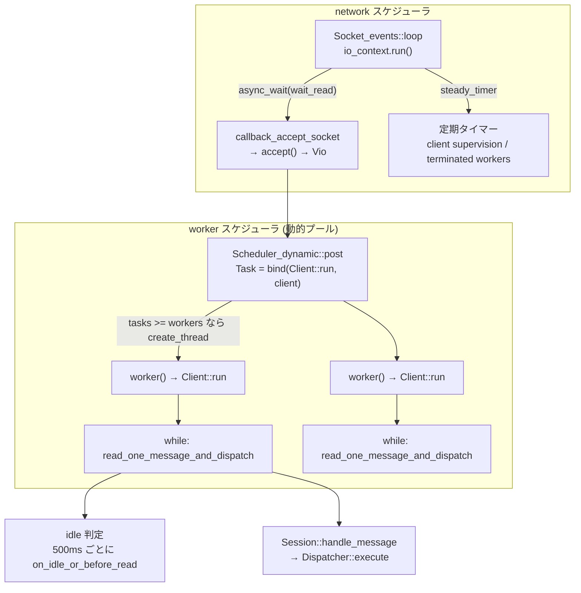

> **前提**: [X Plugin](./x-plugin-session-and-sql/) / [プロセスとスレッド](./thread-model/)

## 何を学んだか

X Plugin のスレッド構成を追うと、**期待とずれる**。

「イベントループ + ワーカープール」と聞くと、メッセージ 1 通ごとにワーカーが割り当てられる形を想像する。実際は違う。

1. **イベントループ (`Socket_events`) は accept とタイマーのためだけにある。** 使っているのは `net::io_context` (MySQL 同梱の Asio 相当) で、listen ソケットの `async_wait` と定期タイマーを回す
2. **accept したら `Client::run` を丸ごとタスクとしてワーカープールに投げる。** `Client::run` は `while` ループでメッセージを読み続けるので、**そのワーカースレッドは接続が閉じるまで占有される**
3. **結果として X も「1 接続 = 1 スレッド」だ。** classic との違いは、スレッドの供給が固定プール (`thread_cache_size`) ではなく、**必要に応じて増え idle 60 秒で減る動的プール**であること
4. **`mysqlx_min_worker_threads = 2` は「最低これだけ残す」の意味**であって、「これだけで捌く」ではない

その上で、classic にない機構が 2 つある。**認証前に届く `SERVER_HELLO` notice** と、**メッセージ列に条件を掛ける Expect ブロック**だ。



## なぜそうなっているか

**イベントループを accept にしか使わなかったのは、SQL の実行がブロッキングだからだ。** `dispatch_command` の先には Bison パーサも InnoDB の B+tree 探索もロック待ちもある。これらを「途中で中断して後で再開する」形に書き換えるのは、[SELECT の一生](./life-of-a-select/)で見たとおりサーバ全体の書き換えになる。X Plugin は classic の実行経路に合流する方針を採ったので ([X Plugin のセッションのページ](./x-plugin-session-and-sql/))、必然的にスレッドをブロックさせるしかない。**イベントループ化されたのは accept とタイマーだけ**、というのは方針の必然的な帰結だ。

**それでも動的プールにしたのは、接続数が読めないからだ。** classic の `thread_cache_size` は「捨てずに取っておく pthread の数」で、上限を設定で決める。X の `Scheduler_dynamic` は「タスク数がワーカー数を超えたら作る、idle が続いたら減らす」という自己調整で、設定するのは下限 (`mysqlx_min_worker_threads`) だけ。**プラグインとして後から追加される以上、「サーバ全体で何本のスレッドが妥当か」を決められない**ので、需要に追随する形を選んだ。

**500ms の細切れ待ちは、ブロッキング read を中断できないことへの対処だ。** classic は `KILL` されたスレッドをシグナルや `vio_shutdown` で起こす。X はプラグインなのでその機構に乗れず、**「短く待って自分で確認する」というポーリングになった。** `mysqlx_wait_timeout` が 28800 秒でも、実際には 500ms ごとに目が覚めている。CPU コストは接続数 × 2 回/秒の条件チェックで、無視できる範囲に収まっている。

**`SERVER_HELLO` を認証前に送るのは、プロトコルの自己申告のためだ。** classic はサーバが先に Initial Handshake Packet を送るので、繋いだ瞬間に「MySQL のサーバだ」と分かる ([ハンドシェイクのページ](./handshake-and-auth/))。X でクライアントが先に話す設計にすると、間違ったポートに繋いだときに沈黙するだけになる。notice という既存の枠組みで同じ役割を果たしたので、**新しいメッセージ型を増やさずに済んだ。** ただし `NOTICE = 11` を固定する制約と引き換えだ。

**Expect ブロックは、往復を減らすためにある。** X は 1 接続で複数のメッセージを続けて送れる。だが「1 通目が失敗したら 2 通目は送りたくない」という依存関係があると、結局 1 通ずつ応答を待つことになる。`no_error` の Expect ブロックで囲めば、**まとめて送ってサーバ側で打ち切ってもらえる。** ネットワーク RTT が大きい環境でのバッチ処理を想定した機構で、トランザクションとは独立している (ロールバックはしない)。

**切断理由を notice で返すのは、classic の弱点を意識した結果だ。** classic では `wait_timeout` で切られても `net_write_timeout` で切られてもクライアントには「接続が消えた」としか見えない ([パケットのページ](./packet-framing/))。X は切る直前に notice を 1 通投げてから閉じる。**「なぜ切れたか」がアプリのログに残る**という運用上の差が出る。

## ソースコードのどこか

### イベントループは accept 専用

```cpp title="plugin/x/src/ngs/socket_events.cc"
  socket_event->acceptor.async_wait(Socket::wait_read,
                                    [this, socket_event](std::error_code ec) {
                                      callback_accept_socket(socket_event, ec);
                                    });
```

[`Socket_events::listen` (`plugin/x/src/ngs/socket_events.cc#L128`)](https://github.com/mysql/mysql-server/blob/mysql-8.4.11/plugin/x/src/ngs/socket_events.cc#L128)。ループ本体はこの 1 行だ。

```cpp title="plugin/x/src/ngs/socket_events.cc"
void Socket_events::loop() { m_io_context.run(); }

void Socket_events::break_loop() { m_io_context.stop(); }
```

[L171](https://github.com/mysql/mysql-server/blob/mysql-8.4.11/plugin/x/src/ngs/socket_events.cc#L171)。**このループが扱うのは、listen ソケットと `steady_timer` だけ。** 確立済みの接続のソケットは 1 つも登録されない。

タイマーのコメントに制約が書いてある。

```cpp title="plugin/x/src/ngs/socket_events.cc"
/** Register a callback to be executed in a fixed time interval.

The callback is called from the server's event loop thread, until either
the server is stopped or the callback returns false.

NOTE: This method may only be called from the same thread as the event loop.
*/
```

コールバックが `false` を返すまで再スケジュールし続ける、という形 (`callback_timeout` が `expires_after` してもう一度 `async_wait`)。

### accept したら `Client::run` を丸ごと投げる

```cpp title="plugin/x/src/server/server.cc"
    auto client = will_accept_client(vio);

    if (client) {
      // connection accepted, add to client list and start handshake etc
      client->reset_accept_time();

      Scheduler_dynamic::Task *task =
          ngs::allocate_object<Scheduler_dynamic::Task>(
              std::bind(&xpl::iface::Client::run, client));

      const uint64_t client_id = client->client_id_num();
      client.reset();

      // all references to client object should be removed at this thread
      if (!m_worker_scheduler->post(task)) {
```

[`server.cc#L378`](https://github.com/mysql/mysql-server/blob/mysql-8.4.11/plugin/x/src/server/server.cc#L378)。**`std::bind(&Client::run, client)` がタスクの中身だ。** そして `Client::run` は次のとおり。

```cpp title="plugin/x/src/ngs/client.cc"
void Client::run() {
  try {
    on_client_addr();
    on_accept();

    while (m_state != State::k_closing && m_session) {
      Error_code error = read_one_message_and_dispatch();

      // read could took some time, thus lets recheck the state
      if (m_state == State::k_closing) break;

      // Error generated by decoding
      // not by request-response model
      if (error) {
        // !message and !error = EOF
        m_encoder->send_result(Fatal(error));
        disconnect_and_trigger_close();
        break;
      }
    }
  } catch (std::exception &e) {
    log_error(ER_XPLUGIN_FORCE_STOP_CLIENT, client_id(), e.what());
  }
```

[`ngs/client.cc#L573`](https://github.com/mysql/mysql-server/blob/mysql-8.4.11/plugin/x/src/ngs/client.cc#L573)。**接続が閉じるまで戻ってこない `while` ループ。** その間ワーカースレッドは他のクライアントを見られない。

`read_one_message_and_dispatch` は 1 メッセージ読んでディスパッチするだけ。

```cpp title="plugin/x/src/ngs/client.cc"
Error_code Client::read_one_message_and_dispatch() {
  DBUG_TRACE;
  const auto decode_error = m_decoder.read_and_decode(get_idle_processing());

  if (decode_error.was_peer_disconnected()) {
    on_network_error(0);
    return {};
  }

  const auto io_error = decode_error.get_io_error();
  if (0 != io_error) {
    if (io_error == SOCKET_ETIMEDOUT || io_error == SOCKET_EAGAIN) {
      on_read_timeout();
    }
```

[L550](https://github.com/mysql/mysql-server/blob/mysql-8.4.11/plugin/x/src/ngs/client.cc#L550)。**デコードの中で `Session::handle_message` まで呼ばれる** ([X Plugin のセッションのページ](./x-plugin-session-and-sql/))。`read_and_decode` はブロッキングだ。

つまり classic と構造は同じで、**`do_command` のループが `Client::run` のループに、`THD` が `Client` + `Session` + `Sql_data_context` の 3 つ組に置き換わっただけ**だ。

### 動的ワーカープール

```cpp title="plugin/x/src/ngs/scheduler.cc"
bool Scheduler_dynamic::post(Task *task) {
  if (is_running() == false || task == nullptr) return false;

  {
    MUTEX_LOCK(lock, m_worker_pending_mutex);

    log_debug("Scheduler '%s', post task", m_name.c_str());

    if (increase_tasks_count() >= m_workers_count.load()) {
      try {
        create_thread();
      } catch (std::exception &e) {
        log_error(ER_XPLUGIN_EXCEPTION_IN_TASK_SCHEDULER, e.what());
        decrease_tasks_count();
        return false;
      }
    }
  }
```

[`scheduler.cc#L132`](https://github.com/mysql/mysql-server/blob/mysql-8.4.11/plugin/x/src/ngs/scheduler.cc#L132)。**タスク数がワーカー数以上になったらスレッドを 1 本足す。** `Client::run` は終わらないタスクなので、実質「接続 1 本につきスレッド 1 本」を保証している。

ワーカーのループはこう。

```cpp title="plugin/x/src/ngs/scheduler.cc"
void *Scheduler_dynamic::worker() {
  bool worker_active = true;
  if (thread_init()) {
    ulonglong thread_waiting_time = TIME_VALUE_NOT_VALID;
    while (is_running()) {
      bool task_available = false;

      try {
        Task *task = nullptr;

        while (is_running() && m_tasks.empty() == false &&
               task_available == false) {
          task_available = m_tasks.pop(task);
        }

        if (task_available && task) {
          Memory_instrumented<Task>::Unique_ptr task_ptr(task);
          thread_waiting_time = TIME_VALUE_NOT_VALID;

          (*task_ptr)();
        }
      } catch (std::exception &e) {
        log_error(ER_XPLUGIN_EXCEPTION_IN_EVENT_LOOP, m_name.c_str(), e.what());
      }
```

[L216](https://github.com/mysql/mysql-server/blob/mysql-8.4.11/plugin/x/src/ngs/scheduler.cc#L216)。`(*task_ptr)()` がクライアントの一生ぶん走る。**`catch (std::exception &)` があるので、ワーカースレッドは 1 つのクライアントで例外が出ても死なない。**

回収の条件はこう。

```cpp title="plugin/x/src/ngs/scheduler.cc"
  if (thread_waiting_for_delta_ms < m_idle_worker_timeout) {
    // Some implementations may signal a condition variable without
    // any reason. We need to write the time when the thread went to idle state
    // state and monitor it!
    const int result = m_worker_pending_cond.timed_wait(
        m_worker_pending_mutex,
        (m_idle_worker_timeout - thread_waiting_for_delta_ms) * MILLI_TO_NANO);

    if (!is_timeout(result)) return false;
  } else {
    ...
  }

  if (m_workers_count.load() > m_min_workers_count.load()) {
    decrease_workers_count();
    return true;
  }
```

[`wait_if_idle_then_delete_worker` (L178)](https://github.com/mysql/mysql-server/blob/mysql-8.4.11/plugin/x/src/ngs/scheduler.cc#L178)。**spurious wakeup を考慮して「idle になった時刻」を記録し、経過時間で判定している。** `m_idle_worker_timeout` の初期値はコンストラクタで `60 * 1000` ミリ秒。

設定の反映はここ。

```cpp title="plugin/x/src/server/builder/server_builder.cc"
    const auto min = thd_scheduler->set_num_workers(
        xpl::Plugin_system_variables::m_min_worker_threads);
    if (min < xpl::Plugin_system_variables::m_min_worker_threads)
      xpl::Plugin_system_variables::m_min_worker_threads = min;

    thd_scheduler->set_idle_worker_timeout(
        xpl::Plugin_system_variables::m_idle_worker_thread_timeout * 1000);
```

[`server_builder.cc#L80`](https://github.com/mysql/mysql-server/blob/mysql-8.4.11/plugin/x/src/server/builder/server_builder.cc#L80)。**`set_num_workers` が失敗した (スレッドを作れなかった) ら、システム変数のほうを実際の値に書き戻す。** ユーザが設定した値と `SHOW VARIABLES` の値が食い違わないようにする配慮だ。

既定値は [`system_variables_defaults.h`](./x-protocol-messages/) の `k_min_worker_threads = 2` / `k_idle_worker_thread_timeout = 60`。

スケジューラは 2 つある。

```cpp title="plugin/x/src/server/builder/server_builder.cc"
  auto net_scheduler = ngs::allocate_shared<ngs::Scheduler_dynamic>(
      "network", KEY_thread_x_acceptor);
  auto result = ngs::allocate_object<ngs::Server>(
      net_scheduler, m_thd_scheduler, m_config,
```

[L99](https://github.com/mysql/mysql-server/blob/mysql-8.4.11/plugin/x/src/server/builder/server_builder.cc#L99)。`"network"` (acceptor 用、イベントループを回す) と `m_thd_scheduler` (クライアント用)。performance_schema への登録は [`xpl_performance_schema.cc#L35`](https://github.com/mysql/mysql-server/blob/mysql-8.4.11/plugin/x/src/xpl_performance_schema.cc#L35) で、カテゴリ `"mysqlx"` に `"acceptor_network"` と `"worker"` の 2 種類。`performance_schema.threads` の `NAME` には `thread/mysqlx/acceptor_network` / `thread/mysqlx/worker` として現れ、OS 側のスレッド名は `xpl_accept` / `xpl_worker` になる。

### 500ms の細切れ待ちで KILL を見る

`read_and_decode` に渡している `Waiting_for_io` が、待ち方を変える仕掛けだ。

```cpp title="plugin/x/src/ngs/protocol_decoder.cc"
const uint32_t k_on_idle_timeout_value = SOCKET_TIMEOUT_ROUNDUP(500);
```

[`protocol_decoder.cc#L41`](https://github.com/mysql/mysql-server/blob/mysql-8.4.11/plugin/x/src/ngs/protocol_decoder.cc#L41)。

```cpp title="plugin/x/src/ngs/protocol_decoder.cc"
  const bool needs_idle_check = wait_for_io->has_to_report_idle_waiting();
  const uint64_t io_read_timeout =
      needs_idle_check ? k_on_idle_timeout_value : m_wait_timeout_in_ms;

  m_vio->set_timeout_in_ms(xpl::iface::Vio::Direction::k_read, io_read_timeout);

  uint64_t total_timeout = 0;
  ...
  while (header_copied < 4) {
    if (needs_idle_check)
      if (!wait_for_io->on_idle_or_before_read()) return false;

    if (!m_vio_input_stream.Next((const void **)&input, &input_size)) {
      int out_error_code = 0;
      if (m_vio_input_stream.was_io_error(&out_error_code)) {
        if ((out_error_code == SOCKET_ETIMEDOUT ||
             out_error_code == SOCKET_EAGAIN) &&
            needs_idle_check) {
          total_timeout += k_on_idle_timeout_value;
          if (total_timeout < m_wait_timeout_in_ms) {
            m_vio_input_stream.clear_io_error();

            continue;
          }
        }
      }
      return false;
    }
```

[`read_header` (L58)](https://github.com/mysql/mysql-server/blob/mysql-8.4.11/plugin/x/src/ngs/protocol_decoder.cc#L58)。**`mysqlx_wait_timeout` (28800 秒) を 1 回で待つのではなく、500ms ずつ待って `total_timeout` に足していく。** そのたびに `on_idle_or_before_read()` を呼ぶ。

そのコールバックが何をしているか。

```cpp title="plugin/x/src/ngs/client.cc"
  bool on_idle_or_before_read() override {
    DBUG_TRACE;
    const auto state = m_client->get_state();

    if (state == xpl::iface::Client::State::k_running &&
        m_client->session()->data_context().is_killed()) {
      // Try to set the reason now, decide make the decision
      // about sending a notice, later on.
      m_client->set_close_reason_if_non_fatal(Close_reason::k_kill);
      return false;
    }

    if (state == Client::State::k_closed || state == Client::State::k_closing)
      return false;

    if (m_global_need_reporting && !m_client->protocol().is_building_row())
      return m_global_idle_reporting->on_idle_or_before_read();

    return true;
  }
```

[`Client_idle_reporting` (`ngs/client.cc#L72`)](https://github.com/mysql/mysql-server/blob/mysql-8.4.11/plugin/x/src/ngs/client.cc#L72)。**`KILL` されたか、シャットダウン中かを 500ms ごとにチェックする。** ブロッキング read で寝ているスレッドを起こす手段がないので、細かく起きて自分で確認するという解法だ。

さらに `m_global_idle_reporting` があると、Group Replication の状態変化 notice など「アイドル中に送りたいもの」を流せる。`is_building_row()` を見ているのは、**行データを組み立てている最中に notice を割り込ませない**ため。

`k_running` 以外の状態 (認証中など) では `is_killed()` の判定に入らないことにも注意。

### `SERVER_HELLO` は認証前

```cpp title="plugin/x/src/ngs/client.cc"
  // pre-allocate the initial session
  // this is also needed for the srv_session to correctly report us to the
  // audit.log as in the Pre-authenticate state
  if (!create_session()) {
    m_close_reason = Close_reason::k_error;
    disconnect_and_trigger_close();

    return;
  }

  if (xpl::Plugin_system_variables::m_enable_hello_notice)
    m_encoder->send_notice(xpl::iface::Frame_type::k_server_hello,
                           xpl::iface::Frame_scope::k_global, "", true);
```

[`Client::on_accept` (`ngs/client.cc#L466`)](https://github.com/mysql/mysql-server/blob/mysql-8.4.11/plugin/x/src/ngs/client.cc#L466)。`on_accept` は `Client::run` の冒頭で呼ばれる。**クライアントが何も送らないうちに `NOTICE` (型 11) が飛ぶ。**

`scope` は `k_global`、payload は空文字列。**「X Protocol のサーバがここにいる」という合図以上の意味はない。** これがあるおかげで、クライアントは 33060 に繋いだ直後に「本当に X のサーバか」を判定できる。classic の Initial Handshake Packet に相当する役割だが、フォーマットは通常の notice と同じ。

`mysqlx_enable_hello_notice=OFF` にすると送られなくなる ([X Protocol のページ](./x-protocol-messages/)の `k_enable_hello_notice`)。

その直前で `create_session()` しているのも重要で、**認証前でも `Srv_session` (= `THD`) がすでに存在する。** audit ログに "Pre-authenticate" 状態として出すため、とコメントにある。

### Expect ブロック

X 独自の機構で、**メッセージ列に条件を掛ける**。`Dispatcher::execute` が全メッセージを前後フックで挟む ([X Plugin のセッションのページ](./x-plugin-session-and-sql/))。

```cpp title="plugin/x/src/expect/expect_stack.cc"
ngs::Error_code Expectation_stack::pre_client_stmt(const int8_t msgid) {
  if (!m_expect_stack.empty() && m_expect_stack.back().failed()) {
    // special handling for nested expect blocks
    // if a block open or close arrives in a failed state, we let it through
    // so that they can be pushed/popped on the stack and properly accounted
    switch (msgid) {
      case Mysqlx::ClientMessages::EXPECT_OPEN:
        [[fallthrough]];
      case Mysqlx::ClientMessages::EXPECT_CLOSE:
        break;

      default:
        return m_expect_stack.back().error();
    }
  }

  return ngs::Error_code();
}
```

[`expect_stack.cc#L111`](https://github.com/mysql/mysql-server/blob/mysql-8.4.11/plugin/x/src/expect/expect_stack.cc#L111)。**ブロックが失敗状態に入ったら、以降のメッセージは実行せずに同じエラーを返し続ける。** `EXPECT_OPEN` / `EXPECT_CLOSE` だけは通してスタックの整合性を保つ。

失敗にする条件はこう。

```cpp title="plugin/x/src/expect/expect_stack.cc"
void Expectation_stack::post_client_stmt_failed(const int8_t) {
  if (m_expect_stack.empty()) return;

  auto &last_expect = m_expect_stack.back();

  if (last_expect.fail_on_error() && !last_expect.error()) {
    const ngs::Error_code error(ER_X_EXPECT_NO_ERROR_FAILED,
                                "Expectation failed: no_error");
    last_expect.set_failed(error);
  }
}
```

[L136](https://github.com/mysql/mysql-server/blob/mysql-8.4.11/plugin/x/src/expect/expect_stack.cc#L136)。

指定できる条件は 3 つだけだ。

```cpp title="plugin/x/src/expect/expect.cc"
ngs::Error_code Expectation::set(const uint32_t key, const std::string &value) {
  switch (key) {
    case Mysqlx::Expect::Open_Condition_Key_EXPECT_NO_ERROR:
      if (value == "1" || value.empty())
        m_fail_on_error = true;
      ...
    case Mysqlx::Expect::Open_Condition_Key_EXPECT_FIELD_EXIST:
      add_condition(Expect_condition_ptr{new Expect_condition_field(value)});
      break;

    case Mysqlx::Expect::Open_Condition_Key_EXPECT_DOCID_GENERATED:
      add_condition(Expect_condition_ptr{new Expect_condition_docid()});
      break;

    default:
      return ngs::Error(ER_X_EXPECT_BAD_CONDITION, "Unknown condition key: %u",
                        static_cast<unsigned>(key));
```

[`expect.cc#L185`](https://github.com/mysql/mysql-server/blob/mysql-8.4.11/plugin/x/src/expect/expect.cc#L185)。

- **`no_error`** — ブロック内で 1 つでも失敗したら、以降を全部スキップする
- **`field_exists`** — サーバがそのフィールド / 機能に対応しているか
- **`docid_generated`** — ドキュメント ID の自動生成に対応しているか

スタックは 4 段ぶん予約されている。

```cpp title="plugin/x/src/expect/expect_stack.cc"
Expectation_stack::Expectation_stack() {
  /*
   Reserve four elements inside the vector holding open
   expectation blocks. In most cases there is going to be
   single expectation block used. But to allow fast nesting
   of expectations the value should be greater than one.
   */
  m_expect_stack.reserve(4);
}
```

### タイムアウトの分類

```cpp title="plugin/x/src/ngs/client.cc"
void Client::on_read_timeout() {
  set_close_reason_if_non_fatal(Close_reason::k_read_timeout);
  queue_up_disconnection_notice(ngs::Error_code(
      ER_IO_READ_ERROR, "IO Read error: read_timeout exceeded"));
}
```

[L344](https://github.com/mysql/mysql-server/blob/mysql-8.4.11/plugin/x/src/ngs/client.cc#L344)。**切断の理由を notice としてキューに積む。** `Client::run` の最後で吐き出される。

```cpp title="plugin/x/src/ngs/client.cc"
  if (m_session) {
    queue_up_disconnection_notice_if_necessary();
    m_session->get_notice_output_queue().encode_queued_items(true);
  }
```

**classic では「なぜ切れたか」がクライアントに伝わらない**が、X では最後の notice で理由が届く。

理由はステータス変数にも分類されて入る。

```cpp title="plugin/x/src/ngs/client.cc"
void Client::update_counters() {
  switch (m_close_reason) {
    case Close_reason::k_write_timeout:
    case Close_reason::k_read_timeout:
      ++xpl::Global_status_variables::instance().m_aborted_clients;
      ++xpl::Global_status_variables::instance().m_connection_errors_count;
      break;
```

[L367](https://github.com/mysql/mysql-server/blob/mysql-8.4.11/plugin/x/src/ngs/client.cc#L367)。

## つまずきどころ

### `mysqlx_min_worker_threads` を増やしても同時実行数は増えない

この変数は「最低これだけスレッドを残す」の下限だ。接続が来れば `post()` が必要なだけスレッドを作る。**同時接続数を制限しているのは `mysqlx_max_connections` (既定 100) のほう。** 逆に、接続が切れて `mysqlx_idle_worker_thread_timeout` (既定 60 秒) 経つと下限まで減る。**接続が波打つワークロードでは、スレッドの生成と破棄が繰り返される。** 定常的に数十接続あるなら、下限を上げておくとその分の生成コストが消える。

### X も 1 接続 1 スレッドなので、メモリの見積もりは classic と同じ

「イベントループだから軽い」という期待は成り立たない。`Client::run` が worker を占有するので、**100 接続なら 100 本のスレッド + 100 個の `THD`** がいる。`mysqlx_max_connections` を大きくするときは、classic の `max_connections` と同じ計算 (スタックサイズ × 本数、セッションバッファ) をする。

### `SHOW PROCESSLIST` のスレッドは X のワーカーではない

`performance_schema.threads` には `thread/mysqlx/worker` と `thread/mysqlx/acceptor_network` が出る。一方 `SHOW PROCESSLIST` に出るのは `srv_session_open` が作った内部セッションの `THD` だ。**OS スレッドと `THD` の対応が classic ほど素直ではない**ので、`performance_schema.threads` の `THREAD_OS_ID` から追う。しかも `Sql_data_context::deinit` は PFS のスレッドを作り直す。

```cpp title="plugin/x/src/sql_data_context.cc"
  PSI_THREAD_CALL(delete_current_thread)();

  PSI_thread *psi =
      PSI_THREAD_CALL(new_thread)(KEY_thread_x_worker, 0, nullptr, 0);
```

**セッションを閉じるたびに PFS の thread が張り替えられる。** [classic の thread cache](./connection-layer/) と同じ罠で、`THREAD_OS_ID` は変わらないのに計装オブジェクトは別物になる。

### `KILL` の反映は最大 500ms 遅れる

`on_idle_or_before_read` が呼ばれるのは、**メッセージの読み待ちに入っているときだけ**だ。クエリ実行中の `KILL` は classic と同じ経路 (`THD::killed`) で効く。アイドル中の `KILL` は次の 500ms の目覚めまで反映されない。「`KILL` したのに `SHOW PROCESSLIST` から消えない」ときは、この遅延か、クエリが `killed` を見るポイントに達していないかのどちらかだ。

### Expect ブロックはトランザクションではない

`no_error` の Expect ブロックの中で失敗すると、以降のメッセージが**実行されずにエラーが返る**だけで、すでに実行済みのものは巻き戻らない。`post_client_stmt_failed` を見れば分かるとおり、やっているのはフラグを立てることだけだ。**原子性が欲しければ、Expect ブロックの中で `BEGIN` / `COMMIT` を明示的に実行する。**

### 切断 notice が届かないことがある

`queue_up_disconnection_notice` が積んだ notice は `Client::run` の最後に `encode_queued_items(true)` で吐き出される。だが**ソケットがすでに壊れていれば書けない。** ネットワークエラーで切れた場合には届かず、`wait_timeout` / `read_timeout` のように「サーバ側が能動的に切る」ケースでだけ届く。届いた notice はデバッグの強い手がかりになるが、届かないことをもって「ネットワークは無事だった」とは言えない。

### 例外はワーカースレッドを殺さないが、接続は死ぬ

`Scheduler_dynamic::worker` の `catch (std::exception &)` と `Client::run` の `catch (std::exception &)` の 2 段構えがある。**プラグイン内で想定外の例外が出ても mysqld は落ちない**が、その接続は `ER_XPLUGIN_FORCE_STOP_CLIENT` をエラーログに残して切れる。エラーログにこのメッセージが出ていたら、X Plugin 内部の不具合か、protobuf のパース周りで想定外の入力を踏んでいる。
