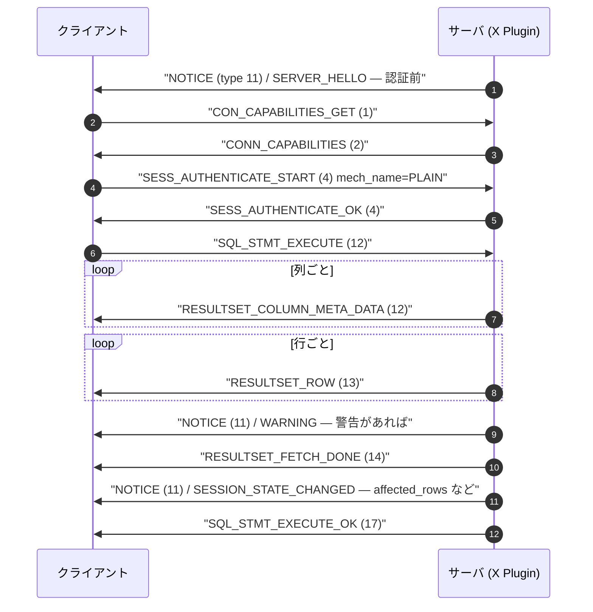

## 何を学んだか

MySQL は 2 つのプロトコルを同時に待ち受けている。3306 の classic と、33060 の X Protocol だ。X の設計判断は 4 点に集約できる。

1. **メッセージは protobuf、フレームは手書き。** 4 バイトのリトルエンディアン長 + 1 バイトのメッセージ型。**長さフィールドには型バイトの 1 が含まれる**
2. **メッセージ ID の定義はワイヤに流れない。** `ClientMessages` / `ServerMessages` という `message` は、`protoc` に定数を生成させて番号の重複を検査させるためだけに書かれている
3. **サーバは要求と無関係にメッセージを送れる。** `NOTICE` (= 11) がそれで、番号は「永久に 11 のまま」とコメントで固定されている
4. **classic の設定は一切共有しない。** ポートも `max_allowed_packet` も 4 種類のタイムアウトも、X 専用の変数が別にある

そして重要なのが、**X Protocol は SQL の代替ではない**ということだ。`Mysqlx.Sql.StmtExecute` で SQL 文字列をそのまま送れるし、CRUD メッセージ (`Find` / `Insert` / `Update` / `Delete`) も[サーバ内で SQL 文字列に変換されてから classic と同じ経路に流される](./x-plugin-session-and-sql/)。

1 本の `StmtExecute` に対して流れるメッセージ列は、classic の結果セットとよく似ている。違うのは、要求していない `NOTICE` が任意の位置に挟まることだ。



## ソースコードのどこか

### フレーム

```
X Protocol のフレーム
+----------+----------+----------+----------+----------+-------------------+
|  byte 0  |  byte 1  |  byte 2  |  byte 3  |  byte 4  |  protobuf payload |
+----------+----------+----------+----------+----------+-------------------+
|   message_size (LE, 32bit)                | msg_type |                   |
+-------------------------------------------+----------+-------------------+
                     ^                                  ^
                     |                                  |
     この長さは msg_type の 1 バイトを含む     長さは message_size - 1
```

読むのは [`Protocol_decoder::read_header` (`plugin/x/src/ngs/protocol_decoder.cc#L58`)](https://github.com/mysql/mysql-server/blob/mysql-8.4.11/plugin/x/src/ngs/protocol_decoder.cc#L58)。

```cpp title="plugin/x/src/ngs/protocol_decoder.cc"
  google::protobuf::io::CodedInputStream::ReadLittleEndian32FromArray(
      buffer, message_size);

  m_vio_input_stream.mark_vio_as_active();

  if (*message_size > 0) {
    ...
    *message_type = input[copy_from_input];
    ++copy_from_input;
  }
```

長さと型の関係は [`read_and_decode_impl` (L138)](https://github.com/mysql/mysql-server/blob/mysql-8.4.11/plugin/x/src/ngs/protocol_decoder.cc#L138) にはっきり出ている。

```cpp title="plugin/x/src/ngs/protocol_decoder.cc"
  if (0 == message_size) {
    return Decode_error{
        Error(ER_X_BAD_MESSAGE, "Messages without payload are not supported")};
  }

  if (m_config->m_global->max_message_size < message_size) {
    // Force disconnect
    return Decode_error{true};
  }

  const auto protobuf_payload_size = message_size - 1;
```

3 つの判断がここにある。

- **`message_size == 0` はエラー。** 型バイトすら入らないので、フレームとして成立しない
- **上限超過は「切断」。** `Decode_error{true}` は fatal 扱いで、エラーメッセージを返して継続するのではなく接続を落とす。classic の `ER_NET_PACKET_TOO_LARGE` が「ソケットは殺さない」([パケットのページ](./packet-framing/)) のと対照的だ
- **protobuf に渡すのは `message_size - 1`**

読み終わったあとの後始末も特徴的だ。

```cpp title="plugin/x/src/ngs/protocol_decoder.cc"
  const int k_header = 4;

  // Skip rest of the data
  const auto bytes_to_skip =
      message_size + k_header - m_vio_input_stream.ByteCount();

  m_vio_input_stream.Skip(bytes_to_skip);
```

**protobuf のパーサが全部読まなくても、フレームの残りを必ず読み飛ばす。** 未知のフィールドや、パースの途中で止まったケースでもフレーム境界が復元できる。classic には「読み飛ばす」という概念がなく、ずれたら [`Got packets out of order`](./packet-framing/) で終わる。

### メッセージ ID はワイヤに流れない

```proto title="plugin/x/protocol/protobuf/mysqlx.proto"
/**
 IDs of messages that can be sent from client to the server.

 @note
   This message is never sent on the wire. It is only used to let ``protoc``:
   -  generate constants
   -  check for uniqueness
*/
message ClientMessages {
  enum Type {
    CON_CAPABILITIES_GET = 1;
    CON_CAPABILITIES_SET = 2;
    CON_CLOSE = 3;

    SESS_AUTHENTICATE_START = 4;
    SESS_AUTHENTICATE_CONTINUE  = 5;
    SESS_RESET = 6;
    SESS_CLOSE = 7;

    SQL_STMT_EXECUTE = 12;

    CRUD_FIND = 17;
    CRUD_INSERT = 18;
    CRUD_UPDATE = 19;
    CRUD_DELETE = 20;
```

[`mysqlx.proto#L165`](https://github.com/mysql/mysql-server/blob/mysql-8.4.11/plugin/x/protocol/protobuf/mysqlx.proto#L165)。**protobuf には「メッセージ自身の型」を運ぶ仕組みがない**ので、型はフレームヘッダのバイトで運ぶしかない。その番号を管理する場所として、決して送られない `message` を 1 個作った。

各メッセージ側は `option` で自分の番号を宣言する。

```proto title="plugin/x/protocol/protobuf/mysqlx_sql.proto"
message StmtExecute {
  /** namespace of the statement to be executed */
  optional string namespace = 3 [ default = "sql" ];

  /** statement that shall be executed  */
  required bytes stmt = 1;

  /** values for wildcard replacements */
  repeated Mysqlx.Datatypes.Any args = 2;

  /** send only type information for @ref Mysqlx::Resultset::ColumnMetaData,
      skipping names and others */
  optional bool compact_metadata = 4 [ default = false ];

  option (client_message_id) = SQL_STMT_EXECUTE; // comment_out_if PROTOBUF_LITE
}
```

[`mysqlx_sql.proto#L55`](https://github.com/mysql/mysql-server/blob/mysql-8.4.11/plugin/x/protocol/protobuf/mysqlx_sql.proto#L55)。`client_message_id` / `server_message_id` は `google.protobuf.MessageOptions` の拡張として定義されている。**この仕掛けにより、番号の重複は `protoc` がコンパイル時に検出する。**

`namespace` フィールドが `"sql"` を既定に持つのが目を引く。X Protocol にはもう 1 つ `"mysqlx"` という名前空間があり、そちらは管理コマンド (コレクションの作成など) を実行するのに使われる。**同じ `StmtExecute` メッセージで、SQL とドキュメントストアの管理 API の両方が走る。**

`compact_metadata` フラグは、列定義から名前などを落として型情報だけ送るオプション。classic にはない。

### サーバ → クライアントの ID

```proto title="plugin/x/protocol/protobuf/mysqlx.proto"
message ServerMessages {
  enum Type {
    OK = 0;
    ERROR = 1;

    CONN_CAPABILITIES = 2;

    SESS_AUTHENTICATE_CONTINUE = 3;
    SESS_AUTHENTICATE_OK = 4;

    // NOTICE has to stay at 11 forever
    NOTICE = 11;

    RESULTSET_COLUMN_META_DATA = 12;
    RESULTSET_ROW = 13;
    RESULTSET_FETCH_DONE = 14;
    RESULTSET_FETCH_SUSPENDED = 15;
    RESULTSET_FETCH_DONE_MORE_RESULTSETS = 16;

    SQL_STMT_EXECUTE_OK = 17;
    RESULTSET_FETCH_DONE_MORE_OUT_PARAMS = 18;

    COMPRESSION = 19;
  }
}
```

[L211](https://github.com/mysql/mysql-server/blob/mysql-8.4.11/plugin/x/protocol/protobuf/mysqlx.proto#L211)。**`// NOTICE has to stay at 11 forever` のコメントが 1 行だけ付いている。** 5 から 10 が空いているのは、途中で消えたメッセージの跡だ。

`NOTICE` が固定されている理由は、**認証が終わる前から届くから**だ。クライアントは capability の交渉も認証も終わっていない段階で `SERVER_HELLO` notice を受け取る。「まだ何も合意していない状態で解釈しなければならないメッセージ」なので、番号を変えられない。

### notice

```proto title="plugin/x/protocol/protobuf/mysqlx_notice.proto"
message Frame {
  /** scope of notice */
  enum Scope {
    GLOBAL = 1;
    LOCAL = 2;
  }

  /** type of notice payload*/
  enum Type {
    WARNING = 1;
    SESSION_VARIABLE_CHANGED = 2;
    SESSION_STATE_CHANGED = 3;
    GROUP_REPLICATION_STATE_CHANGED = 4;
    SERVER_HELLO = 5;
  }

  /** the type of the payload */
  required uint32 type = 1;

  /** global or local notification */
  optional Scope  scope = 2 [ default = GLOBAL ];

  /** the payload of the notification */
  optional bytes payload = 3;
```

[`mysqlx_notice.proto#L71`](https://github.com/mysql/mysql-server/blob/mysql-8.4.11/plugin/x/protocol/protobuf/mysqlx_notice.proto#L71)。**`payload` が `bytes` になっている**のが構造の要だ。外側の `Frame` だけを解釈すれば、中身を知らない notice も安全に読み飛ばせる。

`Scope` には運用上の意味がある。ヘッダのコメントがそのまま説明している。

```proto title="plugin/x/protocol/protobuf/mysqlx_notice.proto"
A notice can be:
-  global (``.scope == GLOBAL``) or
-  belong to the currently executed @ref messages_Message_Sequence
   (``.scope == LOCAL + message sequence is active``):

@note
    If the Server sends a ``LOCAL`` notice while no message sequence is
    active, the Notice should be ignored.
```

`WARNING` notice が `SHOW WARNINGS` の代わりになる。**classic では警告を取るのに往復が 1 回必要だが、X ではクエリの結果に混ざって届く。**

`SESSION_STATE_CHANGED` は、`affected_rows` / `last_insert_id` / 生成されたドキュメント ID などを運ぶ。classic なら OK パケットのフィールドだったものが、notice に切り出されている。

### classic との対比

| 観点               | classic                                                    | X Protocol                                                |
| ------------------ | ---------------------------------------------------------- | --------------------------------------------------------- |
| 既定ポート         | 3306                                                       | 33060 (`plugin/x/variables.cmake` の `MYSQLX_TCP_PORT`)   |
| フレーム           | 3 バイト長 + 1 バイト連番。長さは payload のみ             | 4 バイト長 + 1 バイト型。**長さは型バイトを含む**         |
| 最大フレーム       | 0xFFFFFF。超えたら分割して連結                             | `mysqlx_max_allowed_packet` (既定 64MB)。超えたら**切断** |
| 型情報             | メタデータパケットの `enum_field_types`                    | `Mysqlx.Resultset.ColumnMetaData`                         |
| 値の表現           | テキスト or バイナリ (`Protocol_text` / `Protocol_binary`) | protobuf 上の型付きバイト列                               |
| 警告の取得         | `SHOW WARNINGS` で往復 1 回                                | `NOTICE` が結果に混ざる                                   |
| サーバ発の割り込み | なし (聞かれたことにしか答えない)                          | `NOTICE` をいつでも挟める                                 |
| 認証               | サーバが既定プラグインで開始、外れたらやり直し             | `AuthenticateStart` の `mech_name` をクライアントが指定   |
| 上限超過時         | `ER_NET_PACKET_TOO_LARGE` でソケットは生存                 | 即切断                                                    |

認証の非対称は `mysqlx_session.proto` に出ている。

```proto title="plugin/x/protocol/protobuf/mysqlx_session.proto"
message AuthenticateStart {
  /** authentication mechanism name */
  required string mech_name = 1;

  /** authentication data */
  optional bytes auth_data = 2;

  /** initial response */
  optional bytes initial_response = 3;
```

[L65](https://github.com/mysql/mysql-server/blob/mysql-8.4.11/plugin/x/protocol/protobuf/mysqlx_session.proto#L65)。**クライアントが機構名を指定して始める。** サーバが既定プラグインで始めてハズレならやり直す、という [classic の RESTART](./handshake-and-auth/) は起きない。使える機構は `PLAIN` / `MYSQL41` / `SHA256_MEMORY` の 3 つだけだ ([X Plugin のページ](./x-plugin-session-and-sql/))。

### CRUD メッセージ

```proto title="plugin/x/protocol/protobuf/mysqlx_crud.proto"
message Find {
  ...
  required Collection collection = 2;
  optional DataModel data_model = 3;
  repeated Projection projection = 4;
  repeated Mysqlx.Datatypes.Scalar args = 11;
  optional Mysqlx.Expr.Expr criteria = 5;
  optional Limit limit = 6;
  repeated Order order = 7;
  repeated Mysqlx.Expr.Expr grouping = 8;
  optional Mysqlx.Expr.Expr grouping_criteria = 9;
  optional RowLock locking = 12;
  optional RowLockOptions locking_options = 13;
  optional LimitExpr limit_expr = 14;
```

[`mysqlx_crud.proto#L167`](https://github.com/mysql/mysql-server/blob/mysql-8.4.11/plugin/x/protocol/protobuf/mysqlx_crud.proto#L167)。**`SELECT` の構造がそのままフィールドになっている。** `criteria` が `WHERE`、`grouping` が `GROUP BY`、`grouping_criteria` が `HAVING`、`locking` が `FOR UPDATE` / `FOR SHARE`。

フィールド番号が飛び飛び (`args = 11`、`locking = 12`) なのは、後から足されたことの跡だ。`limit` と `limit_expr` が両方あるのも、`LIMIT` を式で書けるようにした後付けの結果。

`Mysqlx.Expr.Expr` は式の抽象構文木そのもので、[サーバ側で SQL 文字列に組み立て直される](./x-plugin-session-and-sql/)。**構造化された式をワイヤに乗せて、サーバがそれを文字列にしてパーサに通す**、という往復がここで生まれている。

### X 専用のシステム変数

```cpp title="plugin/x/src/variables/system_variables_defaults.h"
namespace defaults {
namespace timeout {

const uint32_t k_interactive_timeout = 28800;
const uint32_t k_wait_timeout = 28800;
const uint32_t k_read_timeout = 30;
const uint32_t k_write_timeout = 60;
const uint32_t k_connect_timeout = 30;
const uint32_t k_port_open_timeout = 0;

}  // namespace timeout

namespace connectivity {

const char *const k_bind_address = "*";
const uint32_t k_port = MYSQLX_TCP_PORT;
const char *const k_socket = MYSQLX_UNIX_ADDR;
const uint32_t k_max_connections = 100;
const uint32_t k_max_allowed_packet = MBYTE(64);
const bool k_enable_hello_notice = true;

}  // namespace connectivity

namespace threads {

const uint32_t k_min_worker_threads = 2;
const uint32_t k_idle_worker_thread_timeout = 60;

}  // namespace threads
```

[`system_variables_defaults.h#L38`](https://github.com/mysql/mysql-server/blob/mysql-8.4.11/plugin/x/src/variables/system_variables_defaults.h#L38)。これらが `mysqlx_wait_timeout`、`mysqlx_read_timeout`、`mysqlx_max_connections` … という変数になる。

**注目すべきは `k_max_connections = 100` だ。** classic の `max_connections` (既定 151) とは完全に別枠で、X の接続は classic の枠を消費しない。逆に、**`mysqlx_max_connections` を上げずに X の同時接続を増やそうとしても効かない。**

`k_connect_timeout = 30` も classic の `connect_timeout` (既定 10) と違う。`k_enable_hello_notice = true` は `SERVER_HELLO` を送るかどうかで、既定は送る。

ポートは CMake 定数で決まる。

```cmake title="plugin/x/variables.cmake"
IF(NOT MYSQLX_TCP_PORT)
  SET(MYSQLX_TCP_PORT 33060)
ENDIF(NOT MYSQLX_TCP_PORT)
```

[`variables.cmake#L35`](https://github.com/mysql/mysql-server/blob/mysql-8.4.11/plugin/x/variables.cmake#L35)。**ビルド時に決まる定数**なので、C++ のソースを grep しても `33060` という数字は出てこない。

### 圧縮は 1 つのメッセージ型

```cpp title="plugin/x/src/ngs/message_decoder.cc"
Decode_error Message_decoder::parse_and_dispatch(
    const uint8_t message_type, const uint32_t message_size,
    xpl::Vio_input_stream *net_input_stream) {
  switch (message_type) {
    case Mysqlx::ClientMessages::COMPRESSION:
      return parse_compressed_frame(message_size, net_input_stream);

    default:  // fall-through
      return parse_protobuf_frame(message_type, message_size, net_input_stream);
  }
}
```

[`message_decoder.cc#L313`](https://github.com/mysql/mysql-server/blob/mysql-8.4.11/plugin/x/src/ngs/message_decoder.cc#L313)。**圧縮は「外側にもう 1 層」ではなく、`COMPRESSION` (クライアント側 46 / サーバ側 19) という 1 つのメッセージ型として表現されている。** その中に複数のメッセージをまとめて詰められる。classic が[フレームの外側に 7 バイトのヘッダを被せる](./packet-framing/)のと構造が違う。

protobuf のパースには再帰の上限が張られている。

```cpp title="plugin/x/src/ngs/message_decoder.cc"
  // Protobuf limits the number of nested objects when decoding messages
  // lets set the value in explicit way (to ensure that is set
  // accordingly with out stack size)
  //
  // Protobuf doesn't print a readable error after reaching the limit
  // thus in case of failure we try to validate the limit by
  // decrementing and incrementing the value & checking result for
  // failure
  stream->SetRecursionLimit(k_max_recursion_limit);
```

[L325](https://github.com/mysql/mysql-server/blob/mysql-8.4.11/plugin/x/src/ngs/message_decoder.cc#L325)。`Mysqlx.Expr.Expr` は再帰的なので、深くネストした式でスタックを溢れさせる攻撃が成立しうる。**protobuf が上限超過を判別できるエラーにしてくれないので、失敗したら再帰深度を上下させて「上限に当たったのか」を判定する workaround が入っている。**

## なぜそうなっているか

**フレームの長さに型バイトを含めたのは、読み出しの区間を減らすためだ。** 「4 バイトのヘッダを読む」→「長さを取る」→「残りを読む」という手順で、型バイトが長さの外にあると 4 + 1 + N の 3 区間を管理することになる。長さに含めれば 4 + N の 2 区間で済む。実際 `read_header` は 4 バイト読んだ後、同じバッファの続きから型バイトを取り出している。

**メッセージ ID を protobuf の外に置いたのは、protobuf に自己記述がないからだ。** protobuf のワイヤ形式はフィールド番号と型しか持たず、「このバイト列が `Find` なのか `Insert` なのか」を判別できない。`Any` に包む方法もあるが、型名の文字列を毎回運ぶことになる。1 バイトの型タグを外に置くのが最小のコストで、その番号を管理する場所として「送られない `message`」が要った。

**上限超過を切断にしたのは、フレームを読み飛ばせないからだ。** classic の `net_realloc` は「バッファを伸ばせなかった」だけなので、ソケットにはまだ全部のバイトが来ていて読み捨てられる。X で `max_message_size` を超えたフレームを読み進めれば、その間メモリかネットワークバッファを食い続ける。読み捨てるにも結局全部読む必要があるので、**「読まずに切る」を選んだ。**

**notice を作ったのは、classic の「サーバは聞かれたことにしか答えない」制約を外すためだ。** classic では警告を取るのに `SHOW WARNINGS` の往復が要り、セッション状態の変更を知るには `CLIENT_SESSION_TRACK` で OK パケットに詰め込む必要があった ([テキストプロトコルのページ](./text-protocol-and-resultset/))。X ではフレームに型があるので、いつでも `NOTICE` を割り込ませられる。**`SERVER_HELLO` を認証前に送れるのも、この非同期性のおかげだ。**

**CRUD メッセージが SQL の構造をそのまま写しているのは、サーバ側で SQL 文字列に戻すからだ。** `criteria`、`grouping`、`order`、`limit` が `WHERE`、`GROUP BY`、`ORDER BY`、`LIMIT` に 1 対 1 で対応する。**「SQL を構造化して送る」ことでクライアント側のエスケープを不要にするのが狙い**で、実際 `args` に `Scalar` を並べればプレースホルダ相当になる。代償として、サーバは受け取った木を文字列に組み立て直してからパーサに通す ([X Plugin のページ](./x-plugin-session-and-sql/))。

**X の設定を classic と分けたのは、プラグインだからだ。** X Plugin は `mysqlx` という 1 個のプラグインで、自分の listen ソケット・スレッドプール・システム変数を全部持つ。classic のコードに手を入れずに追加できる代わりに、`max_connections` も `max_allowed_packet` も `wait_timeout` も二重管理になった。

## どう活かすか

**X Protocol の接続は `max_connections` に数えられない。** `mysqlx_max_connections` (既定 100) が別枠だ。上限に当たっているのが classic 側か X 側かは、`SHOW STATUS LIKE 'Mysqlx_%'` の `Mysqlx_connections_rejected` / `Mysqlx_connections_accepted` と `Threads_connected` を分けて見る。**X 接続を増やしても classic 側の枠は空かない**ので、両方使うなら両方のサイジングが要る。

**`mysqlx_max_allowed_packet` を超えると接続が切れる。エラーは返らない。** classic のように `Got a packet bigger than 'max_allowed_packet' bytes` が返る形ではないので、アプリからは「突然切断された」ようにしか見えない。大きなドキュメントや BLOB を X 経由で扱うなら、この変数を先に確認する。

**タイムアウトの変数名が全部 `mysqlx_` 付きで別にある。** `wait_timeout` を長くしても X の接続には効かない。`mysqlx_wait_timeout` (既定 28800)、`mysqlx_read_timeout` (30)、`mysqlx_write_timeout` (60)、`mysqlx_connect_timeout` (30)。**classic の `connect_timeout` は 10 秒だが X は 30 秒**、という食い違いも覚えておく。

**X を使わないなら無効にしておく。** `mysqlx=OFF` (または `--skip-mysqlx`) で 33060 を開かなくなる。開いたままだと、classic 側をネットワークで塞いでも X 経由で SQL を実行できてしまう。`Mysqlx.Sql.StmtExecute` は任意の SQL を実行できる、ということを忘れやすい。

**プロトコルレベルのデバッグでは、5 バイトのヘッダを目印にする。** `tcpdump` で 33060 を眺めるとき、最初の 4 バイトがリトルエンディアンの長さ、5 バイト目が型番号。型 `12` (0x0C) がクライアントの `SQL_STMT_EXECUTE`、`11` (0x0B) がサーバの `NOTICE`。**`0x0B` が頻繁に流れているなら、警告が大量に出ている可能性がある。**

**クライアントライブラリを自作するときは、フレームの読み飛ばしを実装する。** サーバが `Skip(bytes_to_skip)` をしているのと同じで、**未知のメッセージ型でも長さぶんだけ読み飛ばせば同期は保てる**。この性質のおかげで、新しいメッセージ型が増えても古いクライアントは壊れない。classic にはこの逃げ道がない。
