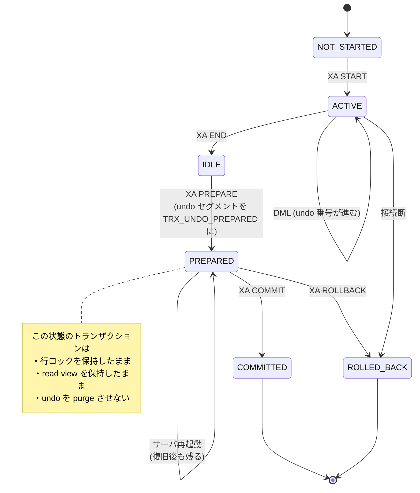

> **前提**: [トランザクション — trx_t の一生](./transaction-walkthrough/) / [undo ログ](./undo-log/) / [コミットとロールバックの内部](./commit-and-rollback-internals/)

## 何を学んだか

セーブポイントは重い仕組みではない。**保存しているのは数値 1 個だ。**

```cpp title="storage/innobase/include/trx0types.h (L148-L150)"
struct trx_savept_t {
  undo_no_t least_undo_no; /*!< least undo number to undo */
};
```

トランザクションは undo レコードに 0 から連番を振っている。セーブポイントは「今の連番はここ」というだけで、`ROLLBACK TO SAVEPOINT` はその番号まで undo を逆順に適用する。

そして**同じ仕組みが、文の失敗時の巻き戻しにも使われている**。

```cpp title="storage/innobase/trx/trx0roll.cc (L308-L313)"
    case TRX_STATE_ACTIVE:
      assert_trx_nonlocking_or_in_list(trx);
      trx->op_info = "rollback of SQL statement";

      err = trx_rollback_to_savepoint(trx, &trx->last_sql_stat_start);
```

`trx->last_sql_stat_start` は「この文が始まったときの undo 番号」だ。**1 文の途中でエラーになったとき、その文だけが巻き戻るのは、暗黙のセーブポイントがあるから**であって、特別な仕組みがあるわけではない。

XA のほうは対照的に、**ディスク上の状態を変える**。

```cpp title="storage/innobase/trx/trx0trx.cc (L3051-L3054)"
    /* Change the undo log segment states from TRX_UNDO_ACTIVE to
    TRX_UNDO_PREPARED: these modifications to the file data
    structure define the transaction as prepared in the file-based
    world, at the serialization point of lsn. */
```

undo セグメントのヘッダに「PREPARED」と書く。これでクラッシュしても、復旧後に「決着がついていないトランザクション」として残る。

## なぜそうなっているか

### なぜ ROLLBACK TO SAVEPOINT でロックが返らないのか

完全なロールバックとの差を見ると分かる。

```cpp title="storage/innobase/trx/trx0roll.cc (L121-L127)"
  if (savept == nullptr) {
    trx_rollback_finish(trx);
    MONITOR_INC(MONITOR_TRX_ROLLBACK);
  } else {
    trx->lock.que_state = TRX_QUE_RUNNING;
    MONITOR_INC(MONITOR_TRX_ROLLBACK_SAVEPOINT);
  }
```

`savept == nullptr` (全体のロールバック) のときだけ `trx_rollback_finish` を呼ぶ。**ロックの解放はそちらの経路にしかない。** 部分ロールバックは undo を適用して状態を戻すだけで、ロックには触らない。

理由は 2 相ロックの原則だ。トランザクションが継続する以上、途中で取ったロックを返すと**他のトランザクションが割り込んで、直列化可能性が壊れる**。「行を更新して、やっぱり戻して、でもその行は他人に触らせない」が正しい振る舞いになる。

**`ROLLBACK TO SAVEPOINT` はロック待ちの解消手段にならない。** デッドロックを避けるために savepoint を挟む、という設計は効かない。

### なぜ binlog の位置も savepoint に持つのか

```cpp title="storage/innobase/trx/trx0roll.cc (L387-L398)"
[[nodiscard]] static dberr_t trx_rollback_to_savepoint_for_mysql_low(
    trx_t *trx,                /*!< in/out: transaction */
    trx_named_savept_t *savep, /*!< in/out: savepoint */
    int64_t *mysql_binlog_cache_pos)
/*!< out: the MySQL binlog
cache position corresponding
to this savepoint; MySQL needs
this information to remove the
binlog entries of the queries
executed after the savepoint */
```

**InnoDB が巻き戻した分は、binlog 側も切り詰めなければならない。** そうしないとレプリカが「巻き戻したはずの更新」を適用する。名前付きセーブポイントの構造体が binlog キャッシュの位置を持ち、Server 層に返す形になっている ([binlog の walkthrough](./binlog-walkthrough/))。

`SAVEPOINT` を張るたびに `trx_savepoints` リストへ追加され、`ROLLBACK TO` したときは**それより後のセーブポイントが破棄される**。

```cpp title="storage/innobase/trx/trx0roll.cc (L403-L405)"
  /* Free all savepoints strictly later than savep. */
  trx_roll_savepoints_free(trx, UT_LIST_GET_NEXT(trx_savepoints, savep));
```

### XA PREPARE はトランザクションをセッションから切り離す

通常のトランザクションは、接続が切れれば巻き戻る。XA でプリペアしたトランザクションは違う。**接続が切れても、サーバが再起動しても残る。**

これは 2 相コミットの契約そのものだ。プリペアを返した時点で「コミットしろと言われたら必ずできる」と約束したことになるので、勝手に捨てられない。

その約束を果たすために、prepare は undo セグメントの状態をディスクに書く。書いた mtr がコミットされた LSN が、そのトランザクションの直列化点になる。

```cpp title="storage/innobase/trx/trx0trx.cc (L3073-L3078)"
    /* This mtr commit makes the transaction prepared in
    file-based world. */
    mtr_commit(&mtr);
    /*--------------*/

    const lsn_t lsn = mtr.commit_lsn();
```

復旧時は、undo セグメントを走査して PREPARED のものを `TRX_STATE_PREPARED` の `trx_t` として復元する。エラーログに出るのがこれだ。

```cpp title="storage/innobase/trx/trx0trx.cc (L3222-L3230)"
      if (count == 0) {
        ib::info(ER_IB_MSG_1207) << "Starting recovery for"
                                    " XA transactions...";
      }

      ib::info(ER_IB_MSG_1208) << "Transaction " << trx_get_id_for_print(trx)
                               << " in prepared state after recovery";

      ib::info(ER_IB_MSG_1209)
          << "Transaction contains changes to " << trx->undo_no << " rows";
```

**「Transaction contains changes to N rows」の N は undo レコードの数**だ。復旧後にこの行が出ていたら、決着していない XA が残っている。

### 内部 2PC と同じ入口を使っている

`handlerton::prepare` は 1 つしかない。ユーザが打つ `XA PREPARE` も、binlog を有効にしたときの内部 2 相コミットも、同じ `innobase_xa_prepare` を通る。

```cpp title="storage/innobase/handler/ha_innodb.cc (L20282-L20289)"
  if (prepare_trx ||
      (!thd_test_options(thd, OPTION_NOT_AUTOCOMMIT | OPTION_BEGIN))) {
    /* We were instructed to prepare the whole transaction, or
    this is an SQL statement end and autocommit is on */

    ut_ad(trx_is_registered_for_2pc(trx));

    dberr_t err = trx_prepare_for_mysql(trx);
```

`prepare_trx` が false のときは「文が終わっただけ」で、実際の prepare はしない。**内部 2PC の詳細は[2 相コミットとグループコミット](./two-phase-commit-and-group-commit/)にある**ので、ここではユーザ XA の側だけを見ている。

## ソースコードのどこか

### 状態遷移



### プリペア済みを探す

```sql
XA RECOVER CONVERT XID;
```

これは `trx_recover_for_mysql` ([`trx0trx.cc#L3196`](https://github.com/mysql/mysql-server/blob/mysql-8.4.11/storage/innobase/trx/trx0trx.cc#L3196)) が `trx_sys->rw_trx_list` を走査して `TRX_STATE_PREPARED` のものを集めたものだ。**メモリ上のリストを見ているだけ**なので、復旧直後でも実行中でも同じように出る。

I_S からも見える。

```sql
SELECT trx_id, trx_state, trx_started, trx_rows_locked, trx_rows_modified
  FROM information_schema.INNODB_TRX
 WHERE trx_state = 'PREPARED';
```

### セーブポイントの解放

`RELEASE SAVEPOINT` は `trx_release_savepoint_for_mysql` ([`trx0roll.cc#L536`](https://github.com/mysql/mysql-server/blob/mysql-8.4.11/storage/innobase/trx/trx0roll.cc#L536)) で、リストから外すだけだ。**undo は消えないし、ロックも返らない。** セーブポイントを解放しても軽くならない。

## どう活かすか

### 放置された XA PREPARED は最悪の居座り方をする

プリペア済みのトランザクションは、**行ロックも read view も undo も抱えたまま、コミットもロールバックもされずに残る**。しかも接続が切れているので `KILL` で消せない。

起きることは次の 3 つが同時だ。

1. **他のトランザクションがロック待ちでタイムアウトする** — 対象行に触れない
2. **purge が止まる** — 生きている read view がある限り、それより新しい undo は消せない ([purge](./purge/))
3. **undo テーブルスペースが伸び続ける** — truncate もできない ([undo テーブルスペースと truncate](./undo-tablespaces-and-truncate/))

対処は決着させるしかない。

```sql
XA RECOVER CONVERT XID;
-- 出た gtrid / bqual / formatID から XID を組み立てて
XA ROLLBACK 0x...,0x...,1;
```

**アプリケーションが XA を使うなら、プリペア済みトランザクションの棚卸しを監視に入れる。** 分散トランザクションマネージャがクラッシュしたときに残るのはこの状態で、放置すると数時間で DB 全体が詰まる。

### セーブポイントを「軽いトランザクション」だと思わない

`SAVEPOINT` は ORM やストアドプロシージャが「入れ子トランザクション」を実現するために内部で使うことが多い ([トリガとストアドプログラム](./triggers-and-stored-programs/))。ここまで見た通り、

- **ロックは返らない** — 内側の処理が取ったロックは外側が終わるまで残る
- **undo は残る** — 巻き戻しても purge の対象になるのはトランザクション終了後
- **binlog キャッシュも切り詰めが必要** — 巨大な文を巻き戻すとその分の処理が走る

「失敗しても savepoint で戻せばコストゼロ」ではない。**リトライを savepoint で実装している箇所は、ロック保持時間がトランザクション全体に伸びていないか確認する。**

### `XA START` した接続はプールに返さない

コネクションプールを使うアプリで、`XA END` / `XA PREPARE` を忘れた接続がプールに返ると、**次にその接続を借りたリクエストが XA の途中にいる**という状態になる。エラーメッセージ (`XAER_RMFAIL`) は原因を示さないので追いづらい。

XA を使う経路は専用の接続を用意し、使い終わったら必ず決着させる、という方針が確実だ ([コネクションプールとセッション状態](./connection-pool-and-session-state/))。

### そもそも XA が要るかを問う

MySQL の XA は、2 つ以上のリソース (別の DB、メッセージブローカ) をまたぐ原子性のためにある。**単一の MySQL インスタンス内で完結する処理には不要**で、通常のトランザクションで足りる。

XA を入れると、上に挙げた「決着しないトランザクション」の運用リスクを常時抱えることになる。**アウトボックスパターンのように、単一トランザクション + 非同期の再送で済ませられないか**を先に検討する価値がある。
