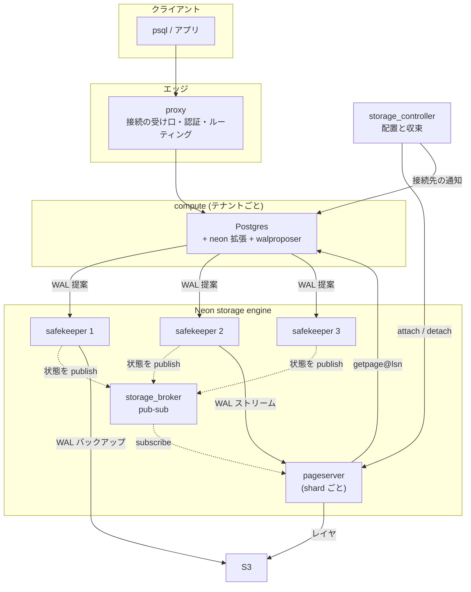
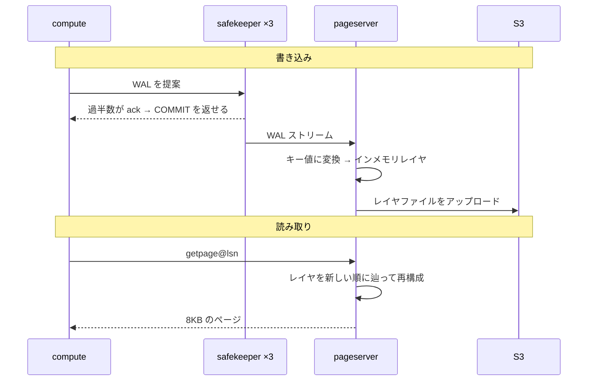

## 何を学んだか

Postgres は 1 プロセス群で完結している。接続を受け、クエリを実行し、ページをディスクから読み、WAL をディスクに書き、バックアップを取る。Neon はこれを分解した。

分解の単位は「責務」ではなく、**「壊れ方が違うもの」と「スケールの仕方が違うもの」**になっている。

## 5 つのコンポーネント

**compute** — Postgres そのもの。ステートレス。落としても失われるものがない。SQL の実行とプランニングは全部ここに残っている。Neon が触ったのは、ストレージに触る部分だけだ。テナントごとに 1 つ (プライマリ) + 読み取りレプリカ。

**safekeeper** — WAL を受け取り、過半数で永続化する。3 台 1 組。Paxos ライクな合意プロトコルを持つ。**保持するのは直近の WAL だけ**で、pageserver が消化して S3 に上げ終わったら捨てる。「まだ pageserver が処理していない WAL」の一時保管所であり、そのために可用性が要る。

**pageserver** — WAL を取り込んでキー値の履歴に変換し、レイヤファイルとして S3 に置く。`getpage@lsn` に答える。tenant (= 1 つの Postgres クラスタ) を shard に分けて複数台で持てる。**pageserver 自身は冗長化されていない。** データの真の持ち主は S3 で、pageserver はそのキャッシュ兼インデックスに近い。

**storage_controller** — どの shard をどの pageserver に置くか決め、実際にそうなるまで収束させる。Kubernetes のコントローラと同じ構造をしている。

**proxy** — Postgres wire protocol を話す。SNI からどのエンドポイントかを判定し、control plane で認証し、compute が停止していれば起こしてから繋ぐ。

これに加えて **storage_broker** がある。stateless な pub-sub で、safekeeper が自分の状態を publish し、pageserver がそれを見て「どの safekeeper から WAL を引くか」を決める。

> Storage broker targets two issues:
>
> - Allowing safekeepers and pageservers learn which nodes also hold their timelines, and timeline statuses there.
> - Avoiding O(n^2) connections between storage nodes while doing so.

**n 対 n の直接接続を避けるためだけに置かれた部品**で、状態を持たないので落ちても再起動すればいい。分散システムで「情報を集める場所」と「決定する場所」を分けた例になっている。

## どこで切ったか

Postgres の内部構造に照らすと、切れ目は 3 か所にある。

| 切れ目                   | Postgres での姿                  | Neon での姿                     |
| ------------------------ | -------------------------------- | ------------------------------- |
| ページの読み書き         | `smgr` の関数ポインタ表          | pageserver への `getpage@lsn`   |
| WAL の永続化             | `XLogFlush()` → ローカル fsync   | walproposer → safekeeper 過半数 |
| バックアップ・アーカイブ | `pg_basebackup` + WAL アーカイブ | pageserver のレイヤ + S3        |

**3 つとも、Postgres が既にインターフェースとして持っていた場所だ。** smgr は関数ポインタ表だったし ([smgr](../smgr/))、WAL の送信はストリーミングレプリケーションのプロトコルだったし、バックアップは replication プロトコルのコマンドだった。

新しい抽象を発明したのではなく、**既にあった継ぎ目を広げた**。これが「Postgres 本体の改造を最小に保つ」という方針を実現可能にしている。

## 切ったことで新しく要るもの

分解の代償は、モノリスなら暗黙だったものを明示的に作らなければならないことだ。

**1. 「今どこまで進んだか」の共有。** 同じプロセスなら変数を見ればよかった。分かれると、compute・safekeeper・pageserver が互いの進捗を知る必要がある。これを全部 LSN で表現した ([LSN がシステム全体の論理時計になる](../lsn-as-clock/))。

**2. split brain の防止。** ローカル fsync に split brain はない。合意にすると、古いプライマリと新しいプライマリが同時に WAL を書く可能性が生まれる。term によって防ぐ ([term と epoch](../safekeeper-consensus/))。

**3. 「誰がこの tenant の持ち主か」の管理。** pageserver が 1 台落ちたら、その tenant を別の pageserver に付け替える。付け替えの途中で 2 台が同じ tenant を持つ瞬間があり、両方が S3 に書くと壊れる。generation 番号で防ぐ ([generation 番号](../generations-and-deletion/))。

**4. 背圧。** compute が WAL を吐く速度に pageserver が追いつかないと、`getpage@lsn` の応答がどんどん遅くなる。Postgres 本体に `ProcessInterrupts` のフックを足して、書き込みを止める仕組みを入れた。

**5. compute の起動先の通知。** shard が別の pageserver に移ったら、compute の接続先を変えなければならない ([compute_hook](../compute-hook/))。

分解のコードよりも、**この 5 つのために書かれたコードのほうが多い**。それがこの章の後半のほとんどを占める。

## 何を分解しなかったか

同じくらい重要なのは、切らなかった場所だ。

**クエリ実行は切っていない。** プランナもエグゼキュータもそのまま compute にある。分散クエリ実行はやらない。shard に分けるのはページであってテーブルではない。だから `JOIN` は 1 台の compute の中で完結する。

**トランザクション管理は切っていない。** xid の払い出しもスナップショットも compute にある。プライマリは 1 台だけで、分散トランザクションは存在しない。

**redo は切っていない。** WAL レコードの解釈は Postgres のコードにやらせる。Rust で書き直すことは明示的に否定された ([redo](../redo-and-recovery/))。

これらを切らなかったことで、**「普通の Postgres として振る舞う」という互換性が守られている**。Neon の売りは分散データベースであることではなく、Postgres がサーバーレスになることだからだ。

## 読み書きの経路

書き込みと読み取りは、まったく別の経路を通る。

**書き込みは compute → safekeeper で完結する。** pageserver は関与しない。コミットの応答は safekeeper の過半数だけで返せる。pageserver が全部落ちていてもコミットはできる (読めなくなるだけだ)。

**読み取りは compute → pageserver で完結する。** safekeeper は関与しない。

この非対称性は意図的で、**書き込みのレイテンシと読み取りのレイテンシを別々に最適化できる**ようにしてある。詳細は [書き込みパス](../write-path/) と [読み取りパス](../read-path/) で追う。

## この先に効いてくること

- **切れ目は既存のインターフェースの上に引かれた。** 新しい抽象を作らずに済ませたことが、本体改造の少なさに直結している。
- **分解のコードより、分解の副作用に対処するコードのほうが多い。** 進捗共有・split brain・所有権・背圧・通知。
- **切らなかったところが互換性を守っている。** クエリ実行もトランザクションも redo もそのまま。
- **書き込みと読み取りは別経路。** どちらか片方が壊れても、もう片方は動く。
