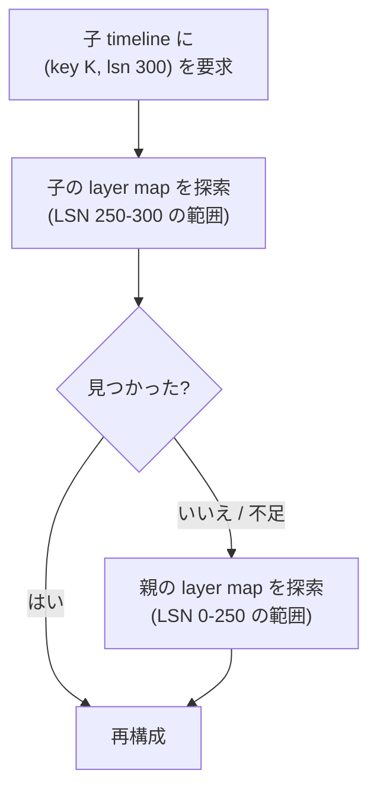

## 何を学んだか

Neon のブランチ作成は、こう実装されている。

```rust title="pageserver/src/tenant/timeline.rs"
    // Parent timeline that this timeline was branched from, and the LSN
    // of the branch point.
    ancestor_timeline: Option<Arc<Timeline>>,
    ancestor_lsn: Lsn,
```

([pageserver/src/tenant/timeline.rs L284](https://github.com/neondatabase/neon/blob/fa504217c61bbcaf5c512d75830564541f917f8f/pageserver/src/tenant/timeline.rs#L284))

**親へのポインタと、分岐した LSN。それだけ。** レイヤファイルは 1 つも作られないし、コピーもされない。

これで正しく動く理由は、キー空間の構造から出てくる。

## 読み取りが親に落ちる

新しい timeline のディレクトリは空だ。読み取り要求が来ると、layer map に何もないので、親を見に行く。

```rust title="pageserver/src/tenant/timeline.rs"
            timeline_owned = timeline
                .get_ready_ancestor_timeline(ancestor_timeline, &ctx)
                .await?;
            timeline = &*timeline_owned;
```

([pageserver/src/tenant/timeline.rs L4590](https://github.com/neondatabase/neon/blob/fa504217c61bbcaf5c512d75830564541f917f8f/pageserver/src/tenant/timeline.rs#L4590))

**親を見るときの LSN は `ancestor_lsn` に切り替わる。** 子で LSN 300 のページを要求され、分岐点が 250 なら、親には LSN 250 で聞く。



**「LSN 250 より前は親、それ以降は子」という切り分けが、LSN 1 つで表現できている。** 親の LSN 250 以降のデータは、子から見ると存在しないことになる。親がその後どれだけ更新されても、子には影響しない。

これは [LSN がシステム全体の論理時計になる](../lsn-as-clock/) の直接の帰結だ。データが `(key, lsn)` でアドレスされているので、**LSN で切れば履歴が切れる。**

## 書き込みが子に溜まる

子に WAL が来ると、子の timeline に新しいレイヤができる。親は変わらない。

**同じキーの新しいバージョンが子にできれば、読み取りはそちらを先に見つけて止まる。** 親を見に行かない。これがコピーオンライトの「オンライト」の部分で、明示的なコピー処理は存在しない。**単に新しいレイヤが上に積まれるだけ。**

LSM tree の構造がそのままブランチの実装になっている。

## 分岐点の検証

作成時にやることは、実質「分岐点が有効か」の検査だけだ。

```rust title="pageserver/src/tenant.rs"
        // We will validate our ancestor LSN in this function.  Acquire the GC lock so that
        // this check cannot race with GC, and the ancestor LSN is guaranteed to remain
        // valid while we are creating the branch.
        let _gc_cs = self.gc_cs.lock().await;
```

([pageserver/src/tenant.rs L4993](https://github.com/neondatabase/neon/blob/fa504217c61bbcaf5c512d75830564541f917f8f/pageserver/src/tenant.rs#L4993))

**検査と登録の間に GC が走らないよう、ロックを取る。** 「LSN 250 は有効です」と判定した直後に GC が 250 を消したら、壊れたブランチができる。

検査は 2 段階になっている。

```rust title="pageserver/src/tenant.rs"
        // We check it against both the planned GC cutoff stored in 'gc_info',
        // and the 'latest_gc_cutoff' of the last GC that was performed.  The
        // planned GC cutoff in 'gc_info' is normally larger than
        // 'applied_gc_cutoff_lsn', but beware of corner cases like if you just
        // changed the GC settings for the tenant to make the PITR window
        // larger, but some of the data was already removed by an earlier GC
        // iteration.
```

([pageserver/src/tenant.rs L5024](https://github.com/neondatabase/neon/blob/fa504217c61bbcaf5c512d75830564541f917f8f/pageserver/src/tenant.rs#L5024))

**普通は planned のほうが古い (保持範囲が広い) が、設定を広げた直後は逆転する。** PITR の期間を 1 日から 7 日に変えても、既に消したデータは戻らない。

だから両方チェックする。**「約束した範囲」と「実際に残っている範囲」の両方を満たす LSN だけが有効な分岐点になる** ([GC と PITR](../gc-and-pitr/))。

例外はリースだ。

```rust title="pageserver/src/tenant.rs"
            if gc_info.lsn_covered_by_lease(start_lsn) {
                tracing::info!(
                    "skipping comparison of {start_lsn} with gc cutoff {} and planned gc cutoff {planned_cutoff} due to lsn lease",
```

**リースで保護されている LSN なら、cutoff より古くてもよい。** 誰かが明示的に保持を要求している以上、データは残っている。

## 冪等性

```rust title="pageserver/src/tenant.rs"
        let timeline_create_guard = match self
            .start_creating_timeline(
                dst_id,
                CreateTimelineIdempotency::Branch {
                    ancestor_timeline_id: src_timeline.timeline_id,
                    ancestor_start_lsn: start_lsn,
                },
            )
            .await?
        {
            StartCreatingTimelineResult::CreateGuard(guard) => guard,
            StartCreatingTimelineResult::Idempotent(timeline) => {
                return Ok(CreateTimelineResult::Idempotent(timeline));
            }
        };
```

([pageserver/src/tenant.rs L5006](https://github.com/neondatabase/neon/blob/fa504217c61bbcaf5c512d75830564541f917f8f/pageserver/src/tenant.rs#L5006))

**「同じ ID で、同じ親、同じ LSN」なら成功として返す。** 違うパラメータなら競合エラー。

リトライがある世界では、「作成」が 2 回届くのは普通に起きる。**冪等性の判定に「何が同じなら同じか」を型で定義している** (`CreateTimelineIdempotency`) のが要点で、ID だけで判定すると「別のパラメータで作り直そうとしている」を見逃す。

`start_lsn` を先に確定させてからガードを取る順序にも意味がある。`start_lsn` が省略されたら「親の現在の末尾」になるので、**確定させないと冪等性の判定ができない。**

## 親が追いついていないことがある

面白いのが `get_ready_ancestor_timeline` のコメントだ。

```rust title="pageserver/src/tenant/timeline.rs"
        // It's possible that the ancestor timeline isn't active yet, or
        // is active but hasn't yet caught up to the branch point. Wait
        // for it.
        //
        // This cannot happen while the pageserver is running normally,
        // because you cannot create a branch from a point that isn't
        // present in the pageserver yet. However, we don't wait for the
        // branch point to be uploaded to cloud storage before creating
        // a branch. I.e., the branch LSN need not be remote consistent
        // for the branching operation to succeed.
        //
        // Hence, if we try to load a tenant in such a state where
        // 1. the existence of the branch was persisted (in IndexPart and/or locally)
        // 2. but the ancestor state is behind branch_lsn because it was not yet persisted
        // then we will need to wait for the ancestor timeline to
        // re-stream WAL up to branch_lsn before we access it.
```

([pageserver/src/tenant/timeline.rs L4763](https://github.com/neondatabase/neon/blob/fa504217c61bbcaf5c512d75830564541f917f8f/pageserver/src/tenant/timeline.rs#L4763))

**ブランチの作成は、分岐点が S3 に上がるのを待たない。** だから「ブランチの存在は永続化されたが、親のデータはまだ S3 にない」状態が作れてしまう。

再起動するとその状態が復元され、親が safekeeper から WAL を再取得して分岐点に追いつくまで待つことになる。

対策も書いてある。

```rust
        // NB: this could be avoided by requiring
        //   branch_lsn >= remote_consistent_lsn
        // during branch creation.
```

**やっていない。** ブランチ作成のレイテンシを守るためだろう。`remote_consistent_lsn` を待つと、S3 へのアップロード 1 往復ぶん遅くなる。

そして原因の候補に、はっきり「これはバグ」と書かれたものが混ざっている。

```rust
        // How can a tenant get in such a state?
        // - ungraceful pageserver process exit
        // - detach+attach => this is a bug, https://github.com/neondatabase/neon/issues/4219
```

**既知のバグを、対処コードのコメントで参照している。** 直っていないバグの症状をここで吸収している、という関係が読める。

## 代償

ブランチが無料であることの代償は、GC が難しくなることだ。

- 子が 1 つでもあれば、その分岐点より前は消せない
- 子が親の PITR 範囲の外に分岐していれば、親はその範囲を永久に保持する
- ブランチが多いと `retain_lsns` が伸びる

そして課金が難しくなる。**「このブランチのサイズ」は well-defined ではない。** 親と共有しているデータをどう按分するのか。この問題のために専用のモデルが作られている ([synthetic size — 課金のためにサイズを定義し直す](../synthetic-size/))。

`GcInfo` にこんなフィールドがあるのも、そのためだ。

```rust title="pageserver/src/tenant/timeline.rs"
    /// Whether our branch point is within our ancestor's PITR interval (for cost estimation)
    pub(crate) within_ancestor_pitr: bool,
```

**「分岐点が親の PITR 範囲の中にあるか」を、コスト見積もりのために保持している。** 範囲の中なら、そのデータはどのみち親が保持するので追加コストがゼロ。外なら、このブランチのせいで保持が延びている。

## この先に効いてくること

- **ブランチはポインタ 1 つ。** LSM tree の構造がそのままコピーオンライトになっている。
- **`(key, lsn)` でアドレスされていれば、LSN で切るだけで履歴が切れる。**
- **冪等性の判定基準を型で定義する。** ID だけでは足りない。
- **速さのために一時的な不整合を許し、読み取り時に待って吸収する。**
- **共有しているデータのサイズは well-defined ではない。** 課金モデルの問題になる。
