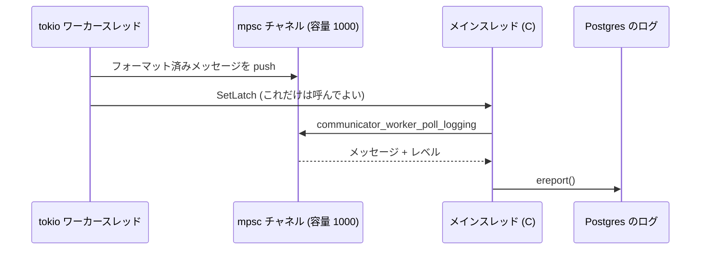

## 何を学んだか

Neon の compute には、Rust で書かれたバックグラウンドワーカーがいる。

```markdown title="pgxn/neon/communicator/README.md"
This package provides the so-called "compute-pageserver communicator",
or just "communicator" in short. The communicator is a separate
background worker process that runs in the PostgreSQL server. It's
part of the neon extension. Currently, it only provides an HTTP
endpoint for metrics, but in the future it will evolve to handle all
communications with the pageservers.
```

([pgxn/neon/communicator/README.md](https://github.com/neondatabase/neon/blob/fa504217c61bbcaf5c512d75830564541f917f8f/pgxn/neon/communicator/README.md))

**「今はメトリクスの HTTP エンドポイントだけ。将来は pageserver との通信を全部ここに移す」**と書いてある。移行の途中にあるコードだ。

そして構造は変わっている。Rust は `libcommunicator.a` という静的ライブラリになり、`neon.so` (Postgres の拡張) にリンクされる。**Rust が C の中に埋め込まれている**という向きだ。

## なぜこの向きなのか

素直に考えれば、別プロセスにして IPC で繋ぐほうが簡単だ。実際 pageserver も safekeeper も別プロセスの Rust で書かれている。

しかし communicator が最終的にやりたいことは、`getpage@lsn` の送受信だ。それには共有メモリ (LFC、prefetch のリング、LwLSN 表) に触る必要があるし、backend のレイテンシに直結するので IPC の往復を挟みたくない。

だから **Postgres のプロセスであること**を選んでいる。Postgres のプロセスであるためには、Postgres の起動シーケンスに乗り、Postgres の共有メモリに attach し、Postgres のバックグラウンドワーカーとして登録される必要がある。それは C の世界の話だ。

```c title="pgxn/neon/communicator_process.c"
	/*
	 * Pretend that this process is a WAL sender. That affects the shutdown
	 * sequence: WAL senders are shut down last, after the final checkpoint
	 * has been written. That's what we want for the communicator process too.
	 */
	am_walsender = true;
	MarkPostmasterChildWalSender();
```

([pgxn/neon/communicator_process.c L77](https://github.com/neondatabase/neon/blob/fa504217c61bbcaf5c512d75830564541f917f8f/pgxn/neon/communicator_process.c#L77))

walproposer と同じ手を使っている ([walproposer](../walproposer-in-compute/))。**「WAL sender のふりをする」ことでシャットダウン順序を制御する。** postmaster の状態機械に新しいカテゴリを足すより、既存のカテゴリに便乗するほうが安い。

## tokio を起こす

初期化はこうなる。

```rust title="pgxn/neon/communicator/src/worker_process/main_loop.rs"
    let runtime = tokio::runtime::Builder::new_multi_thread()
        .enable_all()
        .thread_name("communicator thread")
        .build()
        .unwrap();

    let worker_struct = CommunicatorWorkerProcessStruct {
        // Note: it's important to not drop the runtime, or all the tasks are dropped
        // too. Including it in the returned struct is one way to keep it around.
        runtime,

        // metrics
        lfc_metrics: LfcMetricsCollector,
    };
    let worker_struct = Box::leak(Box::new(worker_struct));
```

([pgxn/neon/communicator/src/worker_process/main_loop.rs L32](https://github.com/neondatabase/neon/blob/fa504217c61bbcaf5c512d75830564541f917f8f/pgxn/neon/communicator/src/worker_process/main_loop.rs#L32))

**`Box::leak` でランタイムを永久に生かす。** C 側にはライフタイムがないので、Rust の所有権を渡せない。プロセスが死ぬときに全部消えるので、リークで正しい。

エントリポイントの doc コメントも同じことを言っている。

```rust title="pgxn/neon/communicator/src/worker_process/worker_interface.rs"
/// This is called only once in the process, so the returned struct, and error message in
/// case of failure, are simply leaked.
```

([pgxn/neon/communicator/src/worker_process/worker_interface.rs L22](https://github.com/neondatabase/neon/blob/fa504217c61bbcaf5c512d75830564541f917f8f/pgxn/neon/communicator/src/worker_process/worker_interface.rs#L22))

**「一度しか呼ばれないからリークしてよい」と明記する。** Rust から C に値を渡すときの定石で、隠すのではなく理由と一緒に書いてある。

## 境界の掟 — Postgres の関数を呼ぶな

いちばん重要な制約が、コールバックのファイルの先頭にある。

```rust title="pgxn/neon/communicator/src/worker_process/callbacks.rs"
//! C callbacks to PostgreSQL facilities that the neon extension needs to provide. These
//! are implemented in `neon/pgxn/communicator_process.c`. The function signatures better
//! match!
//!
//! These are called from the communicator threads! Careful what you do, most Postgres
//! functions are not safe to call in that context.
```

([pgxn/neon/communicator/src/worker_process/callbacks.rs L1](https://github.com/neondatabase/neon/blob/fa504217c61bbcaf5c512d75830564541f917f8f/pgxn/neon/communicator/src/worker_process/callbacks.rs#L1))

**Postgres はスレッドを想定していない。** グローバル変数だらけで、メモリコンテキストはプロセスローカルで、`ereport()` は longjmp するかもしれない。tokio のワーカースレッドから Postgres の関数を呼ぶのは、原則として不正になる。

さらに `The function signatures better match!` — **シグネチャが合っているかは人間が保証するしかない。** bindgen も cbindgen も、この方向 (Rust が C の関数を extern 宣言する) では検査してくれない。

許されているコールバックは 2 つだけだ。

```rust title="pgxn/neon/communicator/src/worker_process/callbacks.rs"
unsafe extern "C" {
    pub fn callback_set_my_latch_unsafe();
    pub fn callback_get_lfc_metrics_unsafe() -> LfcMetrics;
}
```

`SetLatch` は Postgres の中でもシグナルハンドラから呼べる数少ない関数の 1 つで、実質アトミック操作 + `write()` しかしない。LFC のメトリクス取得は共有メモリを読むだけ。**「スレッドから呼んでよい Postgres 関数」を最小限に絞り、それ以外は境界を越えさせない。**

## ログをどう渡すか

この制約がいちばん見えるのがログだ。Rust 側は `tracing` を使いたい。しかしログの出力先は Postgres のログで、それは `ereport()` を呼ぶことを意味する。

解決策はキューだ。

```rust title="pgxn/neon/communicator/src/worker_process/logging.rs"
//! Glue code to hook up Rust logging with the `tracing` crate to the PostgreSQL log
//!
//! In the Rust threads, the log messages are written to a mpsc Channel, and the Postgres
//! process latch is raised. That wakes up the loop in the main thread, see
//! `communicator_new_bgworker_main()`. It reads the message from the channel and
//! ereport()s it. This ensures that only one thread, the main thread, calls the
//! PostgreSQL logging routines at any time.
```

([pgxn/neon/communicator/src/worker_process/logging.rs L1](https://github.com/neondatabase/neon/blob/fa504217c61bbcaf5c512d75830564541f917f8f/pgxn/neon/communicator/src/worker_process/logging.rs#L1))



**メインスレッドだけが `ereport()` を呼ぶ。** Rust 側はフォーマットまでやって、バイト列とレベルだけを渡す。

チャネルは有界 (`sync_channel(1000)`) で、溢れたら捨てる。捨てた数はカウンタで数え、C 側に一緒に返す。

```rust title="pgxn/neon/communicator/src/worker_process/logging.rs"
    *dropped_event_count_p = DROPPED_EVENT_COUNT.load(Ordering::Relaxed);
```

([pgxn/neon/communicator/src/worker_process/logging.rs L118](https://github.com/neondatabase/neon/blob/fa504217c61bbcaf5c512d75830564541f917f8f/pgxn/neon/communicator/src/worker_process/logging.rs#L118))

**ログのために本処理をブロックしない。落としたことは記録する。** 有界キューの正しい使い方が、そのまま実装されている。

レベルの変換にも正直な TODO がある。

```rust title="pgxn/neon/communicator/src/worker_process/logging.rs"
    // Map the tracing Level to PostgreSQL elevel.
    //
    // XXX: These levels are copied from PostgreSQL's elog.h. Introduce another enum to
    // hide these?
```

**Postgres のヘッダの定数を Rust に写している。** ヘッダが変わったら壊れる。bindgen を使っていない部分にはこの手の写経が残る。

## テストのためのダミー

もう 1 つ細かいが実務的な処理がある。

```rust title="pgxn/neon/communicator/src/worker_process/callbacks.rs"
// Compile unit tests with dummy versions of the functions. Unit tests cannot call back
// into the C code. (As of this writing, no unit tests even exists in the communicator
// package, but the code coverage build still builds these and tries to link with the
// external C code.)
#[cfg(test)]
unsafe fn callback_set_my_latch_unsafe() {
    panic!("not usable in unit tests");
}
```

([pgxn/neon/communicator/src/worker_process/callbacks.rs L14](https://github.com/neondatabase/neon/blob/fa504217c61bbcaf5c512d75830564541f917f8f/pgxn/neon/communicator/src/worker_process/callbacks.rs#L14))

**テストが 1 つもないのに、テストビルドのためのダミーが要る。** カバレッジ計測のビルドがリンクを試みるからだ。

「まだテストがない」ことをコメントで認めたうえで、リンクだけは通るようにしてある。**外部リンクを持つ crate は、テストを書く前からテストビルドの面倒を見なければならない。**

## 段階的移行という形

この crate の状態を一言で言うと、**足場だけ組んである**ということになる。

- プロセスは立ち上がる
- tokio は回っている
- ログの経路はできている
- コールバックの境界は決まっている
- しかし本体 (pageserver との通信) はまだ C 側 (`communicator.c`、79KB) にある

C の巨大なファイルを一気に Rust にするのではなく、**先に「Rust のコードが安全に動く場所」を作り、そこに少しずつ移す**という順序を取っている。最初に移したのがメトリクスの HTTP エンドポイントなのは、それが最も依存の少ない機能だからだ。

`communicator.c` の関数名が `communicator_read_slru_segment` や `communicator_prefetch_register_bufferv` のように既に `communicator_` 接頭辞で揃えられていることからも、**インターフェースを先に確定させてから実装を移す**という段取りが読める。

## この先に効いてくること

- **Rust を C にリンクする向きもある。** ホストプロセスの制約が強いときはこちら。
- **スレッドから呼んでよいホスト関数を最小限に絞る。** communicator では `SetLatch` と共有メモリ読み取りだけ。
- **境界を越える通知はキューにする。** 有界にして、溢れたら捨てて、捨てた数を数える。
- **移行は足場から作る。** 動く場所を先に用意し、依存の少ない機能から移す。
