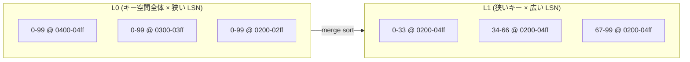

## 何を学んだか

pageserver は LSM tree の変種だが、レベルは 2 つしかない。

```markdown title="docs/pageserver-compaction.md"
Neon uses a non-standard variant of an LSM tree made up of two levels of layer files: L0 and L1.

Compaction runs in two phases: L0→L1 compaction, and L1 image compaction.
```

([docs/pageserver-compaction.md](https://github.com/neondatabase/neon/blob/fa504217c61bbcaf5c512d75830564541f917f8f/docs/pageserver-compaction.md))

L0 はインメモリレイヤをそのまま書き出したものなので、**キー空間全体をカバーする**。

```text
| Page 0-99 @ LSN 0400-04ff |
| Page 0-99 @ LSN 0300-03ff |
| Page 0-99 @ LSN 0200-02ff |
| Page 0-99 @ LSN 0100-01ff |
| Page 0-99 @ LSN 0000-00ff |
```

**どのキーを読んでも、全 L0 レイヤを見なければならない。** キー範囲で絞り込めないからだ。しかも探しているキーが入っていないことのほうが多い。read amplification がそのまま L0 の枚数になる。

## 第 1 段 — L0 を縦に刻む

```markdown title="docs/pageserver-compaction.md"
L0→L1 compaction takes the bottom-most chunk of L0 layer files of between `compaction_threshold` (default 10) and `compaction_upper_limit` (default 20) layers. It uses merge-sort to write out sorted L1 delta layers of size `compaction_target_size` (default 128 MB).
```

**横に長い長方形の束を、縦に細い長方形の束に組み替える。**



複数のレイヤをキー順にマージソートして、128MB ごとに切って書き出す。**キーで絞り込める形になるので、読み取りが訪問するレイヤ数が激減する。**

上限の根拠が config のコメントに書かれている。

```rust title="libs/pageserver_api/src/config.rs"
    // This value needs to be tuned to avoid OOM. We have 3/4*CPUs threads for L0 compaction, that's
    // 3/4*8=6 on most of our pageservers. Compacting 10 layers requires a maximum of
    // DEFAULT_CHECKPOINT_DISTANCE*10 memory, that's 2560MB. So with this config, we can get a maximum peak
    // compaction usage of 15360MB.
    pub const DEFAULT_COMPACTION_UPPER_LIMIT: usize = 10;
```

([libs/pageserver_api/src/config.rs L865](https://github.com/neondatabase/neon/blob/fa504217c61bbcaf5c512d75830564541f917f8f/libs/pageserver_api/src/config.rs#L865))

**同時実行数 × 1 回あたりのメモリ = ピーク使用量**という掛け算が明記されている。定数を変えるときに何を再計算すべきかが分かる。

## 第 2 段 — image layer を敷き直す

L1 は「image layer の床の上に delta layer が重なっている」形になる。

```text
Delta layers:               |     30-84@0310-04ff      |
Delta layers:    | 10-42@0200-02ff |           | 65-92@0174-02aa |
Image layers: |    0-39@0100    |    40-79@0100    |    80-99@0100    |
```

delta が積み重なると、また read amp が増える。そこで新しい LSN で image layer を作り直す。

```markdown title="docs/pageserver-compaction.md"
L1 image compaction scans across the L1 keyspace at some LSN, materializes page images by reading the image and delta layers below the LSN (via vectored reads), and writes out new sorted image layers of roughly size `compaction_target_size` (default 128 MB) at that LSN.
```

**「ページを実体化する」ので、読み取りパスと同じ処理をバッチでやることになる** ([ページ再構成のための vectored read](../vectored-read/))。

そして重要な性質がある。

```markdown title="docs/pageserver-compaction.md"
Even though the old layer files are not immediately garbage collected, the new image files help with read amp because reads can stop traversing the layer stack as soon as they encounter a page image.
```

**古いレイヤを消さなくても、効果はすぐ出る。** image layer は探索の停止条件なので、置いた瞬間に読み取りが速くなる ([delta layer と image layer](../layer-kinds/))。削除は GC の仕事で、PITR の保持期間が過ぎてからになる ([GC と PITR](../gc-and-pitr/))。

**「速くする」と「容量を減らす」を別のタイミングに分離できている**のが、この構造の利点になる。

## L0 を優先する

```markdown title="docs/pageserver-compaction.md"
Because L0 layers cause the most read amp (they overlap the entire keyspace and only contain page deltas), they are aggressively compacted down:

- L0 is compacted down across all tenant timelines before L1 compaction is attempted (`compaction_l0_first`).
- L0 compaction uses a separate concurrency limit of `CONCURRENT_L0_COMPACTION_TASKS` to avoid waiting for other tasks (`compaction_l0_semaphore`).
- If L0 compaction is needed on any tenant timeline, L1 image compaction will yield to start an immediate L0 compaction run
```

**別のセマフォを与え、実行中の L1 compaction を中断させる。**

普通なら 1 つのセマフォで背景タスクの同時実行数を制限すれば済む。しかしそれだと、L1 compaction (時間がかかる) がセマフォを握っている間、L0 compaction が待たされる。**優先度の違うタスクを同じセマフォで待たせると、優先度逆転が起きる。**

セマフォを分けるのは資源の総量制御としては緩くなるが、応答性のほうを取っている。

## 背圧 — 追いつかないとき

```markdown title="docs/pageserver-compaction.md"
With sustained heavy write loads, new L0 layers may be flushed faster than they can be compacted down. This can cause an unbounded buildup of read amplification and compaction debt, which can take hours to resolve even after the writes stop.
```

**「書き込みが止まってからも数時間かかる」**というのが厄介なところだ。負債が溜まると、返済に時間がかかる。

対処は 2 段階ある。

```markdown title="docs/pageserver-compaction.md"
- At `l0_flush_delay_threshold` (default 30) L0 layers, layer flushes are delayed by the flush duration, such that they take 2x as long.
- At `l0_flush_stall_threshold` (default disabled) L0 layers, layer flushes stall entirely until the L0 count falls back below the threshold. This is currently disabled because we don’t trust L0 compaction to be responsive enough.
```

**stall は無効にされている。理由が「L0 compaction が十分に応答的だと信用していないから」。**

この判断の説明が率直だ。

```markdown title="docs/pageserver-compaction.md"
Since we only delay L0 flushes by 2x when backpressuring, and haven’t enabled stalls, it is still possible for read amp to increase unbounded if compaction is too slow (although we haven’t seen this in practice). But this is considered better than stalling flushes and causing unavailability for as long as it takes L0 compaction to react, since we don’t trust it to be fast enough — at the expense of continually increasing read latency and CPU usage for this tenant.
```

**「無制限に悪化しうるが、止まるよりマシ」**という選択をしている。可用性を落として正しさ (有界性) を守るのではなく、劣化を許して可用性を守る。

そして改善案も書いてある。「L0 compaction を信用できるようになったら stall を有効にする」か「L0 の枚数に比例して遅延を増やす」。**現状が最終形ではないことを明記している。**

背圧は compute まで伝播する。

```markdown title="docs/pageserver-compaction.md"
Combined, this means that the compute will backpressure when there are 30 L0 layers (30 * 256 MB = 7.7 GB) and the Pageserver WAL ingestion lags the compute by 500 MB, for a total of ~8 GB L0+ephemeral compaction debt on a single shard.
```

**閾値を掛け算して「実際に何 GB の負債で compute が減速し始めるか」を出している** ([書き込みパス](../write-path/))。個々の設定値ではなく、システム全体としての振る舞いで記述されている。

## 遮断器 — 失敗が続いたら止める

```markdown title="docs/pageserver-compaction.md"
If compaction fails, the compaction loop will naïvely try and fail again almost immediately. It may only fail after doing a significant amount of wasted work, while holding onto the background task semaphore.
```

**失敗するまでに大量の仕事をしてしまう**のが問題になる。しかもその間セマフォを握っている。他のテナントの compaction が飢える。

```rust title="pageserver/src/tenant.rs"
            compaction_circuit_breaker: std::sync::Mutex::new(CircuitBreaker::new(
                format!("compaction-{tenant_shard_id}"),
                5,
                // Compaction can be a very expensive operation, and might leak disk space.  It also ought
                // to be infallible, as long as remote storage is available.  So if it repeatedly fails,
                // use an extremely long backoff.
                Some(Duration::from_secs(3600 * 24)),
            )),
```

([pageserver/src/tenant.rs L4491](https://github.com/neondatabase/neon/blob/fa504217c61bbcaf5c512d75830564541f917f8f/pageserver/src/tenant.rs#L4491))

**5 回失敗したら 24 時間止める。**

バックオフとしては極端に長い。根拠が 2 つ書かれている。「非常に高価な操作である」「S3 が使える限り、本来は失敗しないはずの操作である」。

**「失敗しないはずのものが失敗した」なら、それはバグかハードウェア障害で、リトライで直る性質のものではない。** だからリトライ間隔を実質「人間が調べるまで」にしている。

そして危険性も明記されている。

```markdown title="docs/pageserver-compaction.md"
Disabling compaction for a long time is dangerous, since it can lead to unbounded read amp and compaction debt, and continuous workload backpressure. However, continually failing would not help either. Tripped circuit breakers trigger an alert and must be investigated promptly.
```

**遮断器が落ちたらアラートが飛び、人間が調べる。** 自動復旧を諦めて人間にエスカレーションする、という判断が仕組みとして組み込まれている。

## この先に効いてくること

- **横長のレイヤを縦長に組み替えるのが L0→L1。** キーで絞り込める形にすることが目的。
- **image layer は置いた瞬間に効く。** 「速くする」と「容量を減らす」を分離できる。
- **優先度の違うタスクにセマフォを分ける。** 同じセマフォだと優先度逆転する。
- **有界性より可用性を選ぶことがある。** stall を無効にしている理由。
- **「失敗しないはず」の失敗には、長いバックオフと人間へのエスカレーション。**
