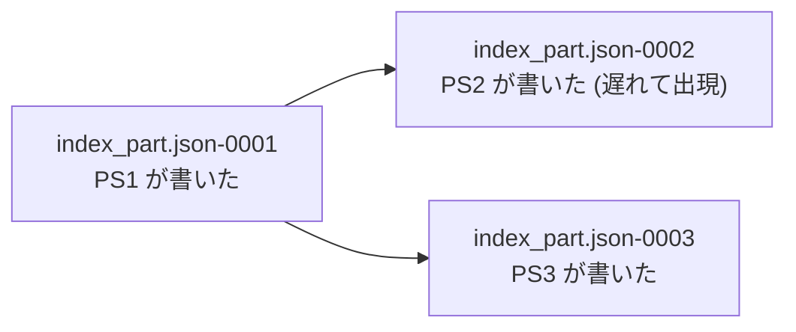
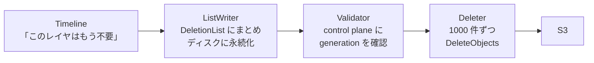

## 何を学んだか

[remote_timeline_client](../remote-timeline-client/) の冒頭には、こう書かれていた。

> NB: Pageserver assumes that it has exclusive write access to the tenant in remote storage. (中略) There's no interlock or mechanism to detect that in the pageserver, we rely on the control plane to ensure that that doesn't happen.

**「control plane が保証する」に依存していた。** これが問題になる理由を、RFC が説明している。

```markdown title="docs/rfcs/025-generation-numbers.md"
In the current deployment model, control plane guarantees that a tenant is attached to one
pageserver at a time, thereby ruling out split-brain conditions resulting from dual
attachment (however, there is always the risk of a control plane bug). This control
plane guarantee prevents robust response to failures, as if a pageserver is unresponsive
we may not detach from it.
```

([docs/rfcs/025-generation-numbers.md](https://github.com/neondatabase/neon/blob/fa504217c61bbcaf5c512d75830564541f917f8f/docs/rfcs/025-generation-numbers.md))

**「1 台だけ」を保証しようとすると、応答しない pageserver から detach できなくなる。** 生きているか死んでいるか分からない相手を、確実に切り離す方法はない。だから「1 台だけ」は諦めるしかない。

そして諦めた瞬間に、split brain が設計の前提になる。

```markdown title="docs/rfcs/025-generation-numbers.md"
Further lack of safety during split-brain conditions blocks two important features where occasional
split-brain conditions are part of the design assumptions:

- seamless tenant migration
- automatic pageserver instance failure handling (aka "failover")
```

## 解 — 番号を付けて名前空間を分ける

```markdown title="docs/rfcs/025-generation-numbers.md"
Using the control plane as the issuer of these generation numbers enables strong anti-split-brain
properties in the pageserver cluster without implementing a consensus mechanism directly
in the pageservers.
```

**pageserver に合意アルゴリズムを入れない。** 番号を発行する主体を 1 つ決めて、そこに単調性を任せる。

やることは 2 つだけだ。

1. **tenant の attach 状態が変わるたびに、番号を 1 つ増やす**
2. **S3 のオブジェクト名に、その番号を接尾辞として付ける**

```markdown title="docs/rfcs/025-generation-numbers.md"
- If two pageservers have the same tenant attached, the attachments are guaranteed to have different generation numbers, because the generation would increment while attaching the second one.
- If there are multiple pageservers running with the same node ID, all the attachments on all pageservers are guaranteed to have different generation numbers, because the generation would increment when the second node started and re-attached its tenants.
```

**2 台が同じ tenant を持っても、書くオブジェクトの名前が違う。** 上書きが起きないので、互いを壊さない。

```text
index_part.json-00000001   ← generation 1 の pageserver が書いた
index_part.json-00000002   ← generation 2 の pageserver が書いた
```

**読むときは「最も大きい番号」を読む。** これが「最新」の定義になる。

pageserver は再起動時にも control plane に「再 attach」を要求し、そこで番号が上がる。**プロセスが変われば番号が変わる**ので、同じノード ID で 2 プロセスが動いていても分かれる。

番号の幅も検討されている。

```markdown title="docs/rfcs/025-generation-numbers.md"
The generation is appended in hex format (8 byte string representing
u32), to all our existing key names. A u32's range limit would permit
27 restarts _per second_ over a 5 year system lifetime: orders of magnitude more than
is realistic.
```

**「5 年間、毎秒 27 回再起動しても足りる」**という見積もり。桁が足りるかどうかを、運用の実感に翻訳して検証している。

## 「最新」は時刻順ではない

RFC の中で最も注意深い部分がここだ。

```markdown title="docs/rfcs/025-generation-numbers.md"
The "most recent previous generation" is _not_ necessarily the most recent
in terms of walltime, it is the one that is readable at the time a new generation
starts. Consider the following sequence of a tenant being re-attached to different
pageserver nodes:

- Create + attach on PS1 in generation 1
- PS1 Do some work, write out index_part.json-0001
- Attach to PS2 in generation 2
- Read index_part.json-0001
- PS2 starts doing some work...
- Attach to PS3 in generation 3
- Read index_part.json-0001
- **...PS2 finishes its work: now it writes index_part.json-0002**
- PS3 writes out index_part.json-0003
```

**PS2 が書いた `0002` は、PS3 が `0001` を読んだ後に現れる。** 番号は大きいのに、PS3 から見れば存在しなかったものだ。



**index の系譜は線形ではなく、分岐する。** そして `0003` は `0001` の子であって `0002` の子ではない。

これが「番号が大きいほうが新しい」という単純な規則で扱える理由は、**大きい番号を持つ者が、必ず「その時点で読めたもの」から派生している**からだ。番号の順序は「読み取りの因果関係」を保存している。Lamport クロックと同じ構造で、`0002` と `0003` は並行 (concurrent) な事象になる。

## 削除だけが難しい

書き込みは名前空間で分離できた。**削除はできない。**

削除は「他人が参照しているかもしれないオブジェクトを消す」操作で、名前空間の分離では守れない。古い generation の pageserver が「もう要らない」と判断したレイヤを、新しい generation がまだ参照しているかもしれない。

```markdown title="docs/rfcs/025-generation-numbers.md"
- **Safety for deletions** is achieved by deferring the DELETE from S3 to a point in time where the deleting node has validated with control plane that no attachment with a higher generation has a reference to the to-be-DELETEd key.
```

**消す前に control plane に聞く。** 「自分の generation はまだ最新か」を確認してから消す。

そのための仕組みが `deletion_queue.rs` (48KB) になる。

## 3 段のパイプライン

```rust title="pageserver/src/deletion_queue.rs"
/// Deferred deletions pass through three steps:
/// - ListWriter: accumulate deletion requests from Timelines, and batch them up into
///   DeletionLists, which are persisted to disk.
/// - Validator: accumulate deletion lists, and validate them en-masse prior to passing
///   the keys in the list onward for actual deletion.  Also validate remote_consistent_lsn
///   updates for running timelines.
/// - Deleter: accumulate object keys that the validator has validated, and execute them in
///   batches of 1000 keys via DeleteObjects.
```

([pageserver/src/deletion_queue.rs L52](https://github.com/neondatabase/neon/blob/fa504217c61bbcaf5c512d75830564541f917f8f/pageserver/src/deletion_queue.rs#L52))



**ListWriter がディスクに書く**のがポイントだ。ここが intent log になっている。クラッシュしても「消すつもりだったもの」の記録が残る。

[remote_timeline_client](../remote-timeline-client/) がキューを永続化しなかったのと対照的だ。違いは再導出できるかで、**「index から外したが S3 にまだある」は、ローカルの状態からは再導出できない。**

段を分けた理由が、コメントに 4 つ挙がっている。

```rust title="pageserver/src/deletion_queue.rs"
/// We aggregate object deletions from many tenants in one place, for several reasons:
/// - Coalesce deletions into fewer DeleteObjects calls
/// - Enable Tenant/Timeline lifetimes to be shorter than the time it takes
///   to flush any outstanding deletions.
/// - Globally control throughput of deletions, as these are a low priority task: do
///   not compete with the same S3 clients/connections used for higher priority uploads.
/// - Enable gating deletions on validation of a tenant's generation number
```

([pageserver/src/deletion_queue.rs L36](https://github.com/neondatabase/neon/blob/fa504217c61bbcaf5c512d75830564541f917f8f/pageserver/src/deletion_queue.rs#L36))

**2 つ目が設計として効いている。「Tenant / Timeline の寿命を、削除が終わるより短くできる」。**

tenant を detach するとき、未処理の削除が残っていても待たなくていい。削除キューは tenant から独立した寿命を持つ。**オブジェクトの寿命と、そのオブジェクトが依頼した非同期処理の寿命を切り離す**という、よくある問題への解になっている。

**3 つ目は優先度の話。** 削除はアップロードと同じ S3 クライアントを奪い合ってはいけない。集約することで、全体のスループット制御が 1 か所でできる。

## 即座に消してよい場合

```rust title="pageserver/src/deletion_queue.rs"
/// There are two kinds of deletion: deferred and immediate.  A deferred deletion
/// may be intentionally delayed to protect passive readers of S3 data, and is
/// subject to a generation number validation step.  An immediate deletion is
/// ready to execute immediately, and is only queued up so that it can be coalesced
/// with other deletions in flight.
///
/// Non-deferred deletions, such as during timeline deletion, bypass the first
/// two stages and are passed straight into the Deleter.
```

**timeline を丸ごと消すときは検証が要らない。** timeline の削除自体が control plane からの明示的な指示なので、generation の確認は既に済んでいる。

それでもキューは通す。バッチ化のためだけに。**「安全性のための段」と「効率のための段」が同じパイプラインに入っていて、必要な段だけ通せる**構造になっている。

## remote_consistent_lsn も検証される

```rust title="pageserver/src/deletion_queue.rs"
///   Also validate remote_consistent_lsn updates for running timelines.
```

safekeeper に「ここまで S3 に上げた」と報告する値も、この検証を通る ([書き込みパス](../write-path/))。

理由は同じだ。**その報告を受けた safekeeper は WAL を消す。** 古い generation の pageserver が「上げ終わった」と報告し、実際にはその index が新しい generation に見えていなかったら、まだ必要な WAL が消える。

**削除の権限を持つ操作は、すべて generation の検証を通す。** レイヤの削除も、WAL 削除の許可も。

## この先に効いてくること

- **「1 台だけ」を保証しようとすると、障害対応ができなくなる。** split brain を前提に設計するほうが強い。
- **名前空間を分ければ、書き込みの競合は消える。** 合意アルゴリズムを入れずに済む。
- **「最新」は時刻順ではない。** 番号の順序は読み取りの因果関係を保存している。
- **削除だけは名前空間で守れない。** 消す前に権限を確認する段が要る。
- **オブジェクトの寿命と、依頼した非同期処理の寿命を切り離す。**
