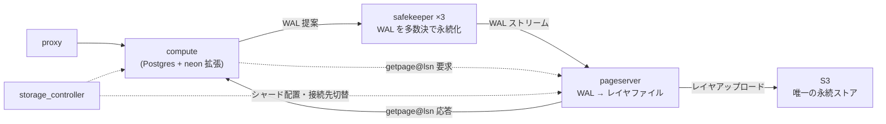

Postgres は、ディスクの上に立っている。テーブルはファイルであり、ページはそのファイルの 8KB のオフセットであり、`read()` すれば返ってくる。WAL は追記されるファイルで、`fsync()` すれば永続化される。この前提は 30 年間変わっていない。

Neon はここを切った。compute ノードにはデータファイルがない。`SELECT` がページを要求すると、それは TCP の向こうにいる pageserver への `getpage@lsn` という 1 往復になる。`INSERT` が WAL を書くと、それはローカルディスクではなく 3 台の safekeeper への提案になり、過半数が返事をして初めてコミットが返る。compute プロセスを殺しても、消えるものは何もない。

この構成は、性能のためではなく**課金の単位を変えるため**にある。ストレージが compute から切れていれば、compute はゼロまで縮められる。ブランチはレイヤファイルを共有するだけなのでコピーが要らず、1TB のデータベースのブランチが一瞬で、しかも追加のディスクを使わずに作れる。PITR は「過去の LSN を指定して読む」だけになる。Neon の売り文句は全部、この 1 つの分解から出ている。

一方で、分解には代償がある。ローカルディスクで 100 マイクロ秒だった読み取りが、ネットワーク越しで数ミリ秒になる。Postgres の OS ページキャッシュに相当するものがなくなる。「ページを書き戻す」という操作が消えたので、バッファから追い出されたページをどう扱うかを考え直す必要が出る。WAL の永続化がコンセンサスになったので、split brain を防ぐ仕組みが要る。この章の後半は、ほとんどがこの代償への対処の話だ。

## この章の読み方

Neon は「既存のモノリスをどう分解したか」の実例であり、その分解を読むには**分解される前の形**を知っている必要がある。だからこの章は Postgres の内部から始める。WAL と LSN、smgr というインターフェース、バッファマネージャ、リレーションのファイル構造、redo、MVCC。この 8 ページは Neon と無関係に読んでも成立するし、逆にここを飛ばすと 3 群目以降が読めない。

そのあとは、書き込みパスに沿って compute → safekeeper → pageserver と下り、読み取りパスで戻ってくる。pageserver が章の中心で、21 ページある。最後に proxy と検証の話をする。

一貫した軸が 1 つある。**LSN がシステム全体の論理時計になっている**ということだ。compute は「この LSN のページをくれ」と言い、safekeeper は「この LSN までは過半数が持っている」と言い、pageserver は「この LSN まで取り込んだ」と言い、ブランチは「この LSN で分岐した」と定義される。5 つのコンポーネントは互いのことをほとんど知らないが、LSN という 64 ビット整数だけは共有している。分散システムの調停に物理時刻を使わないという判断が、そのまま設計の骨格になっている。

## 読む順番

前提 — Postgres の内部:

- [WAL と LSN — バイト位置が時計になる](./wal-and-lsn/)
- [リレーションはファイルである — relfilelocator・fork・segment](./relation-files/)
- [smgr — Postgres が最初から持っていた差し替え口](./smgr/)
- [共有バッファ — ページの出入りが必ず通る 1 箇所](./buffer-manager/)
- [チェックポイントと full page image](./checkpoint-and-fpi/)
- [redo — WAL レコードはページに対する関数である](./redo-and-recovery/)
- [MVCC・xid・SLRU — 可視性はページの外にある](./mvcc-and-xid/)
- [起動シーケンス — pg_control から「一貫している」まで](./startup-and-control-file/)

アーキテクチャ全体:

- [5 つのコンポーネントと、Postgres を切った場所](./architecture/)
- [書き込みパス — compute から S3 まで](./write-path/)
- [読み取りパス — getpage@lsn](./read-path/)
- [LSN がシステム全体の論理時計になる](./lsn-as-clock/)

compute 側の改造:

- [smgr を置き換える — ページ読み取りがネットワーク越しになる](./neon-smgr/)
- [どの LSN のページを要求するか — last-written LSN](./last-written-lsn/)
- [neon_rmgr — WAL の語彙を増やす](./neon-rmgr/)
- [walproposer — Postgres の中から合意を取る](./walproposer-in-compute/)
- [basebackup — 空の PGDATA から起動する](./basebackup-startup/)
- [LFC と prefetch — 往復を隠す 2 つの層](./lfc-and-prefetch/)
- [communicator — C のプロセスの中に Rust の非同期ランタイムを置く](./communicator/)

safekeeper — WAL の合意:

- [term と epoch — WAL を多数決で永続化する](./safekeeper-consensus/)
- [なぜ Raft をそのまま使わなかったのか](./why-not-raft/)
- [control file — 状態を持つということ](./safekeeper-state/)
- [WAL をディスクにどう置くか](./wal-storage/)
- [取り残された safekeeper が追いつく](./safekeeper-recovery/)
- [メンバーを入れ替える — pull_timeline](./pull-timeline/)
- [S3 への WAL バックアップと eviction](./wal-backup-eviction/)

pageserver — ストレージ:

- [tenant・timeline・shard の階層](./tenant-timeline-shard/)
- [キー空間 — Postgres のファイル世界を 1 本の軸に潰す](./key-space/)
- [delta layer と image layer](./layer-kinds/)
- [layer map — 2 次元を検索する](./layer-map/)
- [disk_btree — 不変な B-tree](./disk-btree/)
- [ページ再構成のための vectored read](./vectored-read/)
- [compaction — L0 を L1 に刻み直す](./compaction/)
- [GC と PITR — 消していいレイヤの決め方](./gc-and-pitr/)
- [ブランチがコピーオンライトで実質無料になる理由](./branching-cow/)
- [remote_timeline_client — S3 との整合をキューで守る](./remote-timeline-client/)
- [generation 番号 — 2 台が同じ tenant を持ってしまう瞬間に備える](./generations-and-deletion/)

pageserver — 実行時:

- [page_service — getpage@lsn プロトコル](./page-service/)
- [walingest — WAL をキー値の更新に翻訳する](./walingest/)
- [walredo — ページ再構成を Postgres そのものに委譲する](./walredo/)
- [page_cache — もはやページのキャッシュではない](./page-cache/)
- [virtual_file — ファイルディスクリプタを仮想化する](./virtual-file/)
- [ディスクが足りなくなったとき — eviction と secondary location](./eviction-and-secondary/)

storage_controller:

- [期待状態はどこにあるか — データモデル](./controller-model/)
- [シャードをどのノードに置くか — scheduler](./scheduler/)
- [reconciler — 収束ループを Postgres 基盤でやる](./reconciler/)
- [リーダー交代とノード障害検知](./leadership-and-heartbeat/)
- [compute_hook — 接続先を切り替える](./compute-hook/)

proxy:

- [pqproto — Postgres wire protocol を自分で書く](./pqproto/)
- [SNI からエンドポイントを決める](./sni-routing/)
- [SCRAM を中継しながら、認証は control plane でやる](./scram-proxying/)
- [コールドスタート — 接続を待たせて compute を起こす](./cold-start/)
- [HTTP 越しの SQL](./serverless-sql/)
- [コネクションプールとキャンセル](./pool-and-cancel/)

検証と運用:

- [desim — 決定的シミュレーションでコンセンサスを殴る](./desim/)
- [synthetic size — 課金のためにサイズを定義し直す](./synthetic-size/)
- [storage_scrubber — S3 の整合性を外から検査する](./storage-scrubber/)
- [test_runner — 何をどこでテストするか](./test-runner/)
- [observability — 分解したシステムをどう見るか](./observability/)

## この章で扱わないこと

- **PostgreSQL 本体の改変の全量** — `vendor/postgres-v*` にはパッチが当たっているが、その一覧は `docs/core_changes.md` にある。この章では設計判断が現れている箇所だけを扱う。
- **`hadron*.rs`** — Databricks 由来の派生機能。本流の設計とは別の制約で動いている。
- **`control_plane/`** — ローカル開発・テスト用の制御プレーン実装。本番の control plane は OSS ではない。
- **Kubernetes オペレータ (`neonvm`) と autoscaling** — compute をどう起動するかは別リポジトリの領域。
- **課金・コンソールの SaaS 側** — サイズ計算の実装 (`tenant_size_model`) までを扱い、その先には踏み込まない。
