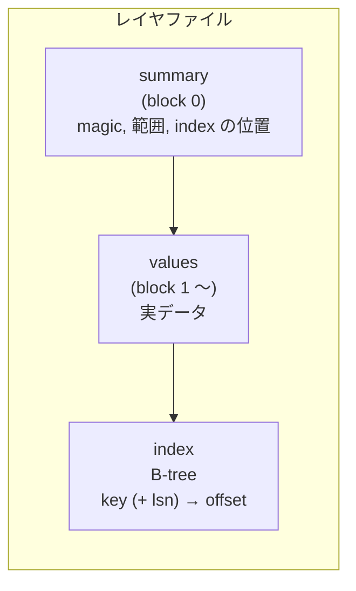
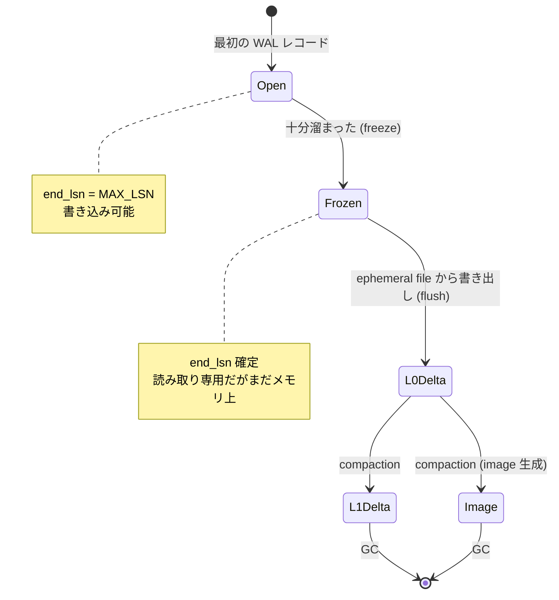

## 何を学んだか

pageserver のデータは、**キーを横軸・LSN を縦軸とした 2 次元平面**に置かれている。レイヤはその平面上の長方形だ。

```rust title="pageserver/src/tenant/storage_layer/layer_desc.rs"
pub struct PersistentLayerDesc {
    pub tenant_shard_id: TenantShardId,
    pub timeline_id: TimelineId,
    /// Range of keys that this layer covers
    pub key_range: Range<Key>,
    /// Inclusive start, exclusive end of the LSN range that this layer holds.
    ///
    /// - For an open in-memory layer, the end bound is MAX_LSN
    /// - For a frozen in-memory layer or a delta layer, the end bound is a valid lsn after the
    ///   range start
    /// - An image layer represents snapshot at one LSN, so end_lsn is always the snapshot LSN + 1
    pub lsn_range: Range<Lsn>,
    /// Whether this is a delta layer, and also, is this incremental.
    pub is_delta: bool,
    pub file_size: u64,
}
```

([pageserver/src/tenant/storage_layer/layer_desc.rs L20](https://github.com/neondatabase/neon/blob/fa504217c61bbcaf5c512d75830564541f917f8f/pageserver/src/tenant/storage_layer/layer_desc.rs#L20))

**種類の区別が `is_delta: bool` 1 つ**なのが要点だ。型で分かれてはいるが、レイヤマップや compaction が扱うときは、長方形 + フラグとしてしか見ない。

image layer は「1 点の LSN のスナップショット」なので、LSN 範囲は `[lsn, lsn+1)` になる。**幅ゼロの長方形を避けるために、便宜的に +1 している。** 範囲として統一的に扱えるようにするための小細工で、`Range<Lsn>` という 1 つの型で両方を表せる。

## delta layer — 変更の集まり

```rust title="pageserver/src/tenant/storage_layer/delta_layer.rs"
//! A DeltaLayer represents a collection of WAL records or page images in a range of
//! LSNs, and in a range of Keys. It is stored on a file on disk.
//!
//! Usually a delta layer only contains differences, in the form of WAL records
//! against a base LSN. However, if a relation extended or a whole new relation
//! is created, there would be no base for the new pages. The entries for them
//! must be page images or WAL records with the 'will_init' flag set, so that
//! they can be replayed without referring to an older page version.
```

([pageserver/src/tenant/storage_layer/delta_layer.rs L1](https://github.com/neondatabase/neon/blob/fa504217c61bbcaf5c512d75830564541f917f8f/pageserver/src/tenant/storage_layer/delta_layer.rs#L1))

**delta layer の中身は「差分」とは限らない。** ページ画像が入っていることもある。新しく作られたリレーションのページには、当てるべきベースがないからだ ([チェックポイントと full page image](../checkpoint-and-fpi/))。

だから delta layer の中身は `Value` — つまり `Image` か `WalRecord` のどちらか — になる。

ファイル名がそのまま長方形の座標だ。

```text
000000067F000032BE0000400000000020B6-000000067F000032BE0000400000000030B6__000000578C6B29-0000000057A50051
        キー範囲の開始                        キー範囲の終了              開始 LSN    終了 LSN
```

**ファイル名だけでレイヤの内容範囲が分かる。** ディレクトリを `readdir` すればレイヤマップが再構築できる、という性質が、クラッシュ後の復旧を単純にしている。

## ファイルの内部構造

delta も image も、3 部構成で同じ形をしている。

```rust title="pageserver/src/tenant/storage_layer/delta_layer.rs"
//! Every delta file consists of three parts: "summary", "values", and
//! "index". The summary is a fixed size header at the beginning of the file,
//! and it contains basic information about the layer, and offsets to the other
//! parts. The "index" is a B-tree, mapping from Key and LSN to an offset in the
//! "values" part.  The actual page images and WAL records are stored in the
//! "values" part.
```



**values が先で index が後ろにある。** 書き込みが 1 パスで済むからだ。値を順に追記していき、最後に索引を組んで書き、summary にその位置を書き戻す。**追記専用のストリームで作れる構造**になっている。

summary の中身は、範囲の情報を全部持っている。

```rust title="pageserver/src/tenant/storage_layer/delta_layer.rs"
pub struct Summary {
    /// Magic value to identify this as a neon delta file. Always DELTA_FILE_MAGIC.
    pub magic: u16,
    pub format_version: u16,

    pub tenant_id: TenantId,
    pub timeline_id: TimelineId,
    pub key_range: Range<Key>,
    pub lsn_range: Range<Lsn>,

    /// Block number where the 'index' part of the file begins.
    pub index_start_blk: u32,
    /// Block within the 'index', where the B-tree root page is stored
    pub index_root_blk: u32,
}
```

([pageserver/src/tenant/storage_layer/delta_layer.rs L90](https://github.com/neondatabase/neon/blob/fa504217c61bbcaf5c512d75830564541f917f8f/pageserver/src/tenant/storage_layer/delta_layer.rs#L90))

**ファイル名に入っている情報が、中にも入っている。** 冗長だが、`Summary::expected()` でファイル名から期待値を作り、読み込んだ summary と突き合わせられる。**ファイルが取り違えられていないことを、中身で確かめる。**

index の違いは 1 点だけだ。delta layer は `(key, lsn)` で引き、image layer は `key` だけで引く。image layer は 1 点の LSN のスナップショットなので、LSN が索引のキーに要らない。

## image layer — 「ないものはない」

```rust title="pageserver/src/tenant/storage_layer/image_layer.rs"
//! An ImageLayer represents an image or a snapshot of a key-range at
//! one particular LSN.
//!
//! It contains an image of all key-value pairs in its key-range. Any key
//! that falls into the image layer's range but does not exist in the layer,
//! does not exist.
```

([pageserver/src/tenant/storage_layer/image_layer.rs L1](https://github.com/neondatabase/neon/blob/fa504217c61bbcaf5c512d75830564541f917f8f/pageserver/src/tenant/storage_layer/image_layer.rs#L1))

この 1 文が image layer の全部を決めている。

**image layer に当たったら、探索はそこで止まる。** 見つかれば値、見つからなければ「存在しない」。それより古いレイヤを見に行く必要がない。

これが読み取りの計算量を有界にする。image layer がなければ、リレーションが作られた瞬間まで遡ることになる。image layer を定期的に作るのが compaction の仕事の 1 つになる ([compaction](../compaction/))。

一方で、**image layer は範囲内の全キーを列挙できないと作れない**。だから疎なキー空間には向かない ([キー空間](../key-space/))。

## インメモリレイヤ — 名前が嘘をついている

```rust title="pageserver/src/tenant/storage_layer/inmemory_layer.rs"
//! An in-memory layer stores recently received key-value pairs.
//!
//! The "in-memory" part of the name is a bit misleading: the actual page versions are
//! held in an ephemeral file, not in memory. The metadata for each page version, i.e.
//! its position in the file, is kept in memory, though.
```

([pageserver/src/tenant/storage_layer/inmemory_layer.rs L1](https://github.com/neondatabase/neon/blob/fa504217c61bbcaf5c512d75830564541f917f8f/pageserver/src/tenant/storage_layer/inmemory_layer.rs#L1))

**「インメモリ」なのは索引だけで、値は ephemeral file に書かれている。**

理由は明白で、WAL の取り込みが速いとメモリが破裂するからだ。かといって全部ディスクに置くと、書き込んだ直後の読み取りが遅くなる。**索引 (小さい) をメモリに、値 (大きい) をファイルに**という分離になる。

索引は `BTreeMap<CompactKey, VecMap<Lsn, ...>>` のような形で、キーごとに LSN → ファイル内オフセットの写像を持つ。`VecMap` は要素数の少ないマップを `Vec` で持つ実装で、**1 つのキーに対する LSN の数はたいてい少ない**という前提を使っている。

## レイヤの一生



freeze と flush が 2 段になっているのが要点だ。`docs/pageserver-storage.md` の説明がある。

> Flushing a layer is a two-step process: First, the layer is marked as closed, so that it no longer accepts new WAL records, and a new in-memory layer is created to hold any WAL after that point. After this first step, the layer is a Closed InMemory state. This first step is called "freezing" the layer.

**freeze は一瞬で終わる (ポインタの差し替えだけ)。flush は時間がかかる (ファイルを書く)。** 分けることで、取り込みが flush の間ブロックされない。

L0 と L1 の区別も、型ではなくキー範囲で表現される。

> A file that covers the whole key range is called a L0 file (Level 0), while a file that covers only part of the key range is called a L1 file. The "level" of a file is not explicitly stored anywhere, you can only distinguish them by looking at the key range that a file covers. The read-path doesn't need to treat L0 and L1 files any differently.

**レベルはどこにも記録されていない。** キー範囲が全体かどうかで判定する。そして読み取りパスは区別しない。

**LSM tree のレベルという概念を、明示的な状態として持たずに、範囲の性質から導出している。** 状態を持たなければ、状態がずれることもない。

## この先に効いてくること

- **すべてのレイヤは「キー範囲 × LSN 範囲」の長方形。** 種類は `is_delta` フラグ 1 つ。
- **values → index → summary の順に書ける。** 追記専用ストリームで作れる構造。
- **image layer の「ないものはない」が探索の停止条件。** 読み取りの計算量を有界にする。
- **インメモリレイヤは索引だけがメモリにある。** 大きいものはファイル、小さいものはメモリ。
- **LSM のレベルを状態として持たない。** キー範囲から導出する。
