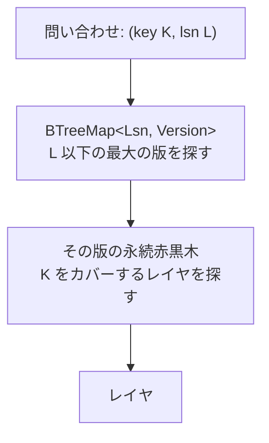

## 何を学んだか

レイヤは「キー範囲 × LSN 範囲」の長方形で、それが数千個ある ([delta layer と image layer](../layer-kinds/))。読み取りのたびに「点 `(key, lsn)` を含む長方形のうち、最も新しいもの」を求める必要がある。

これは 2 次元の区間検索で、素直にやると重い。`docs/pageserver-storage.md` には初期の実装が書いてある。

> Currently, the layer map is just a resizable array (Vec). On a GetPage@LSN or other read request, the layer map scans through the array to find the right layer

**線形走査だった。** 今は違う。

```rust title="pageserver/src/tenant/layer_map.rs"
//! The `search` method of the layer map is on the read critical path, so we've
//! built an efficient data structure for fast reads, stored in `LayerMap::historic`.
//!
//! This data structure relies on a persistent/immutable binary search tree.
//! Summary: A persistent/immutable BST (and persistent data structures in general) allows
//! you to modify the tree in such a way that each modification creates a new "version"
//! of the tree. When you modify it, you get a new version, but all previous versions are
//! still accessible too.
```

([pageserver/src/tenant/layer_map.rs L12](https://github.com/neondatabase/neon/blob/fa504217c61bbcaf5c512d75830564541f917f8f/pageserver/src/tenant/layer_map.rs#L12))

## 2 次元を「1 次元 × 版」に分解する

核心はこの部分だ。

```rust title="pageserver/src/tenant/layer_map.rs"
//! Our persistent BST maintains a map of which layer file "covers" each key. It has only
//! one dimension, the key. See `layer_coverage.rs`. We use the persistent/immutable property
//! to handle the LSN dimension.
//!
//! To build the layer map, we insert each layer to the persistent BST in LSN.start order,
//! starting from the oldest one. After each insertion, we grab a reference to that "version"
//! of the tree, and store it in another tree, a BtreeMap keyed by the LSN.
//!
//! To search for a particular key-LSN pair, you first look up the right "version" in the
//! BTreeMap. Then you search that version of the BST with the key.
```



**LSN の軸を「木の版」として表現する。**

普通の木なら、版を保つには丸ごとコピーするしかない。レイヤが N 個あれば O(N²) のメモリになる。**永続データ構造なら、1 回の更新で変わるのは根から葉までの経路だけ**なので、版ごとに O(log N) の追加で済む。

実装は `rpds` crate の赤黒木だ。

```rust title="pageserver/src/tenant/layer_map/layer_coverage.rs"
// NOTE the `im` crate has 20x more downloads and also has
// persistent/immutable BTree. But it's bugged so rpds is a
// better choice <https://github.com/neondatabase/neon/issues/3395>
use rpds::RedBlackTreeMapSync;
```

([pageserver/src/tenant/layer_map/layer_coverage.rs L3](https://github.com/neondatabase/neon/blob/fa504217c61bbcaf5c512d75830564541f917f8f/pageserver/src/tenant/layer_map/layer_coverage.rs#L3))

**ダウンロード数 20 倍のライブラリを、バグを理由に採用しなかった。** issue へのリンク付きで理由が書いてある。永続データ構造は「正しく実装されているか」を外から確かめにくいので、この判断の記録は重要になる。

`Sync` 版を選んだ理由も書いてある。「非 Sync 版のほうが速いかもしれないが、`Self` を `Sync` にしたい」。

## 「カバレッジ」という表現

木が保持しているのは、レイヤの集合ではない。

```rust title="pageserver/src/tenant/layer_map/layer_coverage.rs"
/// Data structure that can efficiently:
/// - find the latest layer by lsn.end at a given key
/// - iterate the latest layers in a key range
/// - insert layers in non-decreasing lsn.start order
pub struct LayerCoverage<Value> {
    /// For every change in coverage (as we sweep the key space)
    /// we store (lsn.end, value).
    nodes: RedBlackTreeMapSync<i128, Option<(u64, Value)>>,
}
```

([layer_coverage.rs L8](https://github.com/neondatabase/neon/blob/fa504217c61bbcaf5c512d75830564541f917f8f/pageserver/src/tenant/layer_map/layer_coverage.rs#L8))

**キー空間を走査したときに「担当が変わる点」だけを記録する。** 値は「その点から次の点までを担当するレイヤ」。区間を点の列で表す、区間木の標準的な圧縮になっている。

挿入の実装に、いい比喩がある。

```rust title="pageserver/src/tenant/layer_map/layer_coverage.rs"
    /// Helper function to subdivide the key range without changing any values
    ///
    /// This operation has no semantic effect by itself. It only helps us pin in
    /// place the part of the coverage we don't want to change when inserting.
    ///
    /// As an analogy, think of a polygon. If you add a vertex along one of the
    /// segments, the polygon is still the same, but it behaves differently when
    /// we move or delete one of the other points.
    fn add_node(&mut self, key: i128) {
```

([layer_coverage.rs L44](https://github.com/neondatabase/neon/blob/fa504217c61bbcaf5c512d75830564541f917f8f/pageserver/src/tenant/layer_map/layer_coverage.rs#L44))

**多角形に頂点を足しても形は変わらないが、他の点を動かしたときの振る舞いが変わる。** 挿入前に両端に「意味のない節点」を打っておくことで、挿入が範囲外に染み出さないようにする。

計算量にも正直な注記がある。

```rust
    /// Complexity: worst case O(N), in practice O(log N). See NOTE in implementation.
```

**最悪 O(N)。** 挿入するレイヤが既存の多数の区切りをまたぐと、その分だけ節点を書き換える。実際には起きないという前提を置いている。

## 追記しかできない木を、削除がある世界で使う

永続 BST には制約がある。

```rust title="pageserver/src/tenant/layer_map.rs"
//! The persistent BST keeps all the versions, but there is no way to change the old versions
//! afterwards. We can add layers as long as they have larger LSNs than any previous layer in
//! the map, but if we need to remove a layer, or insert anything with an older LSN, we need
//! to throw away most of the persistent BST and build a new one, starting from the oldest
//! LSN.
```

**新しい LSN のレイヤを足すのは安い。しかし削除と、古い LSN への挿入は、木の作り直しになる。**

そして pageserver では両方とも起きる。compaction は既存の LSN 範囲に新しいレイヤを作るし、GC はレイヤを消す。

```rust title="pageserver/src/tenant/layer_map/historic_layer_coverage.rs"
/// Why is this needed? We most often insert new layers with newer LSNs,
/// but during compaction we create layers with non-latest LSN, and during
/// GC we delete historic layers.
///
/// Even though rebuilding is an expensive (N log N) solution to the problem,
/// it's not critical since we do something equally expensive just to decide
/// whether or not to create new image layers.
/// TODO It's not expensive but it's not great to hold a layer map write lock
///      for that long.
pub struct BufferedHistoricLayerCoverage<Value> {
    /// A persistent layer map that we rebuild when we need to retroactively update
    historic_coverage: HistoricLayerCoverage<Value>,

    /// We buffer insertion into the PersistentLayerMap to decrease the number of rebuilds.
    buffer: BTreeMap<LayerKey, Option<Value>>,

    /// All current layers. This is not used for search. Only to make rebuilds easier.
    layers: BTreeMap<LayerKey, Value>,
}
```

([historic_layer_coverage.rs L399](https://github.com/neondatabase/neon/blob/fa504217c61bbcaf5c512d75830564541f917f8f/pageserver/src/tenant/layer_map/historic_layer_coverage.rs#L399))

対処は**バッファリング**だ。変更を溜めておき、まとめて 1 回だけ作り直す。`buffer` の値が `Option` なのは、挿入 (`Some`) と削除 (`None`) の両方を溜めるため。

そして「作り直しは高いが、致命的ではない」という判断の根拠が書かれている。**「image layer を作るかどうかを決めるだけで、同じくらい高い処理をやっているから」。** 相対的な議論で、絶対的な最適化はしていない。

代替案 (セグメント木) も検討されていて、却下の理由が「問い合わせに追加の log(N) がかかるから」。**読み取りのレイテンシを守るために、更新のコストを許容する。** どちらが critical path かの判断が明確だ。

さらに `layers` フィールドには自己批判的な TODO がある。

```rust
    // TODO: This map is never cleared. Rebuilds could use the post-trim last entry of
    // [`Self::historic_coverage`] instead of doubling memory usage.
```

**メモリを 2 倍使っていることを認めている。** 直せることも分かっているが直していない。

## 検索は 3 候補から 1 つを選ぶ

`search` は 3 種類の候補を集めてから選ぶ。

```rust title="pageserver/src/tenant/layer_map.rs"
    pub fn search(&self, key: Key, end_lsn: Lsn) -> Option<SearchResult> {
        let in_memory_layer = self.search_in_memory_layer(end_lsn);

        let version = match self.historic.get().unwrap().get_version(end_lsn.0 - 1) {
            /* ... */
        };

        let latest_delta = version.delta_coverage.query(key.to_i128());
        let latest_image = version.image_coverage.query(key.to_i128());

        Self::select_layer(latest_delta, latest_image, in_memory_layer, end_lsn)
    }
```

([pageserver/src/tenant/layer_map.rs L448](https://github.com/neondatabase/neon/blob/fa504217c61bbcaf5c512d75830564541f917f8f/pageserver/src/tenant/layer_map.rs#L448))

**delta と image で別々のカバレッジ木を持っている。** 混ぜないのは、image が探索の停止条件になるという特別な意味を持つからだ。

```rust title="pageserver/src/tenant/layer_map.rs"
    /// Layer types have an in implicit priority (image > delta > in-memory). For instance,
    /// if we have the option of reading an LSN range from both an image and a delta, we
    /// should read from the image.
```

選択のロジックは 8 通りの `match` になっていて、それぞれで `lsn_floor` を計算する。

```rust title="pageserver/src/tenant/layer_map.rs"
            (Some(delta), Some(image), None) => {
                let img_lsn = image.get_lsn_range().start;
                let image_is_newer = image.get_lsn_range().end >= delta.get_lsn_range().end;
                let image_exact_match = img_lsn + 1 == end_lsn;
                if image_is_newer || image_exact_match {
                    Some(SearchResult {
                        layer: ReadableLayerWeak::PersistentLayer(image),
                        lsn_floor: img_lsn,
                    })
                } else {
                    // If the delta overlaps with the image in the LSN dimension, do a partial
                    // up to the image layer.
                    let lsn_floor =
                        std::cmp::max(delta.get_lsn_range().start, image.get_lsn_range().start + 1);
```

**`lsn_floor` は「このレイヤから読むべき LSN の下限」**だ。delta を読むとき、その下に image があるなら、image より下は読まなくていい。

つまり `search` は「1 つのレイヤ」を返すのではなく、**「次にどこを読み、どこまで読んだら次の探索に移るか」**を返している。読み取りはこれを繰り返して、`will_init` な値に当たるまで下っていく ([ページ再構成のための vectored read](../vectored-read/))。

なお 8 通りのうち 1 つには、こんな注記が付いている。

```rust
            (Some(delta), None, Some(inmem)) => {
                // Overlaps between delta and in-memory layers are not a valid
                // state, but we handle them here for completeness.
```

**「起こらないはずだが、完全性のために扱う」。** panic させずに正しい答えを返す側に倒している。

## この先に効いてくること

- **2 次元検索を「1 次元 + 版」に分解する。** 永続データ構造が版のコストを O(log N) にする。
- **区間は「担当が変わる点」の列で持つ。**
- **追記しかできない構造を、削除のある世界で使うにはバッファリング。** まとめて作り直す。
- **どちらが critical path かで、コストを寄せる先を決める。** 読み取りを守り、更新に払う。
- **search は 1 つのレイヤではなく「次の一手」を返す。** 探索は反復になる。
