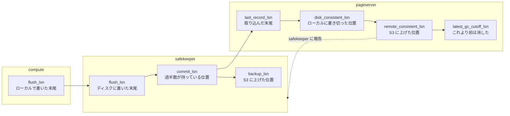

## 何を学んだか

Neon の永続化された状態を並べると、驚くほど LSN ばかりだ。safekeeper の control file はこうなっている。

```rust title="safekeeper/src/state.rs"
    /// Since which LSN this timeline generally starts. Safekeeper might have
    /// joined later.
    pub timeline_start_lsn: Lsn,
    /// Since which LSN safekeeper has (had) WAL for this timeline.
    pub local_start_lsn: Lsn,
    /// Part of WAL acknowledged by quorum *and available locally*. Always points
    /// to record boundary.
    pub commit_lsn: Lsn,
    /// LSN that points to the end of the last backed up segment.
    pub backup_lsn: Lsn,
    /// Minimal LSN which may be needed for recovery of some safekeeper (end_lsn
    /// of last record streamed to everyone).
    pub peer_horizon_lsn: Lsn,
    /// LSN of the oldest known checkpoint made by pageserver and successfully
    /// pushed to s3. We don't remove WAL beyond it.
    pub remote_consistent_lsn: Lsn,
```

([safekeeper/src/state.rs L42](https://github.com/neondatabase/neon/blob/fa504217c61bbcaf5c512d75830564541f917f8f/safekeeper/src/state.rs#L42))

pageserver の timeline メタデータも同じ形をしている。

```rust title="pageserver/src/tenant/metadata.rs"
    disk_consistent_lsn: Lsn,
    prev_record_lsn: Option<Lsn>,
    ancestor_lsn: Lsn,
    latest_gc_cutoff_lsn: Lsn,
    initdb_lsn: Lsn,
```

([pageserver/src/tenant/metadata.rs L121](https://github.com/neondatabase/neon/blob/fa504217c61bbcaf5c512d75830564541f917f8f/pageserver/src/tenant/metadata.rs#L121))

**分散システムの状態が、ほぼ全部 64 ビット整数 1 個で表現されている。**

## なぜこれで足りるのか

3 つの性質が揃っているからだ。

**1. 単一の書き手が単一のストリームに追記する。** timeline (= ブランチ) ごとにプライマリは 1 台だけで、そのプライマリだけが WAL を伸ばす。だから LSN は全順序になる。複数の書き手がいれば、この時点でベクタークロックが要る。

**2. すべての状態変化が WAL を経由する。** ページの変更も、リレーションの作成も、トランザクションのコミットも、全部 WAL レコードとして現れる。だから「LSN X の時点の状態」が well-defined になる。WAL を通らない状態変化が 1 つでもあると、この性質が崩れる。実際 Neon が Postgres 本体にパッチを当てている箇所のいくつか (replication slot、relmapper ファイル、replication snapshot の WAL 化) は、まさにこの性質を守るためのものだ。

**3. LSN は比較でき、減算できる。** バイト位置なので、差が「どれだけの量の WAL が挟まっているか」を意味する。GC の保持期間、背圧の閾値、safekeeper の遅れ、全部これで表現できる。

普通の論理クロック (Lamport クロック) は 1 と 3 のうち 3 を持たない。カウンタなので差に意味がない。**Postgres の LSN は論理時計でありながら物理量でもある**という、珍しい性質を持っている。

## 各コンポーネントの「今」を表す LSN

同じ WAL ストリームに対して、各コンポーネントが自分の進捗を LSN で持つ。



**右に行くほど小さい。** そして各コンポーネントの仕事は、自分の LSN を右に進めることと、左のコンポーネントに自分の位置を伝えることに尽きる。

伝えることの意味も揃っている。

| 伝える方向              | 伝える値                | 受け取った側がやること        |
| ----------------------- | ----------------------- | ----------------------------- |
| safekeeper → compute    | `commit_lsn`            | ここまでコミットを返してよい  |
| pageserver → safekeeper | `remote_consistent_lsn` | ここまでの WAL を削除してよい |
| pageserver → compute    | 取り込み位置            | 遅れていれば背圧をかける      |
| compute → safekeeper    | `peer_horizon_lsn`      | 全員に届いた位置。復旧の起点  |

**「ここまで進んだ」が、そのまま「ここまで捨ててよい」になっている。** 分散システムでリソースを解放する条件が、全部 1 つの型で書ける。

## 状態も LSN で参照される

進捗だけでなく、データそのものの参照にも LSN が使われる。

- **ページ** — `(key, lsn)` で一意に決まる。`getpage@lsn` の名前がそのまま。
- **レイヤファイル** — キー範囲 × LSN 範囲の長方形。ファイル名に両方が入る。
- **ブランチ** — `ancestor_lsn` で「親のどこで分岐したか」を表す。
- **PITR** — `latest_gc_cutoff_lsn` 以降なら、任意の LSN で読める。
- **リレーションのサイズ** — LSN ごとにバージョンを持つ ([リレーションはファイルである](../relation-files/))。

**ブランチも PITR も、機能として実装されたのではない。** キー空間が `(key, lsn)` の 2 次元で、レイヤがその上の長方形だという構造から自然に出てくる。「LSN 250 で分岐する」は「LSN 250 より前を親と共有する」と同義で、コピーするものが何もない ([ブランチがコピーオンライトで実質無料になる理由](../branching-cow/))。

## 「時刻」との対応は別テーブルで持つ

ユーザーは「1 時間前の状態を見たい」と言う。LSN では言わない。だから時刻から LSN への変換が要る。

Neon はこれを別の索引として持つ。WAL の中のコミットレコードにはタイムスタンプが入っているので、pageserver は「時刻 T 以前の最大の LSN」を二分探索で求められる。

**論理時計を主にして、物理時刻は変換テーブルとして脇に置く。** 逆 (物理時刻を主にする) にすると、時計のずれがそのまま整合性の問題になる。

## LSN で表現できなかったもの

きれいに揃っている一方で、LSN では表現できない状態もある。そしてそこが Neon の難しい部分になっている。

**「今この tenant を持っているのは誰か」。** これは WAL とは無関係の、制御プレーン側の状態だ。LSN では表現できないので、別の単調増加する整数 — generation 番号 — を導入している ([generation 番号](../generations-and-deletion/))。

**「どのプロポーザが正当か」。** safekeeper の合意では、古いプライマリと新しいプライマリを区別する必要がある。これも LSN では表現できず、term という別のカウンタが要る ([term と epoch](../safekeeper-consensus/))。

パターンは同じだ。**単調増加する整数を導入して、大小比較で新旧を決める。** LSN がうまくいっている理由を、他の問題にも移植している。

そして LSN と term は独立ではない。safekeeper が持つのは `(term, lsn)` の組で、順序は辞書順になる。「term が新しいほうが勝ち、同じ term なら LSN が大きいほうが勝ち」。Raft の `(term, index)` とまったく同じ形をしている ([なぜ Raft をそのまま使わなかったのか](../why-not-raft/))。

## この先に効いてくること

- **単一の書き手 + 全変更が WAL を通る、が LSN を論理時計にする条件。** どちらか崩れると成立しない。
- **「進んだ位置」が「捨ててよい位置」になる。** リソース解放の条件が全部 LSN で書ける。
- **ブランチと PITR は機能ではなく構造の帰結。** `(key, lsn)` の 2 次元だから出てくる。
- **LSN で表せないものには別のカウンタを足す。** generation と term。手口は同じ。
