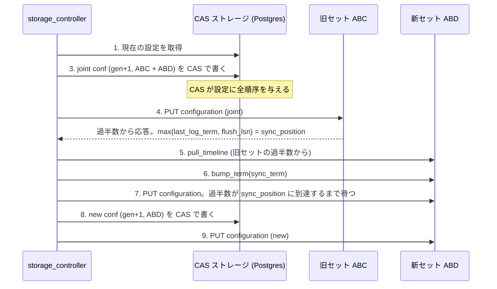

## 何を学んだか

safekeeper が 1 台壊れたら、別のノードに替えたい。これは合意アルゴリズムのメンバー変更 (reconfiguration) で、素朴にやると壊れる。

`docs/rfcs/035-safekeeper-dynamic-membership-change.md` が問題を要約している。

> It always involves two phases: 1) switch old majority to old + new configuration, preventing commits without acknowledge from the new set 2) bootstrap the new set by ensuring majority of the new set has all data which ever could have been committed before the first phase completed; after that switch is safe to finish. Without two phases switch to the new set which quorum might not intersect with quorum of the old set (and typical case of ABC -> ABD switch is an example of that, because quorums AC and BD don't intersect).

**ABC から ABD に替えるとき、旧構成の過半数 AC と新構成の過半数 BD は交わらない。** 一気に切り替えると、AC でコミットしたデータを BD が知らないまま、BD で新しいリーダーが選ばれる。

だから joint configuration (両方の集合を同時に有効にする中間状態) を挟む。Raft の joint consensus と同じだ。

```rust title="libs/safekeeper_api/src/membership.rs"
pub struct Configuration {
    /// Unique id.
    pub generation: SafekeeperGeneration,
    /// Current members of the configuration.
    pub members: MemberSet,
    /// Some means it is a joint conf.
    pub new_members: Option<MemberSet>,
}
```

([libs/safekeeper_api/src/membership.rs L115](https://github.com/neondatabase/neon/blob/fa504217c61bbcaf5c512d75830564541f917f8f/libs/safekeeper_api/src/membership.rs#L115))

`new_members` が `Some` なら joint。この状態では、**選出にもコミットにも両方の過半数が要る**。

> To be elected it must receive votes from both majorities if `new_sk_set` is present. Similarly, to commit WAL it must receive flush acknowledge from both majorities.

## 誰が変更を主導するのか

ここが Neon 固有の難所になる。

> Furthermore, procedure is typically carried out by the consensus leader, and so enumeration of configurations which establishes order between them is done through consensus log.
>
> In our case consensus leader is compute (walproposer), and we don't want to wake up all computes for the change. Neither we want to fully reimplement the leader logic second time outside compute.

**通常、メンバー変更はリーダーが実行する。** 設定の世代番号に順序を付けるのに、コンセンサスログを使うからだ。

しかし Neon のリーダーは compute で、**サーバーレスなので普段は停止している**。

- 全 compute を起こす → 数万テナントを起こすことになる。論外
- リーダーのロジックを compute の外にもう 1 つ実装する → 合意アルゴリズムを 2 回書くことになる

どちらも選ばなかった。第 3 の道がこれだ。

> Because of that the proposed algorithm relies for issuing configurations on the external fault tolerant (distributed) strongly consistent storage with simple API: CAS (compare-and-swap) on the single key. Properly configured postgres suits this.

**設定の発行だけを、外部の CAS ストレージに委ねる。** 必要な API は「1 つのキーに対する compare-and-swap」だけ。そしてそれには Postgres が使える。

storage_controller が既に Postgres を持っているので、新しい依存が増えない ([storage_controller のデータモデル](../controller-model/))。

**コンセンサスログが担っていた「設定の全順序」という役割だけを切り出し、それだけを提供する別の仕組みに置いた。** リーダー選出も、ログ複製も、外には持ち出していない。

## 手順 — 8 ステップ

RFC の手順を要約するとこうなる。



読みどころが 3 つある。

**`sync_position` の意味。** 旧セットの過半数から集めた `(last_log_term, flush_lsn)` の最大値だ。

> We can't finish the switch until majority of the new set catches up to this `sync_position` because data before it could be committed without ack from the new set.

**「新セットの ack なしにコミットされた可能性がある位置」**を求めている。joint への切り替えより前は、旧セットだけでコミットできた。だからそこまでは新セットに確実に届けなければならない。

**`sync_term` の bump。** term も同期する。

> Similarly, we'll bump term on new majority to `sync_term` so that two computes with the same term are never elected.

新しく参加したノードの term が 0 だと、古い term のプロポーザがそこで投票を得てしまう。**新メンバーは「まっさら」ではなく「今の時点まで進んだ」状態で参加させる。**

**失敗しても安全であること。**

> It is safe to interrupt / restart it and run multiple instances of it concurrently, though likely one of them won't make progress then.

CAS が全順序を作るので、2 つの手続きが同時に走っても片方は必ず失敗する。そして中断された変更を見つけたら、それを完了させにいく。

> Algorithm will refuse to make the change if it encounters previous interrupted change attempt, but in this case it will try to finish it.

**「中断された変更をロールバックする」ではなく「前に進めて完了させる」。** joint 状態は正常な状態なので、そこから先に進むほうが単純になる。

## pull_timeline — timeline を丸ごとコピーする

新メンバーに timeline を作る操作が `pull_timeline` だ。

```rust title="safekeeper/src/pull_timeline.rs"
/// Stream tar archive of timeline to tx.
#[instrument(name = "snapshot", skip_all, fields(ttid = %tli.ttid))]
pub async fn stream_snapshot(
    tli: Arc<Timeline>,
    source: NodeId,
    destination: NodeId,
    tx: mpsc::Sender<Result<Bytes>>,
    storage: Option<Arc<GenericRemoteStorage>>,
) {
```

([safekeeper/src/pull_timeline.rs L43](https://github.com/neondatabase/neon/blob/fa504217c61bbcaf5c512d75830564541f917f8f/safekeeper/src/pull_timeline.rs#L43))

**tar でストリーミングする。** control file と WAL セグメントをまとめて送る。[basebackup](../basebackup-startup/) と同じ形式で、同じ理由 (ファイルの集合をそのまま送るのに一番単純) だ。

`storage` 引数があるのは、WAL がローカルにない (S3 に退避済み) 場合に S3 から読むため。`try_wal_residence_guard()` で、ローカルにあるかを先に確かめている。

受け取り側は一時ディレクトリに展開してから `validate_temp_timeline` を通し、最後にリネームする。**「半分だけ存在する timeline」を作らない**ための定型だ。

## 冪等性と、削除の難しさ

RFC の後半に、実装上の注意が並んでいる。そのうち 2 つが特に示唆的だ。

> On step 4 timeline might be already created on members of the new set for various reasons; the simplest is the procedure restart. (中略) Deleting and re-doing `pull_timeline` is generally unsafe without involving generations, so seems simpler to treat existing timeline as success.

**「既にある」を成功として扱う。** 消してやり直すほうが直感的だが、それは「消した瞬間に他の手続きが書いていたら」という問題を生む。

その代わりの欠点も認めている。

> However, this also has a disadvantage: you might imagine an surpassingly unlikely schedule where condition in the step 5 is never reached until compute is (re)awaken up to synchronize new member(s).

**既存の timeline が古すぎて、`sync_position` に永遠に到達しない可能性がある。** compute を起こせば解決するが、「実際には観測しないだろう」と判断して実装していない。

もう 1 つが削除だ。

> In the end timeline should be locally deleted on the safekeeper(s) which are in the old set but not in the new one, unless they are unreachable. To be safe this also should be done under generation number (deletion proceeds only if current configuration is <= than one in request and safekeeper is not member of it).

**削除にも generation を要求する。** 「もう要らないから消せ」という指示が、古い世代のものかもしれない。その間に構成が戻っていたら、必要なデータを消すことになる。

これは pageserver の generation 番号とまったく同じ形の問題で、同じ形の解になっている ([generation 番号](../generations-and-deletion/))。**削除は取り返しがつかないので、必ず世代を確認する。**

## generation は safekeeper 側にも持つ

```rust title="libs/safekeeper_api/src/membership.rs"
/// Number uniquely identifying safekeeper configuration.
/// Note: it is a part of sk control file.
///
/// Like tenant generations, but for safekeepers.
pub struct SafekeeperGeneration(u32);
```

([libs/safekeeper_api/src/membership.rs L18](https://github.com/neondatabase/neon/blob/fa504217c61bbcaf5c512d75830564541f917f8f/libs/safekeeper_api/src/membership.rs#L18))

"Like tenant generations, but for safekeepers" — **同じ道具を 2 か所で使っていることを、コメントが明示している。**

そして [term と epoch](../safekeeper-consensus/) で見たとおり、全メッセージの先頭で generation を検査する。

```rust
        if self.state.mconf.generation != msg.generation {
            bail!("refusing append request due to generation mismatch: ...");
        }
```

**古い構成を信じているプロポーザからのデータは、一切受け付けない。**

## この先に効いてくること

- **メンバー変更は 2 段階が必須。** 旧過半数と新過半数が交わらないから。
- **コンセンサスログの「設定に全順序を付ける」役割だけを、外部の CAS に切り出せる。** リーダーを起こさずに済む。
- **中断された変更はロールバックせず、前に進めて完了させる。**
- **削除には世代の確認が要る。** 取り返しのつかない操作の共通則。
