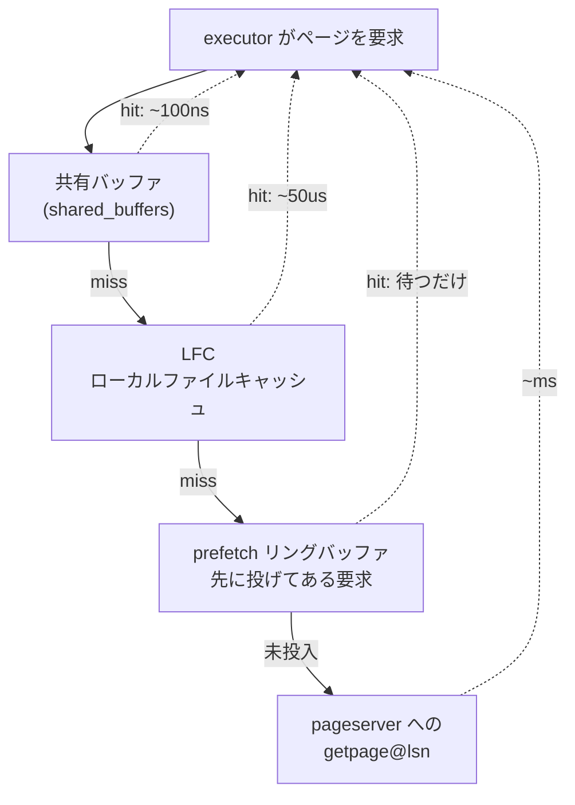

## 何を学んだか

`SELECT` がページを 1 枚必要としたとき、通る場所は 4 つある。



**ネットワークに出た時点で、ローカルディスクの Postgres より 1 桁遅い。** だから残りの 3 層がどれだけ効くかで性能が決まる。この構造自体が、分解の代償に対する対処になっている ([LFC と prefetch](../lfc-and-prefetch/))。

## 要求には LSN が 2 つ付いている

pageserver へのリクエストは、全種類が共通のヘッダを持つ。

```c title="pgxn/neon/pagestore_client.h"
typedef struct
{
	NeonMessageTag tag;
	NeonRequestId reqid;
	XLogRecPtr	lsn;
	XLogRecPtr	not_modified_since;
} NeonMessage;
```

([pgxn/neon/pagestore_client.h L51](https://github.com/neondatabase/neon/blob/fa504217c61bbcaf5c512d75830564541f917f8f/pgxn/neon/pagestore_client.h#L51))

ヘッダのコメントが、この 2 つの意味を説明している。

```c title="pgxn/neon/pagestore_client.h"
 * All requests contain two LSNs:
 *
 * lsn:                request page (or relation size, etc) at this LSN
 * not_modified_since: Hint that the page hasn't been modified between
 *                     this LSN and the request LSN (`lsn`).
 *
 * To request the latest version of a page, you can use MAX_LSN as the request
 * LSN.
 *
 * If you don't know any better, you can always set 'not_modified_since' equal
 * to 'lsn', but providing a lower value can speed up processing the request
 * in the pageserver, as it doesn't need to wait for the WAL to arrive, and it
 * can skip traversing through recent layers which we know to not contain any
 * versions for the requested page.
```

([pgxn/neon/pagestore_client.h L68](https://github.com/neondatabase/neon/blob/fa504217c61bbcaf5c512d75830564541f917f8f/pgxn/neon/pagestore_client.h#L68))

これが読み取りパスで最も重要な設計だ。

**`lsn` だけだと、pageserver は待たされる。** compute は自分の WAL 末尾を知っているが、pageserver がそこまで取り込んでいるとは限らない。取り込みは非同期だからだ ([書き込みパス](../write-path/))。`lsn` に現在の WAL 末尾を入れると、pageserver は「そこまで取り込むまで待つ」ことになる。

**`not_modified_since` は「これ以降このページは変わっていない」という compute からの保証だ。** compute はそれを知っている。バッファから追い出したときの LSN を覚えているからだ ([last-written LSN](../last-written-lsn/))。

この 2 つが揃うと、pageserver はこう判断できる。

- `not_modified_since` まで取り込んでいれば、**`lsn` を待つ必要はない**。その先に変更がないと約束されているので。
- レイヤを辿るとき、`not_modified_since` より新しいレイヤは**見る必要がない**。

gRPC 版の proto には、この契約の破り方まで書いてある。

```protobuf title="pageserver/page_api/proto/page_service.proto"
  // It is undefined behaviour to make a request such that the page was, in
  // fact, modified between request_lsn and not_modified_since_lsn. The
  // Pageserver might detect it and return an error, or it might return the old
  // page version or the new page version. Setting not_modified_since_lsn equal
  // to request_lsn is always safe, but can lead to unnecessary waiting.
```

([pageserver/page_api/proto/page_service.proto L75](https://github.com/neondatabase/neon/blob/fa504217c61bbcaf5c512d75830564541f917f8f/pageserver/page_api/proto/page_service.proto#L75))

**嘘をつくと未定義動作。検出されるかもしれないし、されないかもしれない。** 安全側 (`not_modified_since = lsn`) が常に存在するうえで、性能のために危険側を選べるようにしてある。API の契約としてかなり攻めた設計で、内部プロトコルだからこそできる割り切りだ。

## どの pageserver に聞くか — シャーディング

tenant が複数の shard に分かれている場合、compute はキーからどの shard かを計算する。

```rust title="libs/pageserver_api/src/shard.rs"
pub fn key_to_shard_number(
    count: ShardCount,
    stripe_size: ShardStripeSize,
    key: &Key,
) -> ShardNumber {
    // Fast path for un-sharded tenants or broadcast keys
    if count < ShardCount(2) || key_is_shard0(key) {
        return ShardNumber(0);
    }

    // relNode
    let mut hash = murmurhash32(key.field4);
    // blockNum/stripe size
    hash = hash_combine(hash, murmurhash32(key.field6 / stripe_size.0));

    ShardNumber((hash % count.0 as u32) as u8)
}
```

([libs/pageserver_api/src/shard.rs L318](https://github.com/neondatabase/neon/blob/fa504217c61bbcaf5c512d75830564541f917f8f/libs/pageserver_api/src/shard.rs#L318))

**ブロック番号をそのままハッシュしていない。`stripe_size` で割ってからハッシュしている。** 既定は 16MiB / 8KiB = 2048 ブロック。つまり連続する 2048 ブロックは同じ shard に載る。

理由がコメントにある。

```rust title="libs/pageserver_api/src/shard.rs"
/// The default stripe size in pages. 16 MiB divided by 8 kiB page size.
///
/// A lower stripe size distributes ingest load better across shards, but reduces IO amortization.
/// 16 MiB appears to be a reasonable balance
```

**取り込み負荷の分散と、読み取りの局所性のトレードオフ**をストライプ幅 1 つで調整している。シーケンシャルスキャンは連続ブロックを読むので、細かく散らすと全 shard に問い合わせが飛ぶ。

そして、この関数にはもう 1 つ条件がある。

```rust title="libs/pageserver_api/src/shard.rs"
fn key_is_shard0(key: &Key) -> bool {
    // To decide what to shard out to shards >0, we apply a simple rule that only
    // relation pages are distributed to shards other than shard zero. Everything else gets
    // stored on shard 0.  This guarantees that shard 0 can independently serve basebackup
    // requests, and any request other than those for particular blocks in relations.
```

([libs/pageserver_api/src/shard.rs L275](https://github.com/neondatabase/neon/blob/fa504217c61bbcaf5c512d75830564541f917f8f/libs/pageserver_api/src/shard.rs#L275))

**リレーションのブロック以外は全部 shard 0 に置く。** SLRU も、リレーション一覧も、DB 一覧も、`pg_control` も。

これで shard 0 だけで basebackup が作れる。compute の起動が「全 shard に問い合わせる」ではなく「shard 0 に問い合わせる」で済む。**散らす対象を「散らしても局所性が保てるもの」に限定し、メタデータは 1 か所に集めた**という切り分けだ。

さらにハッシュ関数のコメントが釘を刺している。

```rust title="libs/pageserver_api/src/shard.rs"
/// The hashing in this function must exactly match what we do in postgres smgr
/// code.
```

**同じ計算が C と Rust の 2 か所にある。** compute (C) は要求先を決めるために、pageserver (Rust) は自分の担当かを判定するために、それぞれ計算する。ずれたら間違った shard に要求が飛ぶ。`murmurhash32` と `hash_combine` が Postgres の `hashfn.h` の実装を写している (「Provide the same result as the function in postgres `hashfn.h` with the same name」) のもそのためだ。

**分解すると、同じロジックを複数の言語で持たされる場所が出てくる。**

## pageserver 側で何が起きるか

要求を受けてから返すまでは、こうなる。

1. `not_modified_since` まで取り込み済みになるのを待つ (通常は待たない)
2. layer map を検索し、そのキーを含むレイヤを新しい順に列挙する ([layer map](../layer-map/))
3. レイヤから値を読む。`will_init` が立った値 (画像) に当たったら止める ([disk_btree](../disk-btree/)、[vectored read](../vectored-read/))
4. 画像 + WAL レコード列を walredo プロセスに渡してページを作る ([walredo](../walredo/))
5. 返す

**手元にレイヤがなければ S3 から取ってくる。** その場合はさらに遅くなる。これがコールドスタート直後に読み取りが遅い理由になる。

## プロトコルは移行中

歴史的に、この経路は Postgres の replication プロトコル (libpq の COPY モード) の上に載っていた。`page_service.rs` が今もそれを実装している。

新しく gRPC 版が入っている。

```protobuf title="pageserver/page_api/proto/page_service.proto"
  // Fetches pages.
  //
  // This is implemented as a bidirectional streaming RPC for performance. Unary
  // requests incur costs for e.g. HTTP/2 stream setup, header parsing,
  // authentication, and so on -- with streaming, we only pay these costs during
  // the initial stream setup. This ~doubles throughput in benchmarks.
  rpc GetPages (stream GetPageRequest) returns (stream GetPageResponse);
```

([pageserver/page_api/proto/page_service.proto L61](https://github.com/neondatabase/neon/blob/fa504217c61bbcaf5c512d75830564541f917f8f/pageserver/page_api/proto/page_service.proto#L61))

**getpage だけが双方向ストリーム。他は unary。** 理由が明記されている — ストリーム確立のコストを 1 回に償却したいのは頻度が高いものだけで、それ以外は実装が単純なほうがいい。

そしてエラーの扱いに固有の事情がある。

```protobuf title="pageserver/page_api/proto/page_service.proto"
  // NB: a gRPC status response (e.g. errors) will terminate the stream. The
  // stream may be shared by multiple Postgres backends, so we avoid this by
  // sending them as GetPageResponse.status_code instead.
```

**1 本のストリームを複数のバックエンドが共有している。** gRPC の流儀どおりエラーを status で返すと、1 つのバックエンドのエラーが全員のストリームを切ってしまう。だからエラーをメッセージ本体のフィールドとして返す。

多重化の単位とエラーの単位が一致しないときに起きる、典型的な問題になっている。

## この先に効いてくること

- **要求の LSN は 2 つ。** 片方は「いつの状態が欲しいか」、もう片方は「待たなくていい理由」。
- **shard はストライプで分ける。** 局所性と分散のトレードオフ。メタデータは shard 0 に集約。
- **同じハッシュ関数が C と Rust にある。** 分解の副作用。
- **ストリームの共有単位とエラーの単位がずれる。** gRPC の既定の流儀を曲げている。
