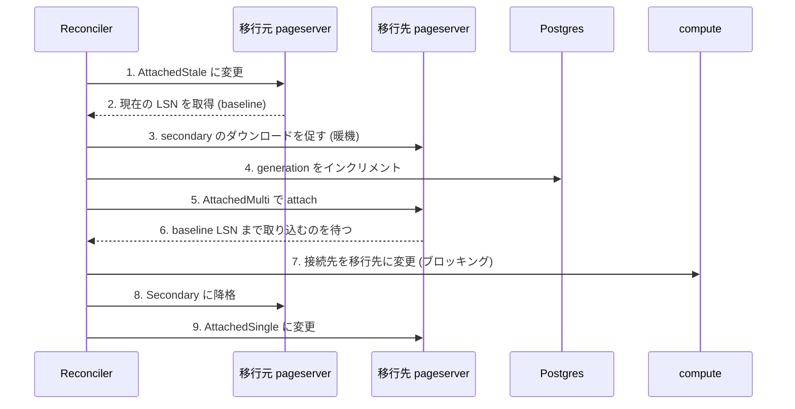

## 何を学んだか

```rust title="storage_controller/src/reconciler.rs"
/// Object with the lifetime of the background reconcile task that is created
/// for tenants which have a difference between their intent and observed states.
pub(super) struct Reconciler {
    /// See [`crate::tenant_shard::TenantShard`] for the meanings of these fields: they are a snapshot
    /// of a tenant's state from when we spawned a reconcile task.
    pub(super) tenant_shard_id: TenantShardId,
    /* ... */
    /// Observed state from the point of view of the reconciler.
    /// This gets updated as the reconciliation makes progress.
    pub(crate) observed: ObservedState,

    /// Snapshot of the observed state at the point when the reconciler
    /// was spawned.
    pub(crate) original_observed: ObservedState,
```

([storage_controller/src/reconciler.rs L31](https://github.com/neondatabase/neon/blob/fa504217c61bbcaf5c512d75830564541f917f8f/storage_controller/src/reconciler.rs#L31))

**Service の状態のスナップショットを持って動く** ([期待状態はどこにあるか](../controller-model/))。ロックを持たないので、長時間の I/O をしても Service を止めない。

`observed` と `original_observed` の両方を持つのは、**「開始時点の状態」と「今の進捗」を区別する**ため。結果を Service に返すとき、差分 (`ObservedStateDelta`) として渡せる。

## 中止できることが構造に組み込まれている

```rust title="storage_controller/src/reconciler.rs"
    /// A means to abort background reconciliation: it is essential to
    /// call this when something changes in the original TenantShard that
    /// will make this reconciliation impossible or unnecessary, for
    /// example when a pageserver node goes offline, or the PlacementPolicy for
    /// the tenant is changed.
    pub(crate) cancel: CancellationToken,

    /// Reconcilers are registered with a Gate so that during a graceful shutdown we
    /// can wait for all the reconcilers to respond to their cancellation tokens.
    pub(crate) _gate_guard: GateGuard,
```

([storage_controller/src/reconciler.rs L76](https://github.com/neondatabase/neon/blob/fa504217c61bbcaf5c512d75830564541f917f8f/storage_controller/src/reconciler.rs#L76))

**「もう意味がなくなった reconcile」を止める必要がある。** ノードが落ちた、ポリシーが変わった。走らせ続けると、古い期待状態に向かって収束しようとする。

`TenantShard` に `sequence: Sequence` があるのも同じ理由だ。

```rust title="storage_controller/src/tenant_shard.rs"
    // Runtime only: sequence used to coordinate when updating this object while
    // with background reconcilers may be running.  A reconciler runs to a particular
    // sequence.
    pub(crate) sequence: Sequence,
```

([storage_controller/src/tenant_shard.rs L64](https://github.com/neondatabase/neon/blob/fa504217c61bbcaf5c512d75830564541f917f8f/storage_controller/src/tenant_shard.rs#L64))

**「この reconciler はシーケンス N の期待状態に向かっている」。** 現在のシーケンスが N より進んでいたら、結果は古い。

## ライブマイグレーション — 7 段の手順

普通の reconcile は「attach するものを attach し、detach するものを detach する」だけだ。しかし移行のときは、**途中で読み取りが止まらないようにしたい。**



各段に理由がある。

**1. AttachedStale。** 移行元に「もう新しい generation が出るかもしれない」と伝えるモード。移行元は S3 への書き込みを控えるようになる。

**2. baseline LSN。** 移行元がどこまで取り込んでいるかを記録する。

**3. 暖機。**

```rust title="storage_controller/src/reconciler.rs"
        // If we are migrating to a destination that has a secondary location, warm it up first
        if let Some(destination_conf) = self.observed.locations.get(&dest_ps.get_id()) {
            if let Some(destination_conf) = &destination_conf.conf {
                if destination_conf.mode == LocationConfigMode::Secondary {
                    tracing::info!("🔁 Downloading latest layers to destination node {dest_ps}",);
                    self.secondary_download(self.tenant_shard_id, &dest_ps)
                        .await?;
```

([storage_controller/src/reconciler.rs L669](https://github.com/neondatabase/neon/blob/fa504217c61bbcaf5c512d75830564541f917f8f/storage_controller/src/reconciler.rs#L669))

**移行先が secondary なら、最新のレイヤを落としてから切り替える** ([ディスクが足りなくなったとき](../eviction-and-secondary/))。暖まっていない状態で切り替えると、全部 S3 から取り直すことになる。

**4. generation のインクリメント。** ここだけが DB に書く操作になる。

```rust title="storage_controller/src/reconciler.rs"
        // Increment generation before attaching to new pageserver
        self.generation = Some(
            self.persistence
                .increment_generation(self.tenant_shard_id, dest_ps.get_id())
                .await?,
        );
```

**attach の前に上げる。** 逆順だと、新しい pageserver が古い generation で書いてしまう ([generation 番号](../generations-and-deletion/))。

**5. AttachedMulti。** 「複数の場所に attach されている状態」を表すモード。移行元も移行先も、両方が attached になる期間がある。

**6. LSN の追いつき待ち。** 移行先が baseline まで WAL を取り込むまで待つ。これをやらないと、切り替えた瞬間に compute の要求が「まだ取り込んでいない LSN」を要求して待たされる。

**7. compute への通知。**

```rust title="storage_controller/src/reconciler.rs"
        // During a live migration it is unhelpful to proceed if we couldn't notify compute: if we detach
        // the origin without notifying compute, we will render the tenant unavailable.
        self.compute_notify_blocking(&origin_ps).await?;
```

([storage_controller/src/reconciler.rs L715](https://github.com/neondatabase/neon/blob/fa504217c61bbcaf5c512d75830564541f917f8f/storage_controller/src/reconciler.rs#L715))

**ここだけはブロッキング。** 通知に失敗したまま移行元を切り離すと、compute はどこにも繋がらなくなる。

通常の reconcile では、通知失敗を許容する。

```rust title="storage_controller/src/reconciler.rs"
    /// To avoid stalling if the cloud control plane is unavailable, we may proceed
    /// past failures in [`ComputeHook::notify_attach`], but we _must_ remember that we failed
    /// so that we can set [`crate::tenant_shard::TenantShard::pending_compute_notification`] to ensure a later retry.
    pub(crate) compute_notify_failure: bool,
```

**「失敗したことを覚えておいて、後で再試行する」。** 外部システム (control plane) の障害で自分が止まらないようにしつつ、忘れないようにする。

**同じ操作でも、文脈によって失敗の扱いが変わる。** 移行中は必須、それ以外は best-effort。

## 4 つの attach モード

この手順のために、pageserver 側に 4 つのモードがある。

| モード           | 意味                                             |
| ---------------- | ------------------------------------------------ |
| `AttachedSingle` | 通常。自分だけが attached                        |
| `AttachedMulti`  | 移行中。他にも attached がいる                   |
| `AttachedStale`  | 移行元。より新しい generation がいるかもしれない |
| `Secondary`      | 暖機のみ                                         |

**「1 台だけ」を諦めた ([generation 番号](../generations-and-deletion/)) 結果、「複数いる状態」を明示的に表現する必要が出た。**

`AttachedMulti` の期間は、2 台が同じ tenant に attached になる。generation が違うので S3 は壊れない。しかし compute からの要求は片方にしか行かない (通知のタイミングで切り替わる)。

## 中途半端な状態への対処

コード中に、正直な TODO がある。

```rust title="storage_controller/src/reconciler.rs"
        // TODO: we should also be setting the ObservedState on earlier API calls, in case we fail
        // partway through.  In fact, all location conf API calls should be in a wrapper that sets
        // the observed state to None, then runs, then sets it to what we wrote.
```

([storage_controller/src/reconciler.rs L731](https://github.com/neondatabase/neon/blob/fa504217c61bbcaf5c512d75830564541f917f8f/storage_controller/src/reconciler.rs#L731))

**「全部の API 呼び出しを、observed を None にしてから実行し、成功したら書き込む、というラッパーで包むべき」。**

これが [期待状態はどこにあるか](../controller-model/) で見た 3 値論理の正しい使い方だ。呼び出し前に「分からない」にしておけば、途中で落ちても後始末できる。

そうなっていない箇所があることを認めたうえで、あるべき形を書いている。**設計は分かっているが実装が追いついていない**ことの記録になっている。

FIXME もある。

```rust title="storage_controller/src/reconciler.rs"
        // FIXME: it is incorrect to use self.generation here, we should use the generation
        // from the ObservedState of the origin pageserver (it might be older than self.generation)
```

**自分が知っている generation と、移行元が実際に持っている generation が違うかもしれない。** 既知のバグとして残っている。

## 余計な generation の増加を避ける

```rust title="storage_controller/src/reconciler.rs"
    /// Returns true if the observed state of the attached location was refreshed
    /// and false otherwise.
    async fn maybe_refresh_observed(&mut self) -> Result<bool, ReconcileError> {
        // If the attached node has uncertain state, read it from the pageserver before proceeding: this
        // is important to avoid spurious generation increments.
        //
        // We don't need to do this for secondary/detach locations because it's harmless to just PUT their
        // location conf, whereas for attached locations it can interrupt clients if we spuriously destroy/recreate
        // the `Timeline` object in the pageserver.
```

([storage_controller/src/reconciler.rs L765](https://github.com/neondatabase/neon/blob/fa504217c61bbcaf5c512d75830564541f917f8f/storage_controller/src/reconciler.rs#L765))

**「分からない」状態のとき、まず pageserver に聞いて確かめる。**

冪等な操作 (secondary の設定) なら、確かめずに送っていい。しかし attach は違う。既に attach 済みのところに再度 attach を送ると、`Timeline` オブジェクトが作り直されてクライアントの接続が切れる。

**「冪等に見えるが副作用がある操作」がある。** その場合は、確かめてから送る。

## 優先度を必ず選ばせる

```rust title="storage_controller/src/reconciler.rs"
impl ReconcilerConfigBuilder {
    /// Priority is special: you must pick one thoughtfully, do not just use 'normal' as the default
    pub(crate) fn new(priority: ReconcilerPriority) -> Self {
```

([storage_controller/src/reconciler.rs L98](https://github.com/neondatabase/neon/blob/fa504217c61bbcaf5c512d75830564541f917f8f/storage_controller/src/reconciler.rs#L98))

**builder の `new()` が優先度を必須引数にしている。** そして「normal をデフォルトとして使うな、よく考えて選べ」と書いてある。

reconcile には並行度の上限がある。障害対応の reconcile と、最適化のための reconcile が同じ優先度だと、最適化が障害対応を待たせる ([compaction](../compaction/) の L0 優先と同じ構図)。

**デフォルト値を用意しないことで、判断を強制する。** builder パターンで「省略できない引数」を作る手口になっている。

## この先に効いてくること

- **収束ループはスナップショットで動く。** ロックを持たずに長時間の I/O をする。
- **中止できることを構造に組み込む。** キャンセルトークンとシーケンス番号。
- **段階的な切り替えには中間状態が要る。** `AttachedMulti` と `AttachedStale`。
- **同じ操作でも文脈で失敗の扱いが変わる。** 移行中の通知は必須、平常時は再試行。
- **デフォルト値を用意しないことで判断を強制する。**
