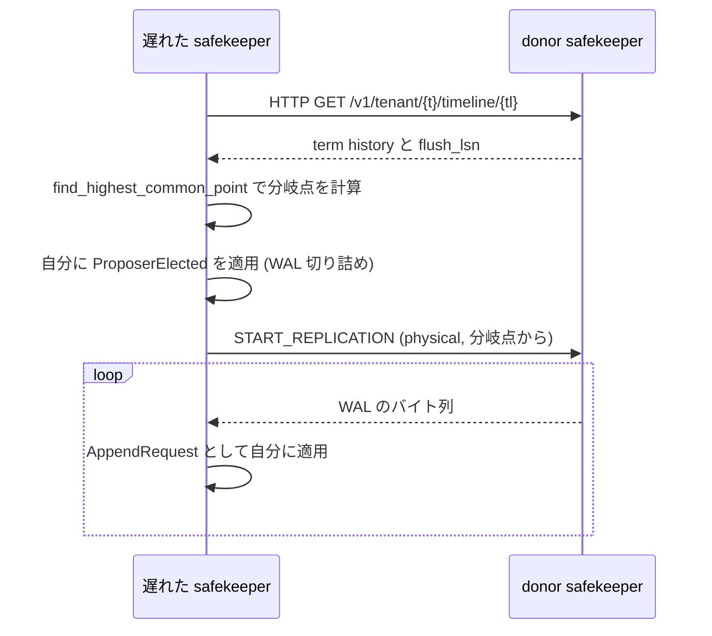

## 何を学んだか

Neon の基本設計では、WAL を配るのはプロポーザ (compute) だけだ。safekeeper 同士は直接通信しない ([なぜ Raft をそのまま使わなかったのか](../why-not-raft/))。

これで困る場面がある。

```rust title="safekeeper/src/recovery.rs"
//! This module implements pulling WAL from peer safekeepers if compute can't
//! provide it, i.e. safekeeper lags too much.
```

([safekeeper/src/recovery.rs L1](https://github.com/neondatabase/neon/blob/fa504217c61bbcaf5c512d75830564541f917f8f/safekeeper/src/recovery.rs#L1))

**compute が止まった状態で、1 台の safekeeper が遅れていたら、永遠に遅れたままになる。** サーバーレスなので compute はしょっちゅう止まる。止まっている間に safekeeper が再起動して遅れたら、次に compute が起きるまで復旧しない。

しかも遅れたままだと、その timeline の耐久性が落ちる。3 台のうち 1 台が古ければ、実質 2 台で過半数を維持していることになる。

## 誰から引くか — donor の条件

`recovery_needed()` の doc コメントが、条件を全部説明している。

```rust title="safekeeper/src/recovery.rs"
/// Should we start fetching WAL from a peer safekeeper, and if yes, from
/// which? Answer is yes, i.e. .donors is not empty if 1) there is something
/// to fetch, and we can do that without running elections; 2) there is no
/// actively streaming compute, as we don't want to compete with it.
///
/// If donor(s) are choosen, theirs last_log_term is guaranteed to be equal
/// to its last_log_term so we are sure such a leader ever had been elected.
```

([safekeeper/src/recovery.rs L50](https://github.com/neondatabase/neon/blob/fa504217c61bbcaf5c512d75830564541f917f8f/safekeeper/src/recovery.rs#L50))

判定はこうなる。

```rust title="safekeeper/src/recovery.rs"
    let num_streaming_computes = tli.get_walreceivers().get_num_streaming();
    let donors = if num_streaming_computes > 0 {
        vec![] // If there is a streaming compute, don't try to recover to not intervene.
    } else {
```

([safekeeper/src/recovery.rs L89](https://github.com/neondatabase/neon/blob/fa504217c61bbcaf5c512d75830564541f917f8f/safekeeper/src/recovery.rs#L89))

**compute が繋がっていたら何もしない。** 本来の経路が動いているなら、代理は邪魔でしかない。

そして候補の絞り込みが核心になる。

```rust title="safekeeper/src/recovery.rs"
                if my_tl < candidate_tl {
                    // Yes, we are interested. Can we pull from it without
                    // (re)running elections? It is possible if 1) his term
                    // is equal to his last_log_term so we could act on
                    // behalf of leader of this term (we must be sure he was
                    // ever elected) and 2) our term is not higher, or we'll refuse data.
                    if candidate.term == candidate.last_log_term && candidate.term >= term {
                        Some(Donor::from(candidate))
                    } else {
                        None
                    }
                } else {
                    None
                }
```

([safekeeper/src/recovery.rs L106](https://github.com/neondatabase/neon/blob/fa504217c61bbcaf5c512d75830564541f917f8f/safekeeper/src/recovery.rs#L106))

条件が 3 つ重なっている。

**1. `my_tl < candidate_tl`** — 相手が `(last_log_term, flush_lsn)` の辞書順で自分より進んでいる。LSN だけで比べないのがポイントで、理由は [term と epoch](../safekeeper-consensus/) で見た通りだ。

**2. `candidate.term == candidate.last_log_term`** — **相手の term と、相手が持っている最新レコードの term が一致している。**

これが「選挙を走らせずに代理を名乗れる」条件になる。相手の `last_log_term` が `T` なら、term `T` のプロポーザが確かに選出されたことが分かる (誰かが選ばれなければ term `T` のレコードは存在しない)。そして相手の `term` も `T` なら、相手はまだそのリーダーを認めている。

だから **`ProposerElected` を term `T` として送っても、それは実際に起きた選出を再現しているだけ**になる。新しい term を作らないので、新しい選挙をしていない。

```rust title="safekeeper/src/recovery.rs"
    let pe = ProposerAcceptorMessage::Elected(ProposerElected {
        generation: INVALID_GENERATION,
        term: donor.term,
        start_streaming_at: last_common_point.lsn,
        term_history: donor_th,
    });
```

([safekeeper/src/recovery.rs L329](https://github.com/neondatabase/neon/blob/fa504217c61bbcaf5c512d75830564541f917f8f/safekeeper/src/recovery.rs#L329))

**safekeeper が、プロポーザのふりをしてメッセージを送る。** 受け取る側 (自分自身) は、これが compute から来たのか peer から来たのかを区別しない。同じ状態機械を通る。

**3. `candidate.term >= term`** — 自分の term のほうが高かったら、そのデータは受け取れない。自分自身が拒否するからだ。事前に弾いている。

## 予測しないという判断

doc コメントの最後に、重要な限定がある。

```rust title="safekeeper/src/recovery.rs"
/// Note that term conditions above might be not met, but safekeepers are
/// still not aligned on last flush_lsn. Generally in this case until
/// elections are run it is not possible to say which safekeeper should
/// recover from which one -- history which would be committed is different
/// depending on assembled quorum (e.g. classic picture 8 from Raft paper).
/// Thus we don't try to predict it here.
```

([safekeeper/src/recovery.rs L62](https://github.com/neondatabase/neon/blob/fa504217c61bbcaf5c512d75830564541f917f8f/safekeeper/src/recovery.rs#L62))

**「どの safekeeper が正しいか」は、どの過半数が集まるかで変わる。** 選挙が走るまでは決まらない。だから決めない。

これは Raft 論文の Figure 8 と同じ話だ。「多数のノードが持っているログエントリ」が、必ずしもコミットされるとは限らない。新しいリーダーが別の過半数から選ばれれば、そのエントリは消える。

**部分的な情報から先回りして最適化しようとすると壊れる**という認識が、明示的に条件として書かれている。安全に代理できるケースだけを扱い、残りは選挙 (= compute の起動) を待つ。

## 引き方 — HTTP + replication protocol

実際の復旧は 2 段になっている。



**メタデータは HTTP、データは Postgres の replication プロトコル。** 前者は JSON で構造化された情報が要り、後者は大量のバイト列を流したい。用途で分けている。

そして donor の状態が途中で変わっていないかを確かめる。

```rust title="safekeeper/src/recovery.rs"
    if timeline_info.acceptor_state.term != donor.term {
        bail!(
            "donor term changed from {} to {}",
```

([safekeeper/src/recovery.rs L274](https://github.com/neondatabase/neon/blob/fa504217c61bbcaf5c512d75830564541f917f8f/safekeeper/src/recovery.rs#L274))

**candidate を選んだのは broker 経由の (少し古い) 情報から**なので、実際に繋ぐ直前に直接確かめる。分散システムで「見えている情報は過去のもの」という前提を扱う定型だ。

接続時のアプリケーション名にも意味がある。

```rust title="safekeeper/src/recovery.rs"
    // It will make safekeeper give out not committed WAL (up to flush_lsn).
    cfg.application_name(&format!("safekeeper_{}", conf.my_id));
```

([safekeeper/src/recovery.rs L366](https://github.com/neondatabase/neon/blob/fa504217c61bbcaf5c512d75830564541f917f8f/safekeeper/src/recovery.rs#L366))

**通常の読み手 (pageserver) には commit_lsn までしか渡さないが、peer recovery にはそれより先も渡す。** 未コミットの WAL を配ってよいのは、それが「まだ確定していない」ことを理解している相手だけだ。

その識別が `application_name` の文字列という、かなり緩い方法で行われている。認証とは別の、慣習的な区別になっている。

## 観測性のためのフィールド

`RecoveryNeededInfo` には、判断に使わないフィールドが入っている。

```rust title="safekeeper/src/recovery.rs"
pub struct RecoveryNeededInfo {
    /// my term
    pub term: Term,
    /// my last_log_term
    pub last_log_term: Term,
    /// my flush_lsn
    pub flush_lsn: Lsn,
    /// peers from which we can fetch WAL, for observability.
    pub peers: Vec<PeerInfo>,
    /// for observability
    pub num_streaming_computes: usize,
    pub donors: Vec<Donor>,
}
```

([safekeeper/src/recovery.rs L131](https://github.com/neondatabase/neon/blob/fa504217c61bbcaf5c512d75830564541f917f8f/safekeeper/src/recovery.rs#L131))

`donors` が空のとき、**なぜ空なのかを説明できる情報が全部入っている**。自分の term、自分の LSN、各 peer の term と LSN、compute が繋がっているかどうか。

そして `Display` の実装がそれを 1 行にまとめる。

**「復旧が始まらない」という症状は、条件のどれが満たされていないかが分からないと調べようがない。** 判断に使った入力をまるごと持ち回るのは冗長に見えるが、この種の条件分岐では最も効く観測性の作り方になっている。

## この先に効いてくること

- **代理を名乗れる条件は「過去に確かに選出された term である」こと。** 新しい term を作らないので選挙にならない。
- **決められないことは決めない。** どの履歴がコミットされるかは過半数の集まり方で変わる。先回りしない。
- **メタデータと大量データで経路を分ける。** HTTP と replication protocol。
- **判断の入力を丸ごと持って、そのまま出力できるようにする。** 「なぜ起きないか」を説明するために。
