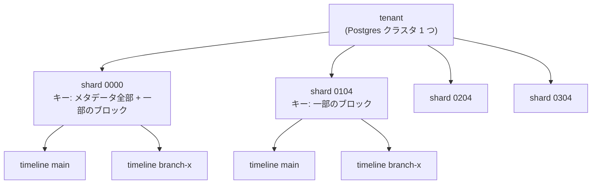

## 何を学んだか

pageserver のローカルディレクトリは、この形をしている。

```text
.neon/
  tenants/
    <tenant_id>[-<shard_slug>]/
      config-v1
      heatmap-v1.json
      timelines/
        <timeline_id>/
          <key start>-<key end>__<LSN>              ← image layer
          <key start>-<key end>__<start>-<end LSN>  ← delta layer
          ...
```

3 つの識別子が階層をなす。

**tenant** — 1 つの Postgres クラスタに対応する。`initdb` 1 回ぶんの世界で、テーブルも DB もユーザーも全部この中に閉じる。用語集の定義は「1 人の顧客」だ。

**timeline** — ブランチ。ユーザーには「ブランチ」として見えるが、内部では timeline と呼ばれる。用語集に注意書きがある。

> NOTE: this has nothing to do with PostgreSQL WAL timelines.

Postgres の `TimeLineID` (PITR のたびに増える番号) とは無関係で、Neon の timeline は 128 ビットのランダム ID になっている。Postgres 側の TLI は常に 1 に固定されている。

**shard** — キー空間の分割。1 つの tenant を複数の pageserver で分担するための単位 ([読み取りパス](../read-path/))。

## shard は tenant の下、timeline の上にある

ここが混乱しやすい。ディレクトリを見ると分かる。

```rust title="pageserver/src/config.rs"
    pub fn tenant_path(&self, tenant_shard_id: &TenantShardId) -> Utf8PathBuf {
        self.tenants_path().join(tenant_shard_id.to_string())
    }
```

([pageserver/src/config.rs L313](https://github.com/neondatabase/neon/blob/fa504217c61bbcaf5c512d75830564541f917f8f/pageserver/src/config.rs#L313))

パスの構成要素は `tenant_id` ではなく **`tenant_shard_id`** だ。そして shard slug のフォーマットはこうなる。

```rust title="libs/pageserver_api/src/shard.rs"
//! - A legacy unsharded tenant has one shard with ShardCount(0), ShardNumber(0), and its slug is 0000
//! - A single sharded tenant has one shard with ShardCount(1), ShardNumber(0), and its slug is 0001
//! - In a tenant with 4 shards, each shard has ShardCount(N), ShardNumber(i) where i in 0..N-1 (inclusive),
//!   and their slugs are 0004, 0104, 0204, and 0304.
```

([libs/pageserver_api/src/shard.rs L28](https://github.com/neondatabase/neon/blob/fa504217c61bbcaf5c512d75830564541f917f8f/libs/pageserver_api/src/shard.rs#L28))

**`ShardCount(0)` と `ShardCount(1)` が別物**なのが面白い。どちらも shard は 1 つだが、前者は「シャーディング以前からある tenant」、後者は「シャーディングされていることが明示された tenant」。

なぜ区別が要るか。**パスに shard slug が入るので、`0000` と `0001` は別のディレクトリ、別の S3 プレフィックスになる。** 既存 tenant のパスを変えずにシャーディング機能を導入するには、「count = 0」という値が必要だった。

つまりこれは**マイグレーションのために残された値**で、機能的な意味はない。長く動いているシステムの識別子には、この手の歴史が沈殿する。

そして shard が分割されると、**timeline はすべての shard に存在する**。shard 0 も shard 1 も、同じ timeline ID のディレクトリを持ち、それぞれ自分の担当キーだけのレイヤを持つ。



**shard は「同じ timeline 集合を持つ、キー空間の縦割り」**になっている。timeline を作れば全 shard に作られ、消せば全 shard から消える。この一貫性を保つのが storage_controller の仕事になる ([reconciler](../reconciler/))。

## メタデータは shard 0 に集まる

[読み取りパス](../read-path/) で見たとおり、リレーションのブロック以外は shard 0 に置かれる。結果として、**shard 0 だけが特別扱いされる場所**がコード中に散らばる。

```rust title="libs/pageserver_api/src/shard.rs"
    /// Convenience for checking if this identity is the 0th shard in a tenant,
    /// for special cases on shard 0 such as ingesting relation sizes.
```

([libs/pageserver_api/src/shard.rs L266](https://github.com/neondatabase/neon/blob/fa504217c61bbcaf5c512d75830564541f917f8f/libs/pageserver_api/src/shard.rs#L266))

- basebackup を作れるのは shard 0 だけ
- リレーションのサイズを保持するのは shard 0
- DB 一覧、リレーション一覧も shard 0
- 論理サイズ (課金に使う) の計算も shard 0

**対称な分散ではなく、1 つだけ役割の重いノードがいる設計**だ。負荷が偏るが、代わりに「メタデータの整合性を分散させる」問題が消える。

一方で、WAL の取り込みは全 shard がやる。

```rust title="libs/pageserver_api/src/shard.rs"
    /// Return true if the key is stored only on this shard. This does not include
    /// global keys, see is_key_global().
    ///
    /// Shards must ingest _at least_ keys which return true from this check.
    pub fn is_key_local(&self, key: &Key) -> bool {
```

([libs/pageserver_api/src/shard.rs L196](https://github.com/neondatabase/neon/blob/fa504217c61bbcaf5c512d75830564541f917f8f/libs/pageserver_api/src/shard.rs#L196))

**「少なくともこれは取り込め」という下限の指定になっている。** 上限ではない。余分に取り込んでも正しく、後で捨てられる。

その「捨てる」判定が別の関数になっている。

```rust title="libs/pageserver_api/src/shard.rs"
    pub fn is_key_disposable(&self, key: &Key) -> bool {
        if self.count < ShardCount(2) {
            // Fast path: unsharded tenant doesn't dispose of anything
            return false;
        }

        if self.is_key_global(key) {
            false
        } else {
            !self.is_key_local(key)
        }
    }
```

([libs/pageserver_api/src/shard.rs L237](https://github.com/neondatabase/neon/blob/fa504217c61bbcaf5c512d75830564541f917f8f/libs/pageserver_api/src/shard.rs#L237))

**「必ず持つ」「持ってもいい」「捨ててよい」の 3 段階**になっている。shard split の途中では、担当が変わったキーを一時的に両方が持つ。厳密に「自分のキーだけ」を持つ設計にすると、分割の途中に不整合な瞬間ができてしまう。

## generation は tenant shard の生存期間で固定される

```rust title="pageserver/src/tenant.rs"
    /// The remote storage generation, used to protect S3 objects from split-brain.
    /// Does not change over the lifetime of the [`TenantShard`] object.
    ///
    /// This duplicates the generation stored in LocationConf, but that structure is mutable:
    /// this copy enforces the invariant that generatio doesn't change during a Tenant's lifetime.
    generation: Generation,
```

([pageserver/src/tenant.rs L282](https://github.com/neondatabase/neon/blob/fa504217c61bbcaf5c512d75830564541f917f8f/pageserver/src/tenant.rs#L282))

**同じ値を 2 か所に持ち、片方を不変にすることで不変条件を型で表している。** `LocationConf` は設定なので変わりうるが、`TenantShard` の `generation` は生成時に固定される。generation が変わるなら、`TenantShard` オブジェクトを作り直す ([generation 番号](../generations-and-deletion/))。

「値を複製する」のは普通は避けたいが、ここでは**「変わらない」という保証を得るために複製している**。

## timeline は消えるだけでなく、退避もされる

```rust title="pageserver/src/tenant.rs"
    timelines: Mutex<HashMap<TimelineId, Arc<Timeline>>>,

    /// During timeline creation, we first insert the TimelineId to the
    /// creating map, then `timelines`, then remove it from the creating map.
    /// **Lock order**: if acquiring all (or a subset), acquire them in order `timelines`, `timelines_offloaded`, `timelines_creating`
    timelines_creating: std::sync::Mutex<HashSet<TimelineId>>,

    /// Possibly offloaded and archived timelines
    timelines_offloaded: Mutex<HashMap<TimelineId, Arc<OffloadedTimeline>>>,
```

([pageserver/src/tenant.rs L289](https://github.com/neondatabase/neon/blob/fa504217c61bbcaf5c512d75830564541f917f8f/pageserver/src/tenant.rs#L289))

timeline の状態が 3 つのマップに分かれている。

- `timelines` — 普通に使える
- `timelines_creating` — 作成中。**作成の途中でクラッシュしたときの半端な状態を検出するため**
- `timelines_offloaded` — アーカイブされ、メモリ上の構造を落としたもの

**ロック順序がコメントで指定されている。** 3 つのマップを持つと、デッドロックの可能性が生まれる。Rust の型システムはロック順序を検査しないので、コメントで書くしかない。同じ注意書きが 2 か所に繰り返されているのは、**両方のフィールドを見た人がどちらからでも気付けるようにするため**だろう。

アーカイブされた timeline は、レイヤファイルを S3 に残したままローカルとメモリから消える。**「消す」と「使わない」の間に段階を作った**わけで、これは長期間使われないブランチが大量にあるサービスでは効く。

## この先に効いてくること

- **階層は tenant → shard → timeline。** shard が timeline より上にある。
- **識別子には歴史が沈殿する。** `ShardCount(0)` はマイグレーションのためだけの値。
- **担当キーは「必ず持つ」「持ってもいい」「捨ててよい」の 3 段。** 分割の途中を許すため。
- **不変性を得るために値を複製する。** generation は tenant の生存期間で固定。
- **状態を増やすとロック順序が問題になる。** 型で守れないのでコメントで書く。
