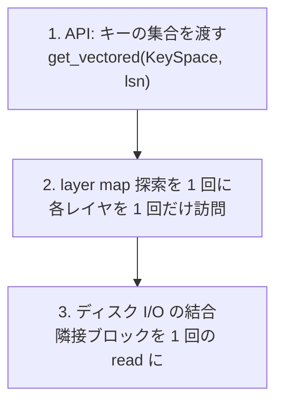

## 何を学んだか

`Timeline::get(key, lsn)` を 1 ページずつ呼ぶと何が起きるか。RFC が数え上げている。

```markdown title="docs/rfcs/030-vectored-timeline-get.md"
Doing this many `Timeline::get` calls is quite inefficient because:

1. We do the layer map traversal repeatedly, even if, e.g., all the data sits in the same image layer at the bottom of the stack.
2. We may visit many DiskBtree inner pages multiple times for point lookup of different keys.
   This is likely particularly bad for L0s which span the whole key space and hence must be visited by layer map traversal, but
   may not contain the data we're looking for.
```

([docs/rfcs/030-vectored-timeline-get.md](https://github.com/neondatabase/neon/blob/fa504217c61bbcaf5c512d75830564541f917f8f/docs/rfcs/030-vectored-timeline-get.md))

**同じ layer map を何度も辿り、同じ B-tree の内部ページを何度も引く。** 特に L0 レイヤはキー空間全体をカバーするので必ず訪問対象になるのに、探しているキーが入っていないことが多い。

きっかけは basebackup での SLRU 読み取りだった。キー空間で隣接した大量のページを順に読む。**アクセスパターンが「点」ではなく「範囲」なのに、API が点しか受け付けなかった。**

## 3 段階の一括化

対処は 3 つのレベルで行われている。



**1. API。** `Key` 1 つではなく `KeySpace` (キー範囲の集合) を受け取る。`VersionedKeySpaceQuery` として LSN も範囲ごとに変えられる。

**2. レイヤ探索。** 「キー集合に対して、まだ再構成が完了していないキーの集合」を持ち回りながら、新しいレイヤを 1 つずつ訪問する。各レイヤは自分の中にあるキーだけを埋める。全キーが埋まるか、レイヤが尽きたら終わり。**1 つのレイヤを 1 回だけ開く。**

**3. ディスク I/O。** これが `vectored_blob_io.rs` の仕事になる。

## blob と block

```rust title="pageserver/src/tenant/vectored_blob_io.rs"
//! Utilities for vectored reading of variable-sized "blobs".
//!
//! The "blob" api is an abstraction on top of the "block" api,
//! with the main difference being that blobs do not have a fixed
//! size (each blob is prefixed with 1 or 4 byte length field)
//!
//! The vectored apis provided in this module allow for planning
//! and executing disk IO which covers multiple blobs.
//!
//! Reads are planned with [`VectoredReadPlanner`] which will coalesce
//! adjacent blocks into a single disk IO request and exectuted by
//! [`VectoredBlobReader`] which does all the required offset juggling
//! and returns a buffer housing all the blobs and a list of offsets.
//!
//! Note that the vectored blob api does *not* go through the page cache.
```

([pageserver/src/tenant/vectored_blob_io.rs L1](https://github.com/neondatabase/neon/blob/fa504217c61bbcaf5c512d75830564541f917f8f/pageserver/src/tenant/vectored_blob_io.rs#L1))

**「plan して execute する」という 2 相構造**になっている。

- **plan** — B-tree を引いて得た「読みたいオフセットの列」を、隣接するものごとにまとめる
- **execute** — まとまった範囲を大きな read で読み、返ってきたバッファから各 blob を切り出す

そして最後の 1 行が重要だ。**「page cache は通さない」。** レイヤの値の読み取りはキャッシュしない。理由は [page_cache](../page-cache/) で扱う。

blob のサイズが 1 バイトか 4 バイトの長さ接頭辞で表現されているのは、**大半の値が 256 バイト未満だから**だ。WAL レコードは小さい。ページ画像 (8KB) だけが 4 バイト側になる。

## 結合の条件

```rust title="pageserver/src/tenant/vectored_blob_io.rs"
    /// Attempts to extend the current read with a new blob if the new blob resides in the same or the immediate next chunk.
    ///
    /// The resulting size also must be below the max read size.
    pub(crate) fn extend(&mut self, start: u64, end: u64, meta: BlobMeta) -> VectoredReadExtended {
        let start_blk_no = start as usize / Self::CHUNK_SIZE;
        let end_blk_no = (end as usize).div_ceil(Self::CHUNK_SIZE);

        let not_limited_by_max_read_size = {
            if let Some(max_read_size) = self.max_read_size {
                let coalesced_size = (end_blk_no - self.start_blk_no) * Self::CHUNK_SIZE;
                coalesced_size <= max_read_size
            } else {
                true
            }
        };

        // True if the second block starts in the same block or the immediate next block where the first block ended.
        let is_adjacent_chunk_read = {
            // 1. first.end & second.start are in the same block
            self.end_blk_no == start_blk_no + 1 ||
            // 2. first.end ends one block before second.start
            self.end_blk_no == start_blk_no
        };

        if is_adjacent_chunk_read && not_limited_by_max_read_size {
```

([pageserver/src/tenant/vectored_blob_io.rs L251](https://github.com/neondatabase/neon/blob/fa504217c61bbcaf5c512d75830564541f917f8f/pageserver/src/tenant/vectored_blob_io.rs#L251))

条件は 2 つ。**隣接している**ことと、**上限を超えない**こと。

隣接の判定がチャンク番号でされているのが要点だ。バイトオフセットで比べるのではなく、I/O のアラインメント単位 (`get_io_buffer_alignment()`) で割った番号で比べる。

```rust
    const CHUNK_SIZE: usize = virtual_file::get_io_buffer_alignment();
```

**同じチャンクの中にある 2 つの blob は、どのみち 1 回の read で読まれる。** だからバイト単位で隙間があっても結合してよい。逆にチャンクが 2 つ以上離れていれば、間の無駄が実際のコストになる。

O_DIRECT を使う場合、read はアラインメント境界でしか発行できない ([virtual_file](../virtual-file/))。**下層の制約が、そのまま結合の粒度になっている。**

## 上限の例外

`max_read_size` が `Option` になっている理由が、コンストラクタのコメントにある。

```rust title="pageserver/src/tenant/vectored_blob_io.rs"
    /// Note that by design, this does not check against reading more than `max_read_size` to
    /// support reading larger blobs than the configuration value. The builder will be single use
    /// however after that.
```

([pageserver/src/tenant/vectored_blob_io.rs L214](https://github.com/neondatabase/neon/blob/fa504217c61bbcaf5c512d75830564541f917f8f/pageserver/src/tenant/vectored_blob_io.rs#L214))

**1 個の blob が上限より大きい場合は、上限を無視する。** そうしないと読めない。

「上限」を「まとめる量の上限」として扱い、「1 個を読む量の上限」としては扱わない。**制約の適用範囲を、実現可能性から決めている。**

`new_streaming` (上限なし) は compaction のような、順にレイヤ全体を舐める用途で使う。**読み取りレイテンシを気にしない経路では、上限自体が要らない。**

## 結果の受け取り方

```rust title="pageserver/src/tenant/vectored_blob_io.rs"
pub struct VectoredRead {
    pub start: u64,
    pub end: u64,
    /// Start offset and metadata for each blob in this read
    pub blobs_at: VecMap<u64, BlobMeta>,
}
```

```rust title="pageserver/src/tenant/vectored_blob_io.rs"
/// Metadata bundled with the start and end offset of a blob.
pub struct BlobMeta {
    pub key: Key,
    pub lsn: Lsn,
    pub will_init: bool,
}
```

([pageserver/src/tenant/vectored_blob_io.rs L32](https://github.com/neondatabase/neon/blob/fa504217c61bbcaf5c512d75830564541f917f8f/pageserver/src/tenant/vectored_blob_io.rs#L32))

**`will_init` が plan の段階で分かっている。** [チェックポイントと full page image](../checkpoint-and-fpi/) で見た `ValueBytes::will_init` — 生のバイト列から、デシリアライズせずにこのフラグを読む関数 — がここで効く。

「このキーはこの値で完結する」と分かれば、それより古いレイヤを読む必要がない。**値を実際に読む前に、読むかどうかを決められる。**

## バッファのビュー

```rust title="pageserver/src/tenant/vectored_blob_io.rs"
/// A view into the vectored blobs read buffer.
pub(crate) enum BufView<'a> {
    Slice(&'a [u8]),
    Bytes(bytes::Bytes),
}
```

読み取りの結果は 1 つの大きなバッファで、そこから各 blob を切り出す。**コピーせずにスライスで返せるなら返す。** `Bytes` に変換するときだけコピーが起きる。

```rust title="pageserver/src/tenant/vectored_blob_io.rs"
    /// Convert the view into `Bytes`.
    ///
    /// If using slice as the underlying storage, the copy will be an O(n) operation.
    pub fn into_bytes(self) -> Bytes {
```

**コピーが起きる場所をメソッド名と doc コメントで明示する。** 呼び出し側が意図的に選べるようになっている。

圧縮された blob (zstd) の場合は展開が要るので、必ず新しいバッファになる。`BYTE_UNCOMPRESSED` / `BYTE_ZSTD` のヘッダバイトで分岐する。

## この先に効いてくること

- **API の粒度が性能を決める。** 点の API を範囲の API にするだけで、無駄な探索が消える。
- **plan と execute を分ける。** どこを読むか決めてから、まとめて読む。
- **結合の粒度は下層のアラインメント。** O_DIRECT の制約がそのまま設計に上がってくる。
- **制約の適用範囲を実現可能性から決める。** 1 個が上限を超えるなら、上限を無視する。
- **メタデータを先に読んで、本体を読むかどうかを決める。** `will_init` の生バイト読み。
