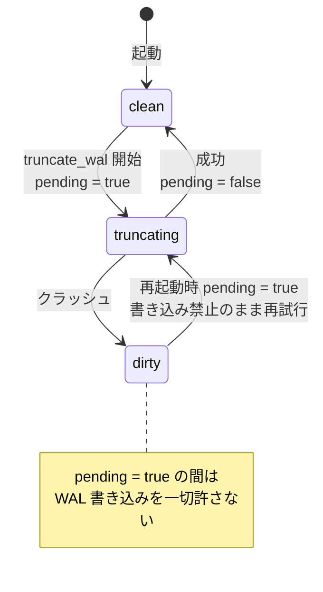

## 何を学んだか

safekeeper の timeline ディレクトリは、Postgres の `pg_wal` に似ている。

```rust title="safekeeper/src/wal_storage.rs"
//! This module has everything to deal with WAL -- reading and writing to disk.
//!
//! Safekeeper WAL is stored in the timeline directory, in format similar to pg_wal.
//! PG timeline is always 1, so WAL segments are usually have names like this:
//! - 000000010000000000000001
//! - 000000010000000000000002.partial
//!
//! Note that last file has `.partial` suffix, that's different from postgres.
```

([safekeeper/src/wal_storage.rs L1](https://github.com/neondatabase/neon/blob/fa504217c61bbcaf5c512d75830564541f917f8f/safekeeper/src/wal_storage.rs#L1))

**Postgres と違って、末尾のセグメントに `.partial` が付く。**

Postgres の WAL セグメントは、書き始める前に 16MB 全部をゼロで確保する。だから途中まで書かれているかどうかはファイル名からは分からない (`pg_control` を見る)。

safekeeper は分けた。理由は、**この 1 本だけが「書き換わりうるファイル」だから**だ。S3 へのバックアップは完成したセグメントだけを上げるし ([S3 への WAL バックアップ](../wal-backup-eviction/))、切り詰めが起きるのもここだけになる。**可変なものと不変なものを、名前で分けている。**

## 4 つの LSN

`PhysicalStorage` が持つ LSN は 4 つある。

```rust title="safekeeper/src/wal_storage.rs"
    /// Written to disk, but possibly still in the cache and not fully persisted.
    /// Also can be ahead of record_lsn, if happen to be in the middle of a WAL record.
    write_lsn: Lsn,

    /// The LSN of the last WAL record written to disk. Still can be not fully
    /// flushed.
    write_record_lsn: Lsn,

    /// The last LSN flushed to disk. May be in the middle of a record.
    flush_lsn: Lsn,

    /// The LSN of the last WAL record flushed to disk.
    flush_record_lsn: Lsn,
```

([safekeeper/src/wal_storage.rs L100](https://github.com/neondatabase/neon/blob/fa504217c61bbcaf5c512d75830564541f917f8f/safekeeper/src/wal_storage.rs#L100))

2 つの軸の直積になっている。

|              | write (バイトを書いた) | flush (fsync した) |
| ------------ | ---------------------- | ------------------ |
| 任意の位置   | `write_lsn`            | `flush_lsn`        |
| レコード境界 | `write_record_lsn`     | `flush_record_lsn` |

**レコード境界が要るのは、合意プロトコルが「レコード」を単位にしているからだ。** WAL の途中まで受け取っても、それはまだ 1 つのレコードにならない。「ここまで持っている」と報告してよいのは、レコードとして完結した位置までになる。

だから safekeeper は WAL をデコードする。

```rust title="safekeeper/src/wal_storage.rs"
    /// Decoder is required for detecting boundaries of WAL records.
    decoder: WalStreamDecoder,
```

**中身は解釈しないが、境界だけは知る必要がある。** レコードヘッダの `xl_tot_len` を読んで、次の境界を計算する。それだけのために `postgres_ffi` の WAL デコーダを持っている。

そして、コメントに危険性の警告がある。

```rust title="safekeeper/src/wal_storage.rs"
    /// NB: when the rest of the system refers to `flush_lsn`, it usually
    /// actually refers to `flush_record_lsn`. This ambiguity can be dangerous
    /// and should be resolved.
```

**システムの他の場所が `flush_lsn` と呼んでいるものは、実は `flush_record_lsn` のことが多い。** 名前が同じで意味が違う 2 つの値が並んでいる。「危険であり、解消すべき」と書かれたまま残っている。

## 順序が逆転することがある

普通は `write_lsn >= write_record_lsn >= flush_record_lsn` が成り立つ。しかしコメントは例外を挙げている。

```rust title="safekeeper/src/wal_storage.rs"
    /// Note: Normally it (and flush_record_lsn) is <= write_lsn, but after xlog
    /// switch ingest the reverse is true because we don't bump write_lsn up to
    /// the next segment: WAL stream from the compute doesn't have the gap and
    /// for simplicity / as a sanity check we disallow any non-sequential
    /// writes, so write zeros as is.
```

`XLOG_SWITCH` レコード (`pg_switch_wal()`) は、「このセグメントの残りは捨てて、次のセグメントから始める」という意味を持つ。デコーダは「このレコードの終わりは次のセグメントの先頭」と報告する。しかし safekeeper は、その間のゼロも実際に書く。**「非連続な書き込みを許さない」という不変条件を守るほうを優先している。**

結果として、`write_record_lsn` が `write_lsn` より先に進む瞬間ができる。**不変条件を 1 つ守ると、別の不変条件が崩れる。** どちらを選ぶかの判断がコメントに残っている。

LSN のアラインメントでも同じことが起きうる、とも書いてある。レコードが 8 バイト境界でない位置で終わると、デコーダは切り上げた位置を報告する。「実際にはコンピュートがアラインされていないチャンクを送ることはまずない」という但し書き付きで。

## 切り詰めは中断されうる

いちばん込み入っているのは `truncate_wal` だ。プロポーザが選出されたとき、safekeeper は自分の WAL の一部を捨てる ([term と epoch](../safekeeper-consensus/))。

```rust title="safekeeper/src/wal_storage.rs"
        // Atomicity: we start with LSNs reset because once on disk deletion is
        // started it can't be reversed. However, we might crash/error in the
        // middle, leaving garbage above the truncation point. In theory,
        // concatenated with previous records it might form bogus WAL (though
        // very unlikely in practice because CRC would guard from that). To
        // protect, set pending_wal_truncation flag before beginning: it means
        // truncation must be retried and WAL writes are prohibited until it
        // succeeds. Flag is also set on boot because we don't know if the last
        // state was clean.
        self.pending_wal_truncation = true;
```

([safekeeper/src/wal_storage.rs L551](https://github.com/neondatabase/neon/blob/fa504217c61bbcaf5c512d75830564541f917f8f/safekeeper/src/wal_storage.rs#L551))

**ファイルの削除は rename でアトミックにできない。** 複数のセグメントを消し、1 つを短くし、名前を変える。この途中でクラッシュすると、切り詰め点より上にゴミが残る。

対策は「やり直しが必要」というフラグを立てることだ。



そして**起動時は常にフラグを立てる**。前回きれいに終わったか分からないからだ。プロトコル上、書き込みの前に必ず `ProposerElected` (= `truncate_wal`) が来るので、これで安全になる。

```rust title="safekeeper/src/wal_storage.rs"
        // Protocol (HandleElected before first AppendRequest) ensures we'll
        // always try to ensure clean truncation before any writes.
```

**「常に汚れているとみなし、使う前に必ず掃除する」**という方針で、クラッシュ時の状態を判定する複雑さを消している。

CRC についての言及も正直だ。「理論上は、残ったゴミが前のレコードと繋がって偽の WAL を形成しうる (実際には CRC が守るのでまず起きないが)」。**確率的に安全なものに頼らず、構造で防ぐ。**

## 16MB のゼロを書かない最適化

そのすぐ上に、逆向きの配慮がある。

```rust title="safekeeper/src/wal_storage.rs"
        // Quick exit if nothing to do and we know that the state is clean to
        // avoid writing up to 16 MiB of zeros on disk (this happens on each
        // connect).
        if !self.pending_wal_truncation
            && end_pos == self.write_lsn
            && end_pos == self.flush_record_lsn
        {
            return Ok(());
        }
```

([safekeeper/src/wal_storage.rs L541](https://github.com/neondatabase/neon/blob/fa504217c61bbcaf5c512d75830564541f917f8f/safekeeper/src/wal_storage.rs#L541))

切り詰めの実体は、セグメントを `set_len` で縮めてから 16MB に戻す — つまり**残りをゼロで埋める**ことだ。

```rust title="safekeeper/src/wal_storage.rs"
        // Fill end with zeroes
        file.set_len(xlogoff as u64).await?;
        file.set_len(self.wal_seg_size as u64).await?;
        self.fsync_file(&file).await?;
```

compute が接続するたびに `ProposerElected` が来るので、毎回これをやると 16MB の書き込みが発生する。**「切り詰める必要が実際にない」ケースを検出して、丸ごと飛ばす。**

条件に `!self.pending_wal_truncation` が入っているのが要点で、**汚れているかもしれないときは飛ばさない**。速い経路と安全な経路の分岐が、1 つのフラグで表現されている。

## 完成したセグメントは rename で確定する

切り詰めの最後に、`.partial` に戻す処理がある。

```rust title="safekeeper/src/wal_storage.rs"
        if !is_partial {
            // Make segment partial once again
            let (wal_file_path, wal_file_partial_path) =
                wal_file_paths(&self.timeline_dir, segno, self.wal_seg_size);
            fs::rename(wal_file_path, wal_file_partial_path).await?;
        }
```

完成扱いだったセグメントを、切り詰めたので未完成に戻す。**`.partial` の有無が「このファイルはもう変わらない」という契約になっている**ので、契約を破るときは名前も戻す。

この契約に依存しているのが S3 へのバックアップだ。完成したセグメントだけを上げるので、上げたものが後から変わることはない。**ファイル名 1 つで、不変性の境界を表現している。**

## この先に効いてくること

- **可変なファイルと不変なファイルを名前で分ける。** `.partial` が契約になっている。
- **バイト位置とレコード境界の 2 つの軸で LSN を持つ。** 合意はレコード単位なので境界が要る。
- **不変条件は互いに衝突する。** 「非連続な書き込みを許さない」を守ると LSN の順序が崩れる。
- **アトミックにできない操作は、やり直し可能にする。** フラグを立て、起動時は常に汚れているとみなす。
