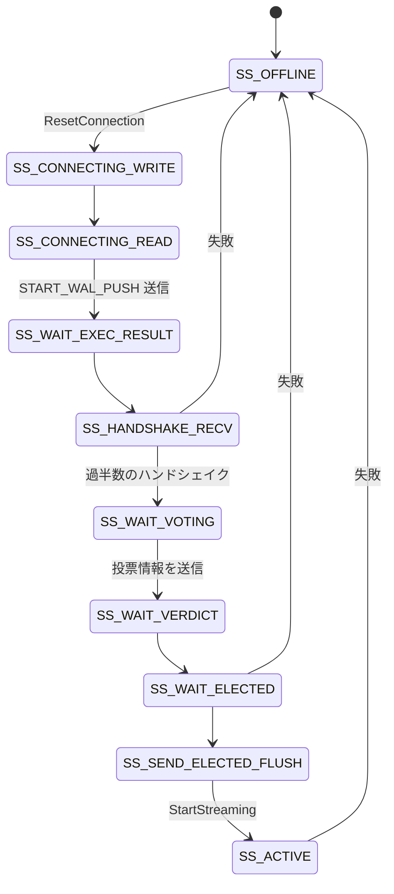

## 何を学んだか

Postgres が WAL を永続化する経路は `XLogFlush()` → `fsync()` だ。Neon ではこれが「3 台の safekeeper に提案し、過半数の ack を待つ」に変わる。

その提案側 — Paxos で言う proposer — が **walproposer** で、Postgres のバックグラウンドワーカーとして compute の中で動く。

なぜ外部プロセスではなく Postgres の中なのか。理由は 2 つある。

**1. WAL の生成元に近い。** `XLogFlush()` を待たせる必要があるので、共有メモリ経由で backend と同期したい。プロセスが分かれると IPC が挟まる。

**2. Postgres のストリーミングレプリケーションの枠組みに乗れる。** safekeeper は WAL sender/receiver のプロトコルを話す。walproposer はその変種として振る舞う。

代償もある。postmaster のシャットダウン順序に手が入っている。

> This changes was needed so that postmaster shuts down the walproposer process only after the shutdown checkpoint record is written. Otherwise, the shutdown record will never make it to the safekeepers.

**バックグラウンドワーカーを WAL sender と同じ扱いにする**という 1 行のパッチ。プロセスの生存期間が、データの到達性に直結している。

## 接続ごとの状態機械

walproposer は最大 32 台の safekeeper への接続をそれぞれ状態機械として持つ。



```c title="pgxn/neon/walproposer.h"
	/*
	 * Waiting to participate in voting, but a quorum hasn't yet been reached.
	 * This is an idle state - we do not expect AdvancePollState to be called.
	 *
	 * Moved externally by execution of SS_HANDSHAKE_RECV, when we received a
	 * quorum of handshakes.
	 */
	SS_WAIT_VOTING,
```

([pgxn/neon/walproposer.h L35](https://github.com/neondatabase/neon/blob/fa504217c61bbcaf5c512d75830564541f917f8f/pgxn/neon/walproposer.h#L35))

**個々の接続の状態遷移に、全体の状態 (過半数が集まったか) が影響する。** `SS_WAIT_VOTING` はアイドル状態で、自分では進めない。他の接続のハンドシェイクが揃ったときに、外から動かされる。

コメントに `SS_CONNECTING_WRITE` と `SS_CONNECTING_READ` の区別の理由が書いてある。

```c title="pgxn/neon/walproposer.h"
	 * Connecting states. "_READ" waits for the socket to be available for
	 * reading, "_WRITE" waits for writing. There's no difference in the code
	 * they execute when polled, but we have this distinction in order to
	 * recreate the event set in HackyRemoveWalProposerEvent.
```

**実行するコードは同じで、待つイベントだけが違う。** 状態を 2 つに割ったのは、Postgres の `WaitEventSet` の都合。関数名に `Hacky` が入っているのが正直だ。

## 3 つのフェーズ

状態機械を大きく見ると、Paxos の 3 フェーズに対応している。

**フェーズ 1: ハンドシェイク。** サーバの情報 (WAL セグメントサイズ、system_id) を全 safekeeper に送り、応答を集める。過半数が返事をするまで待つ。

**フェーズ 2: 選出。** 集まった応答から最大の term を見つけ、`term + 1` を新しい term として提案する。過半数が受理したら、そのプロポーザが「選出された」ことになる。同時に、どの safekeeper が最も進んだ WAL を持っているか (donor) を決める。

**フェーズ 3: ストリーミング。** WAL を送り、ack を集め、`commit_lsn` を計算して backend に伝える。

`docs/safekeeper-protocol.md` の記述がフェーズ 1〜2 を説明している。

> 3. Once quorum of handshake responses are received, propose new `NodeId(max(term)+1, server.uuid)` to all of them.
> 4. On receiving proposed nodeId, safekeeper compares it with locally stored nodeId and if it is greater or equals

**選出は「投票」だが、投票者は候補を選ばない。** 候補は 1 つ (今接続してきたプロポーザ) しかいない。やっていることは「より大きい term を受理し、それ以前の term を拒否する」という約束だけだ。プライマリが 1 台であることは制御プレーンが保証しているので、選挙は要らない。要るのは**古いプライマリを排除する仕組み**だけになる ([なぜ Raft をそのまま使わなかったのか](../why-not-raft/))。

## 関数ポインタ表で Postgres から切り離す

walproposer.c は 90KB ある。この中身が Postgres の API を直接呼んでいたら、テストは Postgres を起動しないと書けない。

Neon はここに vtable を挟んだ。

```c title="pgxn/neon/walproposer.h"
typedef struct walproposer_api
{
	/*
	 * Get WalproposerShmemState. This is used to store information about last
	 * elected term.
	 */
	WalproposerShmemState *(*get_shmem_state) (WalProposer *wp);

	/*
	 * Start receiving notifications about new WAL. This is an infinite loop
	 * which calls WalProposerBroadcast() and WalProposerPoll() to send the
	 * WAL.
	 */
	void		(*start_streaming) (WalProposer *wp, XLogRecPtr startpos);

	/* Get pointer to the latest available WAL. */
	XLogRecPtr	(*get_flush_rec_ptr) (WalProposer *wp);

	/* Get current time. */
	TimestampTz (*get_current_timestamp) (WalProposer *wp);

	/* Current error message, aka PQerrorMessage. */
	char	   *(*conn_error_message) (Safekeeper *sk);

	/* Start the connection, aka PQconnectStart. */
	void		(*conn_connect_start) (Safekeeper *sk);
	/* ... */
} walproposer_api;
```

([pgxn/neon/walproposer.h L604](https://github.com/neondatabase/neon/blob/fa504217c61bbcaf5c512d75830564541f917f8f/pgxn/neon/walproposer.h#L604))

**時刻の取得も、ソケットの操作も、WAL の読み取りも、共有メモリのアクセスも、全部この表を通る。** `walproposer.c` は純粋な状態機械になり、外界と話す手段を持たない。

実装は 2 つある。

- `walproposer_pg.c` (66KB) — 本番用。libpq と Postgres の API を呼ぶ
- **Rust 側の実装** — `libs/walproposer` が bindgen で C の型を取り込み、`api_bindings.rs` で表を Rust の関数で埋める

そして `safekeeper/tests/walproposer_sim/` に、この Rust 実装を使ったシミュレーションテストがある。

```
safekeeper/tests/walproposer_sim/
├── mod.rs
├── safekeeper.rs
├── safekeeper_disk.rs
├── simulation.rs
├── walproposer_api.rs      ← vtable の Rust 実装
└── walproposer_disk.rs
```

**本番と同じ C のコードを、仮想時間・仮想ネットワーク・仮想ディスクの上で走らせる。** ネットワーク分断もディスク障害も再起動も、決定的に再現できる ([desim — 決定的シミュレーションでコンセンサスを殴る](../desim/))。

**「外界と話す部分を関数ポインタ表に集約する」というだけの設計が、テスト可能性を根本的に変えている。** 合意プロトコルは通常運転では絶対に壊れず、異常系でだけ壊れる。異常系を再現できるかどうかが、実装の正しさを決める。

## 逆向きの依存

面白いのは、この構造が**言語の境界を跨いでいる**ことだ。

- 本番: C のロジック ← C の実装
- テスト: C のロジック ← Rust の実装 (bindgen で C の型を Rust に持ち込む)

C のコードを Rust から駆動している。`libs/walproposer/build.rs` が bindgen を回して `walproposer.h` から Rust の型を生成し、`api_bindings.rs` が `walproposer_api` を Rust の関数で埋める。

**「テストのために書き直す」ではなく「テストのために呼び出せるようにする」**という選択で、本番と検証で同じコードが走ることが保証されている。合意プロトコルを 2 回実装しない、という原則が守られている。

## この先に効いてくること

- **walproposer は Postgres の中にいる。** WAL の生成元に近く、レプリケーションの枠組みに乗れる。代償はプロセス終了順序の制約。
- **選出は候補を選ばない。** 古いプライマリを排除するためだけの投票。
- **外界とのやりとりを vtable に集約すると、決定的シミュレーションが書けるようになる。**
- **本番と検証で同じコードを走らせる。** 言語を跨いででも。
