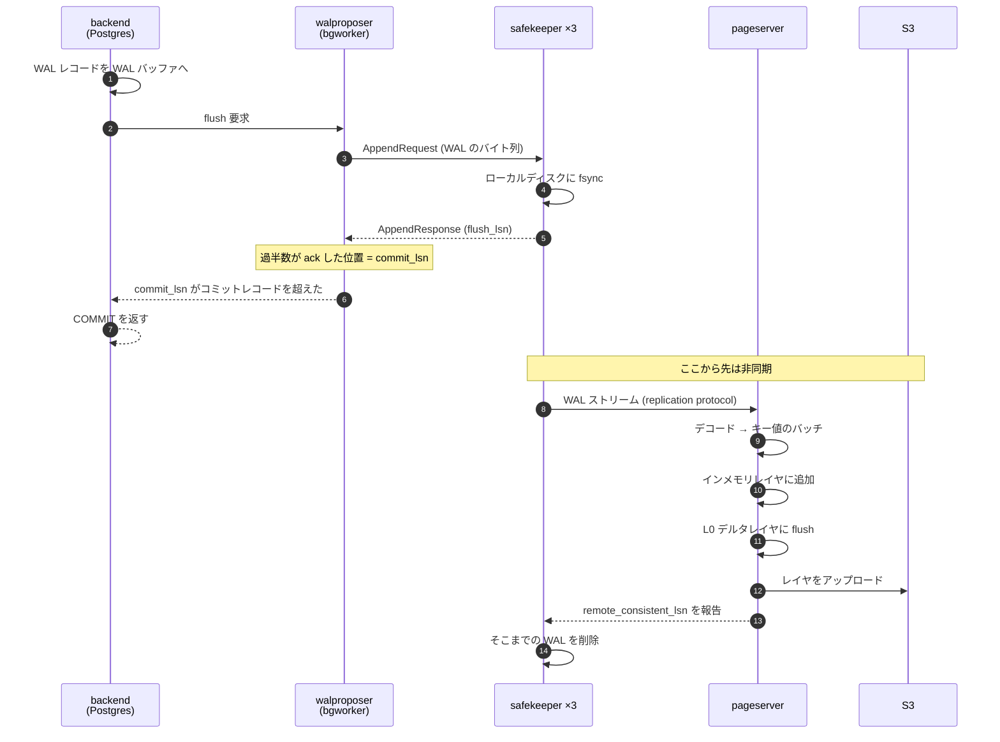

## 何を学んだか

`INSERT` して `COMMIT` するとき、Neon で起きることを段階に分けるとこうなる。



**同期の境界は 6 番と 7 番の間にある。** COMMIT が返るために必要なのは、safekeeper の過半数がディスクに書いたことだけだ。pageserver も S3 も関与しない。

## なぜ pageserver をコミットパスに入れないのか

入れれば話は単純になる。pageserver が「取り込んだ」と言うまで待てば、読み書きの整合は自明になる。

それをやらない理由は 2 つある。

**レイテンシ。** pageserver の取り込みは、WAL のデコード・キーへの振り分け・インメモリレイヤへの挿入を含む。safekeeper は受け取ったバイト列をそのまま fsync するだけだ。コミットのクリティカルパスに重い処理を置きたくない。

**可用性。** pageserver は冗長化されていない。shard ごとに 1 台だ (secondary は暖機用で、書き込みは受けない)。コミットパスに入れると、pageserver の再起動が書き込みの停止になる。safekeeper は 3 台で過半数なので、1 台落ちても書ける。

**壊れ方の違うものを、同期の境界で分けた**という設計になっている。safekeeper は「小さくて速くて冗長」、pageserver は「重くて単独」。

## safekeeper が保持する WAL は一時的

safekeeper はディスクに WAL セグメントを持つが、永久には持たない。pageserver が「S3 まで上げ終わった」と報告した位置 (`remote_consistent_lsn`) より前は削除できる。

つまり safekeeper のディスク使用量は、**pageserver がどれだけ遅れているかで決まる**。pageserver が止まると safekeeper のディスクが増え続ける。

だから背圧が要る。

## 背圧 — compute を減速させる

Postgres 本体にフックが追加されている。

```c
+       /* Call registered callback if any */
+       if (ProcessInterruptsCallback)
+       {
+               if (ProcessInterruptsCallback())
+                       goto retry;
+       }
```

`ProcessInterrupts()` は、Postgres がクエリ実行中に定期的に呼ぶ「割り込みチェック点」だ。ここに Neon のコールバックを刺している。

```c title="pgxn/neon/walproposer_pg.c"
	ProcessInterruptsCallback = backpressure_throttling_impl;
```

([pgxn/neon/walproposer_pg.c L217](https://github.com/neondatabase/neon/blob/fa504217c61bbcaf5c512d75830564541f917f8f/pgxn/neon/walproposer_pg.c#L217))

判定は 3 つの遅れを見る。

```c title="pgxn/neon/walproposer_pg.c"
		XLogRecPtr	myFlushLsn = GetFlushRecPtr(NULL);
		replication_feedback_get_lsns(&writePtr, &flushPtr, &applyPtr);
```

([pgxn/neon/walproposer_pg.c L491](https://github.com/neondatabase/neon/blob/fa504217c61bbcaf5c512d75830564541f917f8f/pgxn/neon/walproposer_pg.c#L491))

- `write` — pageserver が WAL を受信した位置
- `flush` — pageserver がディスクに書いた位置
- `apply` — pageserver が取り込みを完了した位置

自分の flush 位置がこれらから設定値 (MB) 以上離れていたら、その差分を返す。

対処は身も蓋もない。

```c title="pgxn/neon/walproposer_pg.c"
	elog(DEBUG2, "backpressure throttling: lag %lu", lag);
	start = GetCurrentTimestamp();
	pg_usleep(BACK_PRESSURE_DELAY);
	stop = GetCurrentTimestamp();
	pg_atomic_add_fetch_u64(&walprop_shared->backpressureThrottlingTime, stop - start);
```

([pgxn/neon/walproposer_pg.c L626](https://github.com/neondatabase/neon/blob/fa504217c61bbcaf5c512d75830564541f917f8f/pgxn/neon/walproposer_pg.c#L626))

**寝るだけ。** ただし 2 つ、実装として賢いところがある。

**1. 誰を止めるかを選んでいる。**

```c title="pgxn/neon/walproposer_pg.c"
	/*
	 * Don't throttle read only transactions or wal sender. Do throttle CREATE
	 * INDEX CONCURRENTLY, however. It performs some stages outside a
	 * transaction, even though it writes a lot of WAL. Check PROC_IN_SAFE_IC
	 * flag to cover that case.
	 */
	if (am_walsender
		|| (!(MyProc->statusFlags & PROC_IN_SAFE_IC)
			&& !TransactionIdIsValid(GetCurrentTransactionIdIfAny())))
		return retry;
```

読み取り専用トランザクションは止めない。WAL sender も止めない (止めたら遅れが余計に広がる)。しかし `CREATE INDEX CONCURRENTLY` は、トランザクション ID を持たない区間があるのに大量の WAL を出すので、フラグを見て特別に捕まえる。

**「書き込みの量に責任がある者だけを止める」**という原則を、Postgres の内部状態から判定している。

**2. 待ち時間を計測して公開している。** `backpressure_throttling_time()` という SQL 関数から見える。**減速していることが観測可能でないと、遅い原因が分からない。**

そして `return true` が `ProcessInterrupts` の `goto retry` を発火させる。1 回寝て終わりではなく、遅れが解消するまで繰り返し寝る。

## pageserver はどの safekeeper から引くか

pageserver は 3 台の safekeeper のどれか 1 台から WAL を引く。選び方は storage_broker 経由の情報で決まる。

```rust title="pageserver/src/tenant/timeline/walreceiver/connection_manager.rs"
    wal_stream_candidates: HashMap<NodeId, BrokerSkTimeline>,
```

各 safekeeper が自分の `commit_lsn` などを broker に publish し、pageserver がそれを subscribe して候補表を作る。切り替えの条件は 2 つある。

```rust title="pageserver/src/tenant/timeline/walreceiver/connection_manager.rs"
                            if new_sk_lsn_advantage >= self.conf.max_lsn_wal_lag.get() {
```

- 他の safekeeper が今の接続先より `max_lsn_wal_lag` 以上進んでいる
- 今の接続先から `lagging_wal_timeout` の間 新しい WAL が来ていない

**「今のがダメになったら切り替える」ではなく「もっと良いのがあれば切り替える」**という基準になっている。safekeeper の過半数が持っていれば commit なので、遅れている safekeeper に繋いでいると pageserver だけが遅れる。切り替えにヒステリシス (閾値) を入れて、ばたつきを防いでいる。

候補が 1 つもないときは、broker に discovery 要求を投げる。

```rust title="pageserver/src/tenant/timeline/walreceiver/connection_manager.rs"
                    info!("No active connection and no candidates, sending discovery request to the broker");
```

publish は「アクティブな timeline」に対してしか行われないので、しばらく使われていない timeline は候補表に出てこない。そのときだけ能動的に問い合わせる、という非対称な設計になっている。

## 取り込みから S3 まで

pageserver 側の流れは、後の群で個別に扱う。ここでは段階だけ挙げる。

1. **デコード** — WAL レコードをブロック参照ごとに切り、キーと値のバッチにする ([walingest](../walingest/))
2. **インメモリレイヤ** — キー順に並べ替えながらメモリに溜める。溢れたらローカルの一時ファイルへ
3. **L0 flush** — 一定量たまったらデルタレイヤファイルとして書き出す
4. **アップロード** — レイヤファイルを S3 へ。順序保証のあるキューを通す ([remote_timeline_client](../remote-timeline-client/))
5. **compaction** — L0 が溜まったら L1 に刻み直す ([compaction](../compaction/))

そして 4 が終わった位置を `remote_consistent_lsn` として safekeeper に報告する。これが safekeeper の WAL 削除の条件になり、輪が閉じる。

## この輪の中で唯一失われないもの

面白いのは、**この経路のどの段階でも、S3 に届くまでは「失われてよい」ことになっている**点だ。

- compute のメモリ → 消えてよい (WAL が safekeeper にある)
- safekeeper のディスク → 過半数が生きていれば消えてよい
- pageserver のローカルディスク → 消えてよい (S3 から再取得できる)
- S3 → **ここだけが失われてはいけない**

pageserver が丸ごと消えても、S3 からレイヤを取り直せば復元できる。safekeeper の WAL が消えても、S3 に上がった位置以降だけが問題になる。

**「本当に守るべき 1 か所」を S3 に集約し、それ以外は全部キャッシュとして扱う**というのが、この経路の設計方針になっている。

## この先に効いてくること

- **同期の境界は safekeeper の過半数まで。** pageserver も S3 もコミットパスの外。
- **背圧は「寝る」で実装されている。** ただし誰を寝かせるかの判定と、寝た時間の観測が付いている。
- **safekeeper の選択は「もっと良いのがあれば移る」。** 閾値でばたつきを止める。
- **S3 以外は全部キャッシュ。** 失われてよいものと、いけないものの線が明確。
