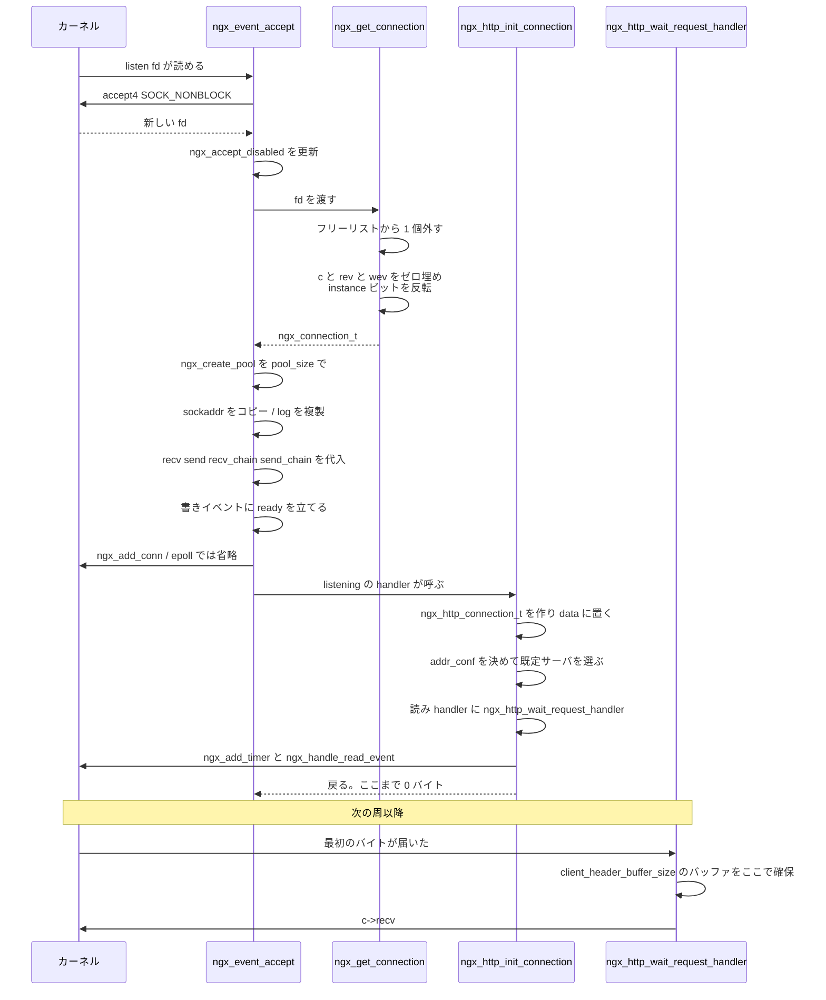

## この層の責務

[前のページ](../state-machine/) で、`accept` ビットが立ったイベントが `ngx_posted_accept_events` に積まれ、その handler が呼ばれるところまで来た。その handler が `ngx_event_accept()` だ。

この層の責務は、**カーネルが渡してくる `int` 1 個を、Nginx が扱える形に変換して、上位プロトコルに引き渡すこと**に尽きる。具体的には 4 つ。

1. `accept()` して fd を得る
2. その fd に紐づく `ngx_connection_t` を確保し、メモリプールを掘る
3. 読み書きのイベントを初期化してカーネルに登録する
4. `ls->handler(c)` を呼んで、HTTP なり stream なりに渡す

トランスポート層とプロトコル層の境界がここにある。`ngx_event_accept()` は HTTP を知らないし、`ngx_http_init_connection()` は `accept()` を知らない。両者をつないでいるのは、[前々ページ](../master-worker/) で見た `ngx_listening_t` の `handler` フィールド 1 本だけだ。

そしてこの層は、**1 バイトも読まない**。読むのは次の周からで、そこまで含めた遅延が設計に組み込まれている。

## 主要な型とその関係

### `ngx_connection_t`

[`src/core/ngx_connection.h#L127-L206`](https://github.com/nginx/nginx/blob/release-1.31.4/src/core/ngx_connection.h#L127-L206)。主要フィールドを役割で並べるとこうなる。

| フィールド                           | 型                                        | 意味                                                                 |
| ------------------------------------ | ----------------------------------------- | -------------------------------------------------------------------- |
| `data`                               | `void *`                                  | **この接続の上に載っているもの**。フリーリスト中は次の空きへのリンク |
| `read` / `write`                     | `ngx_event_t *`                           | 読み / 書きイベント。実体は `cycle->read_events[i]`                  |
| `fd`                                 | `ngx_socket_t`                            | ソケット。閉じたら `-1`                                              |
| `recv` / `send`                      | `ngx_recv_pt` / `ngx_send_pt`             | 単一バッファの読み書き                                               |
| `recv_chain` / `send_chain`          | `ngx_recv_chain_pt` / `ngx_send_chain_pt` | `ngx_chain_t` 単位の読み書き                                         |
| `listening`                          | `ngx_listening_t *`                       | どの listen から生まれたか                                           |
| `pool`                               | `ngx_pool_t *`                            | この接続の寿命に紐づくアリーナ                                       |
| `buffer`                             | `ngx_buf_t *`                             | 読み取りバッファ。**最初は NULL**                                    |
| `sockaddr` / `socklen` / `addr_text` |                                           | 相手のアドレス                                                       |
| `local_sockaddr` / `local_socklen`   |                                           | 自分側のアドレス                                                     |
| `ssl`                                | `ngx_ssl_connection_t *`                  | TLS の状態。平文なら NULL                                            |
| `log`                                | `ngx_log_t *`                             | この接続専用のログコンテキスト                                       |
| `queue`                              | `ngx_queue_t`                             | 再利用可能接続のキューへのリンク                                     |
| `number` / `start_time` / `requests` |                                           | 通し番号、開始時刻、処理したリクエスト数                             |

**`data` が `void *` で、「今この接続の上に何が載っているか」で中身が変わる。** これがこの構造体を理解する鍵になる。

- 空きスロットのとき → 次の空き `ngx_connection_t` へのポインタ (フリーリストのリンク)
- listen ソケットの `ngx_connection_t` のとき → 使わない
- `ngx_http_init_connection()` の直後 → `ngx_http_connection_t *`
- 最初のリクエストが始まってから → `ngx_http_request_t *`
- stream なら → `ngx_stream_session_t *`

型で守られていないので、読むときは「この接続は今どの段階か」を自分で追う必要がある。

`recv` / `send` が関数ポインタなのも同じ発想で、平文なら `ngx_recv`、TLS なら `ngx_ssl_recv` が入る。上位のコードは中身を知らずに `c->recv(c, buf, size)` と書く ([TLS 層のページ](../ssl-layer/))。

### `ngx_http_connection_t`

[`src/http/ngx_http_request.h#L321-L341`](https://github.com/nginx/nginx/blob/release-1.31.4/src/http/ngx_http_request.h#L321-L341)。

```c title="src/http/ngx_http_request.h"
typedef struct {
    ngx_http_addr_conf_t             *addr_conf;
    ngx_http_conf_ctx_t              *conf_ctx;

#if (NGX_HTTP_SSL || NGX_COMPAT)
    ngx_str_t                        *ssl_servername;
    /* ... ssl_servername_regex ... */
#endif

    ngx_chain_t                      *busy;
    ngx_int_t                         nbusy;
    ngx_chain_t                      *free;

    ngx_msec_t                        keepalive_timeout;

    unsigned                          ssl:1;
    unsigned                          proxy_protocol:1;
} ngx_http_connection_t;
```

**リクエストをまたいで生き残るものだけが入っている。** `addr_conf` (どの listen アドレスに来たか)、TLS の SNI で選ばれたサーバ名、keepalive のタイムアウト、そして `busy` / `free` のバッファチェーン。keepalive で 2 本目のリクエストが来ても、これは作り直されない。

### `ngx_http_addr_conf_t`

[`src/http/ngx_http_core_module.h#L238-L248`](https://github.com/nginx/nginx/blob/release-1.31.4/src/http/ngx_http_core_module.h#L238-L248)。

```c title="src/http/ngx_http_core_module.h"
struct ngx_http_addr_conf_s {
    /* the default server configuration for this address:port */
    ngx_http_core_srv_conf_t  *default_server;

    ngx_http_virtual_names_t  *virtual_names;

    unsigned                   ssl:1;
    unsigned                   http2:1;
    unsigned                   quic:1;
    unsigned                   proxy_protocol:1;
};
```

`ls->servers` が指す `ngx_http_port_t` の中に、この構造体がアドレスごとに並んでいる。**「このアドレス:ポートに来た接続を、Host ヘッダを読む前にどう扱うか」が全部ここにある。** TLS を張るか、HTTP/2 として扱うか、PROXY protocol を先に読むか。Host が読める前に決まっていなければならないので、リクエストではなくアドレスに紐づく。

### `worker_connections` とフリーリスト

`ngx_connection_t` は動的確保しない。ワーカー起動時に `worker_connections` 個ぶん一括で確保され、使うときはフリーリストから 1 個外し、閉じるときに返す。上限はこの個数で固定される。

## 処理の流れ



### 1. `accept()` するところ

[`src/event/ngx_event_accept.c#L20-L341`](https://github.com/nginx/nginx/blob/release-1.31.4/src/event/ngx_event_accept.c#L20-L341)。関数全体が `do { ... } while (ev->available)` の 1 本のループになっている。

```c title="src/event/ngx_event_accept.c"
    if (!(ngx_event_flags & NGX_USE_KQUEUE_EVENT)) {
        ev->available = ecf->multi_accept;
    }

    lc = ev->data;
    ls = lc->listening;
    ev->ready = 0;

    do {
        socklen = sizeof(ngx_sockaddr_t);

#if (NGX_HAVE_ACCEPT4)
        if (use_accept4) {
            s = accept4(lc->fd, &sa.sockaddr, &socklen, SOCK_NONBLOCK);
        } else {
            s = accept(lc->fd, &sa.sockaddr, &socklen);
        }
#else
        s = accept(lc->fd, &sa.sockaddr, &socklen);
#endif
```

`multi_accept` が 0 (既定) なら `ev->available` も 0 で、ループは 1 回で終わる。1 周につき 1 接続だけ受ける。1 なら `EAGAIN` が返るまで受け続ける。

`accept4()` は Linux 固有で、`SOCK_NONBLOCK` を渡すと `fcntl()` を 1 回省ける。使えるかどうかを静的変数で覚えている。

```c title="src/event/ngx_event_accept.c"
#if (NGX_HAVE_ACCEPT4)
    static ngx_uint_t  use_accept4 = 1;
#endif
```

コンパイル時に `accept4()` があっても、実行しているカーネルに無いことがある。`ENOSYS` が返ったらフラグを落として `continue` し、以降は `accept()` に切り替わる ([`#L89-L97`](https://github.com/nginx/nginx/blob/release-1.31.4/src/event/ngx_event_accept.c#L89-L97))。

```c title="src/event/ngx_event_accept.c"
            if (use_accept4 && err == NGX_ENOSYS) {
                use_accept4 = 0;
                ngx_inherited_nonblocking = 0;
                continue;
            }
```

離脱は `EAGAIN` で ([`#L74-L78`](https://github.com/nginx/nginx/blob/release-1.31.4/src/event/ngx_event_accept.c#L74-L78))。

```c title="src/event/ngx_event_accept.c"
            if (err == NGX_EAGAIN) {
                ngx_log_debug0(NGX_LOG_DEBUG_EVENT, ev->log, err,
                               "accept() not ready");
                return;
            }
```

**accept キューが空になったことは、`EAGAIN` でしか分からない。** 複数のワーカーが同じ listen fd を持っているとき、起こされたのに空振りする状況がここに出る ([accept の分配のページ](../accept-distribution/))。

`EMFILE` / `ENFILE` (fd を使い切った) の扱いが独特だ ([`#L112-L130`](https://github.com/nginx/nginx/blob/release-1.31.4/src/event/ngx_event_accept.c#L112-L130))。

```c title="src/event/ngx_event_accept.c"
            if (err == NGX_EMFILE || err == NGX_ENFILE) {
                if (ngx_disable_accept_events((ngx_cycle_t *) ngx_cycle, 1)
                    != NGX_OK)
                {
                    return;
                }

                if (ngx_use_accept_mutex) {
                    if (ngx_accept_mutex_held) {
                        ngx_shmtx_unlock(&ngx_accept_mutex);
                        ngx_accept_mutex_held = 0;
                    }
                    ngx_accept_disabled = 1;

                } else {
                    ngx_add_timer(ev, ecf->accept_mutex_delay);
                }
            }
```

listen イベントを epoll から外し、mutex を手放す。**fd が枯渇した状態で `accept()` を回し続けると、`EMFILE` を延々と返す CPU 100% のループになる。** accept mutex を使っていなければ、タイマで 500ms 後に再開する。

### 2. `ngx_accept_disabled` の更新

accept が成功した直後に、1 行で更新される ([`#L139-L140`](https://github.com/nginx/nginx/blob/release-1.31.4/src/event/ngx_event_accept.c#L139-L140))。

```c title="src/event/ngx_event_accept.c"
        ngx_accept_disabled = ngx_cycle->connection_n / 8
                              - ngx_cycle->free_connection_n;
```

**空き接続が全体の 1/8 を切ったら正の値になり、その値が「今後何周ぶん accept を見送るか」になる。** 空きが減るほど大きい値になるので、逼迫しているワーカーほど長く休む。前のページで見た `ngx_process_events_and_timers()` の入口が、この値を 1 ずつ減らしていく。

自己申告のロードバランシングで、追加の通信も統計もない。ワーカー間の負荷分散が、1 行の引き算で表現されている。

### 3. `ngx_get_connection()`

[`src/core/ngx_connection.c#L1206-L1269`](https://github.com/nginx/nginx/blob/release-1.31.4/src/core/ngx_connection.c#L1206-L1269)。

```c title="src/core/ngx_connection.c"
    ngx_drain_connections((ngx_cycle_t *) ngx_cycle);

    c = ngx_cycle->free_connections;

    if (c == NULL) {
        ngx_log_error(NGX_LOG_ALERT, log, 0,
                      "%ui worker_connections are not enough",
                      ngx_cycle->connection_n);

        return NULL;
    }

    ngx_cycle->free_connections = c->data;
    ngx_cycle->free_connection_n--;
    /* ... ngx_cycle->files[s] = c ... */

    rev = c->read;
    wev = c->write;

    ngx_memzero(c, sizeof(ngx_connection_t));

    c->read = rev;
    c->write = wev;
    c->fd = s;
    c->log = log;

    instance = rev->instance;

    ngx_memzero(rev, sizeof(ngx_event_t));
    ngx_memzero(wev, sizeof(ngx_event_t));

    rev->instance = !instance;
    wev->instance = !instance;

    rev->index = NGX_INVALID_INDEX;
    wev->index = NGX_INVALID_INDEX;

    rev->data = c;
    wev->data = c;

    wev->write = 1;

    return c;
```

**`ngx_memzero()` の前後で `read` / `write` を退避して書き戻している。** この 2 本のポインタは起動時に決まった対応関係で、接続を使い回しても変わらない。

`instance` の扱いが面白い。ゼロ埋めのあとで**前の値の反転**を書き戻している。この 1 ビットが、閉じたばかりの fd の古いイベントを検出するために使われる。`epoll_event.data.ptr` の下位 1 ビットに `instance` を詰めておき、`epoll_wait()` が返してきた値と現在の `instance` が食い違ったら stale と判定して捨てる ([`src/event/modules/ngx_epoll_module.c#L909-L919`](https://github.com/nginx/nginx/blob/release-1.31.4/src/event/modules/ngx_epoll_module.c#L909-L919))。

```c title="src/event/modules/ngx_epoll_module.c"
            if (c->fd == -1 || wev->instance != instance) {

                /*
                 * the stale event from a file descriptor
                 * that was just closed in this iteration
                 */

                ngx_log_debug1(NGX_LOG_DEBUG_EVENT, cycle->log, 0,
                               "epoll: stale event %p", c);
                continue;
            }
```

返し方は 11 行しかない ([`src/core/ngx_connection.c#L1272-L1282`](https://github.com/nginx/nginx/blob/release-1.31.4/src/core/ngx_connection.c#L1272-L1282))。

```c title="src/core/ngx_connection.c"
void
ngx_free_connection(ngx_connection_t *c)
{
    c->data = ngx_cycle->free_connections;
    ngx_cycle->free_connections = c;
    ngx_cycle->free_connection_n++;

    if (ngx_cycle->files && ngx_cycle->files[c->fd] == c) {
        ngx_cycle->files[c->fd] = NULL;
    }
}
```

**`data` をフリーリストのリンクに再利用している。** 使用中は「上に載っているもの」を指し、空きのときは「次の空き」を指す。追加のメモリを使わない単方向リストになっている。

`worker_connections` が上限として効くのはここだ。足りなくなったら `ngx_drain_connections()` が古い idle 接続を切って席を空ける ([`#L1404-L1458`](https://github.com/nginx/nginx/blob/release-1.31.4/src/core/ngx_connection.c#L1404-L1458))。

```c title="src/core/ngx_connection.c"
    if (cycle->free_connection_n > cycle->connection_n / 16
        || cycle->reusable_connections_n == 0)
    {
        return;
    }
    /* ... */
    n = ngx_max(ngx_min(32, cycle->reusable_connections_n / 8), 1);

    for (i = 0; i < n; i++) {
        if (ngx_queue_empty(&cycle->reusable_connections_queue)) { break; }

        q = ngx_queue_last(&cycle->reusable_connections_queue);
        c = ngx_queue_data(q, ngx_connection_t, queue);

        c->close = 1;
        c->read->handler(c->read);
    }
```

**切るときも `c->read->handler(c->read)` を呼んでいる。** `c->close = 1` を立ててから handler を呼ぶと、handler 側が入口の `if (c->close)` で終了処理に入る。「外から接続を殺す」ための専用経路を作らず、いつもの handler 呼び出しに `close` ビットを添えて済ませている。この仕組み全体は [接続の再利用のページ](../connection-reuse/) が扱う。

### 4. 接続を組み立てる

プールがここで掘られる ([`src/event/ngx_event_accept.c#L159-L175`](https://github.com/nginx/nginx/blob/release-1.31.4/src/event/ngx_event_accept.c#L159-L175))。

```c title="src/event/ngx_event_accept.c"
        c->pool = ngx_create_pool(ls->pool_size, ev->log);
        if (c->pool == NULL) { /* ... */ }

        if (socklen > (socklen_t) sizeof(ngx_sockaddr_t)) {
            socklen = sizeof(ngx_sockaddr_t);
        }

        c->sockaddr = ngx_palloc(c->pool, socklen);
        if (c->sockaddr == NULL) { /* ... */ }

        ngx_memcpy(c->sockaddr, &sa, socklen);
```

`ls->pool_size` は HTTP なら `connection_pool_size` ディレクティブの値。**この接続に紐づく確保は全部このプールから出て、接続を閉じるときにまとめて捨てられる。** `sockaddr` はスタック上の `sa` からプールにコピーされ、以降は接続と同じ寿命になる。個別の `free` を書かずに済む仕組みは [メモリプールのページ](../memory-pool/)。

I/O 関数の代入 ([`#L225-L236`](https://github.com/nginx/nginx/blob/release-1.31.4/src/event/ngx_event_accept.c#L225-L236))。

```c title="src/event/ngx_event_accept.c"
        c->recv = ngx_recv;
        c->send = ngx_send;
        c->recv_chain = ngx_recv_chain;
        c->send_chain = ngx_send_chain;

        c->log = log;
        c->pool->log = log;

        c->socklen = socklen;
        c->listening = ls;
        c->local_sockaddr = ls->sockaddr;
        c->local_socklen = ls->socklen;
```

**まず平文版を入れる。** TLS が要るなら、後で `ngx_http_init_connection()` から始まるハンドシェイクが `ngx_ssl_recv` などに差し替える。

`local_sockaddr` に `ls->sockaddr` をそのまま入れているのに注意したい。ワイルドカードで listen していると、これは `0.0.0.0` のままだ。実際に接続を受けたアドレスが要るときは `getsockname()` を呼び直す必要があり、そのぶんの判定が次の段に出てくる。

ノンブロッキング化は `ngx_inherited_nonblocking` を見て分岐し、`accept4(SOCK_NONBLOCK)` で済んでいれば `ngx_nonblocking()` を飛ばす ([`#L185-L204`](https://github.com/nginx/nginx/blob/release-1.31.4/src/event/ngx_event_accept.c#L185-L204))。1 接続あたりのシステムコールが 1 回減る。

イベントの初期化 ([`#L249-L263`](https://github.com/nginx/nginx/blob/release-1.31.4/src/event/ngx_event_accept.c#L249-L263))。

```c title="src/event/ngx_event_accept.c"
        rev = c->read;
        wev = c->write;

        wev->ready = 1;

        if (ngx_event_flags & NGX_USE_IOCP_EVENT) {
            rev->ready = 1;
        }

        if (ev->deferred_accept) {
            rev->ready = 1;
#if (NGX_HAVE_KQUEUE || NGX_HAVE_EPOLLRDHUP)
            rev->available = 1;
#endif
        }
```

**`wev->ready = 1` は無条件だ。** accept したばかりの TCP 接続は、送信バッファが空なので必ず書ける。1 回目の `send()` の前に `epoll_wait()` を待つ必要はない。

`ev->deferred_accept` が立っているときは `rev->ready` も立てる。`TCP_DEFER_ACCEPT` を設定してあると、カーネルは「データが届いた接続」しか返さないので、`accept()` が返った時点ですでに読める。**[前々ページ](../master-worker/) で `ngx_configure_listening_sockets()` が立てたビットが、ここで回収される。**

カーネルへの登録 ([`#L320-L325`](https://github.com/nginx/nginx/blob/release-1.31.4/src/event/ngx_event_accept.c#L320-L325))。

```c title="src/event/ngx_event_accept.c"
        if (ngx_add_conn && (ngx_event_flags & NGX_USE_EPOLL_EVENT) == 0) {
            if (ngx_add_conn(c) == NGX_ERROR) {
                ngx_close_accepted_connection(c);
                return;
            }
        }
```

**epoll のときは、ここで登録しない。** epoll は読みと書きを 1 回の `epoll_ctl()` でまとめて登録できるが、この時点では「読みたいのか書きたいのか」がまだ決まっていない。決まるのは上位プロトコルの入口で、そこから `ngx_handle_read_event()` を呼んだときに初めて `EPOLL_CTL_ADD` が走る。kqueue のように読みと書きを別々に登録するメソッドでは、先に `add_conn` しておくほうが得になる。この非対称の理由は [イベントメソッドのページ](../event-methods/)。

そして引き渡し ([`#L330`](https://github.com/nginx/nginx/blob/release-1.31.4/src/event/ngx_event_accept.c#L330))。

```c title="src/event/ngx_event_accept.c"
        ls->handler(c);
```

**この 1 行が、イベント層とプロトコル層の境界そのものだ。** `ngx_event_accept.c` の中に `ngx_http` で始まる識別子は 1 つも出てこない。

### 5. `ngx_http_init_connection()`

[`src/http/ngx_http_request.c#L209-L372`](https://github.com/nginx/nginx/blob/release-1.31.4/src/http/ngx_http_request.c#L209-L372)。まず `ngx_http_connection_t` を作って `c->data` に載せる。

```c title="src/http/ngx_http_request.c"
    hc = ngx_pcalloc(c->pool, sizeof(ngx_http_connection_t));
    if (hc == NULL) {
        ngx_http_close_connection(c);
        return;
    }

    c->data = hc;

    /* find the server configuration for the address:port */

    port = c->listening->servers;
```

`c->pool` から取っているので、接続が閉じるときに一緒に消える。

次が `addr_conf` の決定。ここが 70 行を占める ([`#L237-L305`](https://github.com/nginx/nginx/blob/release-1.31.4/src/http/ngx_http_request.c#L237-L305))。

```c title="src/http/ngx_http_request.c"
    if (port->naddrs > 1) {

        /*
         * there are several addresses on this port and one of them
         * is an "*:port" wildcard so getsockname() in ngx_http_server_addr()
         * is required to determine a server address
         */

        if (ngx_connection_local_sockaddr(c, NULL, 0) != NGX_OK) {
            ngx_http_close_connection(c);
            return;
        }

        switch (c->local_sockaddr->sa_family) {
        /* ... AF_INET6 も同じ形 ... */
        default: /* AF_INET */
            sin = (struct sockaddr_in *) c->local_sockaddr;
            addr = port->addrs;

            /* the last address is "*" */

            for (i = 0; i < port->naddrs - 1; i++) {
                if (addr[i].addr == sin->sin_addr.s_addr) {
                    break;
                }
            }

            hc->addr_conf = &addr[i].conf;
            break;
        }

    } else {
        /* ... port->addrs[0] を使うだけ ... */
    }

    /* the default server configuration for the address:port */
    hc->conf_ctx = hc->addr_conf->default_server->ctx;
```

**同じポートに複数のアドレスが設定されているときだけ `getsockname()` を呼ぶ。** `listen 80` を 1 行しか書いていなければ `naddrs == 1` で、システムコールは 0 回になる。

線形探索の終端が巧妙で、「最後のアドレスは `*`」という不変条件があるので、ループが `naddrs - 1` で止まって最後の要素に落ちれば、それがワイルドカードにマッチしたことになる。番兵で `if (見つからなかった)` を消している。

ここで決まるのは**既定サーバ**までだ。Host ヘッダを見て `server` を絞り込むのは、ヘッダを読み終わってからの仕事になる ([Host で server を選ぶページ](../virtual-server-location/))。

ログコンテキストを立てて、handler を置く ([`#L316-L329`](https://github.com/nginx/nginx/blob/release-1.31.4/src/http/ngx_http_request.c#L316-L329))。

```c title="src/http/ngx_http_request.c"
    c->log->connection = c->number;
    c->log->handler = ngx_http_log_error;
    c->log->data = ctx;
    c->log->action = "waiting for request";

    c->log_error = NGX_ERROR_INFO;

    rev = c->read;
    rev->handler = ngx_http_wait_request_handler;
    c->write->handler = ngx_http_empty_handler;
```

`c->log->action` に文字列を置いているのが効いていて、エラーが出たときのログに `while waiting for request` のような句が付く。**接続がどの段階で失敗したかが、追加のコードなしにログに乗る。** 段階が進むたびに `action` が差し替わる。

書きイベントの handler が `ngx_http_empty_handler` なのは、リクエストを読む段階では書き込みイベントに用がないからだ。[前のページ](../state-machine/) で見た「何もしない」を明示的な状態として持つ形になっている。

プロトコルの分岐 ([`#L331-L349`](https://github.com/nginx/nginx/blob/release-1.31.4/src/http/ngx_http_request.c#L331-L349))。

```c title="src/http/ngx_http_request.c"
#if (NGX_HTTP_V3)
    if (hc->addr_conf->quic) {
        ngx_http_v3_init_stream(c);
        return;
    }
#endif

#if (NGX_HTTP_SSL)
    if (hc->addr_conf->ssl) {
        hc->ssl = 1;
        c->log->action = "SSL handshaking";
        rev->handler = ngx_http_ssl_handshake;
    }
#endif

    if (hc->addr_conf->proxy_protocol) {
        hc->proxy_protocol = 1;
        c->log->action = "reading PROXY protocol";
    }
```

3 つの分岐の性質が違う。

- **QUIC** — その場で `return` する。以降はまったく別の経路になる ([QUIC のページ](../quic-transport/))
- **TLS** — handler を差し替えるだけ。ハンドシェイクが終わったら `ngx_http_wait_request_handler` 相当に戻ってくる
- **PROXY protocol** — フラグを立てるだけ。読み込みは `ngx_http_wait_request_handler` の中で処理される

HTTP/2 はここに出てこない。平文の HTTP/2 は、最初に読んだバイトがプリフェイスと一致するかで判定されるので、判定は 1 段先になる。

最後に、待つ準備 ([`#L351-L371`](https://github.com/nginx/nginx/blob/release-1.31.4/src/http/ngx_http_request.c#L351-L371))。

```c title="src/http/ngx_http_request.c"
    if (rev->ready) {
        /* the deferred accept(), iocp */

        if (ngx_use_accept_mutex) {
            ngx_post_event(rev, &ngx_posted_events);
            return;
        }

        rev->handler(rev);
        return;
    }

    cscf = ngx_http_get_module_srv_conf(hc->conf_ctx, ngx_http_core_module);

    ngx_add_timer(rev, cscf->client_header_timeout);
    ngx_reusable_connection(c, 1);

    if (ngx_handle_read_event(rev, 0) != NGX_OK) {
        ngx_http_close_connection(c);
        return;
    }
```

`rev->ready` が立っている (= `TCP_DEFER_ACCEPT` でデータ付きの接続が来た) ときは、`epoll_wait()` を待たずにその場で handler を呼ぶ。ただし accept mutex を握っている最中なら、**その場では呼ばずに `ngx_posted_events` に積む**。mutex の保持時間を伸ばさないためで、[前のページ](../state-machine/) で見た 2 段階処理と同じ意図がここにも現れている。

そうでなければ、`client_header_timeout` のタイマを張り、`ngx_reusable_connection(c, 1)` で「まだ何も始まっていないので、逼迫したら切ってよい」と登録し、読みイベントを epoll に入れて帰る。

**この関数は 1 バイトも読んでいない。** `c->buffer` は NULL のままだ。

### 6. 最初のバイトが来てから

`ngx_http_wait_request_handler()` ([`#L375-L534`](https://github.com/nginx/nginx/blob/release-1.31.4/src/http/ngx_http_request.c#L375-L534)) の先頭でバッファが確保される。

```c title="src/http/ngx_http_request.c"
    size = cscf->client_header_buffer_size;

    b = c->buffer;

    if (b == NULL) {
        b = ngx_create_temp_buf(c->pool, size);
        if (b == NULL) {
            ngx_http_close_connection(c);
            return;
        }

        c->buffer = b;

    } else if (b->start == NULL) {

        b->start = ngx_palloc(c->pool, size);
        /* ... */
    }

    size = b->end - b->last;

    n = c->recv(c, b->last, size);
```

**`client_header_buffer_size` (既定 1k) のメモリは、最初のバイトが届くまで確保されない。** そして届かないまま `NGX_AGAIN` になったら、返す ([`#L449-L459`](https://github.com/nginx/nginx/blob/release-1.31.4/src/http/ngx_http_request.c#L449-L459))。

```c title="src/http/ngx_http_request.c"
        if (b->pos == b->last) {

            /*
             * We are trying to not hold c->buffer's memory for an
             * idle connection.
             */

            if (ngx_pfree(c->pool, b->start) == NGX_OK) {
                b->start = NULL;
            }
        }
```

`b` は残したまま `b->start` だけ NULL にする。だから上の `else if (b->start == NULL)` の分岐がある。**接続 1 本あたりの常駐メモリを、`ngx_connection_t` とプールの初期ブロックだけに抑えている。**

これが効くのは keepalive で待っている接続だ。10 万本の idle 接続を抱えても、1k のバッファを 10 万個持たずに済む。

読めたら、リクエストの器を作って次の状態へ ([`#L522-L533`](https://github.com/nginx/nginx/blob/release-1.31.4/src/http/ngx_http_request.c#L522-L533))。

```c title="src/http/ngx_http_request.c"
    c->log->action = "reading client request line";

    ngx_reusable_connection(c, 0);

    c->data = ngx_http_create_request(c);
    if (c->data == NULL) {
        ngx_http_close_connection(c);
        return;
    }

    rev->handler = ngx_http_process_request_line;
    ngx_http_process_request_line(rev);
```

**`c->data` が `ngx_http_connection_t *` から `ngx_http_request_t *` に差し替わる。** `hc` のほうは `r->http_connection` から辿れるので失われない。同時に `ngx_reusable_connection(c, 0)` で再利用候補から外れる。リクエストが始まった接続は、逼迫時に切られる対象ではなくなる。

ここから先は [リクエストのパースのページ](../request-parse/) が引き取る。

## 守られている不変条件

**`ngx_connection_t` の総数は `worker_connections` を超えない。** 動的確保が無いので、メモリ使用量に上限がある。listen ソケットもチャネルもこの枠を使うので、実際に使える数は少し減る。`ngx_event_process_init()` は `connection_n < listening.nelts + 1` を起動時に検査する ([`src/event/ngx_event.c#L447-L458`](https://github.com/nginx/nginx/blob/release-1.31.4/src/event/ngx_event.c#L447-L458))。

**`c->read` と `c->write` の指す先は、接続を使い回しても変わらない。** `ngx_get_connection()` が `ngx_memzero()` の前後で退避・復元する。破れると `cycle->read_events[i]` との対応が崩れ、epoll に登録したポインタが別の接続を指すことになる。

**`instance` ビットは接続を取るたびに反転する。** これが stale event 検出の唯一の根拠になっている。

**この層で `errno` を握りつぶさない。** `EAGAIN` は正常終了、`ECONNABORTED` は `NGX_LOG_ERR`、`EMFILE` / `ENFILE` は `NGX_LOG_CRIT` と、ログレベルまで区別されている。fd 枯渇だけが listen イベントの一時停止という副作用を持つ。

**`ls->handler(c)` を呼ぶ時点で、接続は完全に組み上がっている。** `pool`、`sockaddr`、`log`、`recv` / `send`、`read` / `write` がすべて埋まっている。プロトコル層は「途中まで初期化された接続」を受け取らない。

## つまずきどころ

### `c->data` が指すものは段階で変わる

同じ `void *` が、フリーリストのリンク → `ngx_http_connection_t *` → `ngx_http_request_t *` と変わる。デバッガで `c->data` を見て型を決め打ちすると間違える。判別の手がかりは `c->read->handler` が何かで、`ngx_http_wait_request_handler` なら前者、`ngx_http_request_handler` なら後者になる。

HTTP/2 ではさらにややこしくなり、ストリームごとに偽の `ngx_connection_t` が作られる。その `c->data` は `ngx_http_request_t *` だが、`c->fd` は本物のソケットではない。

### `ngx_http_init_connection()` が終わっても、リクエストは 1 本も無い

「接続」と「リクエスト」を同一視すると読み違える。この時点で存在するのは `ngx_connection_t` と `ngx_http_connection_t` の 2 つで、`ngx_http_request_t` はまだ無い。keepalive で 3 本のリクエストを処理した接続は、`ngx_http_request_t` を 3 回作って 3 回捨てるが、`ngx_connection_t` と `ngx_http_connection_t` は 1 つのままだ。

`c->requests` がその回数を数えていて、`keepalive_requests` の上限判定に使われる。

### `local_sockaddr` は嘘をつくことがある

`ngx_event_accept()` は `c->local_sockaddr = ls->sockaddr` としか書かない。ワイルドカード listen なら `0.0.0.0:80` のままだ。実アドレスが要るときは `ngx_connection_local_sockaddr()` ([`src/core/ngx_connection.c#L1481-L1551`](https://github.com/nginx/nginx/blob/release-1.31.4/src/core/ngx_connection.c#L1481-L1551)) を通す必要があり、これが内部で `getsockname()` を呼んで結果をプールに書き戻す。`$server_addr` 変数がこの経路を使う。

### UDP は同じ入口を別経路で通る

`ngx_event_recvmsg()` ([`src/event/ngx_event_udp.c#L25-L348`](https://github.com/nginx/nginx/blob/release-1.31.4/src/event/ngx_event_udp.c#L25-L348)) が、UDP 用の対応物になる。`ngx_event_process_init()` が listen の型を見て handler を選ぶ ([`src/event/ngx_event.c#L894-L903`](https://github.com/nginx/nginx/blob/release-1.31.4/src/event/ngx_event.c#L894-L903))。

```c title="src/event/ngx_event.c"
        if (c->type == SOCK_STREAM) {
            rev->handler = ngx_event_accept;

#if (NGX_QUIC)
        } else if (ls[i].quic) {
            rev->handler = ngx_quic_recvmsg;
#endif
        } else {
            rev->handler = ngx_event_recvmsg;
        }
```

流れは驚くほど似ている。`ngx_get_connection()`、`ngx_create_pool(ls->pool_size)`、sockaddr のコピー、そして `ls->handler(c)`。違いは 3 点ある。

```c title="src/event/ngx_event_udp.c"
        c = ngx_get_connection(lc->fd, ev->log);
        if (c == NULL) {
            return;
        }

        c->shared = 1;
        c->type = SOCK_DGRAM;
        c->socklen = socklen;
```

**`ngx_get_connection()` に渡す fd が、listen ソケットの fd そのものだ。** UDP には accept が無いので、新しい fd は生まれない。だから `shared = 1` が立つ。

2 つ目は、`c->recv` が `ngx_udp_shared_recv` になること。1 本の fd を複数の `ngx_connection_t` が共有しているので、届いたデータグラムを送信元アドレスで振り分ける必要がある。

3 つ目は、2 パケット目以降の扱いだ。送信元アドレスをキーに赤黒木 (`ls->rbtree`) を引き、既存の接続が見つかったらそちらの `rev->handler` を直接呼ぶ ([`#L177-L193`](https://github.com/nginx/nginx/blob/release-1.31.4/src/event/ngx_event_udp.c#L177-L193))。

```c title="src/event/ngx_event_udp.c"
            rev = c->read;
            c->udp->buffer = &buf;

            rev->ready = 1;
            rev->active = 0;

            rev->handler(rev);

            if (c->udp) { c->udp->buffer = NULL; }

            rev->ready = 0;
            rev->active = 1;
```

**epoll を経由せずに、その場で `ready` を立てて handler を呼び、呼び終わったら戻している。** データグラムはこの呼び出しの間しか存在しないので、handler は同期的に読み切らなければならない。TCP の「あとでもう一度読みに来る」が使えない。

QUIC は `ngx_quic_recvmsg` という 3 本目の入口を持つ。UDP データグラムからストリームまでを自前で組み立てる話は [QUIC のページ](../quic-transport/)。

### `multi_accept` を有効にすると 1 周が伸びる

`multi_accept on` にすると `ev->available` が立ち、`EAGAIN` が返るまで `accept()` を繰り返す。1 周で受ける接続数が増えるぶん、accept mutex の保持時間と、既存接続の処理が待たされる時間が伸びる。既定が off なのはそのためで、この種のトレードオフは [1 周の長さのページ](../loop-latency/) に集めてある。

## 次に読むページ

- 受け取ったバイト列を `ngx_http_request_t` に落とすところは [リクエストのパース](../request-parse/)。
- 複数ワーカーが同じ listen fd を持つときの分配は [accept の分配のページ](../accept-distribution/)。
- `worker_connections` が足りなくなったときの立ち回りは [接続の再利用のページ](../connection-reuse/)。
- `c->pool` の確保と破棄は [メモリプールのページ](../memory-pool/)。
