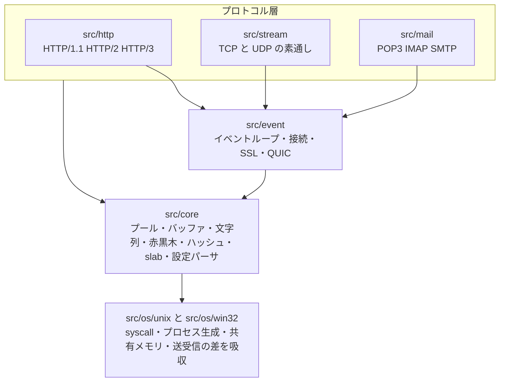
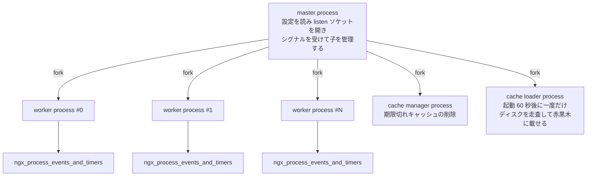

## この層の責務

このページは配線を説明しない。この章の残り全部への地図を作る。

Nginx のソースは大きくない。`release-1.31.4` の `src/` にある `.c` と `.h` は 404 個、251,898 行。Linux カーネルの 1 サブシステムぶんもない。それでも初見で読み始めると迷う。理由は 2 つある。

1 つは、**ディレクトリ名が層を表しているのに、その層の間に強制された境界がない**こと。`src/core/ngx_core.h` は `src/os/unix/` のヘッダも `src/event/` のヘッダも取り込む 1 枚の巨大なインクルードで、コンパイラは層をまたぐ参照を止めてくれない。層は規律であって型システムではない。

もう 1 つは、Nginx の実体のほとんどが「モジュール」という同じ形をした部品で、`ngx_module_t` という 1 つの構造体で HTTP のフィルタもイベントの実装も設定ブロックも表されていることだ。`ngx_http_gzip_filter_module` と `ngx_epoll_module` と `ngx_events_module` は、C の型としては区別がない。

だからこの章は、まず地図を先に置く。以降のページは「今どこを読んでいるか」をこのページに戻って確かめられるように書く。

## 主要な型とその関係

### ディレクトリと規模

`release-1.31.4` の `src/` を集計するとこうなる。行数は空行・コメントを含む生の行数。

| ディレクトリ | ファイル数 |    行数 | 何が入っているか                                                                                                           |
| ------------ | ---------: | ------: | -------------------------------------------------------------------------------------------------------------------------- |
| `src/core`   |         82 |  33,642 | プール、バッファ、文字列、赤黒木、ハッシュ、キュー、slab、設定パーサ、リゾルバ、cycle                                      |
| `src/event`  |         60 |  38,909 | イベントループ、接続確立、SSL、QUIC。うち `modules/` が 10 ファイル 5,087 行、`quic/` が 31 ファイル 16,899 行             |
| `src/http`   |        110 | 126,665 | HTTP のコア 26 ファイル 40,518 行、`modules/` 64 ファイル 70,541 行、`v2/` 7 ファイル 8,247 行、`v3/` 13 ファイル 7,359 行 |
| `src/stream` |         33 |  24,923 | TCP/UDP の汎用プロキシ                                                                                                     |
| `src/mail`   |         19 |  10,795 | POP3 / IMAP / SMTP のプロキシ                                                                                              |
| `src/os`     |         99 |  16,838 | `unix/` 65 ファイル 10,691 行、`win32/` 34 ファイル 6,147 行                                                               |
| `src/misc`   |          1 |     126 | Perl モジュールの補助                                                                                                      |
| 合計         |        404 | 251,898 |                                                                                                                            |

読み取れることが 2 つある。

**`src/http/modules/` の 70,541 行が単独で最大で、全体の 28% を占める。** Nginx の本体を読むというとき、その多くは実は個別のモジュールを読むことになる。逆に言えば、`src/core` の 33,642 行と `src/http` 直下の 40,518 行、合わせて 7 万行強がこの章の中心になる。

`src/event/quic/` が 16,899 行あって、`src/core` の半分に達している。HTTP/3 のためにトランスポート層をまるごと自前で持ったコストがそのまま数字に出ている ([QUIC のページ](../quic-transport/))。

### 層の依存



`src/os` が一番下にある。ただしこれは「core が os を呼ぶ」という一方向の関係ではなく、**プラットフォーム依存の名前を全部 `src/os/<platform>/` 側に押し込み、上の層は同じ名前を書けば済むようにする**という形だ。

入口は `src/core/ngx_config.h` にある ([`#L21-L44`](https://github.com/nginx/nginx/blob/release-1.31.4/src/core/ngx_config.h#L21-L44))。

```c title="src/core/ngx_config.h"
#if (NGX_FREEBSD)
#include <ngx_freebsd_config.h>

#elif (NGX_LINUX)
#include <ngx_linux_config.h>

#elif (NGX_SOLARIS)
#include <ngx_solaris_config.h>

#elif (NGX_DARWIN)
#include <ngx_darwin_config.h>

#elif (NGX_WIN32)
#include <ngx_win32_config.h>

#else /* POSIX */
#include <ngx_posix_config.h>

#endif
```

`ngx_linux_config.h` は `src/os/unix/` に、`ngx_win32_config.h` は `src/os/win32/` にある。ビルド時にどちらのディレクトリをインクルードパスに入れるかで、同じ `#include <ngx_files.h>` が別のファイルを指す。`#ifdef` をコードの中に散らすのではなく、**ディレクトリの選択でプラットフォームを切り替える**やり方になっている。

送受信の差も同じ形で吸収される ([`src/os/unix/ngx_os.h#L26-L35`](https://github.com/nginx/nginx/blob/release-1.31.4/src/os/unix/ngx_os.h#L26-L35))。

```c title="src/os/unix/ngx_os.h"
typedef struct {
    ngx_recv_pt        recv;
    ngx_recv_chain_pt  recv_chain;
    ngx_recv_pt        udp_recv;
    ngx_send_pt        send;
    ngx_send_pt        udp_send;
    ngx_send_chain_pt  udp_send_chain;
    ngx_send_chain_pt  send_chain;
    ngx_uint_t         flags;
} ngx_os_io_t;
```

Linux なら `send_chain` が `ngx_linux_sendfile_chain`、FreeBSD なら `ngx_freebsd_sendfile_chain`、Solaris なら `ngx_solaris_sendfilev_chain` になる。`sendfile()` と `sendfilev()` と `writev()` の違いが、この関数ポインタ 1 本の差になっている ([os-file-serving のページ](../os-file-serving/))。

### 前提群の語彙と、Nginx の型の対応

前提群で「Web サーバ一般の話」として説明した概念が、Nginx ではどの型になるか。この対応表を最初に押さえておくと、以降のページで型名が出てくるたびに立ち止まらずに済む。

| 前提群での語彙                    | Nginx の型・変数                                                  | 定義場所                                                                                                                                                                                                                                                                                                                         |
| --------------------------------- | ----------------------------------------------------------------- | -------------------------------------------------------------------------------------------------------------------------------------------------------------------------------------------------------------------------------------------------------------------------------------------------------------------------------- |
| 実行に必要な状態の全部            | `ngx_cycle_t`                                                     | [`ngx_cycle.h#L39-L86`](https://github.com/nginx/nginx/blob/release-1.31.4/src/core/ngx_cycle.h#L39-L86)                                                                                                                                                                                                                         |
| listen ソケット                   | `ngx_listening_t`                                                 | [`ngx_connection.h#L18-L95`](https://github.com/nginx/nginx/blob/release-1.31.4/src/core/ngx_connection.h#L18-L95)                                                                                                                                                                                                               |
| accept で得た 1 本の接続          | `ngx_connection_t`                                                | [`ngx_connection.h#L127-L206`](https://github.com/nginx/nginx/blob/release-1.31.4/src/core/ngx_connection.h#L127-L206)                                                                                                                                                                                                           |
| 「読める / 書ける」という通知     | `ngx_event_t`                                                     | [`ngx_event.h#L30-L161`](https://github.com/nginx/nginx/blob/release-1.31.4/src/event/ngx_event.h#L30-L161)                                                                                                                                                                                                                      |
| 多重化 API そのもの               | `ngx_event_actions_t`                                             | [`ngx_event.h#L166-L183`](https://github.com/nginx/nginx/blob/release-1.31.4/src/event/ngx_event.h#L166-L183)                                                                                                                                                                                                                    |
| `send` / `recv` / `sendfile` の差 | `ngx_os_io_t`                                                     | [`ngx_os.h#L26-L35`](https://github.com/nginx/nginx/blob/release-1.31.4/src/os/unix/ngx_os.h#L26-L35)                                                                                                                                                                                                                            |
| TLS 終端の状態                    | `ngx_ssl_connection_t`、`c->ssl`                                  | [`ngx_event_openssl.h#L117`](https://github.com/nginx/nginx/blob/release-1.31.4/src/event/ngx_event_openssl.h#L117)                                                                                                                                                                                                              |
| HTTP リクエスト 1 本              | `ngx_http_request_t`                                              | [`ngx_http_request.h#L385`](https://github.com/nginx/nginx/blob/release-1.31.4/src/http/ngx_http_request.h#L385)                                                                                                                                                                                                                 |
| バイト列の一区画                  | `ngx_buf_t`                                                       | [`ngx_buf.h#L20-L56`](https://github.com/nginx/nginx/blob/release-1.31.4/src/core/ngx_buf.h#L20-L56)                                                                                                                                                                                                                             |
| 区画をつないだもの                | `ngx_chain_t`                                                     | [`ngx_buf.h#L59-L62`](https://github.com/nginx/nginx/blob/release-1.31.4/src/core/ngx_buf.h#L59-L62)                                                                                                                                                                                                                             |
| 上流への 1 往復                   | `ngx_http_upstream_t`                                             | [`ngx_http_upstream.h#L342`](https://github.com/nginx/nginx/blob/release-1.31.4/src/http/ngx_http_upstream.h#L342)                                                                                                                                                                                                               |
| `upstream {}` の定義              | `ngx_http_upstream_srv_conf_t`                                    | [`ngx_http_upstream.h#L135`](https://github.com/nginx/nginx/blob/release-1.31.4/src/http/ngx_http_upstream.h#L135)                                                                                                                                                                                                               |
| 設定の 3 階層                     | `ngx_http_core_main_conf_t` / `..._srv_conf_t` / `..._loc_conf_t` | [`#L155-L179`](https://github.com/nginx/nginx/blob/release-1.31.4/src/http/ngx_http_core_module.h#L155-L179) / [`#L182-L215`](https://github.com/nginx/nginx/blob/release-1.31.4/src/http/ngx_http_core_module.h#L182-L215) / [`#L312`](https://github.com/nginx/nginx/blob/release-1.31.4/src/http/ngx_http_core_module.h#L312) |
| 仮想サーバ                        | `ngx_http_core_srv_conf_t`                                        | 同上                                                                                                                                                                                                                                                                                                                             |
| リクエスト処理の拡張点            | `ngx_http_phase_engine_t`、`phases[]`                             | [`#L144-L147`](https://github.com/nginx/nginx/blob/release-1.31.4/src/http/ngx_http_core_module.h#L144-L147)、[`#L178`](https://github.com/nginx/nginx/blob/release-1.31.4/src/http/ngx_http_core_module.h#L178)                                                                                                                 |
| 設定に書く `$変数`                | `ngx_http_variable_t`                                             | [`ngx_http_variables.h#L37`](https://github.com/nginx/nginx/blob/release-1.31.4/src/http/ngx_http_variables.h#L37)                                                                                                                                                                                                               |

`ngx_connection_t` の冒頭を見ると、この対応の中心が分かる ([`#L127-L146`](https://github.com/nginx/nginx/blob/release-1.31.4/src/core/ngx_connection.h#L127-L146))。

```c title="src/core/ngx_connection.h"
struct ngx_connection_s {
    void               *data;
    ngx_event_t        *read;
    ngx_event_t        *write;

    ngx_socket_t        fd;

    ngx_recv_pt         recv;
    ngx_send_pt         send;
    ngx_recv_chain_pt   recv_chain;
    ngx_send_chain_pt   send_chain;

    ngx_listening_t    *listening;

    off_t               sent;

    ngx_log_t          *log;

    ngx_pool_t         *pool;
```

fd と、読み書き 2 つのイベントと、入出力の関数ポインタ 4 本と、由来の listen ソケットと、この接続の寿命で捨てるプール。前提群で「接続とは何か」として並べた要素が、そのまま先頭 20 行に並んでいる。

`data` が `void *` なのがこの型の要になっている。HTTP なら `ngx_http_connection_t`、stream なら `ngx_stream_session_t`、mail なら `ngx_mail_session_t` が入る。**`ngx_connection_t` は上のプロトコルを一切知らない。** 知っているのは「誰かが何かを紐づけている」ことだけだ。

`recv` / `send` が構造体のフィールドであってグローバル関数でないのは、TLS のためだ。TLS 接続では、ハンドシェイクが終わった時点でこの 4 本が `ngx_ssl_recv` / `ngx_ssl_write` などに差し替わる。層の間に割り込む形については [TLS 層のページ](../ssl-layer/) で扱う。

### モジュールの 6 種別

Nginx のモジュールは `ngx_module_t` 1 つの型で表され、`type` フィールドの値で種類を区別する。値は 4 文字の ASCII をリトルエンディアンで詰めた整数になっている。

| 定数                | 値           | 由来     | 定義場所                                                                                                     | 役割                                                                               |
| ------------------- | ------------ | -------- | ------------------------------------------------------------------------------------------------------------ | ---------------------------------------------------------------------------------- |
| `NGX_CORE_MODULE`   | `0x45524F43` | `"CORE"` | [`ngx_conf_file.h#L70`](https://github.com/nginx/nginx/blob/release-1.31.4/src/core/ngx_conf_file.h#L70)     | 最上位の設定を持つ。`ngx_core_module`、`ngx_events_module`、`ngx_http_module` など |
| `NGX_CONF_MODULE`   | `0x464E4F43` | `"CONF"` | [`ngx_conf_file.h#L71`](https://github.com/nginx/nginx/blob/release-1.31.4/src/core/ngx_conf_file.h#L71)     | `include` ディレクティブだけを持つ `ngx_conf_module`                               |
| `NGX_EVENT_MODULE`  | `0x544E5645` | `"EVNT"` | [`ngx_event.h#L425`](https://github.com/nginx/nginx/blob/release-1.31.4/src/event/ngx_event.h#L425)          | `events {}` の中身。epoll / kqueue / select などの実装                             |
| `NGX_HTTP_MODULE`   | `0x50545448` | `"HTTP"` | [`ngx_http_config.h#L39`](https://github.com/nginx/nginx/blob/release-1.31.4/src/http/ngx_http_config.h#L39) | `http {}` の中身。ハンドラ、フィルタ、負荷分散、変数                               |
| `NGX_MAIL_MODULE`   | `0x4C49414D` | `"MAIL"` | [`ngx_mail.h#L355`](https://github.com/nginx/nginx/blob/release-1.31.4/src/mail/ngx_mail.h#L355)             | `mail {}` の中身                                                                   |
| `NGX_STREAM_MODULE` | `0x4d525453` | `"STRM"` | [`ngx_stream.h#L315`](https://github.com/nginx/nginx/blob/release-1.31.4/src/stream/ngx_stream.h#L315)       | `stream {}` の中身                                                                 |

`src/` の中に `ngx_module_t` の実体は 122 個ある。種別ごとの内訳は HTTP 70、STREAM 22、CORE 13、EVENT 8、MAIL 8、CONF 1。ビルドスクリプト側では、`auto/modules` に `ngx_module_name=` の行が 106 本並んでいて、`./configure` のオプションに応じてどれを `objs/ngx_modules.c` に書き出すかが決まる。

オプション無しの `./configure` で実際に入るのは 54 個だった。

```c title="objs/ngx_modules.c (macOS でのデフォルトビルド、抜粋)"
ngx_module_t *ngx_modules[] = {
    &ngx_core_module,
    &ngx_errlog_module,
    &ngx_conf_module,
    &ngx_regex_module,
    &ngx_events_module,
    &ngx_event_core_module,
    &ngx_kqueue_module,
    &ngx_http_module,
    &ngx_http_core_module,
    /* ... 45 個省略 ... */
    &ngx_http_not_modified_filter_module,
    NULL
};
```

7 番目が `ngx_kqueue_module` になっているのは macOS で `./configure` したからで、Linux ならここが `ngx_epoll_module` に替わる。**入れ替わるのは 1 個だけ**で、個数は変わらない。

54 個の内訳は `NGX_HTTP_MODULE` が 46、`NGX_CORE_MODULE` が 5、`NGX_EVENT_MODULE` が 2、`NGX_CONF_MODULE` が 1。`NGX_MAIL_MODULE` と `NGX_STREAM_MODULE` は 0 で、`mail {}` も `stream {}` もデフォルトでは使えない。`--with-mail` / `--with-stream` を付けて初めてリンクされる。

`NGX_EVENT_MODULE` が 2 個しかないのは、`ngx_event_core_module` と、そのプラットフォームで選ばれた 1 つの実装 (Linux なら `ngx_epoll_module`、macOS なら `ngx_kqueue_module`) だけが入るからだ。8 個ある実装のうち 7 個はビルドされない。

`NGX_CORE_MODULE` の 5 個は `ngx_core_module`、`ngx_errlog_module`、`ngx_regex_module`、`ngx_events_module`、`ngx_http_module`。ここに **`ngx_events_module` と `ngx_http_module` が居る**のが Nginx の構造を決めている。`events {}` と `http {}` という設定ブロックそのものが、CORE モジュールとして最上位に登録されている。層はモジュールの上に建っているのではなく、層自体が 1 個のモジュールとして刺さっている。

この形の詳細は [モジュールシステムのページ](../module-system/) で扱う。

### 設定は 4 重ポインタで持たれる

`ngx_cycle_t` の 1 番目のフィールドが、この章で一番驚く型をしている ([`ngx_cycle.h#L40`](https://github.com/nginx/nginx/blob/release-1.31.4/src/core/ngx_cycle.h#L40))。

```c title="src/core/ngx_cycle.h"
struct ngx_cycle_s {
    void                  ****conf_ctx;
```

読み方はこうだ。

1. `conf_ctx` は CORE モジュールの index で引く配列 — `conf_ctx[ngx_http_module.index]`
2. その要素が `ngx_http_module` の場合、実体は `ngx_http_conf_ctx_t *` — `main_conf` / `srv_conf` / `loc_conf` の 3 本を持つ
3. `main_conf` はさらに HTTP モジュールの `ctx_index` で引く配列
4. その要素が、モジュールが `create_main_conf` で作った構造体

段が 4 つあるから `void ****` になる。引くためのマクロが用意されている ([`ngx_conf_file.h#L176`](https://github.com/nginx/nginx/blob/release-1.31.4/src/core/ngx_conf_file.h#L176)、[`ngx_http_config.h#L55-L58`](https://github.com/nginx/nginx/blob/release-1.31.4/src/http/ngx_http_config.h#L55-L58))。

```c title="src/core/ngx_conf_file.h"
#define ngx_get_conf(conf_ctx, module)  conf_ctx[module.index]
```

```c title="src/http/ngx_http_config.h"
#define ngx_http_get_module_main_conf(r, module)                             \
    (r)->main_conf[module.ctx_index]
#define ngx_http_get_module_srv_conf(r, module)  (r)->srv_conf[module.ctx_index]
#define ngx_http_get_module_loc_conf(r, module)  (r)->loc_conf[module.ctx_index]
```

`ngx_http_request_t` が `main_conf` / `srv_conf` / `loc_conf` の 3 本を直接持っている ([`ngx_http_request.h#L391-L393`](https://github.com/nginx/nginx/blob/release-1.31.4/src/http/ngx_http_request.h#L391-L393)) ので、リクエスト処理中は `r` から 1 回の添字で自分の設定に届く。**4 重の入れ子を辿るのは設定を組み立てるときだけで、実行時には配列 1 本の添字アクセスになっている。**

`index` と `ctx_index` の 2 種類の添字があるのがポイントで、`index` は全モジュール通しの番号、`ctx_index` は同じ種別の中での番号。前者は `ngx_preinit_modules` が、後者は `ngx_count_modules` が振る ([module-system のページ](../module-system/))。

3 階層の設定がどうマージされるかは [conf-merge のページ](../conf-merge/) の主題になる。

## 処理の流れ

### 設定ファイルの入れ子とコードの構造の対応

`nginx.conf` のブロック構造は、そのままモジュール種別と設定構造体の階層に写る。設定ファイルを読むことと、コードの構造を読むことが同じ作業になっている。

| 設定上の位置                       | 扱うモジュールの種別      | 対応する構造体                 |
| ---------------------------------- | ------------------------- | ------------------------------ |
| 最上位 (`worker_processes` など)   | `NGX_CORE_MODULE`         | `ngx_core_conf_t`              |
| `events { }`                       | `NGX_EVENT_MODULE`        | `ngx_event_conf_t`             |
| `http { }`                         | `NGX_HTTP_MODULE` の main | `ngx_http_core_main_conf_t`    |
| `http { server { } }`              | `NGX_HTTP_MODULE` の srv  | `ngx_http_core_srv_conf_t`     |
| `http { server { location { } } }` | `NGX_HTTP_MODULE` の loc  | `ngx_http_core_loc_conf_t`     |
| `http { upstream { } }`            | `NGX_HTTP_MODULE` の srv  | `ngx_http_upstream_srv_conf_t` |
| `stream { }`                       | `NGX_STREAM_MODULE`       | `ngx_stream_core_main_conf_t`  |
| `mail { }`                         | `NGX_MAIL_MODULE`         | `ngx_mail_core_main_conf_t`    |

ブロックの入れ子は、パーサの再帰と 1 対 1 に対応している。`http {}` を見つけたコマンドハンドラが、`NGX_HTTP_MODULE` を対象種別に切り替えてパーサを再帰的に呼び直す。だから **ブロックの種類を増やすことと、モジュール種別を増やすことが同じ操作になる** ([conf-parse のページ](../conf-parse/))。

`upstream {}` が「srv」の段にいるのは、ディレクティブの登録位置が `NGX_HTTP_MAIN_CONF` であるにもかかわらず、ハンドラが自前の `srv_conf` 配列を作って `main_conf` だけ `http {}` から借りるからだ ([`ngx_http_upstream.c#L6390-L6402`](https://github.com/nginx/nginx/blob/release-1.31.4/src/http/ngx_http_upstream.c#L6390-L6402))。

```c title="src/http/ngx_http_upstream.c"
    http_ctx = cf->ctx;
    ctx->main_conf = http_ctx->main_conf;

    /* the upstream{}'s srv_conf */

    ctx->srv_conf = ngx_pcalloc(cf->pool, sizeof(void *) * ngx_http_max_module);
```

**設定ファイル上の見た目ではなく、ハンドラが `ngx_http_conf_ctx_t` の 3 本をどう組み替えるかが階層を決めている。** ブロックの意味論はパーサではなく、そのブロックのコマンドハンドラの中にある。

### プロセス構成



master は接続を 1 本も処理しない。やるのは設定を読むこと、listen ソケットを開くこと、子を fork すること、シグナルを受けて子に伝えること、死んだ子を再生成することだけだ ([`ngx_master_process_cycle`](https://github.com/nginx/nginx/blob/release-1.31.4/src/os/unix/ngx_process_cycle.c#L74))。

worker は `ngx_worker_process_cycle` ([`#L699`](https://github.com/nginx/nginx/blob/release-1.31.4/src/os/unix/ngx_process_cycle.c#L699)) の中で `ngx_process_events_and_timers` ([`src/event/ngx_event.c#L195`](https://github.com/nginx/nginx/blob/release-1.31.4/src/event/ngx_event.c#L195)) を回し続ける。1 プロセス 1 スレッドで、数万接続をこの 1 本のループが捌く。

cache manager と cache loader は、`proxy_cache_path` のようなディレクティブでキャッシュ領域が宣言されているときだけ生まれる ([`#L353-L392`](https://github.com/nginx/nginx/blob/release-1.31.4/src/os/unix/ngx_process_cycle.c#L353-L392))。

```c title="src/os/unix/ngx_process_cycle.c"
static ngx_cache_manager_ctx_t  ngx_cache_manager_ctx = {
    ngx_cache_manager_process_handler, "cache manager process", 0
};

static ngx_cache_manager_ctx_t  ngx_cache_loader_ctx = {
    ngx_cache_loader_process_handler, "cache loader process", 60000
};
```

3 番目のフィールドが初回の遅延ミリ秒。loader は 60 秒待ってから 1 回だけ動く。**同じ `ngx_cache_manager_process_cycle` を、handler と遅延だけ変えて 2 通りに使っている**。プロセスの種類を増やしているのではなく、1 種類のプロセスに 2 つの設定を渡している。

そして loader は `NGX_PROCESS_NORESPAWN` で spawn される。死んでも master は作り直さない。1 回走ればいい仕事だからだ。プロセス管理の詳細は [master/worker のページ](../master-worker/) で扱う。

### リクエストが通る経路

1 本の HTTP リクエストが最初から最後まで通る段と、それを扱うページの対応。

| 段                          | 主な関数                           | 場所                                                                                                                                   | 扱うページ                                             |
| --------------------------- | ---------------------------------- | -------------------------------------------------------------------------------------------------------------------------------------- | ------------------------------------------------------ |
| listen ソケットを開く       | `ngx_open_listening_sockets`       | [`ngx_connection.c#L426`](https://github.com/nginx/nginx/blob/release-1.31.4/src/core/ngx_connection.c#L426)                           | [master-worker](../master-worker/)                     |
| worker がループに入る       | `ngx_process_events_and_timers`    | [`ngx_event.c#L195`](https://github.com/nginx/nginx/blob/release-1.31.4/src/event/ngx_event.c#L195)                                    | [state-machine](../state-machine/)                     |
| `accept()` して接続を作る   | `ngx_event_accept`                 | [`ngx_event_accept.c#L21`](https://github.com/nginx/nginx/blob/release-1.31.4/src/event/ngx_event_accept.c#L21)                        | [accept-to-connection](../accept-to-connection/)       |
| 接続を HTTP に渡す          | `ngx_http_init_connection`         | [`ngx_http_request.c#L210`](https://github.com/nginx/nginx/blob/release-1.31.4/src/http/ngx_http_request.c#L210)                       | [accept-to-connection](../accept-to-connection/)       |
| リクエスト行を刻む          | `ngx_http_process_request_line`    | [`ngx_http_request.c#L1114`](https://github.com/nginx/nginx/blob/release-1.31.4/src/http/ngx_http_request.c#L1114)                     | [request-parse](../request-parse/)                     |
| ヘッダを刻む                | `ngx_http_process_request_headers` | [`ngx_http_request.c#L1400`](https://github.com/nginx/nginx/blob/release-1.31.4/src/http/ngx_http_request.c#L1400)                     | [request-parse](../request-parse/)                     |
| server と location を決める | `ngx_http_core_find_config_phase`  | [`ngx_http_core_module.c#L973`](https://github.com/nginx/nginx/blob/release-1.31.4/src/http/ngx_http_core_module.c#L973)               | [virtual-server-location](../virtual-server-location/) |
| フェーズを回す              | `ngx_http_core_run_phases`         | [`ngx_http_core_module.c#L887`](https://github.com/nginx/nginx/blob/release-1.31.4/src/http/ngx_http_core_module.c#L887)               | [phase-engine](../phase-engine/)                       |
| 応答を作る                  | `ngx_http_core_content_phase`      | [`ngx_http_core_module.c#L1295`](https://github.com/nginx/nginx/blob/release-1.31.4/src/http/ngx_http_core_module.c#L1295)             | [content-handler](../content-handler/)                 |
| ヘッダを下流へ              | `ngx_http_send_header`             | [`ngx_http_core_module.c#L1875`](https://github.com/nginx/nginx/blob/release-1.31.4/src/http/ngx_http_core_module.c#L1875)             | [content-handler](../content-handler/)                 |
| ボディをフィルタ列に流す    | `ngx_http_output_filter`           | [`ngx_http_core_module.c#L1928`](https://github.com/nginx/nginx/blob/release-1.31.4/src/http/ngx_http_core_module.c#L1928)             | [output-filter-chain](../output-filter-chain/)         |
| ソケットに書く              | `ngx_http_write_filter`            | [`ngx_http_write_filter_module.c#L48`](https://github.com/nginx/nginx/blob/release-1.31.4/src/http/ngx_http_write_filter_module.c#L48) | [output-filter-chain](../output-filter-chain/)         |
| 終わらせる                  | `ngx_http_finalize_request`        | [`ngx_http_request.c#L2683`](https://github.com/nginx/nginx/blob/release-1.31.4/src/http/ngx_http_request.c#L2683)                     | [finalize-request](../finalize-request/)               |

listen ソケットと HTTP をつなぐ 1 行が `src/http/ngx_http.c` にある ([`#L1824`](https://github.com/nginx/nginx/blob/release-1.31.4/src/http/ngx_http.c#L1824))。

```c title="src/http/ngx_http.c"
    ls->handler = ngx_http_init_connection;
```

`ngx_listening_t` のフィールド `handler` に、HTTP の入口関数を代入している。**`src/event/` は「accept したら `ls->handler` を呼ぶ」としか書いていない。** どのプロトコルが乗るかを決めるのはこの 1 行で、`stream` なら `ngx_stream_init_connection`、`mail` なら `ngx_mail_init_connection` が入る。

上流に投げる経路はこの表に載せていない。コンテンツハンドラが `ngx_http_proxy_module` などだった場合、そこから [upstream のページ](../upstream/) の世界に入る。

## 守られている不変条件

**1 つの接続は、常にちょうど 1 つの worker が持つ。** `ngx_connection_t` はプロセス間で共有されない。`cycle->connections` は worker ごとに `ngx_alloc` で確保された普通のヒープ上の配列で、fork の後にそれぞれが自分のぶんを持つ。だから接続の状態にロックが要らない。プロセスをまたいで共有されるのは、明示的に `ngx_shared_memory_add` で宣言された領域だけになる ([slab のページ](../slab-shared-memory/))。

**listen ソケットは master が開き、worker は継承するだけ。** これが「設定を書き換えて `reload` してもポートが一瞬も空かない」の根拠になる。`ngx_init_cycle()` の中で新しい listen ソケットを開き、古い cycle と同じアドレスのものは fd をそのまま引き継ぐ ([boot-cycle のページ](../boot-cycle/))。

**モジュール配列の順序が、実行時の順序になる。** `ngx_modules[]` の並び順がそのまま `cycle->modules[]` にコピーされ、フィルタの連鎖もフェーズへの登録順もこの配列を前から (あるいは後ろから) 舐めて決まる。`auto/modules` がモジュールを追加する順番が、そのまま「gzip は chunked より内側」といった意味論になっている。

**プロトコル層は互いを知らない。** `src/http`、`src/stream`、`src/mail` の間に相互参照はない。3 つとも `src/event` と `src/core` にだけ依存する。`stream` が `http` の劣化版のように見えるのは、実際に同じ設計を写して作られているからで、コードを共有しているからではない ([stream モジュールのページ](../stream-module/))。

**外部ライブラリは 3 つに絞られている。** デフォルトの `./configure` が生成する `objs/Makefile` のリンク行は `-lpcre2-8 -lz` だけで、OpenSSL は SSL を有効にしたときに加わる。それ以外の依存 (libxslt、libgd、GeoIP、Perl、google-perftools) は、対応するモジュールを明示的に有効にしたときにしか入らない。

つまり、動的配列も連結リストもハッシュも赤黒木も文字列処理もメモリ確保もイベントループも DNS クライアントも、Nginx は自前で持っている。`src/core` の 33,642 行の大半はこれだ。標準 C ライブラリすら最小限しか使わず、`ngx_cpymem` / `ngx_memzero` のようなマクロで包んでいる。

## つまずきどころ

### モジュールの個数は数え方で 3 通りある

「Nginx には何個モジュールがあるか」に、この章では 3 つの数字が出てくる。

- **122** — `src/` の中にある `ngx_module_t` の実体の数。win32 専用のもの (`ngx_iocp_module` など) や、他のプラットフォームでは使われない event モジュールも全部含む
- **106** — `auto/modules` にある `ngx_module_name=` の行の数。ビルド候補として `./configure` が知っているもの
- **54** — オプション無しの `./configure` で `objs/ngx_modules.c` に書き出された数

この 3 つはどれも正しい。混乱するのは、Nginx の「モジュール」がプラグイン機構であると同時に、コードを分割する単位でもあるからだ。`ngx_core_module` はプラグインではない。設定ファイルの最上位を扱うためにモジュールの形を借りているだけで、外せない。

デフォルトビルドで動的にロードできるモジュール (`--with-compat` で作る `.so`) は、この 54 個とは別枠になる。`ngx_max_module` が静的モジュール数 + `NGX_MAX_DYNAMIC_MODULES` になっているのはそのためだ ([`ngx_module.c#L36`](https://github.com/nginx/nginx/blob/release-1.31.4/src/core/ngx_module.c#L36))。

### 層の境界はヘッダで守られていない

`src/core/ngx_core.h` が何を取り込んでいるかを見ると、層の話が規律でしかないことが分かる ([`#L48-L103`](https://github.com/nginx/nginx/blob/release-1.31.4/src/core/ngx_core.h#L48-L103))。

```c title="src/core/ngx_core.h"
#include <ngx_errno.h>
#include <ngx_atomic.h>
/* ... */
#include <ngx_cycle.h>
#include <ngx_resolver.h>
#if (NGX_OPENSSL)
#include <ngx_event_openssl.h>
#endif
#if (NGX_QUIC)
#include <ngx_event_quic.h>
#endif
/* ... */
#include <ngx_os.h>
#include <ngx_connection.h>
```

`ngx_errno.h`、`ngx_files.h`、`ngx_process.h`、`ngx_os.h` は `src/os/unix/` にある。`ngx_event_openssl.h` と `ngx_event_quic.h` は `src/event/` にある。つまり **core のヘッダが event のヘッダを取り込んでいる**。図で描いた矢印の向きとは逆だ。

これは実害の少ない循環で、Nginx は「ヘッダは 1 枚だけ include する」という方針を採っている。`.c` ファイルの先頭はどこも `#include <ngx_config.h>` と `#include <ngx_core.h>` の 2 行で始まる。層の分離は、この 1 枚の中で誰が誰を呼ぶかという規律として維持されていて、コンパイラは何も検査しない。

読むときの含みはこうだ。「この型は core にあるから event を知らないはず」という推論は使えない。実際に参照を追う必要がある。

### `src/http` は 1 つの層ではなく 4 つある

`src/http/` の 110 ファイルは、性質の違うものが同居している。

- `src/http/` 直下 26 ファイル 40,518 行 — リクエストの一生、フェーズ、変数、upstream、キャッシュ、write filter。ここが本体
- `src/http/modules/` 64 ファイル 70,541 行 — 個別の機能。`proxy` だけで 5,467 行、`grpc` が 5,344 行
- `src/http/v2/` 7 ファイル 8,247 行 — HTTP/2
- `src/http/v3/` 13 ファイル 7,359 行 — HTTP/3

v2 と v3 は「本体の下に潜り込む」形で作られている。`ngx_http_request_t` を作って `ngx_http_process_request` に渡すところまでを別の経路で行い、そこから先は HTTP/1.1 と同じコードが動く。だから `src/http/` 直下のコードを読むとき、それが 3 つのプロトコル全部から呼ばれることを意識する必要がある ([http2-multiplexing のページ](../http2-multiplexing/))。

### 種別の値は構造体の先頭にも埋まっている

モジュールの種別は `0x50545448` のような値で、コード上は定数名で書かれる。ところが同じ値が、セッション構造体の先頭フィールドにも書き込まれる ([`ngx_http_request.h#L386`](https://github.com/nginx/nginx/blob/release-1.31.4/src/http/ngx_http_request.h#L386))。

```c title="src/http/ngx_http_request.h"
struct ngx_http_request_s {
    uint32_t                          signature;         /* "HTTP" */
```

代入しているのは `ngx_http_create_request` ([`ngx_http_request.c#L597`](https://github.com/nginx/nginx/blob/release-1.31.4/src/http/ngx_http_request.c#L597)) とサブリクエスト生成の 2 箇所。`ngx_stream_session_t` は `"STRM"`、`ngx_mail_session_t` は `"MAIL"` を同じ位置に持つ。

そして **本体にはこの値を読む箇所が 1 つもない。** 書くだけだ。`ngx_connection_t.data` に何が入っているかを実行時に判別する手段が C にはないので、サードパーティモジュールとデバッガのために先頭 4 バイトを目印にしてある。コアダンプを覗いて `HTTP` と読めたら、そこが `ngx_http_request_t` の先頭になる。

### 「worker は 1 スレッド」が破れる場所

この章のほとんどのページは「1 worker = 1 スレッド」を前提に書く。実際その前提は強く、接続の状態にロックが要らない理由になっている。

ただし例外が 3 つある。

- **スレッドプール** (`src/core/ngx_thread_pool.c`)。`aio threads` を有効にしたときに、ファイル読み出しを別スレッドに投げる
- **時刻の更新** (`src/core/ngx_times.c`)。`ngx_time_update()` はシグナルハンドラからも呼ばれうる
- **共有メモリ上の構造** (`src/core/ngx_slab.c`)。プロセスをまたいで共有されるので、ミューテックスで守られる

いずれも「非同期にできないものを外に出し、戻り口を普通のイベントに揃える」という形で本体に戻ってくる。イベントループから見れば、スレッドプールに投げた仕事も epoll が返した fd も同じ 1 個のイベントになる ([blocking-io のページ](../blocking-io/))。

だから「Nginx はシングルスレッド」という要約は雑で、正確には **イベントループを回すスレッドが 1 本で、そこから見える世界にロックが要らない** という設計だ。

### `stream` と `mail` を読み飛ばしてよいか

24,923 行と 10,795 行、合わせて 35,718 行が `stream` と `mail` にある。デフォルトビルドには入らない。

`mail` は POP3 / IMAP / SMTP のプロキシで、この章では扱わない。`stream` は扱う。理由は、**`http` から何を削ると成立するかが、`http` の構造を逆から照らすから**だ。フェーズがない、リクエストの概念がない、`ngx_stream_session_t` が接続と 1 対 1。それでも変数もログも負荷分散もある。どこまでが HTTP 固有で、どこからが Nginx の共通基盤かの線が、この差分に出る ([stream モジュールのページ](../stream-module/))。

## 関連

- 起動して `ngx_cycle_t` を組み立てるまでは [boot-cycle](../boot-cycle/)。
- `ngx_module_t` の 6 種別が実際にどう使い分けられるかは [module-system](../module-system/)。
- ここに並べた型が設定ファイルからどう作られるかは [conf-parse](../conf-parse/) と [conf-merge](../conf-merge/)。
- `ngx_event_actions_t` の 8 本の関数ポインタの中身は [event-methods](../event-methods/)。
- `ngx_buf_t` と `ngx_chain_t` の設計意図は [buf-chain](../buf-chain/)。
- `ngx_pool_t` の寿命の切り方は [memory-pool](../memory-pool/)。
