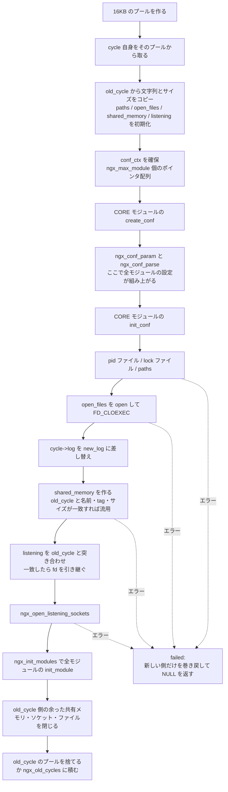

## この層の責務

Nginx のプロセスが持つ状態は、ほぼ全部が `ngx_cycle_t` という 1 つの構造体にぶら下がっている。設定も、listen ソケットも、共有メモリも、開いているログファイルも、接続の配列も。グローバル変数は `ngx_cycle` という 1 本のポインタで、そこから全部に届く。

この形が効くのは、**設定のリロードが「新しい `ngx_cycle_t` を作って、ポインタを差し替える」で表せる**からだ。個々の資源を 1 つずつ入れ替える必要がない。作りきってから差し替え、失敗したら作りかけを捨てる。

そしてこの単位を作る関数は 1 本しかない。`ngx_init_cycle()` は起動時に `main()` から呼ばれ、リロード時に master のループから呼ばれる。同じコードだ。

このページでは `main()` の頭から `ngx_master_process_cycle()` に入るまでを追い、`ngx_cycle_t` に何が集まるかを確定させる。プロセスを fork してからの話は [master/worker のページ](../master-worker/)、そのループの中身は [ステートマシンのページ](../state-machine/) が扱う。

## 主要な型とその関係

### `ngx_cycle_t`

[`src/core/ngx_cycle.h#L39-L86`](https://github.com/nginx/nginx/blob/release-1.31.4/src/core/ngx_cycle.h#L39-L86) の 48 行。フィールドを性質ごとに並べ替えるとこうなる。

| 分類            | フィールド                                                                               | 誰が埋めるか                                                                       |
| --------------- | ---------------------------------------------------------------------------------------- | ---------------------------------------------------------------------------------- |
| 設定            | `conf_ctx`                                                                               | `ngx_init_cycle` が確保し、`ngx_conf_parse` が埋める                               |
| メモリ          | `pool`                                                                                   | `ngx_init_cycle` の冒頭。cycle 自身もこのプールから取る                            |
| ログ            | `log`、`new_log`、`log_use_stderr`                                                       | `new_log` は設定の `error_log` で作られ、途中で `log` が差し替わる                 |
| 接続の配列      | `connections`、`read_events`、`write_events`、`connection_n`                             | `ngx_event_process_init`。つまり **fork の後、worker ごとに**                      |
| 空き接続        | `free_connections`、`free_connection_n`                                                  | 同上。単方向リストの先頭                                                           |
| 接続の再利用    | `reusable_connections_queue`、`reusable_connections_n`、`connections_reuse_time`         | `ngx_init_cycle` でキューを初期化                                                  |
| fd 索引         | `files`、`files_n`                                                                       | イベント方式が fd から接続を引く必要があるときだけ                                 |
| listen ソケット | `listening`                                                                              | 設定パース中に `ngx_create_listening` が push、`ngx_open_listening_sockets` が開く |
| 開いたファイル  | `open_files`                                                                             | `ngx_conf_open_file` が登録、`ngx_init_cycle` が `open()` する                     |
| 共有メモリ      | `shared_memory`                                                                          | `ngx_shared_memory_add` が登録、`ngx_init_cycle` が `mmap` する                    |
| パス            | `paths`                                                                                  | `ngx_add_path`。cache や temp のディレクトリ                                       |
| モジュール      | `modules`、`modules_n`、`modules_used`                                                   | `ngx_cycle_modules` が静的配列からコピー                                           |
| 設定ダンプ      | `config_dump`、`config_dump_rbtree`、`config_dump_sentinel`                              | `-T` のときだけ使う                                                                |
| 前の cycle      | `old_cycle`                                                                              | リロード元。使い終わったら `NULL` にする                                           |
| 文字列          | `conf_file`、`conf_param`、`conf_prefix`、`prefix`、`error_log`、`lock_file`、`hostname` | 大半は `old_cycle` からコピー                                                      |

分類して眺めると、性質が 3 つに分かれる。

- **設定から作られるもの** — `conf_ctx`、`listening`、`shared_memory`、`open_files`、`paths`。リロードで作り直される
- **プロセスに固有のもの** — `connections`、`read_events`、`write_events`、`free_connections`。master ではなく worker が、fork の後で確保する
- **前の cycle から引き継ぐもの** — 文字列群と、条件が合えば listen ソケットの fd と共有メモリのアドレス

接続の配列が `ngx_init_cycle()` で確保されないのは重要で、master プロセスには接続の配列が存在しない。確保するのは `ngx_event_core_module` の `init_process` である `ngx_event_process_init` だ ([`src/event/ngx_event.c#L754-L800`](https://github.com/nginx/nginx/blob/release-1.31.4/src/event/ngx_event.c#L754-L800))。

```c title="src/event/ngx_event.c"
    cycle->connections =
        ngx_alloc(sizeof(ngx_connection_t) * cycle->connection_n, cycle->log);
    /* ... */
    i = cycle->connection_n;
    next = NULL;

    do {
        i--;

        c[i].data = next;
        c[i].read = &cycle->read_events[i];
        c[i].write = &cycle->write_events[i];
        c[i].fd = (ngx_socket_t) -1;

        next = &c[i];
    } while (i);

    cycle->free_connections = next;
    cycle->free_connection_n = cycle->connection_n;
```

`worker_connections` の個数ぶんを一度に確保し、`data` を次の要素へのポインタとして使って単方向リストにつなぐ。**空きリストのために別の記憶領域を持たず、未使用の接続構造体の中に埋め込む。** 接続を取るのは先頭を外すだけで、`malloc` は起動時の 1 回きりになる。

`ngx_alloc` であって `ngx_palloc` でないことにも意味がある。cycle のプールではなく素の `malloc` から取っている。worker が死ぬときはプロセスごと消えるので、プールの管理コストを払う理由がない。

### グローバルな `ngx_cycle`

現在有効な cycle を指すポインタが 1 本ある ([`ngx_cycle.h#L141`](https://github.com/nginx/nginx/blob/release-1.31.4/src/core/ngx_cycle.h#L141))。

```c title="src/core/ngx_cycle.h"
extern volatile ngx_cycle_t  *ngx_cycle;
extern ngx_array_t            ngx_old_cycles;
```

`volatile` なのは、シグナルハンドラから読まれるからだ。そして `ngx_old_cycles` という配列がもう 1 本ある。リロードで置き換えられた古い cycle のうち、まだ捨てられないものがここに溜まる。

多くのコードは `cycle` を引数で受け取らず、`ngx_cycle->log` のようにグローバルを直接読む。だから **`ngx_cycle` の差し替えは、コード中のあらゆる場所から見える状態の切り替えになる**。差し替えるタイミングが 2 箇所しかないのはそのためだ。

### `init_cycle` — ほとんど空の cycle

`main()` はスタック上に `ngx_cycle_t` を 1 つ置き、それを `ngx_init_cycle()` に渡す ([`src/core/nginx.c#L250-L257`](https://github.com/nginx/nginx/blob/release-1.31.4/src/core/nginx.c#L250-L257))。

```c title="src/core/nginx.c"
    ngx_memzero(&init_cycle, sizeof(ngx_cycle_t));
    init_cycle.log = log;
    ngx_cycle = &init_cycle;

    init_cycle.pool = ngx_create_pool(1024, log);
    if (init_cycle.pool == NULL) {
        return 1;
    }
```

ログとプール以外は全部ゼロ。プールも 1024 バイトしかない。この「空の cycle」があることで、**`ngx_init_cycle()` は起動時とリロード時で同じシグネチャを持てる**。起動時は「空の cycle からの遷移」になり、特別扱いが要らない。

空かどうかを見分けるマクロも用意されている ([`ngx_cycle.h#L125`](https://github.com/nginx/nginx/blob/release-1.31.4/src/core/ngx_cycle.h#L125))。

```c title="src/core/ngx_cycle.h"
#define ngx_is_init_cycle(cycle)  (cycle->conf_ctx == NULL)
```

設定コンテキストが無いなら、それは初期化用の偽物だという判定だ。`ngx_init_cycle()` はこのマクロを 3 回使って、起動時だけの分岐を書き分ける。

## 処理の流れ

### `main()` を順に追う

`main()` は [`src/core/nginx.c#L196-L388`](https://github.com/nginx/nginx/blob/release-1.31.4/src/core/nginx.c#L196-L388) の 193 行。前半は準備、後半は分岐だ。

```c title="src/core/nginx.c"
int ngx_cdecl
main(int argc, char *const *argv)
{
    /* ... 宣言 ... */

    ngx_debug_init();

    if (ngx_strerror_init() != NGX_OK) {
        return 1;
    }

    if (ngx_get_options(argc, argv) != NGX_OK) {
        return 1;
    }
```

`ngx_strerror_init()` が `ngx_get_options()` より先にある。エラーメッセージを出すために、まず `strerror` のテーブルを作る。Nginx はエラー文字列を起動時に全部コピーして持ち、実行時に `strerror()` を呼ばない。

`ngx_get_options()` ([`#L802`](https://github.com/nginx/nginx/blob/release-1.31.4/src/core/nginx.c#L802)) が扱うのは `-?hvVtTq` と、引数を取る `-s signal` / `-p prefix` / `-e filename` / `-c filename` / `-g directives`。`getopt()` を使わず手で回している。結果は `ngx_prefix`、`ngx_conf_file` などの static 変数に入る。

続く 3 つが順序に意味を持つ。

```c title="src/core/nginx.c"
    ngx_time_init();

#if (NGX_PCRE)
    ngx_regex_init();
#endif

    ngx_pid = ngx_getpid();
    ngx_parent = ngx_getppid();

    log = ngx_log_init(ngx_prefix, ngx_error_log);
```

`ngx_time_init()` ([`src/core/ngx_times.c#L66-L77`](https://github.com/nginx/nginx/blob/release-1.31.4/src/core/ngx_times.c#L66-L77)) は時刻キャッシュのスロットを初期化して `ngx_time_update()` を 1 回呼ぶ。ここから先、コード中の時刻はすべてこのキャッシュから読まれる ([timer-rbtree のページ](../timer-rbtree/))。ログに時刻を書くので、ログの初期化より前に要る。

`ngx_log_init()` は設定ファイルを読む前のログ先を決める。設定に `error_log` があれば後で差し替わるが、**設定を読む前に起きたエラーもどこかに出す必要がある**ので、この段階のログが要る。

その後、空の cycle を作り、コマンドライン引数を保存し、prefix と conf_file のパスを確定させる。

```c title="src/core/nginx.c"
    if (ngx_save_argv(&init_cycle, argc, argv) != NGX_OK) {
        return 1;
    }

    if (ngx_process_options(&init_cycle) != NGX_OK) {
        return 1;
    }

    if (ngx_os_init(log) != NGX_OK) {
        return 1;
    }
```

`ngx_save_argv()` は `argv` を丸ごとコピーする。バイナリアップグレードで自分を `execve` するときに必要になるからだ。

`ngx_os_init()` ([`src/os/unix/ngx_posix_init.c#L35`](https://github.com/nginx/nginx/blob/release-1.31.4/src/os/unix/ngx_posix_init.c#L35)) が `ngx_pagesize`、`ngx_cacheline_size`、`ngx_ncpu`、`ngx_max_sockets` を確定させる。`getpagesize()`、`sysconf(_SC_NPROCESSORS_ONLN)`、`getrlimit(RLIMIT_NOFILE)` を呼ぶ。

次の 2 つには、なぜここなのかがコメントに書いてある。

```c title="src/core/nginx.c"
    /*
     * ngx_crc32_table_init() requires ngx_cacheline_size set in ngx_os_init()
     */

    if (ngx_crc32_table_init() != NGX_OK) {
        return 1;
    }

    /*
     * ngx_slab_sizes_init() requires ngx_pagesize set in ngx_os_init()
     */

    ngx_slab_sizes_init();
```

`ngx_crc32_table_init()` ([`src/core/ngx_crc32.c#L178-L202`](https://github.com/nginx/nginx/blob/release-1.31.4/src/core/ngx_crc32.c#L178-L202)) がやるのは、CRC32 の 16 エントリのテーブルをキャッシュライン境界に載せ直すことだけだ。静的配列が既に整列していれば何もしない。整列していなければ、`ngx_cacheline_size` ぶん余分に確保して整列したアドレスにコピーする。

`ngx_slab_sizes_init()` ([`src/core/ngx_slab.c#L85-L95`](https://github.com/nginx/nginx/blob/release-1.31.4/src/core/ngx_slab.c#L85-L95)) は slab アロケータの閾値を `ngx_pagesize` から導出する。

**どちらも「OS から取った値に依存する定数」を計算している。** コンパイル時に決められない値が実行時に決まる瞬間があり、それに依存するテーブルの初期化がその直後に並ぶ。順序の理由がコメントとして残っているのが誠実な点だ。

### 継承した fd を拾う

その次が、バイナリアップグレードの受け側になる。

```c title="src/core/nginx.c"
    if (ngx_add_inherited_sockets(&init_cycle) != NGX_OK) {
        return 1;
    }
```

中身はこれだけだ ([`#L459-L516`](https://github.com/nginx/nginx/blob/release-1.31.4/src/core/nginx.c#L459-L516))。

```c title="src/core/nginx.c"
    inherited = (u_char *) getenv(NGINX_VAR);

    if (inherited == NULL) {
        return NGX_OK;
    }

    /* ... cycle->listening を初期化 ... */

    for (p = inherited, v = p; *p; p++) {
        if (*p == ':' || *p == ';') {
            s = ngx_atoi(v, p - v);
            /* ... */
            ls = ngx_array_push(&cycle->listening);
            /* ... */
            ls->fd = (ngx_socket_t) s;
            ls->inherited = 1;
        }
    }

    ngx_inherited = 1;

    return ngx_set_inherited_sockets(cycle);
```

`NGINX_VAR` は `"NGINX"` ([`src/core/nginx.h#L22`](https://github.com/nginx/nginx/blob/release-1.31.4/src/core/nginx.h#L22))。環境変数 `NGINX` に `3;4;5;` のような fd 番号の列が入っていたら、それを listen ソケットとして拾う。

書く側は `ngx_exec_new_binary()` ([`#L697-L740`](https://github.com/nginx/nginx/blob/release-1.31.4/src/core/nginx.c#L697-L740))。

```c title="src/core/nginx.c"
    p = ngx_cpymem(var, NGINX_VAR "=", sizeof(NGINX_VAR));

    ls = cycle->listening.elts;
    for (i = 0; i < cycle->listening.nelts; i++) {
        if (ls[i].ignore) {
            continue;
        }
        p = ngx_sprintf(p, "%ud;", ls[i].fd);
    }

    *p = '\0';

    env[n++] = var;
```

`USR2` を受けた master が、新しいバイナリを `execve` するときに環境変数として fd 番号を渡す。fd は `exec` を跨いで生き残る (`FD_CLOEXEC` が立っていない) ので、新しいプロセスは `getenv` して番号を拾うだけでいい。

**プロセス間で fd を渡すのに、Unix ドメインソケットの `SCM_RIGHTS` を使っていない。** 親子関係があるので `exec` で自然に継承され、あとは「どの番号か」を伝えるだけで済む。文字列 1 本で足りる。

`ngx_set_inherited_sockets()` は、番号だけ分かっている fd に `getsockname` と `getsockopt` をかけて `ngx_listening_t` の残りのフィールドを復元する。継承した fd には設定情報が付いてこないので、カーネルに問い合わせて埋め直している。

### モジュールに番号を振る

```c title="src/core/nginx.c"
    if (ngx_preinit_modules() != NGX_OK) {
        return 1;
    }

    cycle = ngx_init_cycle(&init_cycle);
```

`ngx_preinit_modules()` ([`src/core/ngx_module.c#L26-L39`](https://github.com/nginx/nginx/blob/release-1.31.4/src/core/ngx_module.c#L26-L39)) は 14 行しかない。

```c title="src/core/ngx_module.c"
    for (i = 0; ngx_modules[i]; i++) {
        ngx_modules[i]->index = i;
        ngx_modules[i]->name = ngx_module_names[i];
    }

    ngx_modules_n = i;
    ngx_max_module = ngx_modules_n + NGX_MAX_DYNAMIC_MODULES;
```

`objs/ngx_modules.c` の静的配列を舐めて、`index` に配列の位置を、`name` に名前文字列を入れる。この `index` が `conf_ctx` の添字になる ([architecture のページ](../architecture/))。

### `ngx_init_cycle()` の中で起きること



順に見る。まずプールと cycle 自身 ([`src/core/ngx_cycle.c#L69-L83`](https://github.com/nginx/nginx/blob/release-1.31.4/src/core/ngx_cycle.c#L69-L83))。

```c title="src/core/ngx_cycle.c"
    pool = ngx_create_pool(NGX_CYCLE_POOL_SIZE, log);
    if (pool == NULL) {
        return NULL;
    }
    pool->log = log;

    cycle = ngx_pcalloc(pool, sizeof(ngx_cycle_t));
    if (cycle == NULL) {
        ngx_destroy_pool(pool);
        return NULL;
    }

    cycle->pool = pool;
    cycle->log = log;
    cycle->old_cycle = old_cycle;
```

`NGX_CYCLE_POOL_SIZE` は `NGX_DEFAULT_POOL_SIZE` = 16KB ([`ngx_palloc.h#L22`](https://github.com/nginx/nginx/blob/release-1.31.4/src/core/ngx_palloc.h#L22))。**cycle 構造体そのものが、その cycle のプールから確保される。** プールを捨てれば cycle も消える。所有関係が 1 本にまとまる。

配列とリストの初期サイズは `old_cycle` の実績から取る ([`#L127`](https://github.com/nginx/nginx/blob/release-1.31.4/src/core/ngx_cycle.c#L127)、[`#L149-L157`](https://github.com/nginx/nginx/blob/release-1.31.4/src/core/ngx_cycle.c#L149-L157))。

```c title="src/core/ngx_cycle.c"
    if (old_cycle->open_files.part.nelts) {
        n = old_cycle->open_files.part.nelts;
        for (part = old_cycle->open_files.part.next; part; part = part->next) {
            n += part->nelts;
        }

    } else {
        n = 20;
    }
```

前回 40 個のログファイルを開いたなら、今回も 40 個から始める。リロードで設定が大きく変わらないという経験則を、初期容量の見積もりに使っている。初回は `paths` と `listening` が 10、`open_files` が 20、`shared_memory` が 1。

次が設定の器だ ([`#L200-L204`](https://github.com/nginx/nginx/blob/release-1.31.4/src/core/ngx_cycle.c#L200-L204))。

```c title="src/core/ngx_cycle.c"
    cycle->conf_ctx = ngx_pcalloc(pool, ngx_max_module * sizeof(void *));
```

`ngx_max_module` は静的モジュール数 + 128。動的モジュールが後から入る余地を最初から空けてある。

その後 `ngx_cycle_modules()` で静的モジュール配列をコピーし、CORE モジュールの `create_conf` を回し、パーサを呼ぶ ([`#L280-L290`](https://github.com/nginx/nginx/blob/release-1.31.4/src/core/ngx_cycle.c#L280-L290))。

```c title="src/core/ngx_cycle.c"
    if (ngx_conf_param(&conf) != NGX_CONF_OK) {
        environ = senv;
        ngx_destroy_cycle_pools(&conf);
        return NULL;
    }

    if (ngx_conf_parse(&conf, &cycle->conf_file) != NGX_CONF_OK) {
        environ = senv;
        ngx_destroy_cycle_pools(&conf);
        return NULL;
    }
```

`-g` で渡された文字列を先に、次に設定ファイルを読む。**この 2 行の内側で `http {}` も `server {}` も `location {}` も全部処理され、`ngx_cycle_t` にぶら下がる設定ツリーができあがる** ([conf-parse のページ](../conf-parse/))。listen ソケットの `ngx_listening_t` も、共有メモリゾーンの宣言も、開くべきログファイルの登録も、ここで `cycle` の配列に push される。

`environ = senv` に注目したい。パース中に `env` ディレクティブが `environ` を書き換えるので、失敗したら復元する。グローバルな `environ` に対する「トランザクション」を手で書いている。

パースが通ったら CORE モジュールの `init_conf` を回し、`ngx_process == NGX_PROCESS_SIGNALLER` ならここで帰る ([`#L316-L318`](https://github.com/nginx/nginx/blob/release-1.31.4/src/core/ngx_cycle.c#L316-L318))。`nginx -s reload` は pid ファイルの場所を知りたいだけなので、ソケットを開く必要がない。

### ファイルとソケットを開く

`open_files` を開く部分 ([`#L385-L408`](https://github.com/nginx/nginx/blob/release-1.31.4/src/core/ngx_cycle.c#L385-L408))。

```c title="src/core/ngx_cycle.c"
        file[i].fd = ngx_open_file(file[i].name.data,
                                   NGX_FILE_APPEND,
                                   NGX_FILE_CREATE_OR_OPEN,
                                   NGX_FILE_DEFAULT_ACCESS);
        /* ... */
#if !(NGX_WIN32)
        if (fcntl(file[i].fd, F_SETFD, FD_CLOEXEC) == -1) {
```

ログファイルには `FD_CLOEXEC` を立てる。listen ソケットには立てない。**`exec` を跨いで渡したいものと渡したくないものが、この 1 行で分かれている。**

開き終わったら `cycle->log = &cycle->new_log;` でログの向き先を設定ファイルのものに切り替える ([`#L411-L412`](https://github.com/nginx/nginx/blob/release-1.31.4/src/core/ngx_cycle.c#L411-L412))。ここから先のエラーは新しい `error_log` に出る。

共有メモリは、`old_cycle` に同じものがあれば流用する ([`#L468-L488`](https://github.com/nginx/nginx/blob/release-1.31.4/src/core/ngx_cycle.c#L468-L488))。

```c title="src/core/ngx_cycle.c"
            if (shm_zone[i].tag == oshm_zone[n].tag && shm_zone[i].noreuse) {
                data = oshm_zone[n].data;
                break;
            }

            if (shm_zone[i].tag == oshm_zone[n].tag
                && shm_zone[i].shm.size == oshm_zone[n].shm.size)
            {
                shm_zone[i].shm.addr = oshm_zone[n].shm.addr;
                /* ... */
                if (shm_zone[i].init(&shm_zone[i], oshm_zone[n].data)
                    != NGX_OK)
                {
                    goto failed;
                }

                goto shm_zone_found;
            }
```

流用の条件は **名前が同じ、`tag` が同じ、サイズが同じ**の 3 つ。`tag` はモジュールのアドレスで、名前の衝突を防ぐ。3 つ揃えば `mmap` 済みのアドレスをそのまま引き継ぐ。だから `limit_req` のカウンタも `proxy_cache` の索引も、リロードで消えない。

サイズを変えると流用できない。`proxy_cache_path` の `keys_zone` を大きくするリロードでキャッシュの索引が空になるのは、この分岐が理由だ。

listen ソケットも同じ考え方で突き合わせる ([`#L513-L598`](https://github.com/nginx/nginx/blob/release-1.31.4/src/core/ngx_cycle.c#L513-L598))。

```c title="src/core/ngx_cycle.c"
                if (ngx_cmp_sockaddr(nls[n].sockaddr, nls[n].socklen,
                                     ls[i].sockaddr, ls[i].socklen, 1)
                    == NGX_OK)
                {
                    nls[n].fd = ls[i].fd;
                    nls[n].previous = &ls[i];
                    /* ... */
                    ls[i].remain = 1;
                }
```

アドレスとポートが一致すれば fd をコピーし、古い側に `remain = 1` を立てる。`remain` が立っていない古いソケットは、後で閉じられる。**`bind()` し直さないので、リロード中に接続を取りこぼす瞬間がない。**

`ngx_open_listening_sockets()` ([`src/core/ngx_connection.c#L426`](https://github.com/nginx/nginx/blob/release-1.31.4/src/core/ngx_connection.c#L426)) は、fd が `-1` のままのものだけを `socket` / `bind` / `listen` する。

### commit する

```c title="src/core/ngx_cycle.c"
    /* commit the new cycle configuration */

    if (!ngx_use_stderr) {
        (void) ngx_log_redirect_stderr(cycle);
    }

    pool->log = cycle->log;

    if (ngx_init_modules(cycle) != NGX_OK) {
        /* fatal */
        exit(1);
    }
```

コメントが `commit` と言っている ([`#L641`](https://github.com/nginx/nginx/blob/release-1.31.4/src/core/ngx_cycle.c#L641))。ここより前のエラーは `goto failed` で巻き戻せるが、ここから先は戻れない。

だから `ngx_init_modules()` の失敗が `exit(1)` になっている。全モジュールの `init_module` を呼ぶこの関数は、失敗しても巻き戻す先がない。**巻き戻せる区間と巻き戻せない区間の境界が、コメント 1 行で明示されている。**

その後、`old_cycle` 側の余った共有メモリ・listen ソケット・開いたファイルを閉じ、最後に old_cycle をどうするかを決める ([`#L783-L789`](https://github.com/nginx/nginx/blob/release-1.31.4/src/core/ngx_cycle.c#L783-L789))。

```c title="src/core/ngx_cycle.c"
    if (ngx_process == NGX_PROCESS_MASTER || ngx_is_init_cycle(old_cycle)) {

        ngx_destroy_pool(old_cycle->pool);
        cycle->old_cycle = NULL;

        return cycle;
    }
```

master であるか、初回であるなら、古い cycle のプールを即座に捨てる。master は接続を持っていないので、古い cycle を参照しているものが無いと分かっている。

そうでない場合 — single process モードでのリロード — は、まだ処理中の接続が古い cycle を参照している可能性がある。だから `ngx_old_cycles` に積んで、30 秒ごとの掃除タイマに任せる ([`#L792-L828`](https://github.com/nginx/nginx/blob/release-1.31.4/src/core/ngx_cycle.c#L792-L828))。

`main()` に戻ると、残りは分岐だ。`-t` なら設定を検査して終わり、`-s` ならシグナルを送って終わり。それ以外なら `ngx_cycle = cycle;` でグローバルを差し替え、シグナルハンドラを入れ、デーモン化し、pid ファイルを作り、ループに入る ([`#L335-L385`](https://github.com/nginx/nginx/blob/release-1.31.4/src/core/nginx.c#L335-L385))。

```c title="src/core/nginx.c"
    if (!ngx_inherited && ccf->daemon) {
        if (ngx_daemon(cycle->log) != NGX_OK) {
            return 1;
        }

        ngx_daemonized = 1;
    }

    if (ngx_inherited) {
        ngx_daemonized = 1;
    }

#endif

    if (ngx_create_pidfile(&ccf->pid, cycle->log) != NGX_OK) {
        return 1;
    }
```

pid ファイルを作るのは `ngx_daemon()` の後だ。`ngx_init_cycle()` の中にコメントで理由が書いてある ([`#L330-L333`](https://github.com/nginx/nginx/blob/release-1.31.4/src/core/ngx_cycle.c#L330-L333))。

```c title="src/core/ngx_cycle.c"
        /*
         * we do not create the pid file in the first ngx_init_cycle() call
         * because we need to write the demonized process pid
         */
```

`fork` するとプロセス ID が変わるので、デーモン化の前に書くと嘘の pid を書いてしまう。だから初回だけ `ngx_init_cycle()` は pid ファイルを作らず、`main()` に任せる。リロード時の `ngx_init_cycle()` は、pid ファイル名が変わったときだけ書き直す。

そして最後に分岐する。

```c title="src/core/nginx.c"
    if (ngx_process == NGX_PROCESS_SINGLE) {
        ngx_single_process_cycle(cycle);

    } else {
        ngx_master_process_cycle(cycle);
    }

    return 0;
```

`master_process off` なら fork せず、1 プロセスがイベントループを直接回す。デバッグ用のモードで、この場合 cache manager も cache loader も生まれない。

## 守られている不変条件

**新しい cycle を作りきってから、古いものを捨てる。** `ngx_init_cycle()` は `old_cycle` を引数に取り、その中身を読むだけで壊さない。壊し始めるのは `commit the new cycle configuration` より後だ。設定ファイルに構文エラーがあっても、ポートが埋まっていても、ログの書き込み先が無くても、古い cycle は無傷で残る。

**`failed:` は新しい側だけを巻き戻す。** [`#L833-L953`](https://github.com/nginx/nginx/blob/release-1.31.4/src/core/ngx_cycle.c#L833-L953) の 121 行がロールバックだ。やるのは 4 つ。

```c title="src/core/ngx_cycle.c"
failed:

    if (!ngx_is_init_cycle(old_cycle)) {
        old_ccf = (ngx_core_conf_t *) ngx_get_conf(old_cycle->conf_ctx,
                                                   ngx_core_module);
        if (old_ccf->environment) {
            environ = old_ccf->environment;
        }
    }

    /* rollback the new cycle configuration */
```

1. `environ` を古い cycle のものに戻す
2. 新しく開いたファイルを閉じる
3. 新しく確保した共有メモリを解放する。ただし古い cycle と共有しているものは残す
4. 新しく開いた listen ソケットを閉じる。`ls[i].open` が立っているものだけ

3 番目の判定が対称的なのが目を引く。commit 側では「新しい cycle に対応がない古いゾーン」を解放し、`failed:` 側では「古い cycle に対応がない新しいゾーン」を解放する。同じ二重ループが向きを変えて 2 回書かれている。

最後に `ngx_destroy_cycle_pools(&conf)` で新しい cycle のプールと temp プールを捨て、`NULL` を返す。呼び出し側 (リロードなら master のループ) は `NULL` を見て、何もせずに古い cycle のまま動き続ける。

**`ngx_cycle` が指す先は、常に完成した cycle。** `main()` では作りかけの `init_cycle` を一時的に指すが、それは設定を読む前だけ。`ngx_init_cycle()` の中で `ngx_cycle` は書き換えられない。書き換えるのは呼び出し側だ。

**cycle のプールは、cycle が生きている間ずっと生きる。** リクエストのプールとは寿命の桁が違う。この違いは意識して使い分ける必要がある。

| プール             | 確保する場所                                                                                                         | 捨てるタイミング                | 典型サイズ                                         |
| ------------------ | -------------------------------------------------------------------------------------------------------------------- | ------------------------------- | -------------------------------------------------- |
| cycle のプール     | `ngx_init_cycle`                                                                                                     | 次の cycle が commit されたとき | 16KB から始まる                                    |
| 接続のプール       | `ngx_event_accept` ([`#L159`](https://github.com/nginx/nginx/blob/release-1.31.4/src/event/ngx_event_accept.c#L159)) | 接続が閉じるとき                | `connection_pool_size`、既定 `64 * sizeof(void *)` |
| リクエストのプール | `ngx_http_create_request`                                                                                            | リクエストが終わるとき          | `request_pool_size`、既定 4096 バイト              |

設定パース中に `ngx_palloc(cf->pool, ...)` で取ったものは、プロセスが動いている間ずっと残る。リクエスト処理中に `ngx_palloc(r->pool, ...)` で取ったものは、そのリクエストで消える。**「どのプールから取るか」が「いつ消えるか」を決める**ので、間違えるとリークかダングリングポインタになる ([memory-pool のページ](../memory-pool/))。

**共有メモリの流用は 3 条件の完全一致でしか起きない。** 名前・`tag`・サイズ。1 つでも違えば新しい領域が `mmap` され、古い方は解放される。中身は引き継がれない。

## つまずきどころ

### `ngx_init_cycle()` は 917 行ある

[`src/core/ngx_cycle.c#L38-L954`](https://github.com/nginx/nginx/blob/release-1.31.4/src/core/ngx_cycle.c#L38-L954)。1 つの関数としては長い。ファイル全体が 1,484 行なので、`ngx_cycle.c` の 6 割がこの関数だ。

分割されていない理由は、`goto failed` にある。途中で失敗したときに巻き戻す対象が、この関数のローカル変数 (`pool`、`conf`、`cycle`) に全部ぶら下がっている。関数を分けると、巻き戻しに必要な情報を渡し合う構造が要る。C にデストラクタがないので、**単一の関数 + 単一の `failed:` ラベル**が一番簡単な形になる。

読むときは 4 つの区間に分けると見通しが立つ。`#L38-L230` が器の準備、`#L233-L318` が設定のパース、`#L320-L638` が資源の獲得、`#L641-L830` が commit と後始末。そして `#L833-L953` がロールバック。

### `old_cycle` が即座に捨てられるとは限らない

master プロセスと初回起動では即座に `ngx_destroy_pool(old_cycle->pool)` する。それ以外では `ngx_old_cycles` に積まれ、30 秒ごとのタイマが掃除する ([`#L1379-L1433`](https://github.com/nginx/nginx/blob/release-1.31.4/src/core/ngx_cycle.c#L1379-L1433))。

```c title="src/core/ngx_cycle.c"
        for (n = 0; n < cycle[i]->connection_n; n++) {
            if (cycle[i]->connections[n].fd != (ngx_socket_t) -1) {
                found = 1;
                /* ... */
                break;
            }
        }

        if (found) {
            live = 1;
            continue;
        }

        ngx_log_debug1(NGX_LOG_DEBUG_CORE, log, 0, "clean old cycle: %ui", i);

        ngx_destroy_pool(cycle[i]->pool);
        cycle[i] = NULL;
```

古い cycle の接続配列を全部走査して、fd が `-1` でないものが 1 つでもあれば「まだ生きている」と判断する。参照カウントを持たず、**接続配列を線形に走査して生存を確かめる**。5 万接続あれば 5 万回のループになるが、30 秒に 1 回しか走らない。

全部死んでいれば `ngx_temp_pool` ごと捨てて、次にリロードがあるまで何も残さない。

このパスに入るのは `master_process off` のときだけなので、通常の運用では踏まない。踏まないコードが 55 行あることになるが、single process モードを維持する以上は要る。

### `-t` は本番と同じ処理をほぼ全部やる

`ngx_test_config` が立っていても、`ngx_init_cycle()` は設定をパースし、共有メモリを `mmap` し、**listen ソケットを実際に開く**。違うのは `ngx_configure_listening_sockets()` を呼ばないことと、最後に `ngx_destroy_cycle_pools()` して `NULL` を返すことだけだ ([`#L636-L638`](https://github.com/nginx/nginx/blob/release-1.31.4/src/core/ngx_cycle.c#L636-L638)、[`#L933-L936`](https://github.com/nginx/nginx/blob/release-1.31.4/src/core/ngx_cycle.c#L933-L936))。

だから `nginx -t` は、稼働中の nginx がポートを掴んでいるとき `bind()` に失敗しうる。`SO_REUSEPORT` や `SO_REUSEADDR` の設定次第で通ったり通らなかったりする。「設定ファイルの構文チェック」だと思っていると挙動が読めない。

pid ファイルも `-t` のときは作る ([`#L322-L326`](https://github.com/nginx/nginx/blob/release-1.31.4/src/core/ngx_cycle.c#L322-L326))。書き込み権限のチェックを兼ねている。

### `ngx_cycle` は `volatile ngx_cycle_t *` である

型に `volatile` が付いているので、`ngx_cycle_t *` を期待する関数にそのまま渡すとコンパイラが警告を出す。コードのあちこちに `(ngx_cycle_t *) ngx_cycle` というキャストが現れるのはこのためだ。

`volatile` が要るのは、シグナルハンドラが `ngx_cycle->log` を読むから。ただし `volatile` はスレッド間の可視性を保証しないので、これは「シグナルハンドラとメインフローの間で最適化による読み飛ばしを防ぐ」以上の意味を持たない。今なら `sig_atomic_t` や atomic 型を使うところだ。

### 接続配列は master に無い

`cycle->connections` が `NULL` のまま master が動いている。`ngx_clean_old_cycles()` がこの配列を走査するのに、master ではそのパスに入らないのは、そもそも配列が無いからでもある。

master プロセスのメモリマップを見て「接続が確保されていない」と驚く必要はない。`worker_connections 65536; worker_processes 8;` なら、`ngx_connection_t` と `ngx_event_t` × 2 のぶんが **worker 8 つそれぞれに**確保される。master のぶんは無い。

### 設定を読む前のエラーはどこに出るか

`ngx_log_init()` が返すログは、`error_log` ディレクティブを読む前のものだ。`-e` で指定されていなければコンパイル時の既定パスを使い、それも開けなければ stderr に落ちる。

`ngx_use_stderr` というグローバルがこの状態を表していて、`main()` の終盤で `ngx_use_stderr = 0;` になるまでは stderr にも出る ([`#L378`](https://github.com/nginx/nginx/blob/release-1.31.4/src/core/nginx.c#L378))。だから設定ファイルの構文エラーは端末に見えるのに、起動後のエラーは `error_log` にしか出ない。**「エラーが端末に出るかどうか」が起動フェーズの目印になっている。**

## 関連

- `ngx_conf_parse` の内側は [conf-parse](../conf-parse/)。
- モジュールの `index` / `ctx_index` と 6 種別は [module-system](../module-system/)。
- ここで開いた listen ソケットを worker に配るところからは [master-worker](../master-worker/)。
- `ngx_event_process_init` が接続配列を作った後のループは [state-machine](../state-machine/)。
- プールの寿命の切り方そのものは [memory-pool](../memory-pool/)。
- 共有メモリゾーンの中で何が起きるかは [slab-shared-memory](../slab-shared-memory/)。
