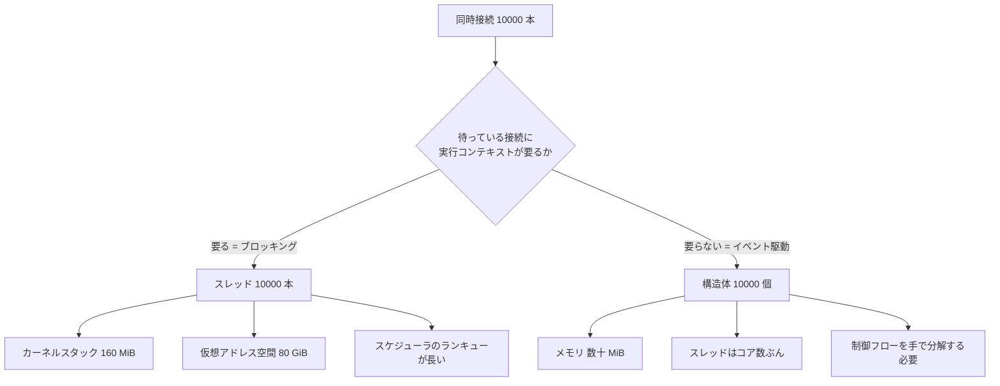

## なぜこれを先に知る必要があるか

Nginx のソースを読み始めると、最初に不自然に見えるものが 2 つある。1 つは、リクエスト処理が関数の呼び出し順ではなく **状態遷移と関数ポインタ** で書かれていること。もう 1 つは、マスタープロセスが起動直後に worker を fork して、その後は **worker を 1 本のスレッドで回し続ける** こと。

どちらも「ふつうに書いたらこうならない」形をしている。ふつうに書けば、accept して、read して、パースして、応答を書く、という手続きが上から下に並ぶ。Nginx がそう書かないのは、書けなかったからではなく、**その形では同時接続数がスレッド数で頭打ちになる** からだ。

ここでは Nginx のコードを一切出さずに、同時接続をどう捌くかという設計空間そのものを見る。5 つの選択肢があり、それぞれに固有のコストがある。Nginx が選んだのは 4 番目で、その選択が [ステートマシンのページ](../state-machine/) 以降で見るコードの形をほぼ全部決めている。

## 設計空間を 5 段階で並べる

歴史順に並べると、そのまま「コストが問題になった順」になる。

### 1. 接続ごとに fork する

いちばん素朴な形。listen ソケットから `accept()` し、`fork()` して、子プロセスが 1 接続を最初から最後まで面倒みて `exit()` する。

```c
for (;;) {
    int c = accept(listen_fd, NULL, NULL);
    if (fork() == 0) {
        close(listen_fd);
        handle_connection(c);   /* ブロッキングでよい */
        _exit(0);
    }
    close(c);
}
```

この形の美点は、`handle_connection()` の中を **完全に同期的なコードで書ける** ことだ。`read()` が返るまで待てばいいし、ローカル変数がそのまま状態になる。エラー処理は早期 return でいい。プロセスが死んでもそのプロセスだけが死ぬので、隔離も自動でついてくる。

`inetd` はこれをさらに極端にして、accept したソケットを fd 0/1/2 に付け替えてから `exec()` する。プログラム側は標準入出力を読み書きするだけでネットワークサーバになる。初期の CGI も同じ発想で、1 リクエストごとにインタプリタを含むプロセスを丸ごと起動していた。

コストは `fork()` + `exec()` の値段そのもの。ページテーブルの複製、ファイルディスクリプタテーブルの複製、`exec()` するならさらに ELF のロードと動的リンク。**リクエストあたりミリ秒のオーダー** がかかる。1 秒に 1000 リクエストを捌こうとすると、CPU がプロセス生成だけで埋まる。

### 2. プロセスをプールする

`fork()` の値段が問題なら、あらかじめ fork しておいて使い回せばいい。Apache HTTP Server の prefork MPM がこれで、起動時に子プロセスを何本か作り、各子プロセスが `accept()` して 1 接続を処理し、終わったらまた `accept()` に戻る。

`fork()` のコストがリクエストあたりから起動時 1 回に落ちる。同期的なコードで書けるという美点はそのまま残る。Apache のモジュール API がブロッキング前提で設計されているのも、この上に載っているからだ。mod_php がプロセス内に PHP インタプリタを抱えていられるのも、プロセスがリクエストをまたいで生き続けるから。

残るコストは 2 つ。**同時接続数が子プロセス数で上限になる** ことと、**プロセス 1 本のメモリが重い** こと。子プロセスは独立したアドレス空間を持つので、共有できるのは fork 時点で copy-on-write になっているページだけ。モジュールを積むほど、ヒープに触るほど、共有が剥がれていく。

### 3. スレッドをプールする

プロセスが重いならスレッドにする。アドレス空間を共有するので、生成コストもメモリも大幅に安い。Apache の worker MPM は「複数プロセス × 各プロセス内に複数スレッド」というハイブリッドで、1 接続を 1 スレッドが担当する。Java のサーブレットコンテナ (Tomcat など) の 1 リクエスト 1 スレッドモデルも同じ位置にいる。

構造としては、accept する側とリクエストを処理する側が分かれる。

```c
/* アクセプタスレッド */
for (;;) {
    int c = accept(listen_fd, NULL, NULL);
    queue_push(&work_queue, c);      /* 空いているワーカーが取る */
}

/* ワーカースレッド (N 本) */
for (;;) {
    int c = queue_pop(&work_queue);  /* 空なら寝る */
    handle_connection(c);            /* ブロッキングでよい */
    close(c);
}
```

同期的に書けるという美点も維持される。`InputStream.read()` はブロックしてよく、スタックが状態を保持し、例外がそのまま伝播する。デバッガでスタックトレースを見れば「今このリクエストがどこにいるか」が一目で分かる。**この可読性とデバッガビリティが、このモデルが今も生き残っている理由** だ。

`queue_push` / `queue_pop` の存在が、このモデルのもう 1 つの性質を作る。**ワーカーが全部埋まっていれば、新しい接続はキューに溜まる。** キューの長さが過負荷の直接の指標になり、長すぎたら受け入れをやめるという判断ができる。イベント駆動にはこの指標がない (後述)。

コストは、スレッド 1 本の値段 (後述) と、**同時接続数がスレッド数で上限になること**。そして接続数がスレッド数を超えたぶんは、キューで待つか、拒否されるかしかない。

Apache の event MPM はこの制約を部分的に緩めた。keepalive で「次のリクエストを待っているだけ」の接続は専用のリスナースレッドが `poll()` で見張り、実際にデータが来たときだけワーカースレッドに割り当てる。**アイドルな接続がスレッドを占有しない** ようにしたわけで、次の段階への橋渡しになっている。

### 4. イベント駆動 + 1 スレッド

スレッドを増やさずに接続を増やすには、**1 本のスレッドが複数の接続を持ち回る** しかない。そのために要るのが 2 つ。すべてのソケットをノンブロッキングにすることと、「今どのソケットが読み書きできる状態か」をカーネルに問い合わせる API だ。

```c
for (;;) {
    int n = epoll_wait(ep, events, MAX, timeout);
    for (int i = 0; i < n; i++) {
        connection_t *c = events[i].data.ptr;
        c->handler(c);          /* ブロックせずに、進める分だけ進めて帰る */
    }
    expire_timers();
}
```

Nginx がこれで、Node.js も Redis (6.0 より前) も同じ形をしている。接続 1 本のコストは「構造体 1 個 + 読み書きバッファ」まで下がる。**スレッドのスタックが要らなくなるのが決定的** で、接続数の上限はメモリと fd 数だけになる。

代償はコードの形が変わることだ。`c->handler(c)` はブロックせずに帰らないといけないので、「read して、パースして、応答する」という手続きを **どこで中断されてもいいように分解** する必要がある。詳しくは後述する。

CPU コアを 1 スレッドで使い切ることはできないので、実際には **このループを持つプロセスをコア数ぶん立てる**。Nginx の `worker_processes auto` も、Node.js の cluster モジュールも、Redis のシャーディングもそこは同じ。プロセス内には共有状態を持たず、必要なものだけを共有メモリに置く。

### 5. 非同期ランタイム + M:N スレッド

イベント駆動の性能を持ちつつ、同期的に書ける形を取り戻したい。そのために言語ランタイム側で **軽量な実行単位** を用意し、ブロックする操作でそれを勝手に退避させる。

Go のゴルーチンがそれで、書き手のコードは 1 番目のモデルとほとんど同じ形をしている。

```go
for {
    conn, err := ln.Accept()
    if err != nil {
        continue
    }
    go handleConn(conn)   // fork でもスレッド生成でもない
}
```

`conn.Read()` は書き手から見ればブロックするが、ランタイムはその裏でゴルーチンをスケジューラのキューに戻し、netpoller (Linux なら epoll) に fd を登録して、OS スレッドは別のゴルーチンを走らせる。ゴルーチンの初期スタックは 2 KiB で、足りなくなったら伸びる。**スタックを OS ではなくランタイムが管理することで、1 本あたりのコストが 3 桁下がった。**

M:N というのは「M 本の軽量タスクを N 本の OS スレッドの上で走らせる」ことで、N はコア数程度に固定される。タスクが待ちに入るたびに OS スレッドが別のタスクを拾うので、スレッド数を増やさずに待ちの数を増やせる。

Rust の Tokio は同じことを型システムでやる。

```rust
loop {
    let (socket, _) = listener.accept().await?;
    tokio::spawn(async move {
        handle(socket).await;
    });
}
```

`async fn` はコンパイル時に状態機械へ変換され、await 点で中断できる構造体になる。**Nginx が手で書いている「状態を構造体に持ち、ハンドラを付け替える」変換を、コンパイラがやっている** と見るのが正確だ。スタックそのものが存在せず、必要な変数だけを持つ future になるので、Go のゴルーチンよりさらに小さい。

Envoy は C++ で書かれていて 4 と 5 の中間にいる — イベントループを持つワーカースレッドを複数立て、接続をスレッドに割り付ける。ループの中は Nginx と同じくコールバックだが、スレッドを使うので共有状態にアクセスできる。

このモデルのコストは、**ランタイムが要ること** と **抽象の漏れ** だ。async 関数から同期関数を呼んでうっかりブロックするとワーカースレッドが 1 本止まる。Rust なら `Send` 境界とライフタイムがコードに現れる。Go ならスタックの伸長とスケジューラのプリエンプションが GC やレイテンシに効いてくる。

### 5 つを並べる

|                         | 1 接続あたりの担い手 | 同期的に書けるか | 接続 1 本のコスト           | 同時接続の上限を決めるもの |
| ----------------------- | -------------------- | ---------------- | --------------------------- | -------------------------- |
| 接続ごとに fork         | プロセス (使い捨て)  | ○                | プロセス 1 個 + 生成コスト  | プロセス生成のスループット |
| プロセスプール          | プロセス (常駐)      | ○                | プロセス 1 個               | プロセス数とメモリ         |
| スレッドプール          | スレッド             | ○                | スタック + カーネルスタック | スレッド数とメモリ         |
| イベント駆動 1 スレッド | 状態機械 (構造体)    | ×                | 構造体 + バッファ           | メモリと fd 数             |
| 非同期ランタイム        | 軽量タスク           | ○ (見かけ上)     | タスク 1 個 + ランタイム    | メモリと fd 数             |

「同期的に書けるか」の列が、性能の列と逆向きに並んでいるのが分かる。**5 番目のモデルの存在意義は、この 2 つの列を初めて両立させたこと** にある。

### 「同期的に書ける」ことの値段

イベント駆動が明らかに速いのに、1〜3 のモデルが今も広く使われているのはなぜか。同期的に書けることが、性能以外の 4 つを同時に提供しているからだ。

**スタックが状態を保持する。** 処理の途中経過をどこかに保存する必要がない。ローカル変数がそのまま「今どこまで進んだか」になる。イベント駆動では、この状態を全部ヒープ上の構造体に手で移すことになる。

**エラーが自動で伝播する。** 例外でも早期 return でも、深いところで起きたエラーが呼び出し元まで戻る。イベント駆動では、中断点ごとにエラー経路が分岐する。

**スタックトレースが読める。** 「今このリクエストが何をしているか」がデバッガでそのまま見える。イベント駆動でスタックトレースを取ると、`epoll_wait` から呼ばれたハンドラ 1 段しか映らない。どこから来たのかは実行時のハンドラの付け替えにしか記録されていない。

**リソースの寿命がスコープと一致する。** 関数を抜けるときに解放すればいい。イベント駆動では「この接続が生きている間」という別の寿命が主役になり、それを表す仕組み ([メモリプールのページ](../memory-pool/)) が必要になる。

これらは全部、**プログラマの生産性とバグの起きにくさ** に直結する。だから「イベント駆動が正解」ではなく、「10000 接続を扱う必要があるときだけ、この 4 つを差し出す価値がある」というトレードオフとして見るのが正しい。

### ハイブリッドと中間形

5 段階は連続していて、実際のシステムは中間に置かれることが多い。

**マルチプロセス × マルチスレッド** (Apache worker MPM) — プロセスが落ちても全体が死なない隔離と、スレッドの軽さを両取りする。

**イベントループ × 複数プロセス** (Nginx、Node.js の cluster) — 1 プロセス 1 ループで、プロセスをコア数ぶん立てる。アドレス空間が分かれているので、ループ間に共有状態のバグが起きない。

**イベントループ × 複数スレッド** (Envoy) — 1 スレッド 1 ループ。共有したいものにアクセスしやすい代わりに、ロックとメモリモデルの問題が入る。

**イベントループ + 補助スレッドプール** (Nginx、Node.js の libuv) — イベントループを主役にしつつ、**どうしてもブロックする操作だけ** を別スレッドに逃がす。ディスク I/O、DNS、暗号処理といった「readiness 型の API で待てないもの」がここに来る。Node.js の libuv がスレッドプールを持っているのも、Nginx がスレッドプールを持っているのも同じ理由だ ([ブロックする I/O のページ](../blocking-io/))。

**SEDA (staged event-driven architecture)** — 処理をステージに分け、ステージごとにキューとスレッドプールを持つ。ステージ間の境界がキューなので、負荷に応じて各ステージのスレッド数を独立に調整できる。理屈は美しいが、ステージをまたぐたびにキューイングとコンテキストスイッチが入るので、レイテンシが積み上がる。

**このリストのどれもが「1 本のループだけで全部やる」から外れている** のが重要な観察になる。純粋なイベント駆動は理想形であって、現実のシステムは必ずどこかに例外を持っている。

## コストを数える

「重い」「軽い」で済ませずに、実際に何がいくら要るかを見ておく。ここの数字が、C10K の議論も Nginx の設計も駆動している。

### スレッド 1 本の値段

Linux で `pthread_create()` したスレッドが確保するものは 3 つある。

**ユーザースタック。** デフォルトのサイズは `RLIMIT_STACK` から取られ、多くのディストリビューションで 8 MiB になっている。`ulimit -s` が返す `8192` (KiB) がそれだ。

```c
#include <pthread.h>

pthread_attr_t attr;
size_t stacksize;

pthread_attr_init(&attr);
pthread_attr_getstacksize(&attr, &stacksize);
/* 典型的には 8388608 = 8 MiB */
```

ただしこれは `mmap()` された **仮想アドレス空間** であって、実際に触ったページしか物理メモリを消費しない。だから「スレッド 1 本 = 8 MiB の RAM」ではない。それでも 2 つの意味で効く。1 つは 32 ビット環境では 3 GiB 程度しかないアドレス空間を食い潰すこと。もう 1 つは、深い呼び出しをするプログラムなら実際にページが touch されて、RSS が積み上がること。

**カーネルスタック。** スレッドごとにカーネルモードで使うスタックが必要で、x86-64 の Linux では 16 KiB (`THREAD_SIZE`)。これは仮想ではなく **物理メモリを実際に消費し、スワップアウトもできない**。10000 スレッドなら 160 MiB がカーネル側に固定で取られる。

**`task_struct` とスケジューラのデータ。** 1 本あたり数 KiB。

### コンテキストスイッチの値段

直接のコストは、レジスタの保存と復帰、そしてカーネルモードへの往復で **1 µs 未満から数 µs のオーダー**。プロセス間の切り替えならページテーブルも切り替わるので TLB のフラッシュが加わり、さらに高くつく (PCID があれば緩和される)。

問題は間接コストのほうだ。切り替わったスレッドは自分のスタックとデータを L1/L2 キャッシュに引き直す必要がある。スレッドが数千本あってラウンドロビンで回ってくると、**次に自分の番が来る頃にはキャッシュに何も残っていない**。この「キャッシュが冷える」コストは直接コストより大きくなりうる。

スレッドが多いほど、スケジューラのランキューも長くなり、負荷分散のためのプロセッサ間割り込みも増える。**スレッド数を増やすことのコストは、スレッド数に対して線形より悪い。**

### 10000 接続に必要なもの

同時接続 10000 本を維持するために、各モデルが何を要求するかを並べる。

**プロセスプール:** 子プロセス 10000 個。RSS が 1 本 2 MiB だとしても 20 GiB。カーネル側のスタックだけで 160 MiB。プロセステーブルもランキューもその長さになる。

**スレッドプール:** スレッド 10000 本。仮想アドレス空間 80 GiB (64 ビットなら確保自体はできる)。カーネルスタック 160 MiB。実際に触るスタックが 1 本 32 KiB でも、ユーザー側で 320 MiB。スレッドをこの数まで作れるかは `threads-max` や cgroup の `pids.max` にもぶつかる。

**イベント駆動 1 スレッド:** 接続あたり、接続を表す構造体と読み書きバッファ。バッファを 4 KiB ずつ持っても 10000 本で 80 MiB 程度。スレッドは 1 本 (コアあたり 1 本) なので、スタックもカーネルスタックも定数。**接続数はもうスレッドとは無関係になり、fd の上限とメモリだけが効く。**

### fd という別の上限

接続 1 本はファイルディスクリプタ 1 個を消費する。**プロキシとして動くなら 2 個** — 下流のクライアント接続と、上流へのバックエンド接続。ここに 3 つの上限がかかる。

**プロセスごとの `RLIMIT_NOFILE`。** `ulimit -n` が返す値で、明示的に上げないと 1024 や 4096 のままのことがある。**この値がそのまま同時接続数の天井になる。** イベント駆動で数万接続を扱えるようにしても、ここが 1024 なら 1024 で止まる。

**システム全体の `fs.file-max`。** カーネルが管理できる開いているファイルの総数。

**`FD_SETSIZE`。** `select` を使うコードに限った話だが、fd 番号が 1024 以上になると壊れる ([多重化のページ](../nonblocking-multiplexing/))。上限を上げること自体が、`select` を使えなくすることを意味する。

C10K 時代の議論の相当な部分がこのチューニング (`ulimit -n`、`fs.file-max`、ephemeral port range) の話だった。**構造を変えても、設定の天井を上げないと効果が出ない。** イベント駆動のサーバが自分で `RLIMIT_NOFILE` を引き上げる仕組みを持っているのは、これが理由になっている。

なお fd 番号は「使われていない最小の番号」が割り当てられる。だから接続数が 10000 なら fd 番号も 10000 前後まで伸びる。**fd 番号を配列のインデックスとして使う実装** は、この最大値ぶんの配列を確保することになる。

## C10K は何を問題にしたか

Dan Kegel の「The C10K problem」(1999) が投げたのは、**「1 台のサーバで 10000 の同時接続を扱うにはどうすればいいか」** という問いだった。当時のハードウェアはそれを支えられる — 10000 接続で 1 接続 1 KB/s なら 80 Mbps 程度でしかない。足りないのはソフトウェアの構造のほうだ、というのが主張の核心にある。

そして問題を 2 つに分解した。

1. **1 スレッドで複数の I/O を扱う方法。** ノンブロッキング + 多重化か、非同期 I/O か、それとも別の何か。
2. **どのシステムコールを使うか。** `select` は FD_SETSIZE で頭打ちになり、`poll` は毎回全部を走査する。O(接続数) ではなく O(実際に動いた数) の API が要る。

この 2 番目への答えとして 2000 年代前半に出てきたのが、Linux の `epoll` (2.5.44)、FreeBSD の `kqueue`、Solaris の `/dev/poll` と event ports だ。API の詳細は [ノンブロッキング I/O と多重化のページ](../nonblocking-multiplexing/) で扱う。

Nginx の最初のリリース (2004 年) はこの文脈の直中にある。Kegel の記事がまとめた要件をそのまま実装した Web サーバの 1 つ、という位置づけで見ると設計の意図が読みやすい。

## ブロッキング API の本質的な制約

C10K が構造の問題である理由を、1 行にすると次になる。

**ブロッキング API では、待っている間そのスレッドが専有される。**

`read(fd, buf, n)` はデータが来るまで返らない。返らない間、そのスレッドは他のことを何もできない。1 接続がアイドルなら、その接続を担当するスレッドもアイドルのままメモリとカーネルスタックを持ち続ける。

HTTP のワークロードでは、この「待っている時間」が支配的になる。

- **keepalive で次のリクエストを待つ時間。** 数秒から数十秒。この間、接続は完全にアイドル。
- **遅いクライアントからリクエストを受け取る時間。** モバイル回線なら数百 ms。
- **遅いクライアントへ応答を書き込む時間。** ソケットの送信バッファが埋まれば `write()` がブロックする。1 MB の画像を 100 KB/s のクライアントに送るのに 10 秒かかる。
- **バックエンドの応答を待つ時間。** アプリケーションの処理時間そのもの。

CPU を使っている時間は、この合計に比べて桁で小さい。つまり **スレッド数は「同時に計算している数」ではなく「同時に待っている数」で決まってしまう**。CPU が 8 コアのマシンで 10000 本のスレッドを作るはめになるのは、この構造のせいだ。

必要な数は計算できる。待ち行列理論の Little の法則 — **系の中に同時に居る数 = 到着率 × 滞在時間** — をそのまま当てはめればいい。

```
秒間 1000 リクエスト、1 リクエストの滞在時間 15 秒 (回線が遅い)
  → 同時に系の中に居るリクエスト = 1000 × 15 = 15000

ブロッキングモデルなら、これはそのままスレッド数になる。
CPU を使っている時間が 1 リクエストあたり 50 ms なら、
  必要な CPU = 1000 × 0.05 = 50 コア分 ... ではなく
  実際の計算量は 1000 × 0.05 = 50 「秒/秒」 なので 50 コア。

回線が速く滞在時間が 100 ms なら、
  → 同時に系の中に居るリクエスト = 1000 × 0.1 = 100
```

**滞在時間が 150 倍になると、必要なスレッド数も 150 倍になる。** 計算量は 1 ミリも変わっていないのに。この式の右辺から「滞在時間」を切り離す — 待っている間はスレッドを持たない — のがイベント駆動のやっていることになる。

そして [リバースプロキシのページ](../reverse-proxy/) で見るとおり、プロキシを 1 台挟むという解法も同じ式を使っている。プロキシが遅いクライアントを吸収すれば、**バックエンドから見た滞在時間が 15 秒から 50 ms に落ちる。** バックエンドのスレッド数の要求が 300 分の 1 になる。バックエンドは同期的なコードのままでよい。

イベント駆動が解くのはここだけだ。待っている接続は構造体としてメモリにあるだけで、実行の担い手を消費しない。**「待つ」から実行コンテキストを剥がす** のが本質で、それ以外のこと (パースが速くなるとか、TCP が速くなるとか) は何もしていない。



## イベント駆動が支払う代償

Nginx のコードが読みにくいと感じるとき、その理由はほぼ全部ここにある。

### 制御フローが失われ、コールバックに散る

同期的なコードでは、処理の順序がソースコードの上下と一致している。

```c
/* 同期的に書けるなら */
n = read(fd, buf, sizeof(buf));
parse_request(buf, n);
result = query_backend();
write(fd, result, len);
```

イベント駆動では、`read()` が `EAGAIN` を返しうる。返ったら **いったん帰って、次に読めるようになったらまた呼ばれる** ようにしないといけない。したがってローカル変数に置いていた状態は全部、接続の構造体に移す必要がある。パースの途中経過も、どこまで書いたかも、次に何をすべきかも。

結果として、1 本の関数だったものが「read ハンドラ」「write ハンドラ」「次はこれを呼ぶという関数ポインタ」に分解される。**処理の順序はソースコードのどこにも書かれなくなり、実行時のハンドラの付け替えとして現れる。**

これが効いてくる場面は 3 つある。読むとき (どこから来たかが grep で追えない)、デバッグするとき (スタックトレースにイベントループしか映らない)、エラーを扱うとき (中断点ごとにクリーンアップの経路がある)。Nginx がリソース管理をプールに寄せているのも、この最後の問題への対処として読める ([メモリプールのページ](../memory-pool/))。

### 1 箇所でもブロックすると、全接続が止まる

スレッドプールなら、1 リクエストが 500 ms かかっても止まるのはそのスレッドだけだ。イベントループでは、ハンドラの中で 500 ms 使うと、**そのループが持っている全部の接続の処理が 500 ms 遅れる**。

止まる要因は「うっかり書いたブロッキング呼び出し」だけではない。

- **ディスク I/O。** 通常ファイルの読み書きは epoll で待てない (理由は [多重化のページ](../nonblocking-multiplexing/))。ページキャッシュに載っていなければ `read()` は普通にブロックする。
- **DNS の名前解決。** `getaddrinfo()` は同期 API で、しかも数秒かかりうる。
- **CPU を使う処理。** gzip 圧縮、TLS ハンドシェイクの公開鍵演算、正規表現のバックトラッキング。
- **大きなループ。** 1 回のハンドラで無制限にデータを処理してしまう実装。

Nginx はこれらに個別に対処している。ディスク I/O はスレッドプールと AIO に逃がし ([ブロックする I/O のページ](../blocking-io/))、DNS は非同期リゾルバを自前で書き ([リゾルバのページ](../resolver/))、1 周が長くなる操作には上限を置く ([1 周の長さのページ](../loop-latency/))。**イベント駆動を選ぶと、こういう例外処理が設計の主要な仕事になる。**

### 1 スレッドではコアを使い切れない

イベントループが 1 本しかなければ、使える CPU も 1 コアぶんだ。だからイベント駆動のサーバは例外なく、**同じループを複数立てる** ことをする。

方法は 2 つある。**マルチプロセス** (Nginx、Node.js の cluster、Unicorn) は、fork してそれぞれが独立したループを持つ。アドレス空間が分かれているので共有状態のバグが起きない代わりに、共有したいもの (キャッシュ、レート制限のカウンタ、セッション) は明示的に共有メモリへ置く必要がある ([slab のページ](../slab-shared-memory/))。**マルチスレッド** (Envoy) は、スレッドごとにループを持ち、必要なものは同期して共有する。

どちらでも共通に出てくる問題が「新しい接続をどのループに配るか」だ。全ワーカーが同じ listen ソケットを `epoll` に入れておくと、接続が 1 本来るたびに全員が起こされて 1 人だけが `accept()` に成功する。残りは無駄に起きただけになる — thundering herd。この問題への対処が Nginx で何段階にも進化していて、[accept の分配のページ](../accept-distribution/) で追う。

もう 1 つ、**ワーカー間で負荷が偏る** という問題も出る。スレッドプールなら、忙しいスレッドと暇なスレッドがあってもスケジューラが均す。イベント駆動のワーカーは接続を抱え込むので、たまたま重い接続が集まったワーカーだけが遅くなる。しかもワーカーをまたいで接続を移すことは (fd を送る手段はあるが) 実務上やらない。**「1 度割り当てたら最後まで同じワーカー」という前提を、割り当ての時点で正しくするしかない。**

### 拒否とキューイングの意味が変わる

スレッドプールでは、スレッドが全部埋まっていれば新しいリクエストはキューで待つ。**キューの長さが「今どれだけ過負荷か」の直接の指標** になり、長すぎたら 503 を返すという判断ができる。

イベント駆動には、その意味でのキューがない。接続はいくらでも受け入れられてしまう。過負荷になっても新しい接続を拒否せず、全部を少しずつ遅くする。**サーバは死なないが、全リクエストのレイテンシが一様に悪化する** という形で症状が出る。どこかで明示的に上限を置かない限り、「受け入れたが誰も満足に応答を得られない」状態に落ちる。

だからイベント駆動のサーバは、**接続数の上限、リクエストレートの上限、上流への同時接続数の上限** を別々の機構として持つことになる。スレッド数という物理的な上限が消えたぶん、論理的な上限を自分で足す必要がある。

## どのモデルを選ぶかを決めるもの

5 つのどれを選ぶかは、ワークロードの 2 つの性質でほぼ決まる。

**同時接続数が、同時に処理中のリクエスト数よりずっと多いか。** 多いなら、待っているだけの接続に実行コンテキストを与えないモデル (4 か 5) が要る。keepalive、遅い回線、ロングポーリング、WebSocket、SSE — どれもこの比を大きくする。逆に、内部ネットワークの中で API を叩き合うだけのサービスなら、この比は 1 に近く、スレッドプールで足りる。

**CPU を使う時間が支配的か、待ち時間が支配的か。** CPU バウンドなら、そもそも同時実行数はコア数を超えても意味がない。イベント駆動にしても速くならず、複雑さだけが増える。動画のトランスコードや大きなデータの集計は、キューとワーカープールで扱うほうが正しい。

Nginx が扱うワークロードはこの両方で極端な側にいる。**接続の大半は待っているだけで、CPU はほとんど使わない。** 静的ファイルを返すのもプロキシするのも、やっていることはバイトの移動だ。だから 4 番目のモデルが最も効く場所に、ちょうど収まっている。

裏返すと、**Nginx の構造をそのまま自分のアプリケーションに持ち込むべきかは、この 2 つを確認してから決まる。** リクエストあたり 200 ms の計算をするサービスに同じ形を持ち込んでも、得るものより失うもののほうが大きい。

## C10M と現代の状況

C10K の 10000 は、今では珍しい数字ではなくなった。Nginx や Envoy なら 1 プロセスで十分に到達する。次の目標として 2013 年に Robert Graham が提示したのが **C10M** — 1 台で 1000 万接続、という話だ。

ここまで来ると、ボトルネックの場所が変わる。

- **カーネルのネットワークスタックそのもの。** パケットごとの `sk_buff` の確保、ソケットのロック、割り込み処理。
- **接続 1 本あたりのカーネル側メモリ。** ソケット構造体と送受信バッファ。10 KiB としても 1000 万本で 100 GiB。
- **システムコールの回数。** 1 パケットに 1 回 `read()` していたら、コンテキストの往復だけで CPU が埋まる。

対処は「カーネルを通さない」方向に行く。DPDK や netmap でネットワークカードをユーザー空間に直結する、XDP でパケットを早期に処理する、あるいは `io_uring` でシステムコールの往復自体をバッチ化する。**Nginx はこの領域には踏み込んでいない。** 汎用の Web サーバとして、標準的なソケット API の上で最大限やる、という位置を保っている。

一方で、日常的なワークロードの側でも前提は変わった。

- **HTTPS が標準になった。** 接続あたりに TLS のセッション状態と暗号バッファが乗る。ハンドシェイクは CPU を使う。詳細は [TLS 終端のページ](../tls-termination/)。
- **HTTP/2 と HTTP/3 が来た。** 1 接続の中に複数のストリームが多重化され、「接続数」と「リクエスト数」が一致しなくなった。接続あたりの状態も重くなる ([HTTP/2 と HTTP/3 のページ](../http2-http3/))。
- **コンテナと大きなコア数。** 1 台に 64 コアあるのが普通になり、ワーカー間の共有と分配のコストが相対的に上がった。
- **言語ランタイムが追いついた。** Go や Rust なら、5 番目のモデルを標準ライブラリだけで書ける。イベント駆動を手で書く動機は、2004 年より確実に小さい。

それでも「待っている接続に実行コンテキストを与えない」という原理は変わっていない。Go のゴルーチンも、内部では netpoller = epoll の上に載っている。**5 番目のモデルは 4 番目を消したのではなく、4 番目の上に書きやすい皮を被せたもの** だ。だから Nginx を読むことは、その皮の下で何が起きているかを読むことでもある。

## Nginx ではどうなるか

- 4 番目のモデルの具体形 — マスタープロセスが listen ソケットを開き、コア数ぶんの worker を fork し、各 worker が 1 本のイベントループを回す構造は [master と worker のページ](../master-worker/)。
- そのイベントループ 1 周の中身、`epoll_wait` から戻ってイベントを配り、タイマを刈るまでは [ステートマシンのページ](../state-machine/)。
- 「制御フローがハンドラに散る」ことへの構造的な答えは [フェーズエンジンのページ](../phase-engine/) と [出力フィルタチェーンのページ](../output-filter-chain/)。順序をコードではなく配列とリストとして持つ。
- 「1 箇所でもブロックすると全部止まる」への対処は [ブロックする I/O のページ](../blocking-io/) と [1 周の長さのページ](../loop-latency/)。
- 複数ワーカーに接続を配るときの thundering herd は [accept の分配のページ](../accept-distribution/)。
- 複数プロセスに分かれたことで必要になった共有メモリのアロケータは [slab のページ](../slab-shared-memory/)。
