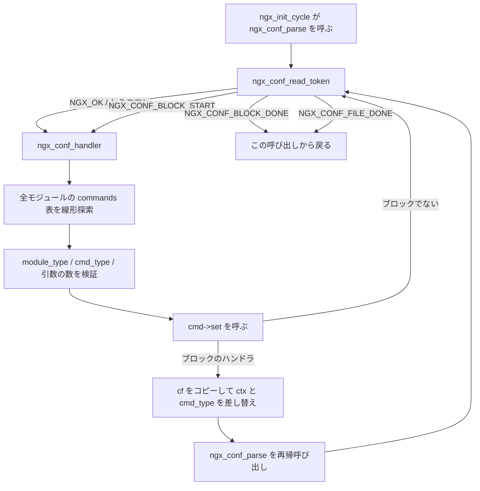

## この層の責務

`nginx.conf` を読んで、実行時のデータ構造を組み立てる。担当は `src/core/ngx_conf_file.c` の 1486 行で、そこには 3 つの関数しか要らない。

- `ngx_conf_read_token()` — バイト列からトークンを 1 個ぶん切り出す
- `ngx_conf_handler()` — 切り出したトークン列を、どのモジュールのどのディレクティブか特定して実行する
- `ngx_conf_parse()` — この 2 つをループで回し、ブロックに入ったら自分自身を呼ぶ

Nginx の設定言語には、四則演算も、条件式の評価も、変数の代入もない。あるのは「単語の並びを `;` か `{` で区切る」という規則だけだ。だからパーサは再帰下降でも LL でもなく、**状態変数を持った 1 本のループ**で足りる。

一方で、この層はただ読むだけでは終わらない。`http {}` に入った瞬間に全 HTTP モジュールの設定構造体が確保され、`}` に出るときにマージと木の構築とフェーズ配列の畳み込みが走る。**設定パースは「読む」段であると同時に「実行時のデータ構造を組み立てる」段でもある。**

語彙としては、[what-is-a-web-server](../what-is-a-web-server/) で挙げた「どこに何を返すかの規則」を、ここで C の構造体に変換していることになる。

## 主要な型とその関係

### `ngx_conf_t` — パーサの現在位置

[`src/core/ngx_conf_file.h#L116-L132`](https://github.com/nginx/nginx/blob/release-1.31.4/src/core/ngx_conf_file.h#L116-L132)。

```c title="src/core/ngx_conf_file.h"
struct ngx_conf_s {
    char                 *name;
    ngx_array_t          *args;

    ngx_cycle_t          *cycle;
    ngx_pool_t           *pool;
    ngx_pool_t           *temp_pool;
    ngx_conf_file_t      *conf_file;
    ngx_log_t            *log;

    void                 *ctx;
    ngx_uint_t            module_type;
    ngx_uint_t            cmd_type;

    ngx_conf_handler_pt   handler;
    void                 *handler_conf;
};
```

この構造体 1 個が、パーサのスタックフレームであり文脈でもある。

- `args` は今切り出したトークン列。`ngx_array_t` の要素は `ngx_str_t` で、`args->elts[0]` がディレクティブ名、以降が引数
- `conf_file` は読んでいるファイルと、その読み込みバッファと行番号
- `ctx` は「今どのブロックの中にいるか」に対応する設定コンテキスト。`http {}` の中なら `ngx_http_conf_ctx_t *`
- `module_type` と `cmd_type` が、今受け付けてよいディレクティブの範囲を決める
- `handler` が非 `NULL` のときは、`commands` 表を引かずにこの関数を呼ぶ。`types { text/html html; }` のように、ディレクティブ名が固定でないブロックのため

`ngx_conf_t` はブロックに入るとき値ごとコピーされ、出るときに戻される。

```c title="src/http/ngx_http_core_module.c (ngx_http_core_location の一部)"
    save = *cf;
    cf->ctx = ctx;
    cf->cmd_type = NGX_HTTP_LOC_CONF;

    rv = ngx_conf_parse(cf, NULL);

    *cf = save;
```

[`#L3307-L3313`](https://github.com/nginx/nginx/blob/release-1.31.4/src/http/ngx_http_core_module.c#L3307-L3313)。`save = *cf` と `*cf = save` で挟むこの形が、`http {}` にも `server {}` にも `types {}` にも出てくる。**ブロックの入退場は、構造体 1 個の退避と復元で表現されている。**

### `ngx_command_t` — ディレクティブ 1 個の宣言

[`src/core/ngx_conf_file.h#L77-L86`](https://github.com/nginx/nginx/blob/release-1.31.4/src/core/ngx_conf_file.h#L77-L86)。

```c title="src/core/ngx_conf_file.h"
struct ngx_command_s {
    ngx_str_t             name;
    ngx_uint_t            type;
    char               *(*set)(ngx_conf_t *cf, ngx_command_t *cmd, void *conf);
    ngx_uint_t            conf;
    ngx_uint_t            offset;
    void                 *post;
};

#define ngx_null_command  { ngx_null_string, 0, NULL, 0, 0, NULL }
```

6 フィールドの意味はこうなる。

- `name` — 設定ファイルに書かれる文字列そのもの
- `type` — ビットの集合。「どのブロックに書けるか」と「引数は何個か」の両方が入る
- `set` — 値を解釈して格納する関数
- `conf` — `ngx_http_conf_ctx_t` の中の `main_conf` / `srv_conf` / `loc_conf` のどれを使うか。`offsetof` の値が入る
- `offset` — その設定構造体の中の何バイト目に書くか。これも `offsetof`
- `post` — `set` が値を書いた後に呼ばれるフック。範囲チェックや非推奨警告に使う

`commands` はこの構造体の配列で、末尾は `ngx_null_command`。走査は `for ( ; cmd->name.len; cmd++)` の形になり、要素数を持たない。

もっとも小さい例が `include` だ ([`src/core/ngx_conf_file.c#L19-L29`](https://github.com/nginx/nginx/blob/release-1.31.4/src/core/ngx_conf_file.c#L19-L29))。

```c title="src/core/ngx_conf_file.c"
static ngx_command_t  ngx_conf_commands[] = {

    { ngx_string("include"),
      NGX_ANY_CONF|NGX_CONF_TAKE1,
      ngx_conf_include,
      0,
      0,
      NULL },

      ngx_null_command
};
```

`conf` も `offset` も `0` なのは、`include` が何も格納しないからだ。`set` の中で完結する。

### `type` のビット割り当て

[`src/core/ngx_conf_file.h#L16-L52`](https://github.com/nginx/nginx/blob/release-1.31.4/src/core/ngx_conf_file.h#L16-L52)。冒頭にビットの地図がコメントで置かれている。

```c title="src/core/ngx_conf_file.h"
/*
 *        AAAA  number of arguments
 *      FF      command flags
 *    TT        command type, i.e. HTTP "location" or "server" command
 */

#define NGX_CONF_NOARGS      0x00000001
#define NGX_CONF_TAKE1       0x00000002
#define NGX_CONF_TAKE2       0x00000004
#define NGX_CONF_TAKE3       0x00000008
#define NGX_CONF_TAKE4       0x00000010
#define NGX_CONF_TAKE5       0x00000020
#define NGX_CONF_TAKE6       0x00000040
#define NGX_CONF_TAKE7       0x00000080

#define NGX_CONF_MAX_ARGS    8

#define NGX_CONF_ARGS_NUMBER 0x000000ff
#define NGX_CONF_BLOCK       0x00000100
#define NGX_CONF_FLAG        0x00000200
#define NGX_CONF_ANY         0x00000400
#define NGX_CONF_1MORE       0x00000800
#define NGX_CONF_2MORE       0x00001000

#define NGX_DIRECT_CONF      0x00010000

#define NGX_MAIN_CONF        0x01000000
#define NGX_ANY_CONF         0xFF000000
```

`0x000000ff` の 8 ビットが引数の個数。`NGX_CONF_TAKE12` のような合成マクロは、単に `TAKE1|TAKE2` の別名だ。「1 個でも 2 個でもよい」を 1 個のビット列で表せる。

`NGX_CONF_BLOCK` は `{` を伴うディレクティブ、`NGX_CONF_FLAG` は `on` / `off` を 1 個取るもの、`NGX_CONF_ANY` は個数の検査をしないもの、`NGX_CONF_1MORE` / `2MORE` は最低個数の指定だ。

上位バイトがコンテキストになる。`NGX_MAIN_CONF` はファイルの最上位。HTTP のものは [`src/http/ngx_http_config.h#L41-L47`](https://github.com/nginx/nginx/blob/release-1.31.4/src/http/ngx_http_config.h#L41-L47) にある。

```c title="src/http/ngx_http_config.h"
#define NGX_HTTP_MAIN_CONF        0x02000000
#define NGX_HTTP_SRV_CONF         0x04000000
#define NGX_HTTP_LOC_CONF         0x08000000
#define NGX_HTTP_UPS_CONF         0x10000000
#define NGX_HTTP_SIF_CONF         0x20000000
#define NGX_HTTP_LIF_CONF         0x40000000
#define NGX_HTTP_LMT_CONF         0x80000000
```

`UPS` は `upstream {}`、`SIF` は `server {}` 直下の `if {}`、`LIF` は `location {}` の中の `if {}`、`LMT` は `limit_except {}`。7 個のブロックがあり、ちょうど 7 ビット使う。`NGX_MAIN_CONF` と合わせて上位 8 ビットが埋まる。

ここで注意が要る。`NGX_STREAM_MAIN_CONF` も `NGX_MAIL_MAIN_CONF` も `NGX_EVENT_CONF` も、値は同じ `0x02000000` だ。**ビットはモジュール種別をまたいで再利用されている。** 衝突しないのは、`ngx_conf_handler()` がビットを見る前に `module_type` を突き合わせるからだ。

`set` に渡す設定構造体を選ぶための `conf` フィールドは、`offsetof` のマクロで与えられる ([`src/http/ngx_http_config.h#L50-L52`](https://github.com/nginx/nginx/blob/release-1.31.4/src/http/ngx_http_config.h#L50-L52))。

```c title="src/http/ngx_http_config.h"
#define NGX_HTTP_MAIN_CONF_OFFSET  offsetof(ngx_http_conf_ctx_t, main_conf)
#define NGX_HTTP_SRV_CONF_OFFSET   offsetof(ngx_http_conf_ctx_t, srv_conf)
#define NGX_HTTP_LOC_CONF_OFFSET   offsetof(ngx_http_conf_ctx_t, loc_conf)
```

## 処理の流れ



### `ngx_conf_parse()` の 3 つのモード

[`src/core/ngx_conf_file.c#L157-L352`](https://github.com/nginx/nginx/blob/release-1.31.4/src/core/ngx_conf_file.c#L157-L352)。関数の先頭でローカルな `enum` が宣言される。

```c title="src/core/ngx_conf_file.c"
char *
ngx_conf_parse(ngx_conf_t *cf, ngx_str_t *filename)
{
    char             *rv;
    ngx_fd_t          fd;
    ngx_int_t         rc;
    ngx_buf_t         buf;
    ngx_conf_file_t  *prev, conf_file;
    enum {
        parse_file = 0,
        parse_block,
        parse_param
    } type;
```

モードは引数と `cf` の状態から決まる ([`#L176-L239`](https://github.com/nginx/nginx/blob/release-1.31.4/src/core/ngx_conf_file.c#L176-L239))。

```c title="src/core/ngx_conf_file.c"
    if (filename) {

        /* open configuration file */
        /* ... open, バッファ確保, conf_file の初期化 ... */

        type = parse_file;

        /* ... 設定ダンプの準備 ... */

    } else if (cf->conf_file->file.fd != NGX_INVALID_FILE) {

        type = parse_block;

    } else {
        type = parse_param;
    }
```

- `parse_file` — ファイル名が渡された。`ngx_init_cycle()` からの最初の呼び出しと、`include` からの呼び出しがこれ
- `parse_block` — ファイル名は `NULL` で、しかし読み込み中のファイルがある。`{` の中身を読んでいる
- `parse_param` — ファイル名も `NULL` でファイルもない。`-g` オプションでコマンドラインから渡された設定断片

モードの違いは終端の扱いに現れる。

```c title="src/core/ngx_conf_file.c"
        if (rc == NGX_CONF_BLOCK_DONE) {

            if (type != parse_block) {
                ngx_conf_log_error(NGX_LOG_EMERG, cf, 0, "unexpected \"}\"");
                goto failed;
            }

            goto done;
        }

        if (rc == NGX_CONF_FILE_DONE) {

            if (type == parse_block) {
                ngx_conf_log_error(NGX_LOG_EMERG, cf, 0,
                                   "unexpected end of file, expecting \"}\"");
                goto failed;
            }

            goto done;
        }
```

`}` を見たときに `parse_block` でなければ余計な `}`、ファイル終端に達したときに `parse_block` なら `}` の閉じ忘れ。**括弧の対応の検査が、再帰の深さと終端トークンの照合だけで済んでいる。** カウンタもスタックも要らない。

`parse_param` はさらに `{` そのものを拒否し、`"block directives are not supported in -g option"` を返す。`-g` で渡せるのは `daemon off;` のような 1 行ディレクティブだけ、という制限がここで実装されている。呼び出し元は [`#L62-L98`](https://github.com/nginx/nginx/blob/release-1.31.4/src/core/ngx_conf_file.c#L62-L98) の `ngx_conf_param()` で、文字列をそのまま `ngx_buf_t` に見立ててから `ngx_conf_parse(cf, NULL)` を呼ぶ。`fd` は `NGX_INVALID_FILE` のままにしてあるので、モード判定が `parse_param` に落ちる。

ループ本体は 30 行ほどしかない ([`#L242-L324`](https://github.com/nginx/nginx/blob/release-1.31.4/src/core/ngx_conf_file.c#L242-L324))。

```c title="src/core/ngx_conf_file.c"
    for ( ;; ) {
        rc = ngx_conf_read_token(cf);

        /*
         * ngx_conf_read_token() may return
         *
         *    NGX_ERROR             there is error
         *    NGX_OK                the token terminated by ";" was found
         *    NGX_CONF_BLOCK_START  the token terminated by "{" was found
         *    NGX_CONF_BLOCK_DONE   the "}" was found
         *    NGX_CONF_FILE_DONE    the configuration file is done
         */

        /* ... 4 つの rc について分岐 ... */

        if (cf->handler) {
            /* the custom handler, i.e., that is used in the http's
               "types { ... }" directive */
            /* ... */
        }

        rc = ngx_conf_handler(cf, rc);

        if (rc == NGX_ERROR) {
            goto failed;
        }
    }
```

再帰呼び出しはここには現れない。`ngx_conf_handler()` が `cmd->set` を呼び、その `set` が `ngx_conf_parse()` を呼び直す。**再帰の輪はコアとモジュールをまたいで閉じている。**

### `ngx_conf_read_token()` — 1 バイトずつ状態を持つ

[`src/core/ngx_conf_file.c#L502-L817`](https://github.com/nginx/nginx/blob/release-1.31.4/src/core/ngx_conf_file.c#L502-L817)。300 行あるが、状態はローカル変数 9 個だけだ ([`#L514-L523`](https://github.com/nginx/nginx/blob/release-1.31.4/src/core/ngx_conf_file.c#L514-L523))。

```c title="src/core/ngx_conf_file.c"
    found = 0;
    need_space = 0;
    last_space = 1;
    sharp_comment = 0;
    variable = 0;
    quoted = 0;
    s_quoted = 0;
    d_quoted = 0;

    cf->args->nelts = 0;
```

`last_space` が「直前が区切りだった = 今は単語の外」、`need_space` が「単語が閉じたので次は区切りが要る」、`quoted` がバックスラッシュ直後、`s_quoted` / `d_quoted` がシングル / ダブルクォートの中、`sharp_comment` が `#` から行末まで、`variable` が `$` 直後。

`cf->args->nelts = 0` に注意する。配列を作り直すのではなく、要素数をゼロに戻して使い回す。`ngx_array_t` の確保済み領域はそのまま残るので、**トークン読みのたびにアロケートが走らない**。

読み進める本体は 1 文字取ってから、状態を上から順に潰していく ([`#L613-L656`](https://github.com/nginx/nginx/blob/release-1.31.4/src/core/ngx_conf_file.c#L613-L656))。

```c title="src/core/ngx_conf_file.c"
        ch = *b->pos++;

        if (ch == LF) {
            cf->conf_file->line++;

            if (sharp_comment) {
                sharp_comment = 0;
            }
        }

        if (sharp_comment) {
            continue;
        }

        if (quoted) {
            quoted = 0;
            continue;
        }

        if (need_space) {
            if (ch == ' ' || ch == '\t' || ch == CR || ch == LF) {
                last_space = 1;
                need_space = 0;
                continue;
            }

            if (ch == ';') {
                return NGX_OK;
            }

            if (ch == '{') {
                return NGX_CONF_BLOCK_START;
            }

            if (ch == ')') {
                last_space = 1;
                need_space = 0;

            } else {
                /* ... "unexpected %c" でエラー ... */
                return NGX_ERROR;
            }
        }
```

行番号のカウントが最初に来る。エラーメッセージの行番号は、コメントやクォートの中でもずれない。

`need_space` の分岐で `)` が特別扱いされているのは、`if ($request_method = POST)` のような書き方のためだ。閉じ括弧はクォートされた単語の直後に来てよい。

単語の外 (`last_space`) では、記号を `switch` で捌く ([`#L667-L720`](https://github.com/nginx/nginx/blob/release-1.31.4/src/core/ngx_conf_file.c#L667-L720))。

```c title="src/core/ngx_conf_file.c"
            switch (ch) {

            case ';':
            case '{':
                if (cf->args->nelts == 0) {
                    /* ... "unexpected %c" でエラー ... */
                    return NGX_ERROR;
                }

                if (ch == '{') {
                    return NGX_CONF_BLOCK_START;
                }

                return NGX_OK;

            case '}':
                if (cf->args->nelts != 0) {
                    /* ... "unexpected }" でエラー ... */
                    return NGX_ERROR;
                }

                return NGX_CONF_BLOCK_DONE;

            case '#':
                sharp_comment = 1;
                continue;

            case '\\':
                quoted = 1;
                last_space = 0;
                continue;

            case '"':
                start++;
                d_quoted = 1;
                last_space = 0;
                continue;

            /* ... '\'' も同じ形で s_quoted を立てる ... */

            case '$':
                variable = 1;
                last_space = 0;
                continue;

            default:
                last_space = 0;
            }
```

`}` は `args` が空のときしか許されない。`gzip on }` のような書き方はここで落ちる。`"` と `'` で `start++` しているのは、開きクォートを単語の中身から外すためだ。

単語の中 (`last_space` が 0) では、`variable` フラグが効いてくる。

```c title="src/core/ngx_conf_file.c"
        } else {
            if (ch == '{' && variable) {
                continue;
            }

            variable = 0;
```

`${host}` の `{` をブロック開始と誤読しないための 1 行だ。`$` の直後の `{` だけが単語の一部として扱われる。設定に書かれた `$変数` の実際の評価は [variables](../variables/) が扱う。

単語が閉じたら `cf->args` に積む ([`#L760-L814`](https://github.com/nginx/nginx/blob/release-1.31.4/src/core/ngx_conf_file.c#L760-L814))。

```c title="src/core/ngx_conf_file.c"
            if (found) {
                word = ngx_array_push(cf->args);
                /* ... */
                word->data = ngx_pnalloc(cf->pool, b->pos - 1 - start + 1);
                /* ... */

                for (dst = word->data, src = start, len = 0;
                     src < b->pos - 1;
                     len++)
                {
                    if (*src == '\\') {
                        switch (src[1]) {
                        case '"':
                        case '\'':
                        case '\\':
                            src++;
                            break;

                        case 't':
                            *dst++ = '\t';
                            src += 2;
                            continue;

                        /* ... 'r' と 'n' も同じ形 ... */
                        }

                    }
                    *dst++ = *src++;
                }
                *dst = '\0';
                word->len = len;

                if (ch == ';') {
                    return NGX_OK;
                }

                if (ch == '{') {
                    return NGX_CONF_BLOCK_START;
                }

                found = 0;
            }
```

エスケープの解除はこのコピーの最中に行う。認識するのは `\"` `\'` `\\` `\t` `\r` `\n` の 6 通りだけ。`\x41` のような数値エスケープはない。

`word->len` は `len` カウンタから取り、`*dst = '\0'` も打つ。`ngx_str_t` は長さを持つが、**終端の `NUL` も同時に置かれる**。`set` 関数が `ngx_atoi(value[1].data, value[1].len)` と `ngx_strcasecmp(value[1].data, (u_char *) "on")` を同じデータに対して使い分けられるのはこのためだ。

読み込みバッファは 4096 バイト固定 ([`#L11`](https://github.com/nginx/nginx/blob/release-1.31.4/src/core/ngx_conf_file.c#L11))。

```c title="src/core/ngx_conf_file.c"
#define NGX_CONF_BUFFER  4096
```

バッファを使い切ったとき、まだ単語の途中なら未確定部分を先頭に `ngx_memmove` してから次を読む。1 つの単語が 4096 バイトを超えると詰む ([`#L555-L577`](https://github.com/nginx/nginx/blob/release-1.31.4/src/core/ngx_conf_file.c#L555-L577))。

```c title="src/core/ngx_conf_file.c"
            len = b->pos - start;

            if (len == NGX_CONF_BUFFER) {
                cf->conf_file->line = start_line;

                if (d_quoted) {
                    ch = '"';

                } else if (s_quoted) {
                    ch = '\'';

                } else {
                    /* ... "too long parameter ..." started ... */
                    return NGX_ERROR;
                }

                ngx_conf_log_error(NGX_LOG_EMERG, cf, 0,
                                   "too long parameter, probably "
                                   "missing terminating \"%c\" character", ch);
                return NGX_ERROR;
            }
```

クォートの中でこれが起きたときは、閉じ忘れの可能性が高い。だからメッセージを変えている。**バッファ長の上限が、そのまま設定ファイルの文法上の制約になっている。**

### `ngx_conf_handler()` — 名前で全モジュールを線形に探す

[`src/core/ngx_conf_file.c#L355-L499`](https://github.com/nginx/nginx/blob/release-1.31.4/src/core/ngx_conf_file.c#L355-L499)。ハッシュも索引も作らず、二重ループで総当たりする。

```c title="src/core/ngx_conf_file.c"
    name = cf->args->elts;

    found = 0;

    for (i = 0; cf->cycle->modules[i]; i++) {

        cmd = cf->cycle->modules[i]->commands;
        if (cmd == NULL) {
            continue;
        }

        for ( /* void */ ; cmd->name.len; cmd++) {

            if (name->len != cmd->name.len) {
                continue;
            }

            if (ngx_strcmp(name->data, cmd->name.data) != 0) {
                continue;
            }

            found = 1;
```

まず長さで弾いてから `ngx_strcmp`。設定ファイルのディレクティブは多くて数千行なので、モジュール数×ディレクティブ数の総当たりでも起動時間に響かない。索引を作るコストのほうが高い。

`found = 1` は名前が一致した時点で立つ。ここから 3 段の関門がある。

```c title="src/core/ngx_conf_file.c"
            if (cf->cycle->modules[i]->type != NGX_CONF_MODULE
                && cf->cycle->modules[i]->type != cf->module_type)
            {
                continue;
            }

            /* is the directive's location right ? */

            if (!(cmd->type & cf->cmd_type)) {
                continue;
            }

            if (!(cmd->type & NGX_CONF_BLOCK) && last != NGX_OK) {
                ngx_conf_log_error(NGX_LOG_EMERG, cf, 0,
                                  "directive \"%s\" is not terminated by \";\"",
                                  name->data);
                return NGX_ERROR;
            }

            if ((cmd->type & NGX_CONF_BLOCK) && last != NGX_CONF_BLOCK_START) {
                ngx_conf_log_error(NGX_LOG_EMERG, cf, 0,
                                   "directive \"%s\" has no opening \"{\"",
                                   name->data);
                return NGX_ERROR;
            }
```

1 段目がモジュール種別の照合。`NGX_CONF_MODULE` (`include` を持つモジュール) だけは無条件で通る。これが `NGX_ANY_CONF` と組み合わさって、`include` をどこにでも書けるようにしている。

2 段目がコンテキストのビット照合。上位バイトが種別をまたいで再利用されていても、1 段目を通過している時点で解釈が確定している。

3 段目が `;` と `{` の照合。`ngx_conf_read_token()` の戻り値がそのまま `last` として渡ってきているので、`server;` や `gzip on {` はここで落ちる。

不一致のときは `continue` で次のディレクティブへ進む。`return` しないのが重要で、**同じ名前のディレクティブが別のモジュールに存在してよい**。`ssl_certificate` が http と mail と stream にそれぞれある、といった状況がこれで成り立つ。

全部走り終わって一致がなかったときのメッセージは 2 通りになる ([`#L480-L488`](https://github.com/nginx/nginx/blob/release-1.31.4/src/core/ngx_conf_file.c#L480-L488))。

```c title="src/core/ngx_conf_file.c"
    if (found) {
        ngx_conf_log_error(NGX_LOG_EMERG, cf, 0,
                           "\"%s\" directive is not allowed here", name->data);

        return NGX_ERROR;
    }

    ngx_conf_log_error(NGX_LOG_EMERG, cf, 0,
                       "unknown directive \"%s\"", name->data);
```

`found` が立っていれば「名前は存在するが、ここには書けない」。立っていなければ「そんなディレクティブは無い」。**エラーメッセージの出し分けが、テーブルを舐めた結果から自動的に決まる。** モジュール側は何も書いていない。

### 引数の数の検証

[`#L413-L443`](https://github.com/nginx/nginx/blob/release-1.31.4/src/core/ngx_conf_file.c#L413-L443)。

```c title="src/core/ngx_conf_file.c"
            /* is the directive's argument count right ? */

            if (!(cmd->type & NGX_CONF_ANY)) {

                if (cmd->type & NGX_CONF_FLAG) {

                    if (cf->args->nelts != 2) {
                        goto invalid;
                    }

                } else if (cmd->type & NGX_CONF_1MORE) {

                    if (cf->args->nelts < 2) {
                        goto invalid;
                    }

                } else if (cmd->type & NGX_CONF_2MORE) {

                    if (cf->args->nelts < 3) {
                        goto invalid;
                    }

                } else if (cf->args->nelts > NGX_CONF_MAX_ARGS) {

                    goto invalid;

                } else if (!(cmd->type & argument_number[cf->args->nelts - 1]))
                {
                    goto invalid;
                }
            }
```

最後の 1 行がビット照合の本体になる。`argument_number` は [`#L48-L59`](https://github.com/nginx/nginx/blob/release-1.31.4/src/core/ngx_conf_file.c#L48-L59) の定数配列だ。

```c title="src/core/ngx_conf_file.c"
/* The eight fixed arguments */

static ngx_uint_t argument_number[] = {
    NGX_CONF_NOARGS,
    NGX_CONF_TAKE1,
    NGX_CONF_TAKE2,
    NGX_CONF_TAKE3,
    NGX_CONF_TAKE4,
    NGX_CONF_TAKE5,
    NGX_CONF_TAKE6,
    NGX_CONF_TAKE7
};
```

`args->nelts` にはディレクティブ名も含まれるので、引数の数は `nelts - 1`。それを添字にしてビットを引き、`cmd->type` と `&` を取る。合っていれば通る。

`NGX_CONF_TAKE12` が `TAKE1|TAKE2` の別名だったことが、ここで効いてくる。**「1 個か 2 個」という条件が、ビット 2 本の `or` と `and` 1 回で判定される。**

不一致は全部同じ `invalid:` ラベルに飛び、`"invalid number of arguments in \"%s\" directive"` になる ([`#L492-L496`](https://github.com/nginx/nginx/blob/release-1.31.4/src/core/ngx_conf_file.c#L492-L496))。

引数の数と書ける場所という 2 つの検証が、`ngx_command_t` を書いた時点で完了している。モジュールの `set` 関数には、この 2 つのチェックが 1 行も書かれていない。

### `conf` と `offset` で格納先を決める

検証を通ると、`set` に渡す `conf` ポインタを決める ([`#L445-L463`](https://github.com/nginx/nginx/blob/release-1.31.4/src/core/ngx_conf_file.c#L445-L463))。

```c title="src/core/ngx_conf_file.c"
            /* set up the directive's configuration context */

            conf = NULL;

            if (cmd->type & NGX_DIRECT_CONF) {
                conf = ((void **) cf->ctx)[cf->cycle->modules[i]->index];

            } else if (cmd->type & NGX_MAIN_CONF) {
                conf = &(((void **) cf->ctx)[cf->cycle->modules[i]->index]);

            } else if (cf->ctx) {
                confp = *(void **) ((char *) cf->ctx + cmd->conf);

                if (confp) {
                    conf = confp[cf->cycle->modules[i]->ctx_index];
                }
            }

            rv = cmd->set(cf, cmd, conf);
```

3 通りある。

`NGX_DIRECT_CONF` は `cf->ctx` を `void **` と見なし、`index` で引く。core モジュールの `worker_processes` などがこれ。

`NGX_MAIN_CONF` は同じ場所の**アドレス**を渡す。`http {}` のように「まだ何も無いところに構造体を作って書き込む」ディレクティブのためで、`set` の中で `*(ngx_http_conf_ctx_t **) conf = ctx;` と代入する。

3 つ目が一般のケースだ。`cf->ctx` に `cmd->conf` バイト足したところが `main_conf` / `srv_conf` / `loc_conf` のいずれかへのポインタで、そこから `ctx_index` で引く。`cmd->conf` は `NGX_HTTP_LOC_CONF_OFFSET` のような `offsetof` の値なので、**`ngx_http_conf_ctx_t` の 3 つのメンバのどれを使うかが、整数 1 個で表現されている**。

`set` 関数側は `cmd->offset` を足すだけでフィールドに届く ([`#L1065-L1089`](https://github.com/nginx/nginx/blob/release-1.31.4/src/core/ngx_conf_file.c#L1065-L1089))。

```c title="src/core/ngx_conf_file.c"
char *
ngx_conf_set_str_slot(ngx_conf_t *cf, ngx_command_t *cmd, void *conf)
{
    char  *p = conf;

    ngx_str_t        *field, *value;
    ngx_conf_post_t  *post;

    field = (ngx_str_t *) (p + cmd->offset);

    if (field->data) {
        return "is duplicate";
    }

    value = cf->args->elts;

    *field = value[1];

    if (cmd->post) {
        post = cmd->post;
        return post->post_handler(cf, post, field);
    }

    return NGX_CONF_OK;
}
```

`conf` を `char *` にキャストして `cmd->offset` を足し、目的の型にキャストし直す。この関数はどのモジュールのどの構造体かを知らない。

数値版も形は同じで、変換の 1 行だけが違う ([`#L1166-L1194`](https://github.com/nginx/nginx/blob/release-1.31.4/src/core/ngx_conf_file.c#L1166-L1194))。

```c title="src/core/ngx_conf_file.c"
    np = (ngx_int_t *) (p + cmd->offset);

    if (*np != NGX_CONF_UNSET) {
        return "is duplicate";
    }

    value = cf->args->elts;
    *np = ngx_atoi(value[1].data, value[1].len);
    if (*np == NGX_ERROR) {
        return "invalid number";
    }
```

同じ形の汎用セッタが 12 本ある。`ngx_conf_set_flag_slot` / `str_slot` / `str_array_slot` / `keyval_slot` / `num_slot` / `size_slot` / `off_slot` / `msec_slot` / `sec_slot` / `bufs_slot` / `enum_slot` / `bitmask_slot`。宣言は [`src/core/ngx_conf_file.h#L280-L292`](https://github.com/nginx/nginx/blob/release-1.31.4/src/core/ngx_conf_file.h#L280-L292) に並んでいる。単一の値を格納するだけのディレクティブは、`set` にこのどれかを書けば専用の関数を書かずに済む。

冒頭の `NGX_CONF_UNSET` 判定と `"is duplicate"` は、未設定を第 3 の状態として持つ仕組みの一部だ。詳細は [conf-merge](../conf-merge/) を参照。

### `include` の glob 展開

[`#L820-L883`](https://github.com/nginx/nginx/blob/release-1.31.4/src/core/ngx_conf_file.c#L820-L883)。

```c title="src/core/ngx_conf_file.c"
    value = cf->args->elts;
    file = value[1];

    if (ngx_conf_full_name(cf->cycle, &file, 1) != NGX_OK) {
        return NGX_CONF_ERROR;
    }

    if (strpbrk((char *) file.data, "*?[") == NULL) {

        return ngx_conf_parse(cf, &file);
    }

    ngx_memzero(&gl, sizeof(ngx_glob_t));

    gl.pattern = file.data;
    gl.log = cf->log;
    gl.test = 1;

    /* ... ngx_open_glob ... */

    for ( ;; ) {
        n = ngx_read_glob(&gl, &name);

        if (n != NGX_OK) {
            break;
        }

        file.len = name.len++;
        file.data = ngx_pstrdup(cf->pool, &name);
        /* ... */

        rv = ngx_conf_parse(cf, &file);

        if (rv != NGX_CONF_OK) {
            break;
        }
    }
```

`*` `?` `[` のどれも含まなければ、glob を開かずにそのまま `ngx_conf_parse()` を呼ぶ。含む場合は展開して 1 個ずつ。どちらの経路でも `ngx_conf_parse()` に飛ぶので、`include` の中でさらに `include` してもよい。

`ngx_conf_parse()` はファイルを開いた側が `cf->conf_file` を退避し、`done:` ラベルで復元する。だから `include` から戻ったとき、行番号もファイル名も元のファイルのものに戻る。

`gl.test = 1` は、パターンに一致するファイルが 0 個でもエラーにしない設定だ。

### `http {}` は特別

`http` ディレクティブの宣言は [`src/http/ngx_http.c#L86-L96`](https://github.com/nginx/nginx/blob/release-1.31.4/src/http/ngx_http.c#L86-L96) にある。

```c title="src/http/ngx_http.c"
static ngx_command_t  ngx_http_commands[] = {

    { ngx_string("http"),
      NGX_MAIN_CONF|NGX_CONF_BLOCK|NGX_CONF_NOARGS,
      ngx_http_block,
      0,
      0,
      NULL },

      ngx_null_command
};
```

`set` にあたる `ngx_http_block()` は 220 行あり ([`#L122-L340`](https://github.com/nginx/nginx/blob/release-1.31.4/src/http/ngx_http.c#L122-L340))、その中で再帰パースは 1 行しかない。残りは全部データ構造の組み立てだ。

```c title="src/http/ngx_http.c"
    /* count the number of the http modules and set up their indices */

    ngx_http_max_module = ngx_count_modules(cf->cycle, NGX_HTTP_MODULE);
```

まず HTTP モジュールの `ctx_index` を採番する ([`#L150`](https://github.com/nginx/nginx/blob/release-1.31.4/src/http/ngx_http.c#L150))。ここから先はモジュールを追加できなくなる ([module-system](../module-system/))。

```c title="src/http/ngx_http.c"
    for (m = 0; cf->cycle->modules[m]; m++) {
        /* ... NGX_HTTP_MODULE だけ ... */
        module = cf->cycle->modules[m]->ctx;
        mi = cf->cycle->modules[m]->ctx_index;

        if (module->create_main_conf) {
            ctx->main_conf[mi] = module->create_main_conf(cf);
        }

        if (module->create_srv_conf) {
            ctx->srv_conf[mi] = module->create_srv_conf(cf);
        }

        if (module->create_loc_conf) {
            ctx->loc_conf[mi] = module->create_loc_conf(cf);
        }
    }
```

`http {}` 直下にも `srv_conf` と `loc_conf` が作られる ([`#L189-L217`](https://github.com/nginx/nginx/blob/release-1.31.4/src/http/ngx_http.c#L189-L217))。ソース中のコメントは `the http null srv_conf context, it is used to merge the server{}s' srv_conf's` と書いている。マージの相手として使うためのダミーだ。

その後 `preconfiguration` を全モジュールぶん呼び、ようやく再帰に入る ([`#L236-L240`](https://github.com/nginx/nginx/blob/release-1.31.4/src/http/ngx_http.c#L236-L240))。

```c title="src/http/ngx_http.c"
    /* parse inside the http{} block */

    cf->module_type = NGX_HTTP_MODULE;
    cf->cmd_type = NGX_HTTP_MAIN_CONF;
    rv = ngx_conf_parse(cf, NULL);
```

`module_type` と `cmd_type` をここで切り替える。この 2 行が、`ngx_conf_handler()` の 1 段目と 2 段目の関門の値になる。

`server {}` も `location {}` も同じ形で、`cmd_type` だけを深くしていく。

```c title="src/http/ngx_http_core_module.c (ngx_http_core_server の一部)"
    pcf = *cf;
    cf->ctx = ctx;
    cf->cmd_type = NGX_HTTP_SRV_CONF;

    rv = ngx_conf_parse(cf, NULL);

    *cf = pcf;
```

[`#L3063-L3069`](https://github.com/nginx/nginx/blob/release-1.31.4/src/http/ngx_http_core_module.c#L3063-L3069)。**`http { server { location { } } }` の入れ子は、`ngx_conf_parse()` の C スタック上の深さそのものになる。**

`ngx_conf_parse()` から戻った後の `ngx_http_block()` が本題だ。ここで 5 つのことが順に起きる。

```c title="src/http/ngx_http.c"
    for (m = 0; cf->cycle->modules[m]; m++) {
        /* ... NGX_HTTP_MODULE だけ ... */

        /* init http{} main_conf's */

        if (module->init_main_conf) {
            rv = module->init_main_conf(cf, ctx->main_conf[mi]);
        }

        rv = ngx_http_merge_servers(cf, cmcf, module, mi);
    }


    /* create location trees */

    for (s = 0; s < cmcf->servers.nelts; s++) {

        clcf = cscfp[s]->ctx->loc_conf[ngx_http_core_module.ctx_index];

        ngx_http_init_locations(cf, cscfp[s], clcf);
        ngx_http_init_static_location_trees(cf, clcf);
    }


    ngx_http_init_phases(cf, cmcf);
    ngx_http_init_headers_in_hash(cf, cmcf);
```

[`#L251-L300`](https://github.com/nginx/nginx/blob/release-1.31.4/src/http/ngx_http.c#L251-L300)。エラー処理は省いてある。

1. `init_main_conf` で `http {}` 唯一の設定を確定させる
2. `ngx_http_merge_servers()` で `server {}` と `location {}` の設定を親から埋める ([conf-merge](../conf-merge/))
3. `ngx_http_init_locations()` と `ngx_http_init_static_location_trees()` で、`location` のリストを検索用の木に変える ([virtual-server-location](../virtual-server-location/))
4. `ngx_http_init_phases()` でフェーズごとのハンドラ配列を用意する
5. `ngx_http_init_headers_in_hash()` でリクエストヘッダ名のハッシュを作る

続いて `postconfiguration` が呼ばれ、各モジュールがフェーズ配列に自分を登録し、出力フィルタチェーンに割り込む ([`#L303-L315`](https://github.com/nginx/nginx/blob/release-1.31.4/src/http/ngx_http.c#L303-L315))。最後に配列がハンドラの列に畳まれる ([`#L329-L338`](https://github.com/nginx/nginx/blob/release-1.31.4/src/http/ngx_http.c#L329-L338))。

```c title="src/http/ngx_http.c"
    if (ngx_http_init_phase_handlers(cf, cmcf) != NGX_OK) {
        return NGX_CONF_ERROR;
    }

    /* optimize the lists of ports, addresses and server names */

    if (ngx_http_optimize_servers(cf, cmcf, cmcf->ports) != NGX_OK) {
        return NGX_CONF_ERROR;
    }
```

`ngx_http_init_phase_handlers()` が何を作るかは [phase-engine](../phase-engine/)、`ngx_http_optimize_servers()` が listen アドレスと `server_name` をどう畳むかは [virtual-server-location](../virtual-server-location/) で扱う。

**`}` を 1 個読んだ結果として、リクエスト処理に必要なデータ構造がすべて完成する。** `nginx -t` が「設定が正しい」と言えるのは、この組み立てを最後まで通したからだ。

### 設定ダンプ

`-T` は `-t` に加えて `ngx_dump_config` を立てる ([`src/core/nginx.c#L839-L842`](https://github.com/nginx/nginx/blob/release-1.31.4/src/core/nginx.c#L839-L842))。設定の検査と、読んだ内容の出力が 1 つのオプションに束ねられている。

このフラグが立っていると、`ngx_conf_parse()` がファイルを開くたびに [`#L101-L154`](https://github.com/nginx/nginx/blob/release-1.31.4/src/core/ngx_conf_file.c#L101-L154) の `ngx_conf_add_dump()` を呼ぶ。ファイルサイズぶんのバッファを確保し、`cf->conf_file->dump` に挿しておく。あとは `ngx_conf_read_token()` が読んだバイトをそのまま複製する。

```c title="src/core/ngx_conf_file.c"
            if (dump) {
                dump->last = ngx_cpymem(dump->last, b->pos, size);
            }
```

同じファイルを 2 回 `include` したときのために、ファイル名をキーにした赤黒木で重複を弾く。すでに登録済みなら `cf->conf_file->dump = NULL` にしてコピーを止める。

出力は `main()` の `-t` の後始末で行われる ([`src/core/nginx.c#L309-L324`](https://github.com/nginx/nginx/blob/release-1.31.4/src/core/nginx.c#L309-L324))。`include` 展開後の全ファイルが、それぞれ `# configuration file <path>:` の見出し付きで標準出力に出る。

パーサが読んだ生バイトをそのまま溜めているので、コメントも空行もそのまま残る。**トークン化した結果ではなく、入力そのものが出る。**

## 守られている不変条件

**`cf->args` の要素数は、ディレクティブ名を含めて 1 以上 8 以下。** `ngx_conf_read_token()` は `args->nelts == 0` の状態で `;` や `{` を見たらエラーにするので、`ngx_conf_handler()` に空の `args` が渡ることはない。上限は `NGX_CONF_MAX_ARGS` の検査で守られる。

**`cf->args->elts[i].data` は `NUL` 終端されている。** `ngx_str_t` は長さを持つが、`ngx_conf_read_token()` は `*dst = '\0'` も打つ。`set` 関数が `ngx_strcasecmp` や `%s` フォーマットにそのまま渡せるのはこの保証があるからだ。

**ブロックに入るときに `*cf` が退避され、出るときに復元される。** `ctx` / `cmd_type` / `module_type` / `handler` を書き換えるのはブロックのハンドラだけで、必ず対になる復元がある。`ngx_conf_parse()` 自身は `conf_file` だけを退避する。

**`ngx_conf_parse()` の再帰の深さと、設定ファイルの `{` の深さが一致する。** `NGX_CONF_BLOCK_DONE` は `parse_block` のときだけ受け付けられ、`NGX_CONF_FILE_DONE` は `parse_block` のときだけ拒否される。片方だけ多い状態が生き残る道はない。

**`cmd->set` の戻り値は `NULL` かエラー文字列。** `NGX_CONF_OK` は `NULL`、`NGX_CONF_ERROR` は `(void *) -1` で、それ以外は `char *` としてそのままメッセージに埋め込まれる。だから `return "is duplicate";` が成立する。

**設定に触るコードは `cmd->conf` と `cmd->offset` を通ってしか構造体に届かない。** `ngx_conf_handler()` はモジュール固有の型を 1 つも知らず、`void *` と `ngx_uint_t` 2 個だけで場所を特定する。

## つまずきどころ

### ディレクティブ名の探索は「最初に見つかった 1 つ」で止まらない

`ngx_conf_handler()` は名前が一致しても、種別・コンテキスト・終端記号のどれかが合わなければ `continue` する。だから 1 つの名前に対して複数の `ngx_command_t` が存在してよく、コンテキストによって別の実装が呼ばれる。

逆に言うと、**あるディレクティブがどのモジュールのものかは、それが書かれた場所を見ないと決まらない**。`nginx.conf` を眺めてディレクティブ名からモジュールを引こうとすると、同名のものがあるときに外す。

### `NGX_CONF_TAKE7` より多い引数は書けない

`argument_number` は 8 要素で、`NGX_CONF_MAX_ARGS` も 8。引数を 8 個以上取りたいディレクティブは `NGX_CONF_ANY` か `NGX_CONF_1MORE` を使い、個数の検査を自前でやることになる。

`NGX_CONF_1MORE` を指定したディレクティブでは、コアが数えるのは「2 個以上あるか」だけだ。上限の検査は `set` 関数の中にある。

### `${var}` の `{` は特別扱いだが、`}` は特別扱いされない

`ngx_conf_read_token()` は単語の中で `$` の直後の `{` だけを読み飛ばす。閉じる `}` は、単語の中にいるかぎり普通の文字として扱われる。`}` がブロック終了と解釈されるのは `last_space` が立っているとき、つまり区切り文字の直後だけだ。

だから `proxy_pass http://$host}` のような書き方は、`}` を含む 1 単語として通ってしまう。文法エラーにはならず、`set` の中で値が変になる。

### 4096 バイトを超える単語は書けない

`NGX_CONF_BUFFER` はコンパイル時定数で、設定では変えられない。長い正規表現や長い Base64 文字列を 1 つの引数に押し込むと `"too long parameter"` で落ちる。

行の長さではなく**単語 1 個の長さ**が上限であることに注意する。ダブルクォートで囲んだ長い文字列も同じ制限にかかる。

### `-t` は設定を読むだけではない

`nginx -t` は `ngx_init_cycle()` を最後まで通す。共有メモリの確保も、`ngx_open_listening_sockets()` による `bind` と `listen` も実行される ([`src/core/ngx_cycle.c#L632-L638`](https://github.com/nginx/nginx/blob/release-1.31.4/src/core/ngx_cycle.c#L632-L638))。

```c title="src/core/ngx_cycle.c"
    if (ngx_open_listening_sockets(cycle) != NGX_OK) {
        goto failed;
    }

    if (!ngx_test_config) {
        ngx_configure_listening_sockets(cycle);
    }
```

起動中の nginx がある状態で `-t` を叩けば、同じポートへの `bind` は当然失敗する。そこで `ngx_open_listening_sockets()` は、`ngx_test_config` が立っているときだけ `EADDRINUSE` を握り潰す ([`src/core/ngx_connection.c#L633`](https://github.com/nginx/nginx/blob/release-1.31.4/src/core/ngx_connection.c#L633))。ソケットオプションの設定 (`ngx_configure_listening_sockets`) も飛ばす。

**`-t` は設定の妥当性だけを見る軽い検査ではない。** パースだけを試す手段は用意されていない。
