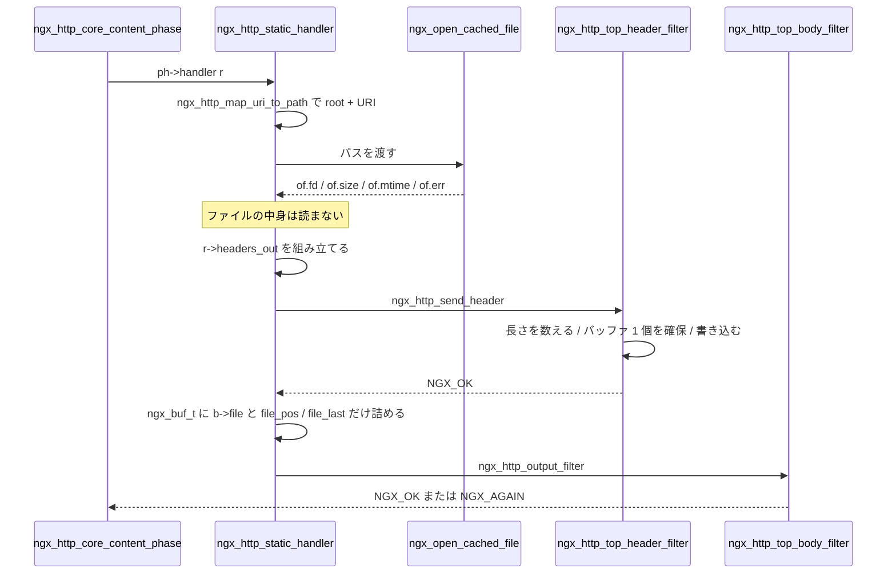

## この層の責務

[フェーズエンジン](../phase-engine/) が CONTENT フェーズに到達したところから、応答のバイト列が出力フィルタチェーンに渡るまでがこの層だ。やることは 3 つある。

1. **誰が応答を作るかを決める。** location に紐づいた専用ハンドラか、フェーズに登録されたハンドラ列か、どちらもいなければ 404。
2. **応答の中身を `ngx_http_request_t` の中に組み立てる。** ヘッダは `r->headers_out` に、ボディは `ngx_chain_t` に。
3. **`ngx_http_send_header()` と `ngx_http_output_filter()` で下流に渡す。**

3 のあと、つまりバイト列がフィルタを通ってソケットに書かれるまでは [出力フィルタチェーンのページ](../output-filter-chain/) の担当になる。この層が渡すのは「何を返すかの記述」であって、バイト列そのものではない。

## 主要な型とその関係

### `r->headers_out`

応答ヘッダの置き場所 ([`src/http/ngx_http_request.h#L262-L298`](https://github.com/nginx/nginx/blob/release-1.31.4/src/http/ngx_http_request.h#L262-L298))。

```c title="src/http/ngx_http_request.h"
typedef struct {
    ngx_list_t                        headers;
    ngx_list_t                        trailers;

    ngx_uint_t                        status;
    ngx_str_t                         status_line;

    ngx_table_elt_t                  *server;
    ngx_table_elt_t                  *date;
    ngx_table_elt_t                  *content_length;
    ngx_table_elt_t                  *location;
    /* ... last_modified, etag, expires, cache_control など ... */

    size_t                            content_type_len;
    ngx_str_t                         content_type;
    ngx_str_t                         charset;
    /* ... */

    off_t                             content_length_n;
    time_t                            last_modified_time;
} ngx_http_headers_out_t;
```

構造が 2 段になっている。**`headers` という汎用のリストと、頻繁に触るヘッダへの専用ポインタが両方ある。** ポインタが指す先は `headers` の要素そのもので、二重に持っているわけではない。`ngx_table_elt_t` の `hash` を 0 にすると、そのヘッダは出力から消える (後述の header filter が `hash == 0` を読み飛ばす)。

数値で持つフィールドが 3 つある。`status` はステータスコードで、`status_line` が空ならコードからテーブル引きで文字列を作る。`content_length_n` は `-1` が「不明」を意味し、**`-1` のまま送ると chunked になる**。`last_modified_time` も `-1` が「未設定」だ。文字列にするのは最後の 1 回だけ、というのがこの層の一貫した方針になっている。

コンテンツハンドラの型は `ngx_http_handler_pt`、つまり `ngx_int_t (*)(ngx_http_request_t *r)`。フェーズハンドラと同じで、違うのは `r->content_handler` に入るか `cmcf->phases[NGX_HTTP_CONTENT_PHASE].handlers` に入るかだけだ。

### `ngx_open_file_cache_t`

`open()` と `stat()` の結果を覚えておく赤黒木 + LRU キュー ([`src/core/ngx_open_file_cache.h#L91-L99`](https://github.com/nginx/nginx/blob/release-1.31.4/src/core/ngx_open_file_cache.h#L91-L99))。

```c title="src/core/ngx_open_file_cache.h"
typedef struct {
    ngx_rbtree_t             rbtree;
    ngx_rbtree_node_t        sentinel;
    ngx_queue_t              expire_queue;

    ngx_uint_t               current;
    ngx_uint_t               max;
    time_t                   inactive;
} ngx_open_file_cache_t;
```

エントリ側 ([`#L56-L88`](https://github.com/nginx/nginx/blob/release-1.31.4/src/core/ngx_open_file_cache.h#L56-L88)) は木のノードとキューのノードを両方埋め込んでいる。名前で引くのが赤黒木、追い出す順を決めるのがキューだ ([赤黒木の使われ方](../timer-rbtree/))。

```c title="src/core/ngx_open_file_cache.h"
struct ngx_cached_open_file_s {
    ngx_rbtree_node_t        node;
    ngx_queue_t              queue;

    u_char                  *name;
    time_t                   created;
    time_t                   accessed;

    ngx_fd_t                 fd;
    ngx_file_uniq_t          uniq;
    time_t                   mtime;
    off_t                    size;
    ngx_err_t                err;

    uint32_t                 uses;
    /* ... */
    unsigned                 count:24;
    /* ... close, use_event, is_dir, is_file, is_link, is_exec ... */
    ngx_event_t             *event;
};
```

`err` がある。**エラーもキャッシュする。** 存在しないパスへのリクエストが毎秒 1 万回来ても、`open()` は `valid` 秒に 1 回しか呼ばれない。時間が 2 つあるのも要点で、`created` と `accessed` に対して `valid` と `inactive` が対応する。

| フィールド | 対になる設定      | 意味                                             |
| ---------- | ----------------- | ------------------------------------------------ |
| `created`  | `of->valid`       | この情報をいつ取ったか。超えたら `stat()` し直す |
| `accessed` | `cache->inactive` | 最後に参照された時刻。超えたらエントリごと捨てる |

`valid` は**正しさ**の期限、`inactive` は**居座り**の期限で、役割が違う。`count:24` は今このエントリの fd を使っているリクエストの本数で、0 でないと fd を閉じられない。

## 処理の流れ



### 1. CONTENT フェーズの 3 通りの入り方

[`src/http/ngx_http_core_module.c#L1294-L1344`](https://github.com/nginx/nginx/blob/release-1.31.4/src/http/ngx_http_core_module.c#L1294-L1344)。

```c title="src/http/ngx_http_core_module.c"
    if (r->content_handler) {
        r->write_event_handler = ngx_http_request_empty_handler;
        ngx_http_finalize_request(r, r->content_handler(r));
        return NGX_OK;
    }
    /* ... */
    rc = ph->handler(r);

    if (rc != NGX_DECLINED) {
        ngx_http_finalize_request(r, rc);
        return NGX_OK;
    }

    /* rc == NGX_DECLINED */

    ph++;

    if (ph->checker) {
        r->phase_handler++;
        return NGX_AGAIN;
    }

    /* no content handler was found */

    if (r->uri.data[r->uri.len - 1] == '/') {
        /* ... "directory index of ... is forbidden" ... */
        ngx_http_finalize_request(r, NGX_HTTP_FORBIDDEN);
        return NGX_OK;
    }

    ngx_http_finalize_request(r, NGX_HTTP_NOT_FOUND);
    return NGX_OK;
```

**`r->content_handler`。** location に `proxy_pass` / `fastcgi_pass` / `return` などが書かれていると、こちらが使われる。設定するのは `ngx_http_update_location_config()` の最後の 3 行 ([`#L1424-L1426`](https://github.com/nginx/nginx/blob/release-1.31.4/src/http/ngx_http_core_module.c#L1424-L1426))。

```c title="src/http/ngx_http_core_module.c"
    if (clcf->handler) {
        r->content_handler = clcf->handler;
    }
```

`clcf->handler` はディレクティブのハンドラが設定する。`proxy_pass` を書くと `clcf->handler = ngx_http_proxy_handler` になる、という単純な仕掛けだ。`ngx_http_update_location_config()` は FIND_CONFIG フェーズと内部リダイレクトから呼ばれるので、**location が決まるたびに `r->content_handler` が更新される**。FIND_CONFIG は先頭で `r->content_handler = NULL` に戻すので、前の location の値は残らない。同時に `r->write_event_handler` が空関数に差し替わり、以後の再開はコンテンツハンドラが自分で仕込む。フェーズエンジンは呼び出しの直後に役目を終える。

**フェーズハンドラ配列。** `r->content_handler` が無ければ、CONTENT フェーズに登録されたハンドラを `NGX_DECLINED` が返るあいだ順に試す。実行順は `index` → `autoindex` → `static` で、これは `auto/modules` の並びを畳み込み時に反転した結果だ ([フェーズエンジンのページ](../phase-engine/))。`index` は URI が `/` で終わっていなければ即 `NGX_DECLINED` ([`src/http/modules/ngx_http_index_module.c#L112-L114`](https://github.com/nginx/nginx/blob/release-1.31.4/src/http/modules/ngx_http_index_module.c#L112-L114))、`static` は逆に `/` で終わっていれば `NGX_DECLINED` を返す。**URI の末尾 1 文字で担当が分かれている。**

**どちらもいない場合。** `ph++` した先の `checker` が NULL なら配列の終端で、URI が `/` で終わっていれば 403、そうでなければ 404 になる。ディレクトリなのに `index` も `autoindex` も応じなかった、という状況を 403 で表している。

### 2. `ngx_http_static_handler()` を全部読む

[`src/http/modules/ngx_http_static_module.c#L48-L278`](https://github.com/nginx/nginx/blob/release-1.31.4/src/http/modules/ngx_http_static_module.c#L48-L278)。230 行だが、やっていることは 5 段しかない。

まず担当かどうかを決める。

```c title="src/http/modules/ngx_http_static_module.c"
    if (!(r->method & (NGX_HTTP_GET|NGX_HTTP_HEAD|NGX_HTTP_POST))) {
        return NGX_HTTP_NOT_ALLOWED;
    }

    if (r->uri.data[r->uri.len - 1] == '/') {
        return NGX_DECLINED;
    }
```

**パスを作る。** `ngx_http_map_uri_to_path()` ([`src/http/ngx_http_core_module.c#L1949-L2020`](https://github.com/nginx/nginx/blob/release-1.31.4/src/http/ngx_http_core_module.c#L1949-L2020)) が `root` / `alias` と URI からファイルシステム上のパスを組む。

```c title="src/http/ngx_http_core_module.c"
    if (clcf->root_lengths == NULL) {

        *root_length = clcf->root.len;

        path->len = clcf->root.len + reserved + r->uri.len - alias + 1;

        path->data = ngx_pnalloc(r->pool, path->len);
        /* ... */
        last = ngx_copy(path->data, clcf->root.data, clcf->root.len);

    } else {
        /* ... root に変数が入っている場合はスクリプトを走らせる ... */
    }

    last = ngx_copy(last, r->uri.data + alias, r->uri.len - alias);
    *last = '\0';
```

`alias` の値がそのまま「URI の先頭から何バイト捨てるか」になっている。`root` なら 0、`alias` なら location のパス長。**2 つのディレクティブの差が、コピー開始位置のオフセット 1 個に潰されている。**

`reserved` 引数は呼び出し側が「この後さらに書き足す長さ」を伝えるためのもので、`index` モジュールがインデックスファイル名を継ぎ足すのに使う。static は 0 を渡し、その理由をコメントに書いている — `ngx_http_map_uri_to_path() allocates memory for terminating '\0' so we do not need to reserve memory for '/' for possible redirect`。ディレクトリだったときに末尾へ足す `/` の 1 バイトは、終端の `'\0'` のぶんで足りる。プールから取り直さない ([メモリプールのページ](../memory-pool/))。

**ファイルを開く。** `ngx_open_file_info_t` を設定から埋めて `ngx_open_cached_file()` に渡す。

```c title="src/http/modules/ngx_http_static_module.c"
    ngx_memzero(&of, sizeof(ngx_open_file_info_t));

    of.read_ahead = clcf->read_ahead;
    of.directio = clcf->directio;
    of.valid = clcf->open_file_cache_valid;
    of.min_uses = clcf->open_file_cache_min_uses;
    of.errors = clcf->open_file_cache_errors;
    of.events = clcf->open_file_cache_events;
    /* ... ngx_http_set_disable_symlinks() ... */

    if (ngx_open_cached_file(clcf->open_file_cache, &path, &of, r->pool)
        != NGX_OK)
    {
        switch (of.err) {

        case 0:
            return NGX_HTTP_INTERNAL_SERVER_ERROR;

        case NGX_ENOENT:
        case NGX_ENOTDIR:
        case NGX_ENAMETOOLONG:
            level = NGX_LOG_ERR;
            rc = NGX_HTTP_NOT_FOUND;
            break;

        case NGX_EACCES:
        /* ... EMLINK, ELOOP ... */
            level = NGX_LOG_ERR;
            rc = NGX_HTTP_FORBIDDEN;
            break;

        default:
            level = NGX_LOG_CRIT;
            rc = NGX_HTTP_INTERNAL_SERVER_ERROR;
            break;
        }
        /* ... */
        return rc;
    }
```

**`errno` から HTTP ステータスへの変換表がここにある。** `ENOENT` は 404、`EACCES` は 403、それ以外は 500。`of.err == 0` で失敗したのはメモリ確保などの内部エラーなので 500 になる。この対応表は他のモジュールにもコピーされていて、ファイルを開く全モジュールが同じ変換を持っている。

**ディレクトリなら 301 を返す。**

```c title="src/http/modules/ngx_http_static_module.c"
    if (of.is_dir) {
        /* ... */
        r->headers_out.location = ngx_list_push(&r->headers_out.headers);
        /* ... URI の末尾に '/' を足したものを Location にする ... */
        return NGX_HTTP_MOVED_PERMANENTLY;
    }
```

`/dir` へのリクエストが `/dir/` へリダイレクトされる仕組みで、`static` が担当している。**`ngx_http_send_header()` を呼ばずにステータスコードを `return` する**ことに注意。CONTENT の checker が `ngx_http_finalize_request(r, 301)` に回し、そこから `ngx_http_special_response_handler()` が実際の応答を作る (後述)。

**ヘッダを組み立てる。**

```c title="src/http/modules/ngx_http_static_module.c"
    rc = ngx_http_discard_request_body(r);

    if (rc != NGX_OK) {
        return rc;
    }

    log->action = "sending response to client";

    r->headers_out.status = NGX_HTTP_OK;
    r->headers_out.content_length_n = of.size;
    r->headers_out.last_modified_time = of.mtime;

    /* ... ngx_http_set_etag() と ngx_http_set_content_type() ... */

    r->allow_ranges = 1;
```

静的ファイルはボディを読む必要がないので、先頭で捨てている。この呼び出し位置の意味は [リクエストボディのページ](../request-body/) を参照。

`content_length_n = of.size` と `last_modified_time = of.mtime` だけで、`Content-Length` と `Last-Modified` のヘッダは作っていない。**バイト列にするのは header filter の仕事**なので、ここでは数値のまま置いておく。`ETag` だけは `ngx_http_set_etag()` が文字列を作るが、中身は `mtime` と `size` を 16 進で並べたものだ。

**バッファに詰めて送る。**

```c title="src/http/modules/ngx_http_static_module.c"
    /* we need to allocate all before the header would be sent */

    b = ngx_calloc_buf(r->pool);
    /* ... NULL チェック ... */

    b->file = ngx_pcalloc(r->pool, sizeof(ngx_file_t));
    /* ... NULL チェック ... */

    rc = ngx_http_send_header(r);

    if (rc == NGX_ERROR || rc > NGX_OK || r->header_only) {
        return rc;
    }

    b->file_pos = 0;
    b->file_last = of.size;

    b->in_file = b->file_last ? 1 : 0;
    b->last_buf = (r == r->main) ? 1 : 0;
    b->last_in_chain = 1;
    b->sync = (b->last_buf || b->in_file) ? 0 : 1;

    b->file->fd = of.fd;
    b->file->name = path;
    b->file->log = log;
    b->file->directio = of.is_directio;

    out.buf = b;
    out.next = NULL;

    return ngx_http_output_filter(r, &out);
```

**ファイルの中身を 1 バイトも読んでいない。** `ngx_buf_t` に入るのは `fd` と、`file_pos` / `file_last` というファイル上の範囲だけだ。`b->in_file = 1` が「このバッファの実体はメモリではなくファイルの中にある」という印になる ([バッファとチェーンのページ](../buf-chain/))。

実際に読むかどうかを決めるのは、ずっと下流の `ngx_output_chain` と write filter だ。`sendfile` が有効ならユーザ空間を経由せずカーネルが直接送る ([OS のファイル送信機構](../os-file-serving/))。無効なら `ngx_output_chain` が読み込みバッファを用意して `pread()` する。**同じ `ngx_buf_t` が、経路によって「読まれる」か「読まれない」かが変わる。**

`/* we need to allocate all before the header would be sent */` というコメントが効いている。`b` と `b->file` の確保を `ngx_http_send_header()` より前に済ませているのは、ヘッダを送った後で確保に失敗すると、もう 500 を返せないからだ。**プールからの確保が失敗しうる前提で、失敗できる操作を全部前に寄せている。** `rc > NGX_OK` は HTTP ステータスコードが返ってきたということ、`r->header_only` は HEAD リクエストで、こちらは header filter が立てる。

### 3. `ngx_open_cached_file()` が何を節約しているか

[`src/core/ngx_open_file_cache.c#L144-L451`](https://github.com/nginx/nginx/blob/release-1.31.4/src/core/ngx_open_file_cache.c#L144-L451)。300 行あるが、動機は 1 つだ。**`open()` と `stat()` はノンブロッキングにできない。** ソケットと違って、ファイルシステムの操作には「まだ準備できていないから後で来い」という返り方が無い。ディスクが遅ければワーカープロセスがそこで止まる ([ブロッキング I/O のページ](../blocking-io/))。非同期にできないなら、回数を減らすしかない。

```c title="src/core/ngx_open_file_cache.c"
    hash = ngx_crc32_long(name->data, name->len);

    file = ngx_open_file_lookup(cache, name, hash);

    if (file) {

        file->uses++;

        ngx_queue_remove(&file->queue);

        if (file->fd == NGX_INVALID_FILE && file->err == 0 && !file->is_dir) {

            /* file was not used often enough to keep open */

            rc = ngx_open_and_stat_file(name, of, pool->log);
            /* ... */
            goto add_event;
        }

        if (file->use_event
            || (file->event == NULL
                && (of->uniq == 0 || of->uniq == file->uniq)
                && now - file->created < of->valid
                /* ... */
            ))
        {
            if (file->err == 0) {

                of->fd = file->fd;
                of->uniq = file->uniq;
                of->mtime = file->mtime;
                of->size = file->size;
                /* ... is_dir, is_file, is_link, is_exec, is_directio ... */

                if (!file->is_dir) {
                    file->count++;
                    ngx_open_file_add_event(cache, file, of, pool->log);
                }

            } else {
                of->err = file->err;
            }

            goto found;
        }
```

キーはパス名の CRC32 で、赤黒木を引く。ヒットして `now - file->created < of->valid` なら、**システムコールを 1 つも呼ばずに `of` を埋めて返る。**

`file->count++` が、この fd を使うリクエストの本数を数える。減らすのはプールのクリーンアップハンドラで、成功時に登録される。

```c title="src/core/ngx_open_file_cache.c"
        if (!of->is_dir) {
            cln->handler = ngx_open_file_cleanup;
            ofcln = cln->data;

            ofcln->cache = cache;
            ofcln->file = file;
            ofcln->min_uses = of->min_uses;
            ofcln->log = pool->log;
        }
```

**`ngx_open_cached_file()` の呼び出し側は `close()` を書かない。** リクエストのプールに参照カウントの後始末を登録しておく形になっている。

`valid` を過ぎていたら `ngx_open_and_stat_file()` をやり直し、`uniq` (inode 番号) を比べる。同じファイルなら fd はそのまま使い、`created` だけ更新する。**ファイルが差し替わっていない限り、`open()` は valid の期限が来ても呼び直されない。** `min_uses` が効くのは手放すときだ ([`#L1031-L1074`](https://github.com/nginx/nginx/blob/release-1.31.4/src/core/ngx_open_file_cache.c#L1031-L1074))。

```c title="src/core/ngx_open_file_cache.c"
    if (!file->close) {

        file->accessed = ngx_time();

        ngx_queue_remove(&file->queue);
        ngx_queue_insert_head(&cache->expire_queue, &file->queue);

        if (file->uses >= min_uses || file->count) {
            return;
        }
    }
    /* ... fd を閉じる ... */
```

`uses` が `min_uses` に届いていないファイルは、**エントリはキャッシュに残したまま fd だけ閉じる**。1 回しか読まれないファイルのために fd を占有しない。次に来たときは `file->fd == NGX_INVALID_FILE` の分岐に入り、開き直しつつ `uses` を増やす。

追い出しは LRU キューの末尾から ([`#L1094-L1142`](https://github.com/nginx/nginx/blob/release-1.31.4/src/core/ngx_open_file_cache.c#L1094-L1142))。

```c title="src/core/ngx_open_file_cache.c"
    /*
     * n == 1 deletes one or two inactive files
     * n == 0 deletes least recently used file by force
     *        and one or two inactive files
     */

    while (n < 3) {

        if (ngx_queue_empty(&cache->expire_queue)) {
            return;
        }

        q = ngx_queue_last(&cache->expire_queue);
        file = ngx_queue_data(q, ngx_cached_open_file_t, queue);

        if (n++ != 0 && now - file->accessed <= cache->inactive) {
            return;
        }
        /* ... 木とキューから外して解放 ... */
    }
```

`while (n < 3)` の 3 という数字が、**1 回の呼び出しで最大 3 エントリまで**という上限になっている。掃除は「参照が 1 本手放されるたびに少しずつ」やり、全走査する専用のタイマを持たない ([ループの滞留時間のページ](../loop-latency/))。`n == 0` で呼ばれるのは `current >= max` に達したときで、この場合だけ `accessed` を無視して最も古いものを強制的に捨てる。

### 4. `ngx_http_send_header()`

[`src/http/ngx_http_core_module.c#L1874-L1893`](https://github.com/nginx/nginx/blob/release-1.31.4/src/http/ngx_http_core_module.c#L1874-L1893)。20 行しかない。

```c title="src/http/ngx_http_core_module.c"
ngx_int_t
ngx_http_send_header(ngx_http_request_t *r)
{
    if (r->post_action) {
        return NGX_OK;
    }

    if (r->header_sent) {
        ngx_log_error(NGX_LOG_ALERT, r->connection->log, 0,
                      "header already sent");
        return NGX_ERROR;
    }

    if (r->err_status) {
        r->headers_out.status = r->err_status;
        r->headers_out.status_line.len = 0;
    }

    return ngx_http_top_header_filter(r);
}
```

3 つのガードと 1 つの呼び出しだけだ。**`r->header_sent` の二重送信ガード**のログレベルが `NGX_LOG_ALERT` になっている。設定ミスではなく、モジュールのバグでしか起きない状況だからだ。ただしこのフラグを立てるのは `ngx_http_send_header()` ではなく、下流の header filter のほう ([`src/http/ngx_http_header_filter_module.c#L176-L180`](https://github.com/nginx/nginx/blob/release-1.31.4/src/http/ngx_http_header_filter_module.c#L176-L180))。

```c title="src/http/ngx_http_header_filter_module.c"
    if (r->header_sent) {
        return NGX_OK;
    }

    r->header_sent = 1;

    if (r != r->main) {
        return NGX_OK;
    }
```

同じ判定が 2 箇所にある。`ngx_http_send_header()` を経由せずに header filter を直接呼ぶ経路 (HTTP/2 や HTTP/3 の層) があるためで、フラグを立てる責任は一番下に置いてある。続く `r != r->main` で**サブリクエストは何も出さずに返る** ([サブリクエストのページ](../subrequest-postpone/))。

`r->err_status` があれば `status` を上書きし、`status_line` を空にする。`error_page` でステータスを差し替えたときに、元のステータス行の文字列が残らないようにしている。

### 5. header filter がバイト列を作る

[`src/http/ngx_http_header_filter_module.c#L160-L629`](https://github.com/nginx/nginx/blob/release-1.31.4/src/http/ngx_http_header_filter_module.c#L160-L629)。460 行あるが、構造は単純な 2 パスだ。**前半で `len` を数え、`ngx_create_temp_buf()` で 1 回だけ確保し、後半で同じ順序で書く。**

ステータス行はテーブル引きになっている ([`#L58-L136`](https://github.com/nginx/nginx/blob/release-1.31.4/src/http/ngx_http_header_filter_module.c#L58-L136))。

```c title="src/http/ngx_http_header_filter_module.c"
static ngx_str_t ngx_http_status_lines[] = {

    ngx_string("200 OK"),
    ngx_string("201 Created"),
    ngx_string("202 Accepted"),
    ngx_null_string,  /* "203 Non-Authoritative Information" */
    ngx_string("204 No Content"),
    ngx_null_string,  /* "205 Reset Content" */
    ngx_string("206 Partial Content"),

#define NGX_HTTP_LAST_2XX  207
#define NGX_HTTP_OFF_3XX   (NGX_HTTP_LAST_2XX - 200)

    /* ngx_null_string, */  /* "300 Multiple Choices" */

    ngx_string("301 Moved Permanently"),
```

**1 本のフラットな配列に、飛び飛びのステータスコードを詰めている。** 200 番台の直後に 301 が来る。間を埋めているのが `NGX_HTTP_OFF_3XX` などのオフセット定数で、`#define` を配列リテラルの途中に置いて「ここまでで何個目か」を数えさせている。使われないコードは `ngx_null_string` で埋め、コメントアウトで完全に削られているものもある。

引く側 ([`#L221-L286`](https://github.com/nginx/nginx/blob/release-1.31.4/src/http/ngx_http_header_filter_module.c#L221-L286))。

```c title="src/http/ngx_http_header_filter_module.c"
        status = r->headers_out.status;

        if (status >= NGX_HTTP_OK
            && status < NGX_HTTP_LAST_2XX)
        {
            /* 2XX */
            /* ... 204 なら header_only を立てて content_length_n = -1 ... */

            status -= NGX_HTTP_OK;
            status_line = &ngx_http_status_lines[status];
            len += ngx_http_status_lines[status].len;

        /* ... 3XX は NGX_HTTP_OFF_3XX を足す。4XX, 5XX も同じ形 ... */

        } else {
            len += NGX_INT_T_LEN + 1 /* SP */;
            status_line = NULL;
        }

        if (status_line && status_line->len == 0) {
            status = r->headers_out.status;
            len += NGX_INT_T_LEN + 1 /* SP */;
            status_line = NULL;
        }
```

最後の 5 行が逃げ道になっている。テーブルの穴 (`ngx_null_string`) に当たったら `status_line = NULL` にして、後半で `ngx_sprintf(b->last, "%03ui ", status)` で数字だけを書く。**テーブルに無いステータスも返せる。** 理由句が消えるだけだ。

長さを数える側は、専用ポインタと汎用リストの両方を回る。

```c title="src/http/ngx_http_header_filter_module.c"
    if (r->headers_out.content_length == NULL
        && r->headers_out.content_length_n >= 0)
    {
        len += sizeof("Content-Length: ") - 1 + NGX_OFF_T_LEN + 2;
    }

    if (r->headers_out.last_modified == NULL
        && r->headers_out.last_modified_time != -1)
    {
        len += sizeof("Last-Modified: Mon, 28 Sep 1970 06:00:00 GMT" CRLF) - 1;
    }

    /* ... location, chunked, keepalive, Content-Type ... */
```

条件が `専用ポインタが NULL かつ 数値が有効` になっている。**モジュールが `headers` リストに自分で `Content-Length` を積んでいたら、こちらは何もしない。** 二重に出さないための分岐が、フィールドの二重管理の代償になっている。`Last-Modified` は日付フォーマットの文字列そのものを `sizeof` して長さを取る。RFC 7231 の日付は固定長なので、これで正確に数えられる。

汎用リストの側は `hash == 0` の要素を飛ばして数え、そのまま確保に入る。

```c title="src/http/ngx_http_header_filter_module.c"
        if (header[i].hash == 0) {
            continue;
        }

        len += header[i].key.len + sizeof(": ") - 1 + header[i].value.len
               + sizeof(CRLF) - 1;
    }

    b = ngx_create_temp_buf(r->pool, len);
```

`hash == 0` がヘッダを「消す」仕組みだ。リストから要素を削除するのではなく印を付けるだけで、`ngx_list_t` は削除をサポートしていない ([メモリプールのページ](../memory-pool/))。

後半は同じ条件を同じ順序でなぞって書く。ステータス行は `status_line` が NULL なら `ngx_sprintf(b->last, "%03ui ", status)` で数字だけ、`Date` は毎回フォーマットせずに `ngx_cached_http_time` をコピーするだけ。1 秒に 1 回更新されるグローバルなキャッシュだ。

`Transfer-Encoding` は `r->chunked` を見る ([`#L382-L383`](https://github.com/nginx/nginx/blob/release-1.31.4/src/http/ngx_http_header_filter_module.c#L382-L383) と [`#L557-L559`](https://github.com/nginx/nginx/blob/release-1.31.4/src/http/ngx_http_header_filter_module.c#L557-L559))。このフラグを立てるのは 1 つ上流の `ngx_http_chunked_filter_module` で、判定は `content_length_n == -1` だ ([`src/http/modules/ngx_http_chunked_filter_module.c#L76-L99`](https://github.com/nginx/nginx/blob/release-1.31.4/src/http/modules/ngx_http_chunked_filter_module.c#L76-L99))。

```c title="src/http/modules/ngx_http_chunked_filter_module.c"
    if (r->headers_out.content_length_n == -1
        || r->expect_trailers)
    {
        clcf = ngx_http_get_module_loc_conf(r, ngx_http_core_module);

        if (r->http_version >= NGX_HTTP_VERSION_11
            && clcf->chunked_transfer_encoding)
        {
            r->chunked = 1;
            /* ... ctx を作る ... */

        } else if (r->headers_out.content_length_n == -1) {
            r->keepalive = 0;
        }
    }
```

**`content_length_n` を `-1` のままにするのが「長さが分からない」の表明で、それが chunked か接続クローズかに翻訳される。** HTTP/1.0 相手なら chunked が使えないので `keepalive = 0` にして、接続を閉じることで終端を伝える ([HTTP/1.1 のワイヤ形式](../http1-wire/))。

最後は自分で write filter を呼ぶ。

```c title="src/http/ngx_http_header_filter_module.c"
    /* the end of HTTP header */
    *b->last++ = CR; *b->last++ = LF;

    r->header_size = b->last - b->pos;

    if (r->header_only) {
        b->last_buf = 1;
    }

    out.buf = b;
    out.next = NULL;

    return ngx_http_write_filter(r, &out);
```

`ngx_http_next_header_filter` ではない。**`ngx_http_header_filter_module` はヘッダフィルタチェーンの終端**で、ここから先は本体のフィルタチェーンを通らずに直接 write filter に渡る。HEAD リクエストなら `b->last_buf = 1` を立てて、これが応答の最後のバッファになる。

### 6. `ngx_http_output_filter()`

[`src/http/ngx_http_core_module.c#L1927-L1946`](https://github.com/nginx/nginx/blob/release-1.31.4/src/http/ngx_http_core_module.c#L1927-L1946)。

```c title="src/http/ngx_http_core_module.c"
    rc = ngx_http_top_body_filter(r, in);

    if (rc == NGX_ERROR) {
        /* NGX_ERROR may be returned by any filter */
        c->error = 1;
    }

    return rc;
```

実質これだけだ。**コンテンツハンドラから見た出力の全体が、この 1 関数に見える。** 何段のフィルタがあるか、どのモジュールが挟まっているかは知らない。チェーンの組み立てと各フィルタの中身は [出力フィルタチェーンのページ](../output-filter-chain/) を参照。

### 7. エラー応答は別の入口から作られる

コンテンツハンドラが `404` のようなステータスコードを `return` した場合、応答の本体を作るのは `ngx_http_special_response_handler()` ([`src/http/ngx_http_special_response.c#L423-L532`](https://github.com/nginx/nginx/blob/release-1.31.4/src/http/ngx_http_special_response.c#L423-L532)) になる。呼ぶのは `ngx_http_finalize_request()` だ ([`src/http/ngx_http_request.c#L2751`](https://github.com/nginx/nginx/blob/release-1.31.4/src/http/ngx_http_request.c#L2751))。

本文はステータスごとに静的な文字列として持たれている ([`#L60-L65`](https://github.com/nginx/nginx/blob/release-1.31.4/src/http/ngx_http_special_response.c#L60-L65) 以下)。

```c title="src/http/ngx_http_special_response.c"
static char ngx_http_error_301_page[] =
"<html>" CRLF
"<head><title>301 Moved Permanently</title></head>" CRLF
"<body>" CRLF
"<center><h1>301 Moved Permanently</h1></center>" CRLF
;
```

閉じタグが無い。`</body></html>` はサーバのバージョン表記と一緒に別の配列に入っていて、送信時に 2 つのバッファとして連結される。`server_tokens` の設定で末尾だけが差し替わる。これらを 1 本にまとめたのが `ngx_http_error_pages[]` だ ([`#L348-L420`](https://github.com/nginx/nginx/blob/release-1.31.4/src/http/ngx_http_special_response.c#L348-L420))。

```c title="src/http/ngx_http_special_response.c"
static ngx_str_t ngx_http_error_pages[] = {

    ngx_null_string,                     /* 201, 204 */

#define NGX_HTTP_LAST_2XX  202
#define NGX_HTTP_OFF_3XX   (NGX_HTTP_LAST_2XX - 201)

    /* ngx_null_string, */               /* 300 */
    ngx_string(ngx_http_error_301_page),
    /* ... */
    ngx_string(ngx_http_error_494_page), /* 494, request header too large */
    ngx_string(ngx_http_error_495_page), /* 495, https certificate error */
    ngx_string(ngx_http_error_496_page), /* 496, https no certificate */
    ngx_string(ngx_http_error_497_page), /* 497, http to https */
    ngx_string(ngx_http_error_404_page), /* 498, canceled */
    ngx_null_string,                     /* 499, client has closed connection */
```

`ngx_http_status_lines[]` と同じオフセット方式だが、**中身が違う**。490 番台という HTTP には存在しないコードが入っていて、nginx 内部でだけ使われる。`497` は「HTTPS のポートに平文の HTTP が来た」で、本文は `400 Bad Request` を名乗る。`498` は「キャンセルされた」で、404 のページを使い回している。

送信は `ngx_http_send_special_response()` ([`#L680-L792`](https://github.com/nginx/nginx/blob/release-1.31.4/src/http/ngx_http_special_response.c#L680-L792)) で、`ngx_chain_t out[3]` を組む。本体・末尾・MSIE 用のパディングの 3 つで、いずれも `b->memory = 1` と `b->pos = ngx_http_error_pages[err].data` のように**静的な文字列をそのまま指す**。コピーが 1 回も起きない。下流のフィルタはこの印を見て、書き換えが必要なら自分でコピーする ([バッファとチェーンのページ](../buf-chain/))。

`error_page` が設定されていれば、静的なページの代わりに内部リダイレクトが起きる ([`#L464-L477`](https://github.com/nginx/nginx/blob/release-1.31.4/src/http/ngx_http_special_response.c#L464-L477))。

```c title="src/http/ngx_http_special_response.c"
    if (!r->error_page && clcf->error_pages && r->uri_changes != 0) {

        if (clcf->recursive_error_pages == 0) {
            r->error_page = 1;
        }

        err_page = clcf->error_pages->elts;

        for (i = 0; i < clcf->error_pages->nelts; i++) {
            if (err_page[i].status == error) {
                return ngx_http_send_error_page(r, &err_page[i]);
            }
        }
    }
```

`r->error_page` が再帰の止め具になっている。`recursive_error_pages` が off なら、1 回エラーページに飛んだ時点でフラグが立ち、その先でまたエラーが出ても 2 度目は飛ばない。`r->uri_changes != 0` の条件も併記されていて、こちらは [フェーズエンジン](../phase-engine/) と共有の予算だ。その先の `ngx_http_send_error_page()` ([`#L595-L677`](https://github.com/nginx/nginx/blob/release-1.31.4/src/http/ngx_http_special_response.c#L595-L677)) が飛び先を 3 通りに振り分ける。

```c title="src/http/ngx_http_special_response.c"
    if (uri.len && uri.data[0] == '/') {
        /* ... */
        if (r->method != NGX_HTTP_HEAD) {
            r->method = NGX_HTTP_GET;
            r->method_name = ngx_http_core_get_method;
        }

        return ngx_http_internal_redirect(r, &uri, &args);
    }

    if (uri.len && uri.data[0] == '@') {
        return ngx_http_named_location(r, &uri);
    }

    /* ... それ以外は Location ヘッダを付けた外部リダイレクト ... */
```

先頭 1 文字で判定している。`/` なら内部リダイレクト、`@` なら名前付き location、それ以外は外部リダイレクトだ。**内部リダイレクトのときにメソッドを `GET` に書き換えている**のが効いていて、`POST /api` が 500 になって `error_page 500 /50x.html` に飛ぶとき、`/50x.html` は GET として処理される。

## 守られている不変条件

- **`ngx_http_send_header()` は 1 リクエストにつき 1 回だけ通る。** `r->header_sent` で守られる。破ると応答に 2 つのステータス行が並ぶ。
- **ヘッダを送る前に、失敗しうる確保を全部終わらせる。** ヘッダ送信後は 500 に切り替えられない。
- **コンテンツハンドラは `close()` を書かない。** `ngx_open_cached_file()` がリクエストのプールにクリーンアップを登録する。`ngx_http_static_handler()` に `close` という文字列は 1 度も出てこない。
- **`content_length_n == -1` は「不明」であって「0」ではない。** 0 は「本文が無い」。`-1` のまま header filter に届くと chunked になるか、接続が閉じられる。
- **`r->headers_out` の専用ポインタと `headers` リストは同じ実体を指す。** ヘッダを消すときは `hash = 0`、リストから外すのではない。
- **サブリクエストはヘッダを出さない。** header filter が `r != r->main` で即座に返る。
- **エラー応答の本文は読み取り専用のメモリを指すだけ。** `ngx_http_error_pages[]` はプロセス全体で共有され、リクエストごとにコピーされない。

## つまずきどころ

### static ハンドラはファイルを読んでいない

`ngx_http_static_handler()` に `read()` も `pread()` も出てこない。`ngx_buf_t` に入るのは `fd` と範囲だけだ。ここを見落とすと、`sendfile off` にしたときにメモリ使用量が変わる理由や、`output_buffers` の設定が効く場所が分からなくなる。**読むかどうかを決めるのはハンドラではなく、下流の `ngx_output_chain` だ。**

同じ理由で、ハンドラが `NGX_OK` を返した時点ではまだ 1 バイトも送られていないことがある。送信が完了したかどうかは `r->buffered` を見ることになる ([finalize のページ](../finalize-request/))。

### `open_file_cache` は「ファイルの中身」をキャッシュしない

名前が紛らわしいが、キャッシュされるのは `fd` と `stat()` の結果と `errno` だけだ。**中身のキャッシュはカーネルのページキャッシュに任せている。** `open_file_cache_valid` を長くすると、ファイルを差し替えても古い内容が返り続ける。fd がキャッシュされているので、`mv` で置き換えられた古い inode をずっと読むことになる。

### `open_file_cache_errors` を on にすると 404 が固定される

`of.errors` が立っていると `errno` までキャッシュされる。存在しないパスへの大量アクセスを捌くための設定だが、**その後でファイルを置いても `valid` 秒間は 404 が返る。**

### エラーページの本文はコンテンツハンドラが作らない

`return NGX_HTTP_NOT_FOUND` と書いたハンドラは、404 の HTML を作っていない。作るのは `ngx_http_finalize_request()` から呼ばれる `ngx_http_special_response_handler()` だ。だから `error_page` の適用もハンドラの外で起きる。ハンドラの中で `ngx_http_send_header()` を呼んでしまうと、`error_page` の内部リダイレクトが効かなくなる。**ステータスコードは `return` する、が守るべき作法になっている。**

### 490 番台は HTTP のコードではない

`ngx_http_error_pages[]` の `494`〜`499` は nginx 内部専用だ。`495` (証明書エラー) と `496` (証明書なし) はアクセスログには出るが、クライアントには送られない。`error_page 495 ...` のように設定で拾うことはできる。`499` は本文が `ngx_null_string` で、クライアントが切ったので送る先がない。

### ステータス行のテーブルには穴がある

`ngx_http_status_lines[]` は `ngx_null_string` の穴を持つ。`422 Unprocessable Entity` はここに無いので、`return 422` すると `HTTP/1.1 422 ` と理由句なしで送られる。RFC 上は問題ないが、ログやツールで理由句を期待していると気付きにくい。穴のあるステータスを返したいなら `r->headers_out.status_line` に自分で文字列を入れる。header filter は `status_line.len` が非 0 ならテーブルを引かない。

## 関連

- CONTENT フェーズにたどり着くまでと、`r->content_handler` が設定される場所は [フェーズエンジンのページ](../phase-engine/)。
- `ngx_buf_t` の `in_file` / `memory` / `last_buf` の意味は [バッファとチェーンのページ](../buf-chain/)。
- `sendfile` や `directio` が何をしているかは [OS のファイル送信機構](../os-file-serving/)。
- `ngx_http_output_filter()` の先は [出力フィルタチェーンのページ](../output-filter-chain/)。
- `ngx_http_discard_request_body()` の呼び出し位置と意味は [リクエストボディのページ](../request-body/)。
- `open()` がブロックしうる問題そのものは [ブロッキング I/O のページ](../blocking-io/)。
- ハンドラが返したステータスコードがどう処理されるかは [finalize のページ](../finalize-request/)。
