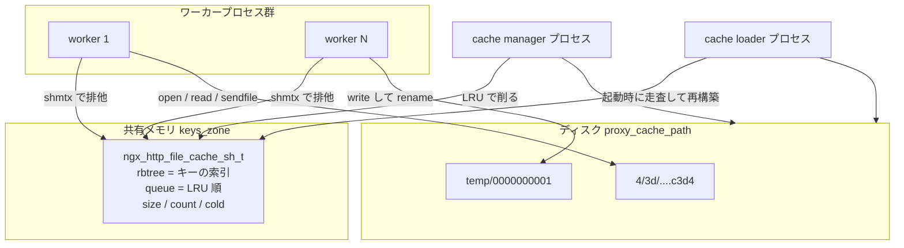

## この層の責務

`proxy_cache` を有効にすると、[upstream のページ](../upstream/) で見た「上流に投げて応答を中継する」流れの手前に、もう 1 段が挟まる。上流に行く前にディスクを見て、あればそれを返す。無ければ上流に行き、中継しながら同時にディスクへ書く。

要る仕事は 4 つある。

1. リクエストからキーを作り、そのキーが**今この時点で有効な応答を持っているか**を判定する
2. 有効なら、ディスク上のファイルからヘッダとボディを復元して返す
3. 有効でないなら上流へ行き、応答を中継しつつ書き、最後に所定の名前へ `rename` する
4. 増え続けるファイルを、`max_size` と `inactive` に従って削る

厄介なのは 1 と 4 だ。判定はリクエストごとに走るので速くなければならず、しかも**ワーカープロセスをまたいで一貫している必要がある**。ワーカーは fork されて別アドレス空間で動くので、「あるキーが今 3 番ワーカーによって更新中」といった状態を普通のメモリに置けない。

Nginx の答えは、2 層に割ることだ。

- **どのキーが存在するか・誰が今更新中か**という索引は、共有メモリ上の赤黒木に置く。全ワーカーが mutex 越しに読み書きする
- **応答の中身**はディスク上のファイルに置く。ファイルシステムが共有を引き受けるので、Nginx 側で調停しない

共有メモリの領域は有限で、しかもプロセスをまたぐのでポインタが使えない ([slab アロケータのページ](../slab-shared-memory/))。**そこに置くものを絞り込んだ結果が、この 2 層構造になっている。**

実装は [`src/http/ngx_http_file_cache.c`](https://github.com/nginx/nginx/blob/release-1.31.4/src/http/ngx_http_file_cache.c) の 2799 行と、型を定義する [`src/http/ngx_http_cache.h`](https://github.com/nginx/nginx/blob/release-1.31.4/src/http/ngx_http_cache.h) の 210 行。呼び出し元は `ngx_http_upstream.c` に散っている。



## 主要な型とその関係

型は 4 つある。**どこに置かれるか**で分けるのが分かりやすい。

| 型                           | 置き場所                 | 単位                               |
| ---------------------------- | ------------------------ | ---------------------------------- |
| `ngx_http_file_cache_t`      | 各ワーカーの設定用メモリ | `proxy_cache_path` 1 行につき 1 つ |
| `ngx_http_file_cache_sh_t`   | 共有メモリ (slab)        | ゾーンにつき 1 つ                  |
| `ngx_http_file_cache_node_t` | 共有メモリ (slab)        | キー 1 つにつき 1 つ               |
| `ngx_http_cache_t`           | リクエストプール         | リクエスト 1 本の間                |

`ngx_http_file_cache_t` ([`#L159-L187`](https://github.com/nginx/nginx/blob/release-1.31.4/src/http/ngx_http_cache.h#L159-L187)) は共有メモリへの入口 (`sh` / `shpool`)、ディスク側のパス、`max_size` / `inactive` / `min_free`、それに manager と loader の刻み幅を持つ。`bsize` だけ性格が違って、初期化時に `ngx_fs_bsize()` から取るファイルシステムのブロックサイズだ。`max_size` はこの値で割られる ([`#L157`](https://github.com/nginx/nginx/blob/release-1.31.4/src/http/ngx_http_file_cache.c#L157))。**サイズ管理はバイトではなくブロック数で行う。** 1 バイトのレスポンスでもディスク上は 4KB 消費するので、バイトで数えると `max_size` を守れない。

### 共有メモリ側

```c title="src/http/ngx_http_cache.h:147-156"
typedef struct {
    ngx_rbtree_t                     rbtree;
    ngx_rbtree_node_t                sentinel;
    ngx_queue_t                      queue;
    ngx_atomic_t                     cold;
    ngx_atomic_t                     loading;
    off_t                            size;
    ngx_uint_t                       count;
    ngx_uint_t                       watermark;
} ngx_http_file_cache_sh_t;
```

`rbtree` と `queue` に同じノードが 2 通りに繋がっている。木は**キーで引くため**、キューは**古い順に並べるため**。[タイマの赤黒木](../timer-rbtree/) と同じ `ngx_rbtree_t` を使い回しつつ、比較関数を差し替えている。`cold` は「まだディスクを走査していない」、`loading` は loader プロセスの PID を入れる排他用で、この 2 つが `ngx_atomic_t` なのは mutex を取らずに読むからだ。

### ノードはキーを 2 つに割って持つ

```c title="src/http/ngx_http_cache.h:39-62"
typedef struct {
    ngx_rbtree_node_t                node;
    ngx_queue_t                      queue;

    u_char                           key[NGX_HTTP_CACHE_KEY_LEN
                                         - sizeof(ngx_rbtree_key_t)];

    unsigned                         count:20;
    unsigned                         uses:10;
    unsigned                         valid_msec:10;
    unsigned                         error:10;
    unsigned                         exists:1;
    unsigned                         updating:1;
    unsigned                         deleting:1;
    unsigned                         purged:1;
                                     /* 10 unused bits */

    ngx_file_uniq_t                  uniq;
    time_t                           expire;
    time_t                           valid_sec;
    size_t                           body_start;
    off_t                            fs_size;
    ngx_msec_t                       lock_time;
} ngx_http_file_cache_node_t;
```

`NGX_HTTP_CACHE_KEY_LEN` は 16、つまり MD5 の全長。ところが `key[]` の宣言は `16 - sizeof(ngx_rbtree_key_t)` になっている。**MD5 の先頭は、赤黒木のノードが持つ `key` フィールドに直接入れてある。** `ngx_rbtree_key_t` は `ngx_uint_t` なので、64 ビット環境では先頭 8 バイトが木の比較キー、残り 8 バイトが `fcn->key[]` だ。

検索側にこの分割がそのまま現れる。

```c title="src/http/ngx_http_file_cache.c:1041-1064 (抜粋)"
    while (node != sentinel) {
        if (node_key < node->key) { node = node->left;  continue; }
        if (node_key > node->key) { node = node->right; continue; }

        fcn = (ngx_http_file_cache_node_t *) node;

        rc = ngx_memcmp(&key[sizeof(ngx_rbtree_key_t)], fcn->key,
                        NGX_HTTP_CACHE_KEY_LEN - sizeof(ngx_rbtree_key_t));

        if (rc == 0) { return fcn; }

        node = (rc < 0) ? node->left : node->right;
    }
```

上位語で木を降り、同値なら残りを `memcmp` して左右を決める。挿入側も同じ形で 2 つに切って書く ([`#L953-L956`](https://github.com/nginx/nginx/blob/release-1.31.4/src/http/ngx_http_file_cache.c#L953-L956))。同じ 16 バイトを 2 箇所に持たせないことで、ノードあたり 8 バイトが浮く。

ケチる理由は数で決まる。このノードは 64 ビット環境で 120 バイト前後になり、slab のオーバーヘッドを足すと `keys_zone=one:10m` でおよそ 8 万件が上限になる。共有メモリは起動時に確保しきりで後から伸ばせないので、**ノードの大きさがそのまま収容件数の上限になる**。

ビットフィールドの意味を分けておく。

| フィールド                   | 意味                                                        |
| ---------------------------- | ----------------------------------------------------------- |
| `count:20`                   | このノードを掴んでいるリクエスト数。0 でないと削除できない  |
| `uses:10`                    | このキーが要求された回数。`proxy_cache_min_uses` と比較する |
| `valid_msec:10` / `error:10` | エラー応答をキャッシュしたときのステータスと有効期限        |
| `exists:1`                   | ディスク上にファイルが実在する                              |
| `updating:1`                 | 誰かが今このキーを上流から取り直している                    |
| `deleting:1`                 | manager が今このファイルを消している最中                    |
| `purged:1`                   | `proxy_cache_purge` が消した                                |

### リクエスト側

`ngx_http_cache_t` は `r->cache` に付き、リクエストのプールから取る ([`#L65-L125`](https://github.com/nginx/nginx/blob/release-1.31.4/src/http/ngx_http_cache.h#L65-L125))。注目すべきは 3 つ。

**`key` と `main` の 2 本ある MD5。** `main` が `proxy_cache_key` から作った本来のキー、`key` が実際に引くキー。`Vary` があるとこの 2 つが食い違う。

**`node` が共有メモリのノードを直接指す。** リクエストが生きている間、そのノードは `count` で保護されて消えない。

**`header_start` / `body_start` / `length` の 3 つのオフセット。** ディスク上のファイルのどこからどこまでが何かを表す。これが次の節の主題になる。

### ディスク上のファイル

```c title="src/http/ngx_http_cache.h:128-144"
typedef struct {
    ngx_uint_t                       version;
    time_t                           valid_sec;
    time_t                           updating_sec;
    time_t                           error_sec;
    time_t                           last_modified;
    time_t                           date;
    uint32_t                         crc32;
    u_short                          valid_msec;
    u_short                          header_start;
    u_short                          body_start;
    u_char                           etag_len;
    u_char                           etag[NGX_HTTP_CACHE_ETAG_LEN];
    u_char                           vary_len;
    u_char                           vary[NGX_HTTP_CACHE_VARY_LEN];
    u_char                           variant[NGX_HTTP_CACHE_KEY_LEN];
} ngx_http_file_cache_header_t;
```

この構造体を**そのまま `write()` している**。`version` は `NGX_HTTP_CACHE_VERSION`、`release-1.31.4` では 5。違えばそのファイルは読まずに捨てる。

ファイル全体はこうなる。

```
+-------------------------------------------+  offset 0
| ngx_http_file_cache_header_t              |
|   version=5 / valid_sec / body_start /    |
|   etag / vary / variant ...               |
+-------------------------------------------+
| "\nKEY: " + proxy_cache_key の展開結果    |
| + "\n"                                    |
+-------------------------------------------+  offset = header_start
| 上流が返したステータス行とヘッダ           |
| "HTTP/1.1 200 OK\r\nServer: ...\r\n\r\n"  |
+-------------------------------------------+  offset = body_start
| レスポンスボディ (無加工)                  |
+-------------------------------------------+  offset = length
```

`header_start` は `create_key` の時点で確定する。

```c title="src/http/ngx_http_file_cache.c:254-260"
    c->header_start = sizeof(ngx_http_file_cache_header_t)
                      + sizeof(ngx_http_file_cache_key) + len + 1;

    ngx_crc32_final(c->crc32);
    ngx_md5_final(c->key, &md5);

    ngx_memcpy(c->main, c->key, NGX_HTTP_CACHE_KEY_LEN);
```

`ngx_http_file_cache_key` は `{ LF, 'K', 'E', 'Y', ':', ' ' }` の 6 バイト ([`#L79`](https://github.com/nginx/nginx/blob/release-1.31.4/src/http/ngx_http_file_cache.c#L79))、`+ 1` は末尾の改行。キー本文を平文で埋め込んでいるのは、MD5 の衝突を検出するためと、運用者が `head -c 256` でファイルの正体を確認できるようにするためだ。

この形式が効くのは配信時だ。ボディの `ngx_buf_t` は「このファイルの `body_start` から `length` まで」という記述子でしかない ([buf と chain のページ](../buf-chain/))。

```c title="src/http/ngx_http_file_cache.c:1655-1663 (抜粋)"
    b->file_pos = c->body_start;
    b->file_last = c->length;

    b->in_file = (c->length - c->body_start) ? 1 : 0;
    b->last_buf = (r == r->main) ? 1 : 0;
    b->file->fd = c->file.fd;
```

**応答をそのままのバイト列で置いてあるので、配信時はボディを 1 バイトも読まずに `sendfile()` に渡せる。** ヘッダも同様で、ファイルから読んだバッファをそのまま上流の応答パーサに食わせる。

```c title="src/http/ngx_http_upstream.c:1108-1137 (抜粋)"
    u->buffer = *c->buf;
    u->buffer.pos += c->header_start;
    /* ... u->headers_in を初期化 ... */
    rc = u->process_header(r);

    if (rc == NGX_OK) {
        /* ... */
        return ngx_http_cache_send(r);
    }
```

`u->process_header` は上流から来たヘッダを解析する関数と**同じもの**だ ([upstream のページ](../upstream/) のコールバック表)。キャッシュ専用のヘッダ復元コードを書く代わりに、「ファイルの中身は上流から来たバイト列そのものである」という不変条件を作って、既存のパーサを使い回している。

### ファイル名の決め方

MD5 を 32 桁の hex にしたものがファイル名で、`ngx_create_hashed_filename` がそこに階層を挟む。

```c title="src/core/ngx_file.c:250-261"
    for (n = 0; n < NGX_MAX_PATH_LEVEL; n++) {
        level = path->level[n];

        if (level == 0) { break; }

        len -= level;
        file[i - 1] = '/';
        ngx_memcpy(&file[i], &file[len], level);
        i += level + 1;
    }
```

`len` を後ろから削りながらコピーするので、**取り出すのは hex 文字列の末尾から**だ。`levels=1:2` でキーの hex が `...c3d4` なら `/var/cache/4/3d/....c3d4` になる。MD5 の出力はどの位置も一様なので、先頭を使っても分布は変わらない。`levels` は 1 と 2 しか受け付けない ([`#L2443-L2446`](https://github.com/nginx/nginx/blob/release-1.31.4/src/http/ngx_http_file_cache.c#L2443-L2446))。

**ディレクトリを掘る理由は、1 ディレクトリあたりのエントリ数を抑えることに尽きる。** `levels=1:2` なら 16 × 256 = 4096 ディレクトリに散るので、100 万ファイルでも 1 ディレクトリ 250 件程度に収まる。最適値はファイルシステムによって違って Nginx 側では決められないので、設定に出して運用者に投げている。

## 処理の流れ

### 1. キーを作り、共有メモリを引く

[フェーズエンジン](../phase-engine/) がコンテンツハンドラに到達し、`proxy_pass` が `ngx_http_upstream_init` を呼ぶ。その中で最初に走るのが `ngx_http_upstream_cache`。

```c title="src/http/ngx_http_upstream.c:897-920 (抜粋)"
        if (u->create_key(r) != NGX_OK) { return NGX_ERROR; }

        ngx_http_file_cache_create_key(r);

        if (r->cache->header_start + 256 > u->conf->buffer_size) {
            /* ... "is not enough for cache key" ... */
            r->cache = NULL;
            return NGX_DECLINED;
        }

        u->cacheable = 1;
        c = r->cache;
        c->body_start = u->conf->buffer_size;
```

`u->create_key` がプロトコル固有 (proxy / fastcgi / uwsgi) の部分で、`proxy_cache_key` を展開して `c->keys` に積む。`ngx_http_file_cache_create_key` がそれを MD5 と CRC32 に畳む。

**`c->body_start` の初期値が `proxy_buffer_size` である**のが重要だ。まだファイルを読んでいないのでヘッダの実長は分からない。読むべき長さの上界として、上流のヘッダを受けるバッファと同じ値を使う。キーが長すぎてそこに入らなければ、上のエラーが出てキャッシュが無効になる。

次に `ngx_http_file_cache_open` が共有メモリを引く。

```c title="src/http/ngx_http_file_cache.c:886-927 (抜粋)"
    ngx_shmtx_lock(&cache->shpool->mutex);

    fcn = c->node;

    if (fcn == NULL) { fcn = ngx_http_file_cache_lookup(cache, c->key); }

    if (fcn) {
        ngx_queue_remove(&fcn->queue);

        if (c->node == NULL) { fcn->uses++; fcn->count++; }

        if (fcn->error) { /* ... 期限内ならそのステータスを返す ... */ }

        if (fcn->exists || fcn->uses >= c->min_uses) {
            c->exists = fcn->exists;

            if (fcn->body_start && !c->update_variant) {
                c->body_start = fcn->body_start;
            }

            rc = NGX_OK;
            goto done;
        }

        rc = NGX_AGAIN;
        goto done;
    }
```

見つかったら `queue` から外し、末尾の `done:` で先頭に挿し直す。**これで LRU 順が保たれる。** 木の位置は変わらない。

`fcn->body_start` が入っていればそれを `c->body_start` に反映する。2 回目以降は**ヘッダの実長ぶんだけ読めばよい**ので、`proxy_buffer_size` を丸ごと読まずに済む。

`NGX_AGAIN` になるのは、ノードはあるがファイルはまだ無く (`exists == 0`)、要求回数も `min_uses` に届いていないとき。ノードが無ければ slab から確保して木に入れ、`NGX_DECLINED` を返す。

### 2. 開くかどうかを決める

```c title="src/http/ngx_http_file_cache.c:312-346 (抜粋)"
    if (rc == NGX_OK) {
        if (c->error) { return c->error; }

        c->temp_file = 1;
        test = c->exists ? 1 : 0;
        rv = NGX_DECLINED;

    } else { /* rc == NGX_DECLINED */
        test = cache->sh->cold ? 1 : 0;

        if (c->min_uses > 1) {
            if (!test) { return NGX_HTTP_CACHE_SCARCE; }
            rv = NGX_HTTP_CACHE_SCARCE;

        } else {
            c->temp_file = 1;
            rv = NGX_DECLINED;
        }
    }
    /* ... ファイル名を決める ... */
    if (!test) { goto done; }
```

`cache->sh->cold` が絡むのが面白い。**loader がまだ走査を終えていない間は、共有メモリに無くてもディスクにはあるかもしれない。** だから `cold` なら索引に無くてもファイルを開いてみる。走査が終わっていれば索引を信用して、開かずに MISS を返す。

ファイルは [ファイルディスクリプタキャッシュ](../os-file-serving/) 経由で開き、`c->body_start` バイトだけ読む。ボディは読まない。

### 3. ヘッダを読んで有効性を判定する

`ngx_http_file_cache_read` は 5 段の検証を通す。

```c title="src/http/ngx_http_file_cache.c:560-593 (抜粋)"
    if ((size_t) n < c->header_start)            { return NGX_DECLINED; }

    h = (ngx_http_file_cache_header_t *) c->buf->pos;

    if (h->version != NGX_HTTP_CACHE_VERSION)    { return NGX_DECLINED; }

    if (h->crc32 != c->crc32
        || (size_t) h->header_start != c->header_start)
    {
        ngx_log_error(NGX_LOG_CRIT, r->connection->log, 0,
                      "cache file \"%s\" has md5 collision", c->file.name.data);
        return NGX_DECLINED;
    }

    p = c->buf->pos + sizeof(ngx_http_file_cache_header_t)
        + sizeof(ngx_http_file_cache_key);

    key = c->keys.elts;
    for (i = 0; i < c->keys.nelts; i++) {
        if (ngx_memcmp(p, key[i].data, key[i].len) != 0) {
            return NGX_DECLINED;
        }

        p += key[i].len;
    }
```

サイズ → バージョン → CRC32 とキー長 → キー本文の逐次比較、と絞り込む。**MD5 が衝突しても、CRC32 か長さかキー本文のどれかで捕まる。** 捕まったら `NGX_DECLINED` を返して MISS 扱いにするだけで、エラーにはしない。

検証を通ったら、ヘッダの値を `c` に写して有効期限を見る。

```c title="src/http/ngx_http_file_cache.c:654-676 (抜粋)"
    if (c->valid_sec < now) {
        c->stale_updating = c->valid_sec + c->updating_sec >= now;
        c->stale_error = c->valid_sec + c->error_sec >= now;

        ngx_shmtx_lock(&cache->shpool->mutex);

        if (c->node->updating) {
            rc = NGX_HTTP_CACHE_UPDATING;

        } else {
            c->node->updating = 1;
            c->updating = 1;
            c->lock_time = c->node->lock_time;
            rc = NGX_HTTP_CACHE_STALE;
        }

        ngx_shmtx_unlock(&cache->shpool->mutex);
        return rc;
    }
```

期限切れのとき、**誰かが既に更新中なら `UPDATING`、そうでなければ自分が更新役を引き受けて `STALE`**。`node->updating` を立てるのがその宣言になる。同時に来た 2 本目以降は必ず `UPDATING` を受け取る。

`stale_updating` / `stale_error` は `Cache-Control: stale-while-revalidate` / `stale-if-error` に対応する。猶予秒数はファイルヘッダの `updating_sec` / `error_sec` に書かれている。

### 4. 戻り値の一覧

`ngx_http_file_cache_open` の戻り値は 8 種類ある。

| 戻り値                    | 意味                             | 呼び出し元の反応            |
| ------------------------- | -------------------------------- | --------------------------- |
| `NGX_OK`                  | 有効なキャッシュがある           | `HIT`。ファイルから送る     |
| `NGX_DECLINED`            | 無い、または壊れている           | `MISS`。上流へ行き、書く    |
| `NGX_HTTP_CACHE_STALE`    | 期限切れ。自分が更新役           | `EXPIRED`。上流へ行き、書く |
| `NGX_HTTP_CACHE_UPDATING` | 期限切れ。他が更新中             | 設定次第で古いものを返す    |
| `NGX_HTTP_CACHE_SCARCE`   | `min_uses` に届いていない        | 上流へ行くが、書かない      |
| `NGX_AGAIN`               | `proxy_cache_lock` で待つ        | `NGX_BUSY` を返して中断     |
| `NGX_ERROR`               | 内部エラー                       | 500                         |
| ステータスコード          | エラー応答がキャッシュされている | そのステータスを返す        |

`ngx_http_upstream_cache` がこれを `u->cache_status` に翻訳する。

```c title="src/http/ngx_http_upstream.c:969-985"
    case NGX_HTTP_CACHE_UPDATING:

        if (((u->conf->cache_use_stale & NGX_HTTP_UPSTREAM_FT_UPDATING)
             || c->stale_updating) && !r->background)
        {
            u->cache_status = rc;
            rc = NGX_OK;

        } else {
            rc = NGX_HTTP_CACHE_STALE;
        }

        break;

    case NGX_OK:
        u->cache_status = NGX_HTTP_CACHE_HIT;
```

**`UPDATING` を `NGX_OK` に書き換えているのが stale-while-revalidate の実体だ。** 「他の誰かが更新中だから、自分は古いものをそのまま返す」。許可されていなければ `STALE` に落として、自分も上流へ行く。

`$upstream_cache_status` に出る文字列は `MISS` / `BYPASS` / `EXPIRED` / `STALE` / `UPDATING` / `REVALIDATED` / `HIT` の 7 つで ([`#L68-L76`](https://github.com/nginx/nginx/blob/release-1.31.4/src/http/ngx_http_file_cache.c#L68-L76))、`SCARCE` は入っていない。`SCARCE` は `u->cacheable = 0` に変換されるだけで、ステータスとしては `MISS` のまま残る。

### 5. 同じキーに殺到したときの調停

道具は 3 つある。**`min_uses`、`node->updating`、`proxy_cache_lock` の待ち行列。**

`min_uses` は「N 回要求されるまでは保存しない」。1 回しか来ないコンテンツでディスクを埋めないための足切りだ。`node->updating` は前節のとおり、期限切れの更新役を 1 本に絞る。3 つ目の `proxy_cache_lock` が、**まだ何も無い (MISS) 状態に同時に殺到したとき**に効く。

```c title="src/http/ngx_http_file_cache.c:414-459 (抜粋)"
    ngx_shmtx_lock(&cache->shpool->mutex);

    timer = c->node->lock_time - now;

    if (!c->node->updating || (ngx_msec_int_t) timer <= 0) {
        c->node->updating = 1;
        c->node->lock_time = now + c->lock_age;
        c->updating = 1;
        c->lock_time = c->node->lock_time;
    }

    ngx_shmtx_unlock(&cache->shpool->mutex);

    if (c->updating)          { return NGX_DECLINED; }
    if (c->lock_timeout == 0) { return NGX_HTTP_CACHE_SCARCE; }

    c->waiting = 1;

    if (c->wait_time == 0) {
        c->wait_time = now + c->lock_timeout;
        c->wait_event.handler = ngx_http_file_cache_lock_wait_handler;
        /* ... */
    }

    timer = c->wait_time - now;

    ngx_add_timer(&c->wait_event, (timer > 500) ? 500 : timer);

    r->main->blocked++;

    return NGX_AGAIN;
```

`node->updating` が空いていれば自分が取り、`NGX_DECLINED` を返して上流へ行く。取れなければタイマを張って待つ。待ち方が特徴的で、**条件変数もイベント通知もなく、最大 500ms ごとのポーリングになっている**。起きるたびに共有メモリを覗き直す ([`#L523-L536`](https://github.com/nginx/nginx/blob/release-1.31.4/src/http/ngx_http_file_cache.c#L523-L536))。

理由は 2 つある。更新役は別プロセスかもしれないので、プロセス内のイベントループでは起こせない。そして `lock_age` を過ぎたら更新役が死んだとみなして横取りする必要があり、そのためにどのみち時間で起きる必要がある。**プロセスをまたぐ待ち合わせを、共有メモリのフラグと定期ポーリングで済ませている。**

`r->main->blocked++` を忘れていないのが要点で、これで待っている間にリクエストが終了処理に入らない ([リクエストの終わらせ方のページ](../finalize-request/))。起床側も対称で、`blocked--` したあとに `r->write_event_handler(r)` と `ngx_http_run_posted_requests(c)` を呼ぶ ([`#L484-L498`](https://github.com/nginx/nginx/blob/release-1.31.4/src/http/ngx_http_file_cache.c#L484-L498))。[サブリクエストのページ](../subrequest-postpone/) と同じ規約で、イベントハンドラの出口では必ずポストキューを回す。

### 6. 書く

上流のヘッダを読み終えた時点で、キャッシュファイルの先頭部分を組み立てる。

```c title="src/http/ngx_http_upstream.c:3445-3469 (抜粋)"
        if (valid) {
            r->cache->date = now;
            r->cache->body_start = (u_short) (u->buffer.pos - u->buffer.start);
            /* ... last_modified と etag を控える ... */
            if (ngx_http_file_cache_set_header(r, u->buffer.start) != NGX_OK) {
                ngx_http_upstream_finalize_request(r, u, NGX_ERROR);
                return;
            }
        }
```

`set_header` の書き込み先が `u->buffer.start`、つまり**上流からの応答を受けているバッファの先頭**であることに注目したい。これが成立するのは、`ngx_http_upstream_cache` が最初に `u->buffer.pos = u->buffer.start + c->header_start` と読み込み開始位置をずらしているからだ ([`#L1010-L1011`](https://github.com/nginx/nginx/blob/release-1.31.4/src/http/ngx_http_upstream.c#L1010-L1011))。**上流からの応答は最初からキャッシュヘッダ用の穴を空けた位置に読み込まれている。** 後からバッファをずらす必要がない。

書き出しは [event_pipe](../upstream-event-pipe/) の一時ファイル機構に乗る。

```c title="src/http/ngx_http_upstream.c:3517-3525"
    if (p->cacheable) {
        p->temp_file->persistent = 1;

#if (NGX_HTTP_CACHE)
        if (r->cache && !r->cache->file_cache->use_temp_path) {
            p->temp_file->path = r->cache->file_cache->path;
            p->temp_file->file.name = r->cache->file.name;
        }
#endif
```

`p->cacheable` が立つと、event_pipe は**下流の速度に関係なく上流を読み切って一時ファイルに落とす**。下流が遅いからといって上流を止めると、キャッシュが完成しないまま接続が切れる確率が上がる。`use_temp_path=off` なら一時ファイルを最終的な置き場と同じディレクトリに作る。別ファイルシステムをまたぐと `rename` がコピーになるのを避けるためだ。

完成は `rename` 1 回。

```c title="src/http/ngx_http_file_cache.c:1456-1487 (抜粋)"
    rc = ngx_ext_rename_file(&tf->file.name, &c->file.name, &ext);

    if (rc == NGX_OK) { /* ... uniq と fs_size を取り直す ... */ }

    ngx_shmtx_lock(&cache->shpool->mutex);

    c->node->count--;
    c->node->uniq = uniq;
    c->node->body_start = c->body_start;

    cache->sh->size += fs_size - c->node->fs_size;
    c->node->fs_size = fs_size;

    if (rc == NGX_OK) { c->node->exists = 1; }

    c->node->updating = 0;
```

`rename(2)` が原子的なので、**「途中まで書かれたファイル」を他のワーカーが読むことがない**。ロックも世代番号も要らない。`exists = 1` を立てるのは rename 成功のあとで、この順序が守られている限り「索引にあるがファイルが無い」状態は作られない。

呼ばれるのは event_pipe の後始末から。

```c title="src/http/ngx_http_upstream.c:4448-4468 (抜粋)"
            if (p->upstream_done) {
                ngx_http_file_cache_update(r, p->temp_file);

            } else if (p->upstream_eof) {
                tf = p->temp_file;

                if (p->length == -1
                    && (u->headers_in.content_length_n == -1
                        || u->headers_in.content_length_n
                           == tf->offset - (off_t) r->cache->body_start))
                {
                    ngx_http_file_cache_update(r, tf);

                } else {
                    ngx_http_file_cache_free(r->cache, tf);
                }

            } else if (p->upstream_error) {
                ngx_http_file_cache_free(r->cache, p->temp_file);
            }
```

**上流が最後まで送ったと確信できるときだけ `update`、それ以外は `free`。** `Content-Length` があるならバイト数まで一致を確認する。`free` 側は一時ファイルを消して `node->updating` を戻す ([`#L1674-L1736`](https://github.com/nginx/nginx/blob/release-1.31.4/src/http/ngx_http_file_cache.c#L1674-L1736))。プールのクリーンアップにも同じ関数が登録してあるので、リクエストがどう終わっても更新中フラグは必ず外れる。

### 7. 再検証と背景更新

期限切れのとき `If-Modified-Since` / `If-None-Match` を上流に送り、304 が返ればボディを取り直さずに期限だけ延ばせる。

```c title="src/http/ngx_http_upstream.c:2860-2915 (抜粋)"
    if (status == NGX_HTTP_NOT_MODIFIED
        && u->cache_status == NGX_HTTP_CACHE_EXPIRED
        && u->conf->cache_revalidate)
    {
        u->cache_status = NGX_HTTP_CACHE_REVALIDATED;
        rc = ngx_http_upstream_cache_send(r, u);
        /* ... valid_sec と date を更新して ... */
        ngx_http_file_cache_update_header(r);
```

`ngx_http_file_cache_update_header` はファイルを開き直して**先頭の `sizeof(ngx_http_file_cache_header_t)` バイトだけを書き換える**。書く前に検査が入る。

```c title="src/http/ngx_http_file_cache.c:1541-1548 (抜粋)"
    if (c->uniq != ngx_file_uniq(&fi)
        || c->length != ngx_file_size(&fi))
    {
        /* ... "changed" ... */
        goto done;
    }
```

**inode 番号とサイズを確認して、開いたあいだに別のワーカーが `rename` で差し替えていたら何もしない。** ロックを取らずに「読んで、確認して、書く」を安全にするための検査で、`rename` が原子的であることに依存している。

背景更新 (`proxy_cache_background_update`) は [サブリクエスト](../subrequest-postpone/) で実装されている。

```c title="src/http/ngx_http_upstream.c:1170-1178 (抜粋)"
    if (ngx_http_subrequest(r, &r->uri, &r->args, &sr, NULL,
                            NGX_HTTP_SUBREQUEST_CLONE
                            |NGX_HTTP_SUBREQUEST_BACKGROUND)
        != NGX_OK)
    {
        return NGX_ERROR;
    }

    sr->header_only = 1;
```

**自分自身と同じ URI へ、`CLONE | BACKGROUND` でサブリクエストを立てる。** `BACKGROUND` なので出力順序の管理に入らず、親は古いキャッシュを返してすぐ終わる。子は誰にも見られないまま上流へ行き、ファイルを更新する。専用の仕組みを作らず、既にある機構を組み合わせている。

### 8. Vary の 2 段引き

`Vary: Accept-Encoding` が返ってきた応答は、リクエストヘッダによって中身が変わる。Nginx はこれを**キーを 2 回引くこと**で扱う。1 回目は `c->main` で引き、そのファイルに `vary` が入っていれば該当ヘッダを混ぜたハッシュを計算する。

```c title="src/http/ngx_http_file_cache.c:1128-1161 (抜粋)"
    ngx_md5_init(&md5);
    ngx_md5_update(&md5, r->cache->main, NGX_HTTP_CACHE_KEY_LEN);

    ngx_strlow(buf, vary, len);

    while (p < last) {
        /* ... buf を空白とカンマで区切って name を取り出す ... */
        ngx_md5_update(&md5, name.data, name.len);
        ngx_md5_update(&md5, (u_char *) ":", sizeof(":") - 1);

        ngx_http_file_cache_vary_header(r, &md5, &name);

        ngx_md5_update(&md5, (u_char *) CRLF, sizeof(CRLF) - 1);
    }

    ngx_md5_final(hash, &md5);
```

**元のキーの MD5 を種にして、`Vary` に挙がったヘッダ名と値を足していく。** ヘッダ名は小文字化し、`Accept-Charset` / `Accept-Encoding` / `Accept-Language` の 3 つは値の空白とカンマを正規化する ([`#L1178-L1195`](https://github.com/nginx/nginx/blob/release-1.31.4/src/http/ngx_http_file_cache.c#L1178-L1195))。`gzip, deflate` と `gzip,deflate` を別物にしないためだ。

計算したハッシュがファイルの `variant` と食い違えば、そのハッシュを新しいキーにして開き直す。

```c title="src/http/ngx_http_file_cache.c:1276-1298 (抜粋)"
    if (c->secondary) {
        /* ... "has incorrect vary hash" ... */
        return NGX_DECLINED;
    }

    ngx_shmtx_lock(&cache->shpool->mutex);
    c->node->count--;
    c->node = NULL;
    ngx_shmtx_unlock(&cache->shpool->mutex);

    c->secondary = 1;
    c->file.name.len = 0;
    c->body_start = c->buffer_size;

    ngx_memcpy(c->key, c->variant, NGX_HTTP_CACHE_KEY_LEN);

    return ngx_http_file_cache_open(r);
```

`c->secondary` を立ててから `open` を再帰呼び出しする。**このフラグが再帰の深さを 1 段に制限する。** 2 段目でまた食い違えば、それは壊れたファイルなので `NGX_DECLINED`。つまり `Vary` があるキーには、「どのヘッダで分岐するかを書いた索引ファイル」と「バリアントごとのファイル」が別々に存在する。

### 9. cache manager と cache loader

どちらも master が fork する専用プロセスで、ワーカーとは別だ ([master と worker のページ](../master-worker/))。設定側で `cache->path->manager` と `->loader` に関数を刺してあり ([`#L2675-L2685`](https://github.com/nginx/nginx/blob/release-1.31.4/src/http/ngx_http_file_cache.c#L2675-L2685))、manager プロセスは全パスの `manager` を呼んで**戻り値の最小値を次のタイマにする** ([`src/os/unix/ngx_process_cycle.c#L1146-L1164`](https://github.com/nginx/nginx/blob/release-1.31.4/src/os/unix/ngx_process_cycle.c#L1146-L1164))。

`ngx_http_file_cache_manager` は 2 段構えだ。まず `inactive` を過ぎたものを消し (`expire`)、それでも `max_size` を超えていれば LRU の末尾から強制的に消す (`forced_expire`)。

```c title="src/http/ngx_http_file_cache.c:2054-2093 (抜粋)"
        if (size < cache->max_size && count < watermark) {
            if (!cache->min_free) { break; }

            free = ngx_fs_available(cache->path->name.data);

            if (free > cache->min_free) { break; }
        }

        wait = ngx_http_file_cache_forced_expire(cache);

        if (wait > 0) {
            next = (ngx_msec_t) wait * 1000;
            break;
        }
        /* ... ngx_quit / ngx_terminate なら抜ける ... */
        if (++cache->files >= cache->manager_files) {
            next = cache->manager_sleep;
            break;
        }

        ngx_time_update();
        elapsed = ngx_abs((ngx_msec_int_t) (ngx_current_msec - cache->last));

        if (elapsed >= cache->manager_threshold) {
            next = cache->manager_sleep;
            break;
        }
```

**ループを抜ける条件が 2 本ある。「100 ファイル処理したら」と「200ms 経ったら」だ** (`manager_files=100` / `manager_threshold=200` / `manager_sleep=50`、[`#L2413-L2415`](https://github.com/nginx/nginx/blob/release-1.31.4/src/http/ngx_http_file_cache.c#L2413-L2415))。件数だけだと 1 件あたりが遅いファイルシステムで詰まるので、時間でも切る。

同じ形が `expire` の中にもあり、そちらは**共有メモリの mutex を握ったまま**回っている ([`#L1947-L1959`](https://github.com/nginx/nginx/blob/release-1.31.4/src/http/ngx_http_file_cache.c#L1947-L1959))。だから件数と時間の両方で切る必要が高い。実際の `unlink()` の間だけは mutex を手放し、その前に `count++` と `deleting = 1` を立ててノードを守る ([`#L1992-L2010`](https://github.com/nginx/nginx/blob/release-1.31.4/src/http/ngx_http_file_cache.c#L1992-L2010))。**共有メモリの mutex はワーカー全員を止めるので、システムコールを跨いで握らない。** [1 周の長さを抑える話](../loop-latency/) と同じ系統にある。

loader は起動後 60 秒で 1 回だけ走り、終わったら `exit(0)` する ([`src/os/unix/ngx_process_cycle.c#L1168-L1191`](https://github.com/nginx/nginx/blob/release-1.31.4/src/os/unix/ngx_process_cycle.c#L1168-L1191))。

```c title="src/http/ngx_http_file_cache.c:2115-2144 (抜粋)"
    if (!cache->sh->cold || cache->sh->loading) { return; }

    if (!ngx_atomic_cmp_set(&cache->sh->loading, 0, ngx_pid)) { return; }

    if (ngx_walk_tree(&tree, &cache->path->name) == NGX_ABORT) {
        cache->sh->loading = 0;
        return;
    }

    cache->sh->cold = 0;
    cache->sh->loading = 0;
```

`ngx_atomic_cmp_set` で自分の PID を書き込むのが排他になっている。走査を終えて初めて `cold = 0` になり、**そこからワーカーは索引を信用するようになる**。

刻み方は manager と同じ 3 つの値 (`loader_files=100` / `loader_threshold=200` / `loader_sleep=50`) だが、こちらは `ngx_msleep` で本当に寝る ([`#L2173-L2187`](https://github.com/nginx/nginx/blob/release-1.31.4/src/http/ngx_http_file_cache.c#L2173-L2187))。loader プロセスはクライアントを 1 本も持たないので、寝ても誰も待たない。**「イベントループを止めない」の要件が、プロセスを分けたことで「ディスク I/O を出しすぎない」に置き換わっている。**

そして走査でファイルから取るのは、キーとサイズだけだ。`ngx_http_file_cache_add_file` は**ファイルの中身を開かず、ファイル名の 32 桁 hex を `ngx_hextoi` でキーに戻している** ([`#L2254-L2268`](https://github.com/nginx/nginx/blob/release-1.31.4/src/http/ngx_http_file_cache.c#L2254-L2268))。`stat` で取れるサイズと合わせれば索引の再構築には足りる。有効期限はファイルを開かないと分からないが、それは最初にそのキーが要求されたときに読めばよい。100 万ファイルの走査で `open()` を 100 万回やらずに済む。

## 守られている不変条件

**索引に `exists = 1` のノードがあるなら、対応するファイルが存在する。** `exists` を立てるのは `rename` 成功のあと、消すときは `unlink` の前に `deleting` を立ててノードを保護する。逆向き (ファイルはあるが索引に無い) は `cold` の間か loader の走査漏れで起こりうるが、開いてみて成功すればその場で索引に足す ([`#L635-L650`](https://github.com/nginx/nginx/blob/release-1.31.4/src/http/ngx_http_file_cache.c#L635-L650))。

**`count > 0` のノードは解放されない。** `exists` で `count++`、`free` / `update` で `count--`。プールのクリーンアップにも `ngx_http_file_cache_free` が登録してあるので、リクエストが異常終了しても減る。manager は `count == 0` のノードしか slab に返さない。

**`node->updating` を立てた者は必ず戻す。** ただし `free` 側には条件が付いている。

```c title="src/http/ngx_http_file_cache.c:1694-1696"
    if (c->updating && fcn->lock_time == c->lock_time) {
        fcn->updating = 0;
    }
```

`lock_time` が一致するときだけ戻す。**`lock_age` を過ぎて別のリクエストが更新役を横取りしていたら、遅れて終わった元の担当は何もしない。** 世代番号の代わりに時刻を使っている。

**ワーカーが異常終了しても、索引は壊れるが止まらない。** `count` を減らさずに死んだノードは永久に消せなくなるが、manager はそれを検出して LRU の先頭に戻し、警告を出して先へ進む。

```c title="src/http/ngx_http_file_cache.c:1931-1935"
        /*
         * abnormally exited workers may leave locked cache entries,
         * and although it may be safe to remove them completely,
         * we prefer to just move them to the top of the inactive queue
         */
```

コメントが「消しても安全かもしれないが、消さないほうを選ぶ」と明言している。共有メモリのリークを、誤削除より優先している。

## つまずきどころ

### `keys_zone` が溢れると、有効なキャッシュまで消える

slab からノードを取れなかったとき、Nginx は `forced_expire` を呼んで**まだ有効なエントリを LRU の末尾から削り**、1 回だけリトライする ([`#L930-L949`](https://github.com/nginx/nginx/blob/release-1.31.4/src/http/ngx_http_file_cache.c#L930-L949))。さらに watermark が下がる。

```c title="src/http/ngx_http_file_cache.c:2345"
    cache->sh->watermark = cache->sh->count - cache->sh->count / 8;
```

**1 回溢れると、以後 manager は件数を 8 分の 7 まで減らそうとし続ける。** `max_size` に余裕があってもヒット率が落ちるので、`keys_zone` の枯渇は `max_size` の超過より症状が分かりにくい。`could not allocate node in cache keys zone` がログに出ていたらこれだ。

### `proxy_buffer_size` がキャッシュのヘッダ上限になる

`header_start + 256` が `proxy_buffer_size` を超えると、**キャッシュが黙って無効になる** (ログには出るが、リクエスト自体は正常に処理される)。長い `proxy_cache_key` や巨大な `Set-Cookie` 群を持つ上流でこれを踏む。

さらに `body_start` は `u_short` でファイルに書かれるので、ヘッダ全体で 65535 バイトが上限になる。読み込み時にも `h->body_start > c->body_start` の検査があり ([`#L595-L600`](https://github.com/nginx/nginx/blob/release-1.31.4/src/http/ngx_http_file_cache.c#L595-L600))、**`proxy_buffer_size` を縮めたあとで以前に大きなヘッダで保存したファイルを読むと `has too long header` が出る**。設定変更でヒット率が落ちる典型パターンになる。

### `proxy_cache_lock` は完全な排他ではない

`lock_timeout` (既定 5s) を過ぎた待ち手は待つのをやめて上流へ行き ([`#L513-L518`](https://github.com/nginx/nginx/blob/release-1.31.4/src/http/ngx_http_file_cache.c#L513-L518))、`lock_age` (既定 5s) を過ぎた更新役は別の誰かに横取りされる。**上流が 5 秒以上かかるコンテンツでは、`proxy_cache_lock` を有効にしても複数のリクエストが上流に到達する。** どちらの時間も伸ばせるが、伸ばせば「更新役が死んだときに全員が固まる時間」も伸びる。

さらに待ちは最大 500ms 単位のポーリングなので、**更新役が 10ms で終わっても、待っていたリクエストが起きるのは最大 500ms 後**になる。プロセスをまたいだ通知手段が無いことの代償だ。

### キャッシュファイルはアーキテクチャに依存する

`ngx_http_file_cache_header_t` を `write()` でそのまま書いている。`ngx_uint_t` と `time_t` のサイズ、パディング、エンディアンが全部そのまま出る。**32 ビット環境と 64 ビット環境でキャッシュディレクトリを共有できない。** `version` はフォーマットの版数であって、ABI の差は検出しない。

### 再起動直後だけディスク I/O が増える

`test = cache->sh->cold ? 1 : 0` の分岐により、`cold` の間は索引に無くてもファイルを開きに行く ([`#L322-L337`](https://github.com/nginx/nginx/blob/release-1.31.4/src/http/ngx_http_file_cache.c#L322-L337))。loader が走り終えるまで、MISS のたびに空振りの `open()` が出る。

### ビット幅が設定値の実効上限になっている

`fcn->uses` は 10 ビットなので 1023 で飽和する。`proxy_cache_min_uses` に 1024 以上を書いても意味がない。同様に `count` は 20 ビット、`error` は 10 ビット。**共有メモリのノードを小さく保つための切り詰めが、そのまま設定の上限として表に出ている。**

## 関連

- 共有メモリとその上のアロケータは [slab のページ](../slab-shared-memory/)。
- 上流からの中継と一時ファイルは [event_pipe のページ](../upstream-event-pipe/)。
- `u->process_header` などのコールバック表は [upstream のページ](../upstream/)。
- 背景更新に使われるサブリクエストは [サブリクエストのページ](../subrequest-postpone/)。
- manager / loader の刻み方が属する系統は [1 周の長さのページ](../loop-latency/)。
- `sendfile` とファイルディスクリプタキャッシュは [OS のファイル配信のページ](../os-file-serving/)。
