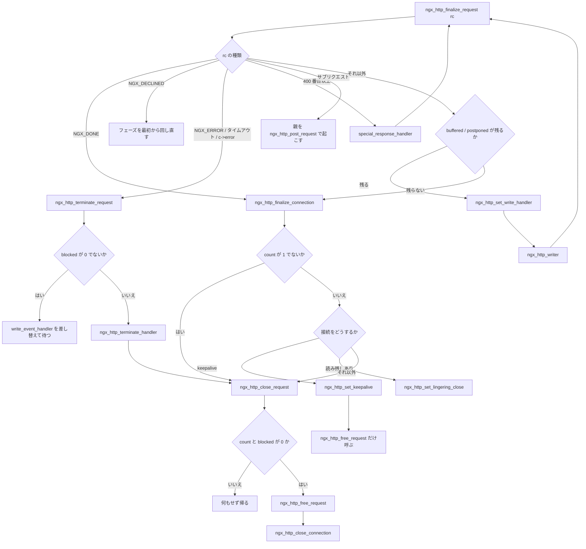

## この層の責務

応答を送り終わったらリクエストを終わらせる。単純に聞こえるが、「終わらせる」には少なくとも 5 つの独立した判断が要る。

1. **本当に終わっているか** — サブリクエストがまだ走っていないか。上流への接続が残っていないか。AIO の完了通知を待っていないか
2. **送り残しはないか** — `send_chain()` が全部送れたとは限らない
3. **接続を再利用するか** — keepalive なら、リクエストのメモリだけ捨てて接続は残す
4. **切るとして、すぐ切ってよいか** — 受信キューにデータが残ったまま `close()` すると RST になり、送った応答がクライアントに届かない
5. **ログはいつ書くか** — アクセスログには最終的なステータスとバイト数が要る

これらは互いに順序と依存を持つ。だから 1 本の関数にならず、6 本に分かれている。そして中心にあるのが参照カウンタだ。**リクエストは、誰も参照していないと分かるまで解放できない。**

## 主要な型とその関係

### 終了を止める 5 つのフィールド

すべて `ngx_http_request_t` にある ([`src/http/ngx_http_request.h#L470-L474`](https://github.com/nginx/nginx/blob/release-1.31.4/src/http/ngx_http_request.h#L470-L474)、[`#L434`](https://github.com/nginx/nginx/blob/release-1.31.4/src/http/ngx_http_request.h#L434)、[`#L564`](https://github.com/nginx/nginx/blob/release-1.31.4/src/http/ngx_http_request.h#L564))。

```c title="src/http/ngx_http_request.h"
    ngx_http_postponed_request_t     *postponed;
    /* ... */
    unsigned                          count:16;
    unsigned                          subrequests:8;
    unsigned                          blocked:8;

    unsigned                          aio:1;
    /* ... */
    unsigned                          buffered:4;
```

| フィールド  | 位置                         | 意味                                                            | 解除するのは                          |
| ----------- | ---------------------------- | --------------------------------------------------------------- | ------------------------------------- |
| `count`     | `r->main` のみ               | 参照カウンタ。0 で解放                                          | `ngx_http_close_request` の `count--` |
| `blocked`   | `r->main` のみ               | I/O が進行中。**カウンタとは別に、必ず 0 でないと解放できない** | AIO / スレッドプールの完了ハンドラ    |
| `aio`       | 各リクエスト                 | このリクエストが AIO 待ち                                       | 同上                                  |
| `buffered`  | 各リクエスト + `c->buffered` | どのフィルタがデータを抱えているか                              | フィルタが吐き切ったとき              |
| `postponed` | 各リクエスト                 | 出力順を待っているサブリクエストや出力                          | postpone フィルタ                     |

`count` は 16 ビットしかない。同時に 65535 個の参照は持てないという上限で、サブリクエストの深さ制限 (`NGX_HTTP_MAX_SUBREQUESTS` は 50) と併せて暴走を止める役割も持つ。生成時の初期値は 1 だ ([`ngx_http_request.c#L646`](https://github.com/nginx/nginx/blob/release-1.31.4/src/http/ngx_http_request.c#L646))。

`blocked` が `count` と別なのは意味がある。**`count` が 0 でも `blocked` が残っていることがある。** AIO の読み込みを投げた直後にクライアントが切断した、というケースだ。カーネルが完了通知を返すバッファはリクエストのプールから取られているので、プールを捨てられない。

### カウントを持つのは誰か

| 増やす場所                                               | 理由                                | 行                                                                                                                         |
| -------------------------------------------------------- | ----------------------------------- | -------------------------------------------------------------------------------------------------------------------------- |
| `ngx_http_create_request`                                | 生成時に 1                          | [`ngx_http_request.c#L646`](https://github.com/nginx/nginx/blob/release-1.31.4/src/http/ngx_http_request.c#L646)           |
| `ngx_http_subrequest`                                    | サブリクエストが 1 本走っている     | [`ngx_http_core_module.c#L2555`](https://github.com/nginx/nginx/blob/release-1.31.4/src/http/ngx_http_core_module.c#L2555) |
| `ngx_http_read_client_request_body`                      | ボディを非同期に読んでいる          | [`ngx_http_request_body.c#L43`](https://github.com/nginx/nginx/blob/release-1.31.4/src/http/ngx_http_request_body.c#L43)   |
| `ngx_http_discard_request_body`                          | ボディを読み捨て中                  | [`ngx_http_request_body.c#L704`](https://github.com/nginx/nginx/blob/release-1.31.4/src/http/ngx_http_request_body.c#L704) |
| `ngx_http_upstream_create`                               | 前の上流接続を片付ける間            | [`ngx_http_upstream.c#L517`](https://github.com/nginx/nginx/blob/release-1.31.4/src/http/ngx_http_upstream.c#L517)         |
| `ngx_http_internal_redirect` / `ngx_http_named_location` | 内部リダイレクトで処理をやり直す    | [`ngx_http_core_module.c#L2631`](https://github.com/nginx/nginx/blob/release-1.31.4/src/http/ngx_http_core_module.c#L2631) |
| `ngx_http_request_handler`                               | `c->close` を見て強制終了に入るとき | [`ngx_http_request.c#L2598`](https://github.com/nginx/nginx/blob/release-1.31.4/src/http/ngx_http_request.c#L2598)         |

減らすのは 3 箇所しかない。`ngx_http_close_request` の `r->count--`、サブリクエスト完了時の `r->main->count--`、`ngx_http_post_action` の `r->main->count--` だ。

**「増やした主体が減らす」ではなく、「増やした主体は `ngx_http_finalize_request` を呼び、それが最終的に `ngx_http_close_request` に落ちる」という形になっている。** だから増減の対応関係がコード上で見えにくい。この非対称が、この層を読みにくくしている最大の要因だ。

### 6 本 + 1 本

| 関数                           | 行                                                                                                | 何を判断するか                                             |
| ------------------------------ | ------------------------------------------------------------------------------------------------- | ---------------------------------------------------------- |
| `ngx_http_finalize_request`    | [2683](https://github.com/nginx/nginx/blob/release-1.31.4/src/http/ngx_http_request.c#L2683)-2868 | 戻り値 `rc` を見て、どの終わり方をするか                   |
| `ngx_http_terminate_request`   | [2872](https://github.com/nginx/nginx/blob/release-1.31.4/src/http/ngx_http_request.c#L2872)-2923 | 異常終了。cleanup を全部呼んで即座に落とす                 |
| `ngx_http_terminate_handler`   | [2927](https://github.com/nginx/nginx/blob/release-1.31.4/src/http/ngx_http_request.c#L2927)-2935 | 上の続きを次のループで実行する 9 行のアダプタ              |
| `ngx_http_finalize_connection` | [2939](https://github.com/nginx/nginx/blob/release-1.31.4/src/http/ngx_http_request.c#L2939)-3015 | 接続をどうするか。keepalive / lingering close / 即クローズ |
| `ngx_http_close_request`       | [3888](https://github.com/nginx/nginx/blob/release-1.31.4/src/http/ngx_http_request.c#L3888)-3917 | カウンタを 1 減らし、0 なら次へ                            |
| `ngx_http_free_request`        | [3921](https://github.com/nginx/nginx/blob/release-1.31.4/src/http/ngx_http_request.c#L3921)-4012 | ログを書き、cleanup を呼び、`r->pool` を破棄する           |
| `ngx_http_close_connection`    | [4034](https://github.com/nginx/nginx/blob/release-1.31.4/src/http/ngx_http_request.c#L4034)-4069 | TLS を閉じ、fd を閉じ、`c->pool` を破棄する                |

責務の切れ目は「何を捨てるか」で引かれている。`close_request` はカウンタ、`free_request` はリクエストのプール、`close_connection` は接続のプール。**keepalive のときは `free_request` だけを呼んで `close_connection` を呼ばない。** この 2 本が分かれているのは、そのためだけと言っていい。

## 処理の流れ



### `ngx_http_finalize_request` の分岐

186 行あるが、上から順に読める ([`#L2683-L2868`](https://github.com/nginx/nginx/blob/release-1.31.4/src/http/ngx_http_request.c#L2683-L2868))。最初の 3 つは早期 return だ。

```c title="src/http/ngx_http_request.c"
    if (rc == NGX_DONE) {
        ngx_http_finalize_connection(r);
        return;
    }

    if (rc == NGX_OK && r->filter_finalize) {
        c->error = 1;
    }

    if (rc == NGX_DECLINED) {
        r->content_handler = NULL;
        r->write_event_handler = ngx_http_core_run_phases;
        ngx_http_core_run_phases(r);
        return;
    }
```

`NGX_DONE` は「もうやることはない。接続の始末だけしてくれ」だ。`ngx_http_writer` が書き終えたときと、読み捨てが終わったときにこれが来る。

`NGX_DECLINED` は逆向きで、**フェーズエンジンに戻す**。`r->content_handler = NULL` を置くのが要点で、これがないと同じコンテンツハンドラが再び選ばれて無限ループになる。[フェーズエンジン](../phase-engine/) が `ngx_http_core_content_phase` で `r->content_handler` を優先することの裏返しだ。

`r->filter_finalize` は、[出力フィルタチェーン](../output-filter-chain/) の途中でエラーになったときに立つフラグだ。フィルタは `NGX_OK` を返してくるが、`c->error = 1` を立てて後の分岐を異常系に倒す。

次がサブリクエストのコールバックとエラー処理 ([`#L2711-L2753`](https://github.com/nginx/nginx/blob/release-1.31.4/src/http/ngx_http_request.c#L2711-L2753))。

```c title="src/http/ngx_http_request.c"
    if (r != r->main && r->post_subrequest) {
        rc = r->post_subrequest->handler(r, r->post_subrequest->data, rc);
    }

    if (rc == NGX_ERROR
        || rc == NGX_HTTP_REQUEST_TIME_OUT
        || rc == NGX_HTTP_CLIENT_CLOSED_REQUEST
        || c->error)
    {
        if (ngx_http_post_action(r) == NGX_OK) {
            return;
        }

        ngx_http_terminate_request(r, rc);
        return;
    }

    if (rc >= NGX_HTTP_SPECIAL_RESPONSE || rc == NGX_HTTP_CREATED
        || rc == NGX_HTTP_NO_CONTENT)
    {
        /* ... NGX_HTTP_CLOSE なら terminate、それ以外はタイマを落とす ... */
        ngx_http_finalize_request(r, ngx_http_special_response_handler(r, rc));
        return;
    }
```

`post_subrequest->handler` の戻り値が `rc` を上書きする。サブリクエストの完了コールバックが、親から見た結果を書き換えられる。

400 番台以上のときは、**エラーページを生成してから自分自身を呼び直す**。再帰が 1 段で止まるのは、戻ってくる値がもう 400 番台以上ではないからだ。`error_page` 指令で別の URI に飛ばす場合は `r->error_page = 1` が立ち、エラーページの処理中にまたエラーが起きても同じ指令を二度は適用しない ([`src/http/ngx_http_special_response.c#L464-L467`](https://github.com/nginx/nginx/blob/release-1.31.4/src/http/ngx_http_special_response.c#L464-L467))。

### サブリクエストは親を起こして終わる

`r != r->main` の分岐が 73 行ある ([`#L2755-L2827`](https://github.com/nginx/nginx/blob/release-1.31.4/src/http/ngx_http_request.c#L2755-L2827))。

```c title="src/http/ngx_http_request.c (骨格)"
    if (r != r->main) {

        if (r->buffered || r->postponed) {
            /* ... ngx_http_set_write_handler して帰る ... */
            return;
        }

        pr = r->parent;

        if (r == c->data || r->background) {
            /* ... log_subrequest ならログを書き、r->logged = 1 ...
             * ... r->background なら ngx_http_finalize_connection して帰る ... */
            r->done = 1;

            r->main->count--;
            r->write_event_handler = ngx_http_request_empty_handler;

            if (pr->postponed && pr->postponed->request == r) {
                pr->postponed = pr->postponed->next;
            }

            c->data = pr;

        } else {
            r->write_event_handler = ngx_http_request_finalizer;

            if (r->waited) {
                r->done = 1;
            }
        }

        if (ngx_http_post_request(pr, NULL) != NGX_OK) {
            r->main->count++;
            ngx_http_terminate_request(r, 0);
        }

        return;
    }
```

分かれ目は `r == c->data` だ。`c->data` は「今この接続で出力してよいリクエスト」を指す。自分がそれなら、**カウントを 1 返して `c->data` を親に戻す**。そうでなければ (自分より先に出力すべき兄弟がいる)、`write_event_handler` を `ngx_http_request_finalizer` に差し替えるだけで、カウントは返さない。後で自分の順番が来たときに、この finalizer が `ngx_http_finalize_request(r, 0)` を呼び直す。

そして最後に `ngx_http_post_request(pr, NULL)` で親を起こす。**サブリクエストの終了は、親のイベントハンドラを posted requests キューに積むことで伝わる。** 親のスタックフレームに直接戻るのではない。この仕組みは [サブリクエストのページ](../subrequest-postpone/) の主題で、`ngx_http_run_posted_requests()` が回す。

失敗したときの `r->main->count++` は、直前に減らしたぶんを戻している。エラーパスでも「増やした側が増やし直す」が保たれている。

### メインリクエストの最後

```c title="src/http/ngx_http_request.c:2829-2867 (骨格)"
    if (r->buffered || c->buffered || r->postponed) {

        if (ngx_http_set_write_handler(r) != NGX_OK) {
            ngx_http_terminate_request(r, 0);
        }

        return;
    }

    if (r != c->data) {
        ngx_log_error(NGX_LOG_ALERT, c->log, 0,
                      "http finalize non-active request: \"%V?%V\"",
                      &r->uri, &r->args);
        return;
    }

    r->done = 1;

    r->read_event_handler = ngx_http_block_reading;
    r->write_event_handler = ngx_http_request_empty_handler;
    /* ... post_action / 読み書きのタイマ落とし ... */

    ngx_http_finalize_connection(r);
```

`r->buffered || c->buffered || r->postponed` の 3 つが、終了を止める条件だ。1 つでも立っていれば書き込みハンドラを設定して帰る。サブリクエストの側では `c->buffered` を見ていない。ソケットへの書き残しは接続に 1 つしかなく、それを気にするのはメインリクエストの役目だからだ。

### 書き残しの再開: `ngx_http_writer`

`ngx_http_set_write_handler()` がハンドラを差し替える ([`#L3019-L3048`](https://github.com/nginx/nginx/blob/release-1.31.4/src/http/ngx_http_request.c#L3019-L3048))。

```c title="src/http/ngx_http_request.c"
    r->http_state = NGX_HTTP_WRITING_REQUEST_STATE;

    r->read_event_handler = r->discard_body ?
                                ngx_http_discarded_request_body_handler:
                                ngx_http_test_reading;
    r->write_event_handler = ngx_http_writer;

    wev = r->connection->write;

    if (wev->ready && wev->delayed) {
        return NGX_OK;
    }
    /* ... send_timeout のタイマと ngx_handle_write_event ... */
```

読み側のハンドラも同時に差し替えている。`r->discard_body` が立っていれば読み捨てを続け、そうでなければ `ngx_http_test_reading` — **クライアントが切断していないかだけを見る**ハンドラになる。応答を書いている最中に相手が消えたら、書き続けても意味がない。

`ngx_http_writer` は、新しいデータを渡さずにチェーンを叩く ([`#L3076-L3120`](https://github.com/nginx/nginx/blob/release-1.31.4/src/http/ngx_http_request.c#L3076-L3120))。

```c title="src/http/ngx_http_request.c"
    if (wev->delayed || r->aio) {
        /* ... タイマを張り直して帰る ... */
        return;
    }

    rc = ngx_http_output_filter(r, NULL);

    if (rc == NGX_ERROR) {
        ngx_http_finalize_request(r, rc);
        return;
    }

    if (r->buffered || r->postponed || (r == r->main && c->buffered)) {
        /* ... タイマを張り直して帰る ... */
        return;
    }

    r->write_event_handler = ngx_http_request_empty_handler;

    ngx_http_finalize_request(r, rc);
```

`ngx_http_output_filter(r, NULL)` の `NULL` が肝で、各フィルタはこれを「溜まっているぶんを流せ」と読む。全部吐けたら `ngx_http_finalize_request` に戻り、今度は `r->buffered` が落ちているので先に進める。

**`r->write_event_handler` を差し替えるという 1 つの手段で、「後で続きをやる」が表現されている。** 状態機械のノードが関数ポインタとして表に出ている形で、[ワーカーのイベントループ](../state-machine/) の作法そのままだ。

### 異常終了: `ngx_http_terminate_request`

```c title="src/http/ngx_http_request.c:2872-2923 (骨格)"
    mr = r->main;

    mr->terminated = 1;
    /* ... rc をステータスに反映 ... */

    cln = mr->cleanup;
    mr->cleanup = NULL;

    while (cln) {
        if (cln->handler) {
            cln->handler(cln->data);
        }
        cln = cln->next;
    }

    if (mr->write_event_handler) {

        if (mr->blocked) {
            r = r->connection->data;

            r->connection->error = 1;
            r->write_event_handler = ngx_http_request_finalizer;

            return;
        }

        e = ngx_http_ephemeral(mr);
        mr->posted_requests = NULL;
        mr->write_event_handler = ngx_http_terminate_handler;
        (void) ngx_http_post_request(mr, &e->terminal_posted_request);
        return;
    }

    ngx_http_close_request(mr, rc);
```

cleanup ハンドラを全部呼ぶ。上流への接続を切る、キャッシュノードの参照を返す、一時ファイルを消す。これらは `count` の外側にある資源で、cleanup を呼ばないと漏れる。

`mr->blocked` が立っているときは、**何もせず帰る**。AIO やスレッドプールが完了通知を返すまで待つしかない。`c->error = 1` を立てておくと、通知が返ってきたときのハンドラがそれを見て終了に進む。

そうでなければ `ngx_http_terminate_handler` を write ハンドラに据えて、自分自身を posted requests に積む。その先の関数は 9 行しかない ([`#L2927-L2935`](https://github.com/nginx/nginx/blob/release-1.31.4/src/http/ngx_http_request.c#L2927-L2935))。

```c title="src/http/ngx_http_request.c"
static void
ngx_http_terminate_handler(ngx_http_request_t *r)
{
    r->count = 1;

    ngx_http_close_request(r, 0);
}
```

やっているのは `r->count = 1` の代入だけだ。**残っている参照を全部無視して、次の `count--` で 0 にする。** 通常の終了経路が「参照が返るのを待つ」のに対し、terminate は「待たずに落とす」を選ぶ。だから `blocked` だけは無視できない — あれはメモリの生存期間の問題であって、参照の問題ではないからだ。

`ngx_http_post_request` で 1 周遅らせるのは、**今実行中のスタックが `r` を触っている最中に `r->pool` を破棄しないため**だ。この関数はフィルタの中からもハンドラの中からも呼ばれる。

### 接続をどうするか: `ngx_http_finalize_connection`

```c title="src/http/ngx_http_request.c:2939-3015 (骨格)"
    /* ... HTTP/2 と HTTP/3 はストリームを閉じて終わり ... */

    if (r->main->count != 1) {

        if (r->discard_body) {
            r->read_event_handler = ngx_http_discarded_request_body_handler;
            ngx_add_timer(r->connection->read, clcf->lingering_timeout);
            /* ... r->lingering_time を初期化 ... */
        }

        ngx_http_close_request(r, 0);
        return;
    }

    r = r->main;
    /* ... read->eof なら即 ngx_http_close_request ... */

    if (r->reading_body) {
        r->keepalive = 0;
        r->lingering_close = 1;
    }
    /* ... keepalive_min_timeout > 0 なら ngx_http_set_keepalive ... */

    if (!ngx_terminate && !ngx_exiting
         && r->keepalive && clcf->keepalive_timeout > 0)
    {
        ngx_http_set_keepalive(r);
        return;
    }

    if (clcf->lingering_close == NGX_HTTP_LINGERING_ALWAYS
        || (clcf->lingering_close == NGX_HTTP_LINGERING_ON
            && (r->lingering_close
                || r->header_in->pos < r->header_in->last
                || r->connection->read->ready
                || r->connection->pipeline)))
    {
        ngx_http_set_lingering_close(r->connection);
        return;
    }

    ngx_http_close_request(r, 0);
```

`r->main->count != 1` が最初の関門だ。**自分以外に参照が残っているなら、接続の判断はできない。** カウントを 1 返して帰る。ただし読み捨てが動いているなら、そのタイマだけは張り直しておく。応答は返し終わっているのに、まだクライアントからボディを受け取り続けている、という状態がここで作られる。

`ngx_terminate` / `ngx_exiting` を見ているのは、**再読み込みや終了処理の最中は新しい keepalive を張らない**ためだ。古いワーカーが早く抜けられるようになる ([マスタとワーカーのページ](../master-worker/))。

最後の条件が lingering close の発動判定で、4 つのうち 1 つでも当たれば読み捨ててから切る。`r->lingering_close` (413 やボディを読み残した経路で立つ)、`r->header_in` に未処理のバイトがある、カーネルの受信キューにデータがある、この接続でパイプラインを見たことがある、の 4 つだ。

### keepalive: 何を残し、何を捨てるか

`ngx_http_set_keepalive()` は 225 行ある ([`#L3292-L3516`](https://github.com/nginx/nginx/blob/release-1.31.4/src/http/ngx_http_request.c#L3292-L3516))。長さのほとんどはバッファの始末で、本質は 3 行だ ([`#L3359-L3364`](https://github.com/nginx/nginx/blob/release-1.31.4/src/http/ngx_http_request.c#L3359-L3364))。

```c title="src/http/ngx_http_request.c"
    /* guard against recursive call from ngx_http_finalize_connection() */
    r->keepalive = 0;

    ngx_http_free_request(r, 0);

    c->data = hc;
```

**`ngx_http_free_request` を呼び、`ngx_http_close_connection` を呼ばない。** `c->data` は `ngx_http_request_t *` から `ngx_http_connection_t *` に切り替わる。この 2 つが同じフィールドを共有していることが、接続の「リクエストを処理中」と「アイドル」の 2 状態を表している。

| 対象                                           | keepalive での扱い                                            | 根拠                                                                                                         |
| ---------------------------------------------- | ------------------------------------------------------------- | ------------------------------------------------------------------------------------------------------------ |
| `r->pool` とそこから確保した全部               | 破棄。`ngx_http_request_t` 自身もここから確保されている       | `ngx_http_free_request` → `ngx_destroy_pool`                                                                 |
| `r->ctx` / 変数 / `headers_in` / `headers_out` | 破棄                                                          | 同上                                                                                                         |
| リクエストボディの一時ファイル                 | cleanup ハンドラが消す                                        | `ngx_http_free_request` の cleanup ループ                                                                    |
| `c->pool` / `ngx_connection_t` / fd            | 残す                                                          | `ngx_http_close_connection` を呼ばない                                                                       |
| `ngx_http_connection_t` (`hc`)                 | 残す。`c->data` に戻す                                        | `c->pool` から確保されている                                                                                 |
| `c->buffer` の `ngx_buf_t` 構造体              | 残す。`start` / `end` を保ってサイズ情報にする                |                                                                                                              |
| `c->buffer` の実メモリ                         | 返せるなら `ngx_pfree` で返し、`b->pos = NULL` を目印に置く   | [`#L3410-L3424`](https://github.com/nginx/nginx/blob/release-1.31.4/src/http/ngx_http_request.c#L3410-L3424) |
| large header buffers (`hc->free` / `hc->busy`) | 全部解放                                                      | [`#L3429-L3453`](https://github.com/nginx/nginx/blob/release-1.31.4/src/http/ngx_http_request.c#L3429-L3453) |
| TLS の書き込みバッファ                         | `ngx_ssl_free_buffer` で解放                                  | [`#L3455-L3459`](https://github.com/nginx/nginx/blob/release-1.31.4/src/http/ngx_http_request.c#L3455-L3459) |
| TLS セッション `c->ssl`                        | 残す。ハンドシェイクをやり直さない                            |                                                                                                              |
| read イベントとタイマ                          | 残す。ハンドラを `ngx_http_keepalive_handler` に付け替える    |                                                                                                              |
| write イベント                                 | `ngx_http_empty_handler` にして、level trigger なら登録を外す |                                                                                                              |
| `c->sent` / `c->destroyed`                     | 次のリクエストを作るときに 0 に戻す                           | [`#L3657-L3658`](https://github.com/nginx/nginx/blob/release-1.31.4/src/http/ngx_http_request.c#L3657-L3658) |

バッファのメモリを返すところにコメントが付いている。

```c title="src/http/ngx_http_request.c:3403-3424"
    /*
     * To keep a memory footprint as small as possible for an idle keepalive
     * connection we try to free c->buffer's memory if it was allocated outside
     * the c->pool.  The large header buffers are always allocated outside the
     * c->pool and are freed too.
     */

    b = c->buffer;

    if (ngx_pfree(c->pool, b->start) == NGX_OK) {

        /*
         * the special note for ngx_http_keepalive_handler() that
         * c->buffer's memory was freed
         */

        b->pos = NULL;

    } else {
        b->pos = b->start;
        b->last = b->start;
    }
```

`ngx_pfree` は [プール](../memory-pool/) の large ブロックしか返せないので、`client_header_buffer_size` が小さければ失敗する。**成功したかどうかを `b->pos == NULL` という形で記録している。** `ngx_http_keepalive_handler` はこれを見て、必要になったときに確保し直す ([`#L3576-L3593`](https://github.com/nginx/nginx/blob/release-1.31.4/src/http/ngx_http_request.c#L3576-L3593))。専用のフラグを持たず、意味を持てないはずのポインタ値に意味を持たせている。

アイドル接続 1 本あたりのメモリを削るためにここまでやるのは、**同時に数万本のアイドル接続を抱えるから**だ。1 KB × 5 万本で 50 MB になる。

### パイプラインの扱い

`c->buffer` にまだ読んでいないバイトが残っていれば、次のリクエストが既に届いている。その場合は `ngx_http_create_request(c)` で新しいリクエストを作り、`r->pipeline = 1` と `c->sent = 0` / `c->destroyed = 0` を置いて、読み込みハンドラを `ngx_http_process_request_line` に戻す ([`#L3374-L3401`](https://github.com/nginx/nginx/blob/release-1.31.4/src/http/ngx_http_request.c#L3374-L3401))。最後の 1 行が効いている。

```c title="src/http/ngx_http_request.c"
        rev->handler = ngx_http_process_request_line;
        ngx_post_event(rev, &ngx_posted_events);
        return;
```

**呼び出し直せば済むのに、わざと 1 周遅らせている。** そうしないと、パイプラインされたリクエストを 100 個並べたクライアントが、ワーカーを 100 リクエストぶん占有する。1 周ごとに他の接続へ譲る、という [レイテンシの上限](../loop-latency/) の考え方がここにも入っている。

この経路では `ngx_reusable_connection` を呼ばない。処理中の接続をアイドル扱いにしてはいけないからだ。非パイプラインの経路では、`keepalive_min_timeout` が 0 のときだけ `c->idle = 1; ngx_reusable_connection(c, 1);` を実行する ([`#L3496-L3499`](https://github.com/nginx/nginx/blob/release-1.31.4/src/http/ngx_http_request.c#L3496-L3499))。これでこの接続は「接続が枯渇したら切ってよいリスト」に入る。仕組みは [接続の再利用のページ](../connection-reuse/) にある。

### lingering close

なぜ切る前に読むのか。TCP の仕様がそうなっているからだ。

受信キューに未読データが残った状態で `close()` すると、カーネルは FIN ではなく RST を送る。RST を受け取った側は、**自分の受信バッファにある未読データを破棄する**。つまり、サーバが送り終えたはずの応答を、クライアントが読む前に捨ててしまう。

`POST` に対して 413 や 302 を返す場面で、これが実際に起きる。クライアントは 10 MB を送っている最中で、サーバは 1 KB の応答を返してすぐ切りたい。素直に切ると、クライアントには「接続が切れた」としか見えない。

```c title="src/http/ngx_http_request.c:3668-3735 (骨格)"
    if (r->lingering_time == 0) {
        r->lingering_time = ngx_time() + (time_t) (clcf->lingering_time / 1000);
    }

    /* ... TLS なら先に shutdown。NGX_AGAIN なら自分をコールバックに登録 ... */

    rev = c->read;
    rev->handler = ngx_http_lingering_close_handler;
    /* ... ngx_handle_read_event ... */

    wev = c->write;
    wev->handler = ngx_http_empty_handler;
    /* ... level trigger なら write イベントの登録を外す ... */

    if (ngx_shutdown_socket(c->fd, NGX_WRITE_SHUTDOWN) == -1) {
        ngx_connection_error(c, ngx_socket_errno,
                             ngx_shutdown_socket_n " failed");
        ngx_http_close_request(r, 0);
        return;
    }

    c->close = 0;
    ngx_reusable_connection(c, 1);

    ngx_add_timer(rev, clcf->lingering_timeout);

    if (rev->ready) {
        ngx_http_lingering_close_handler(rev);
    }
```

`shutdown(fd, SHUT_WR)` で書き込み方向だけを閉じる。**FIN は送られるので、クライアントは「応答は全部届いた」と分かる。** 読み方向は開いたままなので、クライアントが送り続けているぶんを受け取れる。

ハンドラは、4096 バイトのスタック上のバッファに読んでは捨てるだけだ ([`#L3739-L3795`](https://github.com/nginx/nginx/blob/release-1.31.4/src/http/ngx_http_request.c#L3739-L3795))。タイマは 2 段で、`lingering_time` (既定 30 秒) が全体の上限、`lingering_timeout` (既定 5 秒) が「次のデータが来るまで待つ時間」。どちらかが切れたら諦めて切る。

ここにも `ngx_reusable_connection(c, 1)` がある。**読み捨て中の接続は、他で接続が足りなくなったら真っ先に切ってよい。** 応答は既に送ってあるので、切っても実害がない。

### 最後の 3 本

```c title="src/http/ngx_http_request.c:3888-3917 (骨格)"
void
ngx_http_close_request(ngx_http_request_t *r, ngx_int_t rc)
{
    ngx_connection_t  *c;

    r = r->main;
    c = r->connection;

    if (r->count == 0) {
        ngx_log_error(NGX_LOG_ALERT, c->log, 0, "http request count is zero");
    }

    r->count--;

    if (r->count || r->blocked) {
        return;
    }

    /* ... HTTP/2 なら ngx_http_v2_close_stream に飛んで接続には触らない ... */

    ngx_http_free_request(r, rc);
    ngx_http_close_connection(c);
}
```

30 行で、判断は `r->count || r->blocked` の 1 行だけ。`r = r->main` を先頭で書いているので、サブリクエストに対して呼んでも正しく動く。**この関数はどこから呼んでもよい。** リクエストを触る資格を持つコードは、終わったらこれを呼べばいい。

`ngx_http_free_request` はログと後始末をする ([`#L3921-L4012`](https://github.com/nginx/nginx/blob/release-1.31.4/src/http/ngx_http_request.c#L3921-L4012))。

```c title="src/http/ngx_http_request.c (骨格)"
    if (r->pool == NULL) {
        ngx_log_error(NGX_LOG_ALERT, log, 0, "http request already closed");
        return;
    }

    cln = r->cleanup;
    r->cleanup = NULL;

    while (cln) {
        if (cln->handler) {
            cln->handler(cln->data);
        }

        cln = cln->next;
    }
    /* ... rc をステータスに反映 ... */

    if (!r->logged) {
        log->action = "logging request";
        ngx_http_log_request(r);
    }
    /* ... reset_timedout_connection なら SO_LINGER で RST を送る ... */

    r->connection->destroyed = 1;

    pool = r->pool;
    r->pool = NULL;

    ngx_destroy_pool(pool);
```

**LOG フェーズはここで走る。** [フェーズエンジン](../phase-engine/) の 11 フェーズのうち、`NGX_HTTP_LOG_PHASE` だけはフェーズエンジンから呼ばれない。`ngx_http_log_request()` が `cmcf->phases[NGX_HTTP_LOG_PHASE].handlers` を順に呼ぶだけで、checker も無く戻り値も見ない ([`#L4016-L4030`](https://github.com/nginx/nginx/blob/release-1.31.4/src/http/ngx_http_request.c#L4016-L4030))。**LOG フェーズだけは「途中で止まる」ことがありえない**ので、フェーズエンジンの仕組みが要らない。

`r->pool = NULL` を先に代入してから `ngx_destroy_pool(pool)` を呼ぶのは、二重解放を検出するためだ。コメントにそう書いてある。

`ngx_http_close_connection` は TLS を閉じて `c->pool` を破棄する ([`#L4034-L4069`](https://github.com/nginx/nginx/blob/release-1.31.4/src/http/ngx_http_request.c#L4034-L4069))。`ngx_ssl_shutdown` が `NGX_AGAIN` を返したら自分自身をコールバックに登録して帰る。TLS の close_notify を送る間、接続は生き延びる。

## 守られている不変条件

**`count` が 0 になるまで `r->pool` を破棄しない。** これが全体の基礎で、`ngx_http_close_request` の 1 箇所で守られている。サブリクエスト・上流接続・ボディ読み込み・内部リダイレクトが、それぞれ 1 を持つ。

**`blocked` が 0 でなければ、`count` が 0 でも解放しない。** AIO やスレッドプールが書き込む先がリクエストのプールにあるからだ。`count` が「論理的な参照」なら `blocked` は「物理的な参照」で、terminate ですら無視できない。

**`ngx_http_finalize_request` は再入する。** エラーページ生成、`ngx_http_writer` からの復帰、`NGX_DECLINED` からのフェーズ再開。どれも自分自身を呼び直す。だからこの関数は、呼ばれた時点の状態だけを見て判断できるように書かれている。ローカルな状態を持たない。

**`r->pool` を破棄するスタックフレームで `r` を触らない。** `ngx_http_terminate_request` が `ngx_http_post_request` で 1 周遅らせるのはこのためだ。フィルタの奥深くから terminate が呼ばれることがあり、そこで解放するとスタックを戻る途中で解放済みメモリを触る。

**`c->data` は常に「今この接続で出力してよい主体」を指す。** リクエスト処理中は `ngx_http_request_t *`、アイドル中は `ngx_http_connection_t *`。サブリクエストが走っている間は、そのサブリクエストを指す。

**ログは 1 リクエストにつき 1 回。** `r->logged` が守る。サブリクエストは `log_subrequest` が有効なときだけ書かれる。

**応答を送り終える前に接続を切らない。** lingering close が RST を防ぐ。`shutdown(SHUT_WR)` で FIN を先に届けてから、読み方向だけ開けておく。

## つまずきどころ

### `NGX_DONE` を返し忘れる

コンテンツハンドラが非同期処理を始めた場合、`NGX_DONE` を返さなければならない。`NGX_OK` を返すと、[フェーズエンジン](../phase-engine/) の `ngx_http_core_content_phase` が `ngx_http_finalize_request(r, rc)` を呼び、処理の途中でリクエストが終わる。逆に、同期的に終わったのに `NGX_DONE` を返すと、誰も finalize を呼ばない。リクエストは宙に浮き、`send_timeout` が切れるまで生き残る。

境界が分かりにくいのは、**`ngx_http_read_client_request_body()` のように「同期に終わることも非同期に終わることもある」API があるから**だ。この API は `count++` を先にやることで「常に非同期扱いでよい」に揃えている ([リクエストボディのページ](../request-body/))。

### `count` を自分で減らさない

`count++` した側が `count--` するのではない。`ngx_http_finalize_request` を呼べば、そこから `ngx_http_close_request` に落ちて減る。自分で `r->main->count--` と書いてよいのは、サブリクエストの完了と `ngx_http_post_action` の 2 箇所だけだ。

余計に減らすと、まだ使っているリクエストのプールが破棄される。減らし忘れると、接続が `send_timeout` まで残る。前者はクラッシュするので気づくが、後者は気づきにくい。

### `finalize` を呼んだ後に `r` を触らない

`ngx_http_finalize_request(r, rc)` は、条件が揃えばその場で `r->pool` を破棄する。呼んだ後に `r->something` を読むコードは、解放済みメモリを読む。Nginx のコードが `ngx_http_finalize_request(r, rc); return;` という形で必ず即座に return しているのは、この規約を目に見える形にするためだ。例外は無い。

同じ理由で、`ngx_http_run_posted_requests()` はループの先頭で `c->destroyed` を検査する ([`#L2626-L2637`](https://github.com/nginx/nginx/blob/release-1.31.4/src/http/ngx_http_request.c#L2626-L2637))。

```c title="src/http/ngx_http_request.c"
    for ( ;; ) {

        if (c->destroyed) {
            return;
        }

        r = c->data;
        pr = r->main->posted_requests;
```

posted requests を回している最中に、あるリクエストが接続ごと閉じることがある。`c->destroyed` は `ngx_http_free_request` が立てるフラグで、**「もう `c->data` を信じてはいけない」という印**として使われる。

### keepalive を切りたいのに切れない

`r->keepalive` は複数の場所で落とされる。`Connection: close` を受け取った、HTTP/1.0 で `Connection: keep-alive` が無い、`Content-Length` が決まらず chunked にもできない、`r->reading_body` — ボディを読んでいる途中で終了に入った、上流からのエラー。

このうち chunked filter の経路は分かりにくい。HTTP/1.0 のクライアントに `Content-Length` 不明の応答を返すと、長さを伝える手段が無いので「接続を切ることで終端を示す」しかなくなる。設定で keepalive を有効にしていても、この応答だけは切れる。

### `blocked` はカウンタで、フラグではない

`blocked:8` は 8 ビットの整数だ。AIO の読み込みが複数走ることがあるので `++` と `--` で数える。`r->aio` の方は 1 ビットのフラグで、「このリクエストが今 AIO を待っているか」を表す。

`ngx_http_copy_filter` の AIO 完了ハンドラが、両方を戻したうえで合流点を選ぶ ([`src/http/ngx_http_copy_filter_module.c#L208-L222`](https://github.com/nginx/nginx/blob/release-1.31.4/src/http/ngx_http_copy_filter_module.c#L208-L222))。

```c title="src/http/ngx_http_copy_filter_module.c"
    r->main->blocked--;
    r->aio = 0;

    if (r->main->terminated) {
        /*
         * trigger connection event handler if the request was
         * terminated
         */
        c->write->handler(c->write);

    } else {
        r->write_event_handler(r);
        ngx_http_run_posted_requests(c);
    }
```

`r->main->terminated` を見る分岐が、`ngx_http_terminate_request` が `blocked` で待っていた場合の合流点だ。**terminate は「待つ」と決めて帰り、AIO の完了ハンドラが「待たせていた側」として終了を再開する。** 2 つの関数が `terminated` と `blocked` という 2 つのフィールド越しに約束を交わしている。

### HTTP/2 と HTTP/3 では経路が短い

`ngx_http_finalize_connection` は、`r->stream` (HTTP/2) や `c->quic` (HTTP/3) があれば `ngx_http_close_request(r, 0)` を呼んで終わる。keepalive も lingering close も無い。多重化された接続では、ストリームが終わっても接続は残るのが当たり前で、「接続を再利用するか」という判断そのものが要らない。同じことは `ngx_http_close_request` にもあって、`r->stream` があれば `ngx_http_v2_close_stream` に飛んで接続には触らない。

**HTTP/1.1 の keepalive と lingering close は、「1 接続 1 リクエスト」というモデルの上に多重化を後付けした結果として存在している。** [HTTP/2 の多重化のページ](../http2-multiplexing/) で見る通り、多重化を前提にすればこの層は薄くなる。

## 関連

- 参照カウントを持つサブリクエストの側は [サブリクエストのページ](../subrequest-postpone/)
- ボディ読み込みと読み捨てがカウントを持つ理由は [リクエストボディのページ](../request-body/)
- `r->buffered` / `c->buffered` を立てる側は [出力フィルタチェーンのページ](../output-filter-chain/)
- `ngx_reusable_connection` の仕組みは [接続の再利用のページ](../connection-reuse/)
- `ngx_pfree` が失敗しうる理由は [メモリプールのページ](../memory-pool/)
- LOG フェーズが他の 10 フェーズと違う扱いになる理由は [フェーズエンジンのページ](../phase-engine/)
