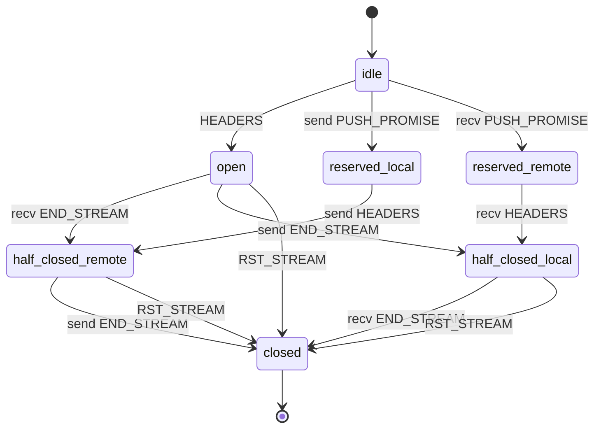
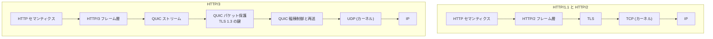

## なぜこれを先に知る必要があるか

[HTTP/1.1 の線の上のページ](../http1-wire/) で見たプロトコルは、行指向のテキストで、1 つの接続の上でリクエストとレスポンスが 1 対 1 に並ぶ。サーバのコードはこの形をそのまま写せる。接続オブジェクトが 1 個あり、その中にリクエストオブジェクトが 1 個ある。読んで、処理して、書いて、次のリクエストを待つ。

HTTP/2 はこの 1 対 1 を壊す。1 本の接続の上で 100 個のリクエストが同時に進む。接続オブジェクトの中にリクエストが N 個ある構造になり、しかもそれぞれが独立にフロー制御され、独立に中断されうる。

**この差は、プロトコルパーサを 1 個足すという話では収まらない。** 「リクエスト」がどのオブジェクトに属するか、レスポンスをどの順で書き出すか、接続が閉じたときに何を巻き戻すか、が全部変わる。既に HTTP/1.1 で動いているサーバに HTTP/2 を載せるとき、実装者が直面するのはこの構造の差だ。

HTTP/3 はさらに、TCP そのものを捨てる。輻輳制御も再送も順序保証も、カーネルのやっていたことをユーザ空間のコードが引き受ける。サーバの中に、これまで OS が持っていた層が丸ごと現れる。

## HTTP/1.1 が抱えていた 3 つの限界

### 1 接続 1 リクエスト

HTTP/1.1 の接続では、リクエストを送ったらレスポンスを最後まで受け取るまで次のリクエストを送れない。1 ページに 100 個のリソースがあれば、1 本の接続では 100 回の往復が直列に並ぶ。

ブラウザの対処は「接続を複数張る」だった。ホストあたり 6 本という上限がおおむね共通の運用になり、それ以上は必要でも張らない。6 本にしたのは、サーバとネットワークへの負荷とのバランスだ。

結果として起きたことが 2 つある。1 つは、Web 開発の側で **接続数の上限を回避するための技法**が発達したこと。画像を 1 枚にまとめる CSS スプライト、JavaScript の結合、リソースを複数のホスト名に分散する domain sharding。どれもプロトコルの制約に対する迂回で、本来は要らない作業だ。

もう 1 つは、サーバ側の接続数がクライアント数の 6 倍になること。TCP の接続 1 本ごとに、カーネルのソケット構造とサーバの接続オブジェクトと、TLS を張るならハンドシェイクのコストがかかる ([TLS 終端のページ](../tls-termination/))。

### パイプラインは HOL ブロッキングで死んだ

HTTP/1.1 にはパイプラインという機能があった。レスポンスを待たずにリクエストを続けて送っていい。ただし **レスポンスは送った順に返さなければならない**。

```
Client -> Server:  GET /a   GET /b   GET /c
Server -> Client:  200 /a   200 /b   200 /c   (この順序は変えられない)
```

`/a` の生成に 3 秒かかり、`/b` と `/c` が 1ms で用意できても、`/b` を先に返せない。順序を変えたら、クライアントはどのレスポンスがどのリクエストに対応するのか判別できなくなる。これが head-of-line blocking で、応答時間のばらつきが大きいサーバではパイプラインが逆効果になる。

さらに、経路上のプロキシがパイプラインを正しく扱わない実装が多かった。結果としてブラウザは既定で無効にし、機能としては死んだ。RFC 9112 でも「パイプラインは既定で有効にすべきではない」という位置づけになっている。

### ヘッダが毎回冗長

リクエストヘッダは 1 リクエストあたり数百バイトから 1KB 程度あり、その大半が接続を通じてほぼ同じだ。`User-Agent`、`Accept`、`Accept-Encoding`、`Cookie`。同じページの中の 100 リソースを取りに行くたびに、同じ 800 バイトが繰り返し流れる。

ボディは `Content-Encoding: gzip` で圧縮できるが、ヘッダはできない。ヘッダの圧縮を最初に試みたのは SPDY で、そこでは zlib を接続全体のストリームに使った。これは CRIME 攻撃で破れた。攻撃者が制御できる文字列と秘密 (Cookie) が同じ圧縮辞書に入ると、圧縮後のサイズから秘密が漏れる。

**汎用の圧縮アルゴリズムをそのまま持ち込むと壊れる**ことが分かったので、HTTP/2 は専用の方式を作り直すことになった。それが HPACK だ。

## HTTP/2 の答え: フレームで多重化する

### フレームの構造

RFC 9113 は、接続の上を流れるバイト列をフレームの列にした。フレームヘッダは 9 バイト固定。

```
+-----------------------------------------------+
|                 Length (24)                   |
+---------------+---------------+---------------+
|   Type (8)    |   Flags (8)   |
+-+-------------+---------------+-------------------------------+
|R|                 Stream Identifier (31)                      |
+=+=============================================================+
|                   Frame Payload (0...)                      ...
+---------------------------------------------------------------+
```

- **Length** — ペイロードの長さ。24 ビットなので最大 16777215 バイトだが、実際には `SETTINGS_MAX_FRAME_SIZE` で制限される。初期値は 16384。
- **Type** — フレームの種類。1 バイト。
- **Flags** — 種類ごとに意味の違うビット。`END_STREAM` と `END_HEADERS` がよく使われる。
- **Stream Identifier** — このフレームがどのストリームに属するか。31 ビット。`0` は接続全体を指す特別な値。

長さが先頭にあるので、**受信側はペイロードの中身を解釈しなくてもフレームの境界が分かる**。HTTP/1.1 のヘッダパースが「CRLF を探す」という走査だったのに対し、HTTP/2 は「9 バイト読んで、書いてある長さだけ読む」になる。パーサの形が根本的に変わる。

フレームの種類は 10 個。

| 値   | 名前          | 役割                             |
| ---- | ------------- | -------------------------------- |
| 0x00 | DATA          | ボディ                           |
| 0x01 | HEADERS       | ヘッダブロック。ストリームを開く |
| 0x02 | PRIORITY      | 優先度 (非推奨)                  |
| 0x03 | RST_STREAM    | このストリームだけ中断する       |
| 0x04 | SETTINGS      | 接続のパラメータ                 |
| 0x05 | PUSH_PROMISE  | サーバプッシュ (非推奨)          |
| 0x06 | PING          | 死活確認と RTT 測定              |
| 0x07 | GOAWAY        | 接続を閉じる予告                 |
| 0x08 | WINDOW_UPDATE | フロー制御ウィンドウの回復       |
| 0x09 | CONTINUATION  | HEADERS の続き                   |

接続の始まりには 24 バイトのプリフェイスが送られる。`PRI * HTTP/2.0\r\n\r\nSM\r\n\r\n` という文字列で、HTTP/1.1 のリクエスト行として読むと構文的に成立するが意味を成さない。**HTTP/1.1 しか知らないプロキシがこれを転送しようとして確実に失敗する**ように作られている。

### ストリームの状態

ストリームは、接続の中で独立した 1 往復を表す。ID はクライアントが開くものが奇数、サーバが開くものが偶数で、同じ接続の中で単調に増える。使い切ったら接続を張り直すしかない。



サーバ側で普通に起きる遷移は `idle → open → half-closed (remote) → closed` だ。クライアントの `HEADERS` で開き、`END_STREAM` 付きのフレームでリクエストが終わり、サーバがレスポンスを送り切って閉じる。

問題は `RST_STREAM` の枝で、これはどの状態からでも来る。**レスポンスを生成している最中に、そのストリームだけが取り消される。** HTTP/1.1 なら「クライアントが接続を切った」に相当するが、HTTP/2 では接続は生きたまま 1 つのリクエストだけが消える。上流へのプロキシ、開いているファイル、確保したバッファ、登録したタイマ — ストリーム単位で確保したものを、接続を巻き込まずに解放する必要が出る。

この性質は攻撃にも使われた。ストリームを開いた直後に `RST_STREAM` を送り続けると、サーバは「同時ストリーム数の上限」に引っかからないまま無限にリクエストを処理させられる。上限は「開いているストリームの数」で数えているのに、開いてすぐ閉じられるとカウントが戻ってしまうからだ。対策は、リセットされたストリームの数そのものを別に数えて制限することになる。

### ヘッダブロックの厄介な性質

`HEADERS` フレームのペイロードは HPACK で符号化されたヘッダブロックだ。1 フレームに収まらなければ `CONTINUATION` フレームで続ける。

ここに 1 つ、多重化の原則を破る規則がある。**`HEADERS` とそれに続く `CONTINUATION` の間には、他のフレームを一切挟めない。** 別のストリームのフレームも挟めない。

理由は HPACK の動的テーブル (次節) で、ヘッダブロックの復号がテーブルの状態を書き換えるからだ。ブロックを途中まで復号した状態で別のブロックを処理し始めると、テーブルの更新順序が送信側と受信側でずれる。だから接続全体を止めて、1 つのヘッダブロックを最後まで処理する。

つまり **HTTP/2 の多重化は完全ではない**。ヘッダブロックを送っている間だけは、接続が 1 本のストリームに占有される。巨大なヘッダを送ると他のストリームが止まる。

## HPACK: 接続に状態を持ち込む圧縮

RFC 7541 の HPACK は 3 つの仕組みでできている。

### 静的テーブル

よく使われるヘッダの名前と値の組を 61 個、仕様に直接書いてある。

```
Index | Header Name                 | Value
------+-----------------------------+---------------
  1   | :authority                  |
  2   | :method                     | GET
  3   | :method                     | POST
  4   | :path                       | /
  5   | :path                       | /index.html
  6   | :scheme                     | http
  7   | :scheme                     | https
  8   | :status                     | 200
 ...
 61   | www-authenticate            |
```

`GET` を表すのに、インデックス 2 を指す 1 バイトで済む。`:method` のようにコロンで始まるものは疑似ヘッダで、HTTP/1.1 のリクエスト行とステータス行を分解してヘッダの形に揃えたものだ。**リクエスト行という特別な行が無くなり、全部がヘッダになった。**

### 動的テーブル

接続ごとに、送信側と受信側が同じ内容のテーブルを維持する。新しく現れたヘッダをそこに追加し、次からはインデックスで参照する。FIFO で、サイズ上限 (`SETTINGS_HEADER_TABLE_SIZE`、初期値 4096 バイト) を超えたら古いものから捨てる。

これが HTTP/2 の実装を難しくしている一番の要因だ。

- **接続ごとに状態を持つ。** 受信用と送信用でそれぞれ 1 つ。接続オブジェクトの寿命と結び付き、接続が閉じるまで生きる。
- **順序に依存する。** 送信側が「テーブルの 5 番」と言ったとき、受信側のテーブルの 5 番が同じでなければならない。だから復号は必ず送信順に、1 つずつ行う。
- **エントリのサイズ計算が仕様で決まっている。** 名前の長さ + 値の長さ + 32。この 32 という定数はエントリのオーバーヘッドの見積もりで、実装のメモリ使用量とは関係なく、上限判定のためだけに存在する。両側が同じ数式を使わないとテーブルの内容がずれる。
- **メモリの上限が受信側の宣言で決まる。** 受信側が `SETTINGS_HEADER_TABLE_SIZE` で上限を伝え、送信側がそれを守る。守らせるために、上限を超えたら接続エラーにする検査が要る。

さらに、圧縮アルゴリズムが状態を持つということは、**1 つのストリームの処理が他のストリームの符号化結果に影響する**ということでもある。ストリーム A で送ったヘッダが動的テーブルに入り、ストリーム B がそれを参照する。ストリームは論理的に独立だが、ヘッダの圧縮を通じて結合している。

CRIME 対策としては、動的テーブルに入れるかどうかをヘッダごとに選べるようになっている。`Cookie` のような秘密を含むヘッダには「絶対にインデックス化しない」というリテラル表現があり、中継するプロキシもその指示を伝播させなければならない。

### ハフマン符号

文字列 (ヘッダの名前と値) は、仕様に固定で書かれたハフマン表で符号化できる。HTTP のヘッダに現れる文字の出現頻度から作られた表で、接続ごとに適応しない。適応しないので CRIME の問題が無く、テーブルを送る必要も無い。

符号化するかどうかは 1 ビットのフラグで示す。短くならない文字列 (バイナリに近いもの) はそのまま送る。

## フロー制御が 2 段ある

1 本の TCP 接続の上で 100 個のストリームが走ると、受信バッファの奪い合いが起きる。TCP のウィンドウは接続全体に 1 つしか無いので、「このストリームだけ遅くしたい」が表現できない。

HTTP/2 は自前のフロー制御を、接続単位とストリーム単位の 2 段で持つ。

```
接続ウィンドウ (stream id = 0)     初期値 65535
  ├── ストリーム 1 のウィンドウ    初期値 SETTINGS_INITIAL_WINDOW_SIZE (65535)
  ├── ストリーム 3 のウィンドウ
  └── ストリーム 5 のウィンドウ
```

`DATA` フレームを送ると、そのストリームのウィンドウと接続のウィンドウが**両方**減る。どちらかが 0 になれば送れない。受信側が処理を終えたら `WINDOW_UPDATE` を送って回復させる。ウィンドウの上限は 2^31 - 1 で、これを超えるとフロー制御エラーになる。

サーバ実装から見た厄介さは 3 点。

1. **送信が 2 つの条件で止まる。** ソケットが書けないから止まるのか、フロー制御ウィンドウが 0 だから止まるのか。前者は epoll が教えてくれるが、後者は `WINDOW_UPDATE` の受信という別のイベントでしか解けない。「書けるようになった」の意味が 2 つある。
2. **接続ウィンドウが 0 になると、全ストリームが止まる。** 1 つのストリームの受信が滞ると、接続ウィンドウを食い潰して他を巻き込む。これは HTTP/2 のレベルで再現された HOL ブロッキングで、受信側が意図的に作れば攻撃になる。
3. **初期ウィンドウの変更が遡って効く。** `SETTINGS_INITIAL_WINDOW_SIZE` を途中で変えると、既に開いている全ストリームのウィンドウを差分だけ加減しなければならない。設定 1 つの変更が、N 個のストリームの状態を書き換える。

65535 という初期値は、現代の回線には小さすぎる。RTT 100ms の経路で 64KB のウィンドウだと、`WINDOW_UPDATE` を待つ間の空白でスループットが 5Mbps 程度に頭打ちになる。実装は接続確立直後に大きな `WINDOW_UPDATE` を送って広げるのが普通で、**仕様の初期値をそのまま使う実装は無い**。

## SETTINGS と GOAWAY: 接続そのものの管理

HTTP/1.1 には「接続の設定」という概念が無かった。接続はただのバイトの通り道で、パラメータを交換する場所が無い。HTTP/2 はここに `SETTINGS` フレームを置いた。

```
SETTINGS_HEADER_TABLE_SIZE       (0x01)  初期値 4096
SETTINGS_ENABLE_PUSH             (0x02)  初期値 1
SETTINGS_MAX_CONCURRENT_STREAMS  (0x03)  初期値 無制限
SETTINGS_INITIAL_WINDOW_SIZE     (0x04)  初期値 65535
SETTINGS_MAX_FRAME_SIZE          (0x05)  初期値 16384
SETTINGS_MAX_HEADER_LIST_SIZE    (0x06)  初期値 無制限
```

各値は「自分が受け取る側としての制限」を相手に伝える。双方が独立に送るので、片方向ずつ違う値になりうる。受け取った側は `ACK` フラグ付きの空の `SETTINGS` を返して確認する。

サーバ実装から見ると、これは **接続ごとに 2 組のパラメータを持つ**ということだ。自分が宣言した値 (相手が守るべきもの、破られたら接続エラーにする) と、相手が宣言した値 (自分が守るべきもの)。混同すると、正しいクライアントを切断するか、悪意あるクライアントに攻撃されるかのどちらかになる。

`SETTINGS_MAX_CONCURRENT_STREAMS` は特に重要で、これが接続 1 本あたりのリソース消費の上限を決める。無制限が初期値なので、サーバは接続確立直後に必ず有限の値を宣言する。宣言しない実装は、1 本の接続でメモリを使い切られる。

接続を終わらせるのが `GOAWAY` で、ここには **最後に処理したストリーム ID** が入る。「この ID より後に開かれたストリームは処理していないので、別の接続でやり直してよい」という意味になる。HTTP/1.1 の `Connection: close` が「今のリクエストで最後」としか言えなかったのに対し、どこまでが有効だったかを正確に伝えられる。

graceful shutdown ではこれを 2 回送るという運用がある。1 回目は最大値 (2^31 - 1) を入れて「もうすぐ閉じる、新しいストリームは開くな」とだけ伝え、しばらく待ってから 2 回目で実際の最終 ID を入れる。1 回目と 2 回目の間に飛んできたストリームは、レースにならず確実に「処理された」か「されなかった」に分類される。**終了の予告と終了の確定を分ける**という形で、これは分散システムの他の場面でもそのまま使える。

## 優先度は失敗した

RFC 7540 の優先度は、ストリーム間に依存関係の木を作り、各ノードに 1〜256 の重みを付ける仕組みだった。「この CSS を先に、この画像は後で」をクライアントが表明できる。

これは実質的に使われなかった。理由は 3 つある。

- 木の構造が複雑で、正しく実装するのが難しかった。ストリームが閉じたときに子ノードを親に付け替える規則があり、その状態を接続ごとに保持しなければならない。
- クライアントごとに木の作り方が違い、サーバがどう解釈しても一部のクライアントで結果が悪くなった。
- 依存関係の循環を作れるので、それを検出する処理が要る。攻撃の入口にもなる。

RFC 9113 は `PRIORITY` フレームと `HEADERS` の優先度フィールドを非推奨にした。置き換えたのが RFC 9218 の Extensible Priorities で、木をやめて 2 つのパラメータだけにした。

```
priority = u=3, i
```

- `u` — 緊急度。0 から 7 の整数で、既定は 3。小さいほど優先。
- `i` — incremental。部分的に届いたぶんから処理できるか。既定は false。

これを `Priority` というヘッダフィールド、あるいは `PRIORITY_UPDATE` フレームで伝える。ヘッダフィールドで表せるということは、HTTP/1.1 の中継を通っても情報が保たれるということだ。

**複雑な機構を作って動かず、10 年後に 2 つの数字に縮めた。** 拡張性を先回りして設計したものが、使われずに置き換わった典型例になっている。

サーバプッシュ (`PUSH_PROMISE`) も似た経過を辿った。クライアントが要求していないリソースをサーバから送りつける仕組みだが、クライアントが既にキャッシュを持っている場合を判別できず、帯域を無駄にすることが多かった。主要なブラウザは既定で無効にし、`103 Early Hints` で「取りに行くべき URL を先に教える」ほうへ置き換わっている。

## HTTP/2 が解けなかった問題

多重化を TCP の上に作ったので、TCP のセマンティクスからは逃げられない。TCP はバイトストリームで、**順序どおりにしかデータを渡さない**。

```
送信: [str1] [str3] [str1] [str5] [str3] [str1]
             ^^^^^ このセグメントが落ちた

受信側の TCP: str1 の続きも str5 も既に届いているが、
              穴の後ろなのでアプリケーションに渡さない
```

パケットが 1 個落ちると、その後ろに届いた全部のバイトがカーネルのバッファで待たされる。中身が別のストリームであっても関係ない。再送が到着してはじめて、まとめて上がってくる。

これが TCP レベルの HOL ブロッキングだ。HTTP/1.1 の 6 本の接続なら、1 本で起きた損失は他の 5 本に影響しない。HTTP/2 で 1 本にまとめたことで、**損失の影響範囲がむしろ広がった**。損失率の高い経路 (モバイル、Wi-Fi) では、HTTP/2 が HTTP/1.1 より遅くなる場面がある。

TCP の中で解こうとすると行き詰まる。カーネルは「このバイト列がどのストリームに属するか」を知らないからだ。知らせるには TCP を変えるしかなく、TCP を変えると経路上の中間装置 (NAT、ファイアウォール、パフォーマンス向上プロキシ) が新しいオプションを落としたり接続を切ったりする。TCP は硬直していて動かせない。

## HTTP/3 と QUIC: トランスポートを作り直す

### ストリームをトランスポートの概念にする

RFC 9000 の QUIC は、UDP の上に信頼性のあるトランスポートを構築する。中核の判断は 1 つで、**ストリームをトランスポート層が知っている**ことだ。

QUIC のパケットはフレームの列を運び、`STREAM` フレームにはストリーム ID とオフセットとデータが入っている。あるパケットが落ちたとき、QUIC はそのパケットに入っていたストリームだけを止める。他のストリームのデータは、順序が揃っていればすぐアプリケーションに渡せる。

```
UDP datagram
  └── QUIC packet (header + 暗号化されたペイロード)
        ├── STREAM frame (stream=4, offset=0,    data=...)
        ├── STREAM frame (stream=8, offset=1200, data=...)
        └── ACK frame
```

ストリーム ID の下位 2 ビットが種別を表す。ビット 0 が開始者 (0 = クライアント、1 = サーバ)、ビット 1 が方向 (0 = 双方向、1 = 単方向)。HTTP/3 のリクエストはクライアント開始の双方向ストリーム、つまり ID が 4 で割り切れるものに乗る。

### QUIC が抱え込んだもの

TCP がやっていたことを全部、ユーザ空間のライブラリが持つことになった。

- **輻輳制御。** RFC 9002 が NewReno を基準として規定し、CUBIC や BBR に差し替えることもできる。TCP の輻輳制御はカーネルの中で何十年も調整されてきたコードで、それに相当するものを自前で持つ。
- **損失検知と再送。** パケット番号は単調増加で、再送しても同じ番号を使わない (TCP のシーケンス番号との大きな違い)。だから ACK が元の送信に対するものか再送に対するものか曖昧にならず、RTT の測定が正確になる。代わりに「どのデータがどのパケット番号で送られたか」の対応表を自分で持つ。
- **暗号。** TLS 1.3 のハンドシェイクが、独立した層ではなくトランスポートの一部として組み込まれる (RFC 9001)。ハンドシェイクのメッセージは `CRYPTO` フレームで運ばれ、パケットは暗号レベルごとに別の鍵で保護される。Initial、Handshake、0-RTT、1-RTT の 4 つの暗号レベルがあり、それぞれ独立したパケット番号空間を持つ。TLS が接続の上に乗るのではなく、TLS と接続確立が同じ往復で進む。
- **接続の同一性。** TCP の接続は 4 つ組 (送信元 IP、送信元ポート、宛先 IP、宛先ポート) で識別される。QUIC は接続 ID という独立した識別子を持つ。クライアントの IP が変わっても (Wi-Fi からモバイル回線へ)、接続 ID が同じなら同じ接続として続けられる。これが接続マイグレーションで、モバイル環境では大きい。
- **フロー制御。** HTTP/2 と同じく接続単位とストリーム単位の 2 段。加えて「同時に開けるストリーム数」の制御も別にある。

そして **これら全部が UDP ソケット 1 つの上で動く**。カーネルから見えるのはデータグラムの出入りだけで、接続という概念はユーザ空間にしか無い。1 つの UDP ソケットに何万もの QUIC 接続が多重化されるので、受け取ったデータグラムを接続 ID で振り分ける表がサーバの中に要る。



図の右側で、カーネルとの境界がずっと下に降りている。左では TCP から下がカーネルだったのに対し、右は UDP のデータグラム 1 枚だけがカーネルの仕事になる。サーバのコードから見れば、**これまで OS の責任だった層が自分のプロセスの中に入ってきた**ということだ。バグを踏んだときの影響も、修正のデプロイの容易さも、両方この境界の移動で変わる。

### QPACK が HPACK と違う理由

HPACK は「ヘッダブロックが送信順に処理される」ことを前提にしていた。HTTP/2 では TCP が順序を保証していたので、これが成り立った。

QUIC ではストリームが独立に届く。ストリーム 4 のヘッダとストリーム 8 のヘッダが、送った順と逆に到着しうる。HPACK をそのまま使うと、動的テーブルの更新順序が送受で食い違って復号が壊れる。

RFC 9204 の QPACK はこれを、**テーブルの更新をヘッダブロックとは別のストリームに分離する**ことで解いた。

- **エンコーダストリーム** — 単方向。送信側から受信側へ、動的テーブルへの挿入命令だけを流す。1 本のストリームなので順序は保証される。
- **デコーダストリーム** — 単方向。受信側から送信側へ、「どこまで反映した」という確認を流す。
- **リクエストストリーム上のヘッダブロック** — 動的テーブルのエントリを参照するが、参照するにはそのエントリが既に挿入されている必要がある。

各ヘッダブロックの先頭には Required Insert Count が書かれていて、「このブロックを復号するには動的テーブルに N 個入っている必要がある」と宣言する。受信側は、まだ N 個入っていなければ **そのストリームだけをブロックして待つ**。エンコーダストリームから挿入が届いたら再開する。

ブロックできるストリームの数には上限がある (`SETTINGS_QPACK_BLOCKED_STREAMS`)。0 にすれば、送信側は動的テーブルの参照を諦めて静的テーブルとリテラルだけを使う。圧縮率を捨てて HOL ブロッキングを完全に消す、という選択ができる。

```
圧縮率を上げる  <-------------------->  HOL ブロッキングを避ける
動的テーブルを積極的に使う              静的テーブルとリテラルだけ
ブロックされるストリームが増える        ブロックが起きない
```

**HTTP/2 で暗黙だったトレードオフが、設定可能なパラメータとして表に出た。** HPACK には「圧縮を諦める」という選択肢が無かった。

### HTTP/3 のフレームは HTTP/2 と別物

同じ「HTTP のフレーム」でも、HTTP/2 と HTTP/3 でフレーム型の番号は共通ではない。ストリームの管理を QUIC が引き受けたので、HTTP/3 側には要らなくなったフレームがある。

- `WINDOW_UPDATE` は無い。フロー制御は QUIC の `MAX_DATA` / `MAX_STREAM_DATA` フレームがやる。
- `RST_STREAM` は無い。QUIC の `RESET_STREAM` がやる。
- `PING` は無い。QUIC の `PING` フレームがある。
- ストリーム ID はフレームヘッダに書かれない。QUIC のストリームの上に乗っているので、どのストリームかは自明。
- 代わりに、`SETTINGS` と `GOAWAY` を運ぶための **制御ストリーム** を別に開く必要がある。単方向ストリームで、接続開始時に 1 本ずつ。

数値の表現も違う。HTTP/2 が固定幅のビットフィールドだったのに対し、QUIC と HTTP/3 は可変長整数を使う。先頭 2 ビットが長さを表し、残りが値になる。

```
先頭 2 ビット | 全長     | 表せる値の範囲
     00       | 1 バイト | 0 .. 63
     01       | 2 バイト | 0 .. 16383
     10       | 4 バイト | 0 .. 1073741823
     11       | 8 バイト | 0 .. 4611686018427387903
```

小さい値が 1 バイトで済むので、ストリーム ID もフレーム長も普段は短い。代わりに、パーサが「まず 2 ビット読んで長さを決め、その長さぶん読む」という段階を踏むことになる。**バッファの途中で切れたときの再開位置が、固定幅のときより細かくなる。** 9 バイト読めているかどうかを見れば済んだ HTTP/2 に対し、1〜8 バイトの整数が何個か並んだ列を、任意の位置から再開できるように書く必要がある。

つまり HTTP/3 の実装は、HTTP/2 の実装の一部を再利用できるが、フレームの読み書きの層はまるごと書き直しになる。共有できるのは HTTP のセマンティクス — メソッド、ヘッダ、ステータスコード、ボディの扱い — から上だけだ。

### HTTP/3 にどうやって辿り着くか

HTTP/2 は ALPN で選べた。TLS ハンドシェイクの中で `"h2"` と言えば済む。HTTP/3 では、そもそも TLS ハンドシェイクを始める前に **UDP で繋ぐか TCP で繋ぐかを決めなければならない**。ALPN は使えない。ALPN はハンドシェイクの中にあり、ハンドシェイクはトランスポートの上にあるからだ。

だから HTTP/3 の発見は、HTTP のレイヤか DNS のレイヤで行われる。

- **`Alt-Svc` ヘッダ。** TCP で接続してきたクライアントに、レスポンスヘッダで `Alt-Svc: h3=":443"; ma=86400` と伝える。クライアントは次回から UDP を試す。**最初の 1 接続は必ず TCP になる。**
- **HTTPS リソースレコード。** DNS の応答に `alpn="h3,h2"` を載せる。名前解決の時点で分かるので、最初から UDP で行ける。ただし DNS の解決側の対応が要る。

サーバ実装への影響は、**同じホストに対して TCP のリスナと UDP のリスナを両方持ち、両方で同じ設定を適用できなければならない**ことだ。証明書も、仮想サーバの選択も、アクセスログも、2 つの経路で一致していなければ挙動が食い違う。443 番ポートを TCP と UDP の両方で開き、片方が HTTP/1.1 と HTTP/2 を、もう片方が HTTP/3 を扱う。

さらに、UDP は経路上でブロックされることがある。企業ネットワークやモバイルキャリアが 443/UDP を落とすと、クライアントは HTTP/3 を試して失敗し、TCP に落ちる。この失敗と復帰の判断はクライアント側にあるが、サーバは「HTTP/3 が使えない環境が常に一定割合ある」という前提で運用することになる。TCP 側を止めるという選択肢が事実上無い。

## サーバ実装者にとっての帰結

3 つのプロトコルを並べると、既存のコードにどう載せるかという問題の形が見えてくる。

|                | HTTP/1.1          | HTTP/2             | HTTP/3               |
| -------------- | ----------------- | ------------------ | -------------------- |
| 単位           | 接続 = リクエスト | 接続 ⊃ ストリーム  | 接続 ⊃ ストリーム    |
| パース         | テキストの行      | 9 バイト固定ヘッダ | 可変長整数のフレーム |
| ヘッダ圧縮     | 無し              | HPACK (順序依存)   | QPACK (別ストリーム) |
| フロー制御     | TCP のみ          | TCP + 2 段の自前   | QUIC の 2 段         |
| 中断           | 接続を切る        | RST_STREAM         | RESET_STREAM         |
| トランスポート | TCP (カーネル)    | TCP (カーネル)     | QUIC (ユーザ空間)    |
| 暗号           | TLS を上に載せる  | TLS を上に載せる   | トランスポートに統合 |

既に HTTP/1.1 で動いているサーバに HTTP/2 を足すとき、選択肢は 2 つある。

**リクエスト処理層を書き換えて、ストリームを一級の概念にする。** 正しいが、コードベース全体に触ることになる。既存のモジュールやハンドラが「接続とリクエストが 1 対 1」を前提に書かれていれば、その全部が対象になる。

**HTTP/2 の層で多重化を吸収し、上には 1 リクエストずつ渡す。** ストリームごとに、あたかも独立した接続があるかのように見せかける。上位の層は自分が HTTP/2 の上にいることを知らない。**既存のコードに触らずに済む代わりに、「接続」という抽象を偽装する層が 1 枚要る。**

後者を選ぶと、偽装しきれないところに歪みが集中する。読み書きは実際のソケットではなくフレーム層を経由するので、`read()` / `write()` に相当するものを差し替える必要がある。上位が「接続を切る」と言ったとき、実際に切るのは接続ではなくストリームだ。上位が持っているタイムアウトは接続に紐づいているが、本当はストリームに紐づけたい。

どちらを選ぶかは、コードベースの規模と、既存の拡張点がどれだけ外部に公開されているかで決まる。**外部のモジュールが「接続 = リクエスト」を前提に書かれている場合、その前提を壊すことは互換性を壊すこと**になるので、偽装するほうが現実的になる。

HTTP/3 ではさらに、UDP ソケットの読み書きとタイマ駆動の再送が入る。イベントループの中に、これまで無かった種類の仕事が増える。TCP なら「ソケットが書けるようになった」で駆動されていた送信が、QUIC では「輻輳ウィンドウが空いた」「再送タイマが切れた」でも駆動される。[ノンブロッキング I/O と多重化のページ](../nonblocking-multiplexing/) で見た「fd の準備完了」という 1 種類のイベントだけでは足りなくなる。

## Nginx ではどうなるか

- 「1 接続 1 リクエスト」を前提に書かれた HTTP 層に多重化を載せるという、このページの最後で挙げた選択が実際にどう解かれているかは [HTTP/2 多重化のページ](../http2-multiplexing/)。HPACK の動的テーブルとフロー制御の実装もここで扱う。
- UDP データグラムから QUIC のストリームまでを自前で持つ層は [QUIC トランスポートのページ](../quic-transport/)。輻輳制御と再送とパケット保護がどこに置かれているかを追う。
- QUIC のストリームの上に HTTP/3 のフレームと QPACK を組み立てる層は [HTTP/3 層のページ](../http3-layer/)。
- ALPN で `"h2"` が選ばれるまでの経路と、TLS 1.3 が QUIC に統合される形は [TLS 層のページ](../ssl-layer/)。
- 多重化される前の、テキストとしての HTTP/1.1 のパーサは [リクエストパースのページ](../request-parse/)。HTTP/2 のヘッダがここへどう合流するかも見える。
- ストリームごとに独立してレスポンスを組み立て、順序を後から辻褄合わせする形は [サブリクエストと postpone のページ](../subrequest-postpone/) の仕組みと同じ問題を扱っている。
