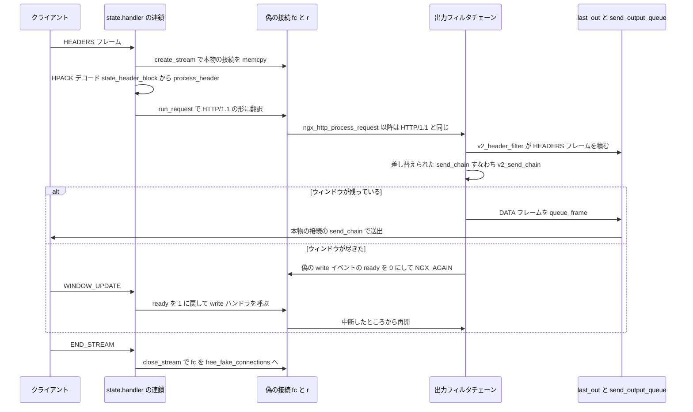

## この層の責務

nginx のリクエスト処理は「1 本の TCP 接続の上を、1 つのリクエストが順に流れる」という前提で書かれている。[ワーカーの 1 周](../state-machine/) の `c->read->handler`、[出力フィルタチェーン](../output-filter-chain/) の `c->send_chain`、[接続の再利用](../connection-reuse/) の keepalive。どれも `ngx_connection_t` が 1 度に 1 つのリクエストに対応することを暗黙に仮定している。

HTTP/2 はこれを壊す。1 本の TCP 接続の上に複数のストリームが並び、各ストリームが独立したリクエストになる。ストリーム 1 の応答を送っている途中でストリーム 3 のリクエストが届く。しかも [HTTP/2 と HTTP/3](../http2-http3/) で見たフロー制御があり、「このストリームには今これ以上送れない」という状態が個別に存在する。

素直に対応するなら、`r->connection` を使っているコード全部に「ストリームか接続か」の分岐を入れることになる。`ngx_http_variable_remote_addr`、`ngx_http_write_filter`、`ngx_http_finalize_connection`、`ngx_reusable_connection` — 数十箇所だ。

nginx が選んだのは、**ストリームごとに偽の `ngx_connection_t` を作り、分岐を 1 箇所に閉じる**ことだった。この層の責務を分けるとこうなる。

- **フレームの分解** — 9 バイトのフレームヘッダを読み、種類ごとの処理に振り分ける。関数ポインタ `h2c->state.handler` の連鎖で書かれている。
- **HPACK** — ヘッダブロックをデコードして `r->headers_in` に積む。静的テーブル 61 件、動的テーブル 4096 バイト、Huffman デコードはテーブル駆動。
- **偽の接続とリクエストの生成** — 本物の接続をコピーし、`ngx_http_create_request()` に渡す。ここから先は HTTP/1.1 と同じ道。
- **出力のフレーム化** — ヘッダを HEADERS + CONTINUATION に、ボディを DATA に切る。`fc->send_chain` の差し替えで実現する。
- **フロー制御とスケジューリング** — 接続レベルとストリームレベルの 2 段のウィンドウ。送れないことを `wev->ready = 0` で表し、WINDOW_UPDATE で起こす。

[TLS の層](../ssl-layer/) が `c->recv` / `c->send` の差し替えだったのに対し、HTTP/2 は `ngx_connection_t` そのものの複製で層を作っている。**同じ抽象を、別の使い方で 2 回使っている。**

## 主要な型とその関係

### `ngx_http_v2_connection_t` — TCP 接続 1 本につき 1 つ

[`src/http/v2/ngx_http_v2.h#L125-L172`](https://github.com/nginx/nginx/blob/release-1.31.4/src/http/v2/ngx_http_v2.h#L125-L172)。`c->data` が指す。

| フィールド                                 | 役割                                                                         |
| ------------------------------------------ | ---------------------------------------------------------------------------- |
| `connection`                               | 本物の `ngx_connection_t`                                                    |
| `http_connection`                          | `ngx_http_connection_t`。設定文脈 `conf_ctx` の持ち主                        |
| `total_bytes` / `payload_bytes`            | 受信総量とペイロード量。flood 検出の比率計算に使う                           |
| `processing`                               | 生きているストリーム数。`http2_max_concurrent_streams` (既定 128) と比較する |
| `frames` / `idle`                          | 確保済みの出力フレーム数と、ストリームが 0 本の状態が続いた回数              |
| `new_streams` / `refused_streams`          | 1 回の読みで作られた/拒否したストリーム数。バースト検出用                    |
| `priority_limit`                           | PRIORITY フレームの受け入れ上限                                              |
| `send_window`                              | **接続レベル**の送信ウィンドウ。初期値 65535                                 |
| `recv_window`                              | 接続レベルの受信ウィンドウ。初期化時に最大値まで広げる                       |
| `init_window`                              | 新しいストリームに配る初期送信ウィンドウ                                     |
| `frame_size`                               | 送信する 1 フレームの最大長。初期値 16384                                    |
| `waiting`                                  | 接続ウィンドウ待ちのストリームのキュー                                       |
| `state`                                    | `ngx_http_v2_state_t`。パーサの状態                                          |
| `hpack`                                    | `ngx_http_v2_hpack_t`。受信側の動的テーブル                                  |
| `pool` / `free_frames`                     | 接続の寿命のプールと、使い回す出力フレーム                                   |
| `free_fake_connections`                    | **使い回す偽の接続の単方向リスト**                                           |
| `streams_index`                            | ストリーム ID からノードを引くハッシュ表                                     |
| `last_out`                                 | 送信待ちフレームのリスト                                                     |
| `dependencies` / `closed` / `closed_nodes` | 優先度木の根の子リストと、再利用可能な閉じたノードとその数                   |
| `last_sid` / `lingering_time`              | 直近に受け取ったストリーム ID と、lingering close の期限                     |
| `settings_ack:1` / `table_update:1`        | SETTINGS の ACK を受けたか、HPACK のテーブルサイズ更新を送る必要があるか     |
| `blocked:1`                                | 今この接続の処理の中にいる。再入とクローズを防ぐ                             |
| `goaway:1`                                 | GOAWAY を送った                                                              |

### `ngx_http_v2_state_t` — パーサの状態

[`#L79-L106`](https://github.com/nginx/nginx/blob/release-1.31.4/src/http/v2/ngx_http_v2.h#L79-L106)。

```c title="src/http/v2/ngx_http_v2.h"
typedef struct {
    ngx_uint_t                       sid;
    size_t                           length;
    size_t                           padding;
    ssize_t                          window_delta;
    unsigned                         flags:8;
    unsigned                         incomplete:1;
    unsigned                         keep_pool:1;

    /* HPACK */
    unsigned                         parse_name:1;
    unsigned                         parse_value:1;
    unsigned                         index:1;
    ngx_http_v2_header_t             header;
    size_t                           header_limit;
    u_char                           field_state;
    u_char                          *field_start;
    u_char                          *field_end;
    size_t                           field_rest;
    ngx_pool_t                      *pool;

    ngx_http_v2_stream_t            *stream;

    u_char                           buffer[NGX_HTTP_V2_STATE_BUFFER_SIZE];
    size_t                           buffer_used;
    ngx_http_v2_handler_pt           handler;
} ngx_http_v2_state_t;
```

`sid` / `length` / `flags` は今読んでいるフレームのヘッダそのもので、[HTTP/2 と HTTP/3](../http2-http3/) の 9 バイトフレームヘッダに 1 対 1 で対応する。`field_*` の 4 つが HPACK のヘッダフィールドを途中まで読んだ状態、`buffer[16]` が途中で切れたフレームの持ち越し、`handler` が次に呼ぶ関数だ。

### `ngx_http_v2_stream_t` — ストリーム 1 本につき 1 つ

[`#L189-L226`](https://github.com/nginx/nginx/blob/release-1.31.4/src/http/v2/ngx_http_v2.h#L189-L226)。`r->stream` が指す。

| フィールド                                                    | 役割                                                                              |
| ------------------------------------------------------------- | --------------------------------------------------------------------------------- |
| `request` / `connection` / `node`                             | `ngx_http_request_t`、親の `ngx_http_v2_connection_t`、優先度木のノード           |
| `queued`                                                      | 送信待ちのフレーム数                                                              |
| `send_window`                                                 | **ストリームレベル**の送信ウィンドウ。`ssize_t` で符号付き                        |
| `recv_window`                                                 | ストリームレベルの受信ウィンドウ。初期値は `http2_body_preread_size` (既定 65536) |
| `preread`                                                     | HEADERS より先に届いた DATA を溜める buf                                          |
| `frames` / `free_frames` / `free_frame_headers` / `free_bufs` | 確保したフレーム数と、使い回し用のリスト                                          |
| `queue` / `cookies` / `pool`                                  | `h2c->waiting` のキューノード、分割された `cookie` の配列、ストリームのプール     |
| `initialized:1`                                               | `fc->send_chain` の差し替えを済ませた                                             |
| `waiting:1`                                                   | `h2c->waiting` に入っている                                                       |
| `blocked:1`                                                   | 今このストリームの送信処理の中にいる                                              |
| `exhausted:1`                                                 | ストリームウィンドウを使い切った                                                  |
| `in_closed:1` / `out_closed:1`                                | 受信/送信の END_STREAM を処理した                                                 |
| `rst_sent:1` / `no_flow_control:1` / `skip_data:1`            | RST_STREAM を送った / 受信フロー制御を無効化した / 以降の DATA を読み捨てる       |

`send_window` が `ssize_t` である理由はコメントに書いてある。SETTINGS_INITIAL_WINDOW_SIZE が縮むと、既存ストリームのウィンドウが負になりうる。

### `ngx_http_v2_node_t` — 優先度木のノード

[`#L175-L186`](https://github.com/nginx/nginx/blob/release-1.31.4/src/http/v2/ngx_http_v2.h#L175-L186)。

```c title="src/http/v2/ngx_http_v2.h"
struct ngx_http_v2_node_s {
    ngx_uint_t                       id;
    ngx_http_v2_node_t              *index;   /* ハッシュ表のチェーン */
    ngx_http_v2_node_t              *parent;
    ngx_queue_t                      queue;   /* 親の children に繋ぐ */
    ngx_queue_t                      children;
    ngx_queue_t                      reuse;   /* h2c->closed に繋ぐ */
    ngx_uint_t                       rank;    /* 根からの深さ */
    ngx_uint_t                       weight;
    double                           rel_weight;
    ngx_http_v2_stream_t            *stream;  /* NULL なら閉じたストリーム */
};
```

**ノードはストリームより長生きする。** ストリームが閉じても `node` は `h2c->closed` に残り、後から来たストリームがそれを親として指定できる。`rel_weight` は親の相対重みに自分の重みを掛けた値で、`rank` と合わせて送信順を決める。

### `ngx_http_v2_out_frame_t` — 送信待ちのフレーム

[`#L229-L241`](https://github.com/nginx/nginx/blob/release-1.31.4/src/http/v2/ngx_http_v2.h#L229-L241)。`first` / `last` が chain の区間を指し、`handler` が送信完了時の後始末をする。`blocked` が立っているフレームは順序を入れ替えられない。

## 処理の流れ

### 1. `ngx_http_v2_init()` — 本物の接続を HTTP/2 に切り替える

[`src/http/v2/ngx_http_v2.c#L204-L331`](https://github.com/nginx/nginx/blob/release-1.31.4/src/http/v2/ngx_http_v2.c#L204-L331)。[TLS の層](../ssl-layer/) の ALPN 分岐か、`listen ... http2` の平文経路から呼ばれる。

```c title="src/http/v2/ngx_http_v2.c"
    if (h2mcf->recv_buffer == NULL) {
        h2mcf->recv_buffer = ngx_palloc(ngx_cycle->pool,
                                        h2mcf->recv_buffer_size);
        /* ... */
    }
```

**受信バッファはワーカーで 1 枚を共有する。** `ngx_cycle->pool` から取っていて、接続ごとではない。既定 256KB ([`src/http/v2/ngx_http_v2_module.c#L306`](https://github.com/nginx/nginx/blob/release-1.31.4/src/http/v2/ngx_http_v2_module.c#L306))。接続が 10 万本あっても 256KB のままだ。続けて初期値を入れ、SETTINGS と接続レベルの WINDOW_UPDATE を送り、`state.handler` に最初の状態を入れる。

```c title="src/http/v2/ngx_http_v2.c"
    h2c->send_window = NGX_HTTP_V2_DEFAULT_WINDOW;
    h2c->recv_window = NGX_HTTP_V2_MAX_WINDOW;
    h2c->init_window = NGX_HTTP_V2_DEFAULT_WINDOW;
    h2c->frame_size = NGX_HTTP_V2_DEFAULT_FRAME_SIZE;
    /* ... send_settings と、接続レベルの send_window_update ... */
    h2c->state.handler = ngx_http_v2_state_preface;
    /* ... */
    rev->handler = ngx_http_v2_read_handler;
    c->write->handler = ngx_http_v2_write_handler;
```

([`#L242-L302`](https://github.com/nginx/nginx/blob/release-1.31.4/src/http/v2/ngx_http_v2.c#L242-L302))

**受信ウィンドウは最初に最大まで広げる。** サーバは下流からのボディをそれほど溜め込まないので、接続レベルで絞る意味がない。絞るのはストリームレベルだけにしてある。

`c->buffer` に既に読み込み済みのバイトがあれば (`listen ... http2` で平文の接続を先読みした場合)、そこから先にパーサを回してから `ngx_http_v2_read_handler()` に入る ([`#L313-L330`](https://github.com/nginx/nginx/blob/release-1.31.4/src/http/v2/ngx_http_v2.c#L313-L330))。

### 2. `ngx_http_v2_read_handler()` — 読んで、パーサを回す

[`#L397-L455`](https://github.com/nginx/nginx/blob/release-1.31.4/src/http/v2/ngx_http_v2.c#L397-L455)。

```c title="src/http/v2/ngx_http_v2.c"
    available = h2mcf->recv_buffer_size - NGX_HTTP_V2_STATE_BUFFER_SIZE;

    do {
        p = h2mcf->recv_buffer;
        end = ngx_cpymem(p, h2c->state.buffer, h2c->state.buffer_used);

        n = c->recv(c, end, available);

        if (n == NGX_AGAIN) {
            break;
        }
        /* ... エラー処理 ... */
        end += n;

        h2c->state.buffer_used = 0;
        h2c->state.incomplete = 0;

        do {
            p = h2c->state.handler(h2c, p, end);

            if (p == NULL) {
                return;
            }

        } while (p != end);

        h2c->total_bytes += n;

        if (h2c->total_bytes / 8 > h2c->payload_bytes + 1048576) {
            ngx_log_error(NGX_LOG_INFO, c->log, 0, "http2 flood detected");
            ngx_http_v2_finalize_connection(h2c, NGX_HTTP_V2_NO_ERROR);
            return;
        }
    } while (rev->ready);
```

構造が 3 層になっている。**共有バッファの先頭に持ち越し分をコピーしてから `c->recv()` する**ので、`available` は先頭 16 バイトを引いた値になる。内側の `do { } while (p != end)` が `state.handler` を呼び続け、外側の `while (rev->ready)` がソケットが空になるまで繰り返す。

`c->recv` はここでも関数ポインタで、TLS なら `ngx_ssl_recv` が入っている ([TLS の層](../ssl-layer/))。HTTP/2 のパーサは平文か TLS かを知らない。

flood 検出の `total_bytes / 8 > payload_bytes + 1048576` は、受信した総バイトの 1/8 よりペイロードが少なければ切る、という比率の判定だ。SETTINGS や PING のような制御フレームばかりを送りつける攻撃に対して、**通信量の絶対値ではなく比率で線を引いている。** `+ 1048576` は接続の立ち上がりで誤検出しないためのマージンになっている。

### 3. `state.handler` の連鎖

フレームのパースは、状態を `switch` で持つのではなく **次に呼ぶ関数のポインタを持つ**形で書かれている。最初は `ngx_http_v2_state_preface` で、プリフェイスを検証したら `ngx_http_v2_state_head` へ渡す ([`#L839-L881`](https://github.com/nginx/nginx/blob/release-1.31.4/src/http/v2/ngx_http_v2.c#L839-L881))。

`ngx_http_v2_state_head()` が 9 バイトのフレームヘッダを読む ([`#L884-L916`](https://github.com/nginx/nginx/blob/release-1.31.4/src/http/v2/ngx_http_v2.c#L884-L916))。

```c title="src/http/v2/ngx_http_v2.c"
    if (end - pos < NGX_HTTP_V2_FRAME_HEADER_SIZE) {
        return ngx_http_v2_state_save(h2c, pos, end, ngx_http_v2_state_head);
    }

    head = ngx_http_v2_parse_uint32(pos);

    h2c->state.length = ngx_http_v2_parse_length(head);
    h2c->state.flags = pos[4];
    h2c->state.sid = ngx_http_v2_parse_sid(&pos[5]);

    pos += NGX_HTTP_V2_FRAME_HEADER_SIZE;

    type = ngx_http_v2_parse_type(head);
    /* ... */
    if (type >= NGX_HTTP_V2_FRAME_STATES) {
        return ngx_http_v2_state_skip(h2c, pos, end);
    }

    return ngx_http_v2_frame_states[type](h2c, pos, end);
```

先頭 4 バイトを 1 回の `uint32` 読みで取り、上位 24 ビットが長さ、下位 8 ビットが種類になる ([`src/http/v2/ngx_http_v2.h#L333-L336`](https://github.com/nginx/nginx/blob/release-1.31.4/src/http/v2/ngx_http_v2.h#L333-L336))。**種類の値をそのまま関数ポインタの配列の添字にする** ([`#L186-L197`](https://github.com/nginx/nginx/blob/release-1.31.4/src/http/v2/ngx_http_v2.c#L186-L197))。

```c title="src/http/v2/ngx_http_v2.c"
static ngx_http_v2_handler_pt ngx_http_v2_frame_states[] = {
    ngx_http_v2_state_data,               /* NGX_HTTP_V2_DATA_FRAME */
    ngx_http_v2_state_headers,            /* NGX_HTTP_V2_HEADERS_FRAME */
    ngx_http_v2_state_priority,           /* NGX_HTTP_V2_PRIORITY_FRAME */
    ngx_http_v2_state_rst_stream,         /* NGX_HTTP_V2_RST_STREAM_FRAME */
    ngx_http_v2_state_settings,           /* NGX_HTTP_V2_SETTINGS_FRAME */
    ngx_http_v2_state_push_promise,       /* NGX_HTTP_V2_PUSH_PROMISE_FRAME */
    ngx_http_v2_state_ping,               /* NGX_HTTP_V2_PING_FRAME */
    ngx_http_v2_state_goaway,             /* NGX_HTTP_V2_GOAWAY_FRAME */
    ngx_http_v2_state_window_update,      /* NGX_HTTP_V2_WINDOW_UPDATE_FRAME */
    ngx_http_v2_state_continuation        /* NGX_HTTP_V2_CONTINUATION_FRAME */
};
```

RFC の値と配列の並びが 1 対 1 で、範囲外なら読み飛ばす。**プロトコルの表がそのままコードの表になっている。** [フェーズエンジン](../phase-engine/) が制御構造を配列にしたのと同じ発想が、パーサにも出ている。

各 state 関数が返すのは「どこまで消費したか」のポインタで、足りなければ `ngx_http_v2_state_save()` で持ち越す ([`#L2596-L2622`](https://github.com/nginx/nginx/blob/release-1.31.4/src/http/v2/ngx_http_v2.c#L2596-L2622))。

```c title="src/http/v2/ngx_http_v2.c"
    size = end - pos;

    if (size > NGX_HTTP_V2_STATE_BUFFER_SIZE) {
        /* ... "state buffer overflow" として接続ごとエラー ... */
    }

    ngx_memcpy(h2c->state.buffer, pos, size);

    h2c->state.buffer_used = size;
    h2c->state.handler = handler;
    h2c->state.incomplete = 1;
    return end;
```

**持ち越せるのは 16 バイトまで。** これで足りるのは、state 関数が「フレームヘッダ 9 バイト」「HPACK の整数 4 バイト」といった短い固定長の単位でしか待たないからだ。ヘッダフィールドの本体のように長いものは、`ngx_http_v2_state_field_huff()` が届いた分だけ逐次デコードして `state.field_end` を進める ([`#L1566-L1618`](https://github.com/nginx/nginx/blob/release-1.31.4/src/http/v2/ngx_http_v2.c#L1566-L1618))。**大きな共有バッファと、16 バイトの per-connection の持ち越しバッファ**という組み合わせが成立するのはこの設計のおかげだ。

フレームを 1 つ読み終えたら `ngx_http_v2_state_complete()` が `state.handler = ngx_http_v2_state_head` に戻す ([`#L2542-L2560`](https://github.com/nginx/nginx/blob/release-1.31.4/src/http/v2/ngx_http_v2.c#L2542-L2560))。

### 4. HEADERS から HPACK まで

`ngx_http_v2_state_headers()` ([`#L1163-L1376`](https://github.com/nginx/nginx/blob/release-1.31.4/src/http/v2/ngx_http_v2.c#L1163-L1376)) は、パディングと優先度フィールドを剥がし、ストリーム ID を検証してからストリームを作る。

```c title="src/http/v2/ngx_http_v2.c"
    if (h2c->state.sid % 2 == 0 || h2c->state.sid <= h2c->last_sid) {
        /* ... "incorrect identifier" として接続ごとエラー ... */
    }

    h2c->last_sid = h2c->state.sid;

    h2c->state.pool = ngx_create_pool(1024, h2c->connection->log);
```

([`#L1252-L1273`](https://github.com/nginx/nginx/blob/release-1.31.4/src/http/v2/ngx_http_v2.c#L1252-L1273))

クライアントの作るストリーム ID は奇数で、単調増加しなければならない。ここで**ヘッダブロック専用のプールを 1024 バイトで作る**のは、HPACK のデコード結果を置く先が要るからだ。このプールは、ストリームが作れたらそのままストリームのプールに昇格する (`stream->pool = h2c->state.pool; h2c->state.keep_pool = 1;`)。作れなかったら `ngx_http_v2_state_header_complete()` で捨てる。[メモリプール](../memory-pool/) の寿命の付け替えが 1 行で書かれている。

拒否の条件が 3 つ並ぶ。同時ストリーム数の超過、1 回の読みでのバースト (`new_streams >= 2 * concurrent_streams`)、SETTINGS の ACK 前のデータ送信。いずれも `goto rst_stream` で RST_STREAM を返し、**ヘッダブロックのデコードだけは続ける**。HPACK の動的テーブルは接続で共有されているので、途中で読むのをやめると以降のフレームがデコードできなくなるからだ。

デコードは `ngx_http_v2_state_header_block()` から始まる ([`#L1379-L1476`](https://github.com/nginx/nginx/blob/release-1.31.4/src/http/v2/ngx_http_v2.c#L1379-L1476))。先頭バイトの上位ビットで 5 通りに分ける。

```c title="src/http/v2/ngx_http_v2.c"
    ch = *pos;

    if (ch >= (1 << 7)) {
        /* indexed header field */
        indexed = 1;
        prefix = ngx_http_v2_prefix(7);

    } else if (ch >= (1 << 6)) {
        /* literal header field with incremental indexing */
        h2c->state.index = 1;
        prefix = ngx_http_v2_prefix(6);

    } else if (ch >= (1 << 5)) {
        /* dynamic table size update */
        size_update = 1;
        prefix = ngx_http_v2_prefix(5);

    } else {
        /* literal header field never indexed / without indexing */
        prefix = ngx_http_v2_prefix(4);
    }
```

そこから `ngx_http_v2_state_field_len` → `ngx_http_v2_state_field_huff` または `_field_raw` → `ngx_http_v2_state_process_header` → `ngx_http_v2_state_header_complete` と連鎖する。**RFC 7541 の各符号形式が、そのまま 1 つの state 関数になっている。**

Huffman デコードは `ngx_http_huff_decode()` ([`src/http/ngx_http_huff_decode.c`](https://github.com/nginx/nginx/blob/release-1.31.4/src/http/ngx_http_huff_decode.c)、2714 行) が担う。中身は生成されたテーブルだ。

```c title="src/http/ngx_http_huff_decode.c"
typedef struct {
    u_char  next;
    u_char  emit;
    u_char  sym;
    u_char  ending;
} ngx_http_huff_decode_code_t;

static ngx_http_huff_decode_code_t  ngx_http_huff_decode_codes[256][16] = /* ... */
```

**状態 256 個 × 入力 4 ビット 16 通りの遷移表**で、1 エントリ 4 バイト、合計 16KB。1 バイトを上位 4 ビットと下位 4 ビットの 2 回に分けて食わせ、`emit` が立っていれば `sym` を出力する ([`#L2694-L2714`](https://github.com/nginx/nginx/blob/release-1.31.4/src/http/ngx_http_huff_decode.c#L2694-L2714))。ビット単位の木を辿る実装に比べて、分岐が消えて表引き 2 回になる。`state` が `ngx_http_v2_state_t.field_state` に保存されるので、**フレームの途中で中断しても続きからデコードできる。**

### 5. 動的テーブルは 4096 バイトのリングバッファ

`ngx_http_v2_table.c` は 363 行しかない。静的テーブルは 61 件の配列 ([`src/http/v2/ngx_http_v2_table.c#L20-L82`](https://github.com/nginx/nginx/blob/release-1.31.4/src/http/v2/ngx_http_v2_table.c#L20-L82))、動的テーブルはエントリのポインタ配列と、名前と値の実体を置く 4096 バイトの領域でできている。

初期化は接続のプールから 2 回確保するだけだ ([`#L200-L219`](https://github.com/nginx/nginx/blob/release-1.31.4/src/http/v2/ngx_http_v2_table.c#L200-L219))。`entries` が 64 本のポインタ配列、`storage` が 4096 バイトの領域。この `storage` は**環状に使われる**。末尾に入り切らなければ先頭に折り返して 2 回の `ngx_cpymem` に分け ([`#L242-L266`](https://github.com/nginx/nginx/blob/release-1.31.4/src/http/v2/ngx_http_v2_table.c#L242-L266))、読み出す `ngx_http_v2_get_indexed_header()` も同じ折り返しを扱う ([`#L142-L150`](https://github.com/nginx/nginx/blob/release-1.31.4/src/http/v2/ngx_http_v2_table.c#L142-L150))。**エントリごとに `ngx_palloc` しない**ので、断片化しないし解放も要らない。

容量管理は `ngx_http_v2_table_account()` ([`#L302-L332`](https://github.com/nginx/nginx/blob/release-1.31.4/src/http/v2/ngx_http_v2_table.c#L302-L332))。

```c title="src/http/v2/ngx_http_v2_table.c"
    size += 32;
    /* ... 入るならそのまま、単体で入らないなら全消し ... */
    do {
        entry = h2c->hpack.entries[h2c->hpack.deleted++ % h2c->hpack.allocated];
        h2c->hpack.free += 32 + entry->name.len + entry->value.len;
    } while (size > h2c->hpack.free);
```

`+ 32` は RFC 7541 が定めるエントリごとのオーバーヘッド。`added` / `deleted` / `reused` の 3 つの単調増加カウンタが `% allocated` で環状配列の添字になる、という書き方で、リングバッファの実装がこの 3 つに全部乗っている。

### 6. `ngx_http_v2_create_stream()` — 本物の接続をコピーする

[`#L2987-L3123`](https://github.com/nginx/nginx/blob/release-1.31.4/src/http/v2/ngx_http_v2.c#L2987-L3123)。このページの核心だ。

```c title="src/http/v2/ngx_http_v2.c"
    fc = h2c->free_fake_connections;

    if (fc) {
        h2c->free_fake_connections = fc->data;

        rev = fc->read;
        wev = fc->write;
        log = fc->log;
        ctx = log->data;

    } else {
        fc = ngx_palloc(h2c->pool, sizeof(ngx_connection_t));
        /* ... rev, wev, log, ctx も確保 ... */
    }

    ngx_memcpy(log, h2c->connection->log, sizeof(ngx_log_t));

    log->data = ctx;
    log->action = "reading client request headers";

    ngx_memzero(rev, sizeof(ngx_event_t));

    rev->data = fc;
    rev->ready = 1;
    rev->handler = ngx_http_v2_close_stream_handler;
    rev->log = log;

    ngx_memcpy(wev, rev, sizeof(ngx_event_t));
    wev->write = 1;

    ngx_memcpy(fc, h2c->connection, sizeof(ngx_connection_t));

    fc->data = h2c->http_connection;
    fc->read = rev;
    fc->write = wev;
    fc->sent = 0;
    fc->log = log;
    fc->buffered = 0;
    fc->sndlowat = 1;
    fc->tcp_nodelay = NGX_TCP_NODELAY_DISABLED;

    r = ngx_http_create_request(fc);
```

**`ngx_memcpy(fc, h2c->connection, sizeof(ngx_connection_t))` で本物を丸ごとコピーし、違うところだけ上書きする。** コピーの結果、`fc->sockaddr`、`fc->local_sockaddr`、`fc->ssl`、`fc->listening`、`fc->fd`、`fc->recv`、`fc->send` が全部本物と同じ値になる。

これで `$remote_addr` も `$ssl_protocol` も `$server_port` も、[変数](../variables/) のハンドラを 1 行も変えずに正しい値を返す。上書きするのは 7 個だけで、その一覧がそのまま「HTTP/2 のストリームが本物の接続と違うのは何か」の定義になっている。`read` / `write` は偽のイベント、`sent` / `buffered` はストリームごとのカウント、`log` はストリームごとのログ文脈、`data` は所有者、`sndlowat` / `tcp_nodelay` は TCP のパラメータなので意味を持たない。

`rev->ready = 1` で **偽の読みイベントは常に「読める」状態**にしておく。データはパーサがフレームから取り出して渡すので、`fc->recv()` が呼ばれることはない。

`ngx_http_create_request(fc)` から先は、[リクエストパース](../request-parse/) 以降で見た HTTP/1.1 とまったく同じ関数だ。作った後で `r->http_version = NGX_HTTP_VERSION_20` と `r->stream = stream` を入れ、`stream->send_window = h2c->init_window` でウィンドウを配る。

### 7. `ngx_http_v2_run_request()` — HTTP/1.1 の形に翻訳する

ヘッダブロックを読み終えた `ngx_http_v2_state_header_complete()` が呼ぶ ([`#L1906-L1910`](https://github.com/nginx/nginx/blob/release-1.31.4/src/http/v2/ngx_http_v2.c#L1906-L1910))。

```c title="src/http/v2/ngx_http_v2.c"
    if (ngx_http_v2_construct_request_line(r) != NGX_OK) {
        goto failed;
    }

    if (ngx_http_v2_construct_cookie_header(r) != NGX_OK) {
        goto failed;
    }

    r->http_state = NGX_HTTP_PROCESS_REQUEST_STATE;

    if (r->headers_in.connection) {
        ngx_log_error(NGX_LOG_INFO, fc->log, 0,
                      "client sent \"Connection\" header");
        ngx_http_finalize_request(r, NGX_HTTP_BAD_REQUEST);
        goto failed;
    }
    /* ... Keep-Alive, Transfer-Encoding, Upgrade, TE も同様 ... */
```

([`#L3831-L3879`](https://github.com/nginx/nginx/blob/release-1.31.4/src/http/v2/ngx_http_v2.c#L3831-L3879))

`:method` / `:path` / `:scheme` の擬似ヘッダから HTTP/1.1 形式のリクエストラインを組み立て、分割された `cookie` ヘッダを `; ` で連結して 1 本にする。**`$request` も `$http_cookie` も、見る側のコードが変わらない。**

HTTP/2 で禁止されているヘッダ (`Connection`、`Keep-Alive`、`Transfer-Encoding`、`Upgrade`、不正な `TE`) と、`CONNECT` / `TRACE` メソッドをここで弾く。**プロトコルの制約チェックが、変換の直後の 1 箇所に集まっている。** 最後は `ngx_http_process_request(r)` に入り、[フェーズエンジン](../phase-engine/) に合流する ([`#L3957`](https://github.com/nginx/nginx/blob/release-1.31.4/src/http/v2/ngx_http_v2.c#L3957))。

リクエストボディは `ngx_http_read_client_request_body()` が `r->stream` を見て `ngx_http_v2_read_request_body()` に分岐する ([`src/http/ngx_http_request_body.c#L89-L90`](https://github.com/nginx/nginx/blob/release-1.31.4/src/http/ngx_http_request_body.c#L89-L90))。DATA フレームから届いたバイトを、[リクエストボディ](../request-body/) の枠組みに流し込む形になっている。

### 8. 出力 — ヘッダは HEADERS に、ボディは DATA に

`ngx_http_v2_header_filter` は `ngx_http_top_header_filter` に登録される ([`src/http/v2/ngx_http_v2_filter_module.c#L1775-L1784`](https://github.com/nginx/nginx/blob/release-1.31.4/src/http/v2/ngx_http_v2_filter_module.c#L1775-L1784))。`auto/modules` の並びで `ngx_http_header_filter_module` の直後に置かれるので、**HTTP/1.1 のテキストのヘッダを生成する手前で横取りする**位置になる。

HPACK の符号化は、静的テーブルの添字を直に書く形だ ([`#L567-L575`](https://github.com/nginx/nginx/blob/release-1.31.4/src/http/v2/ngx_http_v2_filter_module.c#L567-L575))。

```c title="src/http/v2/ngx_http_v2_filter_module.c"
        *pos++ = ngx_http_v2_inc_indexed(NGX_HTTP_V2_LOCATION_INDEX);
        pos = ngx_http_v2_write_value(pos, r->headers_out.location->value.data,
                                      r->headers_out.location->value.len, tmp);
```

`NGX_HTTP_V2_LOCATION_INDEX` などの定数が `ngx_http_v2.h` に並んでいる ([`src/http/v2/ngx_http_v2.h#L382-L409`](https://github.com/nginx/nginx/blob/release-1.31.4/src/http/v2/ngx_http_v2.h#L382-L409))。**送信側は動的テーブルを一切使わない。** 静的テーブルの添字と Huffman 符号化だけで済ませ、`Server: nginx` のような固定文字列はコンパイル時に符号化した定数 (`static const u_char nginx[5]`、[`#L123`](https://github.com/nginx/nginx/blob/release-1.31.4/src/http/v2/ngx_http_v2_filter_module.c#L123)) を持っている。送信側の動的テーブルを持たない代わりに、状態管理が丸ごと消えている。

組み上がったヘッダブロックは `ngx_http_v2_create_headers_frame()` がフレームに切る ([`#L842-L945`](https://github.com/nginx/nginx/blob/release-1.31.4/src/http/v2/ngx_http_v2_filter_module.c#L842-L945))。

```c title="src/http/v2/ngx_http_v2_filter_module.c"
        b = ngx_create_temp_buf(r->pool, NGX_HTTP_V2_FRAME_HEADER_SIZE);
        /* ... */
        b->last = ngx_http_v2_write_len_and_type(b->last, frame_size, type);
        *b->last++ = flags;
        b->last = ngx_http_v2_write_sid(b->last, stream->node->id);
        /* ... 9 バイトの buf と、本体を指す buf を交互に chain に繋ぐ ... */
        rest -= frame_size;

        if (rest) {
            frame->length += NGX_HTTP_V2_FRAME_HEADER_SIZE;

            type = NGX_HTTP_V2_CONTINUATION_FRAME;
            flags = NGX_HTTP_V2_NO_FLAG;
            continue;
        }
```

**9 バイトの新しい buf と、本体を指すだけの buf を交互に並べる。** 本体はコピーされない。[buf と chain](../buf-chain/) の「データではなく記述子を持ち回る」設計のおかげで、フレームヘッダの挿入が buf を 1 枚足すだけで済む。2 つ目以降は CONTINUATION になる。

ボディ側は `fc->send_chain` の差し替えで捕まえる ([`#L810-L839`](https://github.com/nginx/nginx/blob/release-1.31.4/src/http/v2/ngx_http_v2_filter_module.c#L810-L839))。

```c title="src/http/v2/ngx_http_v2_filter_module.c"
    if (stream->initialized) {
        return NGX_OK;
    }

    stream->initialized = 1;
    /* ... ngx_http_cleanup_add で ngx_http_v2_filter_cleanup を登録 ... */
    fc->send_chain = ngx_http_v2_send_chain;
    fc->need_last_buf = 1;
    fc->need_flush_buf = 1;
```

**差し替えるのは `send_chain` の 1 本だけ。** [出力フィルタチェーン](../output-filter-chain/) の `ngx_http_write_filter` は `c->send_chain(c, r->out, limit)` を呼ぶので、そこが HTTP/2 のフレーム化に化ける。gzip も SSI も range も、その上流にいるフィルタは何も変わらない。

`need_last_buf` / `need_flush_buf` は `ngx_http_write_filter` の「送るものが無ければ何もしない」判定を無効化する。HTTP/1.1 ではサイズ 0 の最終 buf を送る意味がないが、HTTP/2 では **END_STREAM フラグ付きの空 DATA フレームを送る必要がある**。「サイズ 0 でも呼んでほしい」という要求を、接続のフラグ 2 つで表している。

### 9. フロー制御を「書けない」に翻訳する

`ngx_http_v2_send_chain()` の冒頭 ([`#L1111-L1122`](https://github.com/nginx/nginx/blob/release-1.31.4/src/http/v2/ngx_http_v2_filter_module.c#L1111-L1122))。

```c title="src/http/v2/ngx_http_v2_filter_module.c"
    if (size && ngx_http_v2_flow_control(h2c, stream) == NGX_DECLINED) {

        if (ngx_http_v2_filter_send(fc, stream) == NGX_ERROR) {
            return NGX_CHAIN_ERROR;
        }

        if (ngx_http_v2_flow_control(h2c, stream) == NGX_DECLINED) {
            fc->write->active = 1;
            fc->write->ready = 0;
            return in;
        }
    }
```

`ngx_http_v2_flow_control()` が 2 段のウィンドウを見る ([`#L1408-L1427`](https://github.com/nginx/nginx/blob/release-1.31.4/src/http/v2/ngx_http_v2_filter_module.c#L1408-L1427))。

```c title="src/http/v2/ngx_http_v2_filter_module.c"
    if (stream->send_window <= 0) {
        stream->exhausted = 1;
        return NGX_DECLINED;
    }

    if (h2c->send_window == 0) {
        ngx_http_v2_waiting_queue(h2c, stream);
        return NGX_DECLINED;
    }

    return NGX_OK;
```

**ストリームウィンドウが尽きたら `exhausted` を立てるだけ、接続ウィンドウが尽きたら待ち行列に入れる。** 待つ相手が違うので、起こされ方も違う。

どちらの場合も、呼び出し元は `fc->write->ready = 0` にして送れなかったチェーンをそのまま返す。これが起こすことを追うと、`ngx_http_write_filter` は返ってきたチェーンを `r->out` に残して `NGX_AGAIN` を返し、[出力フィルタチェーン](../output-filter-chain/) を遡って `ngx_http_output_filter` が `NGX_AGAIN` を返し、[upstream](../upstream/) や静的ファイルの handler が「まだ書けない」として中断する。**`NGX_AGAIN` の扱いが、そのまま HTTP/2 のフロー制御になっている。** 併せて立つ `fc->write->active = 1` は本来「カーネルに登録済み」の意味だが、偽の接続なので登録されていない。ここでは「誰かが起こしてくれるのを待っている」の印として使われている。

### 10. 起こす側

WINDOW_UPDATE を受け取ったとき、ストリーム宛なら ([`src/http/v2/ngx_http_v2.c#L2473-L2486`](https://github.com/nginx/nginx/blob/release-1.31.4/src/http/v2/ngx_http_v2.c#L2473-L2486))。

```c title="src/http/v2/ngx_http_v2.c"
        stream->send_window += window;

        if (stream->exhausted) {
            stream->exhausted = 0;

            wev = stream->request->connection->write;
            wev->active = 0;
            wev->ready = 1;

            if (!wev->delayed) {
                wev->handler(wev);
            }
        }
```

**`ready = 1` にして handler を呼ぶだけ。** `wev->handler` は `ngx_http_request_handler` ([ワーカーの 1 周](../state-machine/)) で、そこから `r->write_event_handler` が呼ばれ、リクエストが中断したところから再開する。`epoll` から「書けるようになった」と通知が来たときとまったく同じ経路を通る。**通知の出どころが、カーネルから HTTP/2 のフレームパーサに変わっただけだ。**

接続宛なら、待ち行列を順に起こす ([`#L2502-L2525`](https://github.com/nginx/nginx/blob/release-1.31.4/src/http/v2/ngx_http_v2.c#L2502-L2525))。

```c title="src/http/v2/ngx_http_v2.c"
    h2c->send_window += window;

    while (!ngx_queue_empty(&h2c->waiting)) {
        q = ngx_queue_head(&h2c->waiting);
        ngx_queue_remove(q);

        stream = ngx_queue_data(q, ngx_http_v2_stream_t, queue);
        stream->waiting = 0;

        wev = stream->request->connection->write;
        wev->active = 0;
        wev->ready = 1;

        if (!wev->delayed) {
            wev->handler(wev);

            if (h2c->send_window == 0) {
                break;
            }
        }
    }
```

先頭から順に起こし、ウィンドウを使い切ったらそこで止める。残りはキューに残ったまま次の WINDOW_UPDATE を待つ。この待ち行列は FIFO ではなく、`ngx_http_v2_waiting_queue()` が `rank` と `rel_weight` で挿入位置を探す ([`src/http/v2/ngx_http_v2_filter_module.c#L1430-L1458`](https://github.com/nginx/nginx/blob/release-1.31.4/src/http/v2/ngx_http_v2_filter_module.c#L1430-L1458))。**優先度木は起こす順序にちゃんと効いている。**

### 11. 出力キューと送信

`ngx_http_v2_send_output_queue()` ([`src/http/v2/ngx_http_v2.c#L508-L620`](https://github.com/nginx/nginx/blob/release-1.31.4/src/http/v2/ngx_http_v2.c#L508-L620)) が、溜まったフレームを 1 本の chain に繋いで本物の接続に流す。

```c title="src/http/v2/ngx_http_v2.c"
    for (frame = h2c->last_out; frame; frame = fn) {
        frame->last->next = cl;
        cl = frame->first;

        fn = frame->next;
        frame->next = out;
        out = frame;
        /* ... */
    }

    cl = c->send_chain(c, cl, 0);
```

`h2c->last_out` は新しいフレームが先頭に来る形で積まれているので、ここで逆順に辿りながら chain を繋ぐと送信順になる。**`c->send_chain` は本物の接続のもの**で、TLS なら `ngx_ssl_send_chain` が入る ([TLS の層](../ssl-layer/))。HTTP/2 のフレームは、そこから見れば単なるバイト列だ。送り終わったフレームは `out->handler(h2c, out)` で後始末され、`ngx_http_v2_data_frame_handler` が `stream->queued--` して 0 になれば `wev->ready = 1` に戻す。

キューへの挿入は 3 種類ある ([`src/http/v2/ngx_http_v2.h#L244-L294`](https://github.com/nginx/nginx/blob/release-1.31.4/src/http/v2/ngx_http_v2.h#L244-L294))。`ngx_http_v2_queue_frame()` は `rank` と `rel_weight` を比較して優先度順の位置に挿す。`ngx_http_v2_queue_blocked_frame()` は blocked なフレームの手前まで。`ngx_http_v2_queue_ordered_frame()` は無条件に先頭。**HEADERS は blocked で入るので順序が保たれ、DATA は優先度順に割り込める。**

### ストリーム 1 本の一生



### 12. ストリームを閉じて偽の接続を返す

`ngx_http_v2_close_stream()` ([`#L4564-L4671`](https://github.com/nginx/nginx/blob/release-1.31.4/src/http/v2/ngx_http_v2.c#L4564-L4671)) の末尾。

```c title="src/http/v2/ngx_http_v2.c"
    ev = fc->read;

    if (ev->timer_set) {
        ngx_del_timer(ev);
    }

    if (ev->posted) {
        ngx_delete_posted_event(ev);
    }
    /* ... fc->write も同様 ... */

    fc->data = h2c->free_fake_connections;
    h2c->free_fake_connections = fc;

    h2c->processing--;

    if (h2c->processing || h2c->blocked) {
        return;
    }

    ev = h2c->connection->read;
    ev->handler = ngx_http_v2_handle_connection_handler;
    ngx_post_event(ev, &ngx_posted_events);
```

**タイマと posted event から偽のイベントを外してから、`fc->data` を next ポインタに流用したリストに繋ぐ。** 外し忘れると、解放済みの `ngx_event_t` が [タイマの赤黒木](../timer-rbtree/) や posted event キューに残る。偽のイベントも本物と同じ木とキューに入るので、後始末の手順も本物と同じだ。ストリームが 0 本になり、かつ `blocked` でなければ接続の後始末を posted event 経由で行う。**直接呼ばないのは、`close_stream` が `send_output_queue` の途中から呼ばれることがあるからだ。**

## 守られている不変条件

**`h2c->state.buffer` に持ち越すのは 16 バイト以下。** 超えたら `NGX_LOG_ALERT` を出して接続を落とす。state 関数が短い固定長の単位でしか待たないことに依存している。

**`available` は必ず `recv_buffer_size - 16`。** 共有バッファの先頭に持ち越し分をコピーする領域を空けておく。設定の post handler が `recv_buffer_size > 16` を強制する ([`src/http/v2/ngx_http_v2_module.c#L386-L396`](https://github.com/nginx/nginx/blob/release-1.31.4/src/http/v2/ngx_http_v2_module.c#L386-L396))。

**共有受信バッファの内容は、1 回の `ngx_http_v2_read_handler()` の中でしか有効でない。** [ワーカーの 1 周](../state-machine/) が 1 スレッドで、`c->recv()` から `state.handler` を呼び終わるまで他の接続が割り込まないから成立する。だから HPACK のデコード結果はストリームのプールにコピーされ、DATA フレームの中身も `r->request_body` 側のバッファに移される。

**クライアントの作るストリーム ID は奇数で、単調増加。** `h2c->last_sid` と比較して破れば接続ごとエラーにする。閉じたストリームの ID を再利用されないための不変条件で、これが破れると `streams_index` の引き当てが壊れる。

**`h2c->blocked` が立っている間は接続を破棄しない。** `read_handler` / `write_handler` / `filter_send` が処理の前後で立てて倒す。倒す前に `ngx_http_v2_finalize_connection()` が走ると、まだスタックにいる関数がプールごと消えたメモリを触る。

**`stream->send_window` は `ssize_t`、`h2c->send_window` は `size_t`。** ストリームウィンドウは SETTINGS_INITIAL_WINDOW_SIZE の縮小で負になりうるが、接続ウィンドウは WINDOW_UPDATE でしか動かないので負にならない。`ngx_http_v2_adjust_windows()` ([`#L4904`](https://github.com/nginx/nginx/blob/release-1.31.4/src/http/v2/ngx_http_v2.c#L4904)) が差分を全ストリームに配るときも、この非対称性が保たれる。

**HPACK の `storage` は常に 4096 バイト。** `NGX_HTTP_V2_TABLE_SIZE` は固定で、`table_size` 更新はこの範囲内でしか受け付けない ([`src/http/v2/ngx_http_v2_table.c#L341-L346`](https://github.com/nginx/nginx/blob/release-1.31.4/src/http/v2/ngx_http_v2_table.c#L341-L346))。クライアントが大きなテーブルを要求してもメモリは増えない。

**`stream->node` はストリームより長生きする。** `close_stream` はノードを消さず、`h2c->closed` に繋ぐだけ。`closed_nodes` が 32 を超えると `ngx_http_v2_get_closed_node()` が古いものを再利用する ([`#L3150-L3158`](https://github.com/nginx/nginx/blob/release-1.31.4/src/http/v2/ngx_http_v2.c#L3150-L3158))。優先度木の親が消えてぶら下がりが迷子になるのを防ぐ。

## つまずきどころ

### `fc->recv` / `fc->send` は本物のまま置かれている

`ngx_memcpy` で丸ごとコピーするので、偽の接続の `recv` / `send` / `recv_chain` は本物の接続と同じ関数を指している。**差し替えられるのは `send_chain` だけだ。** それでも壊れないのは、`fc->recv()` を呼ぶ経路が存在しないからだ。リクエストボディは `r->stream` の分岐で `ngx_http_v2_read_request_body()` に逃げ、ヘッダはパーサが直接 `r->headers_in` に積む。

もしどこかで `r->connection->recv()` を呼ぶコードを足すと、**ストリームが本物のソケットから生の HTTP/2 フレームを読んでしまう。** この危険は型に現れないので、コードを読んで確かめるしかない。

### `wev->active` の意味がずれている

本来は「カーネルのイベント機構に登録済み」だが、偽の接続では「誰かが起こす責任を持っている」の意味で使われる。`ngx_http_v2_flow_control()` の後で `active = 1` を立て、WINDOW_UPDATE で `active = 0` に戻す。フラグの意味を 2 通りに重ねているので、`ngx_handle_write_event()` の実装と照らして読むと混乱する。

### 優先度は「実装されていない」わけではない

`ngx_http_v2_node_t` の `rank` と `rel_weight`、`ngx_http_v2_set_dependency()` ([`#L4966-L5053`](https://github.com/nginx/nginx/blob/release-1.31.4/src/http/v2/ngx_http_v2.c#L4966-L5053))、`ngx_http_v2_node_children_update()` の再帰。RFC 7540 の依存木は一通り実装されている。

```c title="src/http/v2/ngx_http_v2.c"
        node->rank = parent->rank + 1;
        node->rel_weight = (parent->rel_weight / 256) * node->weight;
```

効くのは 2 箇所だ。`ngx_http_v2_waiting_queue()` の挿入位置と、`ngx_http_v2_queue_frame()` の出力キューの並べ替え。どちらも `rank` が小さい (根に近い) ものを先に、同じ `rank` なら `rel_weight` が大きいものを先にする。

一方で PUSH_PROMISE は `ngx_http_v2_state_push_promise()` ([`#L2299-L2308`](https://github.com/nginx/nginx/blob/release-1.31.4/src/http/v2/ngx_http_v2.c#L2299-L2308)) が無条件に接続エラーにする。サーバプッシュを送る仕組みは無く、`ngx_http_v2_connection_t` にもそれ用のフィールドは残っていない。**「木は残し、プッシュは無い」**という状態を、コードから読み取る必要がある。

### CONTINUATION は「フレームの途中」として扱われる

`ngx_http_v2_handle_continuation()` ([`#L1927-L1986`](https://github.com/nginx/nginx/blob/release-1.31.4/src/http/v2/ngx_http_v2.c#L1927-L1986)) は、次の 9 バイトを読んで CONTINUATION であることを確かめ、**バッファ上でフレームヘッダを消して前後を繋いでしまう。** HPACK のデコーダから見ると、HEADERS と CONTINUATION の境界は存在しない。`state.length` に次のフレームの長さを足し込んで、そのまま読み進める。

### 丸ごとコピーの代償は、コードに現れない

`ngx_connection_t` に新しいフィールドを足す人が、「HTTP/2 の偽の接続でも継承していいか」を考える必要がある。上書き対象の 7 個に足すべきかどうかは、どこにも書かれていない。`fc->buffered = 0` を忘れれば、ストリームが親の buffered 状態を継承する。デバッグ時にも効いてくる。`fd` も `sockaddr` も `ssl` も同じ値を持つ `ngx_connection_t` が接続 1 本につき何十個も並ぶので、コアダンプの中で本物と偽物を見分ける手がかりは `read->handler` と `log->data` くらいしかない。

### `ngx_http_v2_filter_send()` は同期的に送りにいく

[`src/http/v2/ngx_http_v2_filter_module.c#L1461-L1492`](https://github.com/nginx/nginx/blob/release-1.31.4/src/http/v2/ngx_http_v2_filter_module.c#L1461-L1492)。フレームをキューに積んだ直後に `ngx_http_v2_send_output_queue()` を呼ぶ。つまり **ストリーム A の出力処理の中から、ストリーム B のフレームも一緒に送られる**。`stream->blocked = 1` を前後で立てているのは、その最中に A が閉じられるのを防ぐためだ。エラーは `fc->error = 1` として、そのストリームだけに閉じ込める。

## 関連

- ALPN で `h2` が選ばれてここに入る経路は [TLS の層](../ssl-layer/)。
- 同じ「ストリームの上に HTTP を作り直す」構造を QUIC 側でやるのが [HTTP/3 の層](../http3-layer/)。
- `write->ready` と `NGX_AGAIN` による中断・再開の土台は [ワーカーの 1 周](../state-machine/)。
- `fc->send_chain` が呼ばれる場所は [出力フィルタチェーン](../output-filter-chain/)。
- ストリームの終わらせ方と `r->count` の扱いは [リクエストの終わらせ方](../finalize-request/)。
- 偽の接続のイベントもタイマの赤黒木に入る。[タイマ](../timer-rbtree/)。
