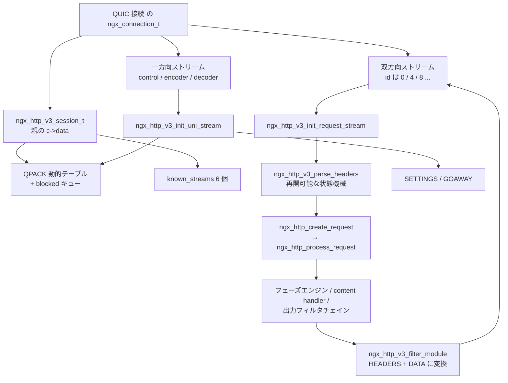

## この層の責務

[QUIC のページ](../quic-transport/) で見たとおり、QUIC 層は「順番に並んだバイト列が読める `ngx_connection_t`」をストリームごとに 1 個ずつ差し出してくる。HTTP/3 の仕事は、**その上に HTTP のセマンティクスを乗せ直すこと**だけになる。

具体的には 4 つ。

1. **リクエストとストリームの対応づけ** — 双方向ストリーム 1 本にリクエスト 1 本
2. **フレーミング** — ストリームのバイト列を HEADERS / DATA に区切る
3. **ヘッダ圧縮 (QPACK)** — ヘッダを索引と literal に変換する。動的テーブルは別ストリームで同期する
4. **接続レベルの制御** — SETTINGS、GOAWAY、ストリームのキャンセル

TCP の HTTP/2 では、この 4 つが全部 1 本の接続の中で完結していた。HTTP/3 では **1 と 2 が双方向ストリームの中、3 と 4 が一方向ストリームの中**に分かれる。これがコードの分割にそのまま出る。

`src/http/v3/` は 13 ファイル 7359 行ある。

| ファイル                                                           | 行数 | 何をするか                                                       |
| ------------------------------------------------------------------ | ---- | ---------------------------------------------------------------- |
| `ngx_http_v3_parse.c`                                              | 1966 | ストリームのバイト列を読む再開可能な状態機械                     |
| `ngx_http_v3_request.c`                                            | 1781 | リクエストストリームの受け口、擬似ヘッダ、ボディ                 |
| `ngx_http_v3_filter_module.c`                                      | 1002 | 応答ヘッダを QPACK に、ボディを DATA フレームに                  |
| `ngx_http_v3_table.c`                                              | 741  | QPACK の静的テーブル 99 件と動的テーブル                         |
| `ngx_http_v3_uni.c`                                                | 625  | 一方向ストリームの受け口と送り口                                 |
| `ngx_http_v3_module.c`                                             | 393  | `http3_*` / `quic_*` ディレクティブと `ngx_quic_conf_t` の初期化 |
| `ngx_http_v3_encode.c`                                             | 304  | 可変長整数・prefix 整数・field line の書き出し                   |
| `ngx_http_v3.h` / `_parse.h` / `_table.h` / `_uni.h` / `_encode.h` | 436  | 型とマクロ                                                       |
| `ngx_http_v3.c`                                                    | 111  | セッションの生成と flood 検出                                    |

[HTTP/2 のページ](../http2-multiplexing/) で見た `ngx_http_v2.c` が 1 ファイルで 5088 行だったのと比べると、同じ量の仕事が細かく割れている。**多重化を QUIC に任せられたぶん、残った仕事が素直に分割できた**からだ。

## 主要な型とその関係

### `ngx_http_v3_session_t` — QUIC 接続 1 本につき 1 つ

[`src/http/v3/ngx_http_v3.h#L123-L144`](https://github.com/nginx/nginx/blob/release-1.31.4/src/http/v3/ngx_http_v3.h#L123-L144)。

```c title="src/http/v3/ngx_http_v3.h"
struct ngx_http_v3_session_s {
    ngx_http_connection_t        *http_connection;

    ngx_http_v3_dynamic_table_t   table;

    ngx_event_t                   keepalive;
    ngx_uint_t                    nrequests;

    ngx_queue_t                   blocked;
    ngx_uint_t                    nblocked;

    uint64_t                      next_request_id;

    off_t                         total_bytes;
    off_t                         payload_bytes;

    unsigned                      goaway:1;
    unsigned                      hq:1;
    unsigned                      created_streams:NGX_HTTP_V3_MAX_KNOWN_STREAM;

    ngx_connection_t             *known_streams[NGX_HTTP_V3_MAX_KNOWN_STREAM];
};
```

`ngx_http_v2_connection_t` の 40 近いフィールドと比べると小さい。フロー制御も優先度もストリームの木も無いからで、**それは全部 QUIC 層が持っている**。

`known_streams[]` が 6 要素なのは、一方向ストリームがクライアント側 3 種とサーバ側 3 種あるからだ ([`#L48-L55`](https://github.com/nginx/nginx/blob/release-1.31.4/src/http/v3/ngx_http_v3.h#L48-L55))。

```c title="src/http/v3/ngx_http_v3.h"
#define NGX_HTTP_V3_STREAM_CLIENT_CONTROL          0
#define NGX_HTTP_V3_STREAM_SERVER_CONTROL          1
#define NGX_HTTP_V3_STREAM_CLIENT_ENCODER          2
#define NGX_HTTP_V3_STREAM_SERVER_ENCODER          3
#define NGX_HTTP_V3_STREAM_CLIENT_DECODER          4
#define NGX_HTTP_V3_STREAM_SERVER_DECODER          5
#define NGX_HTTP_V3_MAX_KNOWN_STREAM               6
```

`blocked` と `nblocked` は QPACK のブロッキング用で、後で見る。

### どこから見ても同じセッションに辿り着くマクロ

HTTP/3 の中では `ngx_connection_t *c` がストリームの偽接続だったり QUIC の親接続だったりする。それを吸収するのがこのマクロだ ([`#L81-L86`](https://github.com/nginx/nginx/blob/release-1.31.4/src/http/v3/ngx_http_v3.h#L81-L86))。

```c title="src/http/v3/ngx_http_v3.h"
#define ngx_http_v3_get_session(c)                                            \
    ((ngx_http_v3_session_t *) ((c)->quic ? (c)->quic->parent->data           \
                                          : (c)->data))

#define ngx_http_quic_get_connection(c)                                       \
    (ngx_http_v3_get_session(c)->http_connection)
```

`c->quic` があればストリーム、無ければ親。**セッションの実体は親接続の `c->data` に置いてある。** 同じ手口が `ngx_http_v3_finalize_connection()` にもあり、`(c)->quic ? (c)->quic->parent : (c)` で親を取り直してから `ngx_quic_finalize_connection()` を呼ぶ。

### `ngx_http_v3_dynamic_table_t` — QPACK の動的テーブル

[`src/http/v3/ngx_http_v3_table.h#L23-L33`](https://github.com/nginx/nginx/blob/release-1.31.4/src/http/v3/ngx_http_v3_table.h#L23-L33)。

```c title="src/http/v3/ngx_http_v3_table.h"
typedef struct {
    ngx_http_v3_field_t         **elts;
    ngx_uint_t                    nelts;
    ngx_uint_t                    base;
    size_t                        size;
    size_t                        capacity;
    uint64_t                      insert_count;
    uint64_t                      ack_insert_count;
    ngx_event_t                   send_insert_count;
    ngx_buf_t                    *insert_buffer;
} ngx_http_v3_dynamic_table_t;
```

`base` が「先頭のエントリの通し番号」で、`nelts` が現在保持している数。古いものを捨てると `base` が増える。エントリの絶対索引は `base + i` になり、この番号が接続の寿命のあいだ単調増加する。**HPACK が「先頭からの相対位置」で参照するのに対し、QPACK は絶対番号で参照する。** 後で見るブロッキングの仕組みがこれを要求する。

静的テーブルは 99 件 ([`ngx_http_v3_table.c#L28-L157`](https://github.com/nginx/nginx/blob/release-1.31.4/src/http/v3/ngx_http_v3_table.c#L28-L157))。HPACK の 61 件より多く、`:status` の値も個別に入っている。

### `ngx_http_v3_parse_t` — リクエストごとのパーサ状態

[`src/http/v3/ngx_http_v3.h#L115-L120`](https://github.com/nginx/nginx/blob/release-1.31.4/src/http/v3/ngx_http_v3.h#L115-L120)。

```c title="src/http/v3/ngx_http_v3.h"
struct ngx_http_v3_parse_s {
    size_t                        header_limit;
    ngx_http_v3_parse_headers_t   headers;
    ngx_http_v3_parse_data_t      body;
    ngx_array_t                  *cookies;
};
```

これが `ngx_http_request_t` の `r->v3_parse` に入る。`ngx_http_v3_parse_headers_t` の中がさらに入れ子になっていて、`vlint` (可変長整数)、`prefix` (field section prefix)、`field_rep` (field line の繰り返し) と続く ([`ngx_http_v3_parse.h#L78-L85`](https://github.com/nginx/nginx/blob/release-1.31.4/src/http/v3/ngx_http_v3_parse.h#L78-L85))。

```c title="src/http/v3/ngx_http_v3_parse.h"
typedef struct {
    ngx_uint_t                      state;
    ngx_uint_t                      type;
    ngx_uint_t                      length;
    ngx_http_v3_parse_varlen_int_t  vlint;
    ngx_http_v3_parse_field_section_prefix_t  prefix;
    ngx_http_v3_parse_field_rep_t   field_rep;
} ngx_http_v3_parse_headers_t;
```

**入れ子の各段が自分の `state` を持つ。** 呼ばれた側が `NGX_AGAIN` を返したら、呼んだ側は自分の状態を変えずにそのまま `NGX_AGAIN` を返す。次にデータが来たら、同じ経路を降りて同じ位置から再開する。

### 全体の関係



## 処理の流れ

### 1. `listen ... quic` が `ngx_listening_t` に落ちるまで

`listen` の引数に `quic` があると `lsopt.quic = 1` が立つ ([`src/http/ngx_http_core_module.c#L4306-L4308`](https://github.com/nginx/nginx/blob/release-1.31.4/src/http/ngx_http_core_module.c#L4306-L4308))。直後に長い排他チェックが続く。

```c title="src/http/ngx_http_core_module.c"
    if (lsopt.quic) {
        /* ... fastopen / backlog / accept_filter / deferred / multipath /
               ssl / http2 / so_keepalive / proxy_protocol と両立しない ... */
```

`ssl` とも `http2` とも同居できない。**QUIC は TCP の設定をどれ 1 つ受け付けない**ので、同じ `listen` 行に混ぜられない。

そこからは通常の経路と同じで、アドレスの集約を経て `ngx_listening_t` に写される ([`src/http/ngx_http.c#L1887-L1889`](https://github.com/nginx/nginx/blob/release-1.31.4/src/http/ngx_http.c#L1887-L1889))。

```c title="src/http/ngx_http.c"
#if (NGX_HTTP_V3)
    ls->quic = addr->opt.quic;
#endif
```

このフラグを見て `ngx_quic_recvmsg` が read ハンドラに選ばれる。設定側では、`ngx_http_v3_srv_conf_t` の中に `ngx_quic_conf_t` が**値として埋め込まれている**のがポイントになる ([`ngx_http_v3.h#L105-L112`](https://github.com/nginx/nginx/blob/release-1.31.4/src/http/v3/ngx_http_v3.h#L105-L112))。`http3_stream_buffer_size` のようなディレクティブが `offsetof(ngx_http_v3_srv_conf_t, quic.stream_buffer_size)` で直接 QUIC 側のフィールドに書く。

上位から下位へのフックは 2 本だけだ ([`ngx_http_v3_module.c#L213-L214`](https://github.com/nginx/nginx/blob/release-1.31.4/src/http/v3/ngx_http_v3_module.c#L213-L214))。

```c title="src/http/v3/ngx_http_v3_module.c"
    h3scf->quic.init = ngx_http_v3_init;
    h3scf->quic.shutdown = ngx_http_v3_shutdown;
```

### 2. `ngx_http_v3_init_stream()` が 2 回違う意味で呼ばれる

[`src/http/v3/ngx_http_v3_request.c#L58-L97`](https://github.com/nginx/nginx/blob/release-1.31.4/src/http/v3/ngx_http_v3_request.c#L58-L97)。この関数が入口で、**QUIC 接続そのものとストリームの両方から呼ばれる**。

```c title="src/http/v3/ngx_http_v3_request.c"
void
ngx_http_v3_init_stream(ngx_connection_t *c)
{
    hc = c->data;
    hc->ssl = 1;

    clcf = ngx_http_get_module_loc_conf(hc->conf_ctx, ngx_http_core_module);

    if (c->quic == NULL) {
        h3scf = ngx_http_get_module_srv_conf(hc->conf_ctx, ngx_http_v3_module);
        h3scf->quic.idle_timeout = clcf->keepalive_timeout;

        ngx_quic_run(c, &h3scf->quic);
        return;
    }

    phc = ngx_http_quic_get_connection(c);

    if (phc->ssl_servername) {
        hc->ssl_servername = phc->ssl_servername;
        /* ... */
        hc->conf_ctx = phc->conf_ctx;

        ngx_set_connection_log(c, clcf->error_log);
    }

    if (c->quic->id & NGX_QUIC_STREAM_UNIDIRECTIONAL) {
        ngx_http_v3_init_uni_stream(c);

    } else  {
        ngx_http_v3_init_request_stream(c);
    }
}
```

`c->quic == NULL` は「まだ QUIC が始まっていない」を意味する。1 回目は `ngx_http_init_connection()` から呼ばれて `ngx_quic_run()` に落ち、2 回目以降は QUIC 層が `c->listening->handler(c)` 経由で呼ぶ。**同じ関数が「接続の入口」と「ストリームの入口」を兼ねている。**

SNI で選ばれた `conf_ctx` を親からコピーしているのも要点で、TLS ハンドシェイクは親接続で 1 回だけ起きる。ストリームごとに SNI を引き直す必要がない。

分岐はストリーム ID の 1 ビットだけ。`NGX_QUIC_STREAM_UNIDIRECTIONAL` は `0x02` で、QUIC のストリーム ID の下位 2 ビットのうち上の 1 ビットになる。

### 3. 一方向ストリームは 4 種類

`ngx_http_v3_init_uni_stream()` は最初のバイト列から型を読む ([`ngx_http_v3_uni.c#L26-L75`](https://github.com/nginx/nginx/blob/release-1.31.4/src/http/v3/ngx_http_v3_uni.c#L26-L75))。型は可変長整数で先頭に 1 つ入っている ([`ngx_http_v3.h#L29-L32`](https://github.com/nginx/nginx/blob/release-1.31.4/src/http/v3/ngx_http_v3.h#L29-L32))。

```c title="src/http/v3/ngx_http_v3.h"
#define NGX_HTTP_V3_STREAM_CONTROL                 0x00
#define NGX_HTTP_V3_STREAM_PUSH                    0x01
#define NGX_HTTP_V3_STREAM_ENCODER                 0x02
#define NGX_HTTP_V3_STREAM_DECODER                 0x03
```

なぜ 4 種類も別ストリームが要るのか。理由が種類ごとに違う。

**control** は SETTINGS と GOAWAY を運ぶ。HTTP/2 ではストリーム 0 という予約枠がその役をしていた。QUIC には予約されたストリームが無いので、型で名乗る一方向ストリームを 1 本立てる。

**encoder / decoder** は QPACK のためにある。HPACK では動的テーブルの更新がヘッダブロックの中に混ざっていた。**QUIC ではヘッダブロックの到着順が保証されないので、テーブルの更新をそこに混ぜると更新順が壊れる。** 順序が保証される 1 本のストリームに更新だけを流し、リクエスト側は「何番まで届いた前提で読んでね」と番号で指定する形にした。

**push** はサーバプッシュ用で、Nginx は受け側の実装しか持たない。

登録は種類ごとに 1 本までに制限される ([`ngx_http_v3_uni.c#L155-L166`](https://github.com/nginx/nginx/blob/release-1.31.4/src/http/v3/ngx_http_v3_uni.c#L155-L166))。

```c title="src/http/v3/ngx_http_v3_uni.c"
    if (index >= 0) {
        if (h3c->created_streams & (1 << index)) {
            ngx_log_error(NGX_LOG_INFO, c->log, 0, "stream already created");
            return NGX_HTTP_V3_ERR_STREAM_CREATION_ERROR;
        }

        h3c->known_streams[index] = c;
        h3c->created_streams |= 1 << index;

        us = c->data;
        us->index = index;
    }
```

未知の型のストリームは捨てるが、その前に「必須の 3 本が揃っているか」を確認する ([`#L143-L150`](https://github.com/nginx/nginx/blob/release-1.31.4/src/http/v3/ngx_http_v3_uni.c#L143-L150))。揃っていなければ `STREAM_CREATION_ERROR` にする。未知の型を使って必須ストリームの上限を回避されないためだ。

サーバ側から一方向ストリームを開くのが `ngx_http_v3_get_uni_stream()` ([`#L311-L393`](https://github.com/nginx/nginx/blob/release-1.31.4/src/http/v3/ngx_http_v3_uni.c#L311-L393))。

```c title="src/http/v3/ngx_http_v3_uni.c"
    sc = ngx_quic_open_stream(c, 0);
    if (sc == NULL) {
        goto failed;
    }

    ngx_quic_cancelable_stream(sc);
    /* ... us を作って sc->data に置く ... */
    n = (u_char *) ngx_http_v3_encode_varlen_int(buf, type) - buf;
    /* ... */
    if (sc->send(sc, buf, n) != (ssize_t) n) {
        goto failed;
    }
```

`ngx_quic_cancelable_stream(sc)` が入っている。これは [タイマのページ](../timer-rbtree/) の `cancelable` と同じ発想で、**制御用のストリームが開いているだけでは接続を閉じられなくならないようにする**印だ。作った直後に型の varint を 1 個送るのがストリームの名乗りになる。

### 4. QPACK の動的テーブルとブロッキング

クライアントの encoder ストリームから届いた命令が `ngx_http_v3_parse_encoder()` を通り、`ngx_http_v3_insert()` などを呼ぶ。テーブルを書き換えるのは**この経路だけ**で、リクエストストリームからは読むだけになる。

読む側の問題がここから出る。HEADERS フレームの先頭には Field Section Prefix があり、「このヘッダブロックは動的テーブルの N 件目まで挿入済みであることを前提にしている」という Required Insert Count が入っている。encoder ストリームとリクエストストリームは別々に届くので、**参照するエントリがまだ届いていないことがありうる。**

`ngx_http_v3_check_insert_count()` がその判定をする ([`ngx_http_v3_table.c#L596-L653`](https://github.com/nginx/nginx/blob/release-1.31.4/src/http/v3/ngx_http_v3_table.c#L596-L653))。

```c title="src/http/v3/ngx_http_v3_table.c"
    n = dt->base + dt->nelts;

    ngx_log_debug2(NGX_LOG_DEBUG_HTTP, c->log, 0,
                   "http3 check insert count req:%ui, have:%ui",
                   insert_count, n);

    if (n >= insert_count) {
        return NGX_OK;
    }

    ngx_log_debug0(NGX_LOG_DEBUG_HTTP, c->log, 0, "http3 block stream");
    /* ... c->pool の cleanup から ngx_http_v3_block_t を取るか作る ... */

    if (block->queue.prev == NULL) {
        h3scf = ngx_http_v3_get_module_srv_conf(c, ngx_http_v3_module);

        if (h3c->nblocked == h3scf->max_blocked_streams) {
            /* ... too many blocked streams で接続ごと落とす ... */
        }

        h3c->nblocked++;
        ngx_queue_insert_tail(&h3c->blocked, &block->queue);
    }

    return NGX_BUSY;
```

`dt->base + dt->nelts` が「今までに挿入した総数」になる。足りなければ `NGX_BUSY` を返し、このストリームをセッションの `blocked` キューに繋ぐ。

**`NGX_BUSY` という戻り値が、パーサから `ngx_http_v3_process_request()` まで素通しで伝わる。** 呼び出し側はこう受ける ([`ngx_http_v3_request.c#L560-L577`](https://github.com/nginx/nginx/blob/release-1.31.4/src/http/v3/ngx_http_v3_request.c#L560-L577))。

```c title="src/http/v3/ngx_http_v3_request.c"
        if (rc == NGX_BUSY) {
            if (rev->error) {
                ngx_http_finalize_request(r, NGX_HTTP_BAD_REQUEST);
                break;
            }

            if (!rev->timer_set) {
                /* ... client_header_timeout を張る ... */
            }

            if (ngx_handle_read_event(rev, 0) != NGX_OK) {
                ngx_http_close_request(r, NGX_HTTP_INTERNAL_SERVER_ERROR);
            }

            break;
        }
```

「データが足りない」の `NGX_AGAIN` と扱いがほぼ同じになっている。**違うのは「何を待っているか」だけで、待ち方は同じイベント機構に載せられている。**

解除する側は、テーブルにエントリが増えたときに全部起こす ([`ngx_http_v3_table.c#L698-L707`](https://github.com/nginx/nginx/blob/release-1.31.4/src/http/v3/ngx_http_v3_table.c#L698-L707))。

```c title="src/http/v3/ngx_http_v3_table.c"
    while (!ngx_queue_empty(&h3c->blocked)) {
        q = ngx_queue_head(&h3c->blocked);
        block = (ngx_http_v3_block_t *) q;
        bc = block->connection;

        ngx_log_debug0(NGX_LOG_DEBUG_HTTP, bc->log, 0, "http3 unblock stream");

        ngx_http_v3_unblock(block);
        ngx_post_event(bc->read, &ngx_posted_events);
    }
```

**個別に「誰がどのエントリを待っているか」を管理せず、1 件増えたら全員起こす。** 起こされたストリームがもう一度 `check_insert_count()` を通り、足りなければまた並ぶ。`max_blocked_streams` (既定で `http3_max_concurrent_streams` と同じ 128) で上限があるので、この総当たりが問題になるほど長い列にはならない。

`ngx_http_v3_block_t` は `c->pool` の cleanup として確保されている。**ストリームが死ねば cleanup が走り、キューから自動的に外れる。** キューに繋いだまま接続が消える事故が構造的に起きない。

読んだ側は decoder ストリームで確認応答を返す。`ngx_http_v3_parse_headers()` の末尾がそれだ ([`ngx_http_v3_parse.c#L394-L400`](https://github.com/nginx/nginx/blob/release-1.31.4/src/http/v3/ngx_http_v3_parse.c#L394-L400))。

```c title="src/http/v3/ngx_http_v3_parse.c"
    if (st->prefix.insert_count > 0) {
        if (ngx_http_v3_send_ack_section(c, c->quic->id) != NGX_OK) {
            return NGX_ERROR;
        }

        ngx_http_v3_ack_insert_count(c, st->prefix.insert_count);
    }
```

これでクライアントは「N 件目まで確かに使われた」と知り、それより古いエントリを捨てられるようになる。

### 5. パーサは HTTP/1.1 と同じ形をしている

`ngx_http_v3_parse.c` の 1966 行は、入れ子になった状態機械の集まりだ。一番下の可変長整数のパーサを見る ([`#L97-L179`](https://github.com/nginx/nginx/blob/release-1.31.4/src/http/v3/ngx_http_v3_parse.c#L97-L179))。

```c title="src/http/v3/ngx_http_v3_parse.c"
static ngx_int_t
ngx_http_v3_parse_varlen_int(ngx_connection_t *c,
    ngx_http_v3_parse_varlen_int_t *st, ngx_buf_t *b)
{
    u_char  ch;
    enum {
        sw_start = 0,
        sw_length_2,
        /* ... sw_length_3 〜 sw_length_8 ... */
    };

    for ( ;; ) {

        if (b->pos == b->last) {
            return NGX_AGAIN;
        }

        ch = *b->pos++;

        switch (st->state) {

        case sw_start:

            st->value = ch;
            if (st->value & 0xc0) {
                st->state = sw_length_2;
                break;
            }

            goto done;
        /* ... */
        }
    }
```

HTTP/1.1 のリクエスト行パーサと並べてみる ([`src/http/ngx_http_parse.c#L110-L160`](https://github.com/nginx/nginx/blob/release-1.31.4/src/http/ngx_http_parse.c#L110-L160))。

```c title="src/http/ngx_http_parse.c"
    u_char  c, ch, *p, *m;
    enum {
        sw_start = 0,
        sw_method,
        sw_spaces_before_uri,
        /* ... 全部で 26 状態 ... */
        sw_almost_done
    } state;

    state = r->state;

    for (p = b->pos; p < b->last; p++) {
        ch = *p;

        switch (state) {

        /* HTTP methods: GET, HEAD, POST */
        case sw_start:
            r->request_start = p;
            /* ... */
            state = sw_method;
            break;
```

**同じ形だ。** ローカルの `enum` で状態に名前を付け、1 バイト読んで `switch` し、バッファが尽きたら状態を構造体に残して返る。

違いは 2 点しかない。HTTP/1.1 は `state` をローカル変数に持って最後に `r->state = state` で書き戻す ([`#L847`](https://github.com/nginx/nginx/blob/release-1.31.4/src/http/ngx_http_parse.c#L847))。HTTP/3 は `st->state` を直接読み書きする。これは HTTP/3 のパーサが入れ子で、途中の段から `return` する経路が多いためだ。

もう 1 点は、入れ子の呼び出しでバッファを区切る仕掛けがあること ([`ngx_http_v3_parse.c#L64-L80`](https://github.com/nginx/nginx/blob/release-1.31.4/src/http/v3/ngx_http_v3_parse.c#L64-L80))。

```c title="src/http/v3/ngx_http_v3_parse.c"
static void
ngx_http_v3_parse_start_local(ngx_buf_t *b, ngx_buf_t *loc, ngx_uint_t n)
{
    *loc = *b;

    if ((size_t) (loc->last - loc->pos) > n) {
        loc->last = loc->pos + n;
    }
}

static void
ngx_http_v3_parse_end_local(ngx_buf_t *b, ngx_buf_t *loc, ngx_uint_t *pn)
{
    *pn -= loc->pos - b->pos;
    b->pos = loc->pos;
}
```

`ngx_buf_t` をスタックにコピーして `last` を縮め、下位のパーサに渡す。**下位は「フレームの終わりを超えて読めない」ことを知らなくてよい。** 戻ってきたら進んだぶんを残り長さから引く。

HEADERS フレームのパーサはこの部品を順に呼ぶだけになる ([`#L248-L400`](https://github.com/nginx/nginx/blob/release-1.31.4/src/http/v3/ngx_http_v3_parse.c#L248-L400))。

```c title="src/http/v3/ngx_http_v3_parse.c"
        case sw_verify:

            rc = ngx_http_v3_check_insert_count(c, st->prefix.insert_count);
            if (rc != NGX_OK) {
                return rc;
            }

            st->state = sw_field_rep;

            /* fall through */

        case sw_field_rep:

            ngx_http_v3_parse_start_local(b, &loc, st->length);

            rc = ngx_http_v3_parse_field_rep(c, &st->field_rep, st->prefix.base,
                                             &loc);

            ngx_http_v3_parse_end_local(b, &loc, &st->length);
            /* ... */
            if (st->length == 0) {
                goto done;
            }

            return NGX_OK;
```

戻り値が 5 種類ある。ヘッダに規約が書いてある ([`ngx_http_v3_parse.h#L129-L137`](https://github.com/nginx/nginx/blob/release-1.31.4/src/http/v3/ngx_http_v3_parse.h#L129-L137))。

```c title="src/http/v3/ngx_http_v3_parse.h"
/*
 * Parse functions return codes:
 *   NGX_DONE - parsing done
 *   NGX_OK - sub-element done
 *   NGX_AGAIN - more data expected
 *   NGX_BUSY - waiting for external event
 *   NGX_ERROR - internal error
 *   NGX_HTTP_V3_ERROR_XXX - HTTP/3 or QPACK error
 */
```

`NGX_OK` が「ヘッダ 1 本ぶん取れた、まだ続く」、`NGX_DONE` が「全部終わった」。**部分的な完了を戻り値で表す**ので、呼び出し側はループの中で 1 本ずつヘッダを受け取れる。

### 6. ヘッダが揃ったら HTTP/1.1 と同じ道へ

リクエストストリームの受け口は `ngx_http_v3_wait_request_handler()` で、`ngx_http_wait_request_handler()` (HTTP/1.1) とほぼ同じことをする ([`ngx_http_v3_request.c#L331-L404`](https://github.com/nginx/nginx/blob/release-1.31.4/src/http/v3/ngx_http_v3_request.c#L331-L404))。

```c title="src/http/v3/ngx_http_v3_request.c"
    n = c->recv(c, b->last, size);
    /* ... NGX_AGAIN なら timer を張って帰る、b->start を pfree して手放す ... */
    b->last += n;

    c->log->action = "reading client request";

    ngx_reusable_connection(c, 0);

    r = ngx_http_create_request(c);
    if (r == NULL) {
        ngx_http_close_connection(c);
        return;
    }

    r->http_version = NGX_HTTP_VERSION_30;

    r->v3_parse = ngx_pcalloc(r->pool, sizeof(ngx_http_v3_parse_t));
    /* ... */
    c->data = r;
    c->requests = (c->quic->id >> 2) + 1;
    /* ... */
    rev->handler = ngx_http_v3_process_request;
    ngx_http_v3_process_request(rev);
```

`c->recv()` は [QUIC 層](../quic-transport/) が差し替えた `ngx_quic_stream_recv` で、`ngx_http_create_request(c)` は HTTP/1.1 が呼ぶのとまったく同じ関数だ。

`c->requests = (c->quic->id >> 2) + 1` が面白い。keepalive の回数カウンタに、**ストリーム ID から計算した値を入れている**。HTTP/1.1 なら「この接続で何本目のリクエストか」を数え上げるところを、QUIC ではストリーム ID が既にその情報を持っている。

パースが終わったところで合流する ([`#L596-L603`](https://github.com/nginx/nginx/blob/release-1.31.4/src/http/v3/ngx_http_v3_request.c#L596-L603))。

```c title="src/http/v3/ngx_http_v3_request.c"
        if (rc == NGX_DONE) {
            if (ngx_http_v3_process_request_header(r) != NGX_OK) {
                break;
            }

            ngx_http_process_request(r);
            break;
        }
    }

    ngx_http_run_posted_requests(c);
```

`ngx_http_process_request()` は [リクエストパースのページ](../request-parse/) で見たものと同一。ここから先は [フェーズエンジン](../phase-engine/)、[コンテンツハンドラ](../content-handler/)、[出力フィルタチェイン](../output-filter-chain/) と、プロトコルを問わない道になる。

擬似ヘッダの処理だけは HTTP/3 側にある。`:method` `:path` `:scheme` `:authority` を `ngx_http_v3_process_pseudo_header()` が受け、`r->method_name` / `r->uri` / `r->headers_in.server` に詰め直す。**HTTP/1.1 のリクエスト行を組み立て直しているのと同じことをしている。**

### 7. 出力はフィルタチェインの末端に割り込む

`ngx_http_v3_filter_module` はヘッダ・ボディ・early hints の 3 本のフィルタを登録する。冒頭がこうなっている ([`ngx_http_v3_filter_module.c#L102-L104`](https://github.com/nginx/nginx/blob/release-1.31.4/src/http/v3/ngx_http_v3_filter_module.c#L102-L104))。

```c title="src/http/v3/ngx_http_v3_filter_module.c"
    if (r->http_version != NGX_HTTP_VERSION_30) {
        return ngx_http_next_header_filter(r);
    }
```

**HTTP/3 でなければ何もせず次に渡す。** [出力フィルタチェイン](../output-filter-chain/) の作法そのままで、モジュールが常に登録されていても他のプロトコルに影響しない。

ヘッダの変換は 2 パスになる。まず全ヘッダの符号化後の長さを数え、バッファを 1 つ確保してから書き込む。

```c title="src/http/v3/ngx_http_v3_filter_module.c"
    len = ngx_http_v3_encode_field_section_prefix(NULL, 0, 0, 0);

    if (r->headers_out.status == NGX_HTTP_OK) {
        len += ngx_http_v3_encode_field_ri(NULL, 0,
                                           NGX_HTTP_V3_HEADER_STATUS_200);

    } else {
        len += ngx_http_v3_encode_field_lri(NULL, 0,
                                            NGX_HTTP_V3_HEADER_STATUS_200,
                                            NULL, 3);
    }
```

第 1 引数が `NULL` なら長さを返し、バッファなら書いて末尾を返す。同じ関数を 2 回呼ぶ形は `ngx_http_v3_encode.c` 全体の作法になっている。

符号化の種類が 3 つ出てくる。`_ri` が静的テーブルへの索引参照、`_lri` が「名前は索引、値は literal」、`_l` が名前も値も literal。最後の `_l` は設定由来やモジュール由来の任意のヘッダに使われる。

```c title="src/http/v3/ngx_http_v3_filter_module.c"
        b->last = (u_char *) ngx_http_v3_encode_field_l(b->last,
                                                        &header[i].key,
                                                        &header[i].value);
```

**`ngx_http_v3_encode_field_section_prefix(NULL, 0, 0, 0)` の第 2 引数が Required Insert Count で、常に 0 が渡る。** つまり Nginx は応答ヘッダに動的テーブルを使わない。前掲のとおり `ngx_http_v3_insert()` を呼ぶのはクライアントの encoder ストリームの経路だけで、サーバ側の encoder ストリームには何も流れない。**QPACK の複雑な半分を、送信側では使わないことにしている。**

ボディは DATA フレームのヘッダを前に足すだけになる ([`#L794-L826`](https://github.com/nginx/nginx/blob/release-1.31.4/src/http/v3/ngx_http_v3_filter_module.c#L794-L826))。

```c title="src/http/v3/ngx_http_v3_filter_module.c"
        b->last = (u_char *) ngx_http_v3_encode_varlen_int(chunk,
                                                       NGX_HTTP_V3_FRAME_DATA);
        b->last = (u_char *) ngx_http_v3_encode_varlen_int(b->last, size);

        tl->next = out;
        out = tl;
```

チェインの先頭に長さバッファを継ぎ足し、元のバッファはコピーしない。**chunked encoding のフィルタと同じ構造**で、区切りの書式が「16 進数 + CRLF」から「varint 2 個」に変わっただけだ。

`last_buf` が来たらトレーラを作り、`cl->buf->last_buf = 0` に落として自分で終端を管理する。ここから先は QUIC 層の `send_chain` が受け取り、STREAM フレームになる。

## 守られている不変条件

**QPACK の動的テーブルを書き換えるのは encoder ストリームだけ。** リクエストストリームは読むだけで、`base` も `nelts` も変えない。この分離があるから、リクエストストリームの処理を中断・再開しても状態が壊れない。

**`blocked` キューに入っているストリームは、必ず `c->pool` の cleanup を持っている。** `ngx_http_v3_check_insert_count()` が cleanup を先に確保してからキューに繋ぐ。ストリームが死ねば `ngx_http_v3_unblock()` が走って外れる。

**`known_streams[]` の各枠は一度しか埋まらない。** `created_streams` のビットで二重登録を弾く。破ると同じ役割のストリームが 2 本でき、SETTINGS が 2 回来る。

**一方向ストリームはすべて `cancelable`。** graceful shutdown のときにこれらを待たない。`ngx_quic_cancelable_stream()` が受け側 (`init_uni_stream`) と送り側 (`get_uni_stream`) の両方で呼ばれている。

**`ngx_http_v3_session_t` は親接続の `c->data` にある。** ストリームの `c->data` はリクエストや `ngx_http_v3_uni_stream_t` に差し替わるので、セッションを取るときは必ず `ngx_http_v3_get_session()` を通す。

## つまずきどころ

### 3 つのプロトコルは `ngx_http_request_t` から下で完全に合流する

このページと [HTTP/2](../http2-multiplexing/) と [リクエストパース](../request-parse/) を並べると、対応関係がはっきりする。

|                         | HTTP/1.1                                                   | HTTP/2                        | HTTP/3                             |
| ----------------------- | ---------------------------------------------------------- | ----------------------------- | ---------------------------------- |
| フレーミング            | 行と `Content-Length` / chunked                            | 9 バイトのフレームヘッダ      | varint 2 個のフレームヘッダ        |
| 多重化の単位            | 無し (1 接続 1 リクエスト)                                 | `ngx_http_v2_stream_t`        | QUIC の双方向ストリーム            |
| 順序保証の範囲          | 接続全体 (TCP)                                             | 接続全体 (TCP)                | ストリーム単位 (QUIC)              |
| ヘッダ圧縮              | 無し                                                       | HPACK (接続内で完結)          | QPACK (別ストリームで同期)         |
| フロー制御              | TCP のみ                                                   | HTTP/2 の WINDOW_UPDATE + TCP | QUIC の MAX_DATA / MAX_STREAM_DATA |
| 偽の `ngx_connection_t` | 不要                                                       | `ngx_memcpy` でコピー         | `ngx_get_connection()` で新規      |
| 入口                    | `ngx_http_wait_request_handler`                            | `ngx_http_v2_run_request`     | `ngx_http_v3_wait_request_handler` |
| 合流点                  | `ngx_http_create_request()` → `ngx_http_process_request()` | 同左                          | 同左                               |

最後の行が結論になる。**`ngx_http_process_request()` から先は 3 つとも同じコードを通る。** [フェーズエンジン](../phase-engine/) も [upstream](../upstream/) も [ファイルキャッシュ](../file-cache/) も、どのプロトコルで来たかを知らない。

知る必要があるのは出力の末端だけで、そこは `r->http_version` を見るフィルタが 3 つ並ぶ形で解決されている。HTTP/1.1 用の chunked フィルタ、`ngx_http_v2_filter_module`、`ngx_http_v3_filter_module`。それぞれが自分の担当でなければ即座に次に渡す。

**新しいプロトコルを足すコストが「入口 + 出口のフィルタ 1 本」に収まっている**のは、この構造のおかげだ。

### `NGX_BUSY` は HTTP/3 にしかない

Nginx の戻り値の語彙は `NGX_OK` / `NGX_ERROR` / `NGX_AGAIN` / `NGX_DECLINED` / `NGX_DONE` が中心で、`NGX_BUSY` はほとんど使われない。HTTP/3 のパーサで導入されたのは、**「データは来ているが、別のストリームの到着を待たなければ解釈できない」という状態が他に無かった**からだ。

`NGX_AGAIN` にしてしまうと、呼び出し側が「もっと読めば進む」と誤解して読み続ける。`NGX_BUSY` は「読んでも進まない、外部イベント待ち」を意味する。

### `hq` モードがあると分岐が増える

`ngx_http_v3_session_t` の `hq` フラグは、相互運用テスト用の `hq-interop` ALPN を選んだときに立つ ([`ngx_http_v3_request.c#L121-L135`](https://github.com/nginx/nginx/blob/release-1.31.4/src/http/v3/ngx_http_v3_request.c#L121-L135))。

```c title="src/http/v3/ngx_http_v3_request.c"
    if (h3scf->enable_hq) {
        if (!h3scf->enable) {
            h3c->hq = 1;
            return NGX_OK;
        }

        SSL_get0_alpn_selected(c->ssl->connection, &data, &len);

        if (len == sizeof(NGX_HTTP_V3_HQ_PROTO) - 1
            && ngx_strncmp(data, NGX_HTTP_V3_HQ_PROTO, len) == 0)
        {
            h3c->hq = 1;
            return NGX_OK;
        }
    }
```

立っていると SETTINGS も QPACK も送らず、一方向ストリームが来たら接続を落とす。**リクエストストリームに HTTP/0.9 相当の平文が流れる**モードになる。既定は off だが、`if (!h3c->hq)` という条件が方々に散っているので、読むときにノイズになる。

### ヘッダ用バッファを手放す

`ngx_http_v3_wait_request_handler()` に、HTTP/1.1 と同じ細工が入っている ([`ngx_http_v3_request.c#L345-L351`](https://github.com/nginx/nginx/blob/release-1.31.4/src/http/v3/ngx_http_v3_request.c#L345-L351))。

```c title="src/http/v3/ngx_http_v3_request.c"
        /*
         * We are trying to not hold c->buffer's memory for an idle connection.
         */

        if (ngx_pfree(c->pool, b->start) == NGX_OK) {
            b->start = NULL;
        }
```

ストリームができてからヘッダが届くまでのあいだ、`client_header_buffer_size` (既定 1KB) を握らない。HTTP/3 では**ストリームが接続より安く作れるぶん、待機中のストリームが増えやすい**ので、この節約が効く場面が HTTP/1.1 より多い。

`ngx_pfree()` が [メモリプール](../memory-pool/) の「大きいブロックだけ個別解放できる」性質に依存しているので、`client_header_buffer_size` が小さいと解放されずに終わる。

### `keepalive_requests` がストリーム ID で効く

```c title="src/http/v3/ngx_http_v3_request.c"
    n = c->quic->id >> 2;

    if (n >= clcf->keepalive_requests * 2) {
        ngx_http_v3_finalize_connection(c, NGX_HTTP_V3_ERR_EXCESSIVE_LOAD,
                                        "too many requests per connection");
```

`* 2` という余裕が入っている ([`#L200-L207`](https://github.com/nginx/nginx/blob/release-1.31.4/src/http/v3/ngx_http_v3_request.c#L200-L207))。`keepalive_requests` に達した時点で GOAWAY を送るが、既に飛んでいるリクエストがあるので、その猶予として上限の 2 倍まではストリームを受ける。**「上限」と「打ち切り」を別の値にしている**わけで、多重化があるプロトコルで上限を設けるときの定型になる。

## 関連

- 下の層の QUIC ストリームがどう作られるかは [QUIC のページ](../quic-transport/)。プロトコルの狙いそのものは [HTTP/2 と HTTP/3 のページ](../http2-http3/)。
- 偽の `ngx_connection_t` と HPACK の対応物は [HTTP/2 のページ](../http2-multiplexing/)。
- 合流先の `ngx_http_create_request()` と `ngx_http_process_request()` は [リクエストパースのページ](../request-parse/)。
- フィルタが自分の担当でなければ素通しする作法は [出力フィルタチェインのページ](../output-filter-chain/)。
- ALPN の選択と `ngx_ssl_conf_t` の共有は [TLS 層のページ](../ssl-layer/)。
