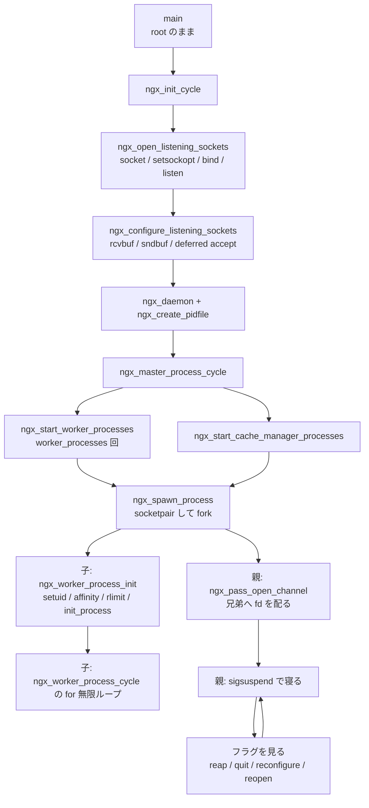

## この層の責務

[前のページ](../boot-cycle/) で `ngx_init_cycle()` が `ngx_cycle_t` を組み上げた。その中には listen すべきアドレスの一覧 (`cycle->listening`) が入っているが、まだプロセスは 1 つしかなく、ソケットは開いていない。

この層がやるのは 3 つだ。

1. **listen ソケットを実際に開く。** `socket()` → `setsockopt()` → `bind()` → `listen()` を、設定から作られた `ngx_listening_t` の配列ぶん繰り返す。
2. **プロセスを並べる。** `worker_processes` の数だけ `fork()` し、必要なら cache manager と cache loader も足す。
3. **監督する。** 死んだ子を作り直し、シグナルを受けて設定を読み直し、graceful に終わらせる。

順序が設計の中心にある。1 が 2 より前にあるので、80 番ポートを開くのに必要な root 権限は master にしか要らない。ワーカーは fork のあとで `setuid()` して非特権になり、すでに開いた fd をそのまま使う。開いた fd に権限チェックはかからないので、非特権のワーカーが特権ポートで `accept()` できる。

Web サーバがそもそもなぜ listen と accept を分けるのかは [listen ソケットの向こう側にある 2 本のキュー](../tcp-accept/) を参照。

## 主要な型とその関係

### `ngx_listening_t` — 「1 つの listen アドレス」

[`src/core/ngx_connection.h#L18-L95`](https://github.com/nginx/nginx/blob/release-1.31.4/src/core/ngx_connection.h#L18-L95)。設定の `listen` ディレクティブ 1 個につき 1 つ作られ、`cycle->listening` という `ngx_array_t` に積まれる。フィールドは役割で 4 群に分かれる。

| 群                 | フィールド                                                                                   | 意味                                                   |
| ------------------ | -------------------------------------------------------------------------------------------- | ------------------------------------------------------ |
| アドレス           | `sockaddr` / `socklen` / `addr_text`                                                         | どこを listen するか。`addr_text` はログ用の文字列表現 |
| ソケットオプション | `backlog` / `rcvbuf` / `sndbuf` / `keepalive` / `deferred_accept` / `reuseport` / `ipv6only` | カーネルに渡す設定                                     |
| 上位層への橋       | `handler` / `servers` / `pool_size` / `logp`                                                 | accept したあと誰に渡すか                              |
| 状態               | `fd` / `open` / `remain` / `bound` / `inherited` / `listen` / `worker`                       | 今どうなっているか                                     |

```c title="src/core/ngx_connection.h"
struct ngx_listening_s {
    ngx_socket_t        fd;
    /* ... */
    /* handler of accepted connection */
    ngx_connection_handler_pt   handler;

    void               *servers;  /* array of ngx_http_in_addr_t, for example */
    /* ... */
};
```

**`handler` と `servers` が、トランスポート層と上位プロトコルの唯一の接点になっている。** HTTP モジュールは `ngx_http_add_listening()` でここを埋める ([`src/http/ngx_http.c#L1817-L1852`](https://github.com/nginx/nginx/blob/release-1.31.4/src/http/ngx_http.c#L1817-L1852))。

```c title="src/http/ngx_http.c"
    ls = ngx_create_listening(cf, addr->opt.sockaddr, addr->opt.socklen);
    /* ... */
    ls->handler = ngx_http_init_connection;

    cscf = addr->default_server;
    ls->pool_size = cscf->connection_pool_size;
    /* ... */
    ls->backlog = addr->opt.backlog;
    ls->rcvbuf = addr->opt.rcvbuf;
    ls->sndbuf = addr->opt.sndbuf;
```

stream モジュールは同じ場所に `ngx_stream_init_connection` を入れる ([`src/stream/ngx_stream.c#L1002-L1004`](https://github.com/nginx/nginx/blob/release-1.31.4/src/stream/ngx_stream.c#L1002-L1004))。`ngx_open_listening_sockets()` は `handler` が何なのかを知らない。この分離のおかげで、listen ソケットを開くコードが HTTP にも stream にも依存しない。

既定値は `ngx_create_listening()` が入れる ([`src/core/ngx_connection.c#L79-L84`](https://github.com/nginx/nginx/blob/release-1.31.4/src/core/ngx_connection.c#L79-L84))。

```c title="src/core/ngx_connection.c"
    ls->fd = (ngx_socket_t) -1;
    ls->type = SOCK_STREAM;

    ls->backlog = NGX_LISTEN_BACKLOG;
    ls->rcvbuf = -1;
    ls->sndbuf = -1;
```

`rcvbuf` / `sndbuf` の `-1` は「設定されていない」を表す。この「第 3 の状態」の使い方は Nginx 全体の作法で、詳細は [設定のマージのページ](../conf-merge/) にある。`NGX_LISTEN_BACKLOG` は Linux / Solaris で 511、FreeBSD と macOS では `-1` (カーネル既定に任せる)。

### `ngx_process_t` と `ngx_processes[]`

master が持つ子プロセスの表は、固定長 1024 の静的配列だ ([`src/os/unix/ngx_process.h#L22-L53`](https://github.com/nginx/nginx/blob/release-1.31.4/src/os/unix/ngx_process.h#L22-L53))。

```c title="src/os/unix/ngx_process.h"
typedef struct {
    ngx_pid_t           pid;
    int                 status;
    ngx_socket_t        channel[2];

    ngx_spawn_proc_pt   proc;
    void               *data;
    char               *name;

    unsigned            respawn:1;
    unsigned            just_spawn:1;
    unsigned            detached:1;
    unsigned            exiting:1;
    unsigned            exited:1;
} ngx_process_t;


#define NGX_MAX_PROCESSES         1024
```

5 つのビットが子の性質と状態を表す。`respawn` は「死んだら作り直す」でワーカーと cache manager が立てる。`just_spawn` は「リロードで今回新しく起こした」印で、古い子と区別するために使う。`detached` はバイナリアップグレードで `execve()` した新しい master で、チャネルを持たない。`exiting` は終了指示済み、`exited` は `SIGCHLD` で回収済み。

`ngx_last_process` は「使われている最大スロット + 1」で、配列の走査はここまでで打ち切る。スロット番号 `ngx_process_slot` はそのまま添字になるので、fd を配るときに pid ではなくスロット番号を送れる。

グローバル変数の側は、シグナルハンドラが書きループが読むフラグ群になっている ([`src/os/unix/ngx_process_cycle.c#L36-L53`](https://github.com/nginx/nginx/blob/release-1.31.4/src/os/unix/ngx_process_cycle.c#L36-L53))。`ngx_reap` / `ngx_terminate` / `ngx_quit` / `ngx_reconfigure` / `ngx_reopen` / `ngx_change_binary` / `ngx_noaccept` / `ngx_exiting`。master とワーカーで同じ変数名を使い回し、`ngx_process` の値で意味を切り替える。

## 処理の流れ



### 1. `ngx_open_listening_sockets()`

[`src/core/ngx_connection.c#L425-L740`](https://github.com/nginx/nginx/blob/release-1.31.4/src/core/ngx_connection.c#L425-L740)。300 行あるが、骨格は二重ループだ。

```c title="src/core/ngx_connection.c"
    for (tries = 5; tries; tries--) {
        failed = 0;

        ls = cycle->listening.elts;
        for (i = 0; i < cycle->listening.nelts; i++) {

            if (ls[i].ignore) { continue; }
            /* ... SO_REUSEPORT を古いソケットに立てる ... */

            if (ls[i].fd != (ngx_socket_t) -1 && !ls[i].change_protocol) {
                continue;
            }

            if (ls[i].inherited) { continue; }
            /* ... socket() / setsockopt 群 / bind() / listen() ... */
        }

        if (!failed) { break; }

        ngx_log_error(NGX_LOG_NOTICE, log, 0,
                      "try again to bind() after 500ms");

        ngx_msleep(500);
    }
```

外側の 5 回リトライは、`bind()` または `listen()` が `EADDRINUSE` を返したときのためにある。設定をリロードして listen アドレスが変わったとき、古いソケットが `TIME_WAIT` で残っていることがある。500ms 待って 5 回試す。

`ls[i].fd != -1` で `continue` しているのが、リロードで効く。すでに開いているソケットには触らない。`inherited` (バイナリアップグレードで環境変数 `NGINX` 経由で渡された fd) も同様に飛ばす。

内側の setsockopt はすべて `bind()` より前に置かれている。

```c title="src/core/ngx_connection.c"
            if (setsockopt(s, SOL_SOCKET, SO_REUSEADDR,
                           (const void *) &reuseaddr, sizeof(int))
                == -1)
            { /* fatal */ }
            /* ... SO_REUSEPORT (または SO_REUSEPORT_LB) ... IPV6_V6ONLY ... */

            if (!(ngx_event_flags & NGX_USE_IOCP_EVENT)) {
                if (ngx_nonblocking(s) == -1) { /* fatal */ }
            }

            if (bind(s, ls[i].sockaddr, ls[i].socklen) == -1) { /* ... */ }
```

`SO_REUSEADDR` / `SO_REUSEPORT` / `IPV6_V6ONLY` は、いずれも `bind()` の後では効かない。listen ソケットをノンブロッキングにするのも重要で、これがないと `accept()` が待ってしまう ([ノンブロッキング I/O と多重化のページ](../nonblocking-multiplexing/))。

そして `listen()` ([`#L678-L719`](https://github.com/nginx/nginx/blob/release-1.31.4/src/core/ngx_connection.c#L678-L719))。

```c title="src/core/ngx_connection.c"
            if (ls[i].type != SOCK_STREAM) {
                ls[i].fd = s;
                ls[i].open = 1;
                continue;
            }

            if (listen(s, ls[i].backlog) == -1) {
                /* ... EADDRINUSE なら failed = 1 して次の tries へ ... */
            }

            ls[i].listen = 1;

            ls[i].fd = s;
            ls[i].open = 1;
```

UDP (`SOCK_DGRAM`) は `listen()` を呼ばずに終わる。QUIC と stream の UDP プロキシがこの経路を通る。

### 2. `ngx_configure_listening_sockets()`

[`src/core/ngx_connection.c#L743-L1124`](https://github.com/nginx/nginx/blob/release-1.31.4/src/core/ngx_connection.c#L743-L1124)。`listen()` の**後**でないと意味がないオプションが、ここに分けてある。

```c title="src/core/ngx_connection.c"
        if (ls[i].rcvbuf != -1) {
            if (setsockopt(ls[i].fd, SOL_SOCKET, SO_RCVBUF,
                           (const void *) &ls[i].rcvbuf, sizeof(int))
                == -1)
            {
                ngx_log_error(NGX_LOG_ALERT, cycle->log, ngx_socket_errno,
                              "setsockopt(SO_RCVBUF, %d) %V failed, ignored",
                              ls[i].rcvbuf, &ls[i].addr_text);
            }
        }
```

**失敗しても `ignored` でログを出すだけで、続行する。** 1 の関数がほとんどのエラーで `NGX_ERROR` を返すのと対照的だ。分け方の基準は「これが失敗したらサービスが提供できないか」で、`bind()` の失敗は致命だが、受信バッファサイズが希望どおりにならないのは致命ではない。

`TCP_DEFER_ACCEPT` もここにある ([`#L951-L983`](https://github.com/nginx/nginx/blob/release-1.31.4/src/core/ngx_connection.c#L951-L983))。

```c title="src/core/ngx_connection.c"
        if (ls[i].add_deferred || ls[i].delete_deferred) {

            if (ls[i].add_deferred) {
                /*
                 * There is no way to find out how long a connection was
                 * in queue (and a connection may bypass deferred queue at all
                 * if syncookies were used), hence we use 1 second timeout
                 * here.
                 */
                value = 1;

            } else {
                value = 0;
            }

            if (setsockopt(ls[i].fd, IPPROTO_TCP, TCP_DEFER_ACCEPT,
                           &value, sizeof(int)) == -1)
            { /* ignored */ }
        }
```

`deferred_accept` が立っていると、カーネルは「接続が確立した」ではなく「最初のデータが届いた」で `accept()` を返す。これが後で効いてきて、accept 直後に `rev->ready = 1` を立てる分岐の根拠になる ([次のページ](../accept-to-connection/))。`add_deferred` と `delete_deferred` の 2 つのビットがあるのは、リロードで設定が外れたときに差分だけを適用する必要があるからだ。

### 3. `ngx_master_process_cycle()` の前半

[`src/os/unix/ngx_process_cycle.c#L73-L138`](https://github.com/nginx/nginx/blob/release-1.31.4/src/os/unix/ngx_process_cycle.c#L73-L138)。最初にやるのは、自分が扱うシグナルを全部ブロックすることだ。

```c title="src/os/unix/ngx_process_cycle.c"
    sigemptyset(&set);
    sigaddset(&set, SIGCHLD);
    sigaddset(&set, SIGALRM);
    sigaddset(&set, SIGIO);
    sigaddset(&set, SIGINT);
    sigaddset(&set, ngx_signal_value(NGX_RECONFIGURE_SIGNAL));
    /* ... REOPEN / NOACCEPT / TERMINATE / SHUTDOWN / CHANGEBIN ... */

    if (sigprocmask(SIG_BLOCK, &set, NULL) == -1) { /* ... */ }

    sigemptyset(&set);
    /* ... プロセスタイトルの設定 ... */
    ccf = (ngx_core_conf_t *) ngx_get_conf(cycle->conf_ctx, ngx_core_module);

    ngx_start_worker_processes(cycle, ccf->worker_processes,
                               NGX_PROCESS_RESPAWN);
    ngx_start_cache_manager_processes(cycle, 0);
```

`sigemptyset(&set)` が 2 回出てくるのが肝で、2 回目の空の `set` が後で `sigsuspend(&set)` に渡される。ブロックしておいて、寝ている間だけ全解除する。フラグを見てから寝るまでの隙間にシグナルが来て取りこぼす競合が、これで閉じる。

### 4. `ngx_start_worker_processes()` → `ngx_spawn_process()`

[`#L335-L349`](https://github.com/nginx/nginx/blob/release-1.31.4/src/os/unix/ngx_process_cycle.c#L335-L349) は 8 行しかない。

```c title="src/os/unix/ngx_process_cycle.c"
    for (i = 0; i < n; i++) {

        ngx_spawn_process(cycle, ngx_worker_process_cycle,
                          (void *) (intptr_t) i, "worker process", type);

        ngx_pass_open_channel(cycle);
    }
```

第 3 引数の `i` がワーカー番号になり、後で `ngx_get_cpu_affinity(worker)` と `reuseport` のソケット選択に使われる。

`ngx_spawn_process()` ([`src/os/unix/ngx_process.c#L86-L258`](https://github.com/nginx/nginx/blob/release-1.31.4/src/os/unix/ngx_process.c#L86-L258)) は、fork の前に socketpair を作る。

```c title="src/os/unix/ngx_process.c"
    if (respawn != NGX_PROCESS_DETACHED) {

        /* Solaris 9 still has no AF_LOCAL */

        if (socketpair(AF_UNIX, SOCK_STREAM, 0, ngx_processes[s].channel) == -1)
        { /* ... */ }

        if (ngx_nonblocking(ngx_processes[s].channel[0]) == -1) { /* ... */ }
        if (ngx_nonblocking(ngx_processes[s].channel[1]) == -1) { /* ... */ }

        on = 1;
        if (ioctl(ngx_processes[s].channel[0], FIOASYNC, &on) == -1) { /* ... */ }
        if (fcntl(ngx_processes[s].channel[0], F_SETOWN, ngx_pid) == -1) { /* ... */ }
        if (fcntl(ngx_processes[s].channel[0], F_SETFD, FD_CLOEXEC) == -1) { /* ... */ }
        if (fcntl(ngx_processes[s].channel[1], F_SETFD, FD_CLOEXEC) == -1) { /* ... */ }

        ngx_channel = ngx_processes[s].channel[1];
    }

    ngx_process_slot = s;

    pid = fork();

    switch (pid) {
    case -1:
        /* ... */
    case 0:
        ngx_parent = ngx_pid;
        ngx_pid = ngx_getpid();
        proc(cycle, data);
        break;
    default:
        break;
    }
```

`channel[0]` が親側、`channel[1]` が子側。`FIOASYNC` + `F_SETOWN` で、親側に読めるデータが来ると master に `SIGIO` が飛ぶ。master は epoll を回さないので、チャネルの着信を知る手段がこれしかない。`FD_CLOEXEC` は、バイナリアップグレードで `execve()` したときにチャネルを引き継がないため。

`case 0:` で `proc(cycle, data)` を呼んだあと `break` しているのに注目したい。**子はここから戻ってこない。** `ngx_worker_process_cycle()` が無限ループで、終わるときは `exit()` する。`ngx_channel` というグローバルへの代入も fork の前なので、子はその値をコピーして持って生まれる。

### 5. cache manager と cache loader

[`#L352-L392`](https://github.com/nginx/nginx/blob/release-1.31.4/src/os/unix/ngx_process_cycle.c#L352-L392) は、ワーカーと同じ `ngx_spawn_process()` で 2 つの補助プロセスを起こす。

```c title="src/os/unix/ngx_process_cycle.c"
    path = ngx_cycle->paths.elts;
    for (i = 0; i < ngx_cycle->paths.nelts; i++) {
        if (path[i]->manager) { manager = 1; }
        if (path[i]->loader)  { loader = 1; }
    }

    if (manager == 0) {
        return;
    }

    ngx_spawn_process(cycle, ngx_cache_manager_process_cycle,
                      &ngx_cache_manager_ctx, "cache manager process",
                      respawn ? NGX_PROCESS_JUST_RESPAWN : NGX_PROCESS_RESPAWN);

    ngx_pass_open_channel(cycle);

    if (loader == 0) {
        return;
    }

    ngx_spawn_process(cycle, ngx_cache_manager_process_cycle,
                      &ngx_cache_loader_ctx, "cache loader process",
                      respawn ? NGX_PROCESS_JUST_SPAWN : NGX_PROCESS_NORESPAWN);
```

起こすかどうかは `cycle->paths` を見て決まる。`proxy_cache_path` を 1 つも書いていなければ、この 2 つは存在しない。

2 つのプロセスは同じ関数を使い、渡す ctx だけが違う ([`#L59-L65`](https://github.com/nginx/nginx/blob/release-1.31.4/src/os/unix/ngx_process_cycle.c#L59-L65))。

```c title="src/os/unix/ngx_process_cycle.c"
static ngx_cache_manager_ctx_t  ngx_cache_manager_ctx = {
    ngx_cache_manager_process_handler, "cache manager process", 0
};

static ngx_cache_manager_ctx_t  ngx_cache_loader_ctx = {
    ngx_cache_loader_process_handler, "cache loader process", 60000
};
```

3 番目が最初のタイマの遅延で、loader は起動 60 秒後に一度だけ走る。cache manager は繰り返し走って古いキャッシュを消し、loader はディスク上のキャッシュファイルを走査して共有メモリの木を復元したら `exit(0)` する ([`#L1168-L1191`](https://github.com/nginx/nginx/blob/release-1.31.4/src/os/unix/ngx_process_cycle.c#L1168-L1191))。だから loader は `NGX_PROCESS_NORESPAWN` で、死んでも作り直されない。キャッシュの中身は [file-cache のページ](../file-cache/) で扱う。

補助プロセス自身も `ngx_process_events_and_timers()` を回す ([`#L1088-L1136`](https://github.com/nginx/nginx/blob/release-1.31.4/src/os/unix/ngx_process_cycle.c#L1088-L1136))。接続を持たないのにイベントループがあるのは、タイマを使うためだ。

```c title="src/os/unix/ngx_process_cycle.c"
    ngx_process = NGX_PROCESS_HELPER;

    ngx_close_listening_sockets(cycle);

    /* Set a moderate number of connections for a helper process. */
    cycle->connection_n = 512;

    ngx_worker_process_init(cycle, -1);
    /* ... */
    ngx_use_accept_mutex = 0;

    ngx_add_timer(&ev, ctx->delay);
```

`ngx_close_listening_sockets()` を最初に呼ぶので、**補助プロセスは listen fd を持たない**。accept 競争にも参加しない。`ngx_worker_process_init(cycle, -1)` の `-1` は「ワーカーではない」の印で、CPU affinity と `setpriority` が飛ばされる。

### 6. ワーカー側: `ngx_worker_process_init()`

[`#L752-L936`](https://github.com/nginx/nginx/blob/release-1.31.4/src/os/unix/ngx_process_cycle.c#L752-L936)。fork 直後の子が最初に通る 180 行で、8 つの仕事が順序に意味を持って並ぶ。

**(a) 優先度と rlimit** ([`#L770-L797`](https://github.com/nginx/nginx/blob/release-1.31.4/src/os/unix/ngx_process_cycle.c#L770-L797))。`setpriority()` と `setrlimit(RLIMIT_NOFILE)` / `setrlimit(RLIMIT_CORE)`。**まだ root なので、ハードリミットを上げられる。** `worker_rlimit_nofile` が `rlim_cur` と `rlim_max` の両方に入るのはこのためだ。

**(b) 権限降格** ([`#L799-L851`](https://github.com/nginx/nginx/blob/release-1.31.4/src/os/unix/ngx_process_cycle.c#L799-L851))。

```c title="src/os/unix/ngx_process_cycle.c"
    if (geteuid() == 0) {
        if (setgid(ccf->group) == -1) { /* fatal */ exit(2); }

        if (initgroups(ccf->username, ccf->group) == -1) { /* ... */ }

#if (NGX_HAVE_PR_SET_KEEPCAPS && NGX_HAVE_CAPABILITIES)
        if (ccf->transparent && ccf->user) {
            if (prctl(PR_SET_KEEPCAPS, 1, 0, 0, 0) == -1) { /* fatal */ exit(2); }
        }
#endif

        if (setuid(ccf->user) == -1) { /* fatal */ exit(2); }

#if (NGX_HAVE_CAPABILITIES)
        if (ccf->transparent && ccf->user) {
            header.version = _LINUX_CAPABILITY_VERSION_1;
            data.effective = CAP_TO_MASK(CAP_NET_RAW);
            data.permitted = data.effective;

            if (syscall(SYS_capset, &header, &data) == -1) { /* fatal */ exit(2); }
        }
#endif
    }
```

`setgid()` が `setuid()` より先なのは定石で、逆にすると非特権ユーザーになった後にグループを変える権限がもう無い。`proxy_bind ... transparent` を使うときだけは `CAP_NET_RAW` が要るので、`PR_SET_KEEPCAPS` を立ててから `setuid()` し、あとで `capset()` で 1 個だけ拾い直す。**丸ごと root で走らせる代わりに、capability 1 個の粒度で例外を作っている。**

**(c) `PR_SET_DUMPABLE`** ([`#L861-L870`](https://github.com/nginx/nginx/blob/release-1.31.4/src/os/unix/ngx_process_cycle.c#L861-L870))。Linux では `setuid()` するとコアダンプが無効になるので、明示的に戻す。

**(d) CPU affinity** ([`#L853-L859`](https://github.com/nginx/nginx/blob/release-1.31.4/src/os/unix/ngx_process_cycle.c#L853-L859))。

```c title="src/os/unix/ngx_process_cycle.c"
    if (worker >= 0) {
        cpu_affinity = ngx_get_cpu_affinity(worker);

        if (cpu_affinity) {
            ngx_setaffinity(cpu_affinity, cycle->log);
        }
    }
```

ワーカー番号からマスクを引く。`worker_cpu_affinity auto` のときは設定パース時にコア数から自動生成される。

**(e) シグナルマスクの解除** ([`#L881-L886`](https://github.com/nginx/nginx/blob/release-1.31.4/src/os/unix/ngx_process_cycle.c#L881-L886))。fork でマスクを継承しているので `SIG_SETMASK` で空にする。ワーカーは `sigsuspend()` を使わず、`epoll_wait()` が `EINTR` で返ることで割り込みを受ける。

**(f) 乱数種** ([`#L888-L889`](https://github.com/nginx/nginx/blob/release-1.31.4/src/os/unix/ngx_process_cycle.c#L888-L889))。

```c title="src/os/unix/ngx_process_cycle.c"
    tp = ngx_timeofday();
    srandom(((unsigned) ngx_pid << 16) ^ tp->sec ^ tp->msec);
```

**fork した子は乱数状態まで同じものを引き継ぐ**ので、ここで撒き直さないと全ワーカーが同じ乱数列を出す。pid を 16 ビット左シフトして混ぜているのは、pid が近い値になりがちだからだ。

**(g) `init_process` フック** ([`#L891-L898`](https://github.com/nginx/nginx/blob/release-1.31.4/src/os/unix/ngx_process_cycle.c#L891-L898))。

```c title="src/os/unix/ngx_process_cycle.c"
    for (i = 0; cycle->modules[i]; i++) {
        if (cycle->modules[i]->init_process) {
            if (cycle->modules[i]->init_process(cycle) == NGX_ERROR) {
                /* fatal */
                exit(2);
            }
        }
    }
```

ここで `ngx_event_core_module` の `init_process` (= `ngx_event_process_init`) が走り、`worker_connections` ぶんの `ngx_connection_t` 配列と epoll の fd が作られ、listen ソケットが読みイベントとして登録される。**イベントループの土台は、fork 後・非特権になった後に組まれる。** フック一覧は [module-system のページ](../module-system/)。

**(h) チャネルの整理** ([`#L900-L935`](https://github.com/nginx/nginx/blob/release-1.31.4/src/os/unix/ngx_process_cycle.c#L900-L935))。

```c title="src/os/unix/ngx_process_cycle.c"
    for (n = 0; n < ngx_last_process; n++) {
        if (ngx_processes[n].pid == -1) { continue; }
        if (n == ngx_process_slot) { continue; }
        if (ngx_processes[n].channel[1] == -1) { continue; }

        if (close(ngx_processes[n].channel[1]) == -1) { /* ... */ }
    }

    if (close(ngx_processes[ngx_process_slot].channel[0]) == -1) { /* ... */ }

    if (ngx_add_channel_event(cycle, ngx_channel, NGX_READ_EVENT,
                              ngx_channel_handler)
        == NGX_ERROR)
    { /* fatal */ exit(2); }
```

fork で継承した fd のうち、**他のワーカーの子側 `channel[1]` と、自分の親側 `channel[0]` を閉じる**。残るのは「兄たちの親側 `channel[0]`」と「自分の子側 `channel[1]`」だけになる。前者はワーカー間で直接話すための経路、後者は master から受け取る経路だ。

最後に自分の `channel[1]` を epoll に登録する。これで master からの指示が、他の I/O とまったく同じ「読めるようになったイベント」として届く。

### 7. master のループ

[`#L139-L274`](https://github.com/nginx/nginx/blob/release-1.31.4/src/os/unix/ngx_process_cycle.c#L139-L274)。

```c title="src/os/unix/ngx_process_cycle.c"
    for ( ;; ) {
        if (delay) { /* ... setitimer で強制終了までの猶予を測る ... */ }

        sigsuspend(&set);

        ngx_time_update();

        if (ngx_reap) {
            ngx_reap = 0;
            live = ngx_reap_children(cycle);
        }

        if (!live && (ngx_terminate || ngx_quit)) {
            ngx_master_process_exit(cycle);
        }

        if (ngx_terminate) { /* 50ms から倍々で待ち、1 秒を超えたら SIGKILL */ }

        if (ngx_quit) {
            ngx_signal_worker_processes(cycle,
                                        ngx_signal_value(NGX_SHUTDOWN_SIGNAL));
            ngx_close_listening_sockets(cycle);
            continue;
        }

        if (ngx_reconfigure) { /* ngx_init_cycle をもう一度呼ぶ */ }
        if (ngx_restart) { /* ... */ }
        if (ngx_reopen) { /* ... */ }
        if (ngx_change_binary) { /* ... */ }
        if (ngx_noaccept) { /* ... */ }
    }
```

**シグナルハンドラは何も処理しない。** `ngx_signal_handler()` ([`src/os/unix/ngx_process.c#L318-L404`](https://github.com/nginx/nginx/blob/release-1.31.4/src/os/unix/ngx_process.c#L318-L404)) がやるのは `errno` の退避、シグナル安全な時刻更新、フラグの代入、ログ 1 行だけだ。

```c title="src/os/unix/ngx_process.c"
    case NGX_PROCESS_MASTER:
    case NGX_PROCESS_SINGLE:
        switch (signo) {

        case ngx_signal_value(NGX_SHUTDOWN_SIGNAL):
            ngx_quit = 1;
            action = ", shutting down";
            break;
        /* ... */
        case SIGCHLD:
            ngx_reap = 1;
            break;
        }
```

同じシグナル番号でも `ngx_process` の値で意味が変わる。`SIGWINCH` は master では「accept を止めろ」、ワーカーでは「終われ」になる。

リロードの本体は `ngx_reconfigure` の分岐にある ([`#L211-L244`](https://github.com/nginx/nginx/blob/release-1.31.4/src/os/unix/ngx_process_cycle.c#L211-L244))。

```c title="src/os/unix/ngx_process_cycle.c"
            cycle = ngx_init_cycle(cycle);
            if (cycle == NULL) {
                cycle = (ngx_cycle_t *) ngx_cycle;
                continue;
            }

            ngx_cycle = cycle;
            ccf = (ngx_core_conf_t *) ngx_get_conf(cycle->conf_ctx,
                                                   ngx_core_module);
            ngx_start_worker_processes(cycle, ccf->worker_processes,
                                       NGX_PROCESS_JUST_RESPAWN);
            ngx_start_cache_manager_processes(cycle, 1);

            /* allow new processes to start */
            ngx_msleep(100);

            live = 1;
            ngx_signal_worker_processes(cycle,
                                        ngx_signal_value(NGX_SHUTDOWN_SIGNAL));
```

**master は root のまま `ngx_init_cycle()` をもう一度呼べる。** だから新しい設定で新しいポートを開くこともできる。新旧のワーカーが一時的に共存し、新しいほうが `just_spawn` で印を付けられる。`ngx_signal_worker_processes()` は `just_spawn` の子を飛ばすので ([`#L485-L488`](https://github.com/nginx/nginx/blob/release-1.31.4/src/os/unix/ngx_process_cycle.c#L485-L488))、この 1 回の呼び出しで「古い子だけに終了を指示する」が実現する。

指示の送り方は、まずチャネルに書いて、失敗したら `kill()` する ([`#L496-L528`](https://github.com/nginx/nginx/blob/release-1.31.4/src/os/unix/ngx_process_cycle.c#L496-L528))。

```c title="src/os/unix/ngx_process_cycle.c"
        if (ch.command) {
            if (ngx_write_channel(ngx_processes[i].channel[0],
                                  &ch, sizeof(ngx_channel_t), cycle->log)
                == NGX_OK)
            {
                if (signo != ngx_signal_value(NGX_REOPEN_SIGNAL)) {
                    ngx_processes[i].exiting = 1;
                }
                continue;
            }
        }

        if (kill(ngx_processes[i].pid, signo) == -1) {
            err = ngx_errno;

            if (err == NGX_ESRCH) {
                ngx_processes[i].exited = 1;
                ngx_processes[i].exiting = 0;
                ngx_reap = 1;
            }
            continue;
        }
```

`kill()` が `ESRCH` を返したら、その子はもう居ない。`SIGCHLD` を待たずにその場で `exited` を立て、`ngx_reap` を自分で立てる。

受け取る側の `ngx_channel_handler()` ([`#L1000-L1085`](https://github.com/nginx/nginx/blob/release-1.31.4/src/os/unix/ngx_process_cycle.c#L1000-L1085)) も、やることはフラグの代入だ。`NGX_CMD_QUIT` → `ngx_quit = 1`、`NGX_CMD_TERMINATE` → `ngx_terminate = 1`、`NGX_CMD_REOPEN` → `ngx_reopen = 1`。**シグナル経路とチャネル経路が同じフラグに合流している。** ワーカーのループはどちらから来たかを気にしない。

例外は `NGX_CMD_OPEN_CHANNEL` で、これはフラグではなく `ngx_processes[ch.slot]` の `pid` と `channel[0]` を書き換える。`ch.fd` は `SCM_RIGHTS` で運ばれてきた fd で、`ngx_pass_open_channel()` ([`#L395-L428`](https://github.com/nginx/nginx/blob/release-1.31.4/src/os/unix/ngx_process_cycle.c#L395-L428)) が送っている。fork の順序上、先に生まれたワーカーは後の兄弟の socketpair を知らない。n 番目を起こすたびに 1..n-1 番へ n の fd を配ることで、それを埋める。

### 8. `ngx_reap_children()`

[`#L533-L652`](https://github.com/nginx/nginx/blob/release-1.31.4/src/os/unix/ngx_process_cycle.c#L533-L652)。`ngx_processes[]` を走査して、`exited` が立っている子を片付ける。

```c title="src/os/unix/ngx_process_cycle.c"
            if (ngx_processes[i].respawn
                && !ngx_processes[i].exiting
                && !ngx_terminate
                && !ngx_quit)
            {
                if (ngx_spawn_process(cycle, ngx_processes[i].proc,
                                      ngx_processes[i].data,
                                      ngx_processes[i].name, i)
                    == NGX_INVALID_PID)
                {
                    ngx_log_error(NGX_LOG_ALERT, cycle->log, 0,
                                  "could not respawn %s",
                                  ngx_processes[i].name);
                    continue;
                }

                ngx_pass_open_channel(cycle);

                live = 1;
                continue;
            }
```

作り直す条件が 4 つ揃っている。`respawn` が立っていて、こちらから終了を指示したわけではなく (`!exiting`)、システム全体が終了中でもない。

再生成の引数は `ngx_processes[i]` に保存されていたものを使い、`respawn` 引数に `i` (スロット番号) を渡す。`ngx_spawn_process()` は `respawn >= 0` を「このスロットを再利用しろ」と解釈する。**同じスロットに生まれ直すので、他のワーカーが持っている「スロット i の兄弟」という参照が壊れない。**

作り直さない場合は、スロットを空ける。

```c title="src/os/unix/ngx_process_cycle.c"
            if (i == ngx_last_process - 1) {
                ngx_last_process--;

            } else {
                ngx_processes[i].pid = -1;
            }
```

末尾なら `ngx_last_process` を縮め、そうでなければ `pid = -1` で穴を開ける。穴は次の `ngx_spawn_process()` が線形探索で見つけて埋める。戻り値の `live` が「まだ生きている子がいるか」で、master のループはこれが 0 になったときだけ `ngx_master_process_exit()` に入る。

## 守られている不変条件

**特権が要る操作は、`fork()` より前か、`setuid()` より前にしか現れない。** listen ソケットの `bind()`、pid ファイルの作成、ログファイルの `open()`、`setrlimit()` のハードリミット引き上げ。これが破れると、非特権のワーカーから特権操作を頼む経路 (root のヘルパープロセスと RPC) が必要になる。Nginx にはそれがない。

**ワーカーは再構築可能な状態しか持たない。** だから `SIGSEGV` で死んでも `ngx_spawn_process()` を撃ち直すだけで復旧する。共有メモリ (キャッシュの索引、`limit_req` のカウンタ) は fork 前に `mmap` されていて、子が死んでも消えない。

**`ngx_processes[]` のスロット番号は、そのプロセスが生きている間ずっと同じ。** `ngx_pass_open_channel()` が送る `ch.slot` を受け手がそのまま添字に使うので、これが崩れると別のワーカーの fd を上書きすることになる。再生成が同じスロットを使うのはこのため。

**シグナルハンドラは代入とログしか行わない。** `ngx_time_sigsafe_update()` が通常の `ngx_time_update()` と別関数になっているのも、この不変条件のためだ ([`src/core/ngx_times.c#L214-L215`](https://github.com/nginx/nginx/blob/release-1.31.4/src/core/ngx_times.c#L214-L215))。通常版はログ用のフォーマット済み文字列を 5 本書き換えるので、ハンドラから呼ぶと、割り込まれた側が書き換え途中の文字列を読む。

**master はイベントループを持たない。** epoll も接続もタイマも無く、`sigsuspend()` で寝るだけ。数百行のこのプロセスに、攻撃者由来のバイトは 1 バイトも流れてこない。

## つまずきどころ

### 全ワーカーが同じ listen fd を持っている

`fork()` の前に `listen()` してあるので、n 個のワーカーは**同じ 1 本のソケット**を指す fd をそれぞれ持つ。カーネルから見ると 1 つのファイル記述で、accept キューも 1 本だ。

ここから、Nginx が長年苦労してきた問題が出る。1 本のキューに接続が 1 つ来たとき、epoll で待っている n 個のワーカーが全員起きて、1 個が勝ち、n-1 個が `EAGAIN` で空振りする。accept mutex、`EPOLLEXCLUSIVE`、`SO_REUSEPORT` はいずれもこの問題への答えで、経緯は [accept の分配のページ](../accept-distribution/) にまとめてある。

`SO_REUSEPORT` を使う場合だけ構造が変わる。`ngx_clone_listening()` ([`src/core/ngx_connection.c#L98-L131`](https://github.com/nginx/nginx/blob/release-1.31.4/src/core/ngx_connection.c#L98-L131)) が、同じアドレスの `ngx_listening_t` を `worker_processes` 個に複製する。

```c title="src/core/ngx_connection.c"
    for (n = 1; n < ccf->worker_processes; n++) {

        /* create a socket for each worker process */

        ls = ngx_array_push(&cycle->listening);
        if (ls == NULL) {
            return NGX_ERROR;
        }

        *ls = ols;
        ls->worker = n;
    }
```

master は n 本ぜんぶを開き、各ワーカーは `ls->worker == ngx_worker` の 1 本だけを epoll に登録する。**この場合、listen ソケットは共有されておらず、accept キューがワーカーごとに独立している。**

### 「ワーカーは 1 スレッド」は正しいが「1 プロセス」ではない

「1 スレッドで数万接続」はワーカー 1 個の話だ。実際には `worker_processes` の数だけプロセスが並び、CPU コアの数に合わせるのが普通になっている。ワーカー同士はメモリを共有しないので、**ワーカーをまたぐ状態はすべて共有メモリに明示的に置く必要がある** ([slab アロケータのページ](../slab-shared-memory/))。

`limit_req` のカウンタ、`proxy_cache` の索引、SSL セッションキャッシュがそれで、逆にキープアライブ接続のプールや変数のキャッシュはワーカーごとに独立している。8 ワーカーで上流への keepalive を 32 本と設定したら、上流から見た接続数は最大 256 になる。

例外は `aio threads` を使うときで、このときだけワーカーの中にスレッドプールが立つ ([ブロックする I/O のページ](../blocking-io/))。

### `ngx_processes[]` は 1024 固定で、動的に伸びない

`NGX_MAX_PROCESSES` は定数。この配列が `ngx_reap_children()` から触られること、つまりシグナル起因のコードパスに乗ることを考えると、動的確保を避けたのは妥当な判断になっている。空きスロットの探索は線形だが、走るのは起動時と再生成時だけだ。

### ワーカー間チャネルは張られているが、ほぼ使われていない

`ngx_pass_open_channel()` が全ワーカーに兄弟の fd を配るので、ワーカー同士が master を介さずに `ngx_write_channel()` を呼べる経路は存在する。ただし現在の Nginx が送っているコマンドは `QUIT` / `TERMINATE` / `REOPEN` / `OPEN_CHANNEL` / `CLOSE_CHANNEL` の 5 つで、いずれも master 発だ。この配線を見て「ワーカー間で協調している」と読むと、実際の動作と合わない。

## 次に読むページ

- ワーカーが入った `for (;;)` の中身は [ワーカーの 1 周](../state-machine/)。
- `accept()` から `ngx_connection_t` ができるまでは [accept から接続へ](../accept-to-connection/)。
- どのイベントメソッドが選ばれ、`ngx_event_process_init()` が何を作るかは [イベントメソッドのページ](../event-methods/)。
- `worker_shutdown_timeout` が graceful shutdown に上限を付ける仕組みは [1 周の長さのページ](../loop-latency/)。
