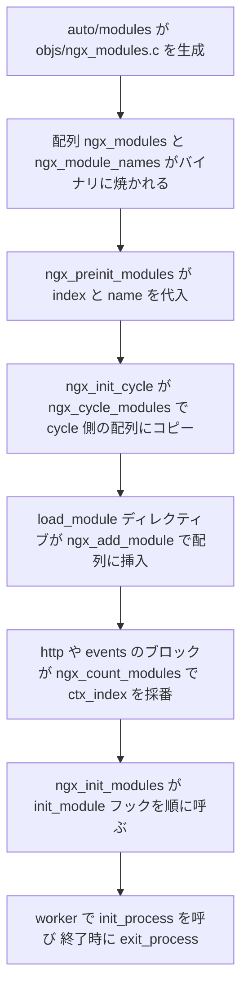

## この層の責務

Nginx のほぼ全部の機能はモジュールとして書かれている。HTTP プロトコルの実装も、epoll の呼び出しも、gzip 圧縮も、設定ファイルの `include` ディレクティブも、全部モジュールだ。コアに残っているのはメモリプール、文字列、赤黒木、配列といった土台と、モジュールを並べて順に呼ぶループだけになっている。

そのモジュールが 6 種類ある。

| `type` の値             | マクロ              | 何をするモジュールか                                                             |
| ----------------------- | ------------------- | -------------------------------------------------------------------------------- |
| `0x45524F43` (`"CORE"`) | `NGX_CORE_MODULE`   | `main` コンテキストのディレクティブを持つ。`http {}` や `events {}` の入口もこれ |
| `0x464E4F43` (`"CONF"`) | `NGX_CONF_MODULE`   | `include` だけ。どのコンテキストでも使える特別扱い                               |
| `0x544E5645` (`"EVNT"`) | `NGX_EVENT_MODULE`  | epoll / kqueue / select などのイベント機構                                       |
| `0x50545448` (`"HTTP"`) | `NGX_HTTP_MODULE`   | `http {}` の中で効く。数のうえでは大半がこれ                                     |
| `0x4C49414D` (`"MAIL"`) | `NGX_MAIL_MODULE`   | `mail {}` の中で効く                                                             |
| `0x4d525453` (`"STRM"`) | `NGX_STREAM_MODULE` | `stream {}` の中で効く                                                           |

この 6 種類は、要求されるものがまるで違う。イベントモジュールは `add` / `del` / `process_events` といった関数ポインタの表を要求される。HTTP モジュールは設定構造体を 3 階層ぶん作る関数を要求される。core モジュールは 2 本の関数しか要らない。

にもかかわらず、これらは全部 `ngx_module_t` という **1 つの構造体**で表される。違いは `type` に入る 4 バイトの定数と、`void *ctx` の指す先の型だけだ。

この層の責務は 3 つある。

- モジュールの配列 `ngx_modules[]` を持ち、コアの各所から「全モジュールを順に舐める」ループを回せるようにすること
- 各モジュールに 2 種類の番号 (`index` と `ctx_index`) を振り、設定構造体の配列添字として使えるようにすること
- プロセスのライフサイクル (master 起動、reload、worker 起動、worker 終了、master 終了) の各点で、モジュールが用意したフックを呼ぶこと

## 主要な型とその関係

### `ngx_module_t` の全フィールド

[`src/core/ngx_module.h#L227-L262`](https://github.com/nginx/nginx/blob/release-1.31.4/src/core/ngx_module.h#L227-L262)。

```c title="src/core/ngx_module.h"
struct ngx_module_s {
    ngx_uint_t            ctx_index;
    ngx_uint_t            index;

    char                 *name;

    ngx_uint_t            spare0;
    ngx_uint_t            spare1;

    ngx_uint_t            version;
    const char           *signature;

    void                 *ctx;
    ngx_command_t        *commands;
    ngx_uint_t            type;

    ngx_int_t           (*init_master)(ngx_log_t *log);

    ngx_int_t           (*init_module)(ngx_cycle_t *cycle);

    ngx_int_t           (*init_process)(ngx_cycle_t *cycle);
    ngx_int_t           (*init_thread)(ngx_cycle_t *cycle);
    void                (*exit_thread)(ngx_cycle_t *cycle);
    void                (*exit_process)(ngx_cycle_t *cycle);

    void                (*exit_master)(ngx_cycle_t *cycle);

    uintptr_t             spare_hook0;
    uintptr_t             spare_hook1;
    uintptr_t             spare_hook2;
    uintptr_t             spare_hook3;
    uintptr_t             spare_hook4;
    uintptr_t             spare_hook5;
    uintptr_t             spare_hook6;
    uintptr_t             spare_hook7;
};
```

役割ごとに 4 つに分けられる。

**識別と番号。** `ctx_index` は「同じ `type` のモジュールの中で何番目か」、`index` は「全モジュールを通して何番目か」。`name` はモジュール名の文字列で、ソース中には書かれておらず、ビルド時に生成される別の配列から `ngx_preinit_modules()` が代入する。

**互換性の検査。** `version` はコンパイル時の `nginx_version` (1.31.4 なら `1031004`)。`signature` はビルドオプションを並べた文字列。どちらも動的モジュールのロード時だけ見られる。

**中身。** `ctx` がモジュール種別ごとのコールバック表、`commands` が設定ディレクティブの表、`type` がこの 2 つをどう解釈するかを決める識別子。

**ライフサイクルフック 7 本。** `init_master` / `init_module` / `init_process` / `init_thread` / `exit_thread` / `exit_process` / `exit_master`。

`spare0` / `spare1` / `spare_hook0` 〜 `spare_hook7` は予約枠だ。構造体レイアウトは動的モジュールとの ABI そのものなので、後から末尾にフィールドを足すと既存のバイナリが壊れる。あらかじめ空きを開けておき、拡張するときはこの枠を使う。

### `NGX_MODULE_V1` が埋める 7 つの値

モジュール定義はどれも `NGX_MODULE_V1` で始まり `NGX_MODULE_V1_PADDING` で終わる。[`#L220-L224`](https://github.com/nginx/nginx/blob/release-1.31.4/src/core/ngx_module.h#L220-L224)。

```c title="src/core/ngx_module.h"
#define NGX_MODULE_V1                                                         \
    NGX_MODULE_UNSET_INDEX, NGX_MODULE_UNSET_INDEX,                           \
    NULL, 0, 0, nginx_version, NGX_MODULE_SIGNATURE

#define NGX_MODULE_V1_PADDING  0, 0, 0, 0, 0, 0, 0, 0
```

前から順に `ctx_index`, `index`, `name`, `spare0`, `spare1`, `version`, `signature` の 7 つ。`NGX_MODULE_UNSET_INDEX` は [`#L18`](https://github.com/nginx/nginx/blob/release-1.31.4/src/core/ngx_module.h#L18) で `(ngx_uint_t) -1` と定義されている。番号はまだ振られていない、という初期状態だ。`NGX_MODULE_V1_PADDING` の 8 個のゼロは `spare_hook0` 〜 `spare_hook7` を埋める。

この 2 つのマクロに挟まれた形が、あらゆるモジュールの定義に現れる。[`src/core/nginx.c#L167-L180`](https://github.com/nginx/nginx/blob/release-1.31.4/src/core/nginx.c#L167-L180) の core モジュール本体。

```c title="src/core/nginx.c"
ngx_module_t  ngx_core_module = {
    NGX_MODULE_V1,
    &ngx_core_module_ctx,                  /* module context */
    ngx_core_commands,                     /* module directives */
    NGX_CORE_MODULE,                       /* module type */
    NULL,                                  /* init master */
    NULL,                                  /* init module */
    NULL,                                  /* init process */
    NULL,                                  /* init thread */
    NULL,                                  /* exit thread */
    NULL,                                  /* exit process */
    NULL,                                  /* exit master */
    NGX_MODULE_V1_PADDING
};
```

**マクロで囲まれた 3 行と 7 行のフックだけが、モジュールごとに変わる部分だ。** 6 種類のモジュールが同じ形をしているので、`ngx_modules[]` は素直に `ngx_module_t *` の配列になり、コアはどの要素も同じように扱える。

### `ctx` は `void *` で、`type` によって指す先の型が変わる

`ngx_module_t` に `type` ごとの union は無い。あるのは `void *ctx` 1 本だけで、コアは `type` を見てからキャストする。

```c title="src/http/ngx_http.c (ngx_http_block の一部)"
    for (m = 0; cf->cycle->modules[m]; m++) {
        if (cf->cycle->modules[m]->type != NGX_HTTP_MODULE) {
            continue;
        }

        module = cf->cycle->modules[m]->ctx;   /* ngx_http_module_t * にキャスト */
```

`type` が一致した要素だけを拾い、`ngx_http_module_t *` として読む。型検査はコンパイラではなく、`type` の比較 1 行が担っている。

指す先の型を 4 つ並べると、要求されるフックの数と役割がまったく違うことが分かる。

core モジュール ([`src/core/ngx_module.h#L265-L269`](https://github.com/nginx/nginx/blob/release-1.31.4/src/core/ngx_module.h#L265-L269))。

```c title="src/core/ngx_module.h"
typedef struct {
    ngx_str_t             name;
    void               *(*create_conf)(ngx_cycle_t *cycle);
    char               *(*init_conf)(ngx_cycle_t *cycle, void *conf);
} ngx_core_module_t;
```

関数は 2 本。`create_conf` で設定構造体を確保し、パースが終わってから `init_conf` で既定値を埋める。継承もマージも無い。core モジュールの設定は 1 階層しかないからだ。

イベントモジュール ([`src/event/ngx_event.h#L446-L453`](https://github.com/nginx/nginx/blob/release-1.31.4/src/event/ngx_event.h#L446-L453))。

```c title="src/event/ngx_event.h"
typedef struct {
    ngx_str_t              *name;

    void                 *(*create_conf)(ngx_cycle_t *cycle);
    char                 *(*init_conf)(ngx_cycle_t *cycle, void *conf);

    ngx_event_actions_t     actions;
} ngx_event_module_t;
```

前半は core モジュールと同じ形で、末尾に `ngx_event_actions_t` が丸ごと埋め込まれている。これは epoll / kqueue / select を差し替えるための関数ポインタの表だ ([`src/event/modules/ngx_epoll_module.c#L179-L200`](https://github.com/nginx/nginx/blob/release-1.31.4/src/event/modules/ngx_epoll_module.c#L179-L200))。

```c title="src/event/modules/ngx_epoll_module.c"
static ngx_event_module_t  ngx_epoll_module_ctx = {
    &epoll_name,
    ngx_epoll_create_conf,               /* create configuration */
    ngx_epoll_init_conf,                 /* init configuration */

    {
        ngx_epoll_add_event,             /* add an event */
        ngx_epoll_del_event,             /* delete an event */
        ngx_epoll_add_event,             /* enable an event */
        ngx_epoll_del_event,             /* disable an event */
        ngx_epoll_add_connection,        /* add an connection */
        ngx_epoll_del_connection,        /* delete an connection */
#if (NGX_HAVE_EVENTFD)
        ngx_epoll_notify,                /* trigger a notify */
#else
        NULL,                            /* trigger a notify */
#endif
        ngx_epoll_process_events,        /* process the events */
        ngx_epoll_init,                  /* init the events */
        ngx_epoll_done,                  /* done the events */
    }
};
```

ポインタ表そのものの設計は [event-methods](../event-methods/) が扱う。

HTTP モジュール ([`src/http/ngx_http_config.h#L24-L36`](https://github.com/nginx/nginx/blob/release-1.31.4/src/http/ngx_http_config.h#L24-L36))。

```c title="src/http/ngx_http_config.h"
typedef struct {
    ngx_int_t   (*preconfiguration)(ngx_conf_t *cf);
    ngx_int_t   (*postconfiguration)(ngx_conf_t *cf);

    void       *(*create_main_conf)(ngx_conf_t *cf);
    char       *(*init_main_conf)(ngx_conf_t *cf, void *conf);

    void       *(*create_srv_conf)(ngx_conf_t *cf);
    char       *(*merge_srv_conf)(ngx_conf_t *cf, void *prev, void *conf);

    void       *(*create_loc_conf)(ngx_conf_t *cf);
    char       *(*merge_loc_conf)(ngx_conf_t *cf, void *prev, void *conf);
} ngx_http_module_t;
```

8 本ある。数が多いのは、HTTP の設定が `http {}` / `server {}` / `location {}` の 3 階層になっているからだ。

- `preconfiguration` — `http {}` の中身を読む**前**。変数の名前を登録する場所として使われる ([variables](../variables/))
- `postconfiguration` — 全部読んでマージも終わった**後**。フェーズハンドラの登録と、出力フィルタチェーンへの割り込みがここで行われる
- `create_main_conf` / `init_main_conf` — `http {}` に 1 個だけできる構造体。マージ相手がいないので `merge` ではなく `init`
- `create_srv_conf` / `merge_srv_conf` — `server {}` ごと
- `create_loc_conf` / `merge_loc_conf` — `location {}` ごと。入れ子の深さぶん作られる

3 階層ぶんの構造体が実際にどう作られてどうマージされるかは [conf-merge](../conf-merge/) の主題になる。

stream モジュール ([`src/stream/ngx_stream.h#L302-L312`](https://github.com/nginx/nginx/blob/release-1.31.4/src/stream/ngx_stream.h#L302-L312)) は HTTP の 8 本から `loc` の 2 本を落として 6 本になっている。

```c title="src/stream/ngx_stream.h"
typedef struct {
    ngx_int_t                    (*preconfiguration)(ngx_conf_t *cf);
    ngx_int_t                    (*postconfiguration)(ngx_conf_t *cf);

    void                        *(*create_main_conf)(ngx_conf_t *cf);
    char                        *(*init_main_conf)(ngx_conf_t *cf, void *conf);

    void                        *(*create_srv_conf)(ngx_conf_t *cf);
    char                        *(*merge_srv_conf)(ngx_conf_t *cf, void *prev,
                                                   void *conf);
} ngx_stream_module_t;
```

`location {}` に相当するものが無い。TCP/UDP のプロキシには URI が無く、`server {}` より細かい単位で設定を切る理由がない。何を削って作られたかは [stream-module](../stream-module/) を参照。

mail モジュール ([`src/mail/ngx_mail.h#L343-L352`](https://github.com/nginx/nginx/blob/release-1.31.4/src/mail/ngx_mail.h#L343-L352)) はさらに違う。

```c title="src/mail/ngx_mail.h"
typedef struct {
    ngx_mail_protocol_t        *protocol;

    void                       *(*create_main_conf)(ngx_conf_t *cf);
    char                       *(*init_main_conf)(ngx_conf_t *cf, void *conf);

    void                       *(*create_srv_conf)(ngx_conf_t *cf);
    char                       *(*merge_srv_conf)(ngx_conf_t *cf, void *prev,
                                                  void *conf);
} ngx_mail_module_t;
```

`preconfiguration` / `postconfiguration` が無い代わりに、先頭に `ngx_mail_protocol_t *protocol` がある。POP3 / IMAP / SMTP のどれを喋るモジュールかをここで宣言する。

`ctx` を `void *` にしたことで、**共通の構造体は 1 つに保ったまま、種別ごとに必要なフックの数と形を自由に決められる**。1 つの `union` にしていたら、新しい種別を足すたびにコアのヘッダを書き換えることになる。

### `signature` が突き合わせているもの

`NGX_MODULE_SIGNATURE` は、ビルド時に決まった条件を 1 文字ずつ並べた文字列を作るマクロだ。[`src/core/ngx_module.h#L21-L24`](https://github.com/nginx/nginx/blob/release-1.31.4/src/core/ngx_module.h#L21-L24) が先頭。

```c title="src/core/ngx_module.h"
#define NGX_MODULE_SIGNATURE_0                                                \
    ngx_value(NGX_PTR_SIZE) ","                                               \
    ngx_value(NGX_SIG_ATOMIC_T_SIZE) ","                                      \
    ngx_value(NGX_TIME_T_SIZE) ","
```

ポインタのサイズ、`sig_atomic_t` のサイズ、`time_t` のサイズ。ここが違うと構造体のレイアウトそのものがずれる。

続く `NGX_MODULE_SIGNATURE_1` から `_34` は、`#if` で `"1"` か `"0"` を選ぶだけの定義が 34 個並ぶ。

```c title="src/core/ngx_module.h"
#if (NGX_HAVE_EPOLL)
#define NGX_MODULE_SIGNATURE_6   "1"
#else
#define NGX_MODULE_SIGNATURE_6   "0"
#endif
```

含まれるのは `NGX_HAVE_KQUEUE`, `NGX_HAVE_IOCP`, `NGX_HAVE_FILE_AIO`, `NGX_HAVE_SENDFILE_NODISKIO`, `NGX_HAVE_EVENTFD`, `NGX_HAVE_EPOLL`, `NGX_HAVE_INET6`, `NGX_HAVE_TCP_FASTOPEN`, `NGX_QUIC`, `NGX_THREADS`, `NGX_PCRE`, `NGX_HTTP_SSL`, `NGX_HTTP_GZIP`, `NGX_HTTP_CACHE`, `NGX_COMPAT` など。全部を連結したものが [`#L205-L217`](https://github.com/nginx/nginx/blob/release-1.31.4/src/core/ngx_module.h#L205-L217) の `NGX_MODULE_SIGNATURE` になる。

これらのマクロは、`ngx_event_t` や `ngx_connection_t` や `ngx_http_request_t` のフィールドを `#if` で出し入れする。たとえば `NGX_HTTP_SSL` が無いビルドでは `ngx_connection_t` から SSL 関連のフィールドが消える。**同じヘッダから同じ構造体名をコンパイルしても、ビルドオプションが違えばメモリレイアウトが違う。** ここでリンクを間違えると、動的モジュールが隣のフィールドを読み書きするバイナリができあがる。しかもリンカは何も言わない。

そこで、条件の並びを文字列にしてバイナリに埋め込み、ロード時に `ngx_strcmp` で比較する ([`src/core/ngx_module.c#L170-L182`](https://github.com/nginx/nginx/blob/release-1.31.4/src/core/ngx_module.c#L170-L182))。

```c title="src/core/ngx_module.c"
    if (module->version != nginx_version) {
        ngx_conf_log_error(NGX_LOG_EMERG, cf, 0,
                           "module \"%V\" version %ui instead of %ui",
                           file, module->version, (ngx_uint_t) nginx_version);
        return NGX_ERROR;
    }

    if (ngx_strcmp(module->signature, NGX_MODULE_SIGNATURE) != 0) {
        ngx_conf_log_error(NGX_LOG_EMERG, cf, 0,
                           "module \"%V\" is not binary compatible",
                           file);
        return NGX_ERROR;
    }
```

`--with-compat` を付けてビルドすると `NGX_COMPAT` が立ち、`NGX_MODULE_SIGNATURE_34` が `"1"` になると同時に、`NGX_HTTP_GZIP` や `NGX_HTTP_CACHE` など互換性に影響するマクロも一律で `1` に揃えられる。署名を意図的に一致させるためのビルドモードだ。

## 処理の流れ

モジュール配列は 3 段階を経る。ビルド時に静的な配列が生成され、プロセス起動時に番号が振られ、cycle ごとにコピーされる。



### ビルド時: `objs/ngx_modules.c` が生成される

`configure` が動くと、`auto/modules` が有効なモジュールの名前を `$modules` に積み上げていき、最後に C のソースを 1 本吐く。[`auto/modules#L1553-L1592`](https://github.com/nginx/nginx/blob/release-1.31.4/auto/modules#L1553-L1592)。出力先の `$NGX_MODULES_C` は [`auto/init#L7`](https://github.com/nginx/nginx/blob/release-1.31.4/auto/init#L7) で `$NGX_OBJS/ngx_modules.c` と定義されている。

```sh title="auto/modules"
for mod in $modules
do
    echo "extern ngx_module_t  $mod;"         >> $NGX_MODULES_C
done

echo                                          >> $NGX_MODULES_C
echo 'ngx_module_t *ngx_modules[] = {'        >> $NGX_MODULES_C

for mod in $modules
do
    echo "    &$mod,"                         >> $NGX_MODULES_C
done

cat << END                                    >> $NGX_MODULES_C
    NULL
};

END

echo 'char *ngx_module_names[] = {'           >> $NGX_MODULES_C

for mod in $modules
do
    echo "    \"$mod\","                      >> $NGX_MODULES_C
done
```

同じリストが 2 周される。1 周目が `ngx_module_t *` の配列、2 周目が名前の文字列配列。**同じ添字で引けば、モジュール本体とその名前が対応する。**

名前を構造体の中に書かず別の配列にしたのは、`ngx_module_t` の初期化子をマクロで固定できるようにするためだ。`NGX_MODULE_V1` には `name` の位置に `NULL` が入っている。もしここにモジュール名を書かせるなら、マクロを 1 引数取る形にするか、モジュールごとに手で並べることになる。

配列の終端は `NULL`。だからコアの走査ループは全部 `for (i = 0; cycle->modules[i]; i++)` の形になり、要素数を持ち回らずに済む。

`$modules` に積まれる順序が、そのまま配列の順序になる。HTTP のフィルタモジュールについては、`auto/modules` に順序が明示的に書かれている ([`auto/modules#L145-L176`](https://github.com/nginx/nginx/blob/release-1.31.4/auto/modules#L145-L176))。

```sh title="auto/modules"
    ngx_module_type=HTTP_FILTER
    HTTP_FILTER_MODULES=

    ngx_module_order="ngx_http_static_module \
                      ngx_http_gzip_static_module \
                      ...
                      ngx_http_write_filter_module \
                      ngx_http_header_filter_module \
                      ngx_http_chunked_filter_module \
                      ngx_http_v2_filter_module \
                      ngx_http_v3_filter_module \
                      ngx_http_range_header_filter_module \
                      ngx_http_gzip_filter_module \
                      ngx_http_postpone_filter_module \
                      ...
                      ngx_http_copy_filter_module \
                      ngx_http_range_body_filter_module \
                      ngx_http_not_modified_filter_module \
                      ngx_http_slice_filter_module"
```

この並びが実行順を決める。各フィルタは `postconfiguration` でチェーンの先頭に自分を差し込むからだ ([`src/http/modules/ngx_http_gzip_filter_module.c#L1127-L1137`](https://github.com/nginx/nginx/blob/release-1.31.4/src/http/modules/ngx_http_gzip_filter_module.c#L1127-L1137))。

```c title="src/http/modules/ngx_http_gzip_filter_module.c"
static ngx_int_t
ngx_http_gzip_filter_init(ngx_conf_t *cf)
{
    ngx_http_next_header_filter = ngx_http_top_header_filter;
    ngx_http_top_header_filter = ngx_http_gzip_header_filter;

    ngx_http_next_body_filter = ngx_http_top_body_filter;
    ngx_http_top_body_filter = ngx_http_gzip_body_filter;

    return NGX_OK;
}
```

`postconfiguration` は `cycle->modules` の順に呼ばれ、呼ばれた側は毎回先頭に割り込む。つまり **配列で後ろにいるモジュールほど、フィルタチェーンでは前に来る**。リストの先頭にある `ngx_http_write_filter_module` は、[`src/http/ngx_http_write_filter_module.c#L365-L371`](https://github.com/nginx/nginx/blob/release-1.31.4/src/http/ngx_http_write_filter_module.c#L365-L371) で `next` を保存せずに代入するので、必ずチェーンの末尾になる。

```c title="src/http/ngx_http_write_filter_module.c"
static ngx_int_t
ngx_http_write_filter_init(ngx_conf_t *cf)
{
    ngx_http_top_body_filter = ngx_http_write_filter;

    return NGX_OK;
}
```

チェーンの組み方と実行の詳細は [output-filter-chain](../output-filter-chain/) で扱う。ここで押さえるのは、**フィルタの順序という実行時の性質が、`configure` スクリプトの中のシェル変数で決まっている**ことだ。

### `ngx_preinit_modules()` — `index` と `name` を配る

`main()` が最初に呼ぶモジュール関連の関数がこれだ ([`src/core/nginx.c#L289`](https://github.com/nginx/nginx/blob/release-1.31.4/src/core/nginx.c#L289))。実装は [`src/core/ngx_module.c#L25-L39`](https://github.com/nginx/nginx/blob/release-1.31.4/src/core/ngx_module.c#L25-L39)。

```c title="src/core/ngx_module.c"
ngx_int_t
ngx_preinit_modules(void)
{
    ngx_uint_t  i;

    for (i = 0; ngx_modules[i]; i++) {
        ngx_modules[i]->index = i;
        ngx_modules[i]->name = ngx_module_names[i];
    }

    ngx_modules_n = i;
    ngx_max_module = ngx_modules_n + NGX_MAX_DYNAMIC_MODULES;

    return NGX_OK;
}
```

静的モジュールの `index` は配列の添字そのもの。名前も同じ添字で引いて代入する。

`ngx_max_module` は静的モジュールの数に `NGX_MAX_DYNAMIC_MODULES` を足したもので、この定数は [`src/core/ngx_module.c#L13`](https://github.com/nginx/nginx/blob/release-1.31.4/src/core/ngx_module.c#L13) で `128` に固定されている。動的モジュールを何個読み込むかは設定ファイルを読むまで分からないが、`cycle->conf_ctx` と `cycle->modules` は設定ファイルを読む**前**に確保しなければならない。そこで上限を決め打ちして先に配列を取る。

### `ngx_cycle_modules()` — cycle ごとに配列をコピーする

`ngx_init_cycle()` は `cycle->conf_ctx` を `ngx_max_module` 個ぶん確保した直後に、モジュール配列をコピーする ([`src/core/ngx_cycle.c#L227`](https://github.com/nginx/nginx/blob/release-1.31.4/src/core/ngx_cycle.c#L227))。実体は [`src/core/ngx_module.c#L42-L62`](https://github.com/nginx/nginx/blob/release-1.31.4/src/core/ngx_module.c#L42-L62)。

```c title="src/core/ngx_module.c"
ngx_int_t
ngx_cycle_modules(ngx_cycle_t *cycle)
{
    /*
     * create a list of modules to be used for this cycle,
     * copy static modules to it
     */

    cycle->modules = ngx_pcalloc(cycle->pool, (ngx_max_module + 1)
                                              * sizeof(ngx_module_t *));
    if (cycle->modules == NULL) {
        return NGX_ERROR;
    }

    ngx_memcpy(cycle->modules, ngx_modules,
               ngx_modules_n * sizeof(ngx_module_t *));

    cycle->modules_n = ngx_modules_n;

    return NGX_OK;
}
```

グローバルの `ngx_modules[]` をそのまま使わず、cycle のプールに `ngx_max_module + 1` 個の配列を取って静的モジュールぶんだけコピーする。残りは `ngx_pcalloc` によってゼロ、つまり `NULL` 終端になっている。この空き枠に、あとで `load_module` が読んだモジュールが入る。

コピーする理由は **リロードのたびにモジュールの顔ぶれが変わりうる**からだ。`nginx.conf` から `load_module` を 1 行消して `SIGHUP` を送ると、新しい cycle のモジュール配列にはそのモジュールがいない。一方で古い cycle のワーカーはまだ走っていて、古い配列を舐めている。1 本のグローバル配列を書き換える方式だと、この 2 つが両立しない。

`ngx_cycle_t` 側は 3 フィールドを持つ ([`src/core/ngx_cycle.h#L52-L54`](https://github.com/nginx/nginx/blob/release-1.31.4/src/core/ngx_cycle.h#L52-L54))。

```c title="src/core/ngx_cycle.h"
    ngx_module_t            **modules;
    ngx_uint_t                modules_n;
    ngx_uint_t                modules_used;    /* unsigned  modules_used:1; */
```

`modules_used` は「もう `ctx_index` を配ってしまった」というフラグで、後述する。

### `index` と `ctx_index` の違い

`index` は全モジュール通しの番号で、`cycle->conf_ctx` の添字になる。core モジュールの設定はこれで引く ([`src/core/ngx_conf_file.h#L176`](https://github.com/nginx/nginx/blob/release-1.31.4/src/core/ngx_conf_file.h#L176))。

```c title="src/core/ngx_conf_file.h"
#define ngx_get_conf(conf_ctx, module)  conf_ctx[module.index]
```

`ctx_index` は同じ `type` の中での通し番号で、その種別の設定配列の添字になる ([`src/http/ngx_http_config.h#L55-L58`](https://github.com/nginx/nginx/blob/release-1.31.4/src/http/ngx_http_config.h#L55-L58))。

```c title="src/http/ngx_http_config.h"
#define ngx_http_get_module_main_conf(r, module)                             \
    (r)->main_conf[module.ctx_index]
#define ngx_http_get_module_srv_conf(r, module)  (r)->srv_conf[module.ctx_index]
#define ngx_http_get_module_loc_conf(r, module)  (r)->loc_conf[module.ctx_index]
```

`r->loc_conf` は HTTP モジュールぶんしか要素を持たない配列だ。ここに `index` を使ったら、event モジュールや mail モジュールのぶんまで穴の空いた配列を `location {}` の数だけ確保することになる。`ctx_index` を別に振ることで、**設定構造体の配列が、その種別のモジュール数ちょうどの長さで済む**。

`location {}` は設定に何百個も書かれうる。1 個あたり配列 1 本なので、この差はそのまま起動時のメモリに効く。

採番は [`src/core/ngx_module.c#L82-L153`](https://github.com/nginx/nginx/blob/release-1.31.4/src/core/ngx_module.c#L82-L153) の `ngx_count_modules()` が行う。

```c title="src/core/ngx_module.c"
ngx_int_t
ngx_count_modules(ngx_cycle_t *cycle, ngx_uint_t type)
{
    ngx_uint_t     i, next, max;
    ngx_module_t  *module;

    next = 0;
    max = 0;

    /* count appropriate modules, set up their indices */

    for (i = 0; cycle->modules[i]; i++) {
        module = cycle->modules[i];

        if (module->type != type) {
            continue;
        }

        if (module->ctx_index != NGX_MODULE_UNSET_INDEX) {

            /* if ctx_index was assigned, preserve it */

            if (module->ctx_index > max) {
                max = module->ctx_index;
            }

            if (module->ctx_index == next) {
                next++;
            }

            continue;
        }

        /* search for some free index */

        module->ctx_index = ngx_module_ctx_index(cycle, type, next);

        if (module->ctx_index > max) {
            max = module->ctx_index;
        }

        next = module->ctx_index + 1;
    }

    /* ... 旧 cycle の最大値も見る ... */

    /* prevent loading of additional modules */

    cycle->modules_used = 1;

    return max + 1;
}
```

3 つ特徴がある。

**既に `ctx_index` が入っているモジュールは触らない。** `ngx_module_t` は静的変数なので、リロードしても値が残る。前の cycle で 7 番だったモジュールは 7 番のままにする。

**旧 cycle のモジュールも走査して `max` を更新する。** コメントが理由を書いている。

```c title="src/core/ngx_module.c"
    /*
     * make sure the number returned is big enough for previous
     * cycle as well, else there will be problems if the number
     * will be stored in a global variable (as it's used to be)
     * and we'll have to roll back to the previous cycle
     */
```

リロードに失敗して旧 cycle に巻き戻したとき、旧 cycle のモジュールが持つ `ctx_index` が新しい配列長を超えていると配列外アクセスになる。だから返す長さは両方をカバーする。

**最後に `cycle->modules_used = 1` を立てる。** ここから先はモジュールを追加できない。

戻り値は `max + 1`、つまり配列の必要な長さだ。`http {}` の入口はこれを最初に呼ぶ ([`src/http/ngx_http.c#L150`](https://github.com/nginx/nginx/blob/release-1.31.4/src/http/ngx_http.c#L150))。

```c title="src/http/ngx_http.c"
    /* count the number of the http modules and set up their indices */

    ngx_http_max_module = ngx_count_modules(cf->cycle, NGX_HTTP_MODULE);
```

`events {}` の入口も同じ形をしている ([`src/event/ngx_event.c#L1001`](https://github.com/nginx/nginx/blob/release-1.31.4/src/event/ngx_event.c#L1001))。

```c title="src/event/ngx_event.c"
    /* count the number of the event modules and set up their indices */

    ngx_event_max_module = ngx_count_modules(cf->cycle, NGX_EVENT_MODULE);
```

### ライフサイクルフックが呼ばれる場所

7 本のフックのうち、実際に呼び出しコードがあるのは 4 本だけだ。

`init_module` は [`src/core/ngx_module.c#L65-L79`](https://github.com/nginx/nginx/blob/release-1.31.4/src/core/ngx_module.c#L65-L79) の `ngx_init_modules()` から。

```c title="src/core/ngx_module.c"
ngx_int_t
ngx_init_modules(ngx_cycle_t *cycle)
{
    ngx_uint_t  i;

    for (i = 0; cycle->modules[i]; i++) {
        if (cycle->modules[i]->init_module) {
            if (cycle->modules[i]->init_module(cycle) != NGX_OK) {
                return NGX_ERROR;
            }
        }
    }

    return NGX_OK;
}
```

呼び出し元は `ngx_init_cycle()` の終盤 ([`src/core/ngx_cycle.c#L649`](https://github.com/nginx/nginx/blob/release-1.31.4/src/core/ngx_cycle.c#L649))。設定を読み終わり、共有メモリを確保し、listen ソケットを開いた後だ。fork の前なので、ここでの処理は master と全ワーカーで共有される。リロードのたびに走る。

`init_process` は worker が fork された直後 ([`src/os/unix/ngx_process_cycle.c#L891-L898`](https://github.com/nginx/nginx/blob/release-1.31.4/src/os/unix/ngx_process_cycle.c#L891-L898))。

```c title="src/os/unix/ngx_process_cycle.c"
    for (i = 0; cycle->modules[i]; i++) {
        if (cycle->modules[i]->init_process) {
            if (cycle->modules[i]->init_process(cycle) == NGX_ERROR) {
                /* fatal */
                exit(2);
            }
        }
    }
```

失敗したら `exit(2)`。ワーカーの初期化に失敗したまま走らせる道は用意されていない。イベントモジュールが epoll の fd を作り、接続配列を確保するのもここだ。**fork 後に呼ばれるので、プロセスごとに別々の fd とメモリになる。**

`exit_process` は worker の終了処理 ([`#L945-L949`](https://github.com/nginx/nginx/blob/release-1.31.4/src/os/unix/ngx_process_cycle.c#L945-L949))、`exit_master` は master が終わる直前 ([`#L664-L668`](https://github.com/nginx/nginx/blob/release-1.31.4/src/os/unix/ngx_process_cycle.c#L664-L668))。

残る `init_master` / `init_thread` / `exit_thread` の 3 本には、1.31.4 の `src/` 全体を通して呼び出し側が存在しない。宣言だけがあって、誰も呼ばない。

```console
$ git grep -n "init_master(" release-1.31.4 -- src/
(何も出ない)
```

`ngx_module_t` は動的モジュールとの ABI なので、使われないフックを削るとレイアウトが変わる。`spare_hook0` 〜 `7` と同じで、**残しておくコストのほうが、消して互換性を切るコストより安い**という判断になっている。マスタープロセスとワーカーの分担は [master-worker](../master-worker/)、ワーカーが起動後に何をするかは [state-machine](../state-machine/) を参照。

### 動的モジュール: `ngx_load_module`

`load_module` ディレクティブの実装は [`src/core/nginx.c#L1581-L1660`](https://github.com/nginx/nginx/blob/release-1.31.4/src/core/nginx.c#L1581-L1660) にある。

```c title="src/core/nginx.c"
static char *
ngx_load_module(ngx_conf_t *cf, ngx_command_t *cmd, void *conf)
{
#if (NGX_HAVE_DLOPEN)
    /* ... */

    if (cf->cycle->modules_used) {
        return "is specified too late";
    }

    value = cf->args->elts;
    file = value[1];

    if (ngx_conf_full_name(cf->cycle, &file, 0) != NGX_OK) {
        return NGX_CONF_ERROR;
    }

    cln = ngx_pool_cleanup_add(cf->cycle->pool, 0);
    if (cln == NULL) {
        return NGX_CONF_ERROR;
    }

    handle = ngx_dlopen(file.data);
    if (handle == NULL) {
        ngx_conf_log_error(NGX_LOG_EMERG, cf, 0,
                           ngx_dlopen_n " \"%s\" failed (%s)",
                           file.data, ngx_dlerror());
        return NGX_CONF_ERROR;
    }

    cln->handler = ngx_unload_module;
    cln->data = handle;

    modules = ngx_dlsym(handle, "ngx_modules");
    /* ... */
    names = ngx_dlsym(handle, "ngx_module_names");
    /* ... */
    order = ngx_dlsym(handle, "ngx_module_order");

    for (i = 0; modules[i]; i++) {
        module = modules[i];
        module->name = names[i];

        if (ngx_add_module(cf, &file, module, order) != NGX_OK) {
            return NGX_CONF_ERROR;
        }
        /* ... */
    }

    return NGX_CONF_OK;
```

`dlopen` した後にやることが 4 つある。

1. **`modules_used` を見て、遅すぎないか確かめる。** `http {}` の中で `ngx_count_modules()` が走った後に HTTP モジュールを足しても、`ctx_index` が振られず設定配列にも入らない。だから `"is specified too late"` で断る
2. **プールのクリーンアップに `dlclose` を登録する。** cycle のプールが壊されるとき、[`src/core/nginx.c#L1665-L1674`](https://github.com/nginx/nginx/blob/release-1.31.4/src/core/nginx.c#L1665-L1674) の `ngx_unload_module()` が `.so` を閉じる。cycle とライブラリの寿命が揃う
3. **`ngx_dlsym` で 3 つのシンボルを引く。** `ngx_modules`, `ngx_module_names`, `ngx_module_order`。この 3 本は、静的ビルドで `objs/ngx_modules.c` に生成されるものとまったく同じ名前だ。動的モジュールをビルドすると、そのモジュールだけを含む同名の配列が `.so` の中に作られる ([`auto/make#L512-L564`](https://github.com/nginx/nginx/blob/release-1.31.4/auto/make#L512-L564))
4. **1 個ずつ `ngx_add_module()` に渡す。** 名前を代入してから

`ngx_add_module()` ([`src/core/ngx_module.c#L156-L276`](https://github.com/nginx/nginx/blob/release-1.31.4/src/core/ngx_module.c#L156-L276)) は、`version` と `signature` の検査、同名モジュールの重複検査、`index` の採番、そして挿入位置の決定を行う。挿入位置は `order` 配列で決まる。

```c title="src/core/ngx_module.c"
    before = cf->cycle->modules_n;

    if (order) {
        for (i = 0; order[i]; i++) {
            if (ngx_strcmp(order[i], module->name) == 0) {
                i++;
                break;
            }
        }

        for ( /* void */ ; order[i]; i++) {

            for (m = 0; m < before; m++) {
                if (ngx_strcmp(cf->cycle->modules[m]->name, order[i]) == 0) {
                    before = m;
                    break;
                }
            }
        }
    }

    /* put the module before modules[before] */
```

`order` 配列の中から自分の名前を探し、その**後ろ**に並んでいる名前を既存の配列から探して、最も手前の位置に割り込む。動的なフィルタモジュールの `order` には既定で `ngx_http_copy_filter_module` が入れられるので ([`auto/module#L23-L31`](https://github.com/nginx/nginx/blob/release-1.31.4/auto/module#L23-L31))、copy filter より前に挿入される。結果としてフィルタチェーンでは copy filter より後ろに来る。

配列末尾に単純に追加すると、フィルタチェーンの最前面に出てしまう。**静的ビルドで `auto/modules` の並びが与えていた順序の情報を、動的ロードでも再現するための仕掛けだ。**

最後に、core モジュールだけは特別扱いされる。

```c title="src/core/ngx_module.c"
    if (module->type == NGX_CORE_MODULE) {

        /*
         * we are smart enough to initialize core modules;
         * other modules are expected to be loaded before
         * initialization - e.g., http modules must be loaded
         * before http{} block
         */

        core_module = module->ctx;

        if (core_module->create_conf) {
            rv = core_module->create_conf(cf->cycle);
            if (rv == NULL) {
                return NGX_ERROR;
            }

            cf->cycle->conf_ctx[module->index] = rv;
        }
    }
```

core モジュールの `create_conf` は `ngx_init_cycle()` の序盤で全モジュールぶん一斉に呼ばれてしまっている ([`src/core/ngx_cycle.c#L233-L248`](https://github.com/nginx/nginx/blob/release-1.31.4/src/core/ngx_cycle.c#L233-L248))。設定ファイルを読み始めた後にロードされた core モジュールはその列に間に合わないので、ここで単独で呼ぶ。他の種別は「`http {}` より前にロードしておけ」で済ませている。

## 守られている不変条件

**`ngx_modules[]` と `ngx_module_names[]` は同じ長さで、同じ添字が対応する。** 両方とも `auto/modules` の同じ `$modules` 変数を 2 周して生成される。動的モジュールでも同じ規約で、`ngx_load_module` は `modules[i]` に `names[i]` を代入する。

**モジュール配列は `NULL` 終端である。** だからコアの走査は全部 `for (i = 0; cycle->modules[i]; i++)` で書かれ、長さを引数で渡す必要がない。`ngx_cycle_modules()` が `ngx_pcalloc` でゼロクリアされた配列を取るのは、この終端を維持するためでもある。

**`cycle->modules_n < ngx_max_module` が常に成り立つ。** `ngx_add_module()` の先頭でこれを確かめ、超えていたら `"too many modules loaded"` で落とす。配列長は `ngx_max_module + 1` で確保されているので、`NULL` 終端のぶんが必ず残る。

**`ctx_index` は同じ `type` の中で一意。** `ngx_module_ctx_index()` が、現 cycle と旧 cycle の両方を見て空き番号を探す。旧 cycle まで見るのは、リロード失敗時の巻き戻しで番号が衝突しないようにするためだ。`index` についても `ngx_module_index()` が同じことをしている。

**`modules_used` が立った後、モジュールは増えない。** `ngx_count_modules()` が立て、`ngx_load_module` がそれを見る。この境界があるので、`ctx_index` を振った後に配列が伸びて `ngx_http_max_module` が実際のモジュール数と食い違う、という事態が起きない。

**動的モジュールの `version` と `signature` は、本体のものと完全一致する。** 一致しなければロード時に `"is not binary compatible"` で止まる。この検査を通過することが、`ngx_http_request_t` などの構造体レイアウトが一致していることの根拠になっている。

## つまずきどころ

### `ngx_module_t` はグローバル変数なので、リロードをまたいで値が残る

`ngx_modules[]` の要素はポインタで、指す先はモジュールのソースに書かれた静的変数だ。`cycle->modules` はポインタの配列をコピーするだけで、`ngx_module_t` の実体は複製されない。

つまり、新旧 2 つの cycle が同じ `ngx_module_t` を共有している。`ctx_index` に前回の値が残っているのはそのためで、`ngx_count_modules()` が「既に割り当て済みなら保つ」分岐を持つ理由もそこにある。

**モジュール構造体は設定の一部ではなく、プロセスの一部だ。** リロードで作り直されるのは `cycle` と `conf_ctx` であって、`ngx_module_t` ではない。

### `ctx` の型を間違えても、コンパイラは何も言わない

`ctx` は `void *` なので、`ngx_http_module_t` を書くべきところに `ngx_stream_module_t` を書いてもコンパイルは通る。走るのは `type` が一致したときの分岐なので、`type` を `NGX_HTTP_MODULE` にしたまま stream の ctx を置くと、`create_loc_conf` の位置にあるゴミがそのまま関数として呼ばれる。

nginx 本体のモジュールがすべて `/* preconfiguration */` のようなコメントを律儀に並べているのは、この構造で位置を間違えないための最低限の防護になっている。同じ理由で、フックを `NULL` にする行も省略されない。

### `--with-compat` の有無が動的モジュールの互換性を決める

`signature` に入るのはビルドオプションの一部ではなく、**構造体レイアウトに影響するもの全部**だ。`--with-http_ssl_module` の有無、`--with-threads` の有無、`--with-pcre` の有無が全部効く。

配布バイナリと同じ環境をローカルで再現するのが難しいので、`--with-compat` が用意されている。これを付けると `NGX_COMPAT` が立ち、`NGX_HTTP_GZIP` / `NGX_HTTP_DAV` / `NGX_HTTP_REALIP` / `NGX_HTTP_HEADERS` / `NGX_HTTP_UPSTREAM_ZONE` などがまとめて `1` に固定される ([`auto/modules#L1541-L1550`](https://github.com/nginx/nginx/blob/release-1.31.4/auto/modules#L1541-L1550))。署名に入る値を一律に揃えることで、ビルド構成の細かな差を吸収する。

`"module is not binary compatible"` は、この署名文字列が 1 文字でも違ったときのメッセージだ。どの桁が違うかは表示されない。

### `index` と `ctx_index` を取り違えると、静かに壊れる

どちらも `ngx_uint_t` で、小さいモジュールセットでは値が一致することすらある。`ngx_get_conf(cycle->conf_ctx, ngx_core_module)` は `index`、`ngx_http_get_module_loc_conf(r, ngx_http_gzip_filter_module)` は `ctx_index`。マクロが両方用意されているのは、生の添字を書かせないためだ。

`conf_ctx` は `ngx_max_module` 個ぶん確保されているので、`ctx_index` を渡しても配列外にはならない。読めてしまう。そして中身は無関係なモジュールの設定へのポインタになる。

### 静的ビルドの順序は `auto/modules` の記述順であって、`ngx_module_order` ではない

`ngx_module_order` という変数は `auto/modules` に出てくるが、これが使われるのは**動的モジュールをビルドするときだけ**だ ([`auto/module#L23-L31`](https://github.com/nginx/nginx/blob/release-1.31.4/auto/module#L23-L31) が `${ngx_module}_ORDER` に書き写し、[`auto/make#L553-L558`](https://github.com/nginx/nginx/blob/release-1.31.4/auto/make#L553-L558) が `.so` 側の `ngx_module_order[]` として出力する)。

静的ビルドでは、`$modules` にモジュール名が追記されていく順序がそのまま `ngx_modules[]` の順序になる。フィルタの並びを変えたければ `auto/modules` の記述順を変えることになり、それはビルド構成の変更になる。**実行時にフィルタの順序を入れ替える手段は無い。**
