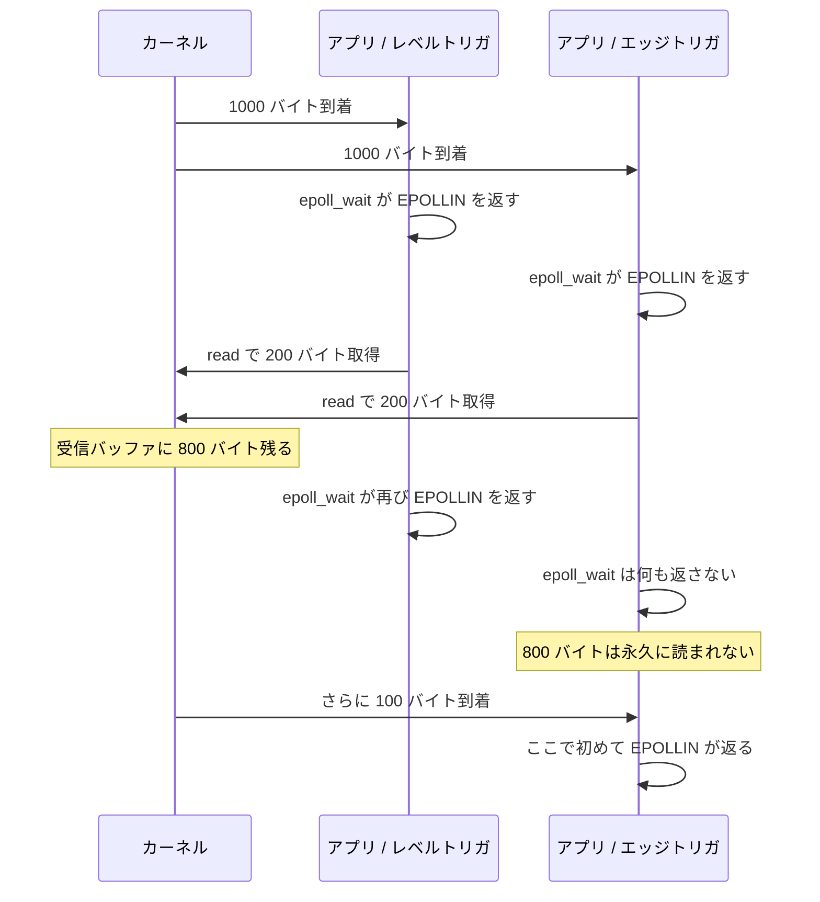

## なぜこれを先に知る必要があるか

[並行モデルのページ](../concurrency-models/) で、イベント駆動のサーバは「待っている接続に実行コンテキストを与えない」ことで数万接続を扱うと書いた。それを実現する道具が 2 つある。

1. **ノンブロッキング I/O** — `read()` や `write()` が「今はできない」と即座に返る。
2. **多重化 API** — 「登録した fd のうち、今どれが読み書きできる状態か」をカーネルに聞く。

Nginx のイベントモジュールは、まるごとこの 2 番目を抽象化するために存在している。`ngx_epoll_module.c`、`ngx_kqueue_module.c`、`ngx_devpoll_module.c`、`ngx_eventport_module.c`、`ngx_select_module.c`、`ngx_poll_module.c` が並んでいて、共通のインターフェースの裏に押し込まれている ([イベントメソッドのページ](../event-methods/))。

この 6 種類の API は「同じことをする違う関数」ではない。**トリガの意味論も、登録の寿命も、返ってくる情報の量も違う**。その差が抽象化のインターフェース (関数ポインタ 8 本と能力フラグ) の形を決めている。ここではその差を先に見る。

## ノンブロッキングにするだけでは足りない

### `O_NONBLOCK` と `EAGAIN`

fd をノンブロッキングにするのは `fcntl()` でフラグを立てるだけだ。

```c
#include <fcntl.h>

int flags = fcntl(fd, F_GETFL, 0);
fcntl(fd, F_SETFL, flags | O_NONBLOCK);
```

`accept4()` に `SOCK_NONBLOCK` を渡す、`socket()` に `SOCK_NONBLOCK` を渡す、という方法もある。システムコール 2 回ぶんが節約でき、`fcntl` の間に fd が漏れる隙も無くなる。

これを立てたソケットの `read()` は、データが 1 バイトも無いとき **ブロックせずに `-1` を返し、`errno` に `EAGAIN` を設定する**。

```c
ssize_t n = read(fd, buf, sizeof(buf));

if (n == -1) {
    if (errno == EAGAIN || errno == EWOULDBLOCK) {
        /* 今は読めない。あとで来る */
    } else {
        /* 本当のエラー */
    }
} else if (n == 0) {
    /* 相手が送信側をクローズした */
}
```

`EAGAIN` と `EWOULDBLOCK` は POSIX 上は別の値でもよいが、Linux でも FreeBSD でも同じ値になっている。移植性を気にするコードは両方を書く。

`write()` も同じで、ソケットの送信バッファが埋まっていれば `EAGAIN` を返す。**部分書き込みも起きる。** 10000 バイト渡して 3000 だけ書けた、という戻り値が普通に返るので、残りをどこかに覚えておいて再開する仕組みが要る。この「途中まで書いた」を表現する必要が、Nginx のバッファチェーン ([buf と chain のページ](../buf-chain/)) の存在理由の 1 つになっている。

### それだけではビジーループになる

`O_NONBLOCK` だけを持って 10000 接続を扱おうとすると、こうなる。

```c
for (;;) {
    for (int i = 0; i < nconn; i++) {
        ssize_t n = read(conns[i].fd, buf, sizeof(buf));
        if (n > 0) {
            handle(&conns[i], buf, n);
        }
        /* EAGAIN ならスキップ */
    }
}
```

止まらないという意味では動く。だがこれは **CPU を 100% 使いながら、大半のシステムコールが `EAGAIN` を返すだけ** のプログラムだ。10000 接続のうちアクティブなのが 10 本なら、システムコールの 99.9% が無駄になる。

足りないのは「何かが起きるまで寝る」ことと、「起きたときに、どれが動いたのかを教えてもらう」ことだ。この 2 つを提供するのが多重化 API になる。

## 「どれが準備できたか」を聞く API

### `select`

いちばん古く、POSIX にも Windows にもある。

```c
#include <sys/select.h>

int select(int nfds, fd_set *readfds, fd_set *writefds,
           fd_set *exceptfds, struct timeval *timeout);
```

`fd_set` は **fd 番号をインデックスとするビットマップ** だ。サイズは `FD_SETSIZE` で決まり、Linux の glibc では **1024**。fd 番号 1024 以上を `FD_SET()` に渡すと、確保したビットマップの外側を書き潰す。バッファオーバーフローそのもので、コンパイルも通るし警告も出ない。

3 つの問題がある。

**上限が 1024。** `FD_SETSIZE` を再定義してビルドしなおす手はあるが、glibc は保証していない。C10K を名乗るには 10 倍足りない。

**毎回すべてをコピーする。** `select` は渡された `fd_set` を **その場で書き換えて** 「準備できた fd の集合」を返す。だから呼び出しのたびに元の集合を作り直す必要がある。カーネルもユーザー空間との間で 3 つのビットマップを往復コピーする。

**カーネル側の走査が O(n)。** カーネルは 0 から `nfds - 1` まで全部を見て、それぞれの状態を調べる。10000 接続のうち 1 本だけが動いたときも、10000 回の判定が走る。

`nfds` に「監視する最大の fd 番号 + 1」を渡すという API も罠で、fd 番号を追跡し続ける責任が呼び出し側にある。

### `poll`

`fd_set` を配列に置き換えたもの。

```c
#include <poll.h>

struct pollfd {
    int   fd;         /* 監視する fd。負なら無視される */
    short events;     /* 要求するイベント: POLLIN | POLLOUT など */
    short revents;    /* カーネルが返すイベント */
};

int poll(struct pollfd *fds, nfds_t nfds, int timeout);
```

`FD_SETSIZE` の上限が消えた。入力 (`events`) と出力 (`revents`) が構造体の別のフィールドに分かれたので、**呼び出しのたびに配列を作り直す必要がない** のも改善になっている。

`revents` には要求していないものも返ってくる。`POLLERR`、`POLLHUP` (相手が切断)、`POLLNVAL` (fd が無効) は `events` に書かなくても返る。ここを見落とすと、切断された接続を延々と再登録するループになる。

残る問題は変わらない。**呼び出しのたびに配列全部をカーネルへコピーし、カーネルは全部を走査する。** 10000 接続なら 10000 個の `struct pollfd` (8 バイト × 10000 = 80 KB) が毎回往復する。

`select` も `poll` も、**カーネルは「今どの fd に関心があるか」を呼び出しの間に記憶していない**。これがコストの根本にある。

### `epoll`

Linux 2.5.44 で入った。カーネル側に「関心の集合」を持つオブジェクトを作るのが発想の中心にある。

```c
#include <sys/epoll.h>

int epoll_create1(int flags);            /* EPOLL_CLOEXEC を渡すのが普通 */
int epoll_ctl(int epfd, int op, int fd, struct epoll_event *event);
int epoll_wait(int epfd, struct epoll_event *events, int maxevents, int timeout);
```

`epoll_ctl` の `op` は `EPOLL_CTL_ADD` / `EPOLL_CTL_MOD` / `EPOLL_CTL_DEL`。**登録は 1 回で、そのあとカーネル側に残る。**

```c
typedef union epoll_data {
    void     *ptr;
    int       fd;
    uint32_t  u32;
    uint64_t  u64;
} epoll_data_t;

struct epoll_event {
    uint32_t     events;    /* EPOLLIN, EPOLLOUT, EPOLLET, ... */
    epoll_data_t data;      /* カーネルはこれをそのまま返す */
};
```

`data` は **カーネルが解釈せずに保管して、イベント発生時にそのまま返す** フィールドだ。ここに接続を表す構造体のポインタを入れておけば、`epoll_wait` から戻った瞬間に fd 番号からの逆引きなしで接続オブジェクトに着ける。fd → 接続のハッシュテーブルが要らなくなる。

そして決定的なのが計算量だ。カーネルは関心の集合を赤黒木で保持し、**イベントが起きた fd だけを「準備完了リスト」に繋ぐ**。`epoll_wait` はそのリストから取り出すだけなので、**O(監視している数) ではなく O(準備できた数)** になる。10000 接続のうち 10 本が動いたら、返ってくるのは 10 個で、カーネルの仕事もその 10 個ぶんだ。

```c
int n = epoll_wait(epfd, events, MAX_EVENTS, timeout_ms);

for (int i = 0; i < n; i++) {
    connection_t *c = events[i].data.ptr;

    if (events[i].events & (EPOLLERR | EPOLLHUP)) {
        /* エラーも同じ経路で来る。EPOLLIN/EPOLLOUT に丸めて
           read/write でエラーを取らせる実装が多い */
    }
    if (events[i].events & EPOLLIN)  c->read_handler(c);
    if (events[i].events & EPOLLOUT) c->write_handler(c);
}
```

`timeout` はミリ秒で、`-1` を渡すと無限に待つ。この引数がタイマ機構の受け皿になる — 次に期限が来るタイマまでの時間をここに渡せば、タイマ専用の待ち機構が要らなくなる ([タイマ赤黒木のページ](../timer-rbtree/))。

### `kqueue`

FreeBSD 発、macOS でも使える。1 本の関数で登録と取得の両方をやるのが特徴。

```c
#include <sys/event.h>

int kqueue(void);

int kevent(int kq,
           const struct kevent *changelist, int nchanges,
           struct kevent *eventlist, int nevents,
           const struct timespec *timeout);
```

`changelist` が「これを登録/削除しろ」、`eventlist` が「起きたことを書き込む先」。**1 回のシステムコールで、まとめて登録しつつまとめて取得できる** ので、`epoll_ctl` を fd ごとに呼ぶ必要がない。登録が多い場面ではシステムコールの回数が丸ごと減る。

```c
struct kevent {
    uintptr_t  ident;    /* 識別子。fd のことが多い */
    int16_t    filter;   /* EVFILT_READ, EVFILT_WRITE, ... */
    uint16_t   flags;    /* EV_ADD, EV_DELETE, EV_ONESHOT, EV_CLEAR, ... */
    uint32_t   fflags;   /* フィルタ固有のフラグ */
    intptr_t   data;     /* フィルタ固有のデータ */
    void      *udata;    /* ユーザーデータ。そのまま返る */
};
```

**フィルタ** という概念が epoll には無い。`ident` が何を指すかは `filter` によって変わる。

- `EVFILT_READ` / `EVFILT_WRITE` — `ident` はソケットや fd。
- `EVFILT_VNODE` — ファイルの変更 (削除、書き込み、リネーム) を監視する。
- `EVFILT_PROC` — プロセスの終了や fork を監視する。`ident` は pid。
- `EVFILT_SIGNAL` — シグナルの到着。`ident` はシグナル番号。
- `EVFILT_TIMER` — タイマ。`ident` は任意の識別子。
- `EVFILT_AIO` — 非同期 I/O の完了。

**「待つ対象」がソケットに限られていない。** epoll で同じことをするには `signalfd` / `timerfd` / `pidfd` / `inotify` と別々の fd を作って登録することになる。kqueue は最初からその一般化を持っている。

もう 1 つ、`data` フィールドで **読める「バイト数」が返る** のが実務上大きい。epoll は「読める」としか言わないので、バッファサイズを決めるのに推測が要る。kqueue は「4096 バイトある」と教えてくれるので、ちょうどのバッファを確保できる。listen ソケットに対する `EVFILT_READ` なら、**受け入れ待ちの接続が何本溜まっているか** が返る。

`EV_EOF` フラグで切断が分かるのも epoll より情報が多い。この「API ごとに返る情報量が違う」ことが、抽象化を難しくしている。

### `/dev/poll` と event ports

Solaris 系にあるもの。

**`/dev/poll`** は、キャラクタデバイスを開いて `struct pollfd` の配列を `write()` することで関心を登録し、`ioctl(fd, DP_POLL, &dvpoll)` で結果を取る。カーネル側に集合を持たせるという発想は epoll と同じで、時期的にはこちらのほうが早い。HP-UX にも移植された。

**event ports** (Solaris 10 以降) は `port_create()` / `port_associate()` / `port_getn()` の 3 本。ソケットだけでなく、タイマ・非同期 I/O・ユーザー定義イベントを同じポートに集約できる点で kqueue に近い。

そして重要な特性が 1 つある。**イベントが 1 回配送されると、その関連付けは自動的に解除される。** 次のイベントを受け取るには `port_associate()` を呼び直す必要がある。epoll でいう `EPOLLONESHOT` が常時オンになっているようなもので、これは「1 つのイベントを 1 つのスレッドだけが扱う」ことを保証しやすい代わりに、毎回再登録のシステムコールが要る。

### 4 つを並べる

|          | 関心の保持 | 計算量          | 上限                | 監視できるもの                           | 返る情報                           |
| -------- | ---------- | --------------- | ------------------- | ---------------------------------------- | ---------------------------------- |
| `select` | しない     | O(監視数)       | `FD_SETSIZE` = 1024 | fd                                       | 読/書/例外の 3 ビット              |
| `poll`   | しない     | O(監視数)       | なし                | fd                                       | `revents` のビット                 |
| `epoll`  | する       | O(準備できた数) | なし                | fd のみ                                  | ビット + `data`                    |
| `kqueue` | する       | O(準備できた数) | なし                | fd、プロセス、シグナル、タイマ、ファイル | ビット + `data` バイト数 + `udata` |

**`epoll` と `kqueue` が C10K への答え** で、`select` / `poll` はフォールバックとして残っている。移植性のあるサーバは全部を実装することになり、Nginx もそうしている。

## レベルトリガとエッジトリガ

epoll には 2 つのモードがある。既定は **レベルトリガ (LT)** で、`EPOLLET` を立てると **エッジトリガ (ET)** になる。kqueue では `EV_CLEAR` フラグがエッジ相当。

### 何が違うか

**レベルトリガは「状態」を報告する。** 受信バッファにデータが 1 バイトでも残っていれば、`epoll_wait` は何度呼んでも「読める」と返す。

**エッジトリガは「変化」を報告する。** 受信バッファが空から非空になった瞬間に 1 回だけ返す。データが残っていても、**新しいデータが届くまで二度と返らない**。

具体的に追う。ソケットに 1000 バイト届き、アプリケーションが 200 バイトだけ読んだとする。



エッジトリガでこの状態に陥ると、**追加のデータが来ない限り接続が完全にハングする**。相手がリクエストを送り切って応答を待っているなら、追加のデータは永遠に来ない。タイムアウトが発火するまで、その接続は何も進まない。

### エッジで守らないといけない規律

したがってエッジトリガでは、イベントが来たら **`EAGAIN` が返るまで読み切る** のが絶対条件になる。

```c
/* エッジトリガでは必須 */
for (;;) {
    ssize_t n = read(fd, buf, sizeof(buf));

    if (n > 0) {
        process(buf, n);
        continue;
    }
    if (n == 0) {
        /* 相手がクローズした */
        break;
    }
    if (errno == EAGAIN) {
        /* ここまで来て初めて「読み切った」と言える */
        break;
    }
    if (errno == EINTR) {
        continue;
    }
    /* 本当のエラー */
    break;
}
```

**このループの中の fd がノンブロッキングでないと、最後の `read()` がブロックしてイベントループごと止まる。** エッジトリガと `O_NONBLOCK` はセットで、片方だけを使うことはできない。

書き込み側も同じで、`EAGAIN` が返るまで書き切ってから初めて「送信バッファが埋まった」と判断する。

この規律の代償として、**「読み切った」という状態が正しく前に進んでいる限り、余計な `epoll_wait` の往復が消える**。レベルトリガでは、書き込むデータが無いのに `EPOLLOUT` を登録したままにすると `epoll_wait` が返り続けてビジーループになるので、送るものが無くなったら `EPOLL_CTL_MOD` で `EPOLLOUT` を外す必要がある。エッジならその付け外しが要らない。

### `accept` でも同じことが起きる

listen ソケットをエッジトリガで登録した場合、1 回のイベントで **複数の接続が同時に到着していることがある**。1 回しか `accept()` しないと、残りは受け入れキューに置き去りにされ、次の接続が来るまで放置される。

```c
/* エッジトリガの listen ソケット */
for (;;) {
    int c = accept4(lfd, NULL, NULL, SOCK_NONBLOCK | SOCK_CLOEXEC);
    if (c == -1) {
        if (errno == EAGAIN) break;      /* 全部受け入れた */
        if (errno == ECONNABORTED) continue;
        break;
    }
    add_connection(c);
}
```

受け入れキューの構造は [accept のページ](../tcp-accept/) で扱った。ここで問題になるのは、**1 回のループでキューを空にしにいくと、その間ほかの接続の処理が止まる** ことだ。「読み切るまで帰るな」と「1 周を短く保て」が正面から衝突する。実装はここに上限を置くことになる。

### どちらを選ぶか

エッジトリガはシステムコールを減らせるが、**バグの症状が「たまに接続がハングする」という最悪の形で出る**。読み切り忘れ、部分書き込みの取りこぼし、`EAGAIN` 以外のエラー分岐の抜け — どれもテスト環境の低負荷では再現しない。

レベルトリガは、1 回で読み切らなくても次の `epoll_wait` がまた教えてくれるので、**間違えても止まらない**。ハンドラの中で「今回はここまで」と切り上げてイベントループに帰る、という書き方が自然にできる。1 周の長さに上限を置きたいイベントループとは相性がいい。

Nginx はレベルトリガを既定にしつつ、エッジも選べるようにしている。この選択が「イベントメソッドの能力フラグ」として抽象化されている ([イベントメソッドのページ](../event-methods/))。

## `EPOLLONESHOT` と `EPOLLEXCLUSIVE`

epoll には、マルチスレッド環境のための修飾フラグが 2 つある。

**`EPOLLONESHOT`** を立てると、**イベントが 1 回配送された時点でその fd は無効化される**。`EPOLL_CTL_MOD` で明示的に再武装するまで、二度とイベントは返らない。

複数のスレッドが同じ epoll インスタンスに対して `epoll_wait` している構成で効く。ある fd のイベントをスレッド A が取って処理している最中に、同じ fd が別のイベントでスレッド B に配送されると、**同じ接続を 2 本のスレッドが同時に触る**。`EPOLLONESHOT` はこれを防ぐ。処理が終わったスレッドが自分で再武装する、という規約になる。Solaris の event ports がこの動作を既定にしているのは前述のとおり。

**`EPOLLEXCLUSIVE`** (Linux 4.5 以降) は thundering herd 対策だ。複数のプロセス/スレッドが **それぞれの epoll インスタンスに同じ listen ソケットを登録** している状況で、接続が 1 本来ると全員が起こされる。起きた全員が `accept()` を試み、1 人だけが成功して残りは `EAGAIN` で帰る。この空振りがコア数ぶん発生する。

`EPOLLEXCLUSIVE` を立てて登録すると、カーネルは **待っているうちの 1 つ (または少数) だけを起こす**。使える場面には制約がある。

- `EPOLL_CTL_ADD` のときにしか指定できない。`EPOLL_CTL_MOD` に渡すと `EINVAL`。
- 一度 `EPOLLEXCLUSIVE` で登録した fd に対する `EPOLL_CTL_MOD` も `EINVAL` になる。
- 併用できるのは `EPOLLIN` / `EPOLLOUT` / `EPOLLET` / `EPOLLWAKEUP` と `EPOLLERR` / `EPOLLHUP` だけ。**`EPOLLONESHOT` との併用は `EINVAL`。**

また「1 つだけ起こす」は保証ではなく、複数が起こされることもありうる。だから空振りしたときの `EAGAIN` 処理は結局残る。

同じ問題への別解が `SO_REUSEPORT` で、こちらは **カーネルが listen ソケットを複数持ち、接続をハッシュで振り分ける**。起こす相手を選ぶのではなく、そもそも別のキューに入れる。Nginx がこの 3 つ (自前のロック、`EPOLLEXCLUSIVE`、`SO_REUSEPORT`) をどう使い分けているかは [accept の分配のページ](../accept-distribution/) で追う。

## readiness 型と completion 型

ここまで見た API は全部 **readiness (準備完了通知) 型** だ。カーネルが言うのは「今なら `read()` してもブロックしないよ」であって、データの移動はアプリケーションが自分で `read()` を呼んでやる。

もう 1 つの系統が **completion (完了通知) 型** で、こちらは「`read()` を代わりにやっておいたよ、結果はここ」と言う。

### 「やっていいよ」と「やっておいた」

```
readiness 型 (epoll / kqueue):
    epoll_wait  →  「fd 7 が読める」
    read(7, buf, n)  →  ここでカーネル→ユーザーのコピーが起きる
    ── システムコールが 2 回 ──

completion 型 (IOCP / io_uring):
    「fd 7 から buf へ n バイト読んで」と依頼を投げる
        ↓ この間にカーネルが勝手にやる
    完了通知を取る  →  「fd 7 の読み込みが 350 バイトで完了。buf に入っている」
    ── 依頼と回収がそれぞれバッチ化できる ──
```

差は 3 つある。

**システムコールの回数。** readiness 型では、1 回の I/O に「準備完了の通知を受け取る」と「実際に読む」の 2 段が要る。completion 型は依頼と回収をまとめてバッチにできるので、I/O 1 件あたりのシステムコール回数を 1 未満にできる。

**タイミング。** readiness 型では、通知を受け取った時点ではまだデータはカーネルの中にある。completion 型では、通知を受け取った時点でもうユーザー空間のバッファに入っている。

**そして、バッファの所有権。**

### バッファの所有権が変わる

readiness 型では、バッファはアプリケーションが完全に所有している。`read()` を呼ぶその瞬間だけカーネルが書き込み、返ってきたら所有権は戻る。だから **バッファを使い回すのが自由** で、「1 本の読み込みバッファを全接続で共有する」ことすらできる。イベントハンドラが呼ばれてから帰るまでの間しか使わないからだ。

completion 型では、依頼を出した瞬間から完了通知を受け取るまでの間、**バッファはカーネルが所有している**。この間にアプリケーションがそのメモリを読んだり書いたり解放したりしてはいけない。したがって、

- **バッファは接続ごとに持つ必要がある。** 依頼中のものが同時に何本も存在するので、共有できない。接続 1 本あたりのメモリが増える。
- **キャンセルが難しい。** 接続を閉じたいが読み込み依頼が飛んでいる、という状況で、バッファを解放するには依頼をキャンセルして完了を待つ必要がある。
- **所有権の移動を型で表現したくなる。** Rust の async エコシステムで io_uring の統合が難しいのはここで、`&mut [u8]` を渡す形の `AsyncRead` はそもそも completion 型に合わない。

**readiness 型を前提に書かれたコードを completion 型に移すのは、API の置き換えではなくメモリ管理の設計変更になる。** これが、epoll 前提のサーバが簡単に io_uring へ移行できない理由だ。

### IOCP

Windows の I/O Completion Port が completion 型の代表で、しかも **Windows には readiness 型の等価物が実質的に無い**。`WSARecv()` に `OVERLAPPED` 構造体を渡して依頼を出し、`GetQueuedCompletionStatus()` で完了を回収する。

IOCP は完了通知の配送にスレッドプールを組み合わせる設計になっていて、「完了したものを待っているスレッドの 1 つに配る」ところまでカーネルがやる。だから Windows で高性能なサーバを書くと、構造が Unix 系とまったく違うものになる。

Nginx は Windows でも動くが、**Windows 版は IOCP を使わず `select` で動いている**。移植の目的が本番運用ではなく開発用途に置かれていて、Unix 系のイベントモデルをそのまま持ち込んでいる。「1 つの抽象で全部を吸収する」ことをどこで諦めるか、の実例になっている。

### io_uring

Linux 5.1 で入った completion 型の API。2 つのリングバッファをユーザー空間とカーネルで共有する。

- **SQ (submission queue)** — アプリケーションが依頼を書き込む。
- **CQ (completion queue)** — カーネルが結果を書き込む。

```c
int io_uring_setup(unsigned entries, struct io_uring_params *p);
int io_uring_enter(unsigned fd, unsigned to_submit, unsigned min_complete,
                   unsigned flags, sigset_t *sig);
int io_uring_register(unsigned fd, unsigned opcode, void *arg, unsigned nr_args);
```

リングが共有メモリなので、**依頼を積むのも結果を取るのもシステムコールなしでできる**。`io_uring_enter()` は「積んだものを処理してくれ」と伝えるためのもので、`SQPOLL` モードならカーネルスレッドがリングを監視するので、それすら不要になる。

そして readiness 型と決定的に違うのが対象の広さだ。ソケットだけでなく、**通常ファイルの読み書き、`fsync`、`openat`、`statx`、`splice`、そして `accept` や `connect` まで** 同じリングに投げられる。次の節で見る「通常ファイルという穴」を、原理的に塞ぐ手段になっている。

`io_uring_register()` で **バッファと fd を事前登録** できるのも大きい。毎回のページピニングと fd の参照カウント操作が消える。ただしこれは、前述のバッファ所有権の話をさらに強くする。登録したバッファはカーネルが握り続ける。

## 通常ファイルという穴

readiness 型の API には、Web サーバにとって致命的な欠落がある。

**通常ファイルの fd は epoll に登録できない。**

`epoll_ctl(epfd, EPOLL_CTL_ADD, regular_file_fd, &ev)` は `EPERM` を返す。`select` や `poll` に渡した場合はエラーにならないが、**常に「読める」「書ける」と報告される**。

理由は、readiness という概念が通常ファイルに当てはまらないからだ。ソケットは「まだデータが届いていない」という状態を持つが、ファイルには「いつでもそこにある」以外の状態がない。ディスクから読む必要があるかどうかは readiness ではなく、**遅延の問題** でしかない。

そして `O_NONBLOCK` も効かない。ローカルファイルシステムの通常ファイルに `O_NONBLOCK` を立てても、`read()` は `EAGAIN` を返さない。データがページキャッシュに無ければ、**ブロックしてディスクを読む**。回転ディスクなら数ミリ秒、負荷がかかっていれば数百ミリ秒。

イベントループにとってこれは、[並行モデルのページ](../concurrency-models/) で挙げた「1 箇所でもブロックすると全接続が止まる」の最大の実例になる。静的ファイルを返す Web サーバは、まさにこのファイル読み込みを本業にしている。

回避策は 3 つあり、どれも完全ではない。

**POSIX AIO** (`aio_read()` など) — glibc の実装は内部でスレッドを作っているだけで、カーネルの支援がない。完了通知もシグナルかコールバックで、イベントループに繋ぐのが面倒。

**Linux native AIO** (`io_setup()` / `io_submit()` / `io_getevents()`) — カーネルの支援がある。`eventfd` を紐づければ epoll から完了を待てる。ただし **`O_DIRECT` でないと実質的に同期的に動く** という大きな制約がある。`O_DIRECT` はページキャッシュを迂回するので、キャッシュヒットの恩恵を捨てることになる。

**スレッドプールに逃がす** — ブロックする読み込みだけを別スレッドにやらせ、完了をパイプや `eventfd` でイベントループに戻す。汎用で確実だが、スレッド間のやりとりのコストと、[並行モデルのページ](../concurrency-models/) で見たスレッドのコストがそのまま乗る。

**io_uring はこの問題への構造的な答え** で、通常ファイルの読み込みを他の I/O と同じリングに投げられる。だが前述のとおり、readiness 型を前提に書かれたコードベースには簡単には入らない。

そして、そもそもファイルを `read()` してソケットに `write()` するのをやめるという方向もある。`sendfile()` や `splice()` がそれで、[OS のファイル配信のページ](../os-file-serving/) で扱う。

## Nginx ではどうなるか

- 6 つの多重化 API を、関数ポインタ 8 本と「この API には何ができるか」のフラグに畳んで吸収する仕組みは [イベントメソッドのページ](../event-methods/)。レベル/エッジの差も、`data` に何を入れるかも、ここに現れる。
- `epoll_wait` の `timeout` 引数にタイマの最小値を畳み込む形は [タイマ赤黒木のページ](../timer-rbtree/)。
- イベントループ 1 周の全体、イベントを配ってからタイマを刈るまでは [ステートマシンのページ](../state-machine/)。
- listen ソケットに複数のワーカーが関心を持つときの thundering herd と、`EPOLLEXCLUSIVE` / `SO_REUSEPORT` の使い分けは [accept の分配のページ](../accept-distribution/)。
- 通常ファイルの穴を、スレッドプールと AIO で塞ぎつつ、完了を「いつものイベント」に揃える方法は [ブロックする I/O のページ](../blocking-io/)。
- 部分書き込みと「途中まで書いた」の表現は [buf と chain のページ](../buf-chain/)。
