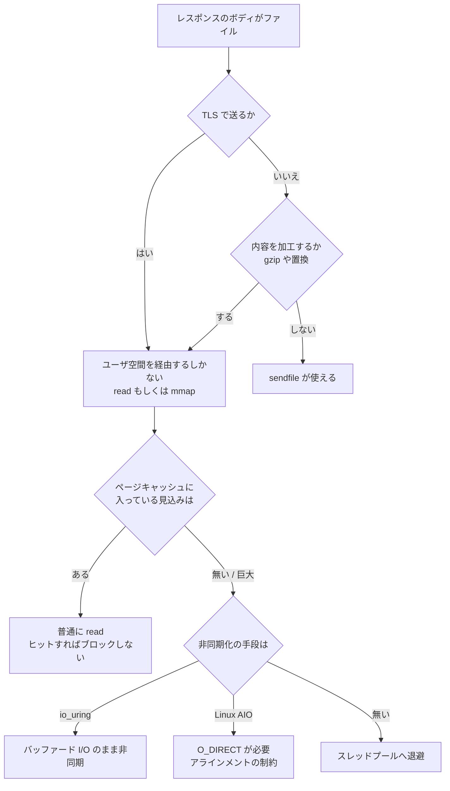

## なぜこれを先に知る必要があるか

Web サーバの仕事のうち、静的ファイルを返す部分は一見いちばん単純だ。パスからファイルを開き、中身を読み、ソケットに書く。3 つのシステムコールで書ける。

```c
fd = open(path, O_RDONLY);
while ((n = read(fd, buf, sizeof(buf))) > 0) {
    write(sock, buf, n);
}
close(fd);
```

このコードは正しく動く。そして、**速いサーバはこれを書かない**。理由は 2 つあって、1 つは無駄なコピーとシステムコールを払っていること、もう 1 つは `read()` がブロックしうることだ。

後者のほうが重い。[ノンブロッキング I/O と多重化のページ](../nonblocking-multiplexing/) で見たとおり、イベント駆動サーバの前提は「ブロックしない」ことだった。ソケットは `O_NONBLOCK` を付ければブロックしなくなる。**通常ファイルはそうならない。** `O_NONBLOCK` を付けても無視され、`epoll` に登録しようとすると `EPERM` が返る。ディスクから読む必要があれば、`read()` はその場でスレッドを止める。

つまり静的ファイルの配信は、イベントループの規律を壊す唯一の入口になりうる。このページでは、OS がコピーを削るために用意した機構と、ブロックを避けるために用意した機構を分けて見る。

## 素朴な実装が払っているもの

`read()` と `write()` の 1 往復で、データがどう動くかを追う。

```
1. read(fd, buf, n)
   [ディスク] --DMA--> [ページキャッシュ]     カーネル空間
   [ページキャッシュ] --CPU copy--> [buf]      カーネル -> ユーザ

2. write(sock, buf, n)
   [buf] --CPU copy--> [ソケット送信バッファ]  ユーザ -> カーネル
   [ソケット送信バッファ] --DMA--> [NIC]       カーネル空間
```

コピーが 4 回、うち 2 回は CPU が 1 バイトずつ動かしている。DMA の 2 回はハードウェアがやるので CPU は使わない。

システムコールは 2 回。1 回のシステムコールで、ユーザモードからカーネルモードへの遷移と、その逆が起きる。今のプロセッサでは投機実行の緩和策 (Spectre/Meltdown 対策) が入って、この遷移のコストは以前より上がっている。

無駄なのは、**`buf` の中身をサーバが一度も見ていない**ことだ。静的ファイルを無加工で返すなら、ユーザ空間にデータが上がってくる必要が無い。カーネルの中でページキャッシュからソケットバッファへ直接動かせれば、CPU コピー 2 回とシステムコール 1 回が消える。

## sendfile

### 何をするか

Linux の `sendfile(2)` がそれをやる。

```c
#include <sys/sendfile.h>

ssize_t sendfile(int out_fd, int in_fd, off_t *offset, size_t count);
```

`in_fd` から `out_fd` へ `count` バイトを、ユーザ空間を経由せずに転送する。`offset` を指定すればファイルの先頭からのオフセットで読み、`lseek` の位置は動かない。戻り値は実際に転送されたバイト数で、`offset` は転送したぶんだけ進む。

```
[ディスク] --DMA--> [ページキャッシュ] --copy--> [ソケット送信バッファ] --DMA--> [NIC]
                                       ^^^^^^
                                       カーネル内で完結
```

CPU コピーが 2 回から 1 回に減り、システムコールが 1 回になる。さらに NIC が scatter-gather DMA とチェックサムオフロードに対応していれば、ページキャッシュからソケットバッファへのコピーも消える。ソケットバッファに置かれるのは「ページキャッシュのどこに何バイトある」という記述子だけになり、NIC がそこから直接読む。この状態が真のゼロコピーだ。

### 制約

`sendfile()` は万能ではない。

- **`in_fd` は mmap 可能な fd でなければならない。** 通常ファイルは通る。ソケットやパイプは通らない (パイプからの転送には `splice(2)` がある)。つまり「上流から受け取ったデータをそのまま下流へ」には使えない。
- **1 回の呼び出しで転送できるバイト数に上限がある。** Linux では 0x7ffff000 (2147479552) バイト。それ以上のファイルはループが要る。
- **`out_fd` は歴史的にソケットに限られていた。** Linux 2.6.33 以降は通常ファイルも可になったが、ソケットへ送るのが主用途であることは変わらない。
- **移植性が無い。** FreeBSD の `sendfile(2)` はシグネチャが違い、引数にヘッダとトレーラを渡す `struct sf_hdtr` を取る。macOS はさらに別。Windows には `TransmitFile()` がある。同じ最適化を全プラットフォームで得るには、プラットフォームごとに別のコードを書く。
- **データを加工できない。** gzip 圧縮をかけるなら、バイト列をユーザ空間で触るしかない。SSI や置換フィルタも同じ。
- **TLS があると使えない。** これが最大の制約だ。

最後の点を掘る。TLS が入ると、送るバイト列はファイルの中身そのものではなく、暗号化されレコードに包まれたものになる ([TLS 終端のページ](../tls-termination/))。暗号化は鍵を持っている側 — 通常はユーザ空間の TLS ライブラリ — がやる。だからページキャッシュの内容は必ず一度ユーザ空間に上がり、暗号化され、`write()` で降りていく。**HTTPS にした瞬間、`sendfile()` の効果はゼロになる。**

カーネル TLS (kTLS) はこの制約を外すための仕組みだ。ハンドシェイクで導出した対称鍵をカーネルに渡し、レコードの暗号化をカーネル側でやらせる。そうすれば `sendfile()` の出力先が TLS ソケットでも成立する。ただしハンドシェイクはユーザ空間のままで、鍵更新のたびに鍵を入れ直す必要があり、対応する cipher も限られる。

### splice: 入力がファイルでないとき

`sendfile()` の `in_fd` にソケットを渡せないので、プロキシの転送 (上流のソケットから下流のソケットへ) には使えない。そこにあるのが `splice(2)` だ。

```c
#define _GNU_SOURCE
#include <fcntl.h>

ssize_t splice(int fd_in, off_t *off_in, int fd_out, off_t *off_out,
               size_t len, unsigned int flags);
```

`splice()` は 2 つの fd の間でデータを動かすが、**どちらか一方はパイプでなければならない**。パイプはカーネル内のページのリングバッファなので、ソケット → パイプ → ソケットと 2 回呼べば、ユーザ空間を経由せずに転送できる。実際に動くのはページの参照であってデータではない。

代償は、パイプを 1 本余分に持つこと (fd が 2 個増える) と、システムコールが 2 回になること。そして `sendfile()` と同じく、データを加工できない。プロキシがレスポンスヘッダを書き換えたり圧縮したりするなら使えない。

`tee(2)` と `vmsplice(2)` も同じ系列にあり、それぞれパイプの内容を複製する、ユーザ空間のページをパイプに繋ぐ、という役割を持つ。どれも「データをコピーせず、ページの所有権だけを動かす」という発想でできている。

## mmap + write という代替

`sendfile()` が使えない場合、コピーを 1 回減らす別の手がある。ファイルをメモリにマップして、そのアドレスをそのまま `write()` に渡す。

```c
addr = mmap(NULL, len, PROT_READ, MAP_SHARED, fd, 0);
write(sock, addr, len);
munmap(addr, len);
```

`read()` によるページキャッシュ → ユーザバッファのコピーが消える。マップされた領域に触るとページフォルトが起き、ページキャッシュのページがそのままプロセスのアドレス空間に現れる。

利点はもう 1 つあって、**マップした領域はユーザ空間から読めるので、加工できる**。`sendfile()` と違い、圧縮や置換をかけられる。

リスクが 2 つある。

**ファイルが途中で切り詰められると `SIGBUS` が飛ぶ。** マップした範囲のうち、ファイルの実体が無くなった部分に触った瞬間にシグナルが来る。デフォルトの動作はプロセスの異常終了だ。デプロイでファイルを差し替える運用は普通にあるので、これは現実に起きる。回避するにはシグナルハンドラを書いて `siglongjmp` するか、そもそもファイルを truncate せず rename で差し替える運用にするしかない。前者はイベント駆動サーバの中では扱いにくい。

**ページフォルトは同期的にブロックする。** ページキャッシュに無いページに触ると、そこでディスク I/O が起きてスレッドが止まる。`read()` と同じ問題が、システムコールではなくメモリアクセスの形で現れる。しかも `read()` と違い、どこでブロックしたかがコードから見えない。

加えて、リクエストごとに `mmap` / `munmap` を呼ぶとページテーブルの操作と TLB のフラッシュが起きる。マルチコアだと他のコアへの IPI (プロセッサ間割り込み) も伴う。小さいファイルでは、コピーを 1 回削る利益をこのコストが上回る。

## ヘッダとボディを 1 回で出す

### writev

HTTP のレスポンスは、ヘッダとボディが別のバッファにある。

```
[レスポンスヘッダ 200 バイト] + [ボディ 8000 バイト]
```

これを 2 回の `write()` で送ると、システムコールが 2 回になるだけでなく、後述する TCP の問題も起きる。1 回で送るには、連結した新しいバッファを作るか、`writev(2)` を使う。

```c
#include <sys/uio.h>

struct iovec {
    void  *iov_base;    /* バッファの先頭 */
    size_t iov_len;     /* バイト数 */
};

ssize_t writev(int fd, const struct iovec *iov, int iovcnt);
```

複数のバッファを、連結されているかのように 1 回のシステムコールで書く。連結のためのコピーが要らない。読み側には `readv(2)` がある。

制約は `iovcnt` の上限だ。`IOV_MAX` という定数で決まり、POSIX が保証するのは `_XOPEN_IOV_MAX` = 16 だけ。Linux は 1024、多くの BSD 系も 1024 前後。実行時に取るなら `sysconf(_SC_IOV_MAX)`。

この上限は、レスポンスを細かいバッファの連結として持っている実装に効いてくる。1500 個の断片があっても、1 回の `writev()` では 1024 個しか渡せない。**バッファのリストを走査しながら、上限に達したらそこで区切って送る**という処理が要る。区切った位置を覚えて次から再開する必要もある。

ヘッダとボディの両方をユーザ空間に持っているなら `writev()` で済む。ボディが `sendfile()` で送るファイルだと、そうはいかない。`sendfile()` にヘッダを渡す引数が Linux には無いからだ (FreeBSD の `sf_hdtr` にはある)。この場合、ヘッダを `write()` してからボディを `sendfile()` する 2 段になる。

### TCP_NODELAY と TCP_CORK

ヘッダを先に `write()` すると何が起きるか。TCP はソケットに書かれたバイトを、いつ送るかを自分で決める。デフォルトでは Nagle アルゴリズムが働く。

Nagle の規則は「未確認の小さいセグメントが飛んでいる間は、新しい小さいセグメントを送らない」。小さいデータを 1 バイトずつ書くアプリケーション (telnet のような) が、40 バイトのヘッダに 1 バイトのペイロードを付けたパケットを大量に流すのを防ぐためのものだ。

これが遅延 ACK と組み合わさると悪化する。受信側は ACK をすぐ返さず、返すデータに相乗りさせようと最大 200ms 待つ (Linux では 40ms 程度)。送信側は Nagle で ACK を待っている。**両方が相手を待って、数十ミリ秒の空白が空く。**

`TCP_NODELAY` は Nagle を無効にする。書いたら即座に送る。HTTP サーバはほぼ常にこれを立てる。レスポンスは一度に組み立てられるので、Nagle が守ろうとしている状況にそもそも当てはまらない。

ただし `TCP_NODELAY` だけだと逆の問題が起きる。ヘッダを `write()` した時点で 200 バイトのパケットが 1 個飛び、その直後にボディの 8000 バイトが飛ぶ。1 回で済んだはずのところが 2 パケットになり、しかも 1 個目は無駄に小さい。

これを防ぐのが `TCP_CORK` (Linux) / `TCP_NOPUSH` (BSD 系) だ。

```c
int one = 1, zero = 0;

setsockopt(sock, IPPROTO_TCP, TCP_CORK, &one, sizeof(one));
write(sock, header, header_len);
sendfile(sock, file_fd, &offset, file_len);
setsockopt(sock, IPPROTO_TCP, TCP_CORK, &zero, sizeof(zero));
```

コルクを差している間、TCP は部分的なセグメントを送らずに溜める。抜くと溜まっていたものが出る。ヘッダとボディの先頭が同じパケットに入る。

Linux の `TCP_CORK` は、抜き忘れても最大 200ms で自動的に送られる。**永久に詰まることはないが、抜き忘れると 200ms のレイテンシが乗る。** レスポンスの終わりで確実に抜くのは実装の責任で、エラーパスも含めて漏れなく書く必要がある。

`TCP_NODELAY` と `TCP_CORK` は矛盾するように見えるが、目的が違う。Nagle は「ACK が返るまで待つ」という条件付きの遅延、`TCP_CORK` は「アプリケーションが抜くまで待つ」という明示的な遅延だ。**遅延の制御を、TCP の推測からアプリケーションの宣言に移す**というのがコルクの役割になる。

## 範囲リクエストと、サイズを先に知る必要

HTTP のレスポンスは、ボディの長さを先に宣言するか、チャンク転送にするかのどちらかだった ([HTTP/1.1 の線の上のページ](../http1-wire/))。静的ファイルなら `stat()` でサイズが分かるので `Content-Length` を使う。**つまり、ファイルを 1 バイトも読まないうちに `stat()` が必要になる。**

さらに `Range` ヘッダが来ると、送るのはファイルの一部になる。

```
Range: bytes=1000-1999
```

`sendfile()` はオフセットと長さを取るので、単一範囲ならそのまま渡せる。都合がよく、動画の途中再生のような使い方が安く実現できる。

複数範囲になると話が変わる。

```
Range: bytes=0-99,500-599,1000-1099
```

レスポンスは `multipart/byteranges` になり、各範囲の前に区切り線とヘッダが入る。

```
--BOUNDARY
Content-Type: text/plain
Content-Range: bytes 0-99/8000

<100 バイトのファイル内容>
--BOUNDARY
Content-Type: text/plain
Content-Range: bytes 500-599/8000

<100 バイトのファイル内容>
--BOUNDARY--
```

**ユーザ空間のバッファ (区切りとヘッダ) と、ファイルの断片が交互に並ぶ。** これを送るには、`write()` と `sendfile()` を交互に呼ぶか、両方を同じリストに入れて順に処理する仕組みが要る。ここで「メモリにあるバッファ」と「ファイルのどこからどこまで」を同じ型で表す表現が効いてくる。

しかも、レスポンス全体の `Content-Length` は各範囲の長さの合計に加えて区切り線とヘッダの長さも含む。**実際に送る前に、境界文字列を決めて各パートのヘッダを組み立て、その長さを数え上げないと `Content-Length` が確定しない。** 範囲リクエストの実装が思ったより大きくなるのはこのためだ。

範囲の数に上限を置かないと、攻撃にもなる。1 バイトずつの範囲を数万個要求されると、パート数だけメモリとシステムコールを消費する。

## ページキャッシュとの付き合い方

### posix_fadvise

ファイルへのアクセスパターンをカーネルに伝える。

```c
#include <fcntl.h>

int posix_fadvise(int fd, off_t offset, off_t len, int advice);
```

`advice` に指定できるもの:

| 定数                    | 意味                                         |
| ----------------------- | -------------------------------------------- |
| `POSIX_FADV_NORMAL`     | 既定                                         |
| `POSIX_FADV_SEQUENTIAL` | 順に読む。先読みを積極的にする               |
| `POSIX_FADV_RANDOM`     | ランダムに読む。先読みをやめる               |
| `POSIX_FADV_WILLNEED`   | 近いうちに読む。今のうちにページキャッシュへ |
| `POSIX_FADV_DONTNEED`   | もう読まない。ページキャッシュから外す       |
| `POSIX_FADV_NOREUSE`    | 一度しか読まない                             |

Web サーバに効くのは `SEQUENTIAL` と `DONTNEED` だ。前者は大きなファイルを先頭から流すときに先読みを効かせる。後者は逆で、**巨大なファイルでページキャッシュを汚さないため**に使う。

汚染の問題はこうだ。メモリが 64GB あり、よく参照される小さいファイルの集合が 2GB あるとする。ここに 100GB の動画を 1 本流すと、そのデータがページキャッシュを全部押し流し、2GB のホットセットが追い出される。動画は二度と読まれないのに、次のリクエストは全部ディスクに行くことになる。

### O_DIRECT

より強い手段が `O_DIRECT` で、ページキャッシュを完全にバイパスする。ディスクからユーザバッファへ直接 DMA する。

制約が厳しい。

- **アラインメントが要る。** ユーザバッファのアドレス、ファイル内のオフセット、転送長の 3 つが、ブロックサイズの倍数でなければならない。伝統的には 512 バイト、環境によっては論理ブロックサイズ。Linux 6.1 以降は `statx()` の `STATX_DIOALIGN` で正しい値を問い合わせられる。バッファは `posix_memalign()` で確保する。
- **ページキャッシュが効かないので、同じファイルを 2 回読めば 2 回ディスクに行く。** キャッシュしたいデータに使ってはいけない。
- **`sendfile()` と組み合わせられない。** ページキャッシュを経由しないので、カーネル内で直接ソケットへ渡す経路が無い。
- **同期的にブロックする。** これが一番効く制約だ。`O_DIRECT` の `read()` は、ページキャッシュのヒットという逃げ道が無いので、必ずディスクの完了を待つ。非同期化と組み合わせない限り、スレッドが確実に止まる。

つまり `O_DIRECT` は「非同期 I/O と一緒に使う」ことがほぼ前提になる。単体で使うと、ページキャッシュを汚さない代わりに全リクエストが遅くなる。

## 通常ファイルの I/O は epoll では待てない

ここが、静的ファイル配信がイベント駆動サーバに持ち込む本当の問題だ。

`epoll_ctl()` に通常ファイルの fd を渡すと `EPERM` が返る。`select()` / `poll()` に渡すと、常に「読める」「書ける」と報告される。**ファイルは常に準備完了とみなされる。** カーネルの立場ではこれは正しい — ソケットのように「データがまだ来ていない」という状態が無く、いつでも読み始められるからだ。

問題は、読み始めてから完了するまでの時間だ。ページキャッシュにヒットすればメモリコピーだけで数マイクロ秒。ミスすればディスクの読み出しで、NVMe なら 100 マイクロ秒、回転するディスクなら 5〜10 ミリ秒。

イベントループが 1 スレッドだと、この 10 ミリ秒の間に他の全接続が止まる。5 万接続を捌いているワーカーが、1 つのリクエストのページキャッシュミスで 10 ミリ秒フリーズする。しかも `epoll` には「ファイルの読み出しが完了した」を通知する手段が無いので、**この待ちをイベントループの外に出す方法が標準の POSIX には存在しない**。

逃げ道は 3 つある。

### Linux AIO

`io_submit(2)` / `io_getevents(2)` による非同期 I/O。

```c
struct iocb    cb;
struct io_event ev;

io_prep_pread(&cb, fd, buf, count, offset);
io_submit(ctx, 1, &cbs);
/* ... 他の仕事 ... */
io_getevents(ctx, 1, 1, &ev, NULL);
```

完了通知は `eventfd` に結び付けられるので、その fd を `epoll` に登録すれば **ファイル I/O の完了をイベントループの中で待てる**。形の上では問題が解ける。

実際には制約が重い。

- **`O_DIRECT` が実質必須。** バッファード I/O に対して `io_submit()` を呼ぶと、多くの場合その場で同期的にブロックする。非同期であることが保証されるのは `O_DIRECT` のときだけだ。
- `O_DIRECT` が要るということは、アラインメントの制約が全部ついてくるということ。
- ページキャッシュが効かないので、小さいファイルには不利。大きいファイルを流すときにだけ意味がある。
- `open()` と `stat()` は非同期化できない。

### io_uring

`io_uring` は、提出キューと完了キューの 2 つのリングバッファをカーネルと共有する仕組みだ。

```
ユーザ空間                    カーネル
  submission queue  ------>  処理
  completion queue  <------  完了
```

Linux AIO に対する改善が 3 つある。

- **バッファード I/O でも非同期になる。** ページキャッシュに無ければカーネルのワーカースレッドに回して、完了したら completion queue に積む。`O_DIRECT` が要らないので、アラインメントの制約から解放される。
- **システムコールが減る。** 複数の操作を submission queue にまとめて積み、1 回の `io_uring_enter()` で提出できる。ポーリングモードならシステムコールをゼロにもできる。
- **対象が広い。** `read` / `write` だけでなく、`openat`、`statx`、`accept`、`connect`、`send`、`recv`、`splice`、さらにタイムアウトまで同じ仕組みに乗る。**`open()` や `stat()` すら非同期化できる**のは、他のどの機構にもない性質だ。

`io_uring` の completion を `eventfd` に結び付ければ、既存の `epoll` ベースのループにも統合できる。

課題は移植性と、カーネルバージョンへの依存だ。使える操作の種類がバージョンごとに違い、セキュリティ上の理由でコンテナ環境では無効化されていることもある。Linux 以外には無い。

### スレッドプールに逃がす

いちばん移植性が高い。ブロックしうる操作 (`read`、`open`、`stat`、あるいは `mmap` した領域への最初のアクセス) を、専用のスレッドプールに投げる。イベントループのスレッドは投げたら次の仕事に移り、完了したらパイプか `eventfd` を通じて通知を受ける。

```
イベントループスレッド
   |
   +-- タスクをキューに積む --> [スレッドプール] --> ブロックする read()
   |                                    |
   +<-- eventfd で通知 <----------------+
   |
   +-- 完了したタスクを処理して、レスポンスの続きを書く
```

この形が持つ性質は、**ブロックする操作を消すのではなく、ブロックしてよい場所へ移す**ということだ。スレッドはブロックする。ただしイベントループのスレッドではない。

コストは 3 つ。スレッド間でのタスクの受け渡し (キューとロック)、完了通知のためのシステムコール、そしてコンテキストスイッチ。ページキャッシュにヒットするような速い読み出しをスレッドプールに投げると、オーバーヘッドのほうが大きくなる。だから「大きいファイルだけ」「AIO が使えない場合だけ」といった条件で使い分けることになる。

## open() と stat() 自体もブロックする

見落とされやすいが、ファイルを読む前の段階も同期的だ。

```c
fd = open("/var/www/html/a/b/c/index.html", O_RDONLY);
fstat(fd, &st);
```

`open()` はパスを構成要素ごとに解決する。`/var`、`www`、`html`、`a`、`b`、`c` の各ディレクトリのエントリを引く。dentry キャッシュにあればメモリだけで済むが、無ければディスクを読む。NFS のようなネットワークファイルシステムなら、ネットワーク越しの往復になる。**パスの深さだけ、ブロックしうる点がある。**

`stat()` も同じ。ファイルサイズと更新時刻を取るために inode を読む。`Last-Modified` と `Content-Length` を返すために必ず呼ぶので、リクエストごとに実行される。

`open()` と `stat()` は Linux AIO では非同期化できない。`io_uring` なら `IORING_OP_OPENAT` と `IORING_OP_STATX` があるが、それ以外の環境では選択肢が無い。

現実的な緩和策は、**結果をキャッシュすること**だ。パスから「fd、サイズ、更新時刻、存在しないという事実」までを覚えておき、一定時間は再検査しない。存在しないファイルへのリクエストが繰り返されるとき (404 を返し続けるとき) にも効く。

キャッシュを持つと、今度は無効化の問題が来る。ファイルが差し替わったのに古い fd を返し続ければ、古い内容が配信される。時間で切るのが単純で、`inotify` のような変更通知を使うのが正確だが、監視対象が数万ファイルになると通知の管理自体がコストになる。

## まとめると、選択肢は 3 軸ある

静的ファイルの配信で決めることは、独立した 3 つの軸に分けられる。

**コピーをどこまで削るか** — 素朴な `read`/`write`、`mmap`+`write`、`sendfile`。加工の必要と TLS の有無で選択肢が決まる。

**ページキャッシュを使うか** — 使う (通常)、`fadvise` で汚染を抑える、`O_DIRECT` で完全に外す。ファイルサイズと再アクセスの見込みで決まる。

**ブロックをどう扱うか** — 諦めて同期、AIO + `O_DIRECT`、`io_uring`、スレッドプール。プラットフォームと、許容できるレイテンシで決まる。

3 つは独立ではない。`O_DIRECT` を選べば `sendfile` は使えず、TLS を選べば `sendfile` は使えず、`io_uring` を選べばプラットフォームが Linux に限られる。**組み合わせの表を作ると、実際に成立する経路は数本しかない。** サーバ実装がやっているのは、リクエストごとにその数本のどれを通すかを選ぶことだ。



図の左上の分岐 2 つが `sendfile` の可否を決め、そこから外れた経路だけが「ブロックをどうするか」の問題を抱えることになる。**加工も暗号化もしないファイル配信は、この図の中で唯一ブロックの心配が要らない経路**だ。ただし現代の Web は HTTPS が既定なので、その経路を通るのは TLS を別の場所で終端した場合に限られる。

### 小さいファイルと大きいファイルは別の問題

同じ「ファイルを返す」でも、サイズによってコストの内訳がまるで変わる。

|                  | 4KB のファイル                       | 4GB のファイル               |
| ---------------- | ------------------------------------ | ---------------------------- |
| 支配的なコスト   | `open` / `stat` / システムコール回数 | データ転送そのもの           |
| ページキャッシュ | ヒットしてほしい                     | 汚したくない                 |
| `mmap`           | ページテーブル操作が割に合わない     | 割に合う                     |
| `sendfile`       | 1 回で終わる                         | ループが要る。1 周が長くなる |
| ブロックの影響   | ヒットすればゼロ                     | ミスが必ず混ざる             |
| 有効な対策       | メタデータのキャッシュ               | `O_DIRECT` + 非同期化        |

**小さいファイルの最適化はシステムコールを減らすこと、大きいファイルの最適化はブロックとキャッシュ汚染を避けること**で、方向が逆を向いている。1 つの実装で両方を扱うなら、サイズによる分岐がどこかに要る。閾値を設定可能にしている実装が多いのは、この分岐が環境依存だからだ。

## Nginx ではどうなるか

- ブロックしうる I/O をイベントループの外に出し、完了を「いつものイベント」に揃える仕組み — AIO とスレッドプールの使い分けは [ブロックする I/O のページ](../blocking-io/)。`O_DIRECT` の条件分岐やスレッドプールへの投げ方もここで扱う。
- `sendfile()` で送るファイルと、ユーザ空間のバッファを同じリストに混ぜて持ち回る表現は [バッファとチェーンのページ](../buf-chain/)。「メモリにある」「ファイルにある」を 1 つの記述子で表す形になっている。
- そのリストが最終的に `writev()` と `sendfile()` の呼び出しに落ちるところは [出力フィルタチェーンのページ](../output-filter-chain/)。`IOV_MAX` による区切りもここに現れる。
- 静的ファイルを実際に返すハンドラが、`open` / `stat` から `sendfile` の指示までを組み立てる経路は [コンテンツハンドラのページ](../content-handler/)。
- 1 回のイベントループで大きなファイルを送り切ろうとすると 1 周が長くなる。その上限の置き方は [1 周の長さのページ](../loop-latency/)。
- ページキャッシュミスでスレッドが止まることが、なぜイベントループ全体の問題になるのかは [ステートマシンのページ](../state-machine/) の前提そのものだ。
