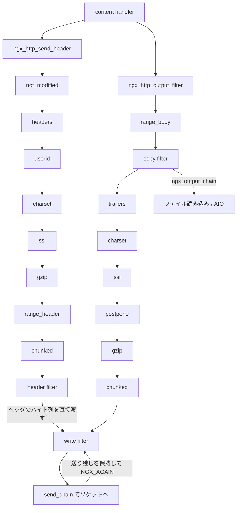

## この層の責務

[コンテンツハンドラ](../content-handler/) は `r->headers_out` にステータスとヘッダを詰め、`ngx_buf_t` をいくつか繋いだ `ngx_chain_t` を作る。そこまでで応答の「中身」は決まっている。

決まっていないのは、それをどうバイト列にしてソケットに流し込むかだ。`Content-Length` が分からなければ chunked に包む。`Accept-Encoding: gzip` があって条件が合えば圧縮する。`Range:` があれば一部だけ切り出す。中身がファイルなら `sendfile()` で直接送るか、いったんメモリに読むかを決める。相手が受け取りきれなければ、残りを覚えておいて後で続きを送る。

項目ごとに有効・無効が設定で切り替わり、ビルド時にモジュールごと外れることもある。この層の責務は、**これらの加工を独立したモジュールに分けたうえで、実行順だけを固定すること**にある。順序には意味がある。gzip の後で Range を切り出したら壊れるし、chunked に包んだ後で圧縮したら二重にエンコードされる。

構造は 2 本の片方向リストだ。ヘッダを加工するチェーンと、ボディを加工するチェーン。どちらもグローバルな関数ポインタが入口で、各モジュールは自分の前後に誰がいるかを知らない。

## 主要な型とその関係

### 3 種類のフィルタ関数と、4 本のグローバル変数

型は `src/http/ngx_http_core_module.h` にある ([`#L530-L534`](https://github.com/nginx/nginx/blob/release-1.31.4/src/http/ngx_http_core_module.h#L530-L534))。実体は `ngx_http.c` にあり ([`#L74-L77`](https://github.com/nginx/nginx/blob/release-1.31.4/src/http/ngx_http.c#L74-L77))、`ngx_http.h` で `extern` されてどのモジュールからも見える。

```c title="src/http/ngx_http_core_module.h と src/http/ngx_http.c"
typedef ngx_int_t (*ngx_http_output_header_filter_pt)(ngx_http_request_t *r);
typedef ngx_int_t (*ngx_http_output_body_filter_pt)
    (ngx_http_request_t *r, ngx_chain_t *chain);
typedef ngx_int_t (*ngx_http_request_body_filter_pt)
    (ngx_http_request_t *r, ngx_chain_t *chain);

/* src/http/ngx_http.c */
ngx_http_output_header_filter_pt  ngx_http_top_header_filter;
ngx_http_output_header_filter_pt  ngx_http_top_early_hints_filter;
ngx_http_output_body_filter_pt    ngx_http_top_body_filter;
ngx_http_request_body_filter_pt   ngx_http_top_request_body_filter;
```

ヘッダフィルタは `ngx_http_request_t *` だけを取る。加工対象の `r->headers_out` が `r` の中にあるので、引数で渡す必要がない。ボディフィルタは加工対象のチェーンを引数で受け取る。

チェーンは 4 本ある。応答ヘッダ、103 Early Hints 専用の短いもの (HTTP/2 と HTTP/3 だけが割り込む)、応答ボディ、そして方向が逆の [リクエストボディ](../request-body/) 用。

**プロセスに 1 組しかない。** ワーカーが fork される前、設定パース直後に組み上がり、以後変わらない。リクエストごとにチェーンを組み直すことはない。

### バッファのフラグ

チェーンを流れる `ngx_chain_t` は `ngx_buf_t` へのポインタと `next` だけを持つ。この層が読むフラグは `ngx_buf_t` の側に立っている ([`src/core/ngx_buf.h#L45-L53`](https://github.com/nginx/nginx/blob/release-1.31.4/src/core/ngx_buf.h#L45-L53))。

| フラグ          | 意味                                             | 誰が見るか                                                     |
| --------------- | ------------------------------------------------ | -------------------------------------------------------------- |
| `last_buf`      | メインリクエストの応答全体の最後                 | write filter。これが来たら `r->response_sent = 1`              |
| `last_in_chain` | このリクエスト (サブリクエスト含む) の出力の最後 | chunked / postpone。サブリクエストは `last_buf` を立てられない |
| `flush`         | ここまでを今すぐ送れ                             | write filter。溜め込みを打ち切る                               |
| `sync`          | データは無いが、チェーンを空でなくしておきたい   | write filter。サイズ 0 でもエラーにしない                      |
| `recycled`      | バッファを使い回すので早く空けてほしい           | write filter。`flush` と同じ扱いになる                         |
| `in_file`       | 中身はファイルにある                             | copy filter / `ngx_output_chain` / `send_chain`                |

`ngx_buf_special()` は `flush` / `last_buf` / `sync` のいずれかが立っていて、メモリにもファイルにも中身が無い buf を判定するマクロだ ([`#L128-L130`](https://github.com/nginx/nginx/blob/release-1.31.4/src/core/ngx_buf.h#L128-L130))。この層のあちこちで例外扱いに使われる。

この種の buf を作るのは `ngx_http_send_special()` だけで、メインリクエストなら `last_buf`、サブリクエストなら `sync + last_in_chain` を立てる ([`src/http/ngx_http_request.c#L3828-L3837`](https://github.com/nginx/nginx/blob/release-1.31.4/src/http/ngx_http_request.c#L3828-L3837))。**サブリクエストが `last_buf` を立てると、親の残りの出力を送る前に接続が終わる。** 区別が 1 箇所に閉じ込められている。

### 「まだ書き終わっていない」を表す 2 つのビット列

`r->buffered` は 4 ビットで、どのフィルタがデータを抱えているかを示す ([`src/http/ngx_http_request.h#L149-L154`](https://github.com/nginx/nginx/blob/release-1.31.4/src/http/ngx_http_request.h#L149-L154))。

```c title="src/http/ngx_http_request.h"
#define NGX_HTTP_LOWLEVEL_BUFFERED         0xf0
#define NGX_HTTP_WRITE_BUFFERED            0x10
#define NGX_HTTP_GZIP_BUFFERED             0x20
#define NGX_HTTP_SSI_BUFFERED              0x01
#define NGX_HTTP_SUB_BUFFERED              0x02
#define NGX_HTTP_COPY_BUFFERED             0x04
```

下位 4 ビットが `r->buffered` に、上位 4 ビットが `c->buffered` に入る。gzip と write は接続単位、SSI・sub・copy はリクエスト単位だ。サブリクエストが自分の SSI 状態を持てるのに対し、ソケットへの書き残しは接続に 1 つしかない、という違いがそのまま表れている。

このビットが 1 つでも立っている限り、[リクエストは終了できない](../finalize-request/)。

## 処理の流れ

### 登録は 2 行

すべてのフィルタモジュールが、`postconfiguration` でこの形を書く ([`src/http/modules/ngx_http_gzip_filter_module.c#L1127-L1137`](https://github.com/nginx/nginx/blob/release-1.31.4/src/http/modules/ngx_http_gzip_filter_module.c#L1127-L1137))。

```c title="src/http/modules/ngx_http_gzip_filter_module.c"
static ngx_int_t
ngx_http_gzip_filter_init(ngx_conf_t *cf)
{
    ngx_http_next_header_filter = ngx_http_top_header_filter;
    ngx_http_top_header_filter = ngx_http_gzip_header_filter;

    ngx_http_next_body_filter = ngx_http_top_body_filter;
    ngx_http_top_body_filter = ngx_http_gzip_body_filter;

    return NGX_OK;
}
```

`ngx_http_next_header_filter` はこのファイルの static 変数だ。**単方向リストの先頭挿入そのもので、`next` ポインタの置き場所が static 変数になっているところだけが違う。** ヘッダだけ加工するモジュールは前半 2 行だけを書く。`ngx_http_userid_filter_module` がそれで、ボディには触らない ([`#L779-L780`](https://github.com/nginx/nginx/blob/release-1.31.4/src/http/modules/ngx_http_userid_filter_module.c#L779-L780))。

チェーンの末端だけは `next` を控えない。`ngx_http_write_filter_init` は `ngx_http_top_body_filter` に、`ngx_http_header_filter_init` は `ngx_http_top_header_filter` と `ngx_http_top_early_hints_filter` に、既存の値を読まずに代入する ([`ngx_http_write_filter_module.c#L365-L371`](https://github.com/nginx/nginx/blob/release-1.31.4/src/http/ngx_http_write_filter_module.c#L365-L371)、[`ngx_http_header_filter_module.c#L734-L741`](https://github.com/nginx/nginx/blob/release-1.31.4/src/http/ngx_http_header_filter_module.c#L734-L741))。控えるべき先頭がまだ無いからで、**「終端であること」が `next` 変数を持たないことで表現されている。**

### 順序は auto/modules の登録順で決まる

登録順は `ngx_modules[]` の並び順で、それは `auto/modules` が `auto/module` を呼ぶ順に等しい。フィルタは 2 グループに分かれて登録される ([`auto/modules#L145`](https://github.com/nginx/nginx/blob/release-1.31.4/auto/modules#L145) と [`#L374`](https://github.com/nginx/nginx/blob/release-1.31.4/auto/modules#L374))。

```sh title="auto/modules"
    ngx_module_type=HTTP_FILTER
    # write, header, chunked, v2, v3, range_header, gzip, postpone,
    # ssi, charset, xslt, image, sub, addition, gunzip, userid, headers

    ngx_module_type=HTTP_INIT_FILTER
    # copy, range_body, not_modified, slice
```

最後に `modules="$modules $HTTP_MODULES $HTTP_FILTER_MODULES $HTTP_AUX_FILTER_MODULES $HTTP_INIT_FILTER_MODULES"` で連結される ([`#L1465-L1467`](https://github.com/nginx/nginx/blob/release-1.31.4/auto/modules#L1465-L1467))。`HTTP_AUX_FILTER_MODULES` は `--add-module` で追加したサードパーティフィルタの置き場で、`copy` より外側 (実行順で先) に入る。

`./configure` を引数なしで実行したときの既定値は `HTTP_GZIP=YES`、`HTTP_SSI=YES`、`HTTP_CHARSET=YES`、`HTTP_USERID=YES`。それ以外の任意フィルタ (`HTTP_SUB`、`HTTP_GUNZIP`、`HTTP_SLICE`、`HTTP_XSLT`、`HTTP_IMAGE_FILTER`、`HTTP_V2`、`HTTP_V3`) は `NO` だ ([`auto/options#L60-L103`](https://github.com/nginx/nginx/blob/release-1.31.4/auto/options#L60-L103))。この条件で登録されるのは 13 個で、実行順は登録順の逆になる。

| 実行順 | モジュール     | ヘッダ   | ボディ   | 何をするか                                                |
| ------ | -------------- | -------- | -------- | --------------------------------------------------------- |
| 1      | `not_modified` | ○        |          | `If-Modified-Since` を見て 304 に書き換える               |
| 2      | `range_body`   |          | ○        | `Range` で指定された範囲だけを切り出す                    |
| 3      | `copy`         |          | ○        | ファイル buf をメモリに読む・AIO に投げる                 |
| 4      | `headers`      | ○        | ○        | `add_header` / `expires` / トレーラ                       |
| 5      | `userid`       | ○        |          | `Set-Cookie` で識別子を付ける                             |
| 6      | `charset`      | ○        | ○        | 文字セット変換                                            |
| 7      | `ssi`          | ○        | ○        | SSI ディレクティブを展開する                              |
| 8      | `postpone`     |          | ○        | [サブリクエスト](../subrequest-postpone/)の出力順を整える |
| 9      | `gzip`         | ○        | ○        | 圧縮する                                                  |
| 10     | `range_header` | ○        |          | 206 と `Content-Range` を組む                             |
| 11     | `chunked`      | ○        | ○        | chunked に包む                                            |
| 12     | `header`       | ○ (終端) |          | ヘッダをバイト列にして write filter に渡す                |
| 13     | `write`        |          | ○ (終端) | ソケットに書く                                            |

ヘッダチェーンは 9 段、ボディチェーンも 9 段になる。この並びは偶然ではない。

- `not_modified` が最初 = 304 と決まれば以降の加工を全部飛ばせる
- `range_body` が `copy` より先 = 切り出してからファイルを読むので、読む量が減る
- `ssi` / `charset` が `gzip` より先 = テキストの加工は圧縮前でないと効かない
- `postpone` が `gzip` の直前 = 圧縮ストリームは途中に別の出力を挟めないので、順序を整えてから圧縮する
- `gzip` が `chunked` より先 = 圧縮してから chunked に包む
- `header` と `write` が最後 = 実際にバイトを吐くのは一番奥

順序を宣言する仕組み (`before:` / `after:`) は無い。静的リンクのビルドでは、`auto/modules` に書かれた呼び出し順が全順序を決める。動的モジュールだけは別で、`ngx_module_order` の文字列がロード時に参照され、`ngx_add_module()` が `cycle->modules` の中の挿入位置を計算する ([`src/core/ngx_module.c#L211-L238`](https://github.com/nginx/nginx/blob/release-1.31.4/src/core/ngx_module.c#L211-L238))。

### 入口

```c title="src/http/ngx_http_core_module.c:1874-1893 と 1927-1946"
ngx_int_t
ngx_http_send_header(ngx_http_request_t *r)
{
    if (r->post_action) {
        return NGX_OK;
    }

    if (r->header_sent) {
        ngx_log_error(NGX_LOG_ALERT, r->connection->log, 0,
                      "header already sent");
        return NGX_ERROR;
    }

    if (r->err_status) {
        r->headers_out.status = r->err_status;
        r->headers_out.status_line.len = 0;
    }

    return ngx_http_top_header_filter(r);
}


ngx_int_t
ngx_http_output_filter(ngx_http_request_t *r, ngx_chain_t *in)
{
    /* ... デバッグログ ... */

    rc = ngx_http_top_body_filter(r, in);

    if (rc == NGX_ERROR) {
        /* NGX_ERROR may be returned by any filter */
        c->error = 1;
    }

    return rc;
}
```

コンテンツを作るモジュールはこの 2 つを呼ぶだけで、その先に何個のフィルタがいるかを知らない。`r->header_sent` の検査が入口にあるのは、**二重送信という不変条件の違反を、チェーンに入る前に 1 箇所で捕まえる**ためだ。

全体の形はこうなる。



ヘッダチェーンの終端 `ngx_http_header_filter` は、組み上げたバイト列を持って `return ngx_http_write_filter(r, &out);` で終わる ([`src/http/ngx_http_header_filter_module.c#L628`](https://github.com/nginx/nginx/blob/release-1.31.4/src/http/ngx_http_header_filter_module.c#L628))。Early Hints 版も同じ 1 行だ ([`#L730`](https://github.com/nginx/nginx/blob/release-1.31.4/src/http/ngx_http_header_filter_module.c#L730))。**ボディチェーンの終端を直接呼び、間の 8 段を通らない。** ヘッダのバイト列に gzip も chunked もかけてはいけないので、これは正しい。だが「チェーンが 2 本ある」という説明は、この 1 行のぶんだけ正確ではない。2 本は終端で合流する。

### 末端 1: `ngx_http_write_filter`

[`src/http/ngx_http_write_filter_module.c#L47-L362`](https://github.com/nginx/nginx/blob/release-1.31.4/src/http/ngx_http_write_filter_module.c#L47-L362)。316 行あるが、やることは 4 つしかない。

まず前回の書き残し `r->out` を走査し、続けて渡された `in` を末尾に繋ぎながら、4 つの値を集める ([`#L63-L206`](https://github.com/nginx/nginx/blob/release-1.31.4/src/http/ngx_http_write_filter_module.c#L63-L206))。

```c title="src/http/ngx_http_write_filter_module.c (骨格)"
    size = 0; flush = 0; sync = 0; last = 0;
    ll = &r->out;

    for (cl = r->out; cl; cl = cl->next) {
        ll = &cl->next;
        /* ... サイズ 0 / 負サイズの検証 ... */
        size += ngx_buf_size(cl->buf);
        if (cl->buf->flush || cl->buf->recycled) { flush = 1; }
        if (cl->buf->sync)                       { sync = 1;  }
        if (cl->buf->last_buf)                   { last = 1;  }
    }

    /* add the new chain to the existent one */

    for (ln = in; ln; ln = ln->next) {
        cl = ngx_alloc_chain_link(r->pool);
        if (cl == NULL) {
            return NGX_ERROR;
        }

        cl->buf = ln->buf;
        *ll = cl;
        ll = &cl->next;
        /* ... 同じ集計 ... */
    }

    *ll = NULL;
```

**リンクだけを新しく作り、`ngx_buf_t` はポインタを共有する。** 渡された `in` のリンク自体は使わない。この規約が「フィルタは受け取ったチェーンの所有権を持たない」の実体で、[buf と chain のページ](../buf-chain/) の `ngx_chain_add_copy` と同じ形をしている。

集めた 4 つの値で送信判断をする ([`#L213-L221`](https://github.com/nginx/nginx/blob/release-1.31.4/src/http/ngx_http_write_filter_module.c#L213-L221))。

```c title="src/http/ngx_http_write_filter_module.c"
    /*
     * avoid the output if there are no last buf, no flush point,
     * there are the incoming bufs and the size of all bufs
     * is smaller than "postpone_output" directive
     */

    if (!last && !flush && in && size < (off_t) clcf->postpone_output) {
        return NGX_OK;
    }
```

溜まりが `postpone_output` (既定 1460 バイト = 1 MSS) 未満で、終わりでもフラッシュ点でもなければ、書かずに `NGX_OK` を返す。ユーザ空間の Nagle だ。カーネルの Nagle と違うのは、`last_buf` を見て「これで終わり」を判断できる点にある。終わりを知っているアプリケーションは、タイマを待たずに送れる。

そして送信 ([`#L294-L351`](https://github.com/nginx/nginx/blob/release-1.31.4/src/http/ngx_http_write_filter_module.c#L294-L351))。

```c title="src/http/ngx_http_write_filter_module.c"
    chain = c->send_chain(c, r->out, limit);

    if (chain == NGX_CHAIN_ERROR) {
        c->error = 1;
        return NGX_ERROR;
    }
    /* ... limit_rate の delay 計算 ... */

    if (chain && c->write->ready && !c->write->delayed) {
        ngx_post_event(c->write, &ngx_posted_next_events);
    }

    for (cl = r->out; cl && cl != chain; /* void */) {
        ln = cl;
        cl = cl->next;
        ngx_free_chain(r->pool, ln);
    }

    r->out = chain;

    if (chain) {
        c->buffered |= NGX_HTTP_WRITE_BUFFERED;
        return NGX_AGAIN;
    }

    c->buffered &= ~NGX_HTTP_WRITE_BUFFERED;
```

`c->send_chain()` は「送りきれなかった残りの先頭」を返す。送れたぶんのリンクをプールに返し、残りを `r->out` に置き直す。残りがあれば `c->buffered` にビットを立てて `NGX_AGAIN`。

`limit` は 2 つの理由で入る。`limit_rate` の帯域制限と、`sendfile_max_chunk` の 1 回あたり上限だ ([`#L263-L292`](https://github.com/nginx/nginx/blob/release-1.31.4/src/http/ngx_http_write_filter_module.c#L263-L292))。「今までに送ってよかった量」から「実際に送った量」を引き、マイナスなら `c->write->delayed = 1` を立ててタイマを張り、`NGX_AGAIN` で帰る。帯域制限が終端にあるのは、**加工後の実バイト数を制限したいから**だ。gzip の手前で制限しても、実際に流れる量は分からない。

`sendfile_max_chunk` で途中打ち切りにした場合は `ngx_posted_next_events` に自分を積んで次のループで再開する。1 周を長くしない工夫で、[イベントループのレイテンシのページ](../loop-latency/) の主題そのものだ。

### 末端 2: `ngx_http_copy_filter`

copy フィルタ本体は 76 行しかない ([`src/http/ngx_http_copy_filter_module.c#L82-L158`](https://github.com/nginx/nginx/blob/release-1.31.4/src/http/ngx_http_copy_filter_module.c#L82-L158))。実装は `ngx_output_chain()` に丸投げで、このモジュールがやるのは **HTTP の設定を `ngx_output_chain_ctx_t` に翻訳すること**だけだ。

```c title="src/http/ngx_http_copy_filter_module.c"
        ctx->sendfile = c->sendfile;
        ctx->need_in_memory = r->main_filter_need_in_memory
                              || r->filter_need_in_memory;
        ctx->need_in_temp = r->filter_need_temporary;

        ctx->pool = r->pool;
        ctx->bufs = conf->bufs;
        ctx->tag = (ngx_buf_tag_t) &ngx_http_copy_filter_module;

        ctx->output_filter = (ngx_output_chain_filter_pt)
                                  ngx_http_next_body_filter;
        ctx->filter_ctx = r;
```

`output_filter` に `ngx_http_next_body_filter` が入る。**チェーンの続きが、`ngx_output_chain` にとってのコールバックとして渡される。** これで `ngx_output_chain` は HTTP を一切知らずに済み、上流への送信 (`ngx_chain_writer`) でも同じコードが使える。

`need_in_memory` は、下流に「ファイルのままでは困る」フィルタがいるときに立つ。gzip や SSI が `r->filter_need_in_memory = 1` を立て、それを見て copy が実際にファイルを読む。下流の要求が、上流のフラグ経由で伝わっている。

戻ってきたら `ctx->in` に残りがあるかどうかで `r->buffered` の `NGX_HTTP_COPY_BUFFERED` を上げ下げする ([`#L147-L152`](https://github.com/nginx/nginx/blob/release-1.31.4/src/http/ngx_http_copy_filter_module.c#L147-L152))。

AIO を使う設定では、読み込みを待つ間リクエストにマーカーが立つ ([`#L170-L177`](https://github.com/nginx/nginx/blob/release-1.31.4/src/http/ngx_http_copy_filter_module.c#L170-L177))。

```c title="src/http/ngx_http_copy_filter_module.c"
    file->aio->data = r;
    file->aio->handler = ngx_http_copy_aio_event_handler;

    ngx_add_timer(&file->aio->event, 60000);

    r->main->blocked++;
    r->aio = 1;
    ctx->aio = 1;
```

`r->main->blocked++` が [リクエスト終了](../finalize-request/) を止める。完了通知が返ってくるまでリクエストのプールを解放できないので、参照カウンタとは別のカウンタで押さえている。ここは [ブロッキング I/O のページ](../blocking-io/) の話につながる。

### 末端 3: `ngx_output_chain` の 3 本のチェーン

[`src/core/ngx_output_chain.c#L41-L246`](https://github.com/nginx/nginx/blob/release-1.31.4/src/core/ngx_output_chain.c#L41-L246)。HTTP に依存しないので `src/core/` にいる。状態は `ngx_output_chain_ctx_t` の 4 フィールドに集約されている ([`src/core/ngx_buf.h#L78-L83`](https://github.com/nginx/nginx/blob/release-1.31.4/src/core/ngx_buf.h#L78-L83))。

- `in` — まだ処理していない入力。呼び出しごとに追加される
- `buf` — 今書き込み中の出力バッファ 1 枚
- `free` — 使い終わって再利用できるバッファ
- `busy` — 下流に渡したが、まだ送り終わっていないバッファ

最初に短絡がある。`ctx->in` と `ctx->busy` が空で、入力が 1 枚だけでコピー不要なら、`ctx->output_filter` にそのまま渡して帰る ([`#L48-L72`](https://github.com/nginx/nginx/blob/release-1.31.4/src/core/ngx_output_chain.c#L48-L72))。**静的ファイルを `sendfile` で返す既定のパスは、この短絡だけを通る。** [OS のファイル送出のページ](../os-file-serving/) で見た `sendfile()` の利点が、ここで消されずに残る。

短絡しなかった場合が本体のループだ。

```c title="src/core/ngx_output_chain.c:86-245 (骨格)"
    for ( ;; ) {
        if (ctx->aio) {
            return NGX_AGAIN;
        }

        while (ctx->in) {
            bsize = ngx_buf_size(ctx->in->buf);
            /* ... サイズ検証 ... */

            if (ngx_output_chain_as_is(ctx, ctx->in->buf)) {
                /* コピー不要: リンクを out へ付け替えるだけ */
                cl = ctx->in;
                ctx->in = cl->next;
                *last_out = cl;
                last_out = &cl->next;
                cl->next = NULL;
                continue;
            }

            if (ctx->buf == NULL) {
                /* 1. directio 用の整列バッファを試す
                 * 2. ctx->free から取る
                 * 3. out が既にあるか ctx->allocated == ctx->bufs.num なら break
                 * 4. 新しく確保する */
            }

            rc = ngx_output_chain_copy_buf(ctx);
            if (rc == NGX_AGAIN) {
                if (out) { break; }
                return rc;
            }
            /* 使い切った ctx->in を外し、ctx->buf を out に繋ぐ */
        }

        if (out == NULL && last != NGX_NONE) {
            if (ctx->in) { return NGX_AGAIN; }
            return last;
        }

        last = ctx->output_filter(ctx->filter_ctx, out);

        if (last == NGX_ERROR || last == NGX_DONE) {
            return last;
        }

        ngx_chain_update_chains(ctx->pool, &ctx->free, &ctx->busy, &out,
                                ctx->tag);
        last_out = &out;
    }
```

外側の `for (;;)` が回るのは、**バッファが足りなくなったら下流に流して、返ってきたバッファを再利用して続きを処理する**ためだ。`ctx->bufs.num` 枚 (`output_buffers`、既定は 2 枚 × 32768 バイト。[`ngx_http_copy_filter_module.c#L383`](https://github.com/nginx/nginx/blob/release-1.31.4/src/http/ngx_http_copy_filter_module.c#L383)) までしか確保しないので、100 MB のファイルでも使うメモリは一定になる。

ファイルを読むのは `ngx_output_chain_copy_buf()` で、AIO やスレッドプールが `NGX_AGAIN` を返したらそのまま伝播する ([`#L576-L599`](https://github.com/nginx/nginx/blob/release-1.31.4/src/core/ngx_output_chain.c#L576-L599))。

バッファの回収は `ngx_chain_update_chains` がやる ([`src/core/ngx_buf.c#L184-L223`](https://github.com/nginx/nginx/blob/release-1.31.4/src/core/ngx_buf.c#L184-L223))。

```c title="src/core/ngx_buf.c"
    if (*out) {
        /* out を busy の末尾に連結して *out = NULL */
    }

    while (*busy) {
        cl = *busy;

        if (cl->buf->tag != tag) {
            *busy = cl->next;
            ngx_free_chain(p, cl);
            continue;
        }

        if (ngx_buf_size(cl->buf) != 0) {
            break;
        }

        cl->buf->pos = cl->buf->start;
        cl->buf->last = cl->buf->start;

        *busy = cl->next;
        cl->next = *free;
        *free = cl;
    }
```

判定は 3 つだ。`tag` が自分のものでなければリンクだけプールに返す (buf の持ち主は別のモジュールなので内容には触らない)。`ngx_buf_size()` が 0 でなければ `break` — **先頭が送り終わっていないなら、後ろも送り終わっていない**。サイズ 0 なら `pos` と `last` を `start` に巻き戻して `free` に移す。

**`ngx_buf_size()` が 0 かどうかで「送り終わったか」を判定している。** write filter が `ngx_chain_update_sent()` で `pos` を進めるので、送信済みのバッファは自然に空になる。所有権の受け渡しに別のフラグを持たず、既にある `pos` / `last` を使い回している。

`tag` は `ngx_buf_tag_t`、つまり `void *` で、モジュール構造体のアドレスをそのまま入れる。グローバルに一意な識別子が、リンカによって無料で手に入る。

## 守られている不変条件

**ヘッダは 1 回しか送られない。** `r->header_sent` が `ngx_http_send_header()` の入口で検査される。破ると応答に 2 つのステータス行が入る。`ngx_http_top_header_filter` を直接呼ぶモジュールがあるとこの検査は効かないので、そのようなコードは書かない。

**フィルタは受け取ったチェーンの所有権を持たない。** 渡された `ngx_chain_t` のリンクを保持したいフィルタは、自分でリンクを確保して buf ポインタだけをコピーする。write filter も `ngx_output_chain` も chunked filter もそうしている。呼び出し側は、フィルタから戻った後で自分のチェーンを自由に捨ててよい。

**`last_buf` はメインリクエストにしか立たない。** 区別は `ngx_http_send_special()` の 1 箇所に閉じている。

**`r->out` を触るのは write filter だけ。** 他のフィルタは自分のチェーンを持つ。gzip なら `ctx->out`、SSI なら `ctx->busy`。書き残しが 1 箇所に集まっているから、`c->buffered` のビット 1 本で「まだ書くものがある」を表せる。

**`busy` は FIFO で、先頭が空くまで後ろは空かない。** `ngx_chain_update_chains` のループが `break` で抜けられるのはこの前提があるからだ。下流が順序を入れ替えて送ることは無い、という送信レイヤの性質に依存している。

**フィルタ関数自身は状態を持たない。** リクエストごとの状態は `r->ctx[module.ctx_index]` に置く。gzip の zlib ストリームも、SSI のパース位置も、copy の `ngx_output_chain_ctx_t` もそこにある。これがあるから、同じ関数が同じ接続の上で複数のリクエストを同時に処理できる。[HTTP/2 の多重化](../http2-multiplexing/) が既存のフィルタに手を入れずに載ったのは、この性質のおかげだ。

## つまずきどころ

### `NGX_AGAIN` は「失敗」ではない

ボディフィルタの戻り値は 3 通りある。

| 戻り値      | 意味                                             | 呼び出し元がやること        |
| ----------- | ------------------------------------------------ | --------------------------- |
| `NGX_OK`    | 全部処理した                                     | 次に進む                    |
| `NGX_AGAIN` | 下流が詰まっている。データはこちらで保持している | 何もせず帰る                |
| `NGX_ERROR` | 壊れた                                           | `ngx_http_finalize_request` |

`NGX_AGAIN` のときデータは失われていない。write filter なら `r->out` に、`ngx_output_chain` なら `ctx->in` と `ctx->busy` に残っている。再開は書き込みイベントから来る。`ngx_http_finalize_request()` が `r->buffered || c->buffered` を見て `ngx_http_set_write_handler()` を呼び、`wev->handler` が `ngx_http_writer` に差し替わる ([`src/http/ngx_http_request.c#L3091-L3113`](https://github.com/nginx/nginx/blob/release-1.31.4/src/http/ngx_http_request.c#L3091-L3113))。

```c title="src/http/ngx_http_request.c"
    rc = ngx_http_output_filter(r, NULL);

    if (rc == NGX_ERROR) {
        ngx_http_finalize_request(r, rc);
        return;
    }

    if (r->buffered || r->postponed || (r == r->main && c->buffered)) {
        /* ... タイマを張り直して帰る ... */
        return;
    }
```

`ngx_http_output_filter(r, NULL)` — **新しいデータを渡さずにチェーンを叩く。** 各フィルタは `in == NULL` を「溜まっているぶんを流せ」と読む。この経路の詳細は [リクエストの終了のページ](../finalize-request/) にある。

### `in == NULL` で呼ばれることを忘れる

フィルタを自分で書くと、ここで必ず躓く。`ngx_http_write_filter` は `in` が NULL でも `r->out` を処理するし、`ngx_http_postpone_filter` は `in == NULL` を「溜めていたサブリクエストの出力を流すタイミング」として使っている ([`src/http/ngx_http_postpone_filter_module.c#L88-L95`](https://github.com/nginx/nginx/blob/release-1.31.4/src/http/ngx_http_postpone_filter_module.c#L88-L95))。`in` を無条件で参照するフィルタは、`ngx_http_writer` から呼ばれた瞬間に落ちる。

### ヘッダ送信後にエラーを見つけたとき

チェーンの途中でエラーになると、既に送ったヘッダの後ろにエラーページの HTML が付く。専用の出口がある ([`src/http/ngx_http_special_response.c#L536-L572`](https://github.com/nginx/nginx/blob/release-1.31.4/src/http/ngx_http_special_response.c#L536-L572))。

```c title="src/http/ngx_http_special_response.c"
    ngx_http_clean_header(r);

    ctx = NULL;

    if (m) {
        ctx = r->ctx[m->ctx_index];
    }

    /* clear the modules contexts */
    ngx_memzero(r->ctx, sizeof(void *) * ngx_http_max_module);

    if (m) {
        r->ctx[m->ctx_index] = ctx;
    }

    r->filter_finalize = 1;

    rc = ngx_http_special_response_handler(r, error);

    /* NGX_ERROR resets any pending data */
```

全モジュールの `r->ctx` をゼロクリアして、呼び出し元のぶんだけ復元する。チェーンの途中まで進んだ状態を捨て、エラー応答を最初から組み立て直すためだ。呼び出し元だけ残すのは、戻った後でまだ自分の ctx を触るから。`r->filter_finalize` が立つと、`ngx_http_finalize_request()` は `rc == NGX_OK` でも `c->error = 1` を立てて終了へ倒す。

### サードパーティフィルタの位置は 1 箇所しか選べない

`--add-module` で追加したフィルタは `HTTP_AUX_FILTER_MODULES` に入り、既定ビルドの実行順で言えば `copy` の直後、`headers` の直前に置かれる。`gzip` より外側なので、圧縮前の平文が見える。

これで困る場合、モジュールの `config` に `ngx_module_order` を書くという逃げ道はあるが、静的リンクでは実質的に効かない。`ngx_module_order` が読まれるのは `ngx_add_module()` — つまり動的モジュールのロード時だけだからだ。

### 深いチェーンはスタックを積む

ヘッダ 9 段・ボディ 9 段が既定で、`--with-http_v2_module` や `--with-http_sub_module` を足すと増える。そこにサブリクエストの入れ子が乗る。SSI が 3 段ネストしたページなら、`ngx_http_output_filter` からの呼び出しが 30 段以上積まれることがある。

フィルタの中で大きなローカル変数を取らない、という規律はここから来ている。`ngx_http_write_filter` のローカル変数は `off_t` と `ngx_uint_t` とポインタだけで、配列が 1 つも無い。

### 「次を呼ぶ」の書き忘れは静かに壊れる

早期 return のパスで `return ngx_http_next_header_filter(r);` を書き忘れると、下流のフィルタが全部飛ばされる。コンパイラは何も言わないし、テストでも気づきにくい。応答は返るが、gzip が効かない、chunked にならない、といった形で出る。

Nginx のフィルタが「関数の出口が全部 next 呼び出し」という形に揃っているのは、レビューで気づけるようにするためでもある。加工をしないパスも `return ngx_http_next_header_filter(r);` で終わる。

## 関連

- チェーンを流れる `ngx_buf_t` と `ngx_chain_t` の設計は [buf と chain のページ](../buf-chain/)
- 応答を作ってこの層に渡すまでは [コンテンツハンドラのページ](../content-handler/)
- `postpone` フィルタがこの位置にいる理由は [サブリクエストのページ](../subrequest-postpone/)
- `sendfile` / AIO / directio の使い分けは [OS のファイル送出のページ](../os-file-serving/)
- `sendfile_max_chunk` と `ngx_posted_next_events` は [1 周のレイテンシのページ](../loop-latency/)
