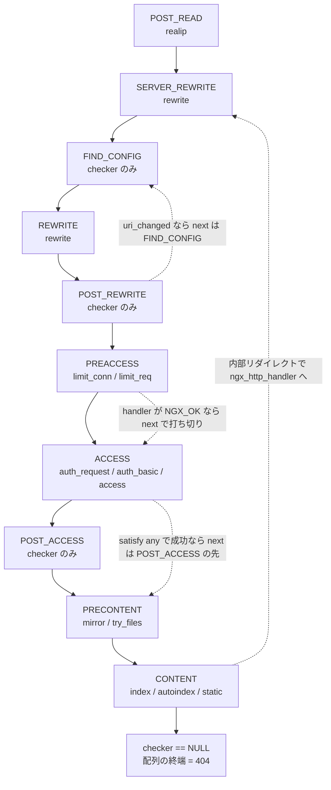

## この層の責務

`ngx_http_process_request()` がリクエスト行とヘッダを読み終え、`server` を選び終えたところから先が、この層の担当になる ([リクエストのパース](../request-parse/) と [server と location の選択](../virtual-server-location/))。

やることは 1 つだけだ。**設定に書かれたモジュールの関数を、決まった順序で呼ぶ。**

素朴に書くとこうなる。

```c
if (access_module_enabled) { rc = access_handler(r); if (rc != OK) return rc; }
if (auth_basic_enabled)    { rc = auth_handler(r);   if (rc != OK) return rc; }
if (limit_req_enabled)     { ... }
/* ... 40 個のモジュールぶん ... */
```

これはコアがモジュール全部を知っていることになるので、サードパーティモジュールを足せない。しかも段によって「戻り値の意味」が違う。認証は「1 つでも通ればいい」ことがある (`satisfy any`)、書き換えは「書き換えたらもう一度 location 探索からやり直す」必要がある、内容生成は「1 つだけが成功すればいい」。さらに、どのハンドラも上流や DB を待って途中で止まりうる。

フェーズエンジンは、この 4 つ — 順序・拡張・戻り値の解釈・中断と再開 — をまとめて 1 本の配列とその添字に落とし込む層だ。

- **順序** → 配列の並び順
- **拡張** → 起動時に配列へ push する
- **戻り値の解釈** → 7 種類の checker 関数
- **跳び先** → 各要素の `next` フィールド
- **進行位置** → `r->phase_handler` という 1 つの `ngx_uint_t`

「なぜこの形にしたか」の判断は各節の末尾で触れるが、内容の生成そのものは [コンテンツハンドラのページ](../content-handler/)、リクエストの終わらせ方は [finalize のページ](../finalize-request/) に分けてある。

## 主要な型とその関係

### 11 個のフェーズ

[`src/http/ngx_http_core_module.h#L110-L129`](https://github.com/nginx/nginx/blob/release-1.31.4/src/http/ngx_http_core_module.h#L110-L129)。

```c title="src/http/ngx_http_core_module.h"
typedef enum {
    NGX_HTTP_POST_READ_PHASE = 0,

    NGX_HTTP_SERVER_REWRITE_PHASE,

    NGX_HTTP_FIND_CONFIG_PHASE,
    NGX_HTTP_REWRITE_PHASE,
    NGX_HTTP_POST_REWRITE_PHASE,

    NGX_HTTP_PREACCESS_PHASE,

    NGX_HTTP_ACCESS_PHASE,
    NGX_HTTP_POST_ACCESS_PHASE,

    NGX_HTTP_PRECONTENT_PHASE,

    NGX_HTTP_CONTENT_PHASE,

    NGX_HTTP_LOG_PHASE
} ngx_http_phases;
```

空行の入れ方が意味を持っている。`FIND_CONFIG` / `REWRITE` / `POST_REWRITE` が 1 つの塊なのは、ここがループするからだ。`ACCESS` と `POST_ACCESS` も対になっている。

各フェーズで何が起きるかを、実際に登録しているモジュールと一緒に並べるとこうなる。登録箇所は各モジュールの `postconfiguration` を実測した。

| フェーズ       | 何をする段か                                              | 登録しているモジュール (登録行)                                                                                                                                                                                                                                                                                                                                                                                    |
| -------------- | --------------------------------------------------------- | ------------------------------------------------------------------------------------------------------------------------------------------------------------------------------------------------------------------------------------------------------------------------------------------------------------------------------------------------------------------------------------------------------------------ |
| POST_READ      | ヘッダを読み終えた直後。リクエストの見え方を書き換える    | `realip` ([`#L526`](https://github.com/nginx/nginx/blob/release-1.31.4/src/http/modules/ngx_http_realip_module.c#L526))                                                                                                                                                                                                                                                                                            |
| SERVER_REWRITE | `server` ブロック直下の `rewrite` / `if` / `set`          | `rewrite` ([`#L279`](https://github.com/nginx/nginx/blob/release-1.31.4/src/http/modules/ngx_http_rewrite_module.c#L279))                                                                                                                                                                                                                                                                                          |
| FIND_CONFIG    | URI から `location` を選び、`r->loc_conf` を差し替える    | なし (コアの制御ノード)                                                                                                                                                                                                                                                                                                                                                                                            |
| REWRITE        | `location` ブロック内の `rewrite` / `if` / `set`          | `rewrite` ([`#L286`](https://github.com/nginx/nginx/blob/release-1.31.4/src/http/modules/ngx_http_rewrite_module.c#L286))                                                                                                                                                                                                                                                                                          |
| POST_REWRITE   | URI が変わったか判定し、変わっていれば FIND_CONFIG に戻す | なし (コアの制御ノード)                                                                                                                                                                                                                                                                                                                                                                                            |
| PREACCESS      | 認証の前に走る計量・遅延の段                              | `limit_conn` ([`#L750`](https://github.com/nginx/nginx/blob/release-1.31.4/src/http/modules/ngx_http_limit_conn_module.c#L750))、`limit_req` ([`#L1094`](https://github.com/nginx/nginx/blob/release-1.31.4/src/http/modules/ngx_http_limit_req_module.c#L1094))、`degradation`、`realip` の 2 本目 ([`#L533`](https://github.com/nginx/nginx/blob/release-1.31.4/src/http/modules/ngx_http_realip_module.c#L533)) |
| ACCESS         | アクセス制御。`satisfy` の対象になる                      | `access` ([`#L455`](https://github.com/nginx/nginx/blob/release-1.31.4/src/http/modules/ngx_http_access_module.c#L455))、`auth_basic` ([`#L398`](https://github.com/nginx/nginx/blob/release-1.31.4/src/http/modules/ngx_http_auth_basic_module.c#L398))、`auth_request` ([`#L351`](https://github.com/nginx/nginx/blob/release-1.31.4/src/http/modules/ngx_http_auth_request_module.c#L351))                      |
| POST_ACCESS    | `satisfy any` で「全部落ちた」を判定する                  | なし (コアの制御ノード)                                                                                                                                                                                                                                                                                                                                                                                            |
| PRECONTENT     | 内容生成の直前。別の URI を試したり、複製を投げたりする   | `try_files` ([`#L411`](https://github.com/nginx/nginx/blob/release-1.31.4/src/http/modules/ngx_http_try_files_module.c#L411))、`mirror` ([`#L256`](https://github.com/nginx/nginx/blob/release-1.31.4/src/http/modules/ngx_http_mirror_module.c#L256))                                                                                                                                                             |
| CONTENT        | 応答を作る                                                | `index` ([`#L461`](https://github.com/nginx/nginx/blob/release-1.31.4/src/http/modules/ngx_http_index_module.c#L461))、`autoindex` ([`#L1066`](https://github.com/nginx/nginx/blob/release-1.31.4/src/http/modules/ngx_http_autoindex_module.c#L1066))、`static` ([`#L289`](https://github.com/nginx/nginx/blob/release-1.31.4/src/http/modules/ngx_http_static_module.c#L289))                                    |
| LOG            | 応答を返し終えた後                                        | `log` ([`#L2016`](https://github.com/nginx/nginx/blob/release-1.31.4/src/http/modules/ngx_http_log_module.c#L2016))                                                                                                                                                                                                                                                                                                |

`POST_READ` / `PREACCESS` / `PRECONTENT` は、サードパーティのために空けてある枠という性格が強い。`PRECONTENT` は `TRY_FILES` フェーズを一般化して作られた枠で、`mirror` もここに入っている。

**LOG フェーズだけは、この後で作る配列に入らない。** 後で見る畳み込みのループが `i < NGX_HTTP_LOG_PHASE` で止まるからで、実際の呼び出しはリクエストを閉じる直前に別の関数がやる ([`src/http/ngx_http_request.c#L4016-L4030`](https://github.com/nginx/nginx/blob/release-1.31.4/src/http/ngx_http_request.c#L4016-L4030))。

```c title="src/http/ngx_http_request.c"
    for (i = 0; i < n; i++) {
        log_handler[i](r);
    }
```

戻り値を見ていない。ログは「失敗しても止められない」ので、フェーズエンジンの語彙が要らない。

### 配列の要素

[`#L131-L152`](https://github.com/nginx/nginx/blob/release-1.31.4/src/http/ngx_http_core_module.h#L131-L152)。

```c title="src/http/ngx_http_core_module.h"
typedef ngx_int_t (*ngx_http_phase_handler_pt)(ngx_http_request_t *r,
    ngx_http_phase_handler_t *ph);

struct ngx_http_phase_handler_s {
    ngx_http_phase_handler_pt  checker;
    ngx_http_handler_pt        handler;
    ngx_uint_t                 next;
};


typedef struct {
    ngx_http_phase_handler_t  *handlers;
    ngx_uint_t                 server_rewrite_index;
    ngx_uint_t                 location_rewrite_index;
} ngx_http_phase_engine_t;


typedef struct {
    ngx_array_t                handlers;
} ngx_http_phase_t;
```

型は 3 つある。`ngx_http_phase_t` は**設定を読んでいる間の入れ物**で、`cmcf->phases[11]` という配列としてフェーズごとに 1 つずつある。`ngx_http_phase_engine_t` は**実行時の形**で、11 個の入れ物を畳んだ結果のフラットな配列 1 本を持つ。`ngx_http_phase_handler_t` がその要素だ。

`next` が `ngx_uint_t` (ポインタではなく添字) なのは、配列がフラットで、リクエスト側が持つ位置も添字だからだ。その位置が `r->phase_handler` で、型は同じ `ngx_uint_t`。**これがリクエストの「今どこにいるか」を表す唯一の状態**になっている。フェーズ名でもポインタでもないので、「どこから始めるか」「どこへ飛ぶか」が全部代入 1 回で書ける。

### 登録は 1 行

`ngx_http_static_module` の場合 ([`src/http/modules/ngx_http_static_module.c#L281-L297`](https://github.com/nginx/nginx/blob/release-1.31.4/src/http/modules/ngx_http_static_module.c#L281-L297))。

```c title="src/http/modules/ngx_http_static_module.c"
static ngx_int_t
ngx_http_static_init(ngx_conf_t *cf)
{
    ngx_http_handler_pt        *h;
    ngx_http_core_main_conf_t  *cmcf;

    cmcf = ngx_http_conf_get_module_main_conf(cf, ngx_http_core_module);

    h = ngx_array_push(&cmcf->phases[NGX_HTTP_CONTENT_PHASE].handlers);
    if (h == NULL) {
        return NGX_ERROR;
    }

    *h = ngx_http_static_handler;

    return NGX_OK;
}
```

これが `postconfiguration` コールバックとして呼ばれる ([モジュールの仕組み](../module-system/))。**「どのフェーズか」は、push する配列の添字でしかない。** 優先度の数値も、依存の宣言も、登録用の API も無い。

## 処理の流れ

### 1. 起動時に配列を畳む

[`src/http/ngx_http.c#L455-L560`](https://github.com/nginx/nginx/blob/release-1.31.4/src/http/ngx_http.c#L455-L560)。フェーズエンジンの全部がこの 1 関数にある。

まず長さを数える。

```c title="src/http/ngx_http.c"
    cmcf->phase_engine.server_rewrite_index = (ngx_uint_t) -1;
    cmcf->phase_engine.location_rewrite_index = (ngx_uint_t) -1;
    find_config_index = 0;
    use_rewrite = cmcf->phases[NGX_HTTP_REWRITE_PHASE].handlers.nelts ? 1 : 0;
    use_access = cmcf->phases[NGX_HTTP_ACCESS_PHASE].handlers.nelts ? 1 : 0;

    n = 1                  /* find config phase */
        + use_rewrite      /* post rewrite phase */
        + use_access;      /* post access phase */

    for (i = 0; i < NGX_HTTP_LOG_PHASE; i++) {
        n += cmcf->phases[i].handlers.nelts;
    }

    ph = ngx_pcalloc(cf->pool,
                     n * sizeof(ngx_http_phase_handler_t) + sizeof(void *));
```

全体の個数を数えて 1 回で確保する。`+ sizeof(void *)` の余分は終端用で、`ngx_pcalloc` がゼロ埋めするから `checker == NULL` になり、そのまま実行ループの終了条件になる。番兵を書かずにサイズを足すだけで済ませている。

`use_rewrite` / `use_access` が効いていて、`rewrite` を 1 つも使っていない設定なら `POST_REWRITE` のエントリを作らない。ハンドラが 0 個のフェーズは配列から丸ごと消える。

次が畳み込み本体だ。ここで checker の割り当てと `next` の値が決まる。

```c title="src/http/ngx_http.c"
    for (i = 0; i < NGX_HTTP_LOG_PHASE; i++) {
        h = cmcf->phases[i].handlers.elts;

        switch (i) {

        case NGX_HTTP_SERVER_REWRITE_PHASE:
            if (cmcf->phase_engine.server_rewrite_index == (ngx_uint_t) -1) {
                cmcf->phase_engine.server_rewrite_index = n;
            }
            checker = ngx_http_core_rewrite_phase;

            break;

        case NGX_HTTP_FIND_CONFIG_PHASE:
            find_config_index = n;

            ph->checker = ngx_http_core_find_config_phase;
            n++;
            ph++;

            continue;

        /* NGX_HTTP_REWRITE_PHASE: location_rewrite_index を覚えて
           SERVER_REWRITE と同じ checker を使う */

        case NGX_HTTP_POST_REWRITE_PHASE:
            if (use_rewrite) {
                ph->checker = ngx_http_core_post_rewrite_phase;
                ph->next = find_config_index;
                n++;
                ph++;
            }

            continue;

        case NGX_HTTP_ACCESS_PHASE:
            checker = ngx_http_core_access_phase;
            n++;
            break;

        case NGX_HTTP_POST_ACCESS_PHASE:
            if (use_access) {
                ph->checker = ngx_http_core_post_access_phase;
                ph->next = n;
                ph++;
            }

            continue;

        /* NGX_HTTP_CONTENT_PHASE: checker = ngx_http_core_content_phase */

        default:
            checker = ngx_http_core_generic_phase;
        }

        n += cmcf->phases[i].handlers.nelts;

        for (j = cmcf->phases[i].handlers.nelts - 1; j >= 0; j--) {
            ph->checker = checker;
            ph->handler = h[j];
            ph->next = n;
            ph++;
        }
    }
```

4 つのことが同時に起きている。

**checker の割り当て。** `switch` でフェーズごとに選ぶ。特別な checker が要るのは 6 フェーズだけで、`POST_READ` と `PREACCESS` は `default` の `ngx_http_core_generic_phase` に落ちる。

**`ph->next` の設定。** `n` はこのフェーズが終わった直後の位置だから、`ph->next = n` を全ハンドラに書けば「このフェーズを打ち切って次のフェーズへ」が添字 1 個で表される。**`POST_REWRITE` だけは `ph->next = find_config_index` で前を指す。** 書き換えが起きたら location 探索からやり直すループが、この 1 行で作られている。

**`ACCESS` の `n++`。** `case NGX_HTTP_ACCESS_PHASE` は checker を選ぶ前に `n` を 1 つ進める。後ろに続く `POST_ACCESS` のぶんを先に数えているので、ACCESS フェーズの各ハンドラの `ph->next` は POST_ACCESS ノードの**さらに次**を指す。`satisfy any` で認証が 1 つ通ったときに、失敗の集計ノードごと飛ばすためだ。

**ハンドラの逆順の並べ替え。** `for (j = nelts - 1; j >= 0; j--)`。`postconfiguration` は `ngx_modules[]` の順に呼ばれるが、実行してほしい順序はその逆になるように並びが作られている。`auto/modules` は `# the module order is important` というコメントの下に `static, gzip_static, dav, autoindex, index, random_index` の順を明記している ([`auto/modules#L110-L116`](https://github.com/nginx/nginx/blob/release-1.31.4/auto/modules#L110-L116))。反転した実行の並びは `index → autoindex → static` になり、ディレクトリなら先に index ファイルを探し、無ければ一覧を出し、最後に素のファイルを返す、という順序がここで作られている。

`server_rewrite_index` と `location_rewrite_index` は、内部リダイレクトの入口として後で使う。

### 2. `ngx_http_handler()` が入口で添字を決める

[`src/http/ngx_http_core_module.c#L840-L883`](https://github.com/nginx/nginx/blob/release-1.31.4/src/http/ngx_http_core_module.c#L840-L883)。

```c title="src/http/ngx_http_core_module.c"
    if (!r->internal) {
        /* ... keepalive と lingering_close の判定 ... */
        r->phase_handler = 0;

    } else {
        cmcf = ngx_http_get_module_main_conf(r, ngx_http_core_module);
        r->phase_handler = cmcf->phase_engine.server_rewrite_index;
    }

    r->valid_location = 1;
    /* ... */
    r->write_event_handler = ngx_http_core_run_phases;
    ngx_http_core_run_phases(r);
```

外から来たリクエストは添字 0 = `POST_READ` の先頭から。内部リダイレクトで再入したリクエストは `SERVER_REWRITE` から。**「どこから始めるか」が、代入 1 回で表現されている。**

同時に `r->write_event_handler` に `ngx_http_core_run_phases` そのものが入る。フェーズの途中で書けなくなって止まったとき、次に書けるようになったら**この関数がそのまま再呼び出しされる** ([ステートマシンのページ](../state-machine/))。

### 3. 実行ループは 4 行

[`#L886-L905`](https://github.com/nginx/nginx/blob/release-1.31.4/src/http/ngx_http_core_module.c#L886-L905)。

```c title="src/http/ngx_http_core_module.c"
void
ngx_http_core_run_phases(ngx_http_request_t *r)
{
    ngx_int_t                   rc;
    ngx_http_phase_handler_t   *ph;
    ngx_http_core_main_conf_t  *cmcf;

    cmcf = ngx_http_get_module_main_conf(r, ngx_http_core_module);

    ph = cmcf->phase_engine.handlers;

    while (ph[r->phase_handler].checker) {

        rc = ph[r->phase_handler].checker(r, &ph[r->phase_handler]);

        if (rc == NGX_OK) {
            return;
        }
    }
}
```

これがリクエスト処理の骨格の全部だ。フェーズの名前も `if` も `switch` も出てこない。`r->phase_handler` を進めるのは checker の仕事で、この関数は一切触らない。

肝は `r->phase_handler` が **この関数のローカル変数ではない**ことだ。`return` して後で再入しても、続きから再開できる。

### 4. checker が戻り値を解釈する

配列の形はどのフェーズでも同じで、違うのは checker だけだ。7 種類ある。

**generic** ([`#L908-L942`](https://github.com/nginx/nginx/blob/release-1.31.4/src/http/ngx_http_core_module.c#L908-L942)) が語彙の全部を持っている。

```c title="src/http/ngx_http_core_module.c"
    rc = ph->handler(r);

    if (rc == NGX_OK) {
        r->phase_handler = ph->next;
        return NGX_AGAIN;
    }

    if (rc == NGX_DECLINED) {
        r->phase_handler++;
        return NGX_AGAIN;
    }

    if (rc == NGX_AGAIN || rc == NGX_DONE) {
        return NGX_OK;
    }

    /* rc == NGX_ERROR || rc == NGX_HTTP_...  */

    ngx_http_finalize_request(r, rc);

    return NGX_OK;
```

**rewrite** ([`#L945-L969`](https://github.com/nginx/nginx/blob/release-1.31.4/src/http/ngx_http_core_module.c#L945-L969)) はもっと短い。

```c title="src/http/ngx_http_core_module.c"
    rc = ph->handler(r);

    if (rc == NGX_DECLINED) {
        r->phase_handler++;
        return NGX_AGAIN;
    }

    if (rc == NGX_DONE) {
        return NGX_OK;
    }

    /* NGX_OK, NGX_AGAIN, NGX_ERROR, NGX_HTTP_...  */

    ngx_http_finalize_request(r, rc);

    return NGX_OK;
```

**書き換えフェーズには「このフェーズを打ち切る」という概念が無い。** 登録された全ハンドラが順に走るか、`NGX_DONE` で止まるか、終わらされるかのどれか。だから `ph->next` を一度も読まない。同じ配列構造の上に、フェーズごとに違う制御フローが載っている。

**find_config** ([`#L972-L1064`](https://github.com/nginx/nginx/blob/release-1.31.4/src/http/ngx_http_core_module.c#L972-L1064)) は handler を持たない純粋な制御ノードで、location を選び直す。

```c title="src/http/ngx_http_core_module.c"
    r->content_handler = NULL;
    r->uri_changed = 0;

    rc = ngx_http_core_find_location(r);

    /* ... NGX_ERROR なら 500 ... */

    clcf = ngx_http_get_module_loc_conf(r, ngx_http_core_module);

    if (!r->internal && clcf->internal) {
        ngx_http_finalize_request(r, NGX_HTTP_NOT_FOUND);
        return NGX_OK;
    }
    /* ... client_max_body_size の判定 ... */
    ngx_http_update_location_config(r);
```

最初の 2 行が効いている。**このノードを通るたびに `r->content_handler` と `r->uri_changed` が白紙に戻る。** ループで戻ってきたときに前回の location の設定が残らない。探索そのものは [server と location の選択](../virtual-server-location/) を参照。

**post_rewrite** ([`#L1067-L1108`](https://github.com/nginx/nginx/blob/release-1.31.4/src/http/ngx_http_core_module.c#L1067-L1108)) がループを閉じる。

```c title="src/http/ngx_http_core_module.c"
    if (!r->uri_changed) {
        r->phase_handler++;
        return NGX_AGAIN;
    }

    /*
     * gcc before 3.3 compiles the broken code for
     *     if (r->uri_changes-- == 0)
     * if the r->uri_changes is defined as
     *     unsigned  uri_changes:4
     */

    r->uri_changes--;

    if (r->uri_changes == 0) {
        /* ... "rewrite or internal redirection cycle" で 500 ... */
        return NGX_OK;
    }

    r->phase_handler = ph->next;

    cscf = ngx_http_get_module_srv_conf(r, ngx_http_core_module);
    r->loc_conf = cscf->ctx->loc_conf;

    return NGX_AGAIN;
```

`ph->next` は `find_config_index` なので、URI が書き換わっていれば FIND_CONFIG に戻る。戻る前に `r->loc_conf` を `server` の既定値に戻しているのが重要で、location を選び直す前提を整えている。

コメントの gcc 3.3 の話は、回避策の理由が明記されている例として面白い。`if (x-- == 0)` をビットフィールドに書くと古い gcc が壊れたコードを吐いたので、2 文に分けてある。

**access** ([`#L1111-L1185`](https://github.com/nginx/nginx/blob/release-1.31.4/src/http/ngx_http_core_module.c#L1111-L1185)) が一番複雑だ。

```c title="src/http/ngx_http_core_module.c"
    if (r != r->main) {
        r->phase_handler = ph->next;
        return NGX_AGAIN;
    }
    /* ... */
    rc = ph->handler(r);

    /* ... NGX_DECLINED なら ++、NGX_AGAIN / NGX_DONE なら抜ける ... */

    clcf = ngx_http_get_module_loc_conf(r, ngx_http_core_module);

    if (clcf->satisfy == NGX_HTTP_SATISFY_ALL) {

        if (rc == NGX_OK) {
            r->phase_handler++;
            return NGX_AGAIN;
        }

    } else {
        if (rc == NGX_OK) {
            r->access_code = 0;

            h = ngx_http_proxy_auth(r) ? r->headers_out.proxy_authenticate
                                       : r->headers_out.www_authenticate;

            for ( /* void */ ; h; h = h->next) {
                h->hash = 0;
            }

            r->phase_handler = ph->next;
            return NGX_AGAIN;
        }

        if (rc == NGX_HTTP_FORBIDDEN
            || rc == NGX_HTTP_UNAUTHORIZED
            || rc == NGX_HTTP_PROXY_AUTH_REQUIRED)
        {
            /* ... r->access_code に溜める ... */

            r->phase_handler++;
            return NGX_AGAIN;
        }
    }
```

先頭の `if (r != r->main)` で、**サブリクエストはアクセス制御フェーズを丸ごと飛ばす**。内部で発行したリクエストに認証をかけても意味がないからだ。この 1 行が [サブリクエストのページ](../subrequest-postpone/) の前提になっている。

その下が `satisfy` ディレクティブの実装だ。**`all` なら成功しても `++` で次のハンドラへ、`any` なら成功したら `ph->next` でフェーズを打ち切る。** 設定値で `++` と `= ph->next` を切り替えているだけで、ハンドラ側は `satisfy` を知らない。`any` で成功したときに `www_authenticate` の `hash` を 0 にして回っているのは、先に失敗したモジュールが積んだ `WWW-Authenticate` ヘッダを出力から消すためだ。

`any` のときの失敗は `r->access_code` に溜まり、**post_access** ([`#L1188-L1219`](https://github.com/nginx/nginx/blob/release-1.31.4/src/http/ngx_http_core_module.c#L1188-L1219)) が判定する。

```c title="src/http/ngx_http_core_module.c"
    access_code = r->access_code;

    if (access_code) {
        /* ... 401 / 407 は ngx_http_core_auth_delay() へ ... */

        r->access_code = 0;

        ngx_http_finalize_request(r, access_code);
        return NGX_OK;
    }

    r->phase_handler++;
    return NGX_AGAIN;
```

「全ハンドラが失敗した」という判定を、フェーズの後ろに置いた専用ノードでやる。ループの終端でフラグを見る構造が、配列上の 1 要素として表現されている。

**content** ([`#L1294-L1344`](https://github.com/nginx/nginx/blob/release-1.31.4/src/http/ngx_http_core_module.c#L1294-L1344)) だけ形が違う。

```c title="src/http/ngx_http_core_module.c"
    if (r->content_handler) {
        r->write_event_handler = ngx_http_request_empty_handler;
        ngx_http_finalize_request(r, r->content_handler(r));
        return NGX_OK;
    }
    /* ... */
    rc = ph->handler(r);

    if (rc != NGX_DECLINED) {
        ngx_http_finalize_request(r, rc);
        return NGX_OK;
    }

    /* rc == NGX_DECLINED */

    ph++;

    if (ph->checker) {
        r->phase_handler++;
        return NGX_AGAIN;
    }

    /* no content handler was found */
    /* ... */
    ngx_http_finalize_request(r, NGX_HTTP_NOT_FOUND);
    return NGX_OK;
```

**`r->content_handler` が設定されていたら、フェーズの配列を無視して直接呼ぶ。** `location` に `proxy_pass` や `fastcgi_pass` が書いてあると `clcf->handler` が設定され、`ngx_http_update_location_config()` が `r->content_handler` にコピーする ([`#L1424-L1426`](https://github.com/nginx/nginx/blob/release-1.31.4/src/http/ngx_http_core_module.c#L1424-L1426))。

同時に `r->write_event_handler` を空関数に差し替えている。ここから先の再開はフェーズエンジンではなく、コンテンツハンドラ自身が仕込むイベントハンドラの責任になる。フェーズエンジンは CONTENT に入った時点で役目を終える。

`NGX_DECLINED` 以外は全部 `ngx_http_finalize_request()` に渡る。**このフェーズには「次のフェーズ」が無い**ので、`ph->next` も使わない。全部が `NGX_DECLINED` を返し切って `ph++` した先の `checker` が NULL なら、配列の終端 = 誰も内容を作らなかった、ということで 404 になる。**配列の終端を検出することが、そのまま「該当なし」の判定になっている。**

### 5. 戻り値がどう解釈されるか

handler が返せるのは 6 種類で、checker ごとに解釈が違う。

| handler の戻り値 | generic (POST_READ / PREACCESS)  | rewrite (SERVER_REWRITE / REWRITE) | access (ACCESS)                                   | content (CONTENT)             |
| ---------------- | -------------------------------- | ---------------------------------- | ------------------------------------------------- | ----------------------------- |
| `NGX_OK`         | `ph->next` へ (フェーズ打ち切り) | `finalize_request(NGX_OK)`         | `satisfy all` なら `++`、`any` なら `ph->next`    | `finalize_request(NGX_OK)`    |
| `NGX_DECLINED`   | `++` (同じフェーズの次へ)        | `++`                               | `++`                                              | `++`、無ければ 404 か 403     |
| `NGX_AGAIN`      | ループを抜ける                   | `finalize_request(NGX_AGAIN)`      | ループを抜ける                                    | `finalize_request(NGX_AGAIN)` |
| `NGX_DONE`       | ループを抜ける                   | ループを抜ける                     | ループを抜ける                                    | `finalize_request(NGX_DONE)`  |
| `NGX_ERROR`      | `finalize_request(NGX_ERROR)`    | 同左                               | 同左                                              | 同左                          |
| HTTP ステータス  | `finalize_request(rc)`           | 同左                               | `satisfy any` なら `r->access_code` に溜めて `++` | `finalize_request(rc)`        |

find_config / post_rewrite / post_access は handler を持たないので、この表に列が無い。

checker 自身が返すのは `NGX_OK` と `NGX_AGAIN` の 2 値だけで、意味は handler のそれとは別だ。checker の `NGX_OK` は「ループを止めろ」、`NGX_AGAIN` は「ループを続けろ」。だから `ngx_http_core_run_phases()` 側の判定が `if (rc == NGX_OK) return;` の 1 行で済む。

### 6. 中断すると、同じ添字から再開される

表のうち「ループを抜ける」の行が、非同期の要になっている。

`NGX_AGAIN` / `NGX_DONE` を受けた checker は `r->phase_handler` を**動かさずに** `NGX_OK` を返す。`run_phases` はそこで `return` する。次に何かのイベントで `ngx_http_core_run_phases()` が呼ばれると、`while` の条件が `ph[r->phase_handler].checker` を読み直し、**さっきと同じ要素の checker が、同じ handler をもう一度呼ぶ**。

だから `limit_req` は「まだ待て」で `NGX_AGAIN` を返してタイマを仕掛けられるし、`auth_request` はサブリクエストを投げて `NGX_AGAIN` を返し、応答が返ってきてから 2 回目の呼び出しで判定を返せる。ハンドラは自分のコンテキスト (`ngx_http_get_module_ctx`) に状態を持って、「1 回目か 2 回目か」を自分で見分ける。

`ngx_http_core_auth_delay()` ([`#L1222-L1264`](https://github.com/nginx/nginx/blob/release-1.31.4/src/http/ngx_http_core_module.c#L1222-L1264)) はこの仕組みを使わない例外で、`r->write_event_handler` を専用の関数に差し替えてフェーズエンジンから抜ける。認証失敗の応答を `auth_delay` の時間だけ遅らせるためで、戻る先はもうフェーズではない。

### 7. 内部リダイレクトはどこまで巻き戻すか

`ngx_http_internal_redirect()` ([`#L2584-L2636`](https://github.com/nginx/nginx/blob/release-1.31.4/src/http/ngx_http_core_module.c#L2584-L2636))。

```c title="src/http/ngx_http_core_module.c"
    r->uri_changes--;

    if (r->uri_changes == 0) {
        /* ... "rewrite or internal redirection cycle" で 500 ... */
        return NGX_DONE;
    }

    r->uri = *uri;
    /* ... */
    ngx_http_set_exten(r);

    /* clear the modules contexts */
    ngx_memzero(r->ctx, sizeof(void *) * ngx_http_max_module);

    cscf = ngx_http_get_module_srv_conf(r, ngx_http_core_module);
    r->loc_conf = cscf->ctx->loc_conf;

    ngx_http_update_location_config(r);
    /* ... */
    r->internal = 1;
    r->valid_unparsed_uri = 0;
    r->add_uri_to_alias = 0;
    r->main->count++;

    ngx_http_handler(r);
```

`ngx_http_handler()` を呼び直すので、`r->internal` が 1 になった効果で `SERVER_REWRITE` から再開する。**POST_READ だけは巻き戻らない。** `realip` のようにクライアントの見え方を決めるものを二度走らせない、という切り分けだ。

同時に `ngx_memzero(r->ctx, ...)` で全モジュールのコンテキストが消える。前回の周回で `auth_request` や `try_files` が溜めた状態が残らない。**同じリクエスト構造体を使い回しながら、モジュールから見ると新しいリクエストに見せている。**

`error_page` の飛び先が `@name` だった場合は `ngx_http_named_location()` ([`#L2639-L2712`](https://github.com/nginx/nginx/blob/release-1.31.4/src/http/ngx_http_core_module.c#L2639-L2712)) が使われ、こちらは `r->phase_handler = cmcf->phase_engine.location_rewrite_index` を代入して `ngx_http_core_run_phases()` を直接呼ぶ。location は名前で直接決まっているので、`SERVER_REWRITE` も `FIND_CONFIG` も飛ばして `REWRITE` から始める。**巻き戻し先が 3 通りある** — 0 (新規)、`server_rewrite_index` (URI での内部リダイレクト)、`location_rewrite_index` (名前付き location) — が、どれも代入 1 回で書けている。

ループ上限は `r->uri_changes` が握る。`NGX_HTTP_MAX_URI_CHANGES` は 10 ([`src/http/ngx_http_request.h#L12`](https://github.com/nginx/nginx/blob/release-1.31.4/src/http/ngx_http_request.h#L12))、フィールドは 4 ビットのビットフィールド ([`#L496`](https://github.com/nginx/nginx/blob/release-1.31.4/src/http/ngx_http_request.h#L496))、初期化は 11 ([`src/http/ngx_http_request.c#L660`](https://github.com/nginx/nginx/blob/release-1.31.4/src/http/ngx_http_request.c#L660))。**`rewrite` による書き換えと `error_page` による内部リダイレクトが、同じ予算を食い合う。** これが `"rewrite or internal redirection cycle"` というエラーメッセージが両方の名前を挙げている理由だ。

### フェーズ配列と跳び先



実線が `r->phase_handler++`、点線が `r->phase_handler = ph->next` による跳躍だ。LOG フェーズはこの配列に入っていないので図にも無い。

## 守られている不変条件

**`r->phase_handler` を動かすのは checker だけ。** handler は自分の位置を知らないし、書き換えもしない。返す値だけで進行を指示する。破ると、同じ設定で違うフェーズが走ることになる。唯一の例外が `ngx_http_rewrite_handler` で、`r->phase_handler == location_rewrite_index` を読んで「server の null location に対する location rewrite フェーズ」を判定している ([`src/http/modules/ngx_http_rewrite_module.c#L148-L153`](https://github.com/nginx/nginx/blob/release-1.31.4/src/http/modules/ngx_http_rewrite_module.c#L148-L153))。読むだけで、書き換えはしない。

**配列は読み取り専用で、全リクエストが共有する。** 確保先は設定のプールで、設定リロードのたびに作り直される。リクエストごとに持つのは添字 1 個だけだ。だから 1 万本の接続があっても、フェーズエンジンのメモリは接続数に比例しない。

**終端は `checker == NULL`。** `ngx_pcalloc` のゼロ埋めと `+ sizeof(void *)` で保証される。CONTENT の checker はこれを「該当なし」の判定にも使っている。

**LOG フェーズは配列に入らない。** 畳み込みのループが `i < NGX_HTTP_LOG_PHASE` で止まる。ログは戻り値を見ずに全部呼ばれる。

**FIND_CONFIG を通ると `r->content_handler` と `r->uri_changed` が白紙に戻る。** ループで何周しても、前の周回の location が残らない。

**POST_REWRITE から戻るときは `r->loc_conf` が server の既定値に戻る。** location を選び直す前提が毎回同じになる。

**ACCESS フェーズはメインリクエストにしか適用されない。** `if (r != r->main)` で丸ごと飛ばす。

**`r->uri_changes` は減る一方。** 10 回で打ち切る。rewrite と内部リダイレクトが同じカウンタを共有する。

## つまずきどころ

### `NGX_OK` の意味が階層で違う

handler が返す `NGX_OK` は「このフェーズは自分が処理した」、checker が返す `NGX_OK` は「ループを止めろ」。同じ定数が層によって逆に近い意味を持つ。しかも CONTENT フェーズでは handler の `NGX_OK` が `ngx_http_finalize_request(r, NGX_OK)` に化ける。型で区別する手はあるが、そうしていない。読む側は「今どちらの層を読んでいるか」を意識し続ける必要がある。

### 中断した handler は「もう一度呼ばれる」

`NGX_AGAIN` を返すと `r->phase_handler` は動かない。次の再開で、**同じ関数が先頭からもう一度呼ばれる**。「続きから」ではない。

だからフェーズハンドラを書くときは、必ず最初に自分のコンテキストを引いて、2 回目以降なら判定だけして返す形にする。ここを忘れると、`limit_req` のカウンタが 2 回減るような形の不具合になる。

### 実行順序はモジュールの登録順の逆

畳み込みの `for (j = nelts - 1; j >= 0; j--)` を知らないと、`auto/modules` の並びを読んでも実行順が逆に見える。CONTENT フェーズを例に取ると、ソース上の並びは `static, gzip_static, dav, autoindex, index, random_index`、実際の実行順は `random_index, index, autoindex, dav, gzip_static, static` になる。

順序の決め方は `ngx_modules[]` の並びで、それは `configure` が生成する。サードパーティモジュールは `--add-module` を書いた順に並ぶ。優先度の数値も依存の宣言も無い。これは明らかに不便で、**`configure` の引数の順番を変えると挙動が変わる**という形でユーザーが定期的に踏む。それでもこうなっているのは、優先度や依存の解決が「解けない場合」— 循環依存、同順位の並び — を持ち込むからだ。フェーズという粗い枠を先に固定して中の順序をビルド時の列に丸投げすると、実行時に解くべき問題が 1 つも残らない。

### フェーズは増やせない

拡張できるのは各フェーズの中身だけで、サードパーティが「ACCESS の前だが PREACCESS の後」に新しい段を作ることはできない。制約だが、**フェーズの意味が全モジュールで共有される**という利点を生む。`NGX_HTTP_ACCESS_PHASE` に登録したハンドラは、書いた覚えがなくても `satisfy` の対象になり、サブリクエストでは飛ばされる。段を自由に足せるようにすると、この共有された意味が失われる。`PRECONTENT` が後から足されたときも、サードパーティが足したのではなくコアが増やした。

### `ph->next` は「隣のフェーズの先頭」とは限らない

ACCESS の `n++` があるので、ACCESS ハンドラの `next` は POST_ACCESS を跨いだ先を指す。畳み込みのコードを読まずに「`next` = 次のフェーズの先頭」と思い込むと、`satisfy any` が成功したときに集計ノードを踏まない理由が分からなくなる。

`POST_ACCESS` ノード自身にも `ph->next = n` が書き込まれているが、post_access checker は `ph->next` を一度も読まない。書かれているのに使われていないフィールドがある。

### デバッグは添字だけが頼り

各 checker は `"generic phase: %ui"` `"rewrite phase: %ui"` `"access phase: %ui"` のようにフェーズの添字をデバッグログに出す。フェーズ名は出ない。FIND_CONFIG だけは `"using configuration \"%V\""` で選ばれた location の名前を出すので、そこを目印に前後の添字を読むことになる。表駆動にすると全体像は 1 箇所に集まるが、実行時の観測は数字の列になる。`ngx_http_init_phase_handlers()` を読んで配列を頭の中で組み立てられないと、ログが読めない。

### CONTENT だけは配列に入っていても呼ばれないことがある

`location` に `proxy_pass` が書いてあると `r->content_handler` が設定され、CONTENT フェーズに登録された `index` / `autoindex` / `static` は 1 つも呼ばれない。`try_files` が最後に `proxy_pass` の location へ飛ばす構成でこの切り替わりが起きる。

「フェーズに登録したのに呼ばれない」の 9 割はこれだ。どちらの経路で内容が作られるかは [コンテンツハンドラのページ](../content-handler/) で扱う。

## 関連

- location の選び方と `r->loc_conf` の差し替えは [server と location の選択](../virtual-server-location/)。
- CONTENT フェーズの中身と応答の組み立ては [コンテンツハンドラのページ](../content-handler/)。
- `rewrite` や `set` が評価する `$変数` の仕組みは [変数のページ](../variables/)。
- ACCESS フェーズがサブリクエストを飛ばす理由は [サブリクエストのページ](../subrequest-postpone/)。
- 出力側の拡張点は、フェーズではなく片方向リストになっている。[出力フィルタチェーンのページ](../output-filter-chain/)。
- checker が `NGX_OK` を返して抜けた後、誰が再開するかは [ステートマシンのページ](../state-machine/)。
- `ngx_http_finalize_request()` に渡った後の分岐は [finalize のページ](../finalize-request/)。
