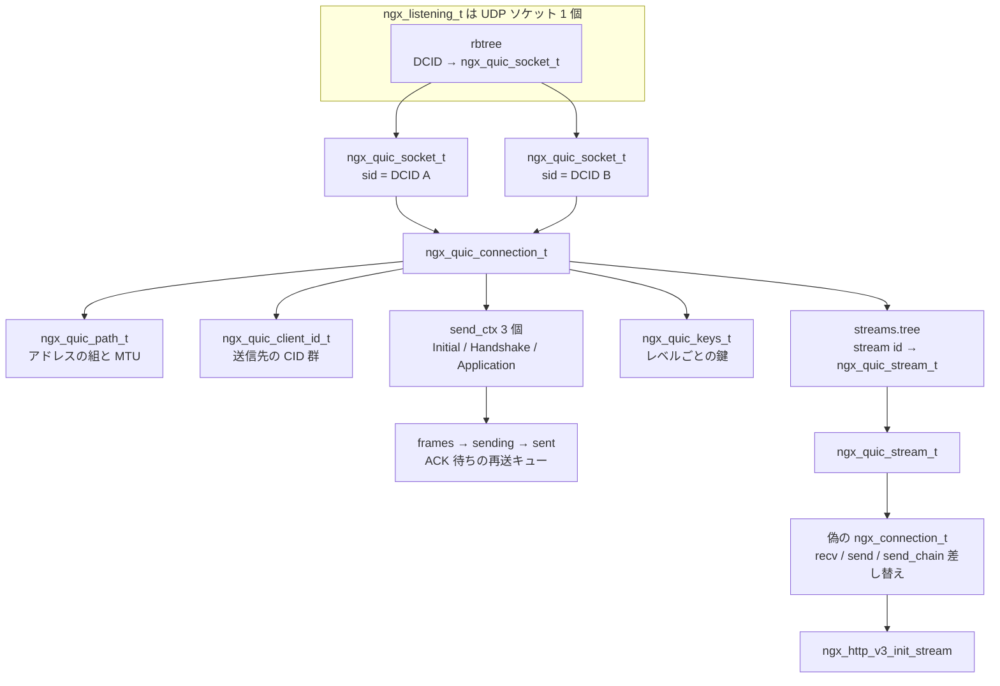

## この層の責務

TCP を使っているとき、Nginx は「バイト列が順番に届く 1 本の管」を前提にできる。その前提を作っているのはカーネルだ。カーネルの TCP スタックは少なくとも次の 5 つを引き受けている。

1. **順序保証** — 届いた順がばらばらでも、シーケンス番号で並べ直してから `read()` に渡す
2. **再送** — ACK が返ってこないセグメントを送り直す
3. **輻輳制御** — 経路が詰まらない範囲でしか送らない
4. **フロー制御** — 受信側のバッファが溢れない範囲でしか送らせない
5. **接続の同一性** — 4-tuple から「どの接続か」を決め、`accept()` した fd に紐づける

QUIC はこの 5 つを全部アプリケーション側に移した。理由は [HTTP/2 と HTTP/3 のページ](../http2-http3/) で見たとおりで、TCP の順序保証がストリーム間に効いてしまう Head-of-Line ブロッキングを消すには、順序保証の粒度を自分で決められる必要があったからだ。

代償は実装量になる。`src/event/quic/` は 30 ファイル 16759 行ある。責務ごとに分けるとこうなる。

| 分類             | ファイル                                        | 行数             | 何をするか                                                                         |
| ---------------- | ----------------------------------------------- | ---------------- | ---------------------------------------------------------------------------------- |
| 入口・全体制御   | `ngx_event_quic.c` / `_udp.c` / `_connection.h` | 1522 / 420 / 326 | `recvmsg()` して DCID で接続を探し、データグラムをパケットに割ってフレームまで配る |
| ワイヤ形式       | `ngx_event_quic_transport.c` / `.h`             | 2215 / 398       | 可変長整数・ヘッダ・フレームのパースと生成                                         |
| 暗号             | `ngx_event_quic_protection.c`                   | 1268             | 鍵導出、AEAD、ヘッダ保護、鍵更新                                                   |
|                  | `ngx_event_quic_ssl.c`                          | 987              | CRYPTO フレームと OpenSSL の QUIC API の橋渡し                                     |
|                  | `ngx_event_quic_openssl_compat.c`               | 652              | QUIC API を持たない OpenSSL 向けの代替                                             |
|                  | `ngx_event_quic_tokens.c`                       | 265              | Retry トークン、stateless reset トークン                                           |
| 接続の同一性     | `ngx_event_quic_connid.c` / `_socket.c`         | 502 / 237        | コネクション ID の発行・退役と「偽の listen 口」                                   |
|                  | `ngx_event_quic_migration.c`                    | 1007             | 経路の検証、経路変更、Path MTU 探索                                                |
| データの並べ直し | `ngx_event_quic_frames.c`                       | 895              | フレーム/バッファの確保、穴あきバッファへの書き込み                                |
| ストリーム       | `ngx_event_quic_streams.c`                      | 1824             | `ngx_quic_stream_t` と偽の `ngx_connection_t`                                      |
| 送信             | `ngx_event_quic_output.c`                       | 1406             | フレームをパケットに詰め、データグラムにして送る                                   |
| 再送・輻輳       | `ngx_event_quic_ack.c`                          | 1456             | ACK 処理、RTT 推定、CUBIC、損失検出、PTO                                           |
| ワーカー分配     | `ngx_event_quic_bpf.c` / `bpf/*.c`              | 657 / 140        | DCID からソケットを選ぶ eBPF のロードと本体                                        |

右の列を読むと、そのまま TCP スタックの目次になっている。**Nginx は QUIC を「新しいプロトコル」としてではなく、「カーネルから持ち帰ったトランスポート層」として実装している。**

このページは、UDP のデータグラムが届いてから `ngx_quic_stream_t` になり、HTTP/3 の層に渡るまでを追う。HTTP/3 側は [HTTP/3 のページ](../http3-layer/) が扱う。

## 主要な型とその関係

### `ngx_quic_connection_t` — QUIC 接続 1 本につき 1 つ

[`src/event/quic/ngx_event_quic_connection.h#L222-L309`](https://github.com/nginx/nginx/blob/release-1.31.4/src/event/quic/ngx_event_quic_connection.h#L222-L309) に 88 行ある。骨格だけ抜くとこうなる。

```c title="src/event/quic/ngx_event_quic_connection.h"
struct ngx_quic_connection_s {
    ngx_quic_path_t                  *path;
    ngx_queue_t                       sockets;
    ngx_queue_t                       paths;
    ngx_queue_t                       client_ids;

    ngx_quic_tp_t                     tp;
    ngx_quic_tp_t                     ctp;
    ngx_quic_send_ctx_t               send_ctx[NGX_QUIC_SEND_CTX_LAST];
    ngx_quic_keys_t                  *keys;

    ngx_event_t                       push;
    ngx_event_t                       pto;
    ngx_event_t                       close;
    ngx_event_t                       path_validation;
    ngx_event_t                       key_update;

    ngx_msec_t                        first_rtt, latest_rtt, avg_rtt;
    ngx_msec_t                        min_rtt, rttvar;

    ngx_queue_t                       free_frames;
    ngx_quic_streams_t                streams;
    ngx_quic_congestion_t             congestion;
    /* ... */
};
```

TCP スタックが持つ状態がそのまま並んでいる。RTT の推定値が 5 個、輻輳制御の状態が `ngx_quic_congestion_t` に、再送待ちのフレームが `send_ctx[]` に。`tp` と `ctp` は transport parameter で、`tp` が自分の宣言、`ctp` が相手の宣言。TCP の window scale や MSS に当たるものを TLS ハンドシェイクの拡張として交換する。

イベントが 5 本入っている。全部 [タイマ赤黒木のページ](../timer-rbtree/) の `ngx_event_t` そのもので、`ngx_add_timer()` と `ngx_post_event()` で回る。**QUIC 用のタイマ機構は作られていない。** `pto` が Probe Timeout、`push` が「送るものがある」の繰り越し、`close` がハンドシェイクのタイムアウトとクローズ後の待機、`path_validation` が経路検証と MTU 探索の期限、`key_update` が鍵更新の遅延実行 ([`ngx_event_quic.c#L272-L290`](https://github.com/nginx/nginx/blob/release-1.31.4/src/event/quic/ngx_event_quic.c#L272-L290))。さらに接続の idle timeout が `c->read` に張られるので、**接続 1 本につきタイマが最大 6 本**同時に生きうる。

### `ngx_quic_socket_t` — DCID ごとの「偽の listen 口」

UDP には接続がない。届いたデータグラムをどの `ngx_quic_connection_t` に渡すかは自分で決める必要がある。

送信元アドレスでは決められない。QUIC の売りの 1 つは、クライアントの IP が変わっても接続が続くこと (経路変更) だからだ。代わりに使うのが **Destination Connection ID (DCID)** で、サーバが発行してクライアントに使わせる不透明な識別子になる。

```c title="src/event/quic/ngx_event_quic_connection.h"
struct ngx_quic_socket_s {
    ngx_udp_connection_t              udp;
    ngx_quic_connection_t            *quic;
    ngx_queue_t                       queue;
    ngx_quic_server_id_t              sid;
    ngx_sockaddr_t                    sockaddr;
    socklen_t                         socklen;
    /* ... */
};
```

先頭の `ngx_udp_connection_t` が効いている。この型は `ngx_rbtree_node_t node` / `ngx_connection_t *connection` / `ngx_buf_t *buffer` / `ngx_str_t key` の 4 つだけを持つ ([`src/event/ngx_event_udp.h#L26-L31`](https://github.com/nginx/nginx/blob/release-1.31.4/src/event/ngx_event_udp.h#L26-L31))。`ngx_rbtree_node_t` が先頭に埋め込まれているので `ngx_quic_socket_t *` と `ngx_rbtree_node_t *` を相互にキャストできる。木は `ngx_listening_t` が持っている ([`src/core/ngx_connection.h#L53-L54`](https://github.com/nginx/nginx/blob/release-1.31.4/src/core/ngx_connection.h#L53-L54))。**listen ソケット 1 個につき赤黒木が 1 本あり、そこに DCID がキーとして入っている。**

1 つの `ngx_quic_connection_t` には `ngx_quic_socket_t` が複数ぶら下がる (`qc->sockets`)。サーバは複数の DCID を同時に有効にしておき、クライアントは経路を変えるときに未使用の DCID へ切り替える。ID が変わるので、経路上の観測者からは「同じ接続が移動した」と分からない。対になる `ngx_quic_client_id_t` はクライアント側の ID で、サーバが送るときの宛先 CID になる。

経路そのものは `ngx_quic_path_t` として別に持つ ([`#L108-L130`](https://github.com/nginx/nginx/blob/release-1.31.4/src/event/quic/ngx_event_quic_connection.h#L108-L130))。アドレスの組と、`mtu` / `mtud` / `max_mtu` と、`validated` フラグと、PATH_CHALLENGE 用の 8 バイト × 2 が入っている。**Path MTU Discovery も経路検証も経路ごとの状態**として持たれ、`ngx_quic_migration.c` の 1007 行がそれを回す。

### `ngx_quic_send_ctx_t` — パケット番号空間 3 つ

QUIC はパケット番号空間を 3 つ持つ。ヘッダのコメントがそのまま説明になっている ([`#L58-L68`](https://github.com/nginx/nginx/blob/release-1.31.4/src/event/quic/ngx_event_quic_connection.h#L58-L68))。

```c title="src/event/quic/ngx_event_quic_connection.h"
/*  0-RTT and 1-RTT data exist in the same packet number space,
 *  so we have 3 packet number spaces:
 *
 *  0 - Initial
 *  1 - Handshake
 *  2 - 0-RTT and 1-RTT
 */
#define ngx_quic_get_send_ctx(qc, level)                                      \
    ((level) == NGX_QUIC_ENCRYPTION_INITIAL) ? &((qc)->send_ctx[0])           \
        : (((level) == NGX_QUIC_ENCRYPTION_HANDSHAKE) ? &((qc)->send_ctx[1])  \
                                                      : &((qc)->send_ctx[2]))
```

暗号レベルは 4 つあるが送信コンテキストは 3 つ。各コンテキストが再送機構そのものになる ([`#L197-L219`](https://github.com/nginx/nginx/blob/release-1.31.4/src/event/quic/ngx_event_quic_connection.h#L197-L219))。

```c title="src/event/quic/ngx_event_quic_connection.h"
    ngx_queue_t                       frames;      /* generated frames */
    ngx_queue_t                       sending;     /* frames assigned to pkt */
    ngx_queue_t                       sent;        /* frames waiting ACK */
```

キューが 3 本ある。`frames` が「作ったがまだパケットに入れていない」、`sending` が「今組み立てているパケットに入れた」、`sent` が「送った、ACK 待ち」。**送信済みのフレームを ACK が来るまで捨てない。** これが TCP の再送キューに当たる。同じ構造体に `pnum` (次に送る番号)、`largest_ack` / `largest_pn` (相手から受け取った最大値)、ハンドシェイク用の `crypto` バッファ、そして ACK 生成用の `ranges[NGX_QUIC_MAX_RANGES]` が入る。`NGX_QUIC_MAX_RANGES` は 10 で、抜けの範囲を無制限には覚えない。

### `ngx_quic_frame_t` — 20 種のフレームを 1 つの union で

フレーム型は `0x00` の PADDING から `0x1e` の HANDSHAKE_DONE まで定義されている ([`ngx_event_quic_transport.h#L58-L90`](https://github.com/nginx/nginx/blob/release-1.31.4/src/event/quic/ngx_event_quic_transport.h#L58-L90))。STREAM だけは `0x08`〜`0x0f` の 8 個を使い、下位 3 ビットが OFF / LEN / FIN のフラグになる。

これらが 1 つの構造体で表される ([`#L263-L297`](https://github.com/nginx/nginx/blob/release-1.31.4/src/event/quic/ngx_event_quic_transport.h#L263-L297))。

```c title="src/event/quic/ngx_event_quic_transport.h"
struct ngx_quic_frame_s {
    ngx_uint_t                                  type;
    ngx_uint_t                                  level;
    ngx_queue_t                                 queue;
    uint64_t                                    pnum;
    size_t                                      plen;
    ngx_msec_t                                  send_time;
    unsigned                                    need_ack:1;
    unsigned                                    pkt_need_ack:1;
    /* ... */
    ngx_chain_t                                *data;
    union {
        ngx_quic_ack_frame_t                    ack;
        ngx_quic_ordered_frame_t                ord;
        /* ... 全部で 16 メンバ ... */
    } u;
};
```

共通部分に `queue` と `pnum` と `send_time` が入っているのが要点で、**型を問わずキューに繋げて「どのパケットでいつ送ったか」を覚えられる。** 再送と RTT 推定はこの共通部分しか見ない。CRYPTO と STREAM のペイロードは `data` の `ngx_chain_t` に入り、[`ngx_buf_t` のチェイン](../buf-chain/) をそのまま使い回している。

union の中で 1 つだけ特別なのが `ngx_quic_ordered_frame_t` で、`offset` と `length` の 2 フィールドしか持たない ([`#L172-L194`](https://github.com/nginx/nginx/blob/release-1.31.4/src/event/quic/ngx_event_quic_transport.h#L172-L194))。

```c title="src/event/quic/ngx_event_quic_transport.h"
/*
 * common layout for CRYPTO and STREAM frames;
 * conceptually, CRYPTO frame is also a stream
 * frame lacking some properties
 */
```

`ngx_quic_crypto_frame_t` はその typedef で、`ngx_quic_stream_frame_t` は同じ 2 フィールドを先頭に置いた構造体として定義される。**「オフセットと長さを持つ、並べ直しが要るデータ」という抽象を先に切ってある。** TLS ハンドシェイクのバイト列も HTTP のリクエストボディも、同じ `ngx_quic_write_buffer()` で穴を埋めながら組み立てられる。

### `ngx_quic_stream_t` — また偽の `ngx_connection_t`

[`src/event/quic/ngx_event_quic.h#L105-L127`](https://github.com/nginx/nginx/blob/release-1.31.4/src/event/quic/ngx_event_quic.h#L105-L127)。

```c title="src/event/quic/ngx_event_quic.h"
struct ngx_quic_stream_s {
    ngx_rbtree_node_t              node;
    ngx_connection_t              *parent;
    ngx_connection_t              *connection;
    uint64_t                       id;
    /* ... send_max_data / send_offset / send_final_size ... */
    /* ... recv_max_data / recv_offset / recv_window / recv_final_size ... */
    ngx_quic_buffer_t              send;
    ngx_quic_buffer_t              recv;
    ngx_quic_stream_send_state_e   send_state;
    ngx_quic_stream_recv_state_e   recv_state;
    /* ... */
};
```

`parent` が本物の UDP 接続、`connection` が **このストリームのために作られた `ngx_connection_t`** になる。[HTTP/2 のページ](../http2-multiplexing/) と同じ発想で、上位から見るとストリームがただの接続に見える。ただし HTTP/2 が親の接続を `ngx_memcpy` で丸ごとコピーするのに対し、QUIC は `ngx_get_connection()` で新しく取ってから必要なフィールドを埋める。

送受信それぞれに状態機械があり、どちらも 6 状態 ([`#L51-L68`](https://github.com/nginx/nginx/blob/release-1.31.4/src/event/quic/ngx_event_quic.h#L51-L68))。RFC 9000 の状態遷移図をそのまま enum にしてある。バッファは `ngx_quic_buffer_t` で、`offset` が「このチェインの先頭がストリーム全体の何バイト目か」を持つので、穴あきのまま保持できる。

### 全体の関係



## 処理の流れ

### 1. listen ソケットの read ハンドラを選ぶ

`listen ... quic` が付いた `ngx_listening_t` には `quic` フラグが立ち ([`src/http/ngx_http.c#L1887-L1889`](https://github.com/nginx/nginx/blob/release-1.31.4/src/http/ngx_http.c#L1887-L1889))、ワーカー起動時のハンドラ選択でそれが効く ([`src/event/ngx_event.c#L894-L903`](https://github.com/nginx/nginx/blob/release-1.31.4/src/event/ngx_event.c#L894-L903))。

```c title="src/event/ngx_event.c"
        if (c->type == SOCK_STREAM) {
            rev->handler = ngx_event_accept;
#if (NGX_QUIC)
        } else if (ls[i].quic) {
            rev->handler = ngx_quic_recvmsg;
#endif
        } else {
            rev->handler = ngx_event_recvmsg;
        }
```

3 択になっている。TCP なら [`accept()` から `ngx_connection_t` へ](../accept-to-connection/) の道、素の UDP なら `ngx_event_recvmsg`、QUIC なら `ngx_quic_recvmsg`。**QUIC は素の UDP とも別の入口を持つ。** 素の UDP のセッション同定はアドレスの組で足りるが、QUIC は DCID を見るからだ。

### 2. `ngx_quic_recvmsg()` — DCID で既存接続を探す

`recvmsg()` の直後がこうなる ([`ngx_event_quic_udp.c#L155-L204`](https://github.com/nginx/nginx/blob/release-1.31.4/src/event/quic/ngx_event_quic_udp.c#L155-L204))。

```c title="src/event/quic/ngx_event_quic_udp.c"
        if (ngx_quic_get_packet_dcid(ev->log, buffer, n, &key) != NGX_OK) {
            goto next;
        }

        c = ngx_quic_lookup_connection(ls, &key, local_sockaddr, local_socklen);

        if (c) {
            /* ... buf に buffer[0..n) を指させる ... */
            qsock = ngx_quic_get_socket(c);
            ngx_memcpy(&qsock->sockaddr, sockaddr, socklen);
            qsock->socklen = socklen;

            c->udp->buffer = &buf;

            rev = c->read;
            rev->ready = 1;
            rev->active = 0;
            rev->handler(rev);
```

**スタック上の `ngx_buf_t` を `c->udp->buffer` に置いて read ハンドラを直接呼ぶ。** 呼び終わったら `c->udp->buffer = NULL` に戻す。ソケットから読むのではなく、読んだものを渡す形になっている。

受信バッファは `static u_char buffer[NGX_QUIC_MAX_UDP_PAYLOAD_SIZE]` の 1 個だけで、`NGX_QUIC_MAX_UDP_PAYLOAD_SIZE` は 65527。1 ワーカーが 1 スレッドで 1 データグラムの処理を最後までやってから次を読むので、接続ごとの受信バッファが要らない。

DCID の取り出しは、パケットを本格的にパースする前にバイトオフセットだけで済ませる ([`ngx_event_quic_transport.c#L518-L529`](https://github.com/nginx/nginx/blob/release-1.31.4/src/event/quic/ngx_event_quic_transport.c#L518-L529))。ロングヘッダなら `data[NGX_QUIC_LONG_DCID_LEN_OFFSET]` から長さを読み、ショートヘッダなら長さフィールドが無いので `NGX_QUIC_SERVER_CID_LEN` を使う。つまり **サーバが発行する CID の長さは固定 (20 バイト) にしてある**。`NGX_QUIC_SERVER_CID_LEN` が `NGX_QUIC_MAX_CID_LEN` と同じ 20 で定義されているのがそれだ。

木の探索はキーが DCID の CRC32 で、ハッシュが一致したら実際のバイト列を `ngx_memn2cmp()` で比べ、`ls->wildcard` ならローカルアドレスも照合する。見つかった時にやることが 1 つある ([`ngx_event_quic_udp.c#L411-L414`](https://github.com/nginx/nginx/blob/release-1.31.4/src/event/quic/ngx_event_quic_udp.c#L411-L414))。

```c title="src/event/quic/ngx_event_quic_udp.c"
        if (rc == 0) {
            c->udp = &qsock->udp;
            return c;
        }
```

**同じ接続でも「どの DCID で来たか」によって `c->udp` の指す先が変わる。** 以降のコードは `ngx_quic_get_socket(c)` でそれを読む。

見つからなければ新規接続として `ngx_get_connection()` から作り、`ls->handler(c)` を呼ぶ。HTTP ならその先は `ngx_http_init_connection()` で、`addr_conf->quic` を見て `ngx_http_v3_init_stream()` に飛ぶ ([`src/http/ngx_http_request.c#L331-L336`](https://github.com/nginx/nginx/blob/release-1.31.4/src/http/ngx_http_request.c#L331-L336))。

### 3. `ngx_quic_run()` — 最初のデータグラムで接続を作る

[`ngx_event_quic.c#L200-L228`](https://github.com/nginx/nginx/blob/release-1.31.4/src/event/quic/ngx_event_quic.c#L200-L228)。

```c title="src/event/quic/ngx_event_quic.c"
    rc = ngx_quic_handle_datagram(c, c->buffer, conf);
    /* ... */
    /* quic connection is now created */
    qc = ngx_quic_get_connection(c);

    ngx_add_timer(c->read, qc->tp.max_idle_timeout);

    if (!qc->streams.initialized) {
        ngx_add_timer(&qc->close, qc->conf->handshake_timeout);
    }
    /* ... */
    c->read->handler = ngx_quic_input_handler;
```

`ngx_quic_get_connection(c)` はマクロで、`c->udp` を `ngx_quic_socket_t *` と見なして `quic` を取る ([`ngx_event_quic_connection.h#L70-L73`](https://github.com/nginx/nginx/blob/release-1.31.4/src/event/quic/ngx_event_quic_connection.h#L70-L73))。`ngx_connection_t` に QUIC 用のフィールドを足さず、既にある `udp` を経由している。

以後の read ハンドラ `ngx_quic_input_handler` は、冒頭で `c->udp->buffer` が NULL なら何もせずに帰る。**このハンドラは「読めるようになった」ではなく「データグラムが渡された」で呼ばれる**ので、バッファが無いということは呼び出し元が別の理由 (タイムアウトやクローズ) で呼んだということになる。

### 4. データグラムをパケットに割る

1 つの UDP データグラムに暗号レベルの違うパケットが複数入っていることがある。Initial と Handshake をまとめて送るのが典型だ。`ngx_quic_handle_datagram()` がそれをほどく ([`#L693-L753`](https://github.com/nginx/nginx/blob/release-1.31.4/src/event/quic/ngx_event_quic.c#L693-L753))。

```c title="src/event/quic/ngx_event_quic.c"
    while (p < b->last) {

        ngx_memzero(&pkt, sizeof(ngx_quic_header_t));
        pkt.raw = b;
        pkt.data = p;
        pkt.len = b->last - p;
        pkt.first = (p == start) ? 1 : 0;
        pkt.path = path;
        pkt.flags = p[0];
        pkt.raw->pos++;

        rc = ngx_quic_handle_packet(c, conf, &pkt);
        /* ... */
        path = pkt.path; /* preserve packet path from 1st packet */

        /* b->pos is at header end, adjust by actual packet length */
        p = b->pos = pkt.data + pkt.len;
    }
```

復号できないパケットは捨てる。コメントが根拠を書いている。

```c title="src/event/quic/ngx_event_quic.c"
        /*
         * we get NGX_DECLINED when there are no keys [yet] available
         * to decrypt packet.
         * Instead of queueing it, we ignore it and rely on the sender's
         * retransmission:
         */
```

**バッファリングせず、相手の再送に任せる。** 到着順が逆転して「Handshake が Initial より先に着いた」ようなときに、キューを持たずに済ませている。信頼できる再送機構が下にあるからできる割り切りだ。

末尾には flood 検出が入っている ([`#L764-L772`](https://github.com/nginx/nginx/blob/release-1.31.4/src/event/quic/ngx_event_quic.c#L764-L772))。

```c title="src/event/quic/ngx_event_quic.c"
        if ((uint64_t) (c->sent + qc->received) / 8 >
            (qc->streams.sent + qc->streams.recv_last) + 1048576)
        {
            ngx_log_error(NGX_LOG_INFO, c->log, 0, "quic flood detected");
```

送受信した総バイト数がストリームで実際に運んだバイト数の 8 倍を超え、かつ 1MB 以上離れたら切る。**「制御フレームばかり送りつけてくる相手」を比で検出している。**

### 5. パケットのパース — 可変長整数とヘッダ

QUIC のワイヤ形式は可変長整数だらけだ。先頭 2 ビットが長さを表す ([`ngx_event_quic_transport.c#L144-L171`](https://github.com/nginx/nginx/blob/release-1.31.4/src/event/quic/ngx_event_quic_transport.c#L144-L171))。

```c title="src/event/quic/ngx_event_quic_transport.c"
    p = pos;
    len = 1 << (*p >> 6);

    value = *p++ & 0x3f;

    if ((size_t)(end - p) < (len - 1)) {
        return NULL;
    }

    while (--len) {
        value = (value << 8) + *p++;
    }

    *out = value;
    return p;
```

`1 << (*p >> 6)` で 1・2・4・8 バイトを決め、残り 6 ビットを最上位に使う。**戻り値がポインタで、失敗が `NULL`。** バウンドチェックが関数の中にあるので呼ぶ側は `if (p == NULL)` を書くだけでよく、パーサ全体でこの規約が徹底されている。

ヘッダ形式は先頭バイトの最上位ビット `NGX_QUIC_PKT_LONG` (`0x80`) で決まり、ロングパケットの型は続く 2 ビットで Initial / 0-RTT / Handshake / Retry の 4 種になる ([`ngx_event_quic_transport.h#L21-L42`](https://github.com/nginx/nginx/blob/release-1.31.4/src/event/quic/ngx_event_quic_transport.h#L21-L42))。

ロングヘッダはバージョンと両方の CID を持ち、ハンドシェイク中だけ使う。終わるとショートヘッダになり、バージョンも SCID も消えて DCID だけが残る。ヘッダのオーバーヘッドを削るためで、これが「ショートヘッダの DCID 長を固定にせざるを得ない」理由になっている。ロングヘッダのパースが `ngx_quic_parse_long_header()` と `..._v1()` の 2 段になっているのはバージョンネゴシエーションのためで、まずバージョンまで読み、知らないバージョンなら `NGX_ABORT` を返してバージョン一覧を返送する。

### 6. 復号 — ヘッダ保護とペイロード保護

Initial パケットの鍵は、**クライアントが送ってきた DCID から導出される** ([`ngx_event_quic_protection.c#L134-L191`](https://github.com/nginx/nginx/blob/release-1.31.4/src/event/quic/ngx_event_quic_protection.c#L134-L191))。

```c title="src/event/quic/ngx_event_quic_protection.c"
    /* ... ngx_hkdf_extract(is, &is_len, digest, secret->data, secret->len,
           salt, sizeof(salt)) ... */

    /* labels per RFC 9001, 5.1. Packet Protection Keys */
    ngx_quic_hkdf_set(&seq[0], "tls13 client in", &client->secret, &iss);
    ngx_quic_hkdf_set(&seq[1], "tls13 quic key", &client_key, &client->secret);
    ngx_quic_hkdf_set(&seq[2], "tls13 quic iv", &client->iv, &client->secret);
    ngx_quic_hkdf_set(&seq[3], "tls13 quic hp", &client->hp, &client->secret);
```

`salt` は RFC 9001 に書かれた 20 バイトの定数、`secret` は呼び出し側を見ると `&pkt->dcid` になっている ([`ngx_event_quic.c#L334`](https://github.com/nginx/nginx/blob/release-1.31.4/src/event/quic/ngx_event_quic.c#L334))。

これは**秘密ではない**。誰でも同じ計算ができるので、Initial パケットの暗号化は盗聴対策にならない。目的は経路上の中間装置が中身を見て勝手な解釈をするのを防ぐこと (ossification 対策) と、ヘッダの改変を検出することだ。

鍵が 3 種類導出されている点に注目したい。`key` (AEAD の鍵)、`iv` (nonce の元)、`hp` (**ヘッダ保護**の鍵)。ヘッダ保護は QUIC 特有で、暗号文の一部をサンプルとして使い、パケット番号とフラグの下位ビットをマスクする ([`#L1145-L1166`](https://github.com/nginx/nginx/blob/release-1.31.4/src/event/quic/ngx_event_quic_protection.c#L1145-L1166))。

```c title="src/event/quic/ngx_event_quic_protection.c"
    /*
     * RFC 9001, 5.4.2. Header Protection Sample
     * ...
     * the Packet Number field is assumed to be 4 bytes long
     * AES and ChaCha20 algorithms sample 16 bytes
     */

    if (len < NGX_QUIC_TAG_LEN + 4) {
        return NGX_DECLINED;
    }

    sample = p + 4;
    /* ... ngx_quic_crypto_hp(secret, mask, sample, pkt->log) ... */
    pkt->flags ^= mask[0] & ngx_quic_pkt_hp_mask(pkt->flags);
```

**パケット番号の長さを知るにはフラグを復号する必要があり、フラグを復号するにはパケット番号の後ろからサンプルを取る必要がある。** この鶏と卵を「パケット番号は常に 4 バイトあると仮定してサンプル位置を決める」で解いている。実際の長さは復号後のフラグ下位 2 ビットで分かる。

その後がペイロードの復号だ。AEAD の追加認証データがヘッダ全体になるので、マスクを外した後のフラグとパケット番号を書き戻してから渡す ([`#L1205-L1216`](https://github.com/nginx/nginx/blob/release-1.31.4/src/event/quic/ngx_event_quic_protection.c#L1205-L1216))。nonce は `ngx_quic_compute_nonce()` が IV とパケット番号の XOR で作る。**パケット番号が nonce に入るので、同じ鍵で同じ番号を 2 回使ってはいけない**という制約がここから来る。

鍵更新はショートヘッダの Key Phase ビット 1 個で表される。ビットが反転していたら次の鍵で試すが、次の鍵が用意できていなくても分岐せず、**古い鍵のまま復号を試みて失敗させる**。分岐で時間差が出るのを避けるためだとコメントに書いてある ([`#L1177-L1181`](https://github.com/nginx/nginx/blob/release-1.31.4/src/event/quic/ngx_event_quic_protection.c#L1177-L1181))。

### 7. フレームに配る

復号できたら `ngx_quic_handle_frames()` がペイロードをフレームに刻んで配る。`ngx_quic_frame_t` はスタックに置いて使い回す。受信側では所有権を持ち越さないので確保が要らない。

分類が 2 段になっている。1 段目 ([`#L1218-L1230`](https://github.com/nginx/nginx/blob/release-1.31.4/src/event/quic/ngx_event_quic.c#L1218-L1230)) は PADDING / PATH_CHALLENGE / PATH_RESPONSE / NEW_CONNECTION_ID だけを probing とし、それ以外で `nonprobing = 1` を立てる。経路変更の判定に使うためで、「経路検証のためのフレームだけが来た」なら経路が変わったとは見なさない。

2 段目が本体になる ([`#L1232-L1252`](https://github.com/nginx/nginx/blob/release-1.31.4/src/event/quic/ngx_event_quic.c#L1232-L1252))。

```c title="src/event/quic/ngx_event_quic.c"
        switch (frame.type) {

        case NGX_QUIC_FT_ACK:
            /* ... ngx_quic_handle_ack_frame ... */
            continue;

        case NGX_QUIC_FT_PADDING:
            /* no action required */
            continue;

        case NGX_QUIC_FT_CONNECTION_CLOSE:
        case NGX_QUIC_FT_CONNECTION_CLOSE_APP:
            do_close = 1;
            continue;
        }

        /* got there with ack-eliciting packet */
        pkt->need_ack = 1;
```

ACK・PADDING・CONNECTION_CLOSE の 3 つを先に `continue` で抜いてから `need_ack = 1` を立てている。**「ACK を返すべきパケットか」の判定を、switch の位置で表している。** これら 3 つだけを含むパケットに ACK を返すと、ACK に対する ACK が無限に往復してしまう。

### 8. CRYPTO フレーム — TLS へ渡す

ハンドシェイクのバイト列は CRYPTO フレームで運ばれる ([`ngx_event_quic_ssl.c#L644-L680`](https://github.com/nginx/nginx/blob/release-1.31.4/src/event/quic/ngx_event_quic_ssl.c#L644-L680))。

```c title="src/event/quic/ngx_event_quic_ssl.c"
    /* no overflow since both values are 62-bit */
    last = f->offset + f->length;

    if (last > ctx->crypto.offset + NGX_QUIC_MAX_BUFFERED) {
        qc->error = NGX_QUIC_ERR_CRYPTO_BUFFER_EXCEEDED;
        return NGX_ERROR;
    }
    /* ... ngx_quic_write_buffer(c, &ctx->crypto, frame->data,
           f->length, f->offset) ... */
    return ngx_quic_handshake(c);
```

`NGX_QUIC_MAX_BUFFERED` は 65535 ([`#L18`](https://github.com/nginx/nginx/blob/release-1.31.4/src/event/quic/ngx_event_quic_ssl.c#L18))。**先のオフセットのデータばかり送って穴を埋めない相手に、無限にバッファを使わせない。**

順序の復元は `ngx_quic_write_buffer()` がやる ([`ngx_event_quic_frames.c#L566-L595`](https://github.com/nginx/nginx/blob/release-1.31.4/src/event/quic/ngx_event_quic_frames.c#L566-L595))。

```c title="src/event/quic/ngx_event_quic_frames.c"
        if (cl == NULL) {
            cl = ngx_quic_alloc_chain(c);
            /* ... */
            cl->buf->last = cl->buf->end;
            cl->buf->sync = 1; /* hole */
            *chain = cl;
        }
        /* ... */
        if (b->sync && offset > base) {
            if (ngx_quic_split_chain(c, cl, offset - base) != NGX_OK) {
                return NGX_CHAIN_ERROR;
            }
            continue;
        }
```

**`sync` フラグを「穴」の意味に転用している。** 先のオフセットのデータが来たら間を埋める穴のバッファを確保して `sync = 1` を立て、後から手前のデータが来たら穴を分割して埋める。`ngx_buf_t` の既存のフラグを再利用しているので専用の構造体が要らない。`last_chain` / `last_offset` のキャッシュがあるので、順番どおりに来る通常のケースは末尾に追記するだけで済む。

揃ったぶんは `ngx_quic_crypto_provide()` が `SSL_provide_quic_data()` で OpenSSL に渡す。TLS の側はレコード層を使わない QUIC 用の API に載っている ([`ngx_event_quic_ssl.c#L909-L921`](https://github.com/nginx/nginx/blob/release-1.31.4/src/event/quic/ngx_event_quic_ssl.c#L909-L921))。

```c title="src/event/quic/ngx_event_quic_ssl.c"
        quic_method.set_encryption_secrets = ngx_quic_set_encryption_secrets;
        quic_method.add_handshake_data = ngx_quic_add_handshake_data;
        quic_method.flush_flight = ngx_quic_flush_flight;
        quic_method.send_alert = ngx_quic_send_alert;
    }

    if (SSL_set_quic_method(ssl_conn, &quic_method) == 0) {
```

コールバック 4〜5 本で「鍵ができた」「送るデータができた」を受け取る。[TLS 層のページ](../ssl-layer/) で見た `c->recv` / `c->send` の差し替えとはまったく別の繋ぎ方で、**BIO を使わない。** OpenSSL のバージョンによって API が 4 通りあり、どれも無い環境向けには `ngx_event_quic_openssl_compat.c` の 652 行が TLS レコードを自前で組んで代替する。

### 9. STREAM フレーム — 偽の接続を起こす

[`ngx_event_quic_streams.c#L1282-L1299`](https://github.com/nginx/nginx/blob/release-1.31.4/src/event/quic/ngx_event_quic_streams.c#L1282-L1299)。

```c title="src/event/quic/ngx_event_quic_streams.c"
    if (ngx_quic_control_flow(qs, last) != NGX_OK) {
        return NGX_ERROR;
    }

    if (last < qs->recv_offset) {
        return NGX_OK;
    }

    if (f->fin) {
        qs->recv_final_size = last;
        qs->recv_state = NGX_QUIC_STREAM_RECV_SIZE_KNOWN;
    }

    if (ngx_quic_write_buffer(c, &qs->recv, frame->data, f->length, f->offset)
```

CRYPTO と同じ `ngx_quic_write_buffer()` が出てくる。宛先が `ctx->crypto` から `qs->recv` に変わるだけだ。

ストリームを引く `ngx_quic_get_stream()` は `NGX_QUIC_STREAM_GONE` という戻り値を持つ。閉じたストリーム宛のフレームは遅れて届くのが普通なので、エラーにしてはいけない ([`#L404-L426`](https://github.com/nginx/nginx/blob/release-1.31.4/src/event/quic/ngx_event_quic_streams.c#L404-L426))。

```c title="src/event/quic/ngx_event_quic_streams.c"
        if ((id >> 2) < qc->streams.client_streams_uni) {
            return NGX_QUIC_STREAM_GONE;
        }

        if ((id >> 2) >= qc->streams.client_max_streams_uni) {
            qc->error = NGX_QUIC_ERR_STREAM_LIMIT_ERROR;
            return NULL;
        }
```

ストリーム ID の下位 2 ビットが「開始側」と「双方向か」を表すので、`id >> 2` が種類ごとの通し番号になる。今までに作った数より小さければ既に閉じたものだと判定できる。**閉じたストリームを覚えておく必要がない。**

### 10. 新しいストリームに `ngx_connection_t` を作る

`ngx_quic_create_stream()` は 169 行ある ([`#L649-L817`](https://github.com/nginx/nginx/blob/release-1.31.4/src/event/quic/ngx_event_quic_streams.c#L649-L817))。核だけ抜くとこうなる。

```c title="src/event/quic/ngx_event_quic_streams.c"
    sc = ngx_get_connection(c->fd, log);
    /* ... */
    qs->connection = sc;

    sc->quic = qs;
    sc->shared = 1;
    sc->type = SOCK_STREAM;
    sc->pool = pool;
    sc->ssl = c->ssl;
    sc->listening = c->listening;
    sc->tcp_nodelay = NGX_TCP_NODELAY_DISABLED;

    sc->recv = ngx_quic_stream_recv;
    sc->send = ngx_quic_stream_send;
    sc->send_chain = ngx_quic_stream_send_chain;
    /* ... */
```

`ngx_get_connection(c->fd, ...)` で **親と同じ fd を持つ `ngx_connection_t` を取る**。`shared = 1` が立っているのはそのためで、`ngx_close_connection()` で `close()` されない。`type` を `SOCK_STREAM` にして上位から TCP 接続に見せる。

`recv` / `send` / `send_chain` を差し替えるのは [TLS 層](../ssl-layer/) とまったく同じ手口だ。層が変わっても入れ替えるフックが同じなので、上位はどちらも意識しない。中身はソケットに触らない ([`#L879-L911`](https://github.com/nginx/nginx/blob/release-1.31.4/src/event/quic/ngx_event_quic_streams.c#L879-L911))。

```c title="src/event/quic/ngx_event_quic_streams.c"
    in = ngx_quic_read_buffer(pc, &qs->recv, size);
    /* ... in のチェインを buf にコピーして len を数える ... */
    ngx_quic_free_chain(pc, in);

    if (len == 0) {
        rev->ready = 0;
        /* ... */
        if (qs->recv_state == NGX_QUIC_STREAM_RECV_DATA_READ) {
            rev->eof = 1;
            return 0;
        }

        return NGX_AGAIN;
    }
```

`qs->recv` のチェインからコピーして返すだけで、空なら `NGX_AGAIN`、FIN まで読み切っていれば `eof = 1` にして 0 を返す。`read()` の戻り値の規約をそのまま真似ているので、上位のパーサはこれが QUIC だと気づかない。

作った接続をアプリケーションに渡すのはポストイベント経由で、ハンドラは `c->listening->handler(c)` を呼ぶだけになる ([`#L554-L575`](https://github.com/nginx/nginx/blob/release-1.31.4/src/event/quic/ngx_event_quic_streams.c#L554-L575))。これは TCP で `accept()` した直後に呼ばれるのと同じ関数だ。HTTP なら `ngx_http_init_connection()`。**「新しい接続ができた」の入口が 1 本に揃っている。**

ただし TLS ハンドシェイクが終わるまでは呼べない。ハンドシェイク前に届いたストリームは `qc->streams.uninitialized` に溜まり、完了時にまとめてポストされる ([`#L625-L639`](https://github.com/nginx/nginx/blob/release-1.31.4/src/event/quic/ngx_event_quic_streams.c#L625-L639))。

```c title="src/event/quic/ngx_event_quic_streams.c"
    if (qc->conf->init) {
        if (qc->conf->init(c) != NGX_OK) {
            return NGX_ERROR;
        }
    }

    for (q = ngx_queue_head(&qc->streams.uninitialized); /* ... */ ) {
        qs = ngx_queue_data(q, ngx_quic_stream_t, queue);
        ngx_post_event(qs->connection->read, &ngx_posted_events);
    }

    qc->streams.initialized = 1;
```

`qc->conf->init` は上位アプリケーションのフックで、HTTP/3 なら `ngx_http_v3_init` が入る。**QUIC 層は HTTP/3 を名指ししない。** `ngx_quic_conf_t` の関数ポインタ 2 本 (`init` / `shutdown`) だけで繋がっている。

### 11. 送って、ACK で消す

送信の入口は `ngx_quic_output()` ([`ngx_event_quic_output.c#L83-L108`](https://github.com/nginx/nginx/blob/release-1.31.4/src/event/quic/ngx_event_quic_output.c#L83-L108))。

```c title="src/event/quic/ngx_event_quic_output.c"
    in_flight = cg->in_flight;
    /* ... GSO が使えれば create_segments、そうでなければ create_datagrams ... */

    if (in_flight == cg->in_flight || qc->closing) {
        /* no ack-eliciting data was sent or we are done */
        return NGX_OK;
    }
    /* ... send_timer_set が立っていなければ idle timeout を張り直す ... */
    ngx_quic_set_lost_timer(c);
```

`in_flight` が変わったかどうかで「ACK を要求するデータを送ったか」を判定し、送っていれば損失検出タイマを張る。GSO (`UDP_SEGMENT`) が使えれば複数パケットを 1 回の `sendmsg()` にまとめる。

送った後の状態遷移が `ngx_quic_commit_send()` だ ([`#L221-L236`](https://github.com/nginx/nginx/blob/release-1.31.4/src/event/quic/ngx_event_quic_output.c#L221-L236))。

```c title="src/event/quic/ngx_event_quic_output.c"
        while (!ngx_queue_empty(&ctx->sending)) {

            q = ngx_queue_head(&ctx->sending);
            f = ngx_queue_data(q, ngx_quic_frame_t, queue);

            ngx_queue_remove(q);

            if (f->pkt_need_ack && !qc->closing) {
                ngx_queue_insert_tail(&ctx->sent, q);
                cg->in_flight += f->plen;

            } else {
                ngx_quic_free_frame(c, f);
            }
        }
```

**ACK を要求するフレームだけが `sent` キューに移り、`in_flight` に計上される。** ACK や PADDING だけのパケットは送ったら捨てる。`sending` という中間キューがあるのは、組み立て途中で送信に失敗したときに `ngx_quic_revert_send()` で巻き戻せるようにするためだ。

ACK が届くと、その範囲のフレームが `sent` から外れる ([`ngx_event_quic_ack.c#L274-L315`](https://github.com/nginx/nginx/blob/release-1.31.4/src/event/quic/ngx_event_quic_ack.c#L274-L315))。

```c title="src/event/quic/ngx_event_quic_ack.c"
    while (q != ngx_queue_sentinel(&ctx->sent)) {

        f = ngx_queue_data(q, ngx_quic_frame_t, queue);
        q = ngx_queue_next(q);

        if (f->pnum > max) {
            break;
        }

        if (f->pnum >= min) {
            ngx_quic_congestion_ack(c, f);

            switch (f->type) {
            /* ... ACK なら受信レンジを刈り、
                   STREAM なら ngx_quic_handle_stream_ack() ... */
            }
            /* ... send_time を集めて RTT サンプルに使う ... */
            ngx_queue_remove(&f->queue);
            ngx_quic_free_frame(c, f);
            found = 1;
        }
    }
```

`sent` はパケット番号順なので範囲の外に出たら `break` できる。輻輳ウィンドウを更新し、STREAM フレームなら送信バッファを解放する。

フレームの解放はフリーリストへの返却になる ([`ngx_event_quic_frames.c#L205-L233`](https://github.com/nginx/nginx/blob/release-1.31.4/src/event/quic/ngx_event_quic_frames.c#L205-L233))。[メモリプール](../memory-pool/) は個別解放ができないので、接続プールから取ったフレームを自前のフリーリストで回し、上限 `max_frames` を超えたら flood と見なして NULL を返す。上限は同時ストリーム数とストリームバッファサイズから計算される ([`ngx_event_quic.c#L322-L324`](https://github.com/nginx/nginx/blob/release-1.31.4/src/event/quic/ngx_event_quic.c#L322-L324))。受信も送信も同じフリーリストを使うので、片方が食い潰さないよう上限が接続単位で置かれている。

### 12. 経路が変わったとき

`ngx_quic_set_path()` が、復号できたパケットごとに送信元アドレスを `qc->paths` の各要素と `ngx_cmp_sockaddr()` で照合し、どれとも一致しなければ新しい経路として扱う ([`ngx_event_quic_migration.c#L326-L344`](https://github.com/nginx/nginx/blob/release-1.31.4/src/event/quic/ngx_event_quic_migration.c#L326-L344))。

**照合が復号の後にある**のが要点だ。アドレスだけで判断すると、送信元を偽装したパケットで経路を切り替えさせられる。復号できて初めて「本当にこの接続の相手だ」と言える。新しい経路には PATH_CHALLENGE を送り、PATH_RESPONSE が返るまで `validated` を立てない。検証前は増幅攻撃対策で送信量が制限される。

## 守られている不変条件

**`c->udp` は常に「今処理しているデータグラムが届いた DCID」を指す。** `ngx_quic_lookup_connection()` が毎回 `c->udp = &qsock->udp` を書き換える。`ngx_quic_get_connection(c)` も `ngx_quic_get_socket(c)` もこれを経由するので、途中でずれると別の接続の状態を触ることになる。

**復号できていないパケットの内容で状態を変えない。** 経路の更新も `ngx_quic_init_connection()` もフレームの処理も、全部 `ngx_quic_decrypt()` が成功した後にある。例外は Initial パケットの受け入れだけで、そこは鍵が公開情報から導出できてしまうので Retry トークンによるアドレス検証で補う。

**`sent` キューはパケット番号の昇順。** `ngx_quic_handle_ack_frame_range()` が `f->pnum > max` で `break` できるのはこれが前提になる。パケット番号は空間ごとに単調増加で発行されるので自然に保たれる。

**同じ鍵とパケット番号の組を 2 回使わない。** nonce が IV とパケット番号の XOR なので、破ると AEAD の安全性が失われる。再送するときはフレームを新しいパケット番号で送り直す。TCP のように「同じセグメントを同じシーケンス番号で再送する」ができない。

**ストリームの `recv_final_size` は 1 回しか決まらない。** FIN 付きのフレームが 2 回来て違うサイズを言ったら `FINAL_SIZE_ERROR` で接続を切る。`ngx_quic_handle_stream_frame()` の冒頭がそのチェックになっている。

## つまずきどころ

### ワーカーへの分配が eBPF に頼っている

`SO_REUSEPORT` で複数ワーカーが同じポートを listen していると、カーネルは 4-tuple のハッシュでデータグラムを散らす。TCP なら接続の途中で 4-tuple は変わらないので問題ない。**QUIC はクライアントの IP が変わることを許すので、経路変更のたびに別のワーカーへ飛ぶ。** 接続の状態はワーカーごとのメモリにあるので、飛んだ先には何もない。

答えが `ngx_quic_bpf_module` だ ([`ngx_event_quic_bpf.c#L89-L102`](https://github.com/nginx/nginx/blob/release-1.31.4/src/event/quic/ngx_event_quic_bpf.c#L89-L102))。マスタープロセスの `init module` フェーズで `SO_REUSEPORT` グループごとに BPF マップを作り、`SK_REUSEPORT` プログラムを attach する。プログラム本体は 140 行の C になる ([`bpf/ngx_quic_reuseport_helper.c#L88-L114`](https://github.com/nginx/nginx/blob/release-1.31.4/src/event/quic/bpf/ngx_quic_reuseport_helper.c#L88-L114))。

```c title="src/event/quic/bpf/ngx_quic_reuseport_helper.c"
    if (data[0] & NGX_QUIC_PKT_LONG) {
        advance_data(4); /* data at QUIC version */
        advance_data(1); /* data at DCID len */

        len = data[0];   /* read DCID length */

        if (len < 8) {
            /* it's useless to search for key in such short DCID */
            return SK_PASS;
        }

    } else {
        len = NGX_QUIC_SERVER_CID_LEN;
    }

    dcid = &data[1];
    advance_data(len); /* we expect the packet to have full DCID */
    /* ... */
    key = ngx_quic_parse_uint64(dcid);
    rc = bpf_sk_select_reuseport(ctx, &ngx_quic_sockmap, &key, 0);
```

**DCID の先頭 8 バイトを 64 ビットのキーとして読み、マップからソケットを引く。** そのキーは、サーバが CID を発行するときに埋め込んである ([`ngx_event_quic_connid.c#L29-L39`](https://github.com/nginx/nginx/blob/release-1.31.4/src/event/quic/ngx_event_quic_connid.c#L29-L39))。

```c title="src/event/quic/ngx_event_quic_connid.c"
    if (RAND_bytes(id, NGX_QUIC_SERVER_CID_LEN) != 1) {
        return NGX_ERROR;
    }

#if (NGX_QUIC_BPF)
    if (ngx_quic_bpf_attach_id(c, id) != NGX_OK) {
        /* ... */
        /* ignore error, things still may work */
    }
#endif
```

`ngx_quic_bpf_attach_id()` は `getsockopt(SO_COOKIE)` で listen ソケットの一意な ID を取り、CID の先頭 8 バイトをそれで上書きする。**CID は乱数だが、先頭 8 バイトだけは「どのワーカーのソケットか」を表す。**

この経路は Linux でしか動かず、失敗しても続行する。落ちた場合は、経路変更したクライアントが別ワーカーに当たって接続を作り直すことになる。[accept の分配のページ](../accept-distribution/) で見た「分配をカーネルに任せる」流れの延長だが、**カーネルにアプリケーション層の知識を注入するところまで来ている**点が違う。

### `ngx_connection_t` が 3 層で違うものを指す

QUIC を読んでいると `ngx_connection_t *c` が 3 種類出てくる。

| 層         | 何を指すか                     | `c->udp`            | `c->quic`           |
| ---------- | ------------------------------ | ------------------- | ------------------- |
| listen     | UDP の listen ソケット         | NULL                | NULL                |
| QUIC 接続  | 接続 1 本。fd は listen と同じ | `ngx_quic_socket_t` | NULL                |
| ストリーム | ストリーム 1 本。fd も同じ     | NULL                | `ngx_quic_stream_t` |

同じ fd を 3 つの `ngx_connection_t` が共有する。引数名も揃えてあり、`c` が QUIC 接続、`pc` が親、`sc` がストリームの接続、というのがだいたいの規則になっている。`ngx_quic_get_connection(c)` を呼んでいるコードは QUIC 接続を、`c->quic` を読んでいるコードはストリームを前提にしている。

### `push` はタイマではない

接続 1 本にイベントが 5 本あるが、そのうち `push` と `key_update` はタイマとして使われない。`ngx_quic_push_handler()` は `ngx_quic_output(c)` を呼ぶだけで、`ngx_post_event(&qc->push, &ngx_posted_events)` が方々から呼ばれる ([`ngx_event_quic.c#L1446-L1461`](https://github.com/nginx/nginx/blob/release-1.31.4/src/event/quic/ngx_event_quic.c#L1446-L1461))。**「今すぐ送るのではなく、このループの最後にまとめて送る」を `ngx_event_t` で表している。** 1 つのデータグラムから複数のフレームを処理した結果を、1 つの応答データグラムにまとめられる。

### 復号失敗とプロトコル違反の区別

`ngx_quic_decrypt()` は失敗時に `NGX_DECLINED` を返し、呼び出し側はパケットを捨てて次に進む。**攻撃者が適当なパケットを送りつけても接続は落ちない。** 一方、復号できた上でのプロトコル違反 (ペイロードが空、予約ビットが立っている) は `NGX_ERROR` で接続を切る。**復号できないものは相手が誰か分からないので無視、復号できたものは正規の相手なのでプロトコル違反として扱う**、という線引きになっている。

なお `ngx_quic_conf_t` の上に乗るのは HTTP/3 だけではない。相互運用テスト用の `hq-interop` (HTTP/0.9 相当を QUIC に載せたもの) も同じ層を使う。QUIC 層のコードに HTTP/3 固有の分岐が入っていないのは、この 2 つ目の利用者がいるからでもある。

## 関連

- QUIC のストリームの上に HTTP を載せる側は [HTTP/3 のページ](../http3-layer/)。QUIC が解こうとした問題そのものは [HTTP/2 と HTTP/3 のページ](../http2-http3/)。
- 偽の `ngx_connection_t` で多重化するという同じ手口は [HTTP/2 のページ](../http2-multiplexing/)、`c->recv` / `c->send` を差し替えて層を挟む形は [TLS 層のページ](../ssl-layer/)。
- 6 本のタイマが乗っている赤黒木は [タイマのページ](../timer-rbtree/)、穴あきバッファに使われる `ngx_buf_t` と `ngx_chain_t` は [バッファとチェインのページ](../buf-chain/)。
- eBPF に至るまでの「分配をカーネルに任せる」流れは [accept の分配のページ](../accept-distribution/)。
