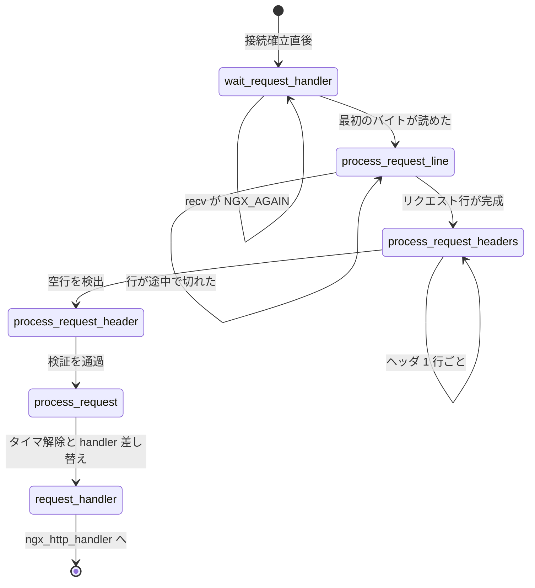

## この層の責務

この層が受け取るのは、[accept とコネクションのページ](../accept-to-connection/) が作った `ngx_connection_t` 1 個だけだ。そこから `ngx_http_handler()` に入るまでの間に、次の 3 つを済ませる。

1. クライアントが送ってきたバイト列を `ngx_http_request_t` のフィールドに落とす。リクエスト行 (メソッド・URI・バージョン) とヘッダ群。
2. **それを、いつ中断されてもいいように書く。** TCP は境界を保存しない。`GET /` まで来て残りが 200ms 後、ということが普通に起きる。
3. 途中で確定する設定に追従する。Host ヘッダを読むまで、どの `server` ブロックの設定が効くか決まらない。`client_header_buffer_size` の値そのものが、パースの途中で変わりうる。

3 番目があるので、この層は単なるパーサではない。パーサを回す側のループが、設定の切り替えと再読み込みと大きいバッファの取り直しを同時に面倒見ている。

サーバの選択そのものは [仮想サーバと location のページ](../virtual-server-location/) が扱う。ここでは「Host が読めた時点で `ngx_http_set_virtual_server()` が呼ばれる」ところまでを見る。HTTP/1.1 のワイヤ形式は [HTTP/1.1 の前提ページ](../http1-wire/) を参照。

## 主要な型とその関係

### `ngx_http_request_t` のパース用区画

`ngx_http_request_t` は 200 行を超える構造体だが、パーサが使う部分は末尾にまとまっている ([`src/http/ngx_http_request.h#L581-L613`](https://github.com/nginx/nginx/blob/release-1.31.4/src/http/ngx_http_request.h#L581-L613))。

```c title="src/http/ngx_http_request.h"
    /* used to parse HTTP headers */

    ngx_uint_t                        state;

    ngx_uint_t                        header_hash;
    ngx_uint_t                        lowcase_index;
    u_char                            lowcase_header[NGX_HTTP_LC_HEADER_LEN];

    u_char                           *header_name_start;
    u_char                           *header_name_end;
    u_char                           *header_start;
    u_char                           *header_end;

    /*
     * a memory that can be reused after parsing a request line
     * via ngx_http_ephemeral_t
     */

    u_char                           *uri_start;
    u_char                           *uri_end;
    u_char                           *uri_ext;
    u_char                           *args_start;
    u_char                           *request_start;
    u_char                           *request_end;
    u_char                           *method_end;
    u_char                           *schema_start;
    u_char                           *schema_end;
    u_char                           *host_start;
    u_char                           *host_end;

    unsigned                          http_minor:16;
    unsigned                          http_major:16;
```

`state` が 1 個あり、あとは全部 `u_char *` だ。**パーサはリクエストの中身をコピーせず、受信バッファのどこに何があるかを指すポインタだけを置く。**

コメントにあるとおり、この区画はリクエスト行のパースが終わると `ngx_http_ephemeral_t` として別の用途に使い回される ([`#L616-L621`](https://github.com/nginx/nginx/blob/release-1.31.4/src/http/ngx_http_request.h#L616-L621))。`#define ngx_http_ephemeral(r) (void *) (&r->uri_start)` で、`uri_start` のアドレスをそのまま別の型として読む。パース後にこのフィールドを読んでも、そこにあるのはもうポインタではない。

### バッファは `header_in` 1 本

パーサに渡すのは `r->header_in` ([`#L407`](https://github.com/nginx/nginx/blob/release-1.31.4/src/http/ngx_http_request.h#L407))。実体は接続のバッファか、大きいヘッダ用に取り直したバッファのどちらかになる ([`src/http/ngx_http_request.c#L606`](https://github.com/nginx/nginx/blob/release-1.31.4/src/http/ngx_http_request.c#L606))。

```c title="src/http/ngx_http_request.c"
    r->header_in = hc->busy ? hc->busy->buf : c->buffer;
```

`ngx_buf_t` の `start` / `end` がバッファの物理的な範囲、`pos` がパーサの読み位置、`last` が `recv()` の書き込み末尾。`pos` と `last` の間が「読んだがまだ解釈していないバイト」で、ここが空になったら `recv()` を呼ぶ ([buf と chain のページ](../buf-chain/))。

### ヘッダ 1 行は `ngx_table_elt_t`

```c title="src/core/ngx_hash.h"
struct ngx_table_elt_s {
    ngx_uint_t        hash;
    ngx_str_t         key;
    ngx_str_t         value;
    u_char           *lowcase_key;
    ngx_table_elt_t  *next;
};
```

[`src/core/ngx_hash.h#L94-L100`](https://github.com/nginx/nginx/blob/release-1.31.4/src/core/ngx_hash.h#L94-L100)。`hash` に 0 を入れると「この行は無効」の印になる。`next` があるので、同名ヘッダが複数来たときに片方向リストで繋げられる。

ヘッダ名からハンドラを引くテーブルの要素は `ngx_http_header_t` ([`#L172-L176`](https://github.com/nginx/nginx/blob/release-1.31.4/src/http/ngx_http_request.h#L172-L176))。名前・`ngx_http_headers_in_t` の中のオフセット・ハンドラの 3 つ組で、これが `ngx_http_headers_in[]` に並ぶ。

### パース結果がどこに入るか

リクエスト行のパースが終わると、`r` のフィールドはこうなる。

| フィールド              | 型           | 何を指すか                   | 実体                 |
| ----------------------- | ------------ | ---------------------------- | -------------------- |
| `request_start`         | `u_char *`   | リクエスト行の先頭           | バッファ内           |
| `method_end`            | `u_char *`   | メソッドの最後の 1 文字      | バッファ内           |
| `uri_start` / `uri_end` | `u_char *`   | URI の範囲                   | バッファ内           |
| `args_start`            | `u_char *`   | `?` の次の文字               | バッファ内           |
| `uri_ext`               | `u_char *`   | 最後の `.` の次の文字        | バッファ内           |
| `method`                | `ngx_uint_t` | `NGX_HTTP_GET` などのビット  | 数値                 |
| `http_version`          | `ngx_uint_t` | `major * 1000 + minor`       | 数値                 |
| `http_protocol`         | `ngx_str_t`  | `HTTP/1.1` の文字列          | バッファ内           |
| `unparsed_uri`          | `ngx_str_t`  | クエリを含む生の URI         | バッファ内           |
| `uri`                   | `ngx_str_t`  | 正規化後のパス               | **条件付きでコピー** |
| `args`                  | `ngx_str_t`  | `?` 以降                     | バッファ内           |
| `exten`                 | `ngx_str_t`  | 拡張子                       | バッファ内           |
| `complex_uri`           | ビット       | `.` `//` `#` が URI にあった | フラグ               |
| `quoted_uri`            | ビット       | `%` が URI にあった          | フラグ               |

`uri` だけが例外で、`complex_uri` か `quoted_uri` が立っているときだけ新しくメモリを取る。理由は後述する。

## 処理の流れ

読み込みイベントのハンドラ (`rev->handler`) が段階ごとに差し替わっていく。



### 1. 最初のバイトが来るまでバッファを持たない

`ngx_http_wait_request_handler()` ([`src/http/ngx_http_request.c#L404-L435`](https://github.com/nginx/nginx/blob/release-1.31.4/src/http/ngx_http_request.c#L404-L435))。

```c title="src/http/ngx_http_request.c"
    size = cscf->client_header_buffer_size;

    b = c->buffer;

    if (b == NULL) {
        b = ngx_create_temp_buf(c->pool, size);
        /* ... */
        c->buffer = b;

    } else if (b->start == NULL) {

        b->start = ngx_palloc(c->pool, size);
        /* ... */
        b->pos = b->start;
        b->last = b->start;
        b->end = b->last + size;
    }

    n = c->recv(c, b->last, b->end - b->last);
```

この関数は「読めるようになった」というイベントで呼ばれる。**バッファの確保は接続を受け付けた瞬間ではなく、この関数の中で初めて行われる。** `client_header_buffer_size` の既定は 1024 バイト ([`src/http/ngx_http_core_module.c#L3578-L3579`](https://github.com/nginx/nginx/blob/release-1.31.4/src/http/ngx_http_core_module.c#L3578-L3579)) なので、接続が 5 万本あればこれだけで 50MB になる。確保をイベントまで遅らせれば、接続しただけで何も送ってこないクライアントがメモリを食わない。

分岐が 2 本あるのは、`b->start == NULL` という中途半端な状態が存在するからだ。それを作るのが同じ関数の後半 ([`#L437-L462`](https://github.com/nginx/nginx/blob/release-1.31.4/src/http/ngx_http_request.c#L437-L462))。

```c title="src/http/ngx_http_request.c"
    if (n == NGX_AGAIN) {

        if (!rev->timer_set) {
            ngx_add_timer(rev, cscf->client_header_timeout);
            ngx_reusable_connection(c, 1);
        }
        /* ... ngx_handle_read_event ... */

        if (b->pos == b->last) {

            /*
             * We are trying to not hold c->buffer's memory for an
             * idle connection.
             */

            if (ngx_pfree(c->pool, b->start) == NGX_OK) {
                b->start = NULL;
            }
        }

        return;
    }
```

`epoll` に起こされたのに実際には読めなかった。そのときは `ngx_pfree()` でバッファを返し、`b->start = NULL` にして「`ngx_buf_t` はあるが領域は無い」状態に戻す。次に起こされたらまた確保する。

なお `ngx_pfree()` はプールの大ブロックしか解放できない ([メモリプールのページ](../memory-pool/))。1024 バイトはプールの小さい割り当てに載るので、実際にはたいてい `NGX_DECLINED` が返って `b->start` は残る。この最適化が効くのは `client_header_buffer_size` を大きく設定したときだ。

### 2. `r` を作り、handler を差し替える

`recv()` が正の値を返したら、HTTP/2 のプレフェイス判定などを経てリクエストを作る ([`#L522-L533`](https://github.com/nginx/nginx/blob/release-1.31.4/src/http/ngx_http_request.c#L522-L533))。

```c title="src/http/ngx_http_request.c"
    ngx_reusable_connection(c, 0);

    c->data = ngx_http_create_request(c);
    if (c->data == NULL) {
        ngx_http_close_connection(c);
        return;
    }

    rev->handler = ngx_http_process_request_line;
    ngx_http_process_request_line(rev);
```

`ngx_http_create_request()` は `request_pool_size` (既定 4096) のプールを新しく作り、その中に `ngx_http_request_t` を置く。以降このリクエストが確保するものは全部このプールから出て、終わるとまとめて捨てられる。初期化のうち `r->headers_in.content_length_n = -1` ([`#L655`](https://github.com/nginx/nginx/blob/release-1.31.4/src/http/ngx_http_request.c#L655)) が効いてくるのは後の層で、「ボディの長さが分からない」と「ボディが 0 バイト」を区別するためにこの値が要る ([リクエストボディのページ](../request-body/))。

`rev->handler` を差し替えた直後に自分で呼んでいる。既にバッファにはデータが入っているので、イベントが再度来るのを待つ理由がない。

### 3. リクエスト行を 1 バイトずつ刻む

`ngx_http_process_request_line()` のループ ([`#L1136-L1150`](https://github.com/nginx/nginx/blob/release-1.31.4/src/http/ngx_http_request.c#L1136-L1150))。

```c title="src/http/ngx_http_request.c"
    rc = NGX_AGAIN;

    for ( ;; ) {

        if (rc == NGX_AGAIN) {
            n = ngx_http_read_request_header(r);

            if (n == NGX_AGAIN || n == NGX_ERROR) {
                break;
            }
        }

        rc = ngx_http_parse_request_line(r, r->header_in);

        if (rc == NGX_OK) {
```

「読む」と「パースする」を交互に繰り返す。パーサが `NGX_AGAIN` を返したらもう一度読み、また渡す。読む側の `ngx_http_read_request_header()` は、まずバッファに未処理のバイトが残っていないかを見て、`rev->ready` が立っているときだけ `recv()` する ([`#L1609-L1620`](https://github.com/nginx/nginx/blob/release-1.31.4/src/http/ngx_http_request.c#L1609-L1620))。前回の `recv()` が要求より少ないバイト数を返していれば `ready` は落ちているので、確実に `EAGAIN` になるシステムコールを呼ばずに済む。

パーサ本体は 27 個の状態を持つ ([`src/http/ngx_http_parse.c#L107-L146`](https://github.com/nginx/nginx/blob/release-1.31.4/src/http/ngx_http_parse.c#L107-L146))。

```c title="src/http/ngx_http_parse.c"
ngx_int_t
ngx_http_parse_request_line(ngx_http_request_t *r, ngx_buf_t *b)
{
    u_char  c, ch, *p, *m;
    enum {
        sw_start = 0,
        sw_method,
        sw_spaces_before_uri,
        sw_schema,
        sw_schema_slash,
        sw_schema_slash_slash,
        /* ... sw_host 系 6 個、sw_port 系 2 個 ... */
        sw_after_slash_in_uri,
        sw_check_uri,
        sw_uri,
        sw_http_09,
        sw_http_H,
        sw_http_HT,
        sw_http_HTT,
        sw_http_HTTP,
        /* ... バージョン番号の 4 状態 ... */
        sw_spaces_after_digit,
        sw_almost_done
    } state;

    state = r->state;

    for (p = b->pos; p < b->last; p++) {
        ch = *p;

        switch (state) {
```

`sw_http_H` から `sw_http_HTTP` まで、`HTTP/` の文字それぞれに状態が振ってある。文字列比較を一切せず、1 文字ずつ進む。

この形になっている理由は `state = r->state` と、バッファが尽きたときの出口にある ([`#L846-L860`](https://github.com/nginx/nginx/blob/release-1.31.4/src/http/ngx_http_parse.c#L846-L860))。

```c title="src/http/ngx_http_parse.c"
    b->pos = p;
    r->state = state;

    return NGX_AGAIN;

done:

    b->pos = p + 1;

    if (r->request_end == NULL) {
        r->request_end = p;
    }

    r->http_version = r->http_major * 1000 + r->http_minor;
    r->state = sw_start;
```

バッファを読み切ったら、そこまでの位置と状態を `r` に書き戻して `NGX_AGAIN` を返す。次に呼ばれたときは `state = r->state` から再開する。**`GET /ind` で 1 回目が終わり `ex.html HTTP/1.1\r\n` で 2 回目が終わっても、結果は 1 回で読めた場合と同じになる。**

成功したときは `r->state = sw_start` に戻す。`sw_start` は 0 と明示されていて、`r->state == 0` が「今、行の境界にいる」を意味するようになる。後でバッファを取り直すときの判断材料になる。

`for` ループの上に一言だけコメントがある ([`#L105`](https://github.com/nginx/nginx/blob/release-1.31.4/src/http/ngx_http_parse.c#L105))。

```c title="src/http/ngx_http_parse.c"
/* gcc, icc, msvc and others compile these switches as an jump table */
```

状態を 0 から連番の enum にしてあるので、コンパイラが `switch` をジャンプテーブルに落とす。状態遷移が配列の添字 1 回になる。

### 4. メソッドの判定は 4 バイト単位の整数比較

`sw_method` で空白に当たったとき、それまでに読んだ文字数で `switch` する ([`#L163-L215`](https://github.com/nginx/nginx/blob/release-1.31.4/src/http/ngx_http_parse.c#L163-L215))。

```c title="src/http/ngx_http_parse.c"
        case sw_method:
            if (ch == ' ') {
                r->method_end = p - 1;
                m = r->request_start;
                state = sw_spaces_before_uri;

                switch (p - m) {

                case 3:
                    if (ngx_str3_cmp(m, 'G', 'E', 'T', ' ')) {
                        r->method = NGX_HTTP_GET;
                        break;
                    }
                    /* ... PUT ... */
                    break;

                case 4:
                    if (m[1] == 'O') {

                        if (ngx_str3Ocmp(m, 'P', 'O', 'S', 'T')) {
                            r->method = NGX_HTTP_POST;
                            break;
                        }
                        /* ... COPY, MOVE, LOCK ... */

                    } else {

                        if (ngx_str4cmp(m, 'H', 'E', 'A', 'D')) {
                            r->method = NGX_HTTP_HEAD;
                            break;
                        }
                    }
                    break;
                /* ... case 5, 6, 7, 8, 9 ... */
                }
```

1 バイトずつ進める状態機械の中に、長さで分岐する `switch` が入れ子になっている。まず長さで候補を 1〜4 個に絞り、`case 4` ではさらに 2 文字目が `O` かどうかで割る。

その `ngx_str3_cmp` の定義がこれだ ([`#L40-L49`](https://github.com/nginx/nginx/blob/release-1.31.4/src/http/ngx_http_parse.c#L40-L49))。

```c title="src/http/ngx_http_parse.c"
#if (NGX_HAVE_LITTLE_ENDIAN && NGX_HAVE_NONALIGNED)

#define ngx_str3_cmp(m, c0, c1, c2, c3)                                       \
    *(uint32_t *) m == ((c3 << 24) | (c2 << 16) | (c1 << 8) | c0)

#define ngx_str3Ocmp(m, c0, c1, c2, c3)                                       \
    *(uint32_t *) m == ((c3 << 24) | (c2 << 16) | (c1 << 8) | c0)

#define ngx_str4cmp(m, c0, c1, c2, c3)                                        \
    *(uint32_t *) m == ((c3 << 24) | (c2 << 16) | (c1 << 8) | c0)
```

**4 文字を `uint32_t` として 1 回の比較で片付ける。** 右辺はコンパイル時に定数へ畳まれるので、`GET ` の判定は `mov` 1 回と `cmp` 1 回になる。5 文字以上は `ngx_str5cmp` から `ngx_str9cmp` まであり、4 バイトの比較を 2 回と端数のバイト比較を組み合わせる。

`ngx_str3_cmp` に第 4 引数として `' '` が渡っているのは、直後の空白まで含めて 4 バイト読むためだ。`GET` は 3 文字だが `GET ` は 4 バイトで、`p - m == 3` の時点で `m[3]` が空白であることは確定している。

`ngx_str3Ocmp` だけ名前が違う。`POST` `COPY` `MOVE` `LOCK` はいずれも 2 文字目が `O` で、その判定を外側の `if (m[1] == 'O')` で済ませているという意味の `O` だ。

条件が成り立たないプラットフォーム向けのフォールバックも用意されている ([`#L72-L78`](https://github.com/nginx/nginx/blob/release-1.31.4/src/http/ngx_http_parse.c#L72-L78))。

```c title="src/http/ngx_http_parse.c"
#else /* !(NGX_HAVE_LITTLE_ENDIAN && NGX_HAVE_NONALIGNED) */

#define ngx_str3_cmp(m, c0, c1, c2, c3)                                       \
    m[0] == c0 && m[1] == c1 && m[2] == c2

#define ngx_str3Ocmp(m, c0, c1, c2, c3)                                       \
    m[0] == c0 && m[2] == c2 && m[3] == c3
```

`ngx_str3Ocmp` が `m[1]` を飛ばしているのは、外側で既に見ているからだ。呼び出し側のコードは 1 文字も変わらない。プラットフォーム依存の最適化が、マクロの 2 つの定義の中に閉じ込めてある。

### 5. URI はコピーせず、必要なときだけ作り直す

パーサは URI を走査しながら、後の処理に必要な事実をフラグに記録する ([`#L523-L565`](https://github.com/nginx/nginx/blob/release-1.31.4/src/http/ngx_http_parse.c#L523-L565))。

```c title="src/http/ngx_http_parse.c"
        case sw_after_slash_in_uri:

            if (usual[ch >> 5] & (1U << (ch & 0x1f))) {
                state = sw_check_uri;
                break;
            }

            switch (ch) {
            /* ... */
            case '.':
                r->complex_uri = 1;
                state = sw_uri;
                break;
            case '%':
                r->quoted_uri = 1;
                state = sw_uri;
                break;
            case '?':
                r->args_start = p + 1;
                state = sw_uri;
                break;
```

`usual[]` は 256 ビットのビットマップで、「URI に普通に出てくる文字」を表している ([`#L17-L37`](https://github.com/nginx/nginx/blob/release-1.31.4/src/http/ngx_http_parse.c#L17-L37))。`ch >> 5` で 32 ビットのワードを選び、`ch & 0x1f` でビットを選ぶ。1 命令ぶんの計算で「この文字は特別扱いが要らない」と分かるので、大半の文字はここで抜ける。

`/` の直後にまた `/` が来たら `complex_uri`、`.` が来たら同じく `complex_uri`、`%` が来たら `quoted_uri`。**「正規化が必要だ」という判定を、パースの副産物として得ている。**

その結果を使うのが `ngx_http_process_request_uri()` ([`src/http/ngx_http_request.c#L1283-L1317`](https://github.com/nginx/nginx/blob/release-1.31.4/src/http/ngx_http_request.c#L1283-L1317))。

```c title="src/http/ngx_http_request.c"
    if (r->complex_uri || r->quoted_uri || r->empty_path_in_uri) {

        r->uri.data = ngx_pnalloc(r->pool, r->uri.len);
        /* ... */

        if (ngx_http_parse_complex_uri(r, cscf->merge_slashes) != NGX_OK) {
            /* ... 400 ... */
        }

    } else {
        r->uri.data = r->uri_start;
    }

    r->unparsed_uri.len = r->uri_end - r->uri_start;
    r->unparsed_uri.data = r->uri_start;
```

`else` 側は 1 行だけだ。`/index.html` のような普通の URI では、メモリ確保もコピーも一切起きない。`%2f` や `..` や `//` が入っているときだけ `ngx_pnalloc` して `ngx_http_parse_complex_uri()` を呼ぶ。

`unparsed_uri` は常に元のバイト列を指す。`uri` が正規化後、`unparsed_uri` が正規化前で、`$request_uri` はこちらから来る。`exten` と `args` も同じくポインタと長さの組を置くだけだ。

### 6. ヘッダ名の小文字化とハッシュを、パースと同時に計算する

リクエスト行が終わると `rev->handler = ngx_http_process_request_headers` に移る ([`#L1218-L1229`](https://github.com/nginx/nginx/blob/release-1.31.4/src/http/ngx_http_request.c#L1218-L1229))。ヘッダを入れる `ngx_list_t` はこのときに初期化される (1 ブロック 20 要素)。HTTP/0.9 のリクエストはこの行に到達しないので、リストも作られない。

`ngx_http_parse_header_line()` はリクエスト行のパーサと同じ形だが、状態を跨いで持ち回る変数が 3 つある ([`src/http/ngx_http_parse.c#L899-L901`](https://github.com/nginx/nginx/blob/release-1.31.4/src/http/ngx_http_parse.c#L899-L901))。`state = r->state; hash = r->header_hash; i = r->lowcase_index;` で、この 3 つを 1 文字ごとに同時に更新する ([`#L962-L980`](https://github.com/nginx/nginx/blob/release-1.31.4/src/http/ngx_http_parse.c#L962-L980))。

```c title="src/http/ngx_http_parse.c"
        /* header name */
        case sw_name:
            c = lowcase[ch];

            if (c) {
                hash = ngx_hash(hash, c);
                r->lowcase_header[i++] = c;
                i &= (NGX_HTTP_LC_HEADER_LEN - 1);
                break;
            }

            if (ch == '_') {
                if (allow_underscores) {
                    hash = ngx_hash(hash, ch);
                    r->lowcase_header[i++] = ch;
                    i &= (NGX_HTTP_LC_HEADER_LEN - 1);

                } else {
                    r->invalid_header = 1;
                }
```

`lowcase[]` は 256 バイトのテーブルで、「ヘッダ名に使える文字なら対応する小文字、そうでなければ `\0`」を返す ([`#L889-L897`](https://github.com/nginx/nginx/blob/release-1.31.4/src/http/ngx_http_parse.c#L889-L897))。1 回の配列参照で、文字種の検査と小文字化の両方をやっている。

`ngx_hash(key, c)` は `key * 31 + c` のマクロ ([`src/core/ngx_hash.h#L114`](https://github.com/nginx/nginx/blob/release-1.31.4/src/core/ngx_hash.h#L114))。**ヘッダ名を読み終わった時点で、小文字化された名前とそのハッシュ値が既にできている。** 名前を確定させてからもう一度なめる工程が無い。

`i &= (NGX_HTTP_LC_HEADER_LEN - 1)` に注意が要る。`NGX_HTTP_LC_HEADER_LEN` は 32 なので、33 文字目からは `lowcase_header[0]` に上書きされて巻き戻る。オーバーラン防止の処置で、代わりに 32 文字を超えるヘッダ名では `lowcase_header` の中身が正しくなくなる。使う側はそれを知っている。

### 7. 拾い上げるヘッダはテーブルで決まる

1 行パースできたら、リストに積んでからテーブルを引く ([`src/http/ngx_http_request.c#L1511-L1545`](https://github.com/nginx/nginx/blob/release-1.31.4/src/http/ngx_http_request.c#L1511-L1545))。

```c title="src/http/ngx_http_request.c"
            h = ngx_list_push(&r->headers_in.headers);
            /* ... */
            h->hash = r->header_hash;

            h->key.len = r->header_name_end - r->header_name_start;
            h->key.data = r->header_name_start;
            h->key.data[h->key.len] = '\0';

            h->value.len = r->header_end - r->header_start;
            h->value.data = r->header_start;
            h->value.data[h->value.len] = '\0';

            h->lowcase_key = ngx_pnalloc(r->pool, h->key.len);
            /* ... */

            if (h->key.len == r->lowcase_index) {
                ngx_memcpy(h->lowcase_key, r->lowcase_header, h->key.len);

            } else {
                ngx_strlow(h->lowcase_key, h->key.data, h->key.len);
            }

            hh = ngx_hash_find(&cmcf->headers_in_hash, h->hash,
                               h->lowcase_key, h->key.len);

            if (hh && hh->handler(r, h, hh->offset) != NGX_OK) {
                break;
            }
```

`h->key.data[h->key.len] = '\0'` が受信バッファを直接書き換えている。ヘッダ名の直後は `:`、値の直後は `\r` なので、そこを終端文字で潰す。**区切り文字を `\0` に置き換えることで、コピーせずに C 文字列を作っている。**

`h->key.len == r->lowcase_index` の分岐が、前節の 32 文字巻き戻りへの対処だ。長さが一致していれば `lowcase_header` をそのまま使え、一致しなければ改めて `ngx_strlow()` で作り直す。

`cmcf->headers_in_hash` は起動時に `ngx_http_headers_in[]` から作られる ([`src/http/ngx_http.c#L427-L446`](https://github.com/nginx/nginx/blob/release-1.31.4/src/http/ngx_http.c#L427-L446))。`hash.bucket_size = ngx_align(64, ngx_cacheline_size)` になっていて、バケットを 1 本たどるのにキャッシュミスが 1 回で済むようにしてある。

テーブル本体はこうなっている ([`src/http/ngx_http_request.c#L80-L206`](https://github.com/nginx/nginx/blob/release-1.31.4/src/http/ngx_http_request.c#L80-L206))。

```c title="src/http/ngx_http_request.c"
ngx_http_header_t  ngx_http_headers_in[] = {
    { ngx_string("Host"), offsetof(ngx_http_headers_in_t, host),
                 ngx_http_process_host },

    { ngx_string("Connection"), offsetof(ngx_http_headers_in_t, connection),
                 ngx_http_process_connection },

    /* ... */

    { ngx_string("Content-Length"),
                 offsetof(ngx_http_headers_in_t, content_length),
                 ngx_http_process_unique_header_line },

    /* ... Cookie まで 30 行ほど ... */

    { ngx_null_string, 0, NULL }
};
```

ここに載っているヘッダだけが `ngx_http_headers_in_t` の専用フィールドに拾い上げられる。載っていないヘッダは `r->headers_in.headers` のリストに積まれるだけだ。**よく使うものを構造体のフィールドに、それ以外をリストに、という二重管理になっている。** `r->headers_in.content_length` は 1 回の参照で取れるが、`X-Request-Id` を取るにはリストを線形に走査する必要がある。

ハンドラは 3 種類の使い分けになる。

`ngx_http_process_header_line()` はオフセット先に繋ぐだけで、同名が複数来たら `next` で連結する ([`#L1829-L1834`](https://github.com/nginx/nginx/blob/release-1.31.4/src/http/ngx_http_request.c#L1829-L1834))。

```c title="src/http/ngx_http_request.c"
    ph = (ngx_table_elt_t **) ((char *) &r->headers_in + offset);

    while (*ph) { ph = &(*ph)->next; }

    *ph = h;
    h->next = NULL;
```

`ngx_http_process_unique_header_line()` は、既に入っていたら 400 を返す ([`#L1846-L1859`](https://github.com/nginx/nginx/blob/release-1.31.4/src/http/ngx_http_request.c#L1846-L1859))。

```c title="src/http/ngx_http_request.c"
    ph = (ngx_table_elt_t **) ((char *) &r->headers_in + offset);

    if (*ph == NULL) {
        *ph = h;
        h->next = NULL;
        return NGX_OK;
    }

    ngx_log_error(NGX_LOG_INFO, r->connection->log, 0,
                  "client sent duplicate header line: \"%V: %V\", "
                  "previous value: \"%V: %V\"",
                  &h->key, &h->value, &(*ph)->key, &(*ph)->value);

    ngx_http_finalize_request(r, NGX_HTTP_BAD_REQUEST);
```

`Content-Length` が 2 つ来たら 400 になる。リクエストスマグリングの入口を、テーブルの 1 列で塞いでいる。

`ngx_http_process_host()` は重複を弾いたうえで、その場で仮想サーバを選び直す ([`#L1888-L1910`](https://github.com/nginx/nginx/blob/release-1.31.4/src/http/ngx_http_request.c#L1888-L1910))。

```c title="src/http/ngx_http_request.c"
    rc = ngx_http_validate_host(&host, &port, r->pool, 0);

    /* ... 検証 ... */

    if (r->headers_in.server.len) {
        return NGX_OK;
    }

    if (ngx_http_set_virtual_server(r, &host) == NGX_ERROR) {
        return NGX_ERROR;
    }

    r->headers_in.server = host;
```

`r->headers_in.server` が既に埋まっていれば何もしない。絶対 URI (`GET http://example.com/ HTTP/1.1`) で来た場合、リクエスト行のパース時点で既にサーバが決まっているからだ。「絶対 URI が Host より優先する」がここに現れている。

`ngx_http_process_connection()` は値を保存したうえで、`ngx_strcasestrn()` で `close` と `keep-alive` を探し、`r->headers_in.connection_type` に畳む ([`#L1921-L1930`](https://github.com/nginx/nginx/blob/release-1.31.4/src/http/ngx_http_request.c#L1921-L1930))。部分文字列で探しているのは `Connection: keep-alive, Upgrade` のようなリスト値に対応するためだ。後の層は `connection_type` の数値だけを見ればよくなる。

そしてこのループは、1 行ごとに `cscf` を取り直している ([`#L1479-L1483`](https://github.com/nginx/nginx/blob/release-1.31.4/src/http/ngx_http_request.c#L1479-L1483))。

```c title="src/http/ngx_http_request.c"
        /* the host header could change the server configuration context */
        cscf = ngx_http_get_module_srv_conf(r, ngx_http_core_module);

        rc = ngx_http_parse_header_line(r, r->header_in,
                                        cscf->underscores_in_headers);
```

`ngx_http_process_host()` が `r->srv_conf` を差し替えるので、次の行から `underscores_in_headers` や `max_headers` の値が変わる。**ヘッダをパースしている最中に、パースの設定そのものが変わる。**

### 8. 全部読んでからの検証

空行を検出すると `NGX_HTTP_PARSE_HEADER_DONE` が返り、`ngx_http_process_request_header()` に入る ([`#L2034-L2085`](https://github.com/nginx/nginx/blob/release-1.31.4/src/http/ngx_http_request.c#L2034-L2085))。

```c title="src/http/ngx_http_request.c"
    if (r->headers_in.host == NULL && r->http_version > NGX_HTTP_VERSION_10) {
        /* ... 400: HTTP/1.1 request without "Host" header ... */
    }

    if (r->headers_in.content_length) {
        r->headers_in.content_length_n =
                            ngx_atoof(r->headers_in.content_length->value.data,
                                      r->headers_in.content_length->value.len);
        /* ... 失敗なら 400 ... */
    }

    if (r->headers_in.transfer_encoding) {
        /* ... HTTP/1.0 なら 400 ... */

        if (r->headers_in.transfer_encoding->value.len == 7
            && ngx_strncasecmp(r->headers_in.transfer_encoding->value.data,
                               (u_char *) "chunked", 7) == 0)
        {
            if (r->headers_in.content_length) {
                ngx_log_error(NGX_LOG_INFO, r->connection->log, 0,
                              "client sent \"Content-Length\" and "
                              "\"Transfer-Encoding\" headers "
                              "at the same time");
                ngx_http_finalize_request(r, NGX_HTTP_BAD_REQUEST);
                return NGX_ERROR;
            }

            r->headers_in.chunked = 1;

        } else {
            /* ... 501 ... */
        }
    }
```

検証が 4 つ並んでいる。

- HTTP/1.1 で Host が無ければ 400。バージョンを見ているので、HTTP/1.0 のリクエストは通る。
- `Content-Length` は `ngx_atoof()` で `off_t` に変換する。失敗すれば 400。数値化を 1 箇所でやるので、以降の層は文字列を見ない。
- `Transfer-Encoding` が `chunked` 以外なら 501。`gzip` も `deflate` も受け付けない。
- **`Content-Length` と `Transfer-Encoding` が両方あれば 400。** ボディの長さの解釈が 2 通りできる状態を、先に進ませない。フロントとバックで解釈が割れることでリクエストスマグリングが成立するので、ここで切る。この 2 通りの表現については [HTTP/1.1 の前提ページ](../http1-wire/) を参照。

`chunked` を認めたときに `r->headers_in.chunked = 1` を立てるのがこの関数の出力で、ここから先はボディを読む側がこのビットだけを見る。

### 9. handler を差し替えてフェーズエンジンへ

最後に `ngx_http_process_request()` ([`#L2197-L2212`](https://github.com/nginx/nginx/blob/release-1.31.4/src/http/ngx_http_request.c#L2197-L2212))。

```c title="src/http/ngx_http_request.c"
    if (c->read->timer_set) {
        ngx_del_timer(c->read);
    }

    /* ... 統計 ... */

    c->read->handler = ngx_http_request_handler;
    c->write->handler = ngx_http_request_handler;
    r->read_event_handler = ngx_http_block_reading;

    ngx_http_handler(r);
```

`client_header_timeout` のタイマを外し、読み書き両方のイベント handler を `ngx_http_request_handler` に揃え、読み込みイベントが来たときの振る舞いを `ngx_http_block_reading` にする。

`ngx_http_request_handler()` は、読みと書きを `r` の関数ポインタに振り分けるだけの関数だ ([`#L2609-L2616`](https://github.com/nginx/nginx/blob/release-1.31.4/src/http/ngx_http_request.c#L2609-L2616))。

```c title="src/http/ngx_http_request.c"
    if (ev->write) {
        r->write_event_handler(r);

    } else {
        r->read_event_handler(r);
    }

    ngx_http_run_posted_requests(c);
```

**接続レベルの handler (`c->read->handler`) は以降固定され、リクエストレベルの handler (`r->read_event_handler`) だけが状態に応じて差し替わる。** 2 段になっているのは、サブリクエストが走っているときに「どのリクエストのイベントか」を `c->data` で解決してから振り分ける必要があるからだ ([サブリクエストのページ](../subrequest-postpone/))。

`ngx_http_block_reading` は「読み込みイベントが来ても何もしない」handler だ。ヘッダを読み終わった直後は、ボディを要求する層が現れるまで読む必要がない。

そして `ngx_http_handler()` に入り、[フェーズエンジン](../phase-engine/) が動き始める。

## 守られている不変条件

**`r->state == 0` は「行の境界にいる」を意味する。** パーサは成功時に必ず `r->state = sw_start` に戻し、`sw_start` の値は 0 と明示されている。この規約にバッファ取り直しの処理が依存している。

**パース中のポインタは全部 `r->header_in` の中を指す。** `request_start` から `header_end` まで例外がない。これが成り立っているから、バッファを移すときに「全部を同じ差分だけずらす」で済む。

**`r->header_in` を差し替えるのは `ngx_http_alloc_large_header_buffer()` だけ。** 差し替えとポインタの付け替えが分離しない。

**受信バッファは書き換えられるが、範囲は出ない。** `h->key.data[h->key.len] = '\0'` は `:` があった位置に書く。元のバイトを潰すが、確保した領域からははみ出さない。

**`ngx_http_set_virtual_server()` はリクエストにつき高々 1 回だけ効く。** `r->headers_in.server.len` が非 0 なら以降は呼ばれない。絶対 URI と Host ヘッダの両方があっても、サーバは 1 回しか決まらない。

**`content_length_n` は数値化されているか `-1` のどちらか。** 文字列のまま後段に渡らない。

## つまずきどころ

### 大きいヘッダのためのバッファ取り直し

`client_header_buffer_size` (既定 1024) に収まらないリクエストが来ると、`large_client_header_buffers` (既定 4 本 × 8192 バイト) から取り直す。ここがこの層で一番厄介な処理になっている。

まず入口の判定 ([`src/http/ngx_http_request.c#L1668-L1687`](https://github.com/nginx/nginx/blob/release-1.31.4/src/http/ngx_http_request.c#L1668-L1687))。

```c title="src/http/ngx_http_request.c"
    if (request_line && r->state == 0) {

        /* the client fills up the buffer with "\r\n" */

        r->header_in->pos = r->header_in->start;
        r->header_in->last = r->header_in->start;

        return NGX_OK;
    }

    old = request_line ? r->request_start : r->header_name_start;

    if (r->state != 0
        && (size_t) (r->header_in->pos - old)
                                     >= cscf->large_client_header_buffers.size)
    {
        return NGX_DECLINED;
    }
```

1 つ目の分岐が `r->state == 0` を使っている。リクエスト行のパース中にバッファが埋まったのに状態が `sw_start` のままなら、クライアントは `\r\n` だけを送り続けている。この場合は新しいバッファを取らず、同じバッファの先頭に巻き戻すだけで足りる。2 つ目は、1 行が大きいバッファ 1 本に収まらないことが確定した場合で、`NGX_DECLINED` を返して 414 か 431 になる。

バッファを確保したあと、`r->state == 0` かどうかでもう一度分岐する ([`#L1728-L1738`](https://github.com/nginx/nginx/blob/release-1.31.4/src/http/ngx_http_request.c#L1728-L1738))。

```c title="src/http/ngx_http_request.c"
    if (r->state == 0) {
        /*
         * r->state == 0 means that a header line was parsed successfully
         * and we do not need to copy incomplete header line and
         * to relocate the parser header pointers
         */

        r->header_in = b;

        return NGX_OK;
    }
```

前の行がちょうど終わっていれば、差し替えるだけでいい。ここまでのポインタは既にリストに積まれた `ngx_table_elt_t` が指しているだけで、パーサはどこも指していない。

問題は `r->state != 0` のときだ。行の途中でバッファが尽きた。パーサは既に `request_start` や `uri_start` を古いバッファの中に置いている。だから、**途中まで読んだ分を新しいバッファの先頭にコピーして、それを指していたポインタを全部書き換える** ([`#L1749-L1815`](https://github.com/nginx/nginx/blob/release-1.31.4/src/http/ngx_http_request.c#L1749-L1815))。

```c title="src/http/ngx_http_request.c"
    new = b->start;

    ngx_memcpy(new, old, r->header_in->pos - old);

    b->pos = new + (r->header_in->pos - old);
    b->last = new + (r->header_in->pos - old);

    if (request_line) {
        r->request_start = new;

        if (r->request_end) {
            r->request_end = new + (r->request_end - old);
        }

        if (r->method_end) {
            r->method_end = new + (r->method_end - old);
        }

        /* ... uri_start, uri_end, schema_start, schema_end,
               host_start, host_end, uri_ext, args_start,
               http_protocol.data も同じ形で 1 個ずつ ... */

    } else {
        r->header_name_start = new;

        /* ... header_name_end, header_start, header_end ... */
    }

    r->header_in = b;
```

リクエスト行側で 11 個、ヘッダ行側で 4 個のポインタを、1 個ずつ `new + (古い値 - old)` に書き換える。`if (...)` が全部に付いているのは、NULL のものを NULL のまま残すためだ。

ポインタで持つ設計の代償が、そのままここに出ている。値をコピーして持っていればこの処理は要らないが、代わりに正常系のリクエスト全部でコピーが発生する。Nginx は「正常系を速く、例外系を面倒に」という配分を選んだ。

そしてこの関数は、パーサに新しいフィールドを足すたびに直さなければならない。1 個忘れると、大きいヘッダが来たときだけ解放済み領域を指すポインタが残る。**このリストを更新し忘れるかどうかが、パーサを拡張するときの実質的なリスクになっている。**

### バッファは接続に紐づき、リクエストには紐づかない

`ngx_http_alloc_large_header_buffer()` が確保するバッファは `r->connection->pool` から取られ、`hc->busy` に繋がれる ([`#L1701-L1726`](https://github.com/nginx/nginx/blob/release-1.31.4/src/http/ngx_http_request.c#L1701-L1726))。`r->pool` ではない。

keepalive で同じ接続に次のリクエストが来たときに再利用するためで、`hc->free` と `hc->busy` の 2 本のリストで管理される。リクエストが終わっても大きいバッファは解放されない。**8KB × 4 本を掴んだ接続は、閉じるまで 32KB を持ち続ける。** `large_client_header_buffers` を増やすときの実際のコストはここにある。

### `ignore_invalid_headers` が既定で有効

不正なヘッダ行は、既定では 400 ではなく黙って捨てられる ([`#L1489-L1498`](https://github.com/nginx/nginx/blob/release-1.31.4/src/http/ngx_http_request.c#L1489-L1498))。

```c title="src/http/ngx_http_request.c"
            if (r->invalid_header && cscf->ignore_invalid_headers) {

                /* there was error while a header line parsing */

                ngx_log_error(NGX_LOG_INFO, c->log, 0,
                              "client sent invalid header line: \"%*s\"",
                              r->header_end - r->header_name_start,
                              r->header_name_start);
                continue;
            }
```

`invalid_header` が立つのは、ヘッダ名にアンダースコア (`underscores_in_headers off` のとき) や制御文字が入っていた場合だ。`continue` なので、その行だけがリストに載らない。ログレベルは `info` なので、既定の `error_log warn` では何も出ない。`X_Custom_Header` が届かないという症状が、設定にもログにも痕跡を残さずに起きる。

なお、捨てられた行も `max_headers` (既定 1000) のカウントには入る ([`#L1502-L1509`](https://github.com/nginx/nginx/blob/release-1.31.4/src/http/ngx_http_request.c#L1502-L1509))。超えると 431 になる。

### `r->uri` と `r->unparsed_uri` は別物

`%20` を含む URI をプロキシに渡すとき、`$uri` はデコード済み、`$request_uri` は生のバイト列になる。前者を上流に転送すると、上流側で再度デコードされて意味が変わりうる。この 2 つの `ngx_str_t` が別のメモリを指すのは `complex_uri` か `quoted_uri` が立ったときだけで、それ以外は同じアドレスを指す。

### `Host` の処理がパースの途中でサーバを変える

`ngx_http_process_host()` が `r->srv_conf` と `r->loc_conf` を差し替えるので、その後のヘッダ行は新しい `server` ブロックの設定でパースされる。`underscores_in_headers` を `server` ごとに変えている場合、**リクエストの中で Host より前にあるヘッダと後にあるヘッダで、扱いが変わる。**

`client_header_buffer_size` も同様に再評価されるが、既に確保済みのバッファのサイズは変わらない。`server` ごとに違う値を書いても、最初のバッファはデフォルトサーバの値で取られている。

## 関連

- `accept()` から `ngx_connection_t` ができるまでは [accept とコネクションのページ](../accept-to-connection/)。
- Host が読めた後のサーバ選択と、URI による location の選択は [仮想サーバと location のページ](../virtual-server-location/)。
- `ngx_http_handler()` の先は [フェーズエンジンのページ](../phase-engine/)。
- `chunked` フラグを受け取ってボディを読む側は [リクエストボディのページ](../request-body/)。
- `client_header_timeout` のタイマ機構は [タイマのページ](../timer-rbtree/)。
- リクエストプールとバッファの寿命は [メモリプールのページ](../memory-pool/)。
