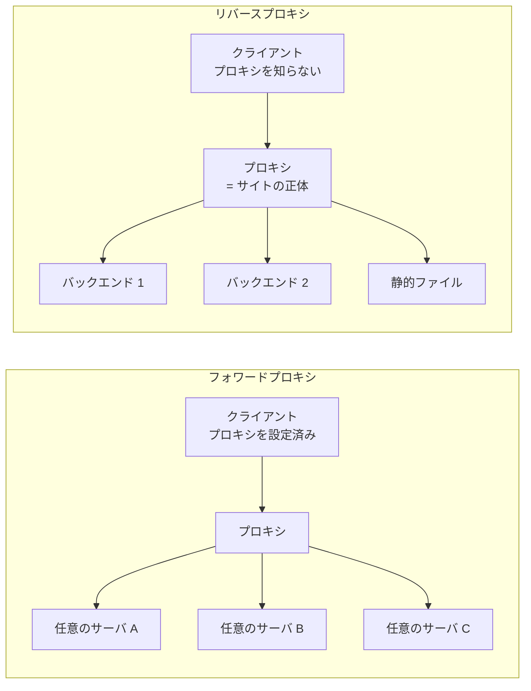

## なぜこれを先に知る必要があるか

Nginx のソースで最も大きいファイルは `ngx_http_upstream.c` で、7000 行を超える。静的ファイルを返すコード全部を足しても、この 1 ファイルに届かない。**Nginx の重心は Web サーバではなくリバースプロキシにある。**

そしてこのコードの複雑さは、プロキシという仕事が本質的に持っている難しさから来ている。1 本のリクエストに対して **下流 (クライアント) と上流 (バックエンド) の 2 つの接続** を同時に面倒みなければならず、しかも 2 つの接続の速度は一致しない。片方が読める状態で片方が書けない状態、という組み合わせが常に発生する。

ここでは Nginx のコードを出さずに、リバースプロキシが何を引き受けているのかを整理する。**「なぜアプリケーション側でやらないのか」を仕事ごとに書く** ことが目的で、それが分かると `ngx_http_upstream.c` の構造が読める。

## フォワードプロキシとリバースプロキシ

### 誰のための代理か

同じ「プロキシ」だが、立つ位置と目的が逆になる。

**フォワードプロキシはクライアントのために代理をする。** クライアントが明示的に「このプロキシを使え」と設定し、プロキシは任意の宛先へ転送する。社内から外部へのアクセスを一箇所に集めて監査する、キャッシュを共有する、送信元 IP を隠す、といった用途がある。プロキシは自分が誰の代理をするか (= どのクライアントか) を知っているが、宛先の集合は開いている。

**リバースプロキシはサーバのために代理をする。** クライアントはプロキシの存在を知らない。DNS が指しているのがプロキシで、クライアントから見ればそれが「そのサイトのサーバ」だ。プロキシは自分が代理する宛先 (= バックエンド) を設定として持っていて、その集合は閉じている。



**「クライアントが宛先を知っているか」で区別する** のがいちばん確実だ。フォワードプロキシではクライアントが「example.com に行きたい」とプロキシに伝える。リバースプロキシではクライアントは「example.com に繋いだ」と思っていて、その先に何台あるかは知らない。

### リクエスト行が違う

この差は、[HTTP/1.1 のワイヤ形式のページ](../http1-wire/) で見たリクエスト行にそのまま現れる。

通常のリクエスト (origin-form) はパスだけを書く。

```
GET /index.html HTTP/1.1
Host: example.com
```

フォワードプロキシへのリクエスト (absolute-form) はスキームとホストを含む。

```
GET http://example.com/index.html HTTP/1.1
Host: example.com
```

プロキシは宛先を知らないので、リクエスト行に書いてもらう必要がある。逆にリバースプロキシは宛先を設定として持っているので、origin-form のままでいい。**クライアントから見れば、リバースプロキシへのリクエストは普通のリクエストと完全に同一** になる。

なお HTTP/1.1 のサーバは absolute-form も受け付けなければならないと決まっている。リバースプロキシとして動いている実装が absolute-form のリクエストを受け取ったときに何をするかは、実装ごとの判断になる。

### CONNECT

フォワードプロキシで HTTPS を通すには、プロキシが中身を読めない状態で TCP を素通しする必要がある。そのためのメソッドが `CONNECT` だ。

```
CONNECT example.com:443 HTTP/1.1
Host: example.com:443
```

プロキシは指定されたホストに TCP 接続し、`200` を返したあとは **HTTP をやめて双方向のバイトストリームの中継に切り替える**。以降そこを流れるのは TLS レコードで、プロキシには何も見えない。

リバースプロキシに `CONNECT` は要らない。TLS を終端するのはプロキシ自身であって、中身は読める。ここが両者の運用上の最大の差になる。

## リバースプロキシが引き受ける仕事

以下、仕事ごとに「なぜアプリケーション側でやらないのか」を書く。

### 遅いクライアントの吸収

**これが最大の存在理由。** 他の全部を足したより重要なので最初に置く。

[並行モデルのページ](../concurrency-models/) で見たとおり、多くのアプリケーションフレームワークは 1 リクエスト 1 スレッド (または 1 プロセス) で動く。同時に処理できるリクエスト数は、ワーカー数で頭打ちになる。

そこにモバイル回線のクライアントが来る。

- **リクエストの受信に時間がかかる。** POST のボディが 1 MB あって回線が 100 KB/s なら、受信だけで 10 秒。
- **レスポンスの送信に時間がかかる。** 500 KB の JSON を同じ回線に送るのに 5 秒。
- **意図的に遅くすることもできる。** 1 バイトずつ、数秒おきに送る。これが Slowloris と呼ばれる攻撃で、少数の接続でワーカーを全部占有できる。

アプリケーションのワーカーは、この 15 秒のあいだ何の計算もしていないのに占有されている。実際の処理時間が 50 ms だとしても、**ワーカーの回転率は 15 秒に 1 回** になる。ワーカーが 20 本なら、秒間 1.3 リクエストしか捌けない。

リバースプロキシを挟むと、こうなる。

1. プロキシがリクエスト全体を受け取り終えるまで、上流には接続すらしない。
2. 受け取り終えてから上流に繋ぎ、まとめて送る。上流はローカルネットワークにいるので数ミリ秒。
3. 上流の応答を全部受け取り、上流との接続を解放する。ここまでで上流のワーカーは 50 ms しか使われていない。
4. 遅いクライアントへの 5 秒の送信は、プロキシが 1 人で面倒みる。

**アプリケーションのワーカーの占有時間が、クライアントの回線速度から切り離される。** プロキシ側では、待っている接続は構造体 1 個ぶんのコストしかない ([並行モデルのページ](../concurrency-models/))。「重い実行コンテキストを持つ側」と「多数の遅い接続を抱える側」を分離する、というのがこのアーキテクチャの核心にある。

アプリケーション側でこれをやらない理由は明快で、**やろうとすると結局イベント駆動のサーバを書くことになる** からだ。フレームワークの同期的なプログラミングモデルを捨てることになる。

### TLS 終端

TLS のハンドシェイクは公開鍵演算を含むので CPU を使う。証明書と秘密鍵の管理、更新、OCSP、ALPN のネゴシエーション、暗号スイートの選択 — どれもアプリケーションの関心事ではない。

プロキシで終端すると、**証明書が 1 箇所に集まる**。バックエンドが 30 台あっても証明書は 1 セットでよく、更新も 1 箇所で済む。バックエンドとの間は平文か、内部用の別の証明書にできる。

そして [HTTP/2 と HTTP/3 のページ](../http2-http3/) に関わる副産物がある。ALPN でプロトコルを決めるのは TLS ハンドシェイクの中なので、**TLS を終端する場所が「どのプロトコルで話すか」を決める場所になる**。クライアントとは HTTP/3、バックエンドとは HTTP/1.1、という組み合わせが可能になるのはこのためだ。構造上の制約は [TLS 終端のページ](../tls-termination/) で扱う。

### 静的ファイルの肩代わり

CSS、JavaScript、画像、フォント。これらを返すのに、アプリケーションのランタイムを起動する意味がない。

プロキシが直接ファイルシステムから返せば、`sendfile()` でカーネル内のコピーだけで済ませられる ([OS のファイル配信のページ](../os-file-serving/))。アプリケーションを経由すると、ファイルを読んでユーザー空間のバッファに載せ、フレームワークのレスポンスオブジェクトに詰め、シリアライズして、プロキシに送り返す。**同じバイト列が何度もコピーされる。**

さらに、アプリケーションが「このファイルを返して」とだけ指示して、実際の送出はプロキシがやる、という分業もある。認可の判断だけをアプリケーションが下し、バイトの移動はプロキシに任せる形だ。

### ロードバランシングとヘルスチェック

バックエンドが複数台あるとき、どこへ送るかを決める。選び方にはそれぞれ前提がある。

- **ラウンドロビン** — 順番に配る。前提は「全リクエストのコストが同じくらい」。重み付きにすればバックエンドの性能差は吸収できるが、リクエストごとのばらつきは吸収できない。
- **最小接続数** — 今いちばん暇なところに配る。リクエストのコストがばらつくときに強い。ただし「接続数」を数えているので、keepalive を使うと指標として意味が薄れる。
- **ハッシュ** — リクエストの何か (URL、クライアント IP、Cookie) をハッシュして決める。**同じキーが常に同じバックエンドに行く** ので、バックエンドがローカルキャッシュを持てる。単純な剰余だと台数が変わったときに全部の割り当てが変わるので、consistent hashing にして移動を最小化する。
- **ランダム 2 択** — ランダムに 2 台選び、空いているほうに送る。全台の状態を見る必要がないのに、最小接続数に近い分散が得られる。

**アプリケーション側でやらない理由は、そもそもアプリケーション自身が分散先だから** だ。自分がどこにいるかは知っていても、他の 29 台の生死は知らない。

そして分散のアルゴリズムは、**プロセスをまたいだ状態を必要とする**。ラウンドロビンの「次はどこか」も、最小接続数の「今何本繋がっているか」も、プロキシのワーカーが複数プロセスに分かれていれば共有しないと正しく動かない。ワーカーが 8 個あって各々が独立にラウンドロビンすると、分散は偶然に頼ることになる。ここも共有メモリが要る場所になる ([slab のページ](../slab-shared-memory/))。

ヘルスチェックはこれとセットになる。応答しないバックエンドを一時的に外し、回復したら戻す。ここには 2 種類ある。**パッシブ** (実際のリクエストが失敗した回数を数えて外す) と、**アクティブ** (定期的に専用のリクエストを投げて確認する)。パッシブは追加のトラフィックが要らない代わりに、判定のためにユーザーのリクエストを何本か犠牲にする。

### 接続の集約

これも見落とされやすいが効く。

クライアント接続が 50000 本あるとする。そのうち実際にリクエストを処理中なのは、keepalive のアイドルを除けば 200 本程度。プロキシは **上流への接続を 200 本だけ張って使い回す** ことができる。

集約が効く理由は 3 つある。

- **TCP のハンドシェイクが消える。** リクエストごとに 3-way handshake をすると、ローカルネットワークでも RTT 1 回ぶんの遅延が乗る。TLS を張るならさらに 1〜2 RTT。
- **バックエンドの接続受け入れコストが消える。** `accept()` して構造体を作って `close()` する回数が桁で減る。
- **エフェメラルポートの枯渇を避けられる。** 送信元ポートは 16 ビットしかない。接続を張り直し続けると `TIME_WAIT` が溜まり、ポートが尽きる。

**数万のクライアント接続を、数十の上流接続に変換する。** この変換こそがリバースプロキシの機能を 1 行で言ったものになる。上流接続をどうプールして、足りなくなったらどう捌くかは [接続の再利用のページ](../connection-reuse/) で扱う。

### キャッシュ

同じレスポンスを何度も作らせない。プロキシがレスポンスを保存し、次に同じリクエストが来たら上流に行かずに返す。

アプリケーション側でもキャッシュはできるが、**プロキシのキャッシュはアプリケーションを起動すらしない**。リクエストのルーティング、認証、ORM の初期化、テンプレートのレンダリング — 全部が省略される。ヒットしたときのコストの差が大きい。

ここには難しさもある。何をキーにするか (URL だけか、`Vary` に挙がったヘッダも含めるか)、いつ無効化するか、そして **同じキーへのリクエストが同時に 100 本来たときに上流へ 100 本投げてしまわないか** (cache stampede)。1 本だけを通して残りを待たせる仕組みが要る。実装は [ファイルキャッシュのページ](../file-cache/) で見る。

### リクエスト/レスポンスの書き換え

パスの前後の付け外し、ヘッダの追加と削除、ボディ内の文字列置換、リダイレクト先の URL の書き換え。

これが要るのは、**バックエンドが自分の外の構造を知らない** からだ。`/api/v2/users` で公開されているエンドポイントが、バックエンドの中では `/users` かもしれない。バックエンドが `Location: http://internal-host:8080/next` を返してきたら、外向きの URL に直してから返さないとクライアントが辿れない。

「バックエンドに外の URL 構造を教える」という選択肢もあるが、そうするとバックエンドが配置に依存するようになる。**書き換えを境界に置くことで、バックエンドを配置から独立させている。**

### レート制限とアクセス制御

IP ごとのリクエスト数、同時接続数、帯域。それから IP による許可/拒否、Basic 認証、地理的な制限。

アプリケーション側でやらない理由は 2 つ。1 つは **拒否すべきリクエストにアプリケーションのリソースを使いたくない** こと。制限に引っかかるリクエストのためにワーカーを 1 本占有するのでは、制限の意味が半減する。

もう 1 つは **状態の共有** だ。「この IP から直近 1 分で何回来たか」を数えるには、全リクエストを 1 箇所で見ている必要がある。バックエンドが 30 台に分散していると、外部の共有ストレージが要る。プロキシならプロセス間の共有メモリで済む ([slab のページ](../slab-shared-memory/))。

### 圧縮

`Accept-Encoding: gzip` を見て、レスポンスを圧縮して返す。

プロキシでやる利点は、**バックエンドの実装言語を問わずに一律に適用できる** ことと、**キャッシュとの組み合わせが効く** ことだ。圧縮済みのものをキャッシュしておけば、圧縮の CPU コストも 1 回で済む。

一方で、圧縮は [並行モデルのページ](../concurrency-models/) で見た「1 箇所でもブロックすると全接続が止まる」の候補でもある。大きなレスポンスを 1 回のイベントハンドラで全部圧縮すると、その間ループが止まる。イベント駆動のプロキシでは、**圧縮も少しずつやって途中で帰る** 形に分解する必要がある ([出力フィルタチェーンのページ](../output-filter-chain/))。

### リトライとフェイルオーバー

上流への接続が失敗した、あるいは 5xx が返ってきたとき、別のバックエンドに投げ直す。クライアントには 1 回のリクエストとして見える。

ここには正しさの問題がある。**リトライしていいのは冪等なリクエストだけ** だ。`GET` を投げ直すのは安全だが、`POST` を投げ直すと二重に処理されるかもしれない。しかも「接続すらできなかった」のか「送ったが応答が来なかった」のかで安全性が変わる。前者はまだ何も起きていないので安全、後者は上流が処理を終えていた可能性がある。

もう 1 つ、**リクエストボディを保持していないとリトライできない**。ストリーミングで上流に流していたら、投げ直す元データがもう手元にない。ここが次に見るバッファリングの話と直結する。

### 上流のプロトコルを喋り分ける

リバースプロキシの上流は、必ずしも HTTP を喋るわけではない。

- **HTTP/1.1** — 最も一般的。
- **FastCGI** — PHP-FPM など。バイナリのレコード形式で、リクエストのメタ情報を環境変数のキーバリューとして送る。
- **uwsgi / SCGI** — Python 系のアプリケーションサーバ向け。それぞれ独自の軽量な符号化を持つ。
- **gRPC** — HTTP/2 の上のストリーミング RPC。
- **memcached** — キャッシュから直接読む。

**どれも「リクエストを組み立てて送り、応答を読んで下流へ渡す」という骨格は同じ** で、違うのは符号化だけだ。だからプロキシの実装は、この骨格を 1 本持って、符号化の部分だけを差し替えられる構造にすることになる。[upstream のページ](../upstream/) で見る「差し替え可能なコールバックの表」は、まさにこの要求から出てきた形をしている。

FastCGI や uwsgi が存在する理由も、リバースプロキシの文脈で見ると分かりやすい。**HTTP をもう 1 回パースし直すのが無駄だから** だ。プロキシは既にリクエストをパースして構造化された形で持っている。それをまた HTTP のテキストに直して送り、アプリケーション側でまたパースする必要はない。キーバリューの列で渡すほうが速い。

## 2 本の接続を同時に見るということ

ここまで挙げた仕事は、どれも「プロキシが下流と上流の 2 本の接続を同時に持つ」ことを前提にしている。この構造自体が、単なる Web サーバにはない難しさを持ち込む。

**リクエストの状態が、2 つの接続の状態の組み合わせになる。** 下流から読めるか、下流へ書けるか、上流から読めるか、上流へ書けるか。それぞれが独立に変化する。「上流から応答が来ているが下流の送信バッファが埋まっている」「下流からボディが届いているが上流にまだ繋がっていない」といった組み合わせが全部起きる。

**フロー制御が要る。** 上流が 1 Gbps で応答し、下流が 1 Mbps でしか受け取れないとき、差分はプロキシのメモリに溜まる。溜め続ければメモリが尽きるので、どこかで **上流からの読み取りを止める** 必要がある。イベント駆動なら、上流のソケットを `epoll` から一時的に外す (または読まないでおく) ことで、TCP の受信ウィンドウが閉じ、上流の送信が自然に止まる。**フロー制御を TCP に委譲する** のがこの構造の要点になる。

**どちらかが先に死ぬ。** クライアントが接続を切ったのに上流はまだ処理中、あるいは上流が落ちたのに下流はまだ待っている。どちらの場合も、もう片方をどうするかを決めなければならない。クライアントが切ったら上流もキャンセルするのか、それとも処理は完了させるのか (キャッシュのために完了させたい場合がある)。

**リソースの寿命が 2 本の接続をまたぐ。** リクエストを表す構造体は、下流の接続が閉じても上流の処理が残っていれば解放できない。逆も同じ。**参照カウントに相当するものが必要になり、「どちらの接続のイベントから来ても、最後の 1 人が片付ける」という規律が要る。** Nginx で `ngx_http_finalize_request()` の周辺が関数 6 本に分かれているのは、この問題への答えになっている ([finalize のページ](../finalize-request/))。

## ヘッダをどう扱うか

プロキシは受け取ったリクエストをそのまま転送するわけではない。**転送してはいけないヘッダと、足さなければいけないヘッダがある。**

具体的に何が変わるかを、クライアントから来たものと上流へ送るもので並べる。

```
── クライアント → プロキシ ──────────────
GET /api/v2/users/42 HTTP/1.1
Host: example.com
Connection: keep-alive, X-Trace
X-Trace: abc
Accept-Encoding: gzip, br
Cookie: session=xyz

── プロキシ → 上流 ──────────────────────
GET /users/42 HTTP/1.1              ← パスを書き換えた
Host: backend-1.internal            ← 書き換えるか、そのまま渡すかの判断
Connection: close                   ← hop-by-hop。作り直す
Accept-Encoding: gzip, br
Cookie: session=xyz
X-Forwarded-For: 203.0.113.7        ← プロキシが追加
X-Forwarded-Proto: https            ← プロキシが追加
X-Forwarded-Host: example.com       ← プロキシが追加
                                    ← X-Trace は消えた
```

`X-Trace` が消えているのが分かりにくい点だ。クライアントが `Connection: keep-alive, X-Trace` と書いたので、`X-Trace` は **この接続限りのヘッダとして宣言された** ことになり、転送してはいけない。この動的な転送禁止リストについては後述する。

### `Host` をどうするか

クライアントが送ってきた `Host: example.com` を、上流にどう渡すか。2 つの選択肢があり、どちらも正当な用途がある。

**そのまま渡す。** バックエンドが仮想ホストを持っていて、`Host` で振り分けている場合はこうしないと動かない。バックエンドが生成する絶対 URL (リダイレクト先、メール内のリンク) も、外向きのホスト名になる。

**バックエンドのホスト名に書き換える。** バックエンドが `Host` を検証している場合や、複数のサイトを 1 台のバックエンドに集約していて内部の名前で区別したい場合。

書き換えた場合、バックエンドは自分が外からどう見えているかを知る手段を失う。そこで別のヘッダで伝えることになる。

### `X-Forwarded-For` と `Forwarded`

プロキシを挟むと、バックエンドから見た接続元はプロキシの IP になる。**元のクライアント IP を知る唯一の方法は、プロキシがヘッダに書いて伝えること。**

事実上の標準として広く使われているのが `X-Forwarded-*` の系列。

```
X-Forwarded-For: 203.0.113.7, 198.51.100.2
X-Forwarded-Proto: https
X-Forwarded-Host: example.com
```

`X-Forwarded-For` はカンマ区切りのリストで、**左がいちばん元のクライアント**。プロキシが多段になっているとき、各プロキシが自分から見た接続元を右に追加していく。`X-Forwarded-Proto` は「クライアントとプロキシの間が HTTP だったか HTTPS だったか」で、これがないとバックエンドは自分の URL を `http://` で作ってしまう。

RFC 7239 が定義した標準版が `Forwarded` で、複数の情報を 1 本にまとめる。

```
Forwarded: for=203.0.113.7;proto=https;by=198.51.100.2;host=example.com
```

複数のプロキシを通った場合はカンマで並べる。IPv6 アドレスやポート付きはダブルクォートで囲む (`for="[2001:db8::1]:41237"`)。IP を隠したい場合はアンダースコアで始まる難読化識別子 (`for=_hidden`) や `unknown` を書ける。標準になったにもかかわらず `X-Forwarded-For` のほうが依然として普及している。

**ここには重大な落とし穴がある。** これらのヘッダはクライアントが自分で送りつけることができる。バックエンドが `X-Forwarded-For` の左端を無条件に信じると、**任意の IP を名乗れる**。IP ベースのアクセス制御もレート制限もログも全部が嘘になる。

正しい扱いは 2 つのどちらかになる。

- **最も外側のプロキシが、クライアントから来た `X-Forwarded-For` を破棄して自分で書き直す。** 内側は追記していく。
- **信頼できるプロキシの IP リストを持ち、右端から辿って、信頼できるものを剥がしていく。** 最初に信頼できない IP に当たったところが本当のクライアント。

前者は構成がシンプルだが、CDN の後ろにいる場合など「外側にも信頼できるプロキシがいる」構成に対応できない。後者は正しいが、信頼する範囲の設定を間違えると同じ穴が開く。

### hop-by-hop ヘッダは転送してはいけない

HTTP のヘッダには 2 種類ある。

**end-to-end ヘッダ** はクライアントからオリジンサーバまで、経路上のすべてのプロキシを通り抜けて届くべきもの。`Content-Type`、`Accept`、`Cookie` など大半がこれ。

**hop-by-hop ヘッダ** は **1 つの接続だけに意味を持つ** もの。プロキシは受け取ったら消費し、転送してはいけない。

- `Connection` — この接続をどう扱うか (`keep-alive` / `close`)。
- `Keep-Alive` — その接続のタイムアウトと最大リクエスト数。
- `Transfer-Encoding` — その接続上でのボディの符号化。
- `TE` — 受け入れ可能な transfer coding。
- `Trailer` — チャンク後のトレーラに何が来るか。
- `Upgrade` — この接続を別のプロトコルに切り替えたい。
- `Proxy-Authenticate` / `Proxy-Authorization` — プロキシ自身への認証。

さらに、`Connection` ヘッダに列挙された名前も hop-by-hop として扱われる。`Connection: X-Custom-Thing` と書かれていたら、`X-Custom-Thing` も転送してはいけない。**転送禁止リストが動的に決まる** ということで、実装はここを見落としやすい。

なぜ転送してはいけないか。`Transfer-Encoding: chunked` はクライアントとプロキシの間の接続で使われた符号化であって、プロキシと上流の間で同じものを使うとは限らない。プロキシがチャンクを解いてから `Content-Length` 付きで送るなら、`Transfer-Encoding` をそのまま渡すのは矛盾になる。この矛盾こそが request smuggling の材料になる。

`Upgrade` だけは特別扱いが要る。WebSocket は `Connection: Upgrade` と `Upgrade: websocket` でプロトコルを切り替えるので、**プロキシが hop-by-hop の規則どおりにこれを捨てると WebSocket が動かない**。プロキシは「これは中継すべき Upgrade だ」と判断して、明示的に通す必要がある。そして `101 Switching Protocols` が返ってきたら、以降は HTTP をやめて双方向のバイト中継に切り替える。

なお HTTP/2 と HTTP/3 では、接続固有のヘッダそのものが禁止されている。`Connection` / `Keep-Alive` / `Transfer-Encoding` / `Upgrade` を含むメッセージは不正扱いになる。**HTTP/1.1 と HTTP/2 の間を橋渡しするプロキシは、この変換を必ずやらなければならない。** 詳しくは [HTTP/2 と HTTP/3 のページ](../http2-http3/)。

## バッファリングするかしないか

プロキシは 2 つの接続を持っていて、その速度が違う。差をどこで吸収するかが「バッファリング」の話になる。

**バッファリングする** = 上流からのレスポンスを (メモリ、必要ならディスクの一時ファイルに) 全部受け取ってから、下流へ送り始める。

- 上流との接続を最短で解放できる。**遅いクライアントの吸収がここで効く。**
- 上流が 5xx を返してきたことが送信開始前に分かるので、別のバックエンドにリトライできる。
- 代わりに、大きなレスポンスでメモリかディスクを食う。
- そして **最初の 1 バイトが下流に届くまでの時間が、レスポンス全体の受信時間になる**。

**バッファリングしない** = 上流から受け取ったぶんを、その場で下流へ流す。

- 最初の 1 バイトが早く届く。
- メモリを使わない。
- 代わりに、**下流が遅いぶんだけ上流の接続が占有される**。プロキシを挟んだ意味が半分消える。
- リトライができない。もう送ってしまったものは取り消せない。

**バッファリングが壊すもの** がはっきりしている。

- **SSE (Server-Sent Events)。** `text/event-stream` でイベントを 1 件ずつ push する。バッファリングされると、接続が閉じるまで 1 件も届かない。
- **gRPC のストリーミング。** 双方向にメッセージを流し続けるので、片方向でも溜め込まれると成立しない。
- **長時間かかる処理の進捗表示。** 少しずつ出力するタイプのレスポンス全般。
- **チャンク転送で「今の状況」を返す API。**

逆に、バッファリングしないことが壊すもの。**上流のワーカーの回転率** だ。これは最初に挙げた「最大の存在理由」そのものなので、既定はバッファリングありになる。ストリーミングが必要な経路だけを例外にする、という運用になる。

リクエストボディ側にも同じ選択がある。ボディを全部受け取ってから上流に送るか、受け取りながら流すか。**全部受け取ってから送る** ほうが上流の占有時間は短いが、大きなアップロードでディスクを使う。そして前述のとおり、リトライができるかどうかもここで決まる。

実装上は、この 2 つの中間が要る。「全部溜めてから送る」でも「1 バイトずつ流す」でもなく、**バッファが埋まったぶんから下流へ流し、空いたバッファでまた上流から受け取る**。この構造を Nginx は event pipe と呼んでいて、[event pipe のページ](../upstream-event-pipe/) で扱う。

## プロキシを挟むと生まれる問題

引き受けるものがある一方で、新しく発生するものもある。

### タイムアウトが 2 段になる

クライアント側とバックエンド側で、それぞれ独立にタイムアウトがある。しかも各段に複数種類ある — 接続確立まで、ヘッダ受信まで、ボディ受信まで、送信完了まで、keepalive のアイドル。

**噛み合っていないと症状が分かりにくくなる。** バックエンドの処理に 90 秒かかるのに、プロキシの読み取りタイムアウトが 60 秒だと、プロキシは 60 秒で諦めて 504 を返す。バックエンドは 90 秒後に完了して、誰も待っていない応答を書こうとする。ログにはバックエンド側に「正常完了」、プロキシ側に「タイムアウト」が並ぶ。

逆に、上流の keepalive のアイドルタイムアウトがプロキシ側より短いと、**プロキシが使い回そうとした接続を上流が既に閉じている** という競合が起きる。リクエストを書き込んだ直後に `RST` が返ってくるので、リトライで救うことになる。

### エラーの出どころが分からなくなる

`502 Bad Gateway` と `504 Gateway Timeout` はプロキシが生成したステータスで、バックエンドは何も返していない。一方 `500` はバックエンドが返したものかもしれないし、プロキシが生成したものかもしれない。**ステータスコードだけでは、どちらが問題なのか特定できない。**

これはログの設計に跳ね返る。プロキシ側で「上流のステータス」「上流の応答時間」「実際に何台目に投げたか」を別のフィールドとして記録しないと、切り分けができない。リクエスト ID を発行して両側のログを紐づけるのも同じ理由になる。

### クライアント IP が消える

前述のとおりヘッダで伝えるしかないが、**HTTP のレイヤより下で IP を見ている全部のもの** がこれでは救えない。TCP レベルのアクセス制御、`getpeername()` を呼ぶライブラリ、TLS のクライアント証明書と IP の照合。

TCP レベルの解決策として PROXY protocol がある。接続を張った直後に、**HTTP のリクエストより前に** 元の接続情報を 1 行 (v1) またはバイナリ (v2) で送る。HTTP を解釈しないロードバランサでも使えるのが利点で、TCP をそのまま中継する構成 (TLS を終端しない場合など) では実質これしかない。

### request smuggling

いちばん危険な問題。[HTTP/1.1 のワイヤ形式のページ](../http1-wire/) で見た「ボディの長さの決め方が 2 通りある」ことが、プロキシを挟むと脆弱性になる。

前段のプロキシと後段のバックエンドが、**同じバイト列を違う長さのリクエストとして解釈する** と成立する。

- **CL.TE** — 前段は `Content-Length` を見て、後段は `Transfer-Encoding` を見る。
- **TE.CL** — その逆。
- **TE.TE** — 両方に `Transfer-Encoding` があるが、片方が「不正だから無視」と判断して `Content-Length` に落ちる。`Transfer-Encoding: chunked` の前に空白を入れる、大文字小文字を変える、といった細工で判断を割る。

成立すると何が起きるか。前段が「1 本のリクエスト」として送ったバイト列を、後段が「1 本目の途中で終わり、残りは 2 本目の先頭」と解釈する。**この「残り」が、次に同じ接続で来る別のユーザーのリクエストの前に連結される。** 攻撃者は他人のリクエストの先頭を書き換えられることになり、認証の乗っ取りやキャッシュの汚染に繋がる。

条件は「前段と後段が接続を使い回していること」と「解釈が食い違うこと」の 2 つ。上流への keepalive は接続集約のために必須なので、前者は消せない。したがって **後者を消す — パーサが RFC どおりに厳格で、曖昧なリクエストを両者ともに拒否する — しかない。**

具体的には、`Content-Length` と `Transfer-Encoding` の両方があるリクエストを拒否する、`Content-Length` が複数あるものを拒否する、`Transfer-Encoding` の値が `chunked` 以外のときにどう扱うかを明確にする、ヘッダ名の前後の空白を許さない。**HTTP のパーサが厳格であることが、プロキシの構成におけるセキュリティ機構そのものになっている。** Nginx のリクエストパーサが 1 バイトずつ状態遷移で書かれている理由の一部がここにある ([リクエストパースのページ](../request-parse/))。

## Nginx ではどうなるか

- 上流とのやりとり全体 — どこに繋ぐか決め、リクエストを組み立て、応答を読み、リトライを判断するまでを、差し替え可能なコールバックの表として構造化した形は [upstream のページ](../upstream/)。
- バッファリングの実装、「埋まった端から下流へ流す」構造は [event pipe のページ](../upstream-event-pipe/)。
- 上流への接続を張り直さないためのプールと、足りなくなったときの扱いは [接続の再利用のページ](../connection-reuse/)。
- レスポンスキャッシュを、共有メモリの赤黒木とディスク上のファイルの 2 層で持つ形は [ファイルキャッシュのページ](../file-cache/)。
- hop-by-hop ヘッダの判定や `Content-Length` / `Transfer-Encoding` の厳格な扱いが実際に書かれている場所は [リクエストパースのページ](../request-parse/) と [リクエストボディのページ](../request-body/)。
- HTTP を解釈せずに TCP/UDP をそのまま中継する構成は [stream モジュールのページ](../stream-module/)。HTTP 層から何を削るとそれになるかが分かる。
