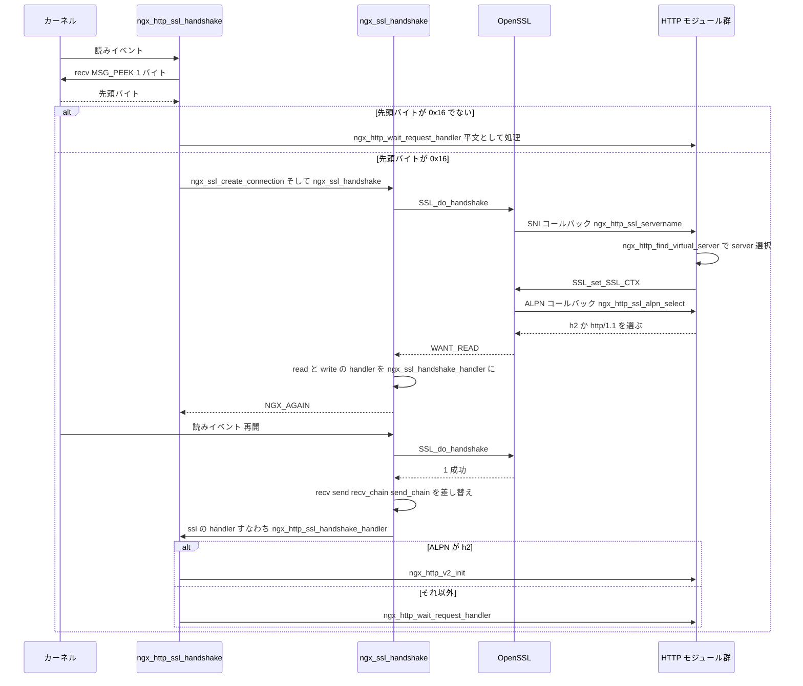

## この層の責務

nginx の HTTP 層のコードには、`SSL_read()` も `SSL_write()` も出てこない。リクエスト行を読むのは `c->recv(c, b->last, size)` で、応答を書き出すのは `c->send_chain(c, r->out, limit)` だ。平文の接続ではこれが `ngx_unix_recv` と `ngx_writev_chain` を指し、TLS の接続では `ngx_ssl_recv` と `ngx_ssl_send_chain` を指す。**呼ぶ側のコードは 1 行も変わらない。**

つまり `src/event/ngx_event_openssl.c` の 6709 行がやっているのは、OpenSSL の API を `ngx_connection_t` の 4 本の関数ポインタの形に押し込むことだ。責務を分けるとこうなる。

- **I/O の差し替え** — ハンドシェイク成功時に `recv` / `send` / `recv_chain` / `send_chain` を入れ替える。ここが層の境界。
- **ノンブロッキングとの辻褄合わせ** — OpenSSL は「読むために書きたい」「書くために読みたい」と言ってくる。これを nginx のイベントモデル ([ノンブロッキング I/O と多重化](../nonblocking-multiplexing/)) に翻訳する。
- **ハンドシェイク中の設定切り替え** — SNI で server ブロックを選び直し、証明書を選び、ALPN でプロトコルを決める。ハンドシェイクは設定が確定する前に始まるので、途中で選び直す必要がある。
- **セッション再開の共有** — セッションキャッシュとセッションチケットを、ワーカープロセスをまたいで共有する。
- **終了処理** — `close_notify` を送る/待つ判断と、`lingering_close` との順序。

TLS 終端がサーバの構造に何を押し付けるかは前提ページ [TLS 終端](../tls-termination/) にまとめてある。このページはその制約が実装のどこに現れたかを追う。

## 主要な型とその関係

### `ngx_ssl_t` — 設定 1 つにつき 1 つ

[`src/event/ngx_event_openssl.h#L105-L114`](https://github.com/nginx/nginx/blob/release-1.31.4/src/event/ngx_event_openssl.h#L105-L114) の `ngx_ssl_s` は `SSL_CTX *ctx`、`buffer_size`、証明書の配列 `certs`、OCSP ステープリング用の赤黒木の 4 つを持つだけの薄い構造体だ。`ngx_http_ssl_srv_conf_t` が 1 つ持つので、**`server` ブロックごとに 1 つの `SSL_CTX`** がある。証明書も暗号スイートもプロトコルバージョンも `SSL_CTX` に載っている。この「server ごとに `SSL_CTX`」という構造が、後で SNI の実装を素直にする。

### `ngx_ssl_connection_t` — 接続 1 本につき 1 つ

[`src/event/ngx_event_openssl.h#L117-L153`](https://github.com/nginx/nginx/blob/release-1.31.4/src/event/ngx_event_openssl.h#L117-L153)。`c->ssl` が指す先で、`ngx_pcalloc(c->pool, ...)` で確保される。

| フィールド                        | 型                          | 役割                                                                                                            |
| --------------------------------- | --------------------------- | --------------------------------------------------------------------------------------------------------------- |
| `connection`                      | `SSL *`                     | OpenSSL の接続オブジェクト。`SSL_new(ssl->ctx)` の結果                                                          |
| `session_ctx`                     | `SSL_CTX *`                 | セッションキャッシュを引くときの `SSL_CTX`。SNI で `connection` の `SSL_CTX` を差し替えても、こちらは最初のまま |
| `last`                            | `ngx_int_t`                 | 直前の `ngx_ssl_handle_recv()` の結果。`NGX_ERROR` / `NGX_DONE` を次の `ngx_ssl_recv()` に持ち越す              |
| `buf`                             | `ngx_buf_t *`               | 送信バッファ。`ssl_buffer_size` バイト                                                                          |
| `buffer_size`                     | `size_t`                    | 送信バッファのサイズ。SNI で server が決まると上書きされる                                                      |
| `handler`                         | `ngx_connection_handler_pt` | ハンドシェイク完了時に呼ぶ、上位の続き。HTTP なら `ngx_http_ssl_handshake_handler`                              |
| `session`                         | `ngx_ssl_session_t *`       | クライアント側 (`proxy_ssl`) で保存したセッション                                                               |
| `save_session`                    | `ngx_connection_handler_pt` | 新しいセッションを上位に保存させるコールバック                                                                  |
| `saved_read_handler`              | `ngx_event_handler_pt`      | 退避した上位の読み handler                                                                                      |
| `saved_write_handler`             | `ngx_event_handler_pt`      | 退避した上位の書き handler                                                                                      |
| `ocsp`                            | `ngx_ssl_ocsp_t *`          | OCSP による証明書検証の状態                                                                                     |
| `early_buf`                       | `u_char`                    | 0-RTT の 1 バイト先読み用                                                                                       |
| `handshaked:1`                    | bit                         | ハンドシェイクが完全に終わったか。**OCSP 検証が終わるまで立たない**                                             |
| `handshake_rejected:1`            | bit                         | `ssl_reject_handshake` で拒否した                                                                               |
| `renegotiation:1`                 | bit                         | 再ネゴシエーションを検知した。立つと接続を切る                                                                  |
| `buffer:1`                        | bit                         | 出力をバッファするか。`NGX_SSL_BUFFER` フラグ由来                                                               |
| `sendfile:1`                      | bit                         | kTLS が有効で `SSL_sendfile()` が使えるか                                                                       |
| `no_wait_shutdown:1`              | bit                         | 相手の `close_notify` を待たない                                                                                |
| `no_send_shutdown:1`              | bit                         | 自分の `close_notify` を送らない                                                                                |
| `shutdown_without_free:1`         | bit                         | `SSL_shutdown()` はするが `SSL_free()` はしない                                                                 |
| `handshake_buffer_set:1`          | bit                         | ハンドシェイク用のバッファ設定を済ませた                                                                        |
| `session_timeout_set:1`           | bit                         | セッションタイムアウトを設定済み                                                                                |
| `try_early_data:1` / `in_early:1` | bit                         | 0-RTT の状態                                                                                                    |
| `in_ocsp:1`                       | bit                         | OCSP 検証の待ちに入っている                                                                                     |
| `early_preread:1`                 | bit                         | 0-RTT の先読みを済ませた                                                                                        |
| `write_blocked:1`                 | bit                         | 書きが詰まっている                                                                                              |
| `sni_accepted:1`                  | bit                         | SNI コールバックを 1 回通した                                                                                   |

ビットフィールドが 16 個並んでいるのは、**OpenSSL 側の状態を nginx 側の言葉に翻訳した結果を覚えておく場所**が要るからだ。`no_wait_shutdown` / `no_send_shutdown` の 2 つは特に効く。エラーが起きたところで両方を立て、シャットダウン時に `SSL_shutdown()` を静かに済ませる。

### `ngx_connection_t` 側の 4 本

[`src/core/ngx_connection.h#L134-L137`](https://github.com/nginx/nginx/blob/release-1.31.4/src/core/ngx_connection.h#L134-L137)。

```c title="src/core/ngx_connection.h"
    ngx_recv_pt         recv;
    ngx_send_pt         send;
    ngx_recv_chain_pt   recv_chain;
    ngx_send_chain_pt   send_chain;
```

この 4 本が層の境界そのものだ。TLS が割り込むのはここだけで、`ngx_connection_t` の他のフィールドは何も変わらない。

### セッションキャッシュの型

共有メモリに置かれる。[`#L166-L196`](https://github.com/nginx/nginx/blob/release-1.31.4/src/event/ngx_event_openssl.h#L166-L196)。

```c title="src/event/ngx_event_openssl.h"
struct ngx_ssl_sess_id_s {
    ngx_rbtree_node_t           node;
    size_t                      len;
    ngx_queue_t                 queue;
    time_t                      expire;
    u_char                      id[32];
    /* ... 64 ビットでは session はポインタ、32 ビットでは可変長配列 ... */
};

typedef struct {
    ngx_rbtree_t                session_rbtree;
    ngx_rbtree_node_t           sentinel;
    ngx_queue_t                 expire_queue;
    ngx_ssl_ticket_key_t        ticket_keys[3];
    time_t                      fail_time;
} ngx_ssl_session_cache_t;
```

セッション ID をキーにした赤黒木と、期限順のキューの二重連結。木は検索用、キューは追い出し用になっている。同じ構造は [ファイルキャッシュ](../file-cache/) にも出てくる。

## 処理の流れ

### 1. 最初の 1 バイトを覗いて TLS かどうかを決める

`ngx_http_init_connection()` は、リッスンしているアドレスに `ssl` が付いていれば読み handler を差し替える ([`src/http/ngx_http_request.c#L338-L344`](https://github.com/nginx/nginx/blob/release-1.31.4/src/http/ngx_http_request.c#L338-L344))。

```c title="src/http/ngx_http_request.c"
#if (NGX_HTTP_SSL)
    if (hc->addr_conf->ssl) {
        hc->ssl = 1;
        c->log->action = "SSL handshaking";
        rev->handler = ngx_http_ssl_handshake;
    }
#endif
```

`ngx_http_ssl_handshake()` は、いきなり `SSL_do_handshake()` を呼ばない。まず 1 バイトだけ覗く ([`#L704-L710`](https://github.com/nginx/nginx/blob/release-1.31.4/src/http/ngx_http_request.c#L704-L710))。

```c title="src/http/ngx_http_request.c"
    size = hc->proxy_protocol ? sizeof(buf) : 1;

    n = recv(c->fd, (char *) buf, size, MSG_PEEK);
```

`MSG_PEEK` なので、読んだバイトはソケットに残る。そして先頭バイトを見て分岐する ([`#L764-L815`](https://github.com/nginx/nginx/blob/release-1.31.4/src/http/ngx_http_request.c#L764-L815))。

```c title="src/http/ngx_http_request.c"
    if (n == 1) {
        if (buf[0] & 0x80 /* SSLv2 */ || buf[0] == 0x16 /* SSLv3/TLSv1 */) {
            /* ... ngx_ssl_create_connection() → ngx_ssl_handshake() ... */
            return;
        }

        ngx_log_debug0(NGX_LOG_DEBUG_HTTP, rev->log, 0, "plain http");

        c->log->action = "waiting for request";

        rev->handler = ngx_http_wait_request_handler;
        ngx_http_wait_request_handler(rev);

        return;
    }
```

`0x16` は TLS レコード層の ContentType `handshake` だ。**平文の HTTP リクエストは必ず ASCII のメソッド名から始まるので、この 1 バイトで区別が付く。** 平文だと分かったら `rev->handler` を `ngx_http_wait_request_handler` に戻して、そのまま呼ぶ。TLS のポートに `GET / HTTP/1.1` を投げると 400 が返るのは、この経路を通って HTTP としてパースされるからだ。

`MSG_PEEK` を使う理由は、この判定のあとで OpenSSL に同じバイトを読ませる必要があるからだ。消費してしまうと `SSL_do_handshake()` が ClientHello の先頭を見失う。

### 2. `ngx_ssl_create_connection()` が `SSL *` を作る

[`src/event/ngx_event_openssl.c#L2106-L2158`](https://github.com/nginx/nginx/blob/release-1.31.4/src/event/ngx_event_openssl.c#L2106-L2158)。

```c title="src/event/ngx_event_openssl.c"
    sc->buffer = ((flags & NGX_SSL_BUFFER) != 0);
    sc->buffer_size = ssl->buffer_size;

    sc->session_ctx = ssl->ctx;

    sc->connection = SSL_new(ssl->ctx);
    /* ... */
    if (SSL_set_fd(sc->connection, c->fd) == 0) { /* ... */ }

    if (flags & NGX_SSL_CLIENT) {
        SSL_set_connect_state(sc->connection);

    } else {
        SSL_set_accept_state(sc->connection);

#ifdef SSL_OP_NO_RENEGOTIATION
        SSL_set_options(sc->connection, SSL_OP_NO_RENEGOTIATION);
#endif
    }

    if (SSL_set_ex_data(sc->connection, ngx_ssl_connection_index, c) == 0) { /* ... */ }

    c->ssl = sc;
```

3 点ある。**`SSL_set_fd()` で OpenSSL に直接 fd を渡している** ので、BIO を自前で書く必要がない。`SSL_set_ex_data()` で `SSL *` から `ngx_connection_t *` を逆引きできるようにしてあり、OpenSSL のコールバック (SNI、ALPN、証明書、セッション) は全部これを使って nginx 側の文脈に戻る。そして `NGX_SSL_CLIENT` フラグ 1 つで、サーバ側と上流側 (`proxy_ssl`) の両方を同じ関数で扱う。

### 3. `ngx_ssl_handshake()` — 成功したら 4 本を差し替える

[`#L2200-L2345`](https://github.com/nginx/nginx/blob/release-1.31.4/src/event/ngx_event_openssl.c#L2200-L2345)。成功パスの核心は 5 行だ ([`#L2237-L2243`](https://github.com/nginx/nginx/blob/release-1.31.4/src/event/ngx_event_openssl.c#L2237-L2243))。

```c title="src/event/ngx_event_openssl.c"
        c->recv = ngx_ssl_recv;
        c->send = ngx_ssl_write;
        c->recv_chain = ngx_ssl_recv_chain;
        c->send_chain = ngx_ssl_send_chain;

        c->read->ready = 1;
        c->write->ready = 1;
```

**この 4 行が TLS 層のすべてと言っていい。** 以降、`ngx_http_wait_request_handler()` も `ngx_http_write_filter()` も `ngx_http_upstream` も、TLS のことを一切知らずに動く。

同じ関数の中で kTLS の可否も決まる ([`#L2257-L2265`](https://github.com/nginx/nginx/blob/release-1.31.4/src/event/ngx_event_openssl.c#L2257-L2265))。

```c title="src/event/ngx_event_openssl.c"
        if (BIO_get_ktls_send(SSL_get_wbio(c->ssl->connection)) == 1) {
            ngx_log_debug0(NGX_LOG_DEBUG_EVENT, c->log, 0,
                           "BIO_get_ktls_send(): 1");
            c->ssl->sendfile = 1;
        }
```

そして `handshaked = 1` はすぐには立たない。OCSP 検証が `NGX_AGAIN` を返したら、**read/write の両方の handler を `ngx_ssl_handshake_handler` にしてから帰る** ([`#L2267-L2281`](https://github.com/nginx/nginx/blob/release-1.31.4/src/event/ngx_event_openssl.c#L2267-L2281))。

失敗パスは `SSL_get_error()` の値で 2 つに分かれる。

```c title="src/event/ngx_event_openssl.c"
    if (sslerr == SSL_ERROR_WANT_READ) {
        c->read->ready = 0;
        c->read->handler = ngx_ssl_handshake_handler;
        c->write->handler = ngx_ssl_handshake_handler;
        /* ... ngx_handle_read_event / ngx_handle_write_event ... */
        return NGX_AGAIN;
    }

    if (sslerr == SSL_ERROR_WANT_WRITE) {
        c->write->ready = 0;
        c->read->handler = ngx_ssl_handshake_handler;
        c->write->handler = ngx_ssl_handshake_handler;
        /* ... */
        return NGX_AGAIN;
    }
```

**どちらの場合も、read と write の両方の handler を同じものにする。** ハンドシェイク中は「読めるようになった」も「書けるようになった」も、やることは `SSL_do_handshake()` の再実行でしかないからだ ([`#L2546-L2566`](https://github.com/nginx/nginx/blob/release-1.31.4/src/event/ngx_event_openssl.c#L2546-L2566))。

```c title="src/event/ngx_event_openssl.c"
static void
ngx_ssl_handshake_handler(ngx_event_t *ev)
{
    ngx_connection_t  *c;

    c = ev->data;
    /* ... */
    if (ev->timedout) {
        c->ssl->handler(c);
        return;
    }

    if (ngx_ssl_handshake(c) == NGX_AGAIN) {
        return;
    }

    c->ssl->handler(c);
}
```

`c->ssl->handler` を呼ぶのは、成功でもタイムアウトでも同じだ。上位は `c->ssl->handshaked` を見て判定する。

### 4. ハンドシェイクの途中で server を選び直す

ClientHello の SNI を見た時点で、OpenSSL は `ngx_http_ssl_servername()` を呼ぶ。登録は [`src/http/modules/ngx_http_ssl_module.c#L785-L786`](https://github.com/nginx/nginx/blob/release-1.31.4/src/http/modules/ngx_http_ssl_module.c#L785-L786) にある。

```c title="src/http/ngx_http_request.c"
    rc = ngx_http_find_virtual_server(c, hc->addr_conf->virtual_names, &host,
                                      NULL, &cscf);
    /* ... */
    hc->ssl_servername = ngx_palloc(c->pool, sizeof(ngx_str_t));
    /* ... */
    *hc->ssl_servername = host;

    hc->conf_ctx = cscf->ctx;

    clcf = ngx_http_get_module_loc_conf(hc->conf_ctx, ngx_http_core_module);

    ngx_set_connection_log(c, clcf->error_log);

    sscf = ngx_http_get_module_srv_conf(cscf->ctx, ngx_http_ssl_module);

    c->ssl->buffer_size = sscf->buffer_size;

    if (sscf->ssl.ctx) {
        if (SSL_set_SSL_CTX(ssl_conn, sscf->ssl.ctx) == NULL) {
            goto error;
        }
```

([`src/http/ngx_http_request.c#L953-L984`](https://github.com/nginx/nginx/blob/release-1.31.4/src/http/ngx_http_request.c#L953-L984))

**Host ヘッダを見るのと同じ `ngx_http_find_virtual_server()` を、ハンドシェイクの途中から呼んでいる。** server の選び方は [virtual server と location の選択](../virtual-server-location/) と完全に同じロジックで、入力が Host ヘッダか SNI かの違いしかない。

選び直した結果として `hc->conf_ctx` が置き換わる。以降、この接続で参照される設定は新しい server のものになる。そして `SSL_set_SSL_CTX()` で証明書一式が入れ替わる。ただしこれだけでは足りないと、コードにコメントが付いている ([`#L986-L1002`](https://github.com/nginx/nginx/blob/release-1.31.4/src/http/ngx_http_request.c#L986-L1002))。

```c title="src/http/ngx_http_request.c"
        /*
         * SSL_set_SSL_CTX() only changes certs as of 1.0.0d
         * adjust other things we care about
         */

        SSL_set_verify(ssl_conn, SSL_CTX_get_verify_mode(sscf->ssl.ctx),
                       SSL_CTX_get_verify_callback(sscf->ssl.ctx));

        SSL_set_verify_depth(ssl_conn, SSL_CTX_get_verify_depth(sscf->ssl.ctx));
```

`SSL_set_SSL_CTX()` が証明書しか移さないので、verify モード・verify 深さ・オプションビットを手で移し替えている。**「`SSL_CTX` を差し替える」という一手が、実際には 1 対 1 の移し替えを伴う**という、OpenSSL の API の粗さがそのまま出た箇所になっている。

`c->ssl->session_ctx` はここで触られない。SNI で `SSL_CTX` が変わっても、セッションキャッシュを引くときの文脈は最初のままだ。

証明書を変数で選ぶ経路は別にある。`ssl_certificate` に `$` が含まれていると、`SSL_CTX_set_cert_cb()` で `ngx_http_ssl_certificate()` が登録される ([`src/http/modules/ngx_http_ssl_module.c#L818`](https://github.com/nginx/nginx/blob/release-1.31.4/src/http/modules/ngx_http_ssl_module.c#L818))。中身が独特だ ([`src/http/ngx_http_request.c#L1041-L1106`](https://github.com/nginx/nginx/blob/release-1.31.4/src/http/ngx_http_request.c#L1041-L1106))。

```c title="src/http/ngx_http_request.c"
    r = ngx_http_alloc_request(c);
    if (r == NULL) {
        return 0;
    }

    r->logged = 1;

    sscf = arg;

    nelts = sscf->certificate_values->nelts;
    certs = sscf->certificate_values->elts;
    keys = sscf->certificate_key_values->elts;

    for (i = 0; i < nelts; i++) {

        if (ngx_http_complex_value(r, &certs[i], &cert) != NGX_OK) {
            goto failed;
        }
        /* ... */
        if (ngx_ssl_connection_certificate(c, r->pool, &cert, &key,
                                           sscf->certificate_cache,
                                           sscf->passwords)
            != NGX_OK)
        {
            goto failed;
        }
    }

    ngx_http_free_request(r, 0);
```

**まだ 1 バイトも HTTP を読んでいないのに、`ngx_http_request_t` を作っている。** [変数](../variables/) の評価には `ngx_http_request_t` が要るからだ。作って、変数を評価して、証明書を積んで、すぐ捨てる。`r->logged = 1` は access ログを出させないため、`c->destroyed = 0` は `ngx_http_free_request()` が立てたフラグを戻すためにある。

`ngx_ssl_connection_certificate()` ([`src/event/ngx_event_openssl.c#L635`](https://github.com/nginx/nginx/blob/release-1.31.4/src/event/ngx_event_openssl.c#L635)) はこの接続の `SSL *` に証明書を追加する。`SSL_CTX` を作り直すのではなく、接続単位で積む形になっている。

### 5. ALPN で HTTP/2 か HTTP/1.1 かを決める

`ngx_http_ssl_alpn_select()` ([`src/http/modules/ngx_http_ssl_module.c#L450-L539`](https://github.com/nginx/nginx/blob/release-1.31.4/src/http/modules/ngx_http_ssl_module.c#L450-L539)) は、サーバが受け入れるプロトコルの並びを組み立てて `SSL_select_next_proto()` に渡す ([`#L513-L525`](https://github.com/nginx/nginx/blob/release-1.31.4/src/http/modules/ngx_http_ssl_module.c#L513-L525))。

```c title="src/http/modules/ngx_http_ssl_module.c"
        h2scf = ngx_http_get_module_srv_conf(hc->conf_ctx, ngx_http_v2_module);

        if (h2scf->enable || hc->addr_conf->http2) {
            srv = (unsigned char *) NGX_HTTP_V2_ALPN_PROTO NGX_HTTP_ALPN_PROTOS;
            srvlen = sizeof(NGX_HTTP_V2_ALPN_PROTO NGX_HTTP_ALPN_PROTOS) - 1;

        } else
        {
            srv = (unsigned char *) NGX_HTTP_ALPN_PROTOS;
            srvlen = sizeof(NGX_HTTP_ALPN_PROTOS) - 1;
        }
```

`NGX_HTTP_ALPN_PROTOS` は `"\x08http/1.1\x08http/1.0\x08http/0.9"` ([`#L24`](https://github.com/nginx/nginx/blob/release-1.31.4/src/http/modules/ngx_http_ssl_module.c#L24))。長さプレフィックス付きの並びで、`h2` を先頭に足すかどうかだけが分岐点になる。`hc->conf_ctx` を参照しているので、**SNI で server が選び直された後の設定が効く**。

決まった結果を使うのは `ngx_http_ssl_handshake_handler()` だ ([`src/http/ngx_http_request.c#L823-L879`](https://github.com/nginx/nginx/blob/release-1.31.4/src/http/ngx_http_request.c#L823-L879))。

```c title="src/http/ngx_http_request.c"
        c->ssl->no_wait_shutdown = 1;
        /* ... */
        if (h2scf->enable || hc->addr_conf->http2) {

            SSL_get0_alpn_selected(c->ssl->connection, &data, &len);

            if (len == 2 && data[0] == 'h' && data[1] == '2') {
                ngx_http_v2_init(c->read);
                return;
            }
        }
        /* ... */
        c->log->action = "waiting for request";

        c->read->handler = ngx_http_wait_request_handler;
        /* STUB: epoll edge */ c->write->handler = ngx_http_empty_handler;

        ngx_reusable_connection(c, 1);

        ngx_http_wait_request_handler(c->read);
```

**分岐は 2 行で、選ばれたプロトコル名が `h2` かどうかだけを見る。** `h2` なら [HTTP/2 の多重化](../http2-multiplexing/) の入口へ、それ以外なら HTTP/1.1 の通常の待ち受けに入る。

冒頭の `no_wait_shutdown = 1` にはコメントが付いていて、大半のブラウザが `close_notify` を送ってこないから待たない、と書いてある。

### 6. 読みが書きを要求する — `saved_*_handler`

TLS の非対称性が実装に出るのはここだ。`SSL_read()` が `SSL_ERROR_WANT_WRITE` を返すことがある。中で再ネゴシエーションやセッションチケットの送出が起きたときだ。逆に `SSL_write()` が `SSL_ERROR_WANT_READ` を返すこともある。

`ngx_ssl_handle_recv()` の該当箇所 ([`src/event/ngx_event_openssl.c#L2959-L2980`](https://github.com/nginx/nginx/blob/release-1.31.4/src/event/ngx_event_openssl.c#L2959-L2980))。

```c title="src/event/ngx_event_openssl.c"
    if (sslerr == SSL_ERROR_WANT_WRITE) {

        ngx_log_debug0(NGX_LOG_DEBUG_EVENT, c->log, 0,
                       "SSL_read: want write");

        c->write->ready = 0;

        if (ngx_handle_write_event(c->write, 0) != NGX_OK) {
            return NGX_ERROR;
        }

        /*
         * we do not set the timer because there is already the read event timer
         */

        if (c->ssl->saved_write_handler == NULL) {
            c->ssl->saved_write_handler = c->write->handler;
            c->write->handler = ngx_ssl_write_handler;
        }

        return NGX_AGAIN;
    }
```

**上位の書き handler を `saved_write_handler` に退避して、自分の handler を置く。** 置かれる handler の中身がこれだ ([`#L2997-L3007`](https://github.com/nginx/nginx/blob/release-1.31.4/src/event/ngx_event_openssl.c#L2997-L3007))。

```c title="src/event/ngx_event_openssl.c"
static void
ngx_ssl_write_handler(ngx_event_t *wev)
{
    ngx_connection_t  *c;

    c = wev->data;

    ngx_log_debug0(NGX_LOG_DEBUG_EVENT, c->log, 0, "SSL write handler");

    c->read->handler(c->read);
}
```

**書けるようになったら、読みの handler を呼ぶ。** 上位から見れば「読み待ちだったものが再開した」だけに見える。書き側の準備完了イベントを、読み側の再開に横流ししている。

対称形が `ngx_ssl_write()` にもある ([`#L3283-L3305`](https://github.com/nginx/nginx/blob/release-1.31.4/src/event/ngx_event_openssl.c#L3283-L3305)) 。`SSL_ERROR_WANT_READ` なら `saved_read_handler` に退避して `ngx_ssl_read_handler` を置き、そちらは `c->write->handler(c->write)` を呼ぶ ([`#L3611-L3621`](https://github.com/nginx/nginx/blob/release-1.31.4/src/event/ngx_event_openssl.c#L3611-L3621))。

戻すのは、元の操作が進んだときだ ([`#L2916-L2932`](https://github.com/nginx/nginx/blob/release-1.31.4/src/event/ngx_event_openssl.c#L2916-L2932))。

```c title="src/event/ngx_event_openssl.c"
    if (n > 0) {

        if (c->ssl->saved_write_handler) {

            c->write->handler = c->ssl->saved_write_handler;
            c->ssl->saved_write_handler = NULL;
            c->write->ready = 1;

            if (ngx_handle_write_event(c->write, 0) != NGX_OK) {
                return NGX_ERROR;
            }

            ngx_post_event(c->write, &ngx_posted_events);
        }

        return NGX_OK;
    }
```

**戻したうえで `ngx_post_event()` する。** 退避していた間に上位が書きたかったかもしれないので、書きイベントを 1 回発火させて確かめさせる。ここで posted event キューを使うのは、`SSL_read()` の途中から上位の書き handler を直接呼ぶと再入になるからだ。posted event の仕組みは [ワーカーの 1 周](../state-machine/) にある。

これが前提ページ [TLS 終端](../tls-termination/) で挙げた「読みと書きが独立でなくなる」の実装だ。**イベントの向きとハンドラの向きが 1 対 1 でなくなる**箇所は、nginx 全体でここだけになっている。

### 7. 送信は溜めてから 1 回で暗号化する

`ngx_ssl_send_chain()` ([`#L3018-L3203`](https://github.com/nginx/nginx/blob/release-1.31.4/src/event/ngx_event_openssl.c#L3018-L3203)) の頭に理由がコメントで書いてある。

```c title="src/event/ngx_event_openssl.c"
/*
 * OpenSSL has no SSL_writev() so we copy several bufs into our 16K buffer
 * before the SSL_write() call to decrease a SSL overhead.
 *
 * Besides for protocols such as HTTP it is possible to always buffer
 * the output to decrease a SSL overhead some more.
 */
```

`writev()` に当たる API が無いので、[buf と chain](../buf-chain/) で持ち回っている断片を 1 枚のバッファに `ngx_memcpy` で集めてから `SSL_write()` を 1 回呼ぶ。バッファは `c->ssl->buffer_size` バイトで、既定は `NGX_SSL_BUFSIZE` = 16384 ([`src/event/ngx_event_openssl.h#L224`](https://github.com/nginx/nginx/blob/release-1.31.4/src/event/ngx_event_openssl.h#L224))。

```c title="src/event/ngx_event_openssl.c"
        while (in && buf->last < buf->end && send < limit) {
            if (in->buf->last_buf || in->buf->flush) {
                flush = 1;
            }

            if (ngx_buf_special(in->buf)) {
                in = in->next;
                continue;
            }

            if (in->buf->in_file && c->ssl->sendfile) {
                flush = 1;
                break;
            }

            size = in->buf->last - in->buf->pos;

            if (size > buf->end - buf->last) {
                size = buf->end - buf->last;
            }
            /* ... */
            ngx_memcpy(buf->last, in->buf->pos, size);
```

([`#L3089-L3126`](https://github.com/nginx/nginx/blob/release-1.31.4/src/event/ngx_event_openssl.c#L3089-L3126))

バッファが埋まるか `flush` が立つまで送らない。溜まったまま関数を抜けるときは `c->buffered |= NGX_SSL_BUFFERED` を立てる ([`#L3195-L3200`](https://github.com/nginx/nginx/blob/release-1.31.4/src/event/ngx_event_openssl.c#L3195-L3200))。この 1 ビットが [出力フィルタチェーン](../output-filter-chain/) の `ngx_http_write_filter` に「まだ下に残っている」と伝える。

**`sendfile` は使えなくなる。** ファイルの中身を暗号化するには一度ユーザ空間に持ってくるしかない。この判断は 4 行で書かれている ([`src/http/ngx_http_request.c#L639-L643`](https://github.com/nginx/nginx/blob/release-1.31.4/src/http/ngx_http_request.c#L639-L643))。

```c title="src/http/ngx_http_request.c"
#if (NGX_HTTP_SSL)
    if (c->ssl && !c->ssl->sendfile) {
        r->main_filter_need_in_memory = 1;
    }
#endif
```

`ngx_http_alloc_request()` の中だ。`main_filter_need_in_memory` が立つと、`ngx_http_copy_filter_module` が `ctx->need_in_memory` を立て ([`src/http/ngx_http_copy_filter_module.c#L109-L111`](https://github.com/nginx/nginx/blob/release-1.31.4/src/http/ngx_http_copy_filter_module.c#L109-L111))、`ngx_output_chain_as_is()` が「メモリに無い buf はそのまま通さない」と判断する ([`src/core/ngx_output_chain.c#L297-L299`](https://github.com/nginx/nginx/blob/release-1.31.4/src/core/ngx_output_chain.c#L297-L299))。結果としてファイルは `read()` で読まれてメモリの buf になる。[OS のファイル送出機構](../os-file-serving/) で見た `sendfile()` の経路が、フラグ 1 つで無効化される。

kTLS があれば話は別で、`c->ssl->sendfile` が立っていれば `SSL_sendfile()` を呼ぶ ([`#L3136-L3159`](https://github.com/nginx/nginx/blob/release-1.31.4/src/event/ngx_event_openssl.c#L3136-L3159))。上の `if (c->ssl && !c->ssl->sendfile)` の否定はこのためにある。

### 8. 受信は「読めるだけ読む」を守る

`ngx_ssl_recv()` ([`#L2632-L2757`](https://github.com/nginx/nginx/blob/release-1.31.4/src/event/ngx_event_openssl.c#L2632-L2757)) には、TLS 特有の落とし穴への対処が入っている。

```c title="src/event/ngx_event_openssl.c"
            if (size == 0) {
                c->read->ready = 1;

                if (c->read->available >= 0) {
                    c->read->available -= bytes;

                    /*
                     * there can be data buffered at SSL layer,
                     * so we post an event to continue reading on the next
                     * iteration of the event loop
                     */

                    if (c->read->available < 0) {
                        c->read->available = 0;
                        c->read->ready = 0;

                        if (c->read->posted) {
                            ngx_delete_posted_event(c->read);
                        }

                        ngx_post_event(c->read, &ngx_posted_next_events);
                    }
```

([`#L2680-L2701`](https://github.com/nginx/nginx/blob/release-1.31.4/src/event/ngx_event_openssl.c#L2680-L2701))

**カーネルのソケットバッファが空でも、OpenSSL の中にまだ平文が残っていることがある。** 1 つの TLS レコードから複数回に分けて読み出す場合だ。`epoll` はこれを教えてくれないので、`ngx_posted_next_events` に読みイベントを積んで、次のループで必ずもう一度読ませる。ここを落とすと、届いているデータが処理されないまま接続がタイムアウトする。

`ngx_posted_next_events` は「次の 1 周で処理する」キューで、[ワーカーの 1 周](../state-machine/) の中で `ngx_posted_events` に移される。同じ周で処理すると無限ループになりうるので、1 周ずらしている。

### 9. シャットダウン

`ngx_ssl_shutdown()` ([`#L3635-L3769`](https://github.com/nginx/nginx/blob/release-1.31.4/src/event/ngx_event_openssl.c#L3635-L3769)) は、送るか待つかを 4 つのフラグから決める。

```c title="src/event/ngx_event_openssl.c"
    if (c->timedout || c->error || c->buffered) {
        mode = SSL_RECEIVED_SHUTDOWN|SSL_SENT_SHUTDOWN;
        SSL_set_quiet_shutdown(c->ssl->connection, 1);

    } else {
        mode = SSL_get_shutdown(c->ssl->connection);

        if (c->ssl->no_wait_shutdown) {
            mode |= SSL_RECEIVED_SHUTDOWN;
        }

        if (c->ssl->no_send_shutdown) {
            mode |= SSL_SENT_SHUTDOWN;
        }

        if (c->ssl->no_wait_shutdown && c->ssl->no_send_shutdown) {
            SSL_set_quiet_shutdown(c->ssl->connection, 1);
        }
    }
```

`SSL_RECEIVED_SHUTDOWN` を立てるのは「相手の `close_notify` を受け取ったことにする」という意味で、待たなくなる。`SSL_SENT_SHUTDOWN` は「自分は送ったことにする」で、送らなくなる。**両方立てば `SSL_shutdown()` は何もせずに 1 を返す。** エラーで死ぬときはこの経路になる。

正常時は `close_notify` を送って、相手のを待つ。`SSL_shutdown()` を 2 回呼ぶ必要があることもコメントで説明されている ([`#L3692-L3708`](https://github.com/nginx/nginx/blob/release-1.31.4/src/event/ngx_event_openssl.c#L3692-L3708))。待つ間は handler を `ngx_ssl_shutdown_handler` にして 3 秒のタイマを張る。

`lingering_close` との順序が独特だ ([`src/http/ngx_http_request.c#L3682-L3700`](https://github.com/nginx/nginx/blob/release-1.31.4/src/http/ngx_http_request.c#L3682-L3700))。

```c title="src/http/ngx_http_request.c"
#if (NGX_HTTP_SSL)
    if (c->ssl) {
        ngx_int_t  rc;

        c->ssl->shutdown_without_free = 1;

        rc = ngx_ssl_shutdown(c);

        if (rc == NGX_ERROR) {
            ngx_http_close_request(r, 0);
            return;
        }

        if (rc == NGX_AGAIN) {
            c->ssl->handler = ngx_http_set_lingering_close;
            return;
        }
    }
#endif
```

**`shutdown_without_free = 1` を立ててから `ngx_ssl_shutdown()` を呼ぶ。** すると `SSL_free()` されずに `c->recv` だけが `ngx_recv` に戻る ([`src/event/ngx_event_openssl.c#L3758-L3762`](https://github.com/nginx/nginx/blob/release-1.31.4/src/event/ngx_event_openssl.c#L3758-L3762))。この後 `lingering_close` は残ったリクエストボディを読み捨てるが、TLS を剥がした後なので暗号文をそのまま捨てられる。**復号する意味のないデータに CPU を使わない**ための細工になっている。終了処理全体の位置づけは [リクエストの終わらせ方](../finalize-request/) にある。

### 10. 上流側も同じ関数を通る

`proxy_ssl` は `ngx_ssl_*` をそのまま使う ([`src/http/ngx_http_upstream.c#L1760-L1761`](https://github.com/nginx/nginx/blob/release-1.31.4/src/http/ngx_http_upstream.c#L1760-L1761))。

```c title="src/http/ngx_http_upstream.c"
    if (ngx_ssl_create_connection(u->conf->ssl, c,
                                  NGX_SSL_BUFFER|NGX_SSL_CLIENT)
```

`NGX_SSL_CLIENT` が付くだけで、あとは `ngx_ssl_handshake()` を呼び、`NGX_AGAIN` なら `c->ssl->handler` に続きを入れる ([`#L1828-L1838`](https://github.com/nginx/nginx/blob/release-1.31.4/src/http/ngx_http_upstream.c#L1828-L1838))。ハンドシェイク完了後にやることが 1 つ多い ([`#L1885-L1896`](https://github.com/nginx/nginx/blob/release-1.31.4/src/http/ngx_http_upstream.c#L1885-L1896))。

```c title="src/http/ngx_http_upstream.c"
            if (ngx_ssl_check_host(c, &u->ssl_name) != NGX_OK) {
                ngx_log_error(NGX_LOG_ERR, c->log, 0,
                              "upstream SSL certificate does not match \"%V\"",
                              &u->ssl_name);
                goto failed;
            }
        }

        if (!c->ssl->sendfile) {
            c->sendfile = 0;
            u->output.sendfile = 0;
        }
```

クライアントとして接続するので証明書のホスト名検証が要る。そして下流側と同じ理由で `sendfile` を落とす。**上流側では `r->main_filter_need_in_memory` ではなく `c->sendfile` と `u->output.sendfile` を直接落とす**のは、上流への書き出しが [出力フィルタチェーン](../output-filter-chain/) ではなく `u->output` を通るからだ。

### ハンドシェイクの全体



## 守られている不変条件

**`c->recv` が `ngx_ssl_recv` を指しているなら、`c->ssl->connection` は有効な `SSL *` である。** 差し替えは `ngx_ssl_handshake()` の成功パスでしか起きず、戻すのは `ngx_ssl_shutdown()` の末尾だけだ。`ngx_ssl_shutdown()` は `c->recv = ngx_recv` を必ず実行する — `shutdown_without_free` の分岐でも実行する。

**`saved_read_handler` と `saved_write_handler` が同時に埋まることはない。** 埋めるのは「読みが書きを待つ」と「書きが読みを待つ」の 2 通りで、どちらも進捗があれば即座に戻す。両方が埋まると、`ngx_ssl_write_handler` が `c->read->handler` (= `ngx_ssl_read_handler`) を呼び、それが `c->write->handler` (= `ngx_ssl_write_handler`) を呼ぶ無限再帰になる。埋める側が `if (c->ssl->saved_write_handler == NULL)` で二重代入を防いでいるのは、この形を作らないためだ。

**`c->ssl->handshaked` が立つのは OCSP 検証まで終わった後だけ。** `ngx_ssl_handshake()` の中で `SSL_do_handshake()` が 1 を返しても、`ngx_ssl_ocsp_validate()` が `NGX_AGAIN` を返す間は立たない。上位が `handshaked` を見て分岐しているので、この順序が崩れると検証前のリクエストが通る。

**`session_ctx` は SNI で差し替わらない。** `SSL_CTX` を差し替えてもセッションキャッシュの引き先は最初のままにする。セッション ID の名前空間が server ごとに割れると、再開できるはずのセッションが再開できなくなる。

**共有メモリのスラブロックを握ったまま `i2d_SSL_SESSION()` を呼ばない。** [`#L4356-L4358`](https://github.com/nginx/nginx/blob/release-1.31.4/src/event/ngx_event_openssl.c#L4356-L4358) にコメントで書いてある。ASN.1 のシリアライズはワーカーごとの静的バッファ `ngx_ssl_session_buffer` に対して行い、ロックの中では `ngx_memcpy` しかしない。ロック区間を短く保つ話は [スラブアロケータ](../slab-shared-memory/) の主題でもある。

**セッションキャッシュの確保は必ず 2 段構えで試す。** `ngx_slab_alloc_locked()` が失敗したら `ngx_ssl_expire_sessions(cache, shpool, 0)` で最も古い有効なセッションを 1 つ捨て、もう一度試す ([`#L4430-L4460`](https://github.com/nginx/nginx/blob/release-1.31.4/src/event/ngx_event_openssl.c#L4430-L4460))。キャッシュは満杯になっても機能を止めない。

**チケットキーは常に 3 本ある。** `ngx_ssl_ticket_keys_t` ではなく `cache->ticket_keys[3]` で、`[0]` が現在、`[1]` が 1 つ前、`[2]` が次だ ([`#L5123-L5184`](https://github.com/nginx/nginx/blob/release-1.31.4/src/event/ngx_event_openssl.c#L5123-L5184))。ローテーション時は `[1] = [0]; [0] = [2];` として `[2]` を新規生成する。**次のキーを先に作っておく**ので、切り替わりの瞬間に「どのワーカーもまだ新しいキーを知らない」時間が生じない。

## つまずきどころ

### `ngx_ssl_recv()` は `read->ready` が立っていても 0 バイト返しうる

`c->ssl->last` に前回の結果が残っている。`NGX_ERROR` なら `read->error = 1` を立てて `NGX_ERROR`、`NGX_DONE` なら `read->eof = 1` を立てて 0 を返し、`SSL_read()` を呼ばない ([`#L2643-L2653`](https://github.com/nginx/nginx/blob/release-1.31.4/src/event/ngx_event_openssl.c#L2643-L2653))。

TLS には「レコードが壊れたらそれ以降は読めない」という性質があり、平文のソケットのように「エラーの後もう一度 `read()` してみる」ができない。状態を持ち越して同じ答えを返し続ける形にしてある。

### `ngx_ssl_recv_chain()` は `ngx_ssl_recv()` のループでしかない

[`#L2569-L2629`](https://github.com/nginx/nginx/blob/release-1.31.4/src/event/ngx_event_openssl.c#L2569-L2629)。`readv()` に当たる API が無いので、chain の buf を順に埋める。平文側の `ngx_readv_chain()` が 1 回のシステムコールで済むのに対し、こちらは buf の数だけ `SSL_read()` が走る。[上流のイベントパイプ](../upstream-event-pipe/) が大量の buf を渡すと、その分だけ `SSL_read()` の呼び出しが増える。

### `c->buffered` のビットは複数のレイヤが分け合っている

`NGX_SSL_BUFFERED` は `0x01`、`NGX_HTTP_V2_BUFFERED` は `0x02`、まとめて `NGX_LOWLEVEL_BUFFERED` が `0x0f` ([`src/core/ngx_connection.h#L122-L124`](https://github.com/nginx/nginx/blob/release-1.31.4/src/core/ngx_connection.h#L122-L124))。`ngx_http_write_filter` は `c->buffered & NGX_LOWLEVEL_BUFFERED` を見て「下に残っている」を判定する。TLS と HTTP/2 が同じ接続に載ることがあるので、ビットを分けてある。

### `ssl_buffer_size` は SNI の後に変わる

`ngx_ssl_create_connection()` が `sc->buffer_size = ssl->buffer_size` を入れ、`ngx_http_ssl_servername()` が `c->ssl->buffer_size = sscf->buffer_size` で上書きする。ところが `c->ssl->buf` の実体は最初の `ngx_ssl_send_chain()` で確保される ([`#L3064-L3082`](https://github.com/nginx/nginx/blob/release-1.31.4/src/event/ngx_event_openssl.c#L3064-L3082))。つまり **確保はハンドシェイクの後**なので、SNI で選ばれた server の値が効く。ここが逆順だったら、default server の値で確保されてしまう。

### `ngx_ssl_free_buffer()` は keepalive のために呼ばれる

[`#L3624-L3632`](https://github.com/nginx/nginx/blob/release-1.31.4/src/event/ngx_event_openssl.c#L3624-L3632)。`ngx_http_set_keepalive()` から呼ばれ、送信バッファの実体だけを `ngx_pfree()` する。`ngx_buf_t` は残して `buf->start = NULL` にするので、次のリクエストで `ngx_ssl_send_chain()` が再確保する。

keepalive で待機している接続が 16KB ずつ抱えると、待機接続 1 万本で 160MB になる。[メモリプール](../memory-pool/) は個別解放を基本しないが、**大きいブロックは `ngx_pfree()` で返せる**ので、ここだけ例外的に返している。接続を待たせるコスト全般は [接続の再利用](../connection-reuse/) にまとめてある。

### 証明書コールバックの中で作られる `ngx_http_request_t` は本物ではない

`ngx_http_ssl_certificate()` が作る `r` は、変数を評価するためだけの器だ。`r->logged = 1` でログを抑え、終わったら `ngx_http_free_request(r, 0)` で捨て、`c->destroyed = 0` で接続のフラグを戻す。**この `r` に対して `$request_uri` を参照すると空になる。** 証明書を変数で選ぶとき、リクエストに依存する変数は使えない。使えるのは `$ssl_server_name` のように、この時点で確定しているものに限られる。

### `renegotiation` は「起きたら切る」

`ngx_ssl_handle_recv()` の冒頭 ([`#L2889-L2914`](https://github.com/nginx/nginx/blob/release-1.31.4/src/event/ngx_event_openssl.c#L2889-L2914)) で、`c->ssl->renegotiation` が立っていたら `NGX_ERROR` を返す。`SSL_OP_NO_RENEGOTIATION` が使える OpenSSL では `ngx_ssl_create_connection()` の時点で禁止しているので、この経路は古い OpenSSL 向けの防御になっている。再ネゴシエーションを許すと、クライアントが CPU の重い処理を安価に要求できる。

### `ngx_ssl_shutdown()` は `c->ssl` を NULL にする

[`#L3764-L3766`](https://github.com/nginx/nginx/blob/release-1.31.4/src/event/ngx_event_openssl.c#L3764-L3766) で `SSL_free()` して `c->ssl = NULL` にする。この後で `c->ssl->...` を触るとクラッシュする。`shutdown_without_free` を立てる `lingering_close` の経路だけが例外で、そちらは `c->ssl` を残す。**同じ関数が「解放する」と「解放しない」の 2 通りに分かれる**ので、呼び出し側がどちらを期待しているかを確認する必要がある。

## 関連

- TLS 終端が構造に押し付ける制約そのものは [TLS 終端](../tls-termination/)。
- SNI から呼ばれる server 選択は [virtual server と location の選択](../virtual-server-location/)。
- ALPN の結果 `h2` で入る先は [HTTP/2 の多重化](../http2-multiplexing/)。QUIC 側の TLS の扱いは [QUIC トランスポート](../quic-transport/)。
- `sendfile` が使えなくなる話の前提は [OS のファイル送出機構](../os-file-serving/)。
- セッションキャッシュが載っている共有メモリは [スラブアロケータ](../slab-shared-memory/)。
- `saved_*_handler` の付け替えが成立する土台は [ワーカーの 1 周](../state-machine/)。
- 送信バッファの解放タイミングは [接続の再利用](../connection-reuse/)。
