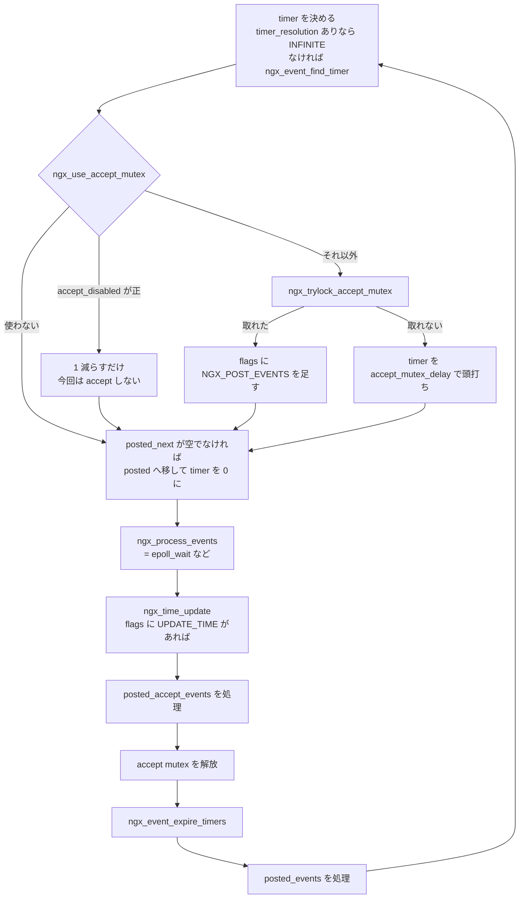

## この層の責務

[前のページ](../master-worker/) でワーカーが `for (;;)` に入った。ここから先、ワーカーは死ぬまで同じ 1 周を繰り返す。

1 周の責務は 3 つに尽きる。

1. **待つ。** 次に何か起きるまで、CPU を 1 サイクルも使わずに寝る。「何か」は、ソケットが読み書きできるようになること、タイマが切れること、master からの指示が届くことのいずれか。
2. **起きた理由に対応するコールバックを呼ぶ。** 呼ぶだけで、何をするかは知らない。
3. **1 周が長くなりすぎないようにする。** ワーカーは 1 スレッドなので、どこか 1 箇所で 100ms 止まれば、その 100ms のあいだ数万の接続全部が止まる。

3 番目が Nginx の設計の大半を決めている。関数はいつでも `NGX_AGAIN` を返して途中で帰れなければならず、そのために状態はスタックではなく構造体に載る。C89 相当のポータブルな C にはコルーチンが無いので、「中断して再開する」を自分で組み立てるしかない ([1 接続 1 プロセスから 1 スレッド数万接続へ](../concurrency-models/))。

## 主要な型とその関係

### `ngx_event_t` — 1 つのイベント

[`src/event/ngx_event.h#L30-L138`](https://github.com/nginx/nginx/blob/release-1.31.4/src/event/ngx_event.h#L30-L138)。

```c title="src/event/ngx_event.h"
struct ngx_event_s {
    void            *data;

    unsigned         write:1;
    unsigned         accept:1;

    /* used to detect the stale events in kqueue and epoll */
    unsigned         instance:1;

    /*
     * the event was passed or would be passed to a kernel;
     * in aio mode - operation was posted.
     */
    unsigned         active:1;
    unsigned         disabled:1;

    /* the ready event; in aio mode 0 means that no operation can be posted */
    unsigned         ready:1;
    /* ... oneshot / complete / eof / error / timedout / timer_set /
           delayed / deferred_accept / pending_eof / posted / closed ... */

    int              available;

    ngx_event_handler_pt  handler;

    ngx_uint_t       index;
    ngx_log_t       *log;
    ngx_rbtree_node_t   timer;

    /* the posted queue */
    ngx_queue_t      queue;
};
```

構造体 1 つに、20 個弱のビットフラグ、`handler` 1 本、赤黒木のノード 1 つ、キューのリンク 1 つが入っている。**この 1 個の構造体が、タイマ木にも posted キューにも epoll にも同時に入れる。** `ngx_rbtree_node_t` と `ngx_queue_t` を埋め込む侵入型のデータ構造なので、イベントを別のコンテナに入れるのに追加の確保が要らない。

フラグは組み合わせで意味を持つ。`ready` は「読める / 書ける状態にある」、`active` は「カーネルに登録済み」、`timedout` は「タイマが先に切れた」、`posted` は「今 posted キューに入っている」。

### `ngx_connection_t` との対応

イベントは接続に属する。`ngx_connection_t` は読みイベントと書きイベントを 1 つずつ持ち、イベント側は `data` で接続に戻れる ([`src/core/ngx_connection.h#L127-L145`](https://github.com/nginx/nginx/blob/release-1.31.4/src/core/ngx_connection.h#L127-L145))。

```c title="src/core/ngx_connection.h"
struct ngx_connection_s {
    void               *data;
    ngx_event_t        *read;
    ngx_event_t        *write;

    ngx_socket_t        fd;

    ngx_recv_pt         recv;
    ngx_send_pt         send;
    /* ... recv_chain / send_chain / listening / pool ... */
```

3 つは `ngx_event_process_init()` で一括確保され、添字で対応づけられる ([`src/event/ngx_event.c#L754-L800`](https://github.com/nginx/nginx/blob/release-1.31.4/src/event/ngx_event.c#L754-L800))。

```c title="src/event/ngx_event.c"
    cycle->connections =
        ngx_alloc(sizeof(ngx_connection_t) * cycle->connection_n, cycle->log);
    /* ... read_events と write_events も同じサイズで確保 ... */
    do {
        i--;

        c[i].data = next;
        c[i].read = &cycle->read_events[i];
        c[i].write = &cycle->write_events[i];
        c[i].fd = (ngx_socket_t) -1;

        next = &c[i];
    } while (i);
```

**`rev->handler` と `wev->handler` が、その接続の状態を表す唯一の変数だ。** 「今この接続は何をしているところか」を保持する enum は存在しない。関数ポインタが指す先が状態そのものになっている。

### 3 本の posted キュー

[`src/event/ngx_event_posted.h#L45-L47`](https://github.com/nginx/nginx/blob/release-1.31.4/src/event/ngx_event_posted.h#L45-L47)。

```c title="src/event/ngx_event_posted.h"
extern ngx_queue_t  ngx_posted_accept_events;
extern ngx_queue_t  ngx_posted_next_events;
extern ngx_queue_t  ngx_posted_events;
```

「今すぐ handler を呼ばずに、あとで呼ぶ」ためのキューが 3 本ある。積む側はマクロ 1 個 ([`#L17-L28`](https://github.com/nginx/nginx/blob/release-1.31.4/src/event/ngx_event_posted.h#L17-L28))。

```c title="src/event/ngx_event_posted.h"
#define ngx_post_event(ev, q)                                                 \
                                                                              \
    if (!(ev)->posted) {                                                      \
        (ev)->posted = 1;                                                     \
        ngx_queue_insert_tail(q, &(ev)->queue);                               \
        /* ... */                                                             \
    } else  { /* ... */ }
```

`posted` ビットで二重登録を防ぐ。同じイベントを 2 回積んでも、キューには 1 回しか入らない。

### イベントメソッドの表

`ngx_process_events` は関数ではなくマクロだ ([`src/event/ngx_event.h#L400`](https://github.com/nginx/nginx/blob/release-1.31.4/src/event/ngx_event.h#L400))。

```c title="src/event/ngx_event.h"
#define ngx_process_events   ngx_event_actions.process_events
```

`ngx_event_actions` は関数ポインタ 10 本の表 ([`#L166-L183`](https://github.com/nginx/nginx/blob/release-1.31.4/src/event/ngx_event.h#L166-L183)) で、`epoll` / `kqueue` / `eventport` / `select` / `poll` のどれかで埋まる。差の吸収の仕方は [イベントメソッドのページ](../event-methods/) が扱う。

## 処理の流れ

`ngx_worker_process_cycle()` の `for (;;)` ([`src/os/unix/ngx_process_cycle.c#L710-L748`](https://github.com/nginx/nginx/blob/release-1.31.4/src/os/unix/ngx_process_cycle.c#L710-L748)) が外枠になる。

```c title="src/os/unix/ngx_process_cycle.c"
    for ( ;; ) {

        if (ngx_exiting) {
            if (ngx_event_no_timers_left() == NGX_OK) {
                ngx_log_error(NGX_LOG_NOTICE, cycle->log, 0, "exiting");
                ngx_worker_process_exit(cycle);
            }
        }

        ngx_process_events_and_timers(cycle);

        if (ngx_terminate) {
            ngx_log_error(NGX_LOG_NOTICE, cycle->log, 0, "exiting");
            ngx_worker_process_exit(cycle);
        }

        if (ngx_quit) {
            ngx_quit = 0;
            ngx_setproctitle("worker process is shutting down");

            if (!ngx_exiting) {
                ngx_exiting = 1;
                ngx_set_shutdown_timer(cycle);
                ngx_close_listening_sockets(cycle);
                ngx_close_idle_connections(cycle);
                ngx_event_process_posted(cycle, &ngx_posted_events);
            }
        }

        if (ngx_reopen) { /* ngx_reopen_files */ }
    }
```

終了条件の読み方が 3 通りに分かれている。

- `ngx_terminate` — 即座に `ngx_worker_process_exit()`。接続を途中で切る
- `ngx_quit` — graceful。`ngx_exiting` を立てて listen を閉じ、idle 接続を閉じるが、**処理中のリクエストは待つ**
- `ngx_exiting` かつ `ngx_event_no_timers_left() == NGX_OK` — ループの**先頭**で判定する。ここで初めて終わる

`ngx_quit` の分岐が `ngx_exiting` を立てるだけで `exit()` しないのがポイントで、実際に終わるのは次の周の先頭になる。`ngx_event_no_timers_left()` ([`src/event/ngx_event_timer.c#L99-L126`](https://github.com/nginx/nginx/blob/release-1.31.4/src/event/ngx_event_timer.c#L99-L126)) は、タイマ木に `cancelable` でないタイマが 1 つも残っていないことを確認する。

```c title="src/event/ngx_event_timer.c"
    for (node = ngx_rbtree_min(root, sentinel);
         node;
         node = ngx_rbtree_next(&ngx_event_timer_rbtree, node))
    {
        ev = ngx_rbtree_data(node, ngx_event_t, timer);

        if (!ev->cancelable) {
            return NGX_AGAIN;
        }
    }

    /* only cancelable timers left */

    return NGX_OK;
```

**「まだ仕事が残っているか」を、タイマ木の中身で判定している。** リクエストの数を数えているのではない。`cancelable` は「これが残っていても終了を妨げない」という印で、resolver の再送タイマなどが立てる。

### 1 周の全体



本体は 70 行だ ([`src/event/ngx_event.c#L194-L264`](https://github.com/nginx/nginx/blob/release-1.31.4/src/event/ngx_event.c#L194-L264))。

```c title="src/event/ngx_event.c"
void
ngx_process_events_and_timers(ngx_cycle_t *cycle)
{
    ngx_uint_t  flags;
    ngx_msec_t  timer, delta;

    if (ngx_timer_resolution) {
        timer = NGX_TIMER_INFINITE;
        flags = 0;

    } else {
        timer = ngx_event_find_timer();
        flags = NGX_UPDATE_TIME;
    }

    if (ngx_use_accept_mutex) {
        if (ngx_accept_disabled > 0) {
            ngx_accept_disabled--;

        } else {
            if (ngx_trylock_accept_mutex(cycle) == NGX_ERROR) {
                return;
            }

            if (ngx_accept_mutex_held) {
                flags |= NGX_POST_EVENTS;

            } else {
                if (timer == NGX_TIMER_INFINITE
                    || timer > ngx_accept_mutex_delay)
                {
                    timer = ngx_accept_mutex_delay;
                }
            }
        }
    }

    if (!ngx_queue_empty(&ngx_posted_next_events)) {
        ngx_event_move_posted_next(cycle);
        timer = 0;
    }

    delta = ngx_current_msec;

    (void) ngx_process_events(cycle, timer, flags);

    delta = ngx_current_msec - delta;

    ngx_event_process_posted(cycle, &ngx_posted_accept_events);

    if (ngx_accept_mutex_held) {
        ngx_shmtx_unlock(&ngx_accept_mutex);
    }

    ngx_event_expire_timers();

    ngx_event_process_posted(cycle, &ngx_posted_events);
}
```

順に読む。

### 1. `timer` をどう決めるか

`ngx_timer_resolution` が 0 なら、タイマ木の最小値までの残り時間を `epoll_wait()` のタイムアウトにする ([`src/event/ngx_event_timer.c#L32-L50`](https://github.com/nginx/nginx/blob/release-1.31.4/src/event/ngx_event_timer.c#L32-L50))。

```c title="src/event/ngx_event_timer.c"
    if (ngx_event_timer_rbtree.root == &ngx_event_timer_sentinel) {
        return NGX_TIMER_INFINITE;
    }

    root = ngx_event_timer_rbtree.root;
    sentinel = ngx_event_timer_rbtree.sentinel;

    node = ngx_rbtree_min(root, sentinel);

    timer = (ngx_msec_int_t) (node->key - ngx_current_msec);

    return (ngx_msec_t) (timer > 0 ? timer : 0);
```

**数万本のタイマが、`epoll_wait()` の第 4 引数 1 個に畳まれている。** 赤黒木の最小値を取るだけなので O(log n)。詳細は [タイマのページ](../timer-rbtree/)。

`ngx_timer_resolution` が設定されているときは逆で、タイムアウトを `NGX_TIMER_INFINITE` にして `flags` から `NGX_UPDATE_TIME` を落とす。代わりに `setitimer(ITIMER_REAL)` で周期的な `SIGALRM` を仕掛けてある ([`src/event/ngx_event.c#L700-L723`](https://github.com/nginx/nginx/blob/release-1.31.4/src/event/ngx_event.c#L700-L723))。

```c title="src/event/ngx_event.c"
static void
ngx_timer_signal_handler(int signo)
{
    ngx_event_timer_alarm = 1;
}
```

`SIGALRM` が `epoll_wait()` を `EINTR` で叩き起こし、`ngx_event_timer_alarm` を見て時刻を更新する。**タイマの精度を落とす代わりに、`gettimeofday()` の呼び出し回数を固定周期に抑える**というトレードオフになっている。

### 2. accept mutex を取る

`ngx_accept_disabled` は「今このワーカーは接続を受けるべきではない」を表す残り周回数だ。0 より大きい間は 1 ずつ減らすだけで、mutex の取得を試みない。値は accept したときに更新される ([次のページ](../accept-to-connection/))。

mutex が取れたら `flags |= NGX_POST_EVENTS` が立つ。**これがこの関数で一番重要な 1 行になる。** `NGX_POST_EVENTS` は `ngx_process_events` の実装に「handler をその場で呼ばず、キューに積め」と指示する ([`src/event/modules/ngx_epoll_module.c#L894-L902`](https://github.com/nginx/nginx/blob/release-1.31.4/src/event/modules/ngx_epoll_module.c#L894-L902))。

```c title="src/event/modules/ngx_epoll_module.c"
            if (flags & NGX_POST_EVENTS) {
                queue = rev->accept ? &ngx_posted_accept_events
                                    : &ngx_posted_events;

                ngx_post_event(rev, queue);

            } else {
                rev->handler(rev);
            }
```

`rev->accept` で振り分け先が変わる。listen ソケットの読みイベントには `accept` ビットが立っているので、accept 由来のイベントだけが `ngx_posted_accept_events` に入り、残りは `ngx_posted_events` に入る。

mutex が取れなかったときは、`timer` を `accept_mutex_delay` (既定 500ms) で頭打ちにする。そうしないと、タイマも接続も持たないワーカーが `NGX_TIMER_INFINITE` で寝てしまい、mutex が空くのを永久に気づけない。

### 3. `ngx_process_events` を呼ぶ

イベントメソッドの `process_events` が呼ばれる。epoll なら `epoll_wait()` 1 回だ。**この関数呼び出しの中に、ワーカーが寝ている時間の全部が入っている。**

### 4. 時刻を更新する

epoll の実装は `epoll_wait()` から返った直後に時刻を更新する ([`#L800-L806`](https://github.com/nginx/nginx/blob/release-1.31.4/src/event/modules/ngx_epoll_module.c#L800-L806))。

```c title="src/event/modules/ngx_epoll_module.c"
    events = epoll_wait(ep, event_list, (int) nevents, timer);

    err = (events == -1) ? ngx_errno : 0;

    if (flags & NGX_UPDATE_TIME || ngx_event_timer_alarm) {
        ngx_time_update();
    }
```

**時刻はここで 1 回だけ取り、以降の 1 周ぜんぶがその値を使う。** `ngx_time_update()` ([`src/core/ngx_times.c#L80-L192`](https://github.com/nginx/nginx/blob/release-1.31.4/src/core/ngx_times.c#L80-L192)) が更新するのは、生の時刻だけではない。

```c title="src/core/ngx_times.c"
    ngx_gettimeofday(&tv);

    sec = tv.tv_sec;
    msec = tv.tv_usec / 1000;

    ngx_current_msec = ngx_monotonic_time(sec, msec);

    tp = &cached_time[slot];

    if (tp->sec == sec) {
        tp->msec = msec;
        ngx_unlock(&ngx_time_lock);
        return;
    }
    /* ... 秒が変わったときだけ、以下を作り直す ... */

    (void) ngx_sprintf(p0, "%s, %02d %s %4d %02d:%02d:%02d GMT",
                       week[gmt.ngx_tm_wday], gmt.ngx_tm_mday,
                       months[gmt.ngx_tm_mon - 1], gmt.ngx_tm_year,
                       gmt.ngx_tm_hour, gmt.ngx_tm_min, gmt.ngx_tm_sec);
```

更新されるのは 6 種類 ([`src/core/ngx_times.h#L34-L49`](https://github.com/nginx/nginx/blob/release-1.31.4/src/core/ngx_times.h#L34-L49))。

| 変数                                                       | 用途                                           |
| ---------------------------------------------------------- | ---------------------------------------------- |
| `ngx_cached_time`                                          | 秒 + ミリ秒 + GMT オフセット                   |
| `ngx_current_msec`                                         | タイマ木のキー。可能なら `CLOCK_MONOTONIC`     |
| `ngx_cached_http_time`                                     | `Date:` ヘッダ用の RFC 形式                    |
| `ngx_cached_err_log_time`                                  | エラーログの行頭                               |
| `ngx_cached_http_log_time` / `ngx_cached_http_log_iso8601` | アクセスログの `$time_local` / `$time_iso8601` |
| `ngx_cached_syslog_time`                                   | syslog 出力用                                  |

**レスポンスを 1 本返すごとに `Date:` を組み立てるのではなく、秒が変わったときだけ 1 回組み立てて使い回す。** `if (tp->sec == sec)` で早期に帰る分岐がそれで、同じ秒のうちに何万本返しても `ngx_sprintf` は走らない。

書き換えは 64 個のスロットを巡回して行い、読み手はロックを取らない。

```c title="src/core/ngx_times.c"
/*
 * The time may be updated by signal handler or by several threads.
 * The time update operations are rare and require to hold the ngx_time_lock.
 * The time read operations are frequent, so they are lock-free and get time
 * values and strings from the current slot.  Thus thread may get the corrupted
 * values only if it is preempted while copying and then it is not scheduled
 * to run more than NGX_TIME_SLOTS seconds.
 */

#define NGX_TIME_SLOTS   64
```

新しいスロットを完全に埋めてから `ngx_memory_barrier()` を挟んでポインタを差し替えるので、読み手は常に整合の取れたスロットを見る。**64 秒以上プリエンプトされない限り安全**という、割り切った条件で成立している。

`ngx_monotonic_time()` が `CLOCK_MONOTONIC` を使うのも効いている ([`#L195-L209`](https://github.com/nginx/nginx/blob/release-1.31.4/src/core/ngx_times.c#L195-L209))。NTP で壁時計が巻き戻ってもタイマ木のキーは巻き戻らない。

### 5. accept を先に処理して、mutex を早く手放す

```c title="src/event/ngx_event.c"
    ngx_event_process_posted(cycle, &ngx_posted_accept_events);

    if (ngx_accept_mutex_held) {
        ngx_shmtx_unlock(&ngx_accept_mutex);
    }

    ngx_event_expire_timers();

    ngx_event_process_posted(cycle, &ngx_posted_events);
```

この 3 行の順序が、posted キューが 2 本ある理由そのものだ。

accept mutex を握っているワーカーは、その間ずっと**他の全ワーカーが accept できない状態**を作っている。ここで `epoll_wait()` が返した 500 個のイベントを全部その場で処理してしまうと、上流への接続待ち、ディスク読み、TLS ハンドシェイクといった重い処理を全部終えるまで mutex を持ち続けることになる。

だから 2 段階に分ける。

1. `accept` ビットが立ったイベント (= listen ソケットが読める) だけを先に処理する。中身は `ngx_event_accept()` の呼び出しで、`accept()` して `ngx_connection_t` を作るところまでしかやらない
2. mutex を解放する
3. 残りを処理する。ここは時間がかかってよい

**mutex の保持時間が、accept のシステムコールの時間だけに縮む。** 分岐が `rev->accept` 1 ビットで済んでいるのは、listen ソケットの読みイベントにだけこのビットが立つからだ。

posted キューを流す関数は 18 行しかない ([`src/event/ngx_event_posted.c#L18-L36`](https://github.com/nginx/nginx/blob/release-1.31.4/src/event/ngx_event_posted.c#L18-L36))。

```c title="src/event/ngx_event_posted.c"
void
ngx_event_process_posted(ngx_cycle_t *cycle, ngx_queue_t *posted)
{
    ngx_queue_t  *q;
    ngx_event_t  *ev;

    while (!ngx_queue_empty(posted)) {

        q = ngx_queue_head(posted);
        ev = ngx_queue_data(q, ngx_event_t, queue);

        ngx_delete_posted_event(ev);

        ev->handler(ev);
    }
}
```

`while` で回しているので、handler の中でさらに別のイベントを積んでも、この同じループが拾う。**再帰の代わりにキューに積む**という形になっていて、スタックの深さが 1 段に保たれる。

3 本目の `ngx_posted_next_events` は、1 周目の先頭で通常キューに合流する ([`#L39-L60`](https://github.com/nginx/nginx/blob/release-1.31.4/src/event/ngx_event_posted.c#L39-L60))。

```c title="src/event/ngx_event_posted.c"
        ev->ready = 1;
        ev->available = -1;
    }

    ngx_queue_add(&ngx_posted_events, &ngx_posted_next_events);
    ngx_queue_init(&ngx_posted_next_events);
```

「まだ処理できるデータが手元にあるが、他の接続に 1 周譲る」ときに使う。移すときに `ready = 1` を立て直すので、次の周では `epoll_wait()` の結果を待たずに handler が呼ばれる。合流と同時に `timer = 0` になるので、その周の `epoll_wait()` はブロックしない。**イベントループの中に、簡易的な公平性スケジューリングが入っている** ([1 周の長さのページ](../loop-latency/))。

### 6. タイマを流す

`ngx_event_expire_timers()` ([`src/event/ngx_event_timer.c#L53-L96`](https://github.com/nginx/nginx/blob/release-1.31.4/src/event/ngx_event_timer.c#L53-L96)) が、期限が来たイベントの handler を呼ぶ。

```c title="src/event/ngx_event_timer.c"
        if ((ngx_msec_int_t) (node->key - ngx_current_msec) > 0) {
            return;
        }

        ev = ngx_rbtree_data(node, ngx_event_t, timer);
        /* ... */
        ngx_rbtree_delete(&ngx_event_timer_rbtree, &ev->timer);

        ev->timer_set = 0;

        ev->timedout = 1;

        ev->handler(ev);
```

**タイムアウトも、同じ `ev->handler(ev)` として届く。** 違いは `timedout` ビットが立っていることだけだ。だから handler 側は入口で `if (rev->timedout)` を見て分岐する。読めるようになったのか、時間切れなのかを、1 本のコールバックで受ける。

## 状態は handler の付け替えで表す

ここからが「1 周」の内側の話になる。

### HTTP の入口から出口まで

新しい接続ができた直後、読みイベントの handler は `ngx_http_wait_request_handler` になっている ([`src/http/ngx_http_request.c#L327-L329`](https://github.com/nginx/nginx/blob/release-1.31.4/src/http/ngx_http_request.c#L327-L329))。

```c title="src/http/ngx_http_request.c"
    rev = c->read;
    rev->handler = ngx_http_wait_request_handler;
    c->write->handler = ngx_http_empty_handler;
```

最初の 1 バイトが届くと、リクエストラインを読む状態に移る ([`#L532-L533`](https://github.com/nginx/nginx/blob/release-1.31.4/src/http/ngx_http_request.c#L532-L533))。

```c title="src/http/ngx_http_request.c"
    rev->handler = ngx_http_process_request_line;
    ngx_http_process_request_line(rev);
```

**代入した直後に自分で呼んでいる。** 「次に読めるようになったらこれを呼べ」と登録しつつ、すでにバッファにデータがあるので今すぐ 1 回呼ぶ、という形になっている。

リクエストラインが揃うと、ヘッダを読む状態へ ([`#L1226-L1229`](https://github.com/nginx/nginx/blob/release-1.31.4/src/http/ngx_http_request.c#L1226-L1229))。

```c title="src/http/ngx_http_request.c"
            c->log->action = "reading client request headers";

            rev->handler = ngx_http_process_request_headers;
            ngx_http_process_request_headers(rev);
```

ヘッダを読み終えて処理段に入るとき、handler がもう一段の間接に置き換わる ([`#L2208-L2212`](https://github.com/nginx/nginx/blob/release-1.31.4/src/http/ngx_http_request.c#L2208-L2212))。

```c title="src/http/ngx_http_request.c"
    c->read->handler = ngx_http_request_handler;
    c->write->handler = ngx_http_request_handler;
    r->read_event_handler = ngx_http_block_reading;

    ngx_http_handler(r);
```

以降、`c->read->handler` は二度と変わらない。変わるのは `r->read_event_handler` と `r->write_event_handler` のほうだ。`ngx_http_request_handler` は振り分けるだけになっている ([`#L2584-L2617`](https://github.com/nginx/nginx/blob/release-1.31.4/src/http/ngx_http_request.c#L2584-L2617))。

```c title="src/http/ngx_http_request.c"
    if (c->close) {
        r->main->count++;
        ngx_http_terminate_request(r, 0);
        ngx_http_run_posted_requests(c);
        return;
    }

    if (ev->delayed && ev->timedout) {
        ev->delayed = 0;
        ev->timedout = 0;
    }

    if (ev->write) {
        r->write_event_handler(r);
    } else {
        r->read_event_handler(r);
    }

    ngx_http_run_posted_requests(c);
```

層が 1 つ増えている理由は、1 本の接続の上に乗るリクエストの数が 1 とは限らないことにある。HTTP/1.1 では 1 つ、HTTP/2 では複数。**接続レベルの「読めるようになった」と、リクエストレベルの「次に何をするか」は別の概念**なので、変数を分けてある。HTTP/2 のストリームでは `c` が偽物の接続になり、`r->read_event_handler` だけが本物の意味を持つ ([HTTP/2 多重化のページ](../http2-multiplexing/))。

つまり接続の状態は、こう並ぶ。

```
c->read->handler:
  ngx_http_wait_request_handler        最初のバイトを待つ
    → ngx_http_ssl_handshake           (TLS のとき、先に挟まる)
    → ngx_http_process_request_line
    → ngx_http_process_request_headers
    → ngx_http_request_handler         以降ずっとこれ
                                         └ r->read_event_handler
                                         └ r->write_event_handler
    → ngx_http_keepalive_handler       応答後、次のリクエストを待つ
    → ngx_http_lingering_close_handler 閉じる前に読み捨てる
```

keepalive で次のリクエストを待つとき、handler は最初に近い状態に戻る ([`#L3461`](https://github.com/nginx/nginx/blob/release-1.31.4/src/http/ngx_http_request.c#L3461) と [`#L3662`](https://github.com/nginx/nginx/blob/release-1.31.4/src/http/ngx_http_request.c#L3662))。**状態遷移図が、関数ポインタへの代入だけで書かれている。** 中央に `switch (state)` は無い。

### なぜ enum ではなく関数ポインタか

同じ接続の状態を `enum` で持って 1 箇所で `switch` する書き方もありうる。実際、HTTP パーサはそう書かれている。差は拡張の主体にある。

パーサの状態は Nginx 本体が全部知っている。一方、接続の状態は SSL ハンドシェイク中かもしれないし、HTTP/2 のフレーム処理中かもしれないし、サードパーティモジュールが持ち込んだ独自プロトコルかもしれない。enum にすると**中央の enum 定義を書き換えないと状態を増やせない**。関数ポインタなら、モジュールが自分の handler を置くだけで済む。

`c->recv` / `c->send` / `c->recv_chain` / `c->send_chain` が関数ポインタなのも同じ理由で、これを差し替えることで平文・TLS・HTTP/2 のストリーム・QUIC のストリームが、上位から見て同じ「読む」になる ([TLS 層のページ](../ssl-layer/))。

## `NGX_AGAIN` と、状態が構造体に載る帰結

handler が「まだ続きがある」で帰る規約を持つと、ローカル変数が使えなくなる。

`ngx_http_parse_request_line()` ([`src/http/ngx_http_parse.c#L107-L146`](https://github.com/nginx/nginx/blob/release-1.31.4/src/http/ngx_http_parse.c#L107-L146)) は 26 状態のステートマシンだが、状態は `r->state` から復元される。

```c title="src/http/ngx_http_parse.c"
ngx_http_parse_request_line(ngx_http_request_t *r, ngx_buf_t *b)
{
    u_char  c, ch, *p, *m;
    enum {
        sw_start = 0,
        sw_method,
        sw_spaces_before_uri,
        sw_schema,
        /* ... */
    } state;

    state = r->state;

    for (p = b->pos; p < b->last; p++) {
        ch = *p;

        switch (state) {
```

バッファが尽きたら書き戻して `NGX_AGAIN` ([`#L846-L849`](https://github.com/nginx/nginx/blob/release-1.31.4/src/http/ngx_http_parse.c#L846-L849))。

```c title="src/http/ngx_http_parse.c"
    b->pos = p;
    r->state = state;

    return NGX_AGAIN;

done:
```

**`GET / HTT` まで届いて残りが来ない状況でも、その状態を覚えたまま帰れる。** TCP はメッセージ境界を保存しないので、これは最適化ではなく正しさの要件だ。

呼び出し側の `NGX_AGAIN` の扱いは定型になっている ([`src/http/ngx_http_request.c#L437-L462`](https://github.com/nginx/nginx/blob/release-1.31.4/src/http/ngx_http_request.c#L437-L462))。

```c title="src/http/ngx_http_request.c"
    if (n == NGX_AGAIN) {

        if (!rev->timer_set) {
            ngx_add_timer(rev, cscf->client_header_timeout);
            ngx_reusable_connection(c, 1);
        }

        if (ngx_handle_read_event(rev, 0) != NGX_OK) {
            ngx_http_close_connection(c);
            return;
        }

        if (b->pos == b->last) {
            /*
             * We are trying to not hold c->buffer's memory for an
             * idle connection.
             */
            if (ngx_pfree(c->pool, b->start) == NGX_OK) {
                b->start = NULL;
            }
        }

        return;
    }
```

やることが 3 つある。**タイマを張る** (いつまでも待たない)、**イベントを再登録する**、**持っていても無駄なバッファを返す**。そして `return`。次に読めるようになったら、同じ handler がもう一度呼ばれて続きから進む。

帰結として、`ngx_http_request_t` が 300 行を超える構造体になる。ビットフィールドが 100 個近く並ぶのは「なんでも入れる袋」だからではなく、**中断可能にしたい処理のローカル変数が全部ここに来るしかない**からだ。コルーチンのある言語ならこれはスタックに置ける。

## 守られている不変条件

**handler は 1 周のどこかで必ず 1 回だけ呼ばれる。** `epoll_wait()` の結果から直接、posted キューから、タイマ木から、という 3 つの入口があるが、`posted` ビットと `timer_set` ビットが二重呼び出しを防いでいる。

**accept mutex を握ったまま、accept 以外の処理をしない。** `NGX_POST_EVENTS` フラグと `rev->accept` ビットで機械的に保証される。これが破れると、1 ワーカーの遅い処理が全ワーカーの accept を止める。

**時刻は 1 周に高々 1 回しか取り直さない。** ワーカーがリクエストを処理している最中に `ngx_time_update()` が呼ばれることはない。ワーカーでの呼び出しはイベントメソッドの `process_events` の実装 (epoll なら `epoll_wait()` の直後) 1 箇所だけで、master が `sigsuspend()` から戻ったとき、cache manager / cache loader が長いディスク走査の途中で挟むとき、スレッドプールのワーカースレッドが待ち合わせから戻ったときが、それ以外の全部になる。だから 1 周の中では時間が止まって見える。ログの秒とタイマの判定が同じ値を使うので、周の途中で時刻が進んで判定が食い違うことがない。

**handler の中でオブジェクトが解放されうる。** だから `ngx_http_run_posted_requests()` はループの先頭で毎回 `c->destroyed` を確認する。寿命の判断がスタックからは取れないので、リクエストは `r->main->count` の参照カウントで守られる ([リクエストの終わらせ方のページ](../finalize-request/))。

## つまずきどころ

### `epoll_wait()` から返っただけでは、まだ読めるとは限らない

`rev->ready` はカーネルの状態のミラーであって、カーネルそのものではない。`recv()` が `EAGAIN` を返したら Nginx 側で `ready` を落とす。この追跡があるので、確実に読めないと分かっている場面でシステムコールを 1 回省ける。ずれるとハングする類の最適化で、edge-triggered epoll と組み合わせたときの挙動は [イベントメソッドのページ](../event-methods/) で扱う。

### `ngx_process_events_and_timers()` は途中で `return` することがある

`ngx_trylock_accept_mutex()` が `NGX_ERROR` を返したときだけ、`epoll_wait()` にも到達せずに帰る。共有メモリのミューテックスの操作が失敗するのは異常事態なので、その周は何もせず次に進む。

### 1 周の長さに直接の上限は無い

この関数には「n ミリ秒で切り上げる」という仕組みが無い。上限は個々の処理側に置かれている。`sendfile_max_chunk`、`limit_rate`、`ngx_posted_next_events` への退避、resolver のタイマ、AIO とスレッドプールへの退避。**「ループを短く保つ」が単一の機構ではなく、長くなりうる操作を全部見つけて 1 つずつ上限を置く**という形になっている。網羅は [1 周の長さのページ](../loop-latency/) に集めた。

### `O_NONBLOCK` は通常ファイルに効かない

ソケットは全部ノンブロッキングにできるが、ディスク上のファイルの `open()` / `read()` / `stat()` はページキャッシュに載っていなければブロックする。ここだけはこのループでは解けない。スレッドプールと `ngx_notify()` で外に出し、完了は再び「イベントが来て handler が呼ばれる」形に揃えて戻す ([ブロックする I/O のページ](../blocking-io/))。DNS も同じ理由で `getaddrinfo()` を使えず、自前のクライアントを持っている ([resolver のページ](../resolver/))。

### `ngx_current_msec` は起動からの経過ではない

コメントにあるとおり「過去のどこかの時点からのミリ秒を `ngx_msec_t` に切り詰めたもの」で、`CLOCK_MONOTONIC` が使えるならその値だ。絶対時刻としての意味はない。タイマの比較が `(ngx_msec_int_t)(node->key - ngx_current_msec) > 0` という符号付きの引き算で書かれているのは、この値がラップアラウンドしても差が正しく出るようにするためだ。

## 次に読むページ

- `accept` ビットが立ったイベントの handler、`ngx_event_accept()` の中身は [accept から接続へ](../accept-to-connection/)。
- accept mutex がなぜ導入され、なぜ既定で無効になったかは [accept の分配のページ](../accept-distribution/)。
- `ngx_add_timer` / `ngx_event_find_timer` の赤黒木は [タイマのページ](../timer-rbtree/)。
- `ngx_add_event` / `ngx_handle_read_event` が epoll と kqueue の差をどう吸収するかは [イベントメソッドのページ](../event-methods/)。
