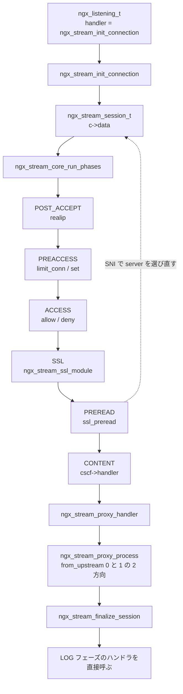

## この層の責務

L4 プロキシだ。TCP のコネクションか UDP のデータグラムを受けて、中身を解釈せずに上流へ流し、返ってきたものを下流へ流す。

「解釈しない」が効いている。HTTP 層が持っていた仕事のうち、次のものが丸ごと要らなくなる。

- リクエスト行とヘッダのパース
- URI の正規化と location の選択
- リクエストボディの読み方 3 通り
- 出力フィルタチェインとサブリクエスト
- キャッシュ

残るのは「接続を受ける」「上流を選ぶ」「バイト列を往復させる」「記録する」の 4 つになる。

`src/stream/` は 33 ファイル 24923 行、モジュールは 23 個ある。**この量は「削った結果」ではなく「写した結果」だ。** 変数もログもスクリプトエンジンも upstream の負荷分散も、HTTP 版のコードを持ってきて `ngx_http_request_t *r` を `ngx_stream_session_t *s` に置き換えたものになっている。その判断は最後のセクションで扱う。

このページは、`accept()` からバイト列の往復までを追う。フェーズエンジンの一般論は [フェーズエンジンのページ](../phase-engine/)、upstream の抽象は [upstream のページ](../upstream/) にある。

## 主要な型とその関係

### `ngx_stream_session_t` と `ngx_http_request_t`

[`src/stream/ngx_stream.h#L261-L299`](https://github.com/nginx/nginx/blob/release-1.31.4/src/stream/ngx_stream.h#L261-L299) の 39 行が全部だ。`ngx_http_request_t` は [`src/http/ngx_http_request.h#L385-L613`](https://github.com/nginx/nginx/blob/release-1.31.4/src/http/ngx_http_request.h#L385-L613) の 229 行ある。

```c title="src/stream/ngx_stream.h"
struct ngx_stream_session_s {
    uint32_t                       signature;         /* "STRM" */

    ngx_connection_t              *connection;

    off_t                          received;
    time_t                         start_sec;
    ngx_msec_t                     start_msec;
    ngx_log_handler_pt             log_handler;

    void                         **ctx;
    void                         **main_conf;
    void                         **srv_conf;

    ngx_stream_virtual_names_t    *virtual_names;
    ngx_stream_upstream_t         *upstream;
    ngx_array_t                   *upstream_states;
    ngx_stream_variable_value_t   *variables;

    ngx_int_t                      phase_handler;
    ngx_uint_t                     status;

    unsigned                       ssl:1;
    /* ... stat_processing / health_check / limit_conn_status ... */
};
```

対応を取るとこうなる。

| `ngx_http_request_t` の要素                                   | stream 側 | 備考                             |
| ------------------------------------------------------------- | --------- | -------------------------------- |
| `connection`                                                  | **残る**  | 同名同型                         |
| `ctx` / `main_conf` / `srv_conf`                              | **残る**  | `loc_conf` は消える              |
| `variables` / `ncaptures` / `captures`                        | **残る**  | 変数機構は丸ごと写されている     |
| `upstream` / `upstream_states`                                | **残る**  | 型が `ngx_stream_upstream_t` に  |
| `phase_handler`                                               | **残る**  | 添字の意味だけ変わる             |
| `start_sec` / `start_msec`                                    | **残る**  | `$session_time` の計算に使う     |
| `log_handler`                                                 | **残る**  | エラーログの追記フック           |
| `method` / `uri` / `args` / `exten`                           | 消える    | HTTP を解釈しない                |
| `headers_in` / `headers_out`                                  | 消える    | 同上                             |
| `request_body`                                                | 消える    | ボディという概念がない           |
| `loc_conf`                                                    | 消える    | location がない                  |
| `main` / `parent` / `postponed` / `post_subrequest`           | 消える    | サブリクエストがない             |
| `cache`                                                       | 消える    | キャッシュがない                 |
| `out` / `postponed` / `posted_requests`                       | 消える    | 出力フィルタチェインが縮む       |
| `pool`                                                        | 消える    | `c->pool` を直接使う             |
| `count` / `blocked` / `aio`                                   | 消える    | 参照カウントによる終了管理がない |
| `header_only` / `keepalive` / `chunked` / 60 近いビットフラグ | 消える    | ほぼ全部 HTTP 由来               |

**`pool` が無いのが分かりやすい。** HTTP ではリクエストごとにプールがあり、`r` の寿命で捨てられる。stream ではセッション = 接続なので、`c->pool` で足りる。[リクエストの終わらせ方のページ](../finalize-request/) で見た `r->count` の参照カウントも要らなくなり、終了は `ngx_stream_finalize_session()` 1 本になる。

`signature` に `"STRM"` が入っているのは、`ngx_resolver` のように HTTP と stream の両方から使われるコードが、渡された構造体を見分けるためだ。

### フェーズが 7 つに減る

[`src/stream/ngx_stream.h#L84-L92`](https://github.com/nginx/nginx/blob/release-1.31.4/src/stream/ngx_stream.h#L84-L92)。

```c title="src/stream/ngx_stream.h"
typedef enum {
    NGX_STREAM_POST_ACCEPT_PHASE = 0,
    NGX_STREAM_PREACCESS_PHASE,
    NGX_STREAM_ACCESS_PHASE,
    NGX_STREAM_SSL_PHASE,
    NGX_STREAM_PREREAD_PHASE,
    NGX_STREAM_CONTENT_PHASE,
    NGX_STREAM_LOG_PHASE
} ngx_stream_phases;
```

HTTP の 11 フェーズ ([`src/http/ngx_http_core_module.h#L110-L129`](https://github.com/nginx/nginx/blob/release-1.31.4/src/http/ngx_http_core_module.h#L110-L129)) と並べる。

| HTTP             | stream        | 何が起きたか                        |
| ---------------- | ------------- | ----------------------------------- |
| `POST_READ`      | `POST_ACCEPT` | 名前が変わった。`realip` が入る     |
| `SERVER_REWRITE` | —             | rewrite がない                      |
| `FIND_CONFIG`    | —             | location がないので消えた           |
| `REWRITE`        | —             | 同上                                |
| `POST_REWRITE`   | —             | 同上                                |
| `PREACCESS`      | `PREACCESS`   | `limit_conn` と `set`               |
| `ACCESS`         | `ACCESS`      | `access` (allow/deny)               |
| `POST_ACCESS`    | —             | `satisfy any` がないので不要        |
| —                | `SSL`         | **新設。** TLS 終端をフェーズにした |
| —                | `PREREAD`     | **新設。** 後述                     |
| `PRECONTENT`     | —             | `try_files` / `mirror` がない       |
| `CONTENT`        | `CONTENT`     | ハンドラは server ごとに 1 つ       |
| `LOG`            | `LOG`         | `ngx_stream_log_module`             |

消えた 5 つは全部「URI を書き換えるか、location を選ぶ」ためのものだ。**location という概念を落とすと、フェーズが半分近く消える。**

新設が 2 つある。`SSL` フェーズは HTTP では `ngx_http_ssl_handshake` が read ハンドラを差し替える形だったのを、フェーズに格上げしたもの。`PREREAD` は HTTP に対応物がない。

エンジンの組み立ては HTTP とほぼ同じ形をしている ([`src/stream/ngx_stream.c#L339-L382`](https://github.com/nginx/nginx/blob/release-1.31.4/src/stream/ngx_stream.c#L339-L382))。

```c title="src/stream/ngx_stream.c"
    for (i = 0; i < NGX_STREAM_LOG_PHASE; i++) {
        h = cmcf->phases[i].handlers.elts;

        switch (i) {

        case NGX_STREAM_PREREAD_PHASE:
            checker = ngx_stream_core_preread_phase;
            break;

        case NGX_STREAM_CONTENT_PHASE:
            ph->checker = ngx_stream_core_content_phase;
            n++;
            ph++;
            continue;

        default:
            checker = ngx_stream_core_generic_phase;
        }

        n += cmcf->phases[i].handlers.nelts;

        for (j = cmcf->phases[i].handlers.nelts - 1; j >= 0; j--) {
            ph->checker = checker;
            ph->handler = h[j];
            ph->next = n;
            ph++;
        }
    }
```

checker が 3 種類しかない (HTTP は 7 種類)。CONTENT フェーズは**ハンドラの配列を持たず、枠を 1 つだけ置く**。中身は `cscf->handler` を呼ぶだけになるからだ。ループの上限が `NGX_STREAM_LOG_PHASE` なので、LOG フェーズはエンジンに入らない。終了時に別途走らせる。

### `ngx_stream_upstream_t` — 双方向ぶんのバッファ

[`src/stream/ngx_stream_upstream.h#L126-L155`](https://github.com/nginx/nginx/blob/release-1.31.4/src/stream/ngx_stream_upstream.h#L126-L155)。

```c title="src/stream/ngx_stream_upstream.h"
typedef struct {
    ngx_peer_connection_t              peer;

    ngx_buf_t                          downstream_buf;
    ngx_buf_t                          upstream_buf;

    ngx_chain_t                       *free;
    ngx_chain_t                       *upstream_out;
    ngx_chain_t                       *upstream_busy;
    ngx_chain_t                       *downstream_out;
    ngx_chain_t                       *downstream_busy;

    off_t                              received;
    ngx_uint_t                         requests;
    ngx_uint_t                         responses;
    /* ... connected / proxy_protocol / half_closed ... */
} ngx_stream_upstream_t;
```

**バッファもチェインも 2 組ある。** [HTTP の upstream](../upstream/) は「リクエストを送って応答を受ける」という向きが決まっていたので、送信用と受信用が非対称だった。stream ではどちらからでもデータが来るので、対称に持つ。

`ngx_peer_connection_t` は HTTP 版と同じ型で、`ngx_stream_upstream_round_robin.c` の負荷分散も HTTP 版とほぼ同じ構造になっている。

### 出力フィルタは方向を引数に取る

[`src/stream/ngx_stream.h#L377-L381`](https://github.com/nginx/nginx/blob/release-1.31.4/src/stream/ngx_stream.h#L377-L381)。

```c title="src/stream/ngx_stream.h"
typedef ngx_int_t (*ngx_stream_filter_pt)(ngx_stream_session_t *s,
    ngx_chain_t *chain, ngx_uint_t from_upstream);

extern ngx_stream_filter_pt  ngx_stream_top_filter;
```

HTTP のボディフィルタ `(r, chain)` に `from_upstream` が 1 つ増えている。**同じフィルタチェインが両方向に使われる。** チェインの実体は `ngx_stream_write_filter_module` の 1 段だけで、[HTTP の 出力フィルタチェイン](../output-filter-chain/) のような十数段の連鎖にはならない。ssl モジュールもフィルタではなく `c->recv` / `c->send` の差し替えで入る。

### 全体の関係



## 処理の流れ

### 1. `accept()` からセッションまで

listen ソケットの handler は `ngx_stream_init_connection` に固定されている ([`src/stream/ngx_stream.c#L1002`](https://github.com/nginx/nginx/blob/release-1.31.4/src/stream/ngx_stream.c#L1002))。`ls->type` に `SOCK_STREAM` か `SOCK_DGRAM` が入る点が HTTP と違う。UDP なら [QUIC のページ](../quic-transport/) でも触れた `ngx_event_recvmsg` が read ハンドラになり、そこから同じ handler が呼ばれる。

`ngx_stream_init_connection()` の中身は [`accept()` から `ngx_connection_t` へ](../accept-to-connection/) の HTTP 版とよく似ている ([`src/stream/ngx_stream_handler.c#L119-L181`](https://github.com/nginx/nginx/blob/release-1.31.4/src/stream/ngx_stream_handler.c#L119-L181))。

```c title="src/stream/ngx_stream_handler.c"
    s = ngx_pcalloc(c->pool, sizeof(ngx_stream_session_t));
    /* ... */
    ctx = addr_conf->default_server->ctx;

    s->signature = NGX_STREAM_MODULE;
    s->main_conf = ctx->main_conf;
    s->srv_conf = ctx->srv_conf;
    s->virtual_names = addr_conf->virtual_names;

    if (c->buffer) {
        s->received += c->buffer->last - c->buffer->pos;
    }

    s->connection = c;
    c->data = s;
    /* ... */
    s->ctx = ngx_pcalloc(c->pool, sizeof(void *) * ngx_stream_max_module);
    s->variables = ngx_pcalloc(s->connection->pool,
                               cmcf->variables.nelts
                               * sizeof(ngx_stream_variable_value_t));
```

**セッションは `c->pool` から取る。** HTTP のようにリクエストプールを作らない。`s->variables` の配列を最初に確保するのも [変数のページ](../variables/) の HTTP 版と同じで、添字が変数のインデックスになる。

`if (c->buffer)` の分岐は UDP のためにある。`ngx_event_recvmsg()` は最初のデータグラムを `c->buffer` に入れて渡してくるので、それを受信バイト数に足す。

その後 read ハンドラを決めて、フェーズに入る ([`#L180-L206`](https://github.com/nginx/nginx/blob/release-1.31.4/src/stream/ngx_stream_handler.c#L180-L206))。

```c title="src/stream/ngx_stream_handler.c"
    rev = c->read;
    rev->handler = ngx_stream_session_handler;

    if (addr_conf->proxy_protocol) {
        c->log->action = "reading PROXY protocol";

        rev->handler = ngx_stream_proxy_protocol_handler;
        /* ... データが無ければタイマを張って帰る ... */
    }

    if (ngx_use_accept_mutex) {
        ngx_post_event(rev, &ngx_posted_events);
        return;
    }

    rev->handler(rev);
```

`ngx_use_accept_mutex` のときポストイベントに回すのは HTTP と同じで、[accept の分配のページ](../accept-distribution/) にある「ロックを持ったまま処理しない」ための細工になる。

`ngx_stream_session_handler()` は `ngx_stream_core_run_phases(s)` を呼ぶだけになる ([`#L287-L297`](https://github.com/nginx/nginx/blob/release-1.31.4/src/stream/ngx_stream_handler.c#L287-L297))。**read イベントが来るたびにフェーズエンジンを頭から回すのではなく、`s->phase_handler` が指す位置から再開する。** 中断したフェーズがそこに書いてある。

### 2. フェーズエンジンの回り方

`ngx_stream_core_run_phases()` は `while (ph[s->phase_handler].checker)` で checker を呼び続け、`NGX_OK` が返ったら制御を手放す ([`src/stream/ngx_stream_core_module.c#L168-L187`](https://github.com/nginx/nginx/blob/release-1.31.4/src/stream/ngx_stream_core_module.c#L168-L187))。[HTTP のフェーズエンジン](../phase-engine/) と同じ形だ。generic checker はこう ([`#L190-L227`](https://github.com/nginx/nginx/blob/release-1.31.4/src/stream/ngx_stream_core_module.c#L190-L227))。

```c title="src/stream/ngx_stream_core_module.c"
    rc = ph->handler(s);

    if (rc == NGX_OK) {
        s->phase_handler = ph->next;
        return NGX_AGAIN;
    }

    if (rc == NGX_DECLINED) {
        s->phase_handler++;
        return NGX_AGAIN;
    }

    if (rc == NGX_AGAIN || rc == NGX_DONE) {
        return NGX_OK;
    }

    if (rc == NGX_ERROR) {
        rc = NGX_STREAM_INTERNAL_SERVER_ERROR;
    }

    ngx_stream_finalize_session(s, rc);
```

`NGX_OK` で「このフェーズは終わり、次のフェーズへ」(`ph->next`)、`NGX_DECLINED` で「同じフェーズの次のハンドラへ」(`++`)。**HTTP の generic checker と完全に同じ規約**で、ハンドラを書く側は移植する必要がない。

`NGX_ERROR` が `NGX_STREAM_INTERNAL_SERVER_ERROR` (= 500) に化けるのも HTTP と同じ書き方だが、意味が違う。stream には応答コードを返す相手がいない。**この 500 はログの `$status` に出るだけ**で、`ngx_stream.h#L29-L34` の定数群は全部そういう扱いになる。

### 3. PREREAD — 消費せずに覗く

HTTP に無いフェーズがこれだ。**バイト列を上流へ流す前に先頭を覗いて、上流の選択に使いたい。** ただし覗いたぶんを消費してしまうと、上流にはその続きしか送れなくなる。

`ngx_stream_core_preread_phase()` が checker になる ([`#L230-L314`](https://github.com/nginx/nginx/blob/release-1.31.4/src/stream/ngx_stream_core_module.c#L230-L314))。

```c title="src/stream/ngx_stream_core_module.c"
    if (!c->read->timer_set) {
        rc = ph->handler(s);

        if (rc != NGX_AGAIN) {
            goto done;
        }
    }

    if (c->buffer == NULL) {
        c->buffer = ngx_create_temp_buf(c->pool, cscf->preread_buffer_size);
        /* ... */
    }

    if (ngx_stream_preread_can_peek(c)) {
        rc = ngx_stream_preread_peek(s, ph);

    } else {
        rc = ngx_stream_preread(s, ph);
    }
```

読み方が 2 通りある。分かれ目は「覗いたぶんをカーネルに残せるか」だ ([`#L317-L343`](https://github.com/nginx/nginx/blob/release-1.31.4/src/stream/ngx_stream_core_module.c#L317-L343))。

```c title="src/stream/ngx_stream_core_module.c"
#if (NGX_STREAM_SSL)
    if (c->ssl) {
        return 0;
    }
#endif

    if ((ngx_event_flags & NGX_USE_CLEAR_EVENT) == 0) {
        return 0;
    }

#if (NGX_HAVE_KQUEUE)
    if (ngx_event_flags & NGX_USE_KQUEUE_EVENT) {
        return 1;
    }
#endif

#if (NGX_HAVE_EPOLLRDHUP)
    if ((ngx_event_flags & NGX_USE_EPOLL_EVENT) && ngx_use_epoll_rdhup) {
        return 1;
    }
#endif

    return 0;
```

条件が 3 つある。TLS 終端していないこと (`c->ssl` が無い)。イベントメソッドがエッジトリガであること (`NGX_USE_CLEAR_EVENT`)。そして `EPOLLRDHUP` か kqueue が使えること。

**`MSG_PEEK` で読むとカーネルのバッファにデータが残るので、レベルトリガなら永久に「読める」と言われ続ける。** エッジトリガなら「新しく届いたとき」しか通知されないので成立する。`EPOLLRDHUP` が要るのは、`MSG_PEEK` では相手が閉じたことを 0 バイトで検出できないからだ。

覗く側の実装 ([`#L346-L398`](https://github.com/nginx/nginx/blob/release-1.31.4/src/stream/ngx_stream_core_module.c#L346-L398))。

```c title="src/stream/ngx_stream_core_module.c"
    n = recv(c->fd, (char *) c->buffer->last,
             c->buffer->end - c->buffer->last, MSG_PEEK);
    /* ... EAGAIN / エラー / 0 の処理 ... */
    c->buffer->last += n;

    rc = ph->handler(s);

    if (rc != NGX_AGAIN) {
        c->buffer->last = c->buffer->pos;
        return rc;
    }
    /* ... バッファが満杯なら BAD_REQUEST、pending_eof なら終了 ... */
    c->buffer->last = c->buffer->pos;

    return NGX_AGAIN;
```

**判断が終わったら `c->buffer->last = c->buffer->pos` に巻き戻す。** バッファは空に戻り、データはカーネルに残っている。CONTENT フェーズに入った proxy モジュールは、何も先読みされていない状態で `recv()` を始められる。

`ngx_stream_preread()` (`MSG_PEEK` が使えない側) は素直に `c->recv()` で読み、バッファに溜め続ける ([`#L401-L437`](https://github.com/nginx/nginx/blob/release-1.31.4/src/stream/ngx_stream_core_module.c#L401-L437))。この場合 `c->buffer` に残ったデータは proxy モジュールが最初に上流へ送る。同じ機能に対して、**環境が許せば「消費しない」、駄目なら「消費して持ち回る」の 2 実装**を持っている。

### 4. `ssl_preread` — ClientHello から SNI を抜く

PREREAD フェーズに登録される唯一のモジュールがこれだ ([`ngx_stream_ssl_preread_module.c#L707`](https://github.com/nginx/nginx/blob/release-1.31.4/src/stream/ngx_stream_ssl_preread_module.c#L707))。

ハンドラは `c->buffer` の中身を TLS レコードとして読む ([`#L149-L206`](https://github.com/nginx/nginx/blob/release-1.31.4/src/stream/ngx_stream_ssl_preread_module.c#L149-L206))。

```c title="src/stream/ngx_stream_ssl_preread_module.c"
    while (last - p >= 5) {
        /* ... SSLv2 形式の ClientHello も見る ... */

        if (p[0] != 0x16) {
            ngx_log_debug0(NGX_LOG_DEBUG_STREAM, ctx->log, 0,
                           "ssl preread: not a handshake");
            ngx_stream_set_ctx(s, NULL, ngx_stream_ssl_preread_module);
            return NGX_DECLINED;
        }
        /* ... */
        len = (p[3] << 8) + p[4];

        /* read the whole record before parsing */
        if ((size_t) (last - p) < len + 5) {
            break;
        }

        p += 5;

        rc = ngx_stream_ssl_preread_parse_record(ctx, p, p + len);
```

`0x16` は TLS の handshake レコード。TLS でなければ `NGX_DECLINED` で次に進む。**「TLS かどうか」の判定もここでやっている**ので、同じポートで TLS と非 TLS を振り分けられる。

レコードのパーサは 19 状態の状態機械になっている ([`#L216-L236`](https://github.com/nginx/nginx/blob/release-1.31.4/src/stream/ngx_stream_ssl_preread_module.c#L216-L236))。

```c title="src/stream/ngx_stream_ssl_preread_module.c"
    enum {
        sw_start = 0,
        sw_header,          /* handshake msg_type, length */
        sw_version,         /* client_version */
        sw_random,          /* random */
        sw_sid_len,         /* session_id length */
        sw_sid,             /* session_id */
        /* ... cipher_suites / compression_methods ... */
        sw_ext,             /* extension */
        sw_ext_header,      /* extension_type, extension_data length */
        sw_sni_len,         /* SNI length */
        sw_sni_host_head,   /* SNI name_type, host_name length */
        sw_sni_host,        /* SNI host_name */
        sw_alpn_len,        /* ALPN length */
        sw_alpn_proto_len,  /* ALPN protocol_name length */
        sw_alpn_proto_data, /* ALPN protocol_name */
        sw_supver_len       /* supported_versions length */
    } state;
```

進み方が [HTTP/1.1 のパーサ](../request-parse/) と違う。1 バイトずつではなく、**「次に何バイト要るか」を `size` に置いて、その長さぶんを `dst` にコピーする**形になっている。

```c title="src/stream/ngx_stream_ssl_preread_module.c"
    for ( ;; ) {
        n = ngx_min((size_t) (last - pos), size);

        if (dst) {
            dst = ngx_cpymem(dst, pos, n);
        }

        pos += n;
        size -= n;
        left -= n;

        if (size != 0) {
            break;
        }

        switch (state) {
        /* ... 次の state と size と dst を決める ... */
        }
    }
```

`dst` が `NULL` なら読み飛ばす。random の 32 バイトや cipher_suites は捨てるので `dst = NULL` にする。**TLV 構造を読むには「1 バイトずつ」より「長さで区切る」ほうが素直**で、同じ Nginx のパーサでも対象に応じて形が変わっている。

SNI が取れたら `ngx_stream_validate_host()` と `ngx_stream_find_virtual_server()` を通して `s->srv_conf = cscf->ctx->srv_conf` に付け替える ([`#L503-L543`](https://github.com/nginx/nginx/blob/release-1.31.4/src/stream/ngx_stream_ssl_preread_module.c#L503-L543))。これは [Host ヘッダで server を選ぶページ](../virtual-server-location/) の HTTP 版とまったく同じ操作になる。**入力が `Host:` ヘッダから TLS の SNI に変わっただけで、その後の仕掛けは共通になっている。**

`$ssl_preread_protocol` / `$ssl_preread_server_name` / `$ssl_preread_alpn_protocols` の 3 変数も定義されるので、`map` と組み合わせて上流を選べる。**TLS を終端せずに SNI で振り分けられる**のがこのモジュールの存在理由で、暗号化されたトラフィックをそのまま透過させながらルーティングだけできる。

### 5. CONTENT — server ごとに 1 つのハンドラ

[`#L440-L471`](https://github.com/nginx/nginx/blob/release-1.31.4/src/stream/ngx_stream_core_module.c#L440-L471)。

```c title="src/stream/ngx_stream_core_module.c"
    if (c->type == SOCK_STREAM
        && cscf->tcp_nodelay
        && ngx_tcp_nodelay(c) != NGX_OK)
    {
        ngx_stream_finalize_session(s, NGX_STREAM_INTERNAL_SERVER_ERROR);
        return NGX_OK;
    }
    /* ... cscf->handler が NULL なら 500 で終わる ... */
    cscf->handler(s);
```

`cscf->handler` は設定時に決まる。`proxy_pass` を書くと `ngx_stream_proxy_handler`、`return` を書くと `ngx_stream_return_handler`、`pass` を書くと `ngx_stream_pass_handler` が入る ([`ngx_stream_proxy_module.c#L2768`](https://github.com/nginx/nginx/blob/release-1.31.4/src/stream/ngx_stream_proxy_module.c#L2768) ほか)。

**server ブロックに 1 つしかない。** HTTP では location ごとに `clcf->handler` があり、`FIND_CONFIG` フェーズがそれを選んでいた。location がないので、選択も要らない。設定に 2 つ書けば 2 つ目でエラーになる。

### 6. 双方向コピー

`ngx_stream_proxy_module.c` は 2904 行で、`ngx_http_proxy_module.c` の 5467 行の半分ちょっと。上流に接続してから先が `ngx_stream_proxy_process()` になる ([`#L1923-L2143`](https://github.com/nginx/nginx/blob/release-1.31.4/src/stream/ngx_stream_proxy_module.c#L1923-L2143))。

引数が 2 つある。`from_upstream` が向き、`do_write` が「先に書くか」。冒頭でそれを変数の束に展開する ([`#L1962-L1985`](https://github.com/nginx/nginx/blob/release-1.31.4/src/stream/ngx_stream_proxy_module.c#L1962-L1985))。

```c title="src/stream/ngx_stream_proxy_module.c"
    if (from_upstream) {
        src = pc;
        dst = c;
        b = &u->upstream_buf;
        limit_rate = u->download_rate;
        received = &u->received;
        packets = &u->responses;
        out = &u->downstream_out;
        busy = &u->downstream_busy;
        recv_action = "proxying and reading from upstream";
        send_action = "proxying and sending to client";

    } else {
        src = c;
        dst = pc;
        b = &u->downstream_buf;
        limit_rate = u->upload_rate;
        received = &s->received;
        packets = &u->requests;
        out = &u->upstream_out;
        busy = &u->upstream_busy;
        recv_action = "proxying and reading from client";
        send_action = "proxying and sending to upstream";
    }
```

**10 個の変数を差し替えるだけで、以降のループが両方向で共有される。** `src` / `dst` / `b` / `out` / `busy` / `received` / `packets` / `limit_rate` と、ログ用の文字列 2 本。

ループ本体は「書けるだけ書く、読めるだけ読む」の繰り返しになる ([`#L1987-L2095`](https://github.com/nginx/nginx/blob/release-1.31.4/src/stream/ngx_stream_proxy_module.c#L1987-L2095))。

```c title="src/stream/ngx_stream_proxy_module.c"
    for ( ;; ) {

        if (do_write && dst) {

            if (*out || *busy || dst->buffered) {
                rc = ngx_stream_top_filter(s, *out, from_upstream);
                /* ... */
                ngx_chain_update_chains(c->pool, &u->free, busy, out,
                                      (ngx_buf_tag_t) &ngx_stream_proxy_module);

                if (*busy == NULL) {
                    b->pos = b->start;
                    b->last = b->start;
                }
            }
        }

        size = b->end - b->last;

        if (size && src->read->ready && !src->read->delayed) {
            /* ... limit_rate の判定 ... */
            n = src->recv(src, b->last, size);

            if (n == NGX_AGAIN) {
                break;
            }
            /* ... n を out チェインに繋ぐ ... */
            do_write = 1;
            continue;
        }

        break;
    }
```

**バッファ 1 個を使い回している。** `busy` が空になったら `b->pos = b->last = b->start` に巻き戻す。書き切れていないうちは巻き戻さないので、次の `size = b->end - b->last` が 0 になって読まなくなる。これが**フロー制御そのもの**になっていて、下流が遅ければ上流から読むのが止まる。

読んだデータをチェインに繋ぐところに、buf のフラグの使い分けが出る ([`#L2077-L2087`](https://github.com/nginx/nginx/blob/release-1.31.4/src/stream/ngx_stream_proxy_module.c#L2077-L2087))。

```c title="src/stream/ngx_stream_proxy_module.c"
                cl->buf->pos = b->last;
                cl->buf->last = b->last + n;
                cl->buf->tag = (ngx_buf_tag_t) &ngx_stream_proxy_module;

                cl->buf->temporary = (n ? 1 : 0);
                cl->buf->last_buf = src->read->eof;
                cl->buf->flush = !src->read->eof;
```

**`flush` を常に立てている。** [バッファとチェインのページ](../buf-chain/) で見たとおり、`flush` は「溜めずに今すぐ出せ」の印だ。L4 プロキシではバイト列を溜める理由がないので、読んだら即座に書く。

呼び出す側は、イベントの向きから `from_upstream` を作る ([`#L1657-L1659`](https://github.com/nginx/nginx/blob/release-1.31.4/src/stream/ngx_stream_proxy_module.c#L1657-L1659), [`#L1733-L1736`](https://github.com/nginx/nginx/blob/release-1.31.4/src/stream/ngx_stream_proxy_module.c#L1733-L1736))。

```c title="src/stream/ngx_stream_proxy_module.c"
ngx_stream_proxy_downstream_handler(ngx_event_t *ev)
{
    ngx_stream_proxy_process_connection(ev, ev->write);
}

ngx_stream_proxy_upstream_handler(ngx_event_t *ev)
{
    ngx_stream_proxy_process_connection(ev, !ev->write);
}
```

**`ev->write` の否定を取るかどうかだけが違う。** 下流の write イベントは「下流に書ける」= 上流から来たデータを流せる、なので `from_upstream = 1`。上流の read イベントも `from_upstream = 1`。この 1 行の対称性が、ハンドラを 4 種類書かずに済ませている。

### 7. UDP のセッションはデータグラムの往復で定義される

`listen ... udp` を書くと `lsopt.type = SOCK_DGRAM` になる ([`ngx_stream_core_module.c#L1044-L1045`](https://github.com/nginx/nginx/blob/release-1.31.4/src/stream/ngx_stream_core_module.c#L1044-L1045))。TCP 固有のパラメータとは全部排他になる。

TCP では「両端が閉じたら終わり」で済むが、UDP には閉じるという概念がない。終了判定が別に要る ([`ngx_stream_proxy_module.c#L2159-L2195`](https://github.com/nginx/nginx/blob/release-1.31.4/src/stream/ngx_stream_proxy_module.c#L2159-L2195))。

```c title="src/stream/ngx_stream_proxy_module.c"
    if (c->type == SOCK_DGRAM) {

        if (pscf->requests && u->requests < pscf->requests) {
            return NGX_DECLINED;
        }

        if (pscf->requests) {
            ngx_delete_udp_connection(c);
        }

        if (pscf->responses == NGX_MAX_INT32_VALUE
            || u->responses < pscf->responses * u->requests)
        {
            return NGX_DECLINED;
        }
        /* ... バッファが残っていなければ "udp done" を出して finalize ... */
```

**「クライアントから N 個送られ、上流から M 個返ってきたら終わり」を数で定義している。** `proxy_requests` と `proxy_responses` がその N と M で、既定では「1 個送って 1 個返ったら終わり」に近い挙動になる。

`ngx_delete_udp_connection(c)` が呼ばれると、listen ソケットの赤黒木からこのセッションのエントリが外れる。以降そのアドレスから来たデータグラムは新しいセッションになる。**UDP における「接続を閉じる」が、この木からの削除で表現されている。**

ログの出力も UDP 専用で、`udp done, packets from/to client:%ui/%ui` のようにバイト数だけでなくパケット数も記録する ([`#L2182-L2188`](https://github.com/nginx/nginx/blob/release-1.31.4/src/stream/ngx_stream_proxy_module.c#L2182-L2188))。**TCP のセッションでは意味を持たない数字**なので、ここだけ別のログ行になっている。

### 8. 終了とログ

[`ngx_stream_handler.c#L300-L329`](https://github.com/nginx/nginx/blob/release-1.31.4/src/stream/ngx_stream_handler.c#L300-L329)。

```c title="src/stream/ngx_stream_handler.c"
ngx_stream_finalize_session(ngx_stream_session_t *s, ngx_uint_t rc)
{
    s->status = rc;
    ngx_stream_log_session(s);
    ngx_stream_close_connection(s->connection);
}

static void
ngx_stream_log_session(ngx_stream_session_t *s)
{
    log_handler = cmcf->phases[NGX_STREAM_LOG_PHASE].handlers.elts;
    n = cmcf->phases[NGX_STREAM_LOG_PHASE].handlers.nelts;

    for (i = 0; i < n; i++) {
        log_handler[i](s);
    }
}
```

[HTTP の終わらせ方](../finalize-request/) が 6 本の関数と `r->count` の参照カウントを要したのに対し、**stream の終了は 1 本、13 行で済む。** サブリクエストも AIO も後回しの出力もないので、「まだ終われない」状態が存在しない。

LOG フェーズはフェーズエンジンに入っていないので、ここで配列を直接舐める。HTTP の `ngx_http_log_request()` とまったく同じ形だ。

## 守られている不変条件

**`s->srv_conf` は PREREAD フェーズまでしか変わらない。** `ssl_preread` と `ngx_stream_ssl_module` の SNI コールバックが `ngx_stream_find_virtual_server()` で差し替える。CONTENT に入ってからは固定で、`cscf->handler` はその時点の `srv_conf` から取る。

**PREREAD で `MSG_PEEK` を使ったら、必ず `c->buffer->last` を巻き戻す。** 巻き戻し忘れると、次のハンドラが同じデータを二重に見る。`ngx_stream_preread_peek()` の 3 つの `return` 経路すべてに巻き戻しがある。

**`ngx_stream_proxy_process()` のバッファは `busy` が空のときだけ巻き戻す。** 巻き戻すのは「送信済み」を意味するので、`ngx_chain_update_chains()` が `busy` を空にした後にしか許されない。

**セッションのメモリは `c->pool` だけ。** `ngx_stream_close_connection()` が `ngx_close_connection()` の後に `ngx_destroy_pool()` を呼ぶ。TLS のシャットダウンが `NGX_AGAIN` を返したら自分自身をコールバックに登録して帰るので、その間はプールが生きている。

**`c->type` が `SOCK_DGRAM` のとき、TCP 固有の操作をしない。** `tcp_nodelay`、`half_close` によるシャットダウン、`ssl_preread`、`pass` はすべて `c->type == SOCK_STREAM` を確認する。

## つまずきどころ

### コードの重複を許してでも層を分けた

HTTP 版と stream 版で同じ役割のファイルを並べると、規模がほぼ同じになる。

| 役割           | HTTP 版                                | stream 版                                | 比   |
| -------------- | -------------------------------------- | ---------------------------------------- | ---- |
| 変数           | `ngx_http_variables.c` 2895            | `ngx_stream_variables.c` 1340            | 0.46 |
| ログ           | `ngx_http_log_module.c` 2024           | `ngx_stream_log_module.c` 1665           | 0.82 |
| スクリプト     | `ngx_http_script.c` 2002               | `ngx_stream_script.c` 1080               | 0.54 |
| ラウンドロビン | `ngx_http_upstream_round_robin.c` 1279 | `ngx_stream_upstream_round_robin.c` 1110 | 0.87 |
| geo            | `ngx_http_geo_module.c` 1696           | `ngx_stream_geo_module.c` 1624           | 0.96 |
| map            | `ngx_http_map_module.c` 589            | `ngx_stream_map_module.c` 588            | 1.00 |
| split_clients  | 251                                    | 249                                      | 0.99 |
| limit_conn     | 758                                    | 737                                      | 0.97 |
| access         | 463                                    | 453                                      | 0.98 |
| upstream_hash  | 787                                    | 755                                      | 0.96 |
| write filter   | `ngx_http_write_filter_module.c` 371   | `ngx_stream_write_filter_module.c` 306   | 0.82 |

`map` が 589 行と 588 行。**1 行しか違わない。** diff を取れば `ngx_http_` が `ngx_stream_` になり、`ngx_http_request_t *r` が `ngx_stream_session_t *s` になっているだけだ。geo も split_clients も limit_conn も同様。

これは意図的な判断になる。共通化する道はあった。変数機構を `ngx_core` に上げて、`r` と `s` の代わりに void ポインタとコールバックを渡す形にすれば 1 実装で済む。そうしなかった理由が 2 つ読み取れる。

1 つは **`ngx_http_get_module_srv_conf(r, module)` のようなマクロが型に強く結びついている**こと。共通化すると、モジュールを書く側が毎回キャストを書くことになる。HTTP モジュールは 100 個以上あるので、そちらを優先している。

もう 1 つは **HTTP 側の変更が stream 側に波及しないこと**。HTTP の変数に新しい前置詞 (`$http_` `$arg_` `$cookie_`) が増えても stream には関係ない。共有していたら、片方の都合で他方が壊れる可能性を毎回考えることになる。

代償は明らかで、`$binary_remote_addr` の実装が 2 箇所にある。片方を直したらもう片方も直す必要があり、実際に同じ修正が両方に入るコミットがよくある。**「重複は悪」を無条件には採らず、層の独立と引き換えにしている。**

### `pass` は接続を別の listen へ投げ直す

`ngx_stream_pass_module` (336 行) が変わっている ([`#L138-L172`](https://github.com/nginx/nginx/blob/release-1.31.4/src/stream/ngx_stream_pass_module.c#L138-L172))。

```c title="src/stream/ngx_stream_pass_module.c"
    for (i = 0; i < ngx_cycle->listening.nelts; i++) {

        if (ngx_stream_pass_match(&ls[i], addr) != NGX_OK) {
            continue;
        }

        c->listening = &ls[i];

        c->data = NULL;
        c->buffer = NULL;

        *c->log = c->listening->log;
        c->log->handler = NULL;
        c->log->data = NULL;

        c->local_sockaddr = addr->sockaddr;
        c->local_socklen = addr->socklen;

        c->listening->handler(c);
        return;
    }
```

**`c->listening` を別の listen ソケットのものに差し替えて、その handler を呼び直す。** 送り先が `listen 8443 ssl` を持つ HTTP の server なら、`ngx_http_init_connection()` が呼ばれてこの接続は HTTP として処理される。ソケットは開き直さず、パケットも 1 バイトも動かない。

無限ループを防ぐガードが入っている ([`#L180-L200`](https://github.com/nginx/nginx/blob/release-1.31.4/src/stream/ngx_stream_pass_module.c#L180-L200))。

```c title="src/stream/ngx_stream_pass_module.c"
    for (cln = c->pool->cleanup; cln; cln = cln->next) {
        if (cln->handler != ngx_stream_pass_cleanup) {
            continue;
        }

        num = cln->data;

        if (++(*num) > NGX_STREAM_PASS_MAX_PASSES) {
            ngx_log_error(NGX_LOG_ERR, c->log, 0, "stream pass cycle");
            return NGX_ERROR;
        }

        return NGX_OK;
    }
```

回数を `c->pool` の cleanup に隠して数える。上限は 10。**カウンタの置き場に困ったとき、プールの cleanup リストを線形探索して見つける**という手が使われている。`ngx_stream_session_t` にフィールドを足さずに済む。

`c->buffer` を NULL にしているので、preread 済みのデータがあると渡せない。だから冒頭で `c->buffer->pos != c->buffer->last` を見て `cannot pass connection with preread data` で弾く ([`#L91-L95`](https://github.com/nginx/nginx/blob/release-1.31.4/src/stream/ngx_stream_pass_module.c#L91-L95))。**`MSG_PEEK` で覗いていれば buffer は空に巻き戻っているので通る。** 前述の「消費しない preread」がここで効いてくる。UDP も渡せない。

### `return` と `set` は小さいが位置が違う

`ngx_stream_return_module` (218 行) は CONTENT フェーズのハンドラを設定する。`ngx_stream_complex_value()` で複合値を評価し、その 1 個のバッファを書いて終わる。

`ngx_stream_set_module` (226 行) は違う。PREACCESS フェーズに登録される ([`#L129`](https://github.com/nginx/nginx/blob/release-1.31.4/src/stream/ngx_stream_set_module.c#L129))。

```c title="src/stream/ngx_stream_set_module.c"
    for (i = 0; i < scf->commands.nelts; i++) {
        if (ngx_stream_complex_value(s, &cmds[i].value, &str) != NGX_OK) {
            return NGX_ERROR;
        }
        /* ... set_handler があれば呼び、なければ
               s->variables[cmds[i].index] に直接書く ... */
    }
```

HTTP の `set` は rewrite モジュールの一部で、`REWRITE` フェーズのスクリプトエンジンで動く。stream には rewrite が無いので、**単独のモジュールとして PREACCESS に置かれている。** 消えたフェーズの機能のうち、どうしても要るものだけがこうやって別の場所に生き残っている。

### 「HTTP を解釈しない」の例外

L4 プロキシと言いながら、`ngx_stream_ssl_preread_module` は TLS の ClientHello を解釈する。`ngx_stream_realip_module` と PROXY protocol の処理は L4 のさらに手前を解釈する。

**「解釈しない」のは上流へ流すバイト列に対してであって、判断に使うために覗くのは別**、という線引きになっている。preread が「消費せずに覗く」形をしているのはその線引きを守るためで、覗いた事実が上流から見えない。

## 関連

- フェーズエンジンの一般論と HTTP の 11 フェーズは [フェーズエンジンのページ](../phase-engine/)。`ngx_peer_connection_t` と負荷分散の抽象は [upstream のページ](../upstream/)。
- `s->variables` の配列と遅延評価は [変数のページ](../variables/)。`accept()` から `ngx_connection_t` ができるまでは [accept のページ](../accept-to-connection/)。
- リバースプロキシが引き受ける仕事の一覧は [リバースプロキシのページ](../reverse-proxy/)。`c->recv` / `c->send` の差し替えで TLS を挟む形は [TLS 層のページ](../ssl-layer/)。
- UDP の listen ソケットと赤黒木の関係は [QUIC のページ](../quic-transport/)。
